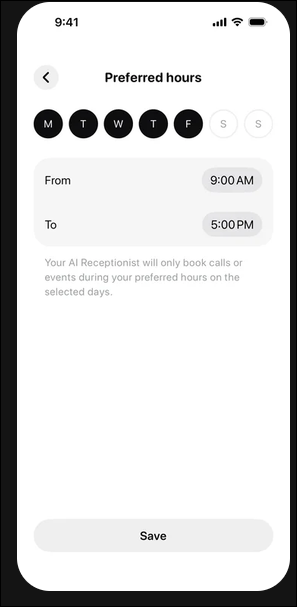
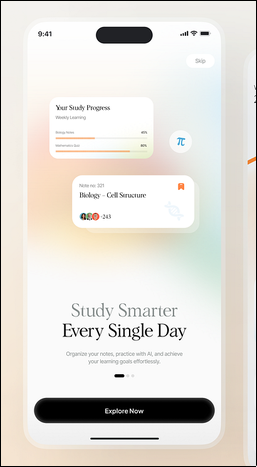

# Design references

Screenshots the user has saved as references. Each file is a spec to match, not a
loose mood (see the "match reference images" rule).

## preferred-hours-schedule.png

Saved October 8, 2026, at the user's request as UI inspiration.

A clean white "Preferred hours" settings screen from an AI-receptionist app. Top to
bottom: a round back button with a centred bold title; a row of seven circular day
toggles (M T W T F filled black for selected, S S outlined grey for off); one soft
grey rounded card with two rows, "From" and "To", each with a grey pill time chip
(9:00 AM, 5:00 PM); a short grey footnote explaining what the hours do; lots of empty
space; a full-width pale grey pill "Save" button pinned at the bottom.

What's worth taking from it:

- **Day circles.** Filled for on, outlined for off, all seven in one even row. A
  direct fit for Locturne's schedule day picker.
- **Two-row time card.** Label left, compact time pill right, one grey container,
  no dividers or icons. Fits bedtime and wake-time editing (the pill opens the native
  time picker; see the native iOS controls rule).
- **Footnote under the card** that says in one sentence what the setting does.
- **One quiet action pinned at the bottom.**

This is inspiration for layout and hierarchy, not a change to Locturne's dark palette.

## study-smarter-onboarding.png

Saved October 7, 2026, at the user's request as UI inspiration.

An airy study-app onboarding screen with floating white cards, a warm pastel
background, generous whitespace, a large editorial headline and a black pill CTA.
Reference for restrained hierarchy, soft card edges and a premium finish. This is
inspiration, not a change to Locturne's dark palette or rounded type direction.

## lavender-glass-health-ring.png

Saved September 26, 2026. The user said: "this is good."

A Dribbble-style concept for a smart ring health app, shown as three iPhone screens:

1. **Welcome.** A floating rock island with crystals and lavender, with the ring on
   top. Headline "Understand. / Optimize. / Live Better." with the last line in
   purple. Dark pill "Create Account" button and a pale "Log in" button.
2. **Home dashboard.** "Good morning, Jesse!" with an avatar. A two-column grid of
   frosted cards (Activity goal 84%, Sleep quality 8h 22m with a sparkline,
   Readiness "Optimal" with a 93 ring, Heart rate, Charging, Cycle status with a
   row of moon phases). Floating pill tab bar.
3. **Sleep quality.** Day/Week/Month segmented control, a large 8h 22m progress ring,
   a sleep timeline chart (Awake, REM, Deep, Light in purple, blue and yellow), and
   an Insights card.

What's worth taking from it:

- **Palette:** pale lavender and lilac surfaces, violet accents, near-black text. A
  light theme, not dark-with-one-accent.
- **Cards:** frosted, translucent white on lavender, large corner radius, soft
  neutral shadows, thin light borders.
- **Type:** clean geometric sans. Big numbers with small units ("8h 22m", "76 bpm").
- **Sleep data display:** progress ring plus the stage timeline. Both fit a
  Locturne morning or sleep summary.
- **Moon phase row** on the Cycle card suits Locturne's night and moon theme.

Caution: the heart-rate card has a blurred purple blob. Under the no-glow rule, don't
copy that part unless the user asks for it.

## opal-home.png

Saved September 28, 2026, as the reference for Locturne's home screen (the user was
unhappy with a crisp lock drawn on the blurred moon).

Opal's home tab, top to bottom: the "Opal" wordmark top-left with a "Yesterday ⌄"
day picker and a gift icon top-right; a large, sharp, rendered opal gem on a black
pedestal, centred on a pure black background; a big "3h 34m" with a small caps caption
"SCREEN TIME YESTERDAY"; three stat columns (MOST USED with app icons, FOCUS LEVEL 89%,
PICKUPS 119); an hourly bar chart (mint gradient bars, red for distracted time); a
"Time Offline 10h 46m / 72% of your day" row; a "Start Blocking Session ▶" bar pinned
above a standard four-tab bar.

What's worth taking from it:

- **The hero is in focus.** The only art on the screen is one crisp object; the
  background is flat. Nothing sharp sits on a blurry layer.
- **Brand lives in the hero, the wordmark and the accent colour.** Everything else is
  SF Pro, SF Symbols and plain rows with no cards.
- **One big number with a small caps caption**, then a row of three small stats.
- **One primary action pinned above the tab bar.**

Caution: the gem has a coloured glow behind it. Under the no-glow rule, don't copy it;
the moon's own glow is already user-approved.

## glassmorphism-cards.png

Saved September 28, 2026, as the reference for glass on Home. The user asked for the Apps
and Schedule box to have "liquid glassy effect and apple premium look" like this.

A "Glass Morphism" promo: a dark banking app with a frosted card over coloured light,
a thin light rim, and white text on it.

What's worth taking from it: translucent panes that blur the colour behind them, a thin
rim brighter at the top, a faint diagonal sheen. Built as `src/components/glass-card.tsx`
(real liquid glass on iOS 26). The pink and orange blobs are not ours; our colour behind
the glass is the onboarding sky's blue light.

## Other files

- `apple-health-days-active.png`: see docs/DAY_PICKER_REFERENCES.md.
- `onboarding-palette-board.png`: see docs/COLOR_RESEARCH.md, section 6.
- `monochrome-slate-navigation.png`: earlier navigation reference.
