# Alarmy - Loud alarm clock Onboarding, Paywall & UX Flow — 138 Screens, $600k/mo

Source: https://screensdesign.com/apps/alarmy-loud-alarm-clocksleep/ (fetched 2026-10-05)

Stats: 

| # | Time | Image | What the screen shows |
|---|---|---|---|
| 1 | 00:00 |  | Splash screen with a centered red-to-orange gradient alarm clock icon on a dark background. |
| 2 | 00:03 |  | Alarmy onboarding screen highlighting social proof with a trophy icon, download stats, and a red Next button. |
| 3 | 00:06 | 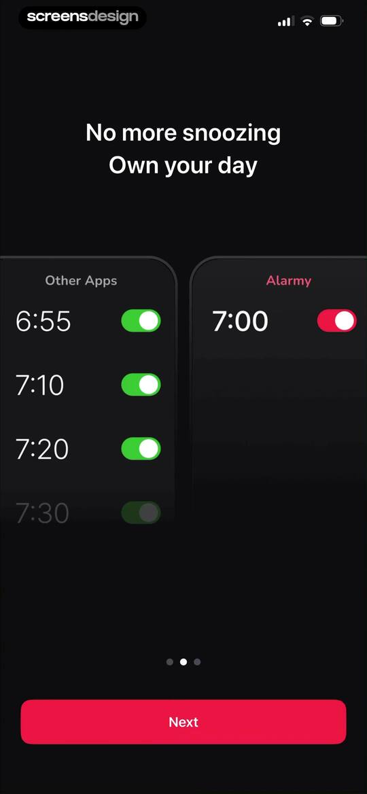 | Alarmy app onboarding comparison screen showing side-by-side alarm lists for other apps and Alarmy, with pagination dots and a Next button. |
| 4 | 00:08 | 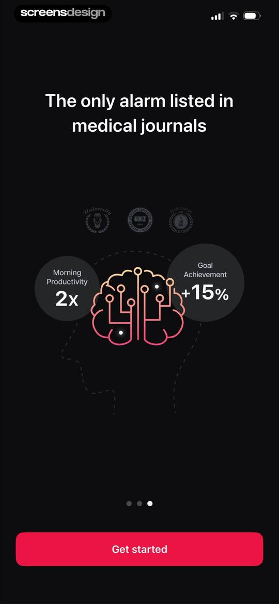 | Dark-themed onboarding screen highlighting medical journal endorsements and productivity benefits, with a Get started button. |
| 5 | 00:15 | 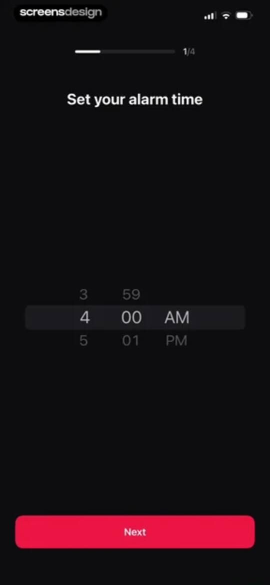 | Alarmy onboarding screen with a time picker set to 4:00 AM, a 1/4 progress indicator, and a red Next button. |
| 6 | 00:18 | 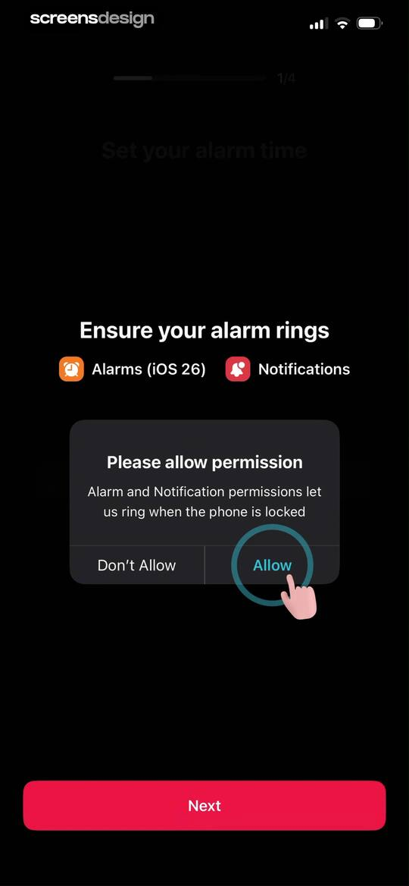 | Permission request onboarding screen for Alarmy with a progress indicator at 1/4 and a modal asking to allow alarm and notification permissions. |
| 7 | 00:20 | 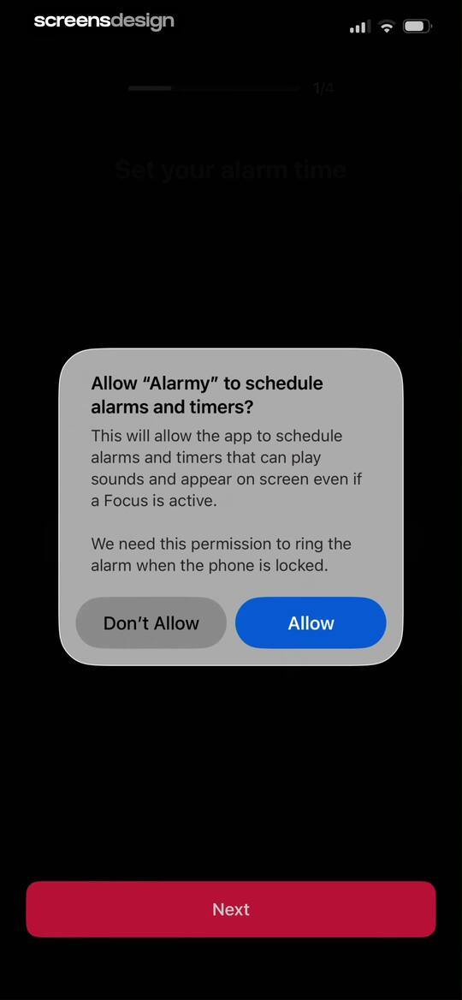 | Permission request screen in Alarmy asking to schedule alarms and timers, featuring a system modal with Allow and Don't Allow buttons. |
| 8 | 00:23 | 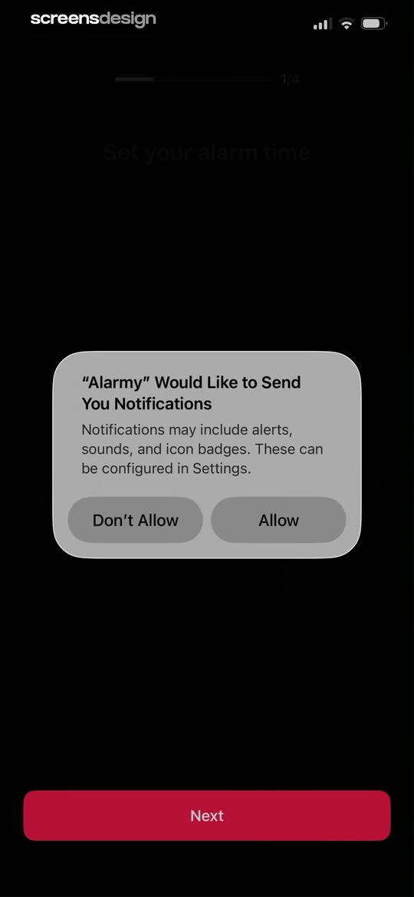 | Alarmy onboarding permission screen displaying a notification request modal with Allow and Don't Allow options and a Next button. |
| 9 | 00:25 | locked | Alarmy onboarding screen prompting the user to choose an alarm wallpaper from horizontal scrolling categories including Trending and Into Space. |
| 10 | 00:35 | locked | Background selection screen displaying a starry night sky photo with a large time display and a red Select button at the bottom. |
| 11 | 00:43 | locked | Alarm sound selection onboarding screen with trending options, a selected sound, and a Next button. |
| 12 | 00:56 | locked | Alarm volume configuration modal with a volume slider at ninety-five percent, a gentle wake-up toggle, and a Next button. |
| 13 | 01:07 | locked | Onboarding screen titled Choose a wake-up mission with a vertical list of five options including Math, Typing, and Shake. |
| 14 | 01:10 | locked | Alarmy onboarding screen for choosing a wake-up mission, highlighting the Math option with a product mockup and a Next button. |
| 15 | 01:17 | locked | Alarmy onboarding completion screen featuring a pink character mascot, a fully loaded progress bar, and the text All set! 100%. |
| 16 | 01:19 | locked | Alarmy permission request screen explaining tracking benefits with a list of three icons and a red Next button at the bottom. |
| 17 | 01:20 | locked | Permission request screen from the Alarmy app displaying a tracking transparency modal over a dark background with a red Next button. |
| 18 | 01:23 | locked | Alarmy subscription paywall comparing yearly, monthly, and lifetime plans with a seven-day free trial, featuring social proof and a red Start Free Trial button. |
| 19 | 01:26 | locked | Subscription screen presenting yearly, monthly, and lifetime plans, with the yearly plan selected and a Start Free Trial button. |
| 20 | 01:33 | locked | Subscription checkout screen featuring an iOS in-app purchase confirmation modal for a yearly plan with a 7-day free trial. |
| 21 | 01:37 | locked | Subscription confirmation modal with a successful purchase message and an OK button, overlaid on a dark-themed Alarmy paywall screen. |
| 22 | 01:41 | locked | Alarmy Pro subscription confirmation screen welcoming the user with feature cards and a Continue button. |
| 23 | 01:44 | locked | Alarmy Pro paywall screen highlighting alarm upgrades, report upgrades, and ad-free features, with a Continue button at the bottom. |
| 24 | 01:51 | locked | Alarmy sign-in onboarding screen with a cloud sync illustration, a Continue with Apple button, and terms links. |
| 25 | 01:57 | locked | Sign in with Apple authentication modal overlaying a subscription confirmation screen with a Continue button. |
| 26 | 02:03 | locked | Home screen displaying a list of alarm cards with weekday and weekend toggles, next ring status, and a bottom navigation bar. |
| 27 | 02:09 | locked | Alarm permission screen requesting camera access for the Household Item Hunt feature, featuring a viewfinder and an Allow permission button. |
| 28 | 02:18 | locked | Item selection screen with category tabs and a grid of icon cards, featuring an OK confirmation button. |
| 29 | 02:39 | locked | Permissions screen showing an alarm mission setup with a system modal requesting camera access, featuring Don't Allow and Allow buttons. |
| 30 | 02:42 | locked | Alarm creation editor with a time picker, day selection, mission grid, and a red Save button. |
| 31 | 02:56 | locked | Mission selection modal displaying categorized lists of popular, brain, and body alarm tasks with a dark theme. |
| 32 | 02:59 | locked | Alarm setup configuration screen for a household item hunt mission, featuring a camera preview for a cup and a Done button. |
| 33 | 03:13 | locked | Math alarm mission settings screen with a difficulty slider ranging from very easy to hell mode and a Done button. |
| 34 | 03:20 | locked | Alarmy wake-up check feature configuration modal with a smartwatch illustration and a Try it out button. |
| 35 | 03:27 | locked | Settings screen for configuring wake up check timing options, with the Off option selected. |
| 36 | 03:36 | locked | Alarm settings screen with grouped sound and custom configuration cards, showing the Birdsong in the Morning sound and a Save button. |
| 37 | 03:39 | locked | Sound selection settings screen with the Calm category tab and Birdsong in the Morning option selected, plus an Add sound floating button. |
| 38 | 03:45 | locked | Settings modal for gentle wake-up duration with thirty seconds selected in a list of time options. |
| 39 | 03:52 | locked | Alarm management home screen with a promotional banner, a vertical list of alarm cards with toggle switches, and a bottom navigation bar. |
| 40 | 04:02 | locked | Alarm management home screen with a vertical list of alarm cards, an open floating action menu in the bottom right, and a bottom navigation bar. |
| 41 | 04:05 | locked | Habit alarm configuration form with a text input field for a habit goal, a grid of recommended habit cards, and a done button. |
| 42 | 04:09 | locked | Habit alarm configuration form with time, repeat days, mission slots, sound settings, and a save button. |
| 43 | 04:25 | locked | Alarmy app alarm trigger screen displaying Monday, May 11 at 2:33, with a Snooze button and a Start Mission button. |
| 44 | 04:31 | locked | Alarm dismissal camera screen with a glasses mission object, a flash warning message, and bottom capture and flash controls. |
| 45 | 04:35 | locked | Alarm task completion screen showing a success checkmark over a glasses illustration and a timer reading 15.2. |
| 46 | 04:39 | locked | Math puzzle screen displaying the problem 4+3= with the correct answer 7 selected in green and a checkmark. |
| 47 | 04:42 | locked | Alarmy app math puzzle screen displaying the problem 5+9= with the correct answer 14 selected in green. |
| 48 | 04:43 | locked | Alarmy post-mission success screen featuring a yellow thumbs-up icon, the message Good job!, and a 2/2 progress indicator on a dark background. |
| 49 | 04:45 | locked | Alarmy greeting screen on a dark background displaying a yellow checkmark icon and the text Good afternoon! |
| 50 | 04:48 | locked | Morning dashboard with weather details, a feature grid, and a wake-up check card featuring a countdown timer and a Turn off now button. |
| 51 | 04:52 | locked | Alarmy confirmation modal for disabling the wake-up check feature with instructional text, a countdown timer, and a Start signing button. |
| 52 | 05:31 | locked | Wake-up verification screen in the Alarmy app featuring a countdown timer, confirmation statement, and Complete button. |
| 53 | 05:41 | locked | Morning dashboard displaying Manila weather, a feature grid with a daily tarot card, and a motivational quote card at the bottom. |
| 54 | 05:45 | locked | Feedback modal overlay on an alarm dashboard, asking how the app is so far with Great and Not sure buttons. |
| 55 | 05:47 | locked | Alarm app home screen with a centered rating modal overlay and a rate button. |
| 56 | 05:50 | locked | Alarm management home screen displaying a list of scheduled alarms, a top promo card, and an open pop-up menu for creating new alarms. |
| 57 | 05:53 | locked | Alarm creation screen with a time picker, repeat settings, mission section, and a red Save button. |
| 58 | 06:05 | locked | Alarm management home screen in dark mode featuring a vertical list of scheduled alarms, a top promotional card, and a bottom navigation bar. |
| 59 | 06:07 | locked | Alarm management home screen displaying a list of scheduled alarms with a delete alarm confirmation modal and a bottom navigation bar. |
| 60 | 06:15 | locked | Alarm app home screen featuring a list of scheduled alarms, a countdown timer, and an open context menu with management options. |
| 61 | 06:18 | locked | Alarm home screen featuring a countdown timer, a vertical list of scheduled alarms with toggle switches, and a bottom navigation bar. |
| 62 | 06:31 | locked | Dark-themed alarm management home screen displaying a list of scheduled alarms, a floating action button, and a sort menu with options for default and active first. |
| 63 | 06:40 | locked | Sleep dashboard in dark mode with a Track my sleep button and a card showing sound wave details. |
| 64 | 06:43 | locked | Alarmy sleep tracking screen with a dark starry background and centered text instructing the user to place their device near the pillow. |
| 65 | 06:45 | locked | Permissions modal requesting microphone and motion access for sleep tracking, with motion detection selected and a Start sleep analysis button. |
| 66 | 06:46 | locked | Microphone permission request modal displayed over a dark screen with an illustration of a sleeping person and a start sleep analysis button. |
| 67 | 06:49 | locked | Sleep tracking interface with a central waveform, an instructional modal about report details, and a Quit button. |
| 68 | 06:52 | locked | Dark-themed sleep tracking home screen with a central waveform, alarm status, an active tooltip modal, and a bottom sound control card. |
| 69 | 06:53 | locked | Active sleep tracking screen displaying the current time, an audio waveform, ambient noise level, and a Quit button. |
| 70 | 06:56 | locked | Sleep dashboard displaying an active tracking status, a sleep report card, and a bottom navigation bar with the Sleep tab selected. |
| 71 | 07:01 | locked | Active sleep tracking screen with an audio wave visualization, ambient noise details, and a Quit button. |
| 72 | 07:03 | locked | Alarm sound selection modal with category tabs and a selected No sound option. |
| 73 | 07:06 | locked | Sound selection modal with category tabs, a selected White Noise tab, and a grid of sound cards. |
| 74 | 07:11 | locked | Alarmy sound selection modal with category tabs and a grid of sound cards, featuring the selected Alpha wave card. |
| 75 | 07:22 | locked | Sound timer modal overlay with a vertical duration picker set to 10 minutes and a Done button, over a dark audio player background. |
| 76 | 07:31 | locked | Sleep tracking confirmation modal warning that the sleep report will be lost, with a sleep preview chart, Keep tracking, and Quit buttons. |
| 77 | 07:36 | locked | Alarmy sleep report analytics screen with a no sleep record empty state, Track my sleep button, and sleep stage legend. |
| 78 | 07:40 | locked | Analytics report screen with the Wake up report tab selected, showing an empty alarm record state and a daily report link. |
| 79 | 07:45 | locked | Alarm history empty state showing a horizontal date selector for May 2026, wake-up time data labels, and a no alarm record message. |
| 80 | 07:48 | locked | Alarmy app alarm schedule dashboard with a horizontal date selector, May 11 selected, and a list of scheduled alarms below. |
| 81 | 07:52 | locked | Calendar date selection screen showing the month of May 2026 with a date strip and a centered calendar modal. |
| 82 | 07:58 | locked | Sleep report analytics screen with an empty state, sleep tracking button, and average metric placeholders on a dark background. |
| 83 | 08:00 | locked | Habit report dashboard with a Wake up early habit record card showing a zero streak count and the selected Habit report tab. |
| 84 | 08:02 | locked | Habit report dashboard displaying progress stats and a May 2026 calendar card for tracking a Wake up early habit. |
| 85 | 08:11 | locked | Morning dashboard showing Manila weather, feature cards for daily routines, and an inspirational quote by David Goggins. |
| 86 | 08:17 | locked | Weather dashboard displaying current conditions in Pandi at 35 degrees with air quality, a metric grid, hourly forecast, and weekly forecast list. |
| 87 | 08:26 | locked | Alarmy weather settings screen displaying location set to Pandi and temperature unit set to Celsius. |
| 88 | 08:28 | locked | Location settings screen with a city search input and the current location Pandi selected in a list. |
| 89 | 08:48 | locked | Reward notification screen displaying a level progress indicator, a character, and a message confirming the receipt of 100 points. |
| 90 | 08:50 | locked | Virtual pet care dashboard displaying the hungry character Egg Larmy with feeding options for kibble and cake. |
| 91 | 08:54 | locked | Dashboard showing a virtual pet character with interactive feeding cards including a Cake option labeled for a rewarded ad. |
| 92 | 08:57 | locked | Gamified pet-care dashboard featuring the egg character Egg Larmy with a speech bubble, progress header, and a bottom food selection panel. |
| 93 | 09:02 | locked | Monetization modal offering double experience points for watching an ad, with a feed cake button and close link. |
| 94 | 09:05 | locked | Reward screen in Alarmy featuring a modal overlay to watch ads for character rewards and experience points, with bottom navigation icons. |
| 95 | 09:28 | locked | Alarmy virtual pet dashboard featuring the Egg Larmy character with level status, currency counter, and feeding cards for Kibble and Cake. |
| 96 | 09:34 | locked | Level up achievement screen in the Alarmy app displaying a level 2 badge and a smiling egg character illustration with a glowing effect. |
| 97 | 09:41 | locked | Virtual pet progression screen for Wiggy Larmy showing growth milestones and a playful green landscape theme. |
| 98 | 09:46 | locked | Progression path screen with numbered reward badges and a final character reveal on a green background. |
| 99 | 09:49 | locked | Alarmy collection screen displaying a grid of character cards with locked slots and an unlocked Bartender character. |
| 100 | 09:54 | locked | Alarmy collection modal displaying a locked special Larmy character silhouette with a Close button below. |
| 101 | 10:16 | locked | Dashboard with a central character illustration, bottom selection cards including a Bidet ad card, and a bottom navigation bar. |
| 102 | 10:25 | locked | Virtual pet dashboard featuring a character named Wiggy Larmy with cleaning interaction cards and a bottom care navigation bar. |
| 103 | 10:28 | locked | Pet care dashboard highlighting the character Wiggy Larmy with interactive soap and body wash cards on a dark background. |
| 104 | 10:37 | locked | Home screen displaying a level 2 virtual character with a speech bubble saying Sleepy... put me to bed... and a Put to sleep button. |
| 105 | 10:44 | locked | Alarmy points redemption screen displaying a 116 points balance and three subscription pass cards for 7, 14, and 30 days. |
| 106 | 10:48 | locked | Collection gallery screen in the Alarmy app displaying locked and unlocked character cards with instructions to reach level 10. |
| 107 | 10:52 | locked | Alarmy app gamification screen displaying the Wiggy Larmy character card with an egg status update, progress path, and bottom prompt. |
| 108 | 10:59 | locked | Morning mood selection modal featuring a list of emoji options with Calm selected and a Save button. |
| 109 | 11:05 | locked | Morning feeling mood selection modal with the No feeling option selected and a Save button against a dark calendar background. |
| 110 | 11:10 | locked | Date selection modal overlaying a morning feeling log list, featuring month and year pickers with an OK button. |
| 111 | 11:16 | locked | Daily Tarot modal featuring a centered tarot card deck graphic over a zodiac wheel background and a close button. |
| 112 | 11:18 | locked | Daily tarot reading screen featuring the Judgement card, a lucky score of 97, and category icons for love, money, and career. |
| 113 | 11:23 | locked | Daily money fortune screen featuring a zodiac background, character avatar, and a card selection carousel prompting the user to pick a card. |
| 114 | 11:25 | locked | Daily money insight screen with a zodiac theme, date prompt, a fan of cards, and an Open card button. |
| 115 | 11:28 | locked | Financial tarot reading screen featuring the Ace of Wands card, fortune details for May 11, and a daily advice card. |
| 116 | 11:35 | locked | Alarmy subscription paywall displaying a points balance of 116, a claim banner, and three Pro pass options ranging from 7 to 30 days. |
| 117 | 11:37 | locked | Alarmy subscription modal for a 7-day Pro pass costing 800 points, displaying a disabled purchase button because the user has only 116 points. |
| 118 | 11:41 | locked | Motivational quote screen displaying a quote by David Goggins, with a save button, share button, and swipe instruction. |
| 119 | 11:47 | locked | Motivational quote screen displaying the text Wellness grows with steady habits in a dark theme, with save and share buttons. |
| 120 | 11:50 | locked | Daily quote theme selection screen with a grid of icon cards, showing the Inner Peace option selected and a bottom Save button. |
| 121 | 11:58 | locked | Social sharing screen displaying an inspirational quote card from Alarmy with a list of sharing options including Instagram. |
| 122 | 12:01 | locked | System share sheet modal overlaying a quote card, with options for AirDrop, Messages, Mail, and other device actions. |
| 123 | 12:02 | locked | System permission modal requesting photo library access for Alarmy, with Allow and Don't Allow buttons over a dark background. |
| 124 | 12:17 | locked | Alarmy report dashboard with the Wake up report tab selected, showing an empty state with no alarm record for the week and a button to view daily reports. |
| 125 | 12:20 | locked | Settings screen with a user profile card, points balance, Pro subscription status, and a list of app configuration options in dark mode. |
| 126 | 12:22 | locked | Account settings screen displaying login information, sync status, and options to sign out or delete the account. |
| 127 | 12:26 | locked | Subscription screen displaying a points balance and a vertical list of three Alarmy Pro pass options with point costs. |
| 128 | 12:30 | locked | Subscription management screen displaying active Pro status on a yearly plan, feature usage statistics, and a Cancel Subscription button. |
| 129 | 12:33 | locked | Permission request screen for Screen Time access to prevent app uninstall, with a central modal and a large red enable button. |
| 130 | 12:39 | locked | Penalty configuration screen displaying a self-penalty rate of one dollar per cheat, a no card registered warning, and a set penalty button. |
| 131 | 12:42 | locked | Alarmy app settings screen displaying an advanced alarm configuration option for the mission time limit. |
| 132 | 12:48 | locked | Theme settings screen with options for Dark, Light, and Follow system setting, with Dark currently selected. |
| 133 | 12:50 | locked | Theme settings screen with three selectable options, showing the Light option currently selected with a cyan radio button. |
| 134 | 12:55 | locked | Sound output settings screen with two options to select the alarm audio device, showing the current device selected. |
| 135 | 12:59 | locked | Notification setting screen in the Alarmy app with a permission prompt and toggleable service and promotion notification cards. |
| 136 | 13:07 | locked | Alarmy system configuration settings screen with options for app language and battery saving mode. |
| 137 | 13:10 | locked | App language settings screen with a vertical list of selectable languages and Follow system setting selected. |
| 138 | 13:16 | locked | Alarmy app settings screen displaying the app version, a Rate app button, and legal links with a close button at the bottom. |

## Free showcase screenshots (unordered)

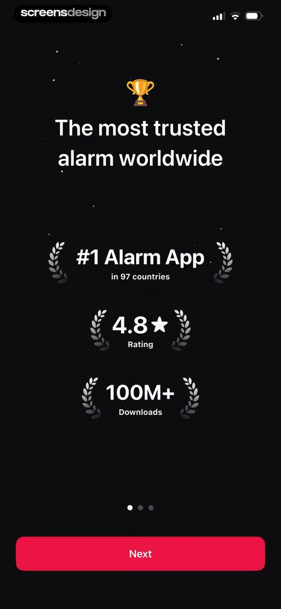
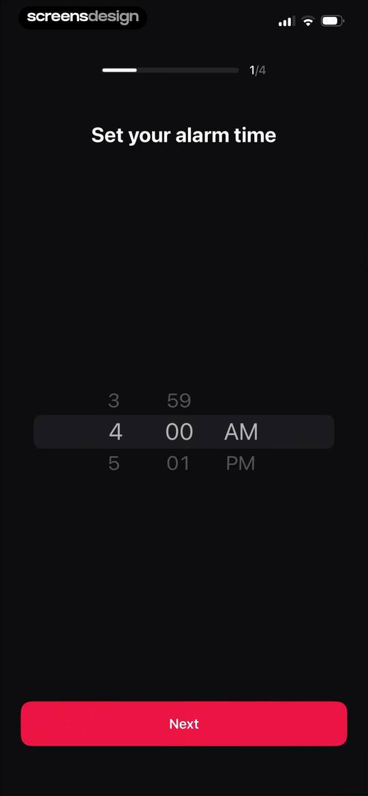
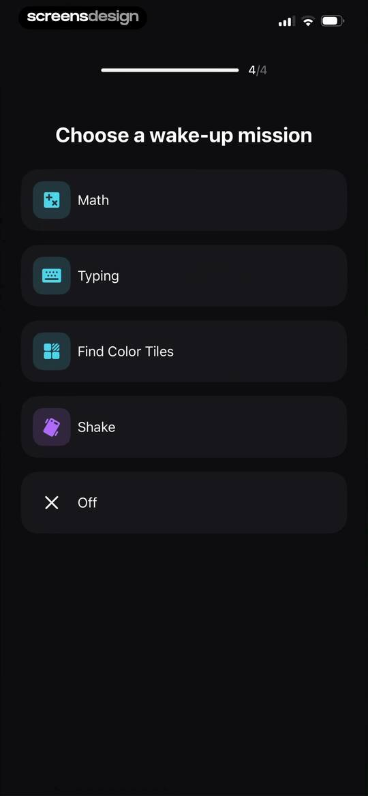

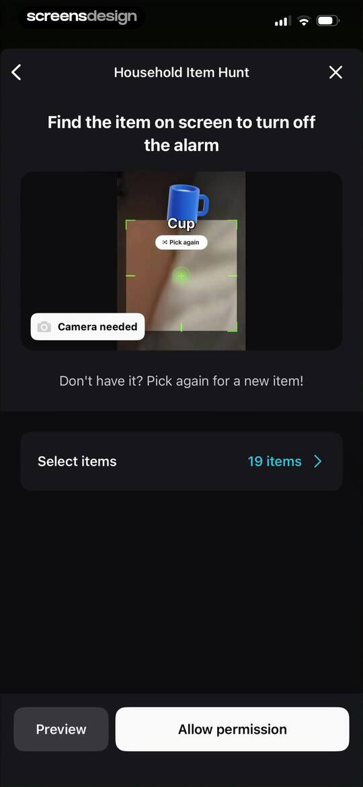
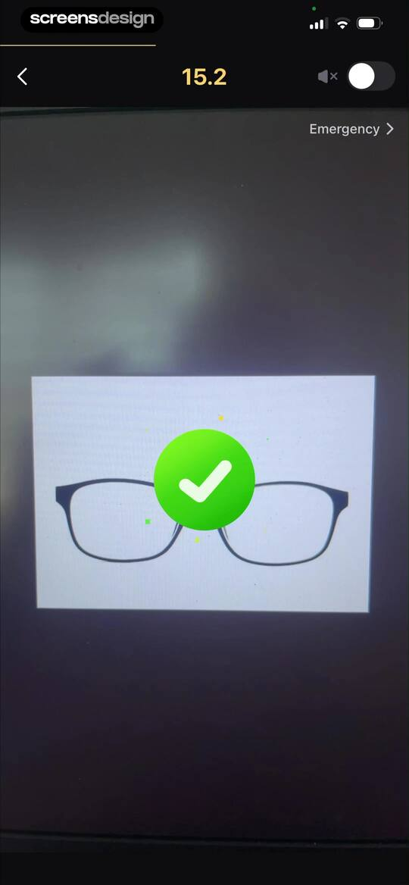

