# BetterMe Well-Being Coach Onboarding, Paywall & UX Flow — 215 Screens, $1M/mo

Source: https://screensdesign.com/apps/betterme-health-coaching/ (fetched 2026-10-05)

Stats: 

| # | Time | Image | What the screen shows |
|---|---|---|---|
| 1 | 00:00 | 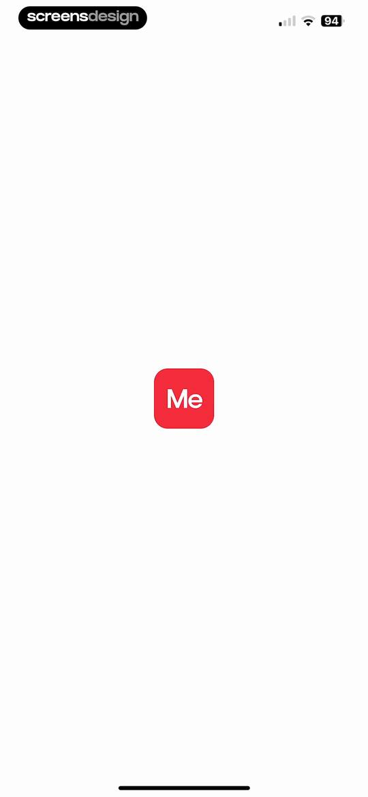 | App splash screen with a centered red logo containing the text Me on a white background. |
| 2 | 00:05 | 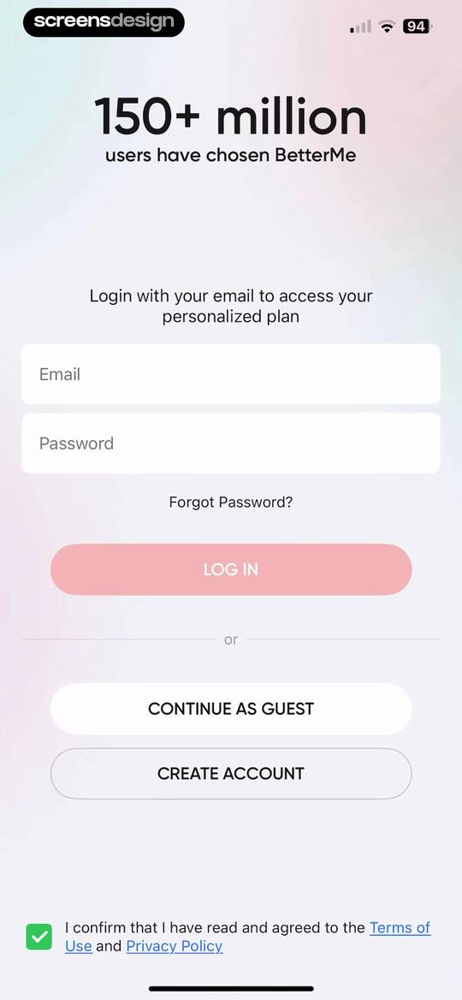 | BetterMe login screen with email and password fields, social proof header, and options to log in, continue as guest, or create an account. |
| 3 | 00:26 | 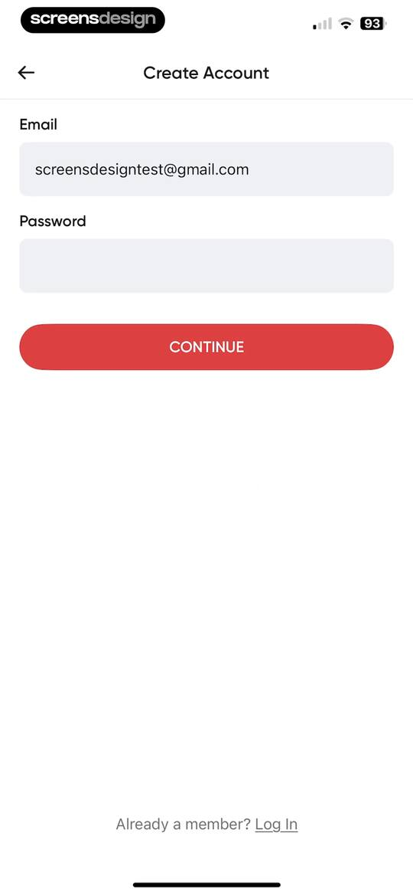 | Account creation form with an email input field containing a sample address, an empty password field, a red Continue button, and a Log In link at the bottom. |
| 4 | 00:29 | 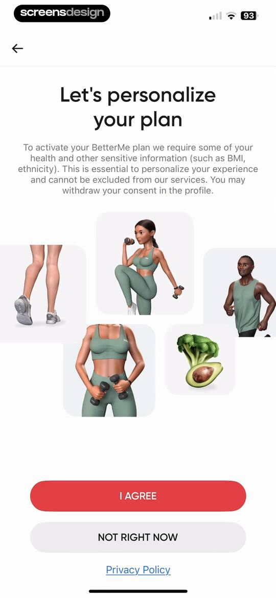 | BetterMe onboarding consent screen explaining health data collection, featuring fitness illustrations, an I AGREE button, and a Privacy Policy link. |
| 5 | 00:36 | 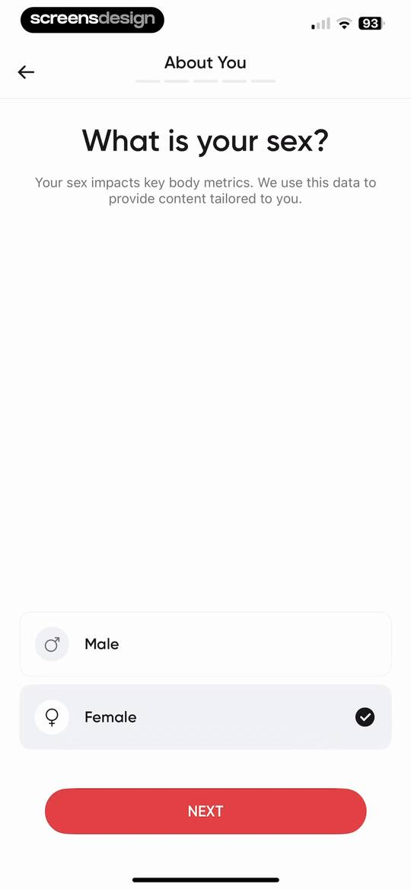 | Onboarding screen asking for sex with Male and Female selection cards, with Female selected and a red Next button. |
| 6 | 00:44 | 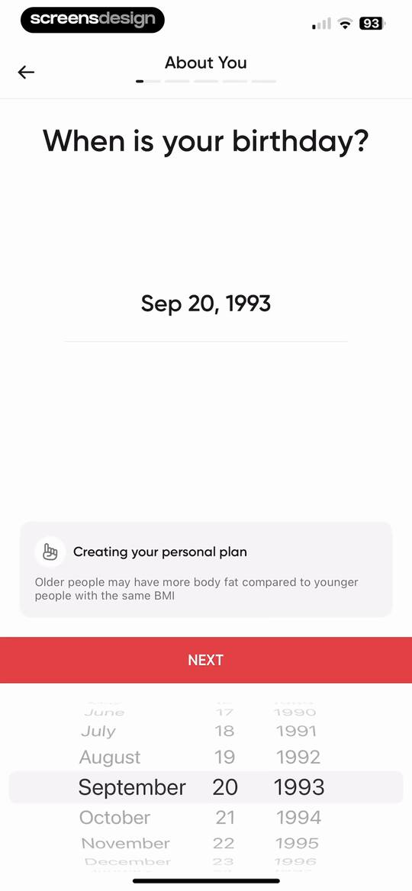 | Onboarding birthday input screen with a date picker wheel set to September 20, 1993, an informational card, and a Next button. |
| 7 | 00:47 | 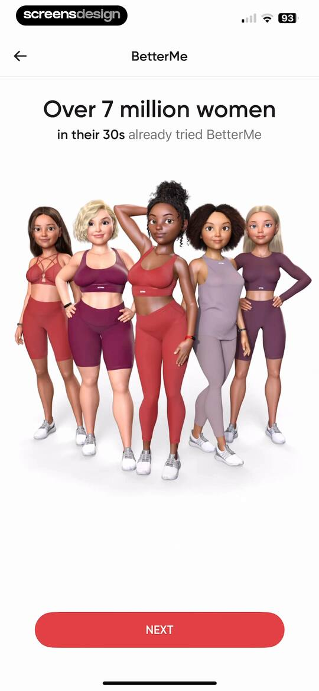 | BetterMe onboarding screen featuring social proof for women in their 30s, a 3D character illustration, and a Next button. |
| 8 | 00:51 | 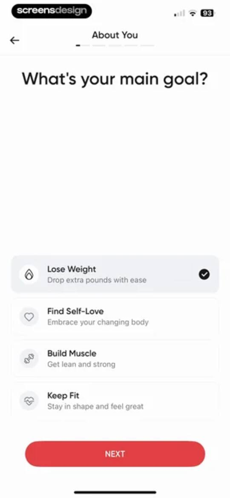 | Fitness app onboarding goal selection screen with four options, Lose Weight selected with a checkmark, and a Next button. |
| 9 | 00:55 | locked | Onboarding screen asking about weight history, with the option Less Than a Year Ago selected and a Next button. |
| 10 | 01:03 | locked | Onboarding screen asking What are you interested in? with a list of health and fitness goals and a Next button. |
| 11 | 01:06 | locked | Notification permission request screen in the BetterMe app displaying a system modal with Allow and Don't Allow buttons over fitness onboarding text. |
| 12 | 01:08 | locked | BetterMe onboarding screen featuring fitness motivation text and a red Next button at the bottom. |
| 13 | 01:12 | locked | Onboarding screen asking whether to include special programs, with No Thanks selected and a Next button. |
| 14 | 01:22 | locked | Onboarding activity selection screen with Fitness at Home, Walking, and Stretching selected from a list and a Next button. |
| 15 | 01:35 | locked | Fitness app onboarding screen asking which area needs attention, featuring a 3D character model, selectable body part cards, and a Next button. |
| 16 | 01:41 | locked | Onboarding screen asking for body type with a 2x2 grid of 3D avatar cards, the Pear option selected, and a red NEXT button. |
| 17 | 01:45 | locked | Onboarding screen asking for dream body shape with a 2x2 selection grid, the Toned option selected, and a red Next button. |
| 18 | 01:51 | locked | Onboarding questionnaire asking about daily routine, with the At the Office option selected and a Next button. |
| 19 | 01:56 | locked | Onboarding screen asking about daily energy levels, with three selectable habit cards, the first card selected, and a Next button. |
| 20 | 02:00 | locked | Fitness app onboarding screen asking about activity level, with 1-2 Workouts a Week selected and a red Next button. |
| 21 | 02:04 | locked | Onboarding screen asking about sleep duration, with the 5-6 Hours option selected and a Next button. |
| 22 | 02:08 | locked | Diet selection onboarding screen listing various diet types with the Traditional option selected and a Next button. |
| 23 | 02:12 | locked | BetterMe nutrition onboarding screen asking what to exclude, with the I eat everything option selected and a Next button. |
| 24 | 02:17 | locked | Onboarding screen asking about bad nutrition habits with a vertical list of selectable habit cards, with the salty foods option selected and a Next button. |
| 25 | 02:23 | locked | Onboarding screen asking for daily water intake, with four selection cards and a Next button. |
| 26 | 02:27 | locked | Onboarding question about user motivation with Yes and No selection cards and a Next button. |
| 27 | 02:31 | locked | BetterMe onboarding questionnaire screen presenting a motivation statement, with the No card selected and a Next button. |
| 28 | 02:36 | locked | Fitness onboarding height selection screen displaying a height picker set to 151 cm, a BMI explanation card, and a Next button. |
| 29 | 02:41 | locked | BetterMe onboarding weight input screen displaying a BMI feedback card and a weight picker with a Next button. |
| 30 | 02:47 | locked | Fitness app onboarding screen asking for goal weight, displaying a central 50 kg weight display, an informational benefits card, a weight picker, and a red Next button. |
| 31 | 02:51 | locked | Onboarding name entry screen with a filled text field for julia and a red Next button. |
| 32 | 02:55 | locked | Fitness app onboarding summary screen displaying a BMI slider, profile attributes, and a health risks info card with a NEXT button. |
| 33 | 03:00 | locked | Onboarding pace selection screen with three options, the Slow and Steady card selected, and a red Next button. |
| 34 | 03:04 | locked | Onboarding goal selection screen with a vertical list of health goals, with Feel Healthier selected and a Next button. |
| 35 | 03:10 | locked | Onboarding screen asking about a special event for weight loss, with No Special Event selected and a Next button. |
| 36 | 03:14 | locked | Wellness plan onboarding screen displaying a weight loss projection chart, a goal of 50 kg by Jul 5, 2025, and a Next button. |
| 37 | 03:27 | locked | Onboarding loading screen showing a 100% circular progress indicator and a vertical list of completed plan creation steps. |
| 38 | 03:29 | locked | Permissions modal on a personalized fitness plan onboarding screen, asking to track activity with options to allow or ask app not to track. |
| 39 | 03:32 | locked | Onboarding summary screen displaying a personalized four-week weight loss plan, a progress trend chart, and a Get My Plan button. |
| 40 | 03:42 | locked | Subscription paywall screen detailing a seven-day free trial timeline, pricing, and a prominent start free week button. |
| 41 | 03:48 | locked | App Store subscription confirmation modal for BetterMe displaying a one-week free trial followed by a monthly plan and a subscribe action. |
| 42 | 03:54 | locked | Paywall success confirmation modal overlaying a trial timeline with an OK button. |
| 43 | 03:58 | locked | Paywall screen presenting three subscription plan options with discount badges, a list of benefits with checkmarks, and an add to trial plan button. |
| 44 | 04:05 | locked | iOS system payment modal over a BetterMe subscription paywall, detailing a 1-week free trial and a confirm with side button action. |
| 45 | 04:13 | locked | Paywall screen displaying subscription plans and an overlay modal indicating a successful purchase with an OK button. |
| 46 | 04:17 | locked | Paywall screen emphasizing the importance of nutrition over exercise for weight loss, featuring a data visualization and an Add To My Plan button. |
| 47 | 04:30 | locked | Paywall offering a 50 percent discount on the BetterMe Sugar-Free Challenge, with a customer testimonial, feature list, and an Add to My Plan button. |
| 48 | 04:35 | locked | Checkout screen displaying an in-app purchase modal for a BetterMe challenge priced at $29.99 with a side button confirmation prompt. |
| 49 | 04:44 | locked | Paywall screen promoting a flat belly challenge add-on with benefit bullets and an Add to My Plan button. |
| 50 | 04:48 | locked | Paywall screen for the BetterMe Flat Belly Challenge featuring a Trustpilot testimonial carousel, a 50% discount offer, and an Add to My Plan button. |
| 51 | 04:53 | locked | Fitness onboarding screen with a photo of a woman, a four-minute workout duration card, and a bottom Start button. |
| 52 | 04:58 | locked | Loading screen displaying a workout download progress bar over a blurred fitness background with a skip button in the top right corner. |
| 53 | 05:05 | locked | Workout session screen displaying an exercise video with a countdown timer, stats row, navigation buttons, and an exercise info card. |
| 54 | 05:11 | locked | Workout session screen displaying a live exercise timer, progress bar, and a card for the Plie Squat with Alternating Calf Raise. |
| 55 | 05:35 | locked | Workout player screen showing a video exercise with elapsed time, calorie count, and a preview card for the next exercise. |
| 56 | 05:39 | locked | Workout player interface showing an exercise video, progress bar, stats, navigation buttons, and an Angel Arms exercise card. |
| 57 | 05:41 | locked | Workout player screen with a video demonstration, elapsed time and calorie stats, exercise navigation buttons, and a bottom card previewing the next exercise. |
| 58 | 05:43 | locked | Workout player interface displaying an exercise video, elapsed time and calorie metrics, navigation buttons, and a card for the current exercise. |
| 59 | 05:47 | locked | Workout player screen showing an exercise video, elapsed time metrics, navigation buttons, and a bottom card for Glute Bridge Calf Raise. |
| 60 | 05:51 | locked | Workout tracking screen showing an exercise video player, elapsed time and calorie metrics, navigation buttons, and a Finish Workout summary card. |
| 61 | 05:55 | locked | Success confirmation screen featuring a central checkmark icon over a vibrant red background patterned with 3D emojis and stars. |
| 62 | 05:59 | locked | Workout completion summary in the BetterMe app, showing stats like duration and calories burned, with a CONTINUE button. |
| 63 | 06:04 | locked | Workout completion summary in the BetterMe app featuring a completed status, metrics list, and a Continue button. |
| 64 | 06:09 | locked | Fitness feedback form asking how the user feels with three selectable cards, the first card selected, a Skip button, and a Next button. |
| 65 | 06:12 | locked | Fitness onboarding workout selection screen with a vertical list of selectable workout cards and a skip button at the top right. |
| 66 | 06:18 | locked | Workout details screen for Hourglass Full Body Workout showing a start button, stats, focus zones, and a promotional product card. |
| 67 | 06:26 | locked | Workout detail screen in the BetterMe app displaying the Hourglass Full Body Workout title, metrics, a start button, and a promotional product card. |
| 68 | 06:32 | locked | Workout reminder setup screen with a day selector, a time picker, a skip button, and a schedule button. |
| 69 | 06:39 | locked | Permission request screen asking for calendar access to add workouts and receive reminders, with allow and don't allow buttons. |
| 70 | 06:45 | locked | Dashboard featuring a daily health and fitness checklist with tasks like log calories, workouts, and water intake. |
| 71 | 06:53 | locked | Content feed featuring a mindset illustration, two reading cards, and a bottom listen button for audio playback. |
| 72 | 06:56 | locked | BetterMe onboarding screen explaining stimulus-response psychology with an illustration, page indicator, and bottom buttons for stimulus and response. |
| 73 | 07:00 | locked | Onboarding educational screen about negative thoughts with a central illustration and a Next button. |
| 74 | 07:02 | locked | Onboarding educational screen about negative thoughts and weight loss, featuring an example list and a Next button. |
| 75 | 07:06 | locked | Educational onboarding screen explaining cognitive reframing of negative thoughts with examples of automatic thoughts, inaccuracies, and realities. |
| 76 | 07:09 | locked | Onboarding educational screen explaining how core beliefs fuel automatic thoughts, with explanatory text, two diagrams, and page progress indicator 5/7. |
| 77 | 07:12 | locked | Onboarding educational screen explaining core beliefs with a step-by-step example and a Next button. |
| 78 | 07:14 | locked | Onboarding educational screen explaining core beliefs with stacked negative and positive feedback loop diagrams. |
| 79 | 07:21 | locked | Task completion screen featuring a congratulatory message, a thumbs-up illustration, and a next content recommendation card with a Read Now button. |
| 80 | 07:26 | locked | BetterMe onboarding screen explaining how to identify automatic thoughts, featuring a title and instructional steps with a page indicator. |
| 81 | 07:36 | locked | BetterMe onboarding questionnaire screen with selectable trigger options and a Next button to proceed. |
| 82 | 07:39 | locked | BetterMe onboarding educational screen detailing three steps to recognize, acknowledge, and manage negative thoughts, accompanied by a mindset illustration. |
| 83 | 07:44 | locked | Daily lesson completion modal with a congratulatory message, a thumbs-up illustration, and a See Ya button. |
| 84 | 07:47 | locked | Feedback prompt modal asking how the journey is going with BetterMe, with Great and Could Be Better response buttons. |
| 85 | 07:49 | locked | Chapter educational module featuring a mindset illustration, completed content cards, and a bottom listen action button. |
| 86 | 07:52 | locked | Audio player screen for mindfulness track We Know What You're Thinking!, featuring a progress bar, playback controls, and a chapter list at the bottom. |
| 87 | 08:24 | locked | Settings menu listing Appearance and Reminders options with a close button at the top. |
| 88 | 08:26 | locked | Appearance settings screen with toggles for dark mode and device settings sync. |
| 89 | 08:27 | locked | Appearance settings screen with dark mode enabled and a toggle for using device system settings. |
| 90 | 08:33 | locked | BetterMe reminder settings screen with a daily reminders toggle, time picker wheel set to 7:00 PM, and a Save button. |
| 91 | 08:37 | locked | Content feed listing finished chapters with a completion checkmark and a persistent audio player bar at the bottom. |
| 92 | 08:43 | locked | Statistics dashboard showing locked weight and steps tracking features with a prompt to allow access to Health data. |
| 93 | 08:45 | locked | Permission request screen asking the user to allow the BetterMe app access to health data, featuring an Activate button and a Not Now link. |
| 94 | 08:50 | locked | Permissions screen requesting health data access for BetterMe, featuring a master Turn Off All toggle and a list of specific health categories. |
| 95 | 08:59 | locked | Weight-logging form displaying current weight as 56.0 kg, a date selector, a weight picker wheel, and a red Log Weight button. |
| 96 | 09:03 | locked | Statistics dashboard showing weight tracking with a chart and log weight button, plus a daily steps progress section. |
| 97 | 09:11 | locked | Statistics dashboard displaying empty heart rate and sleep duration metrics with a prompt to connect a fitness tracker. |
| 98 | 09:13 | locked | Fitness tracker setup screen with a product illustration, descriptive text, and setup action buttons. |
| 99 | 09:16 | locked | BetterMe Fitness Tracker onboarding screen introducing the wearable device with a lifestyle photo and a Set Up Your Fitness Tracker button. |
| 100 | 09:21 | locked | Health data permission request modal for BetterMe with a list of synced metrics, two checked consent options, and an I AGREE button. |
| 101 | 09:25 | locked | Permission request modal asking to allow BetterMe to find Bluetooth devices, with Allow and Don't Allow buttons. |
| 102 | 09:28 | locked | BetterMe device pairing screen displaying a searching state with a central fitness tracker illustration and instructional text to keep the tracker close. |
| 103 | 09:33 | locked | Help screen listing troubleshooting steps for connecting a fitness tracker, with options for the User Guide and Support. |
| 104 | 09:40 | locked | BetterMe fitness tracker onboarding screen introducing the device with a central photo and a Set Up Your Fitness Tracker button. |
| 105 | 09:42 | locked | BetterMe fitness tracker onboarding screen explaining how to connect a device later, with a central phone mockup and an OK button. |
| 106 | 09:45 | locked | BetterMe fitness tracker onboarding screen with a central product illustration and buttons to set up a tracker or skip. |
| 107 | 09:49 | locked | Workout home screen with a list of categories and a modal overlay explaining how to save favorite routines, featuring a red Got It button. |
| 108 | 09:53 | locked | Workout library listing categories with a modal explaining offline downloads and a Got It button. |
| 109 | 09:55 | locked | Workout library screen displaying a favorites section and category cards with workout counts, with the Workouts tab selected in the bottom navigation. |
| 110 | 10:00 | locked | Fitness workout list with a horizontal difficulty filter showing the Newbie filter selected and twenty-eight workout cards below. |
| 111 | 10:10 | locked | Fitness workout list with horizontal body part filter tabs, with the Arms tab selected and four workout cards displayed below. |
| 112 | 10:13 | locked | Workout feed displaying a success toast notification, horizontal filter tabs with Arms selected, and a vertical list of arm workout cards. |
| 113 | 10:18 | locked | Workout detail screen for Lean Arms Workout with a start button, stats, and a product promotion at the bottom. |
| 114 | 10:20 | locked | Workout detail screen for Lean Arms Workout, displaying a Start Workout button, duration, calories, and a promotional product card at the bottom. |
| 115 | 10:24 | locked | SharePlay modal overlay for a group workout featuring a recipient input field, Messages and FaceTime action buttons, and a system keyboard. |
| 116 | 10:39 | locked | BetterMe app settings screen for audio and music integration, featuring toggles for audio prompts and music alongside links for Apple Music and Spotify. |
| 117 | 10:45 | locked | Fitness focus zones screen featuring an anatomical illustration with highlighted arms and shoulders, and a back button. |
| 118 | 10:51 | locked | Workout routine overview with a list of 26 exercises, a cool down section, and a Start Workout button. |
| 119 | 10:57 | locked | Exercise detail page for Child's Pose with a hero photo, description, and required equipment section for a Pilates Mat. |
| 120 | 11:06 | locked | Modal overlay announcing landscape mode availability for workout videos, featuring a device rotation illustration and a close button. |
| 121 | 11:17 | locked | Loading screen in BetterMe featuring a blurred workout background, centered text reading Downloading workout with a progress bar, and a skip button in the top right corner. |
| 122 | 11:20 | locked | Workout session screen displaying an exercise video, timer, elapsed stats, and a bottom card for Elbow Rotations with next and previous controls. |
| 123 | 11:36 | locked | Workout player screen displaying a video instructor, timer stats, navigation buttons, and a bottom card for the Side Reach exercise. |
| 124 | 11:41 | locked | Workout end confirmation modal overlaying an active fitness session, with a red No, Go Back button and a Yes, I'm Sure button. |
| 125 | 11:52 | locked | Fitness app workout exit feedback form with the Too Long option selected and a Submit button. |
| 126 | 11:56 | locked | Workout preview screen for Lean Arms Workout featuring metrics, a Start Workout button, and a promotional product card at the bottom. |
| 127 | 12:08 | locked | Favorites screen displaying a list of three saved workout routines with durations and favorited heart icons. |
| 128 | 12:10 | locked | Workout list displaying three fitness routines with a toast notification confirming a workout was removed from favorites. |
| 129 | 12:14 | locked | Downloads management screen listing one downloaded Lean Arms Workout item with a trash can icon to delete the file. |
| 130 | 12:17 | locked | Downloads settings screen with a list of downloaded workouts and a bottom confirmation modal to remove a download. |
| 131 | 12:19 | locked | Downloads empty state screen showing an illustration and instructions on how to download favorite workouts. |
| 132 | 12:25 | locked | Guided challenges feed featuring the 30-Day Pilates Challenge card with a participant count, price tag, and Join Now button. |
| 133 | 12:28 | locked | Paywall for a 30-day Pilates challenge featuring a top photo, pricing of $9.99 for a one-time payment, a Join Challenge button, and a list of benefits. |
| 134 | 12:43 | locked | BetterMe app settings menu displaying grouped lists for product boosts, referrals, progress tracking, and power-ups, with the More tab selected in the bottom navigation bar. |
| 135 | 12:49 | locked | Fitness tracker onboarding screen prompting the user to set up a BetterMe device, with a product illustration and two action buttons at the bottom. |
| 136 | 12:51 | locked | Smart scale setup onboarding screen featuring a product illustration and buttons to set up now or skip. |
| 137 | 12:56 | locked | Referral program screen detailing a three-step process to earn a store discount, with a share referral link button at the bottom. |
| 138 | 12:59 | locked | Referral screen featuring a BetterMe Store gift card promotion overlaid with an iOS system share sheet. |
| 139 | 13:06 | locked | Onboarding welcome screen for fasting with a hero photo of a woman, introductory text, progress bar, and a Get Started button. |
| 140 | 13:08 | locked | Onboarding screen explaining how fasting works with a circular timer graphic, a list of fasting and eating windows, and a Next button. |
| 141 | 13:10 | locked | Onboarding screen asking for typical meal times, featuring default times of 8:00 AM and 9:00 PM with a Set Time button. |
| 142 | 13:12 | locked | Onboarding screen explaining the benefits of daily short fasts with a comparison bar chart and a Next button. |
| 143 | 13:14 | locked | Fasting plan onboarding screen displaying a recommended 12:12 schedule, start time settings, and a Next button. |
| 144 | 13:17 | locked | Onboarding educational screen about pre-fasting nutrition with food icons, protein and fiber tips, and a Next button. |
| 145 | 13:19 | locked | Fitness onboarding educational screen asking if it is okay to work out while fasting, featuring a hero image and a Next button. |
| 146 | 13:21 | locked | Health onboarding screen listing fasting contraindications with a medical disclaimer and a Next button. |
| 147 | 13:23 | locked | Fasting onboarding screen featuring a photo of a fit woman flexing, a supportive message, and an I'M READY button at the bottom. |
| 148 | 13:47 | locked | Fasting tracker form featuring a central circular progress indicator and an open bottom sheet modal with a date and time picker and a Save button. |
| 149 | 13:51 | locked | Fasting schedule screen with a date and time picker wheel, a schedule change confirmation modal, and a Save button. |
| 150 | 13:54 | locked | Fasting dashboard with a timer for an upcoming twelve-hour fast, a start fast button, a preparation tip card, and weekly statistics. |
| 151 | 13:59 | locked | Fasting dashboard with an active timer showing a stop fast button, an educational card about blood sugar, and weekly statistics. |
| 152 | 14:09 | locked | Fasting dashboard with an active circular timer and a bottom sheet modal to edit the fasting start time, including a Save button. |
| 153 | 14:12 | locked | Fasting timer interface with an active confirmation modal overlay and a date and time picker at the bottom, featuring a Save button. |
| 154 | 14:17 | locked | Fasting dashboard with an active circular timer showing 00:16:47, a Stop Fasting button, an educational card about blood sugar, and weekly stats. |
| 155 | 14:24 | locked | Educational body status screen detailing blood sugar changes during the initial fasting stage, featuring a progress timeline and a medical disclaimer. |
| 156 | 14:32 | locked | Fasting educational hub featuring a weekly calendar progress tracker and a vertical list of article cards about intermittent fasting. |
| 157 | 14:38 | locked | Onboarding success screen celebrating the start of a fast with a photo of a smiling woman, a motivational message, and an I'M EXCITED button. |
| 158 | 14:40 | locked | Onboarding screen explaining the physiological effects of fasting, featuring a central product mockup and a red Next button. |
| 159 | 14:43 | locked | BetterMe app onboarding screen listing tips for curbing hunger with a photo carousel, a health disclaimer, and a Next button. |
| 160 | 14:55 | locked | Onboarding screen explaining what to drink while fasting, featuring a photo of a woman drinking water and a Next button. |
| 161 | 14:57 | locked | Fasting onboarding screen featuring a circular timer set to 16:00:00 and a red Next button. |
| 162 | 14:59 | locked | Onboarding screen advising on post-fasting nutrition with a central food icon card and a bottom call-to-action button. |
| 163 | 15:04 | locked | BetterMe intermittent fasting web view showing a salmon and salad food photo with a slide indicator of 1 of 14 and a top Done button. |
| 164 | 15:08 | locked | Educational content page comparing intermittent fasting and calorie restriction, marked as page one of three with back and close buttons. |
| 165 | 15:12 | locked | Educational content page in the BetterMe app summarizing a University of Illinois fasting study, featuring methodology details and study groups across a bulleted list. |
| 166 | 15:14 | locked | Onboarding educational screen detailing research results on weight loss studies, featuring a highlighted summary and a finish button. |
| 167 | 15:19 | locked | Educational article about coffee and intermittent fasting featuring a central illustration and explanatory text on page one of three. |
| 168 | 15:22 | locked | Fasting educational onboarding screen explaining coffee additives, showing page 2 of 3 and a red Next button. |
| 169 | 15:24 | locked | Educational content page from the BetterMe app, showing Page 3 of 3 with guidelines on coffee additives during fasting and a bottom summary. |
| 170 | 15:29 | locked | Onboarding educational screen about easing into fasting, showing page one of three with a Next button. |
| 171 | 15:31 | locked | Onboarding screen displaying a bulleted list of fasting tips and a Next button on page two of three. |
| 172 | 15:32 | locked | Onboarding screen titled More Tips For Seasoned Fasters, displaying a list of four educational nutrition tips on page three of three. |
| 173 | 15:42 | locked | Fasting plan selection modal with categorized schedule cards, with the 12:12 plan selected and a close button. |
| 174 | 15:49 | locked | Fasting plan educational screen for 16:8 intermittent fasting with preparation tips and a Choose button. |
| 175 | 15:51 | locked | Fasting preparation screen with a centered confirmation modal asking to change fasting type, including Cancel and Change buttons. |
| 176 | 15:55 | locked | Fasting dashboard showing an active timer at 00:18:25, a stop fasting button, an educational card about blood sugar, and weekly statistics. |
| 177 | 16:00 | locked | Informational screen about intermittent fasting with preparation tips, an educational article card, and a fasting settings toggle. |
| 178 | 16:03 | locked | BetterMe onboarding screen showing a food photo of a salmon dish labeled 1 of 14 with a browser navigation bar. |
| 179 | 16:12 | locked | Fasting dashboard with a confirmation modal asking to stop the current fasting session, accompanied by a timer and weekly stats. |
| 180 | 16:15 | locked | Fasting dashboard with a circular upcoming fast indicator, a START FASTING button, and a weekly statistics card. |
| 181 | 16:21 | locked | Fitness achievement screen with a streak tracker and badge categories, covered by a Welcome to Badges modal overlay and an Explore All button. |
| 182 | 16:24 | locked | Badge collection screen with an achievement modal overlay announcing the completion of a first workout and a Done button. |
| 183 | 16:26 | locked | Fitness app badge screen featuring a daily streaks progress tracker and an achievement modal with a Done button. |
| 184 | 16:28 | locked | Achievement badges screen with a modal notification celebrating the completion of an article, featuring a Done button. |
| 185 | 16:31 | locked | Achievement badges dashboard with a daily streak tracker and categorized badge sections showing earned and locked milestones. |
| 186 | 16:33 | locked | Badge collection screen with an achievement modal overlay announcing a completed first workout and a Done button. |
| 187 | 16:36 | locked | Badges and daily streak screen with a modal overlay announcing upcoming new badges and a Can't Wait button. |
| 188 | 16:43 | locked | Informational modal explaining streaks and badges with a Close button in the top header. |
| 189 | 16:53 | locked | Meal plan selection screen showing a recommended Traditional plan card and other recommended options like Keto. |
| 190 | 16:56 | locked | Meal plan selection modal featuring a Traditional diet description, daily calorie information, a warning card, and a Get Meal Plan button. |
| 191 | 17:00 | locked | Daily meal plan screen displaying categorized meals with calories and prep times under a Plan and Favorites segmented control. |
| 192 | 17:05 | locked | Favorites dashboard displaying a daily meal plan with categorized recipes, calorie counts, and a success notification banner at the top. |
| 193 | 17:10 | locked | Meal details screen for Apple and Peanut Butter with nutritional stats, a five-minute cooking time, and a Log Meal button. |
| 194 | 17:15 | locked | Recipe detail screen for Apple and Peanut Butter with nutritional stats, tags, and a Log Meal button. |
| 195 | 17:20 | locked | Meal details screen for Apple and Peanut Butter with nutritional stats, cooking time, and a log meal action button. |
| 196 | 17:28 | locked | Meal list screen with the Favorites tab selected, displaying a vertical list of meal cards with images, calorie counts, and preparation times. |
| 197 | 17:33 | locked | Plan details screen showing Traditional diet information with a daily calorie target of 1,300 kcal, a safety disclaimer, and a Change Meal Plan button. |
| 198 | 17:38 | locked | Help support menu listing categories including Fitness advice and Billing inquiries, with a notification banner showing the confirmation email address. |
| 199 | 17:41 | locked | Support ticket empty state screen titled My Tickets with a chat bubble illustration and a Start A Conversation link. |
| 200 | 17:46 | locked | Profile settings screen displaying user account details, general settings, and personal fitness information lists with editable fields. |
| 201 | 17:50 | locked | User profile settings screen displaying personal details, general options, and an active photo selection modal at the bottom. |
| 202 | 17:52 | locked | Permission request modal overlaid on the BetterMe profile settings page with options to allow full access, limit access, or deny access to the photo library. |
| 203 | 17:55 | locked | Photo picker interface in the BetterMe app displaying a search bar, segmented control for photos and collections, and a grid of images. |
| 204 | 17:58 | locked | Photo selection modal displaying a portrait preview with Choose and Cancel buttons. |
| 205 | 18:03 | locked | Permissions screen providing instructions to change the BetterMe app language in phone settings, featuring a central illustration and a Go to Settings button. |
| 206 | 18:07 | locked | Reminders settings screen displaying global, workout, fasting, and meal notification controls with an expanded workout reminder time-picker. |
| 207 | 18:21 | locked | Profile settings screen displaying user preferences like daily step goal, legal links, and a log out button. |
| 208 | 18:26 | locked | BetterMe terms and conditions screen with a language dropdown, policy links, and auto-renewal subscription details. |
| 209 | 18:30 | locked | BetterMe privacy policy screen listing legal links, a language dropdown, and a data collection text block. |
| 210 | 18:34 | locked | BetterMe subscription terms page displaying policy links and a numbered table of contents. |
| 211 | 18:38 | locked | Manage personal data and fitness tracker settings screen with options to request or remove data and stop syncing tracker information. |
| 212 | 18:42 | locked | Privacy preference center modal featuring data processing details, allow and reject options, a targeting consent toggle, and a confirm choices button. |
| 213 | 18:44 | locked | Settings screen with a success notification at the top, a list of fitness preferences, legal links, and a log out button at the bottom. |
| 214 | 18:47 | locked | Unit settings screen comparing Meters and grams with Pounds and feet, showing the metric option selected with a checkmark. |
| 215 | 18:51 | locked | Daily step goal settings screen with a vertical picker wheel and a red SAVE button. |

## Free showcase screenshots (unordered)

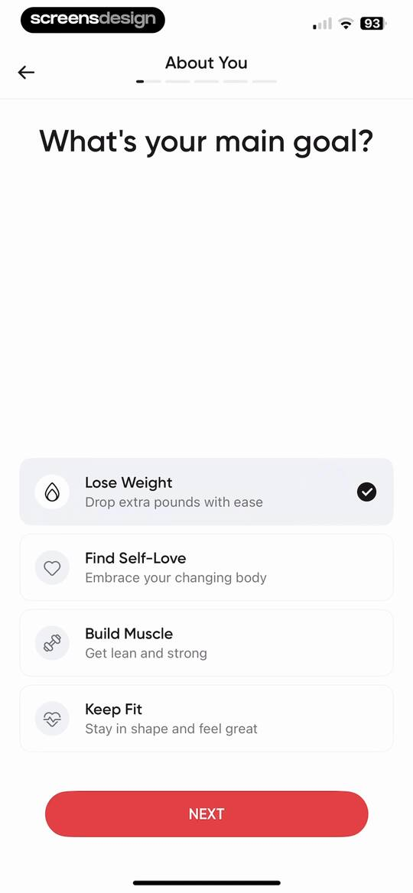
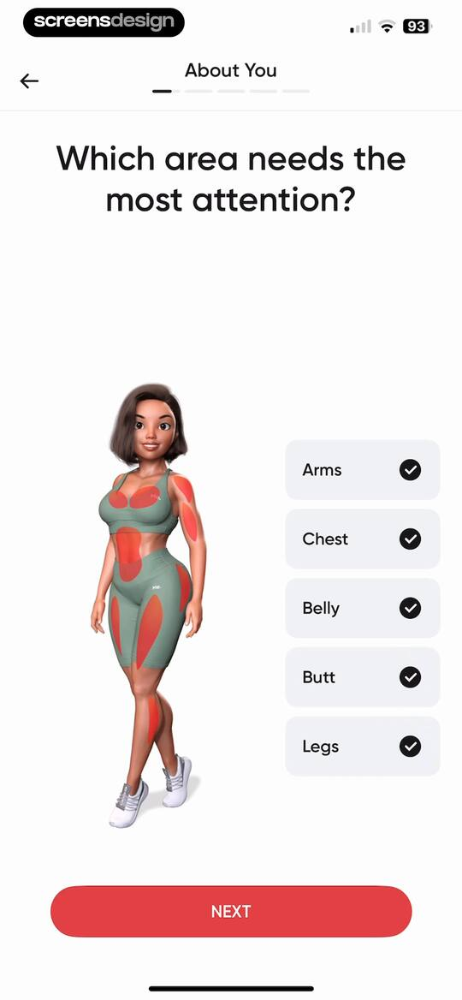
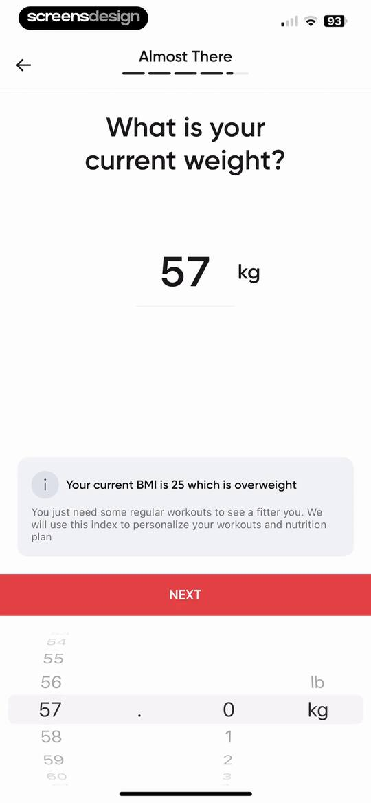
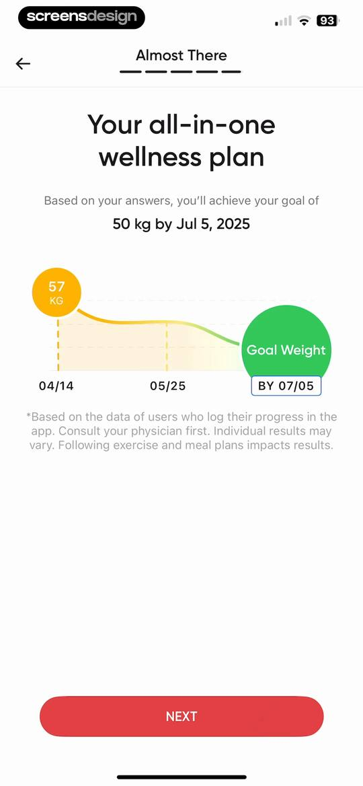
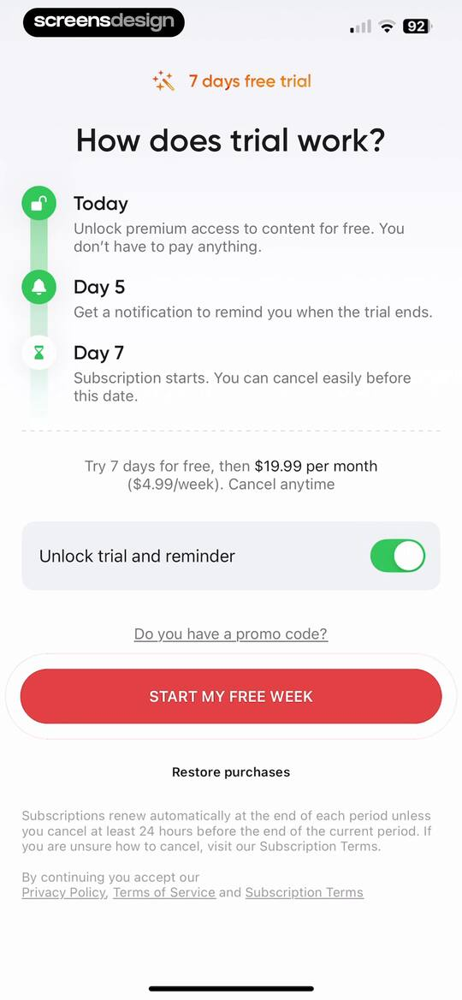
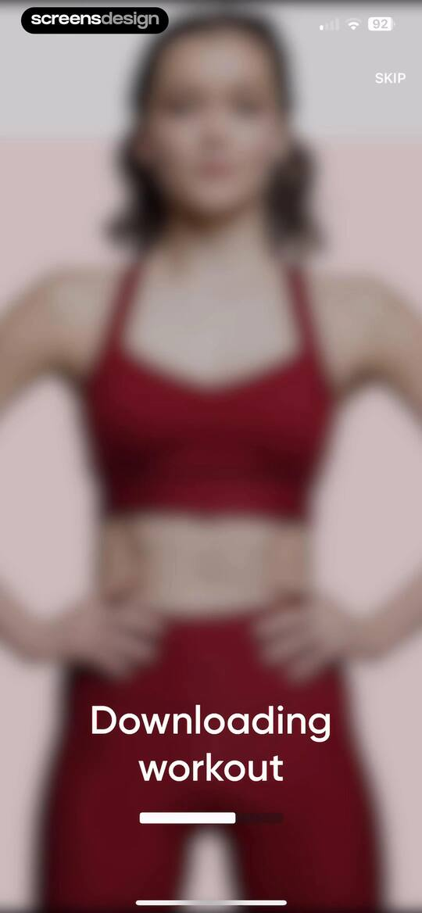
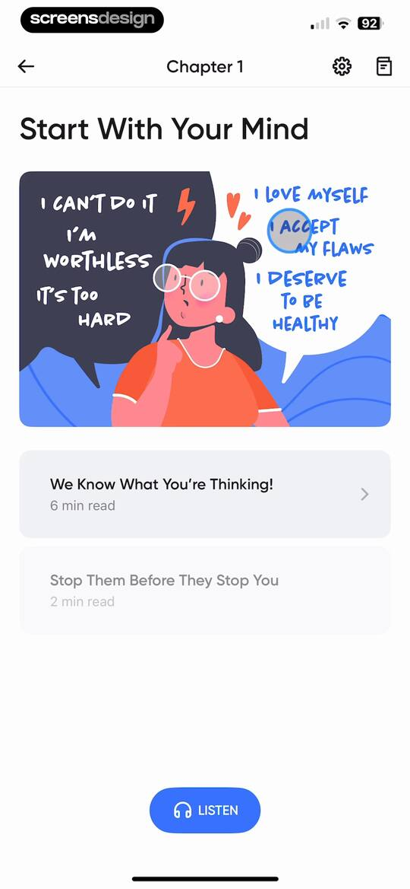
