# Bible Mode: Reduce Screen Time Onboarding, Paywall & UX Flow — 131 Screens, $15k/mo

Source: https://screensdesign.com/apps/bible-mode-reduce-screen-time/ (fetched 2026-10-05)

Stats: 

| # | Time | Image | What the screen shows |
|---|---|---|---|
| 1 | 00:05 | 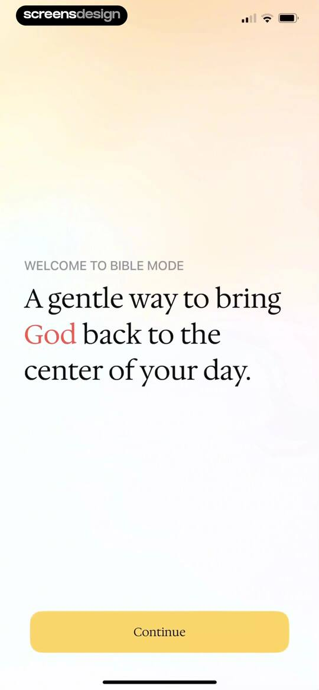 | Bible Mode onboarding welcome screen featuring a value proposition text block and a Continue button at the bottom. |
| 2 | 00:12 | 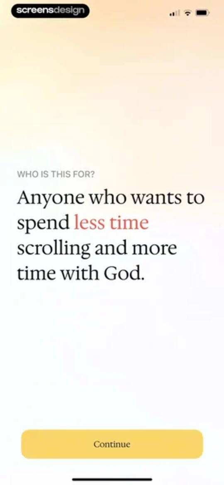 | Bible Mode onboarding screen asking who the app is for, with a centered message about reducing scrolling and a yellow Continue button. |
| 3 | 00:19 | 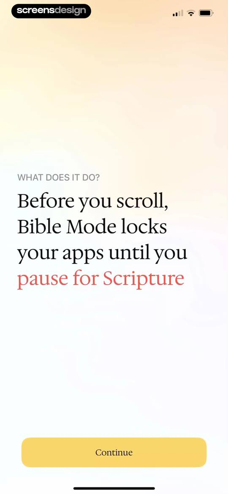 | Bible Mode onboarding screen explaining that the app locks distracting apps until the user pauses for Scripture, with a Continue button. |
| 4 | 00:26 | 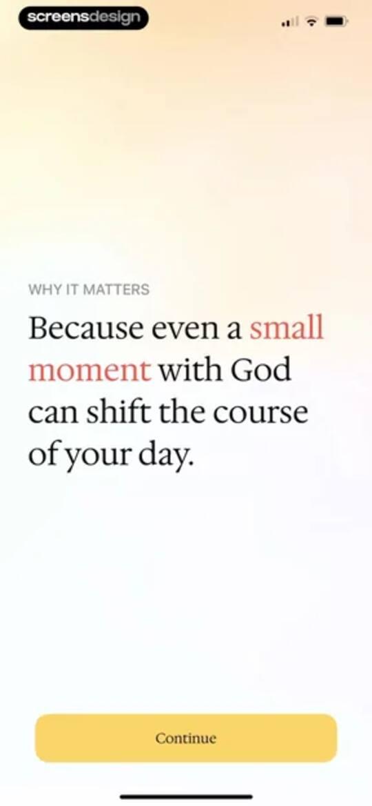 | Onboarding screen displaying an inspirational message about moments with God, with a yellow Continue button at the bottom. |
| 5 | 00:29 | 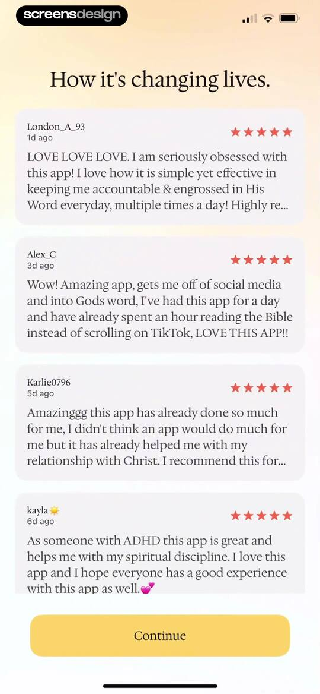 | Onboarding testimonial screen displaying four user review cards with star ratings and a Continue button at the bottom. |
| 6 | 00:34 | 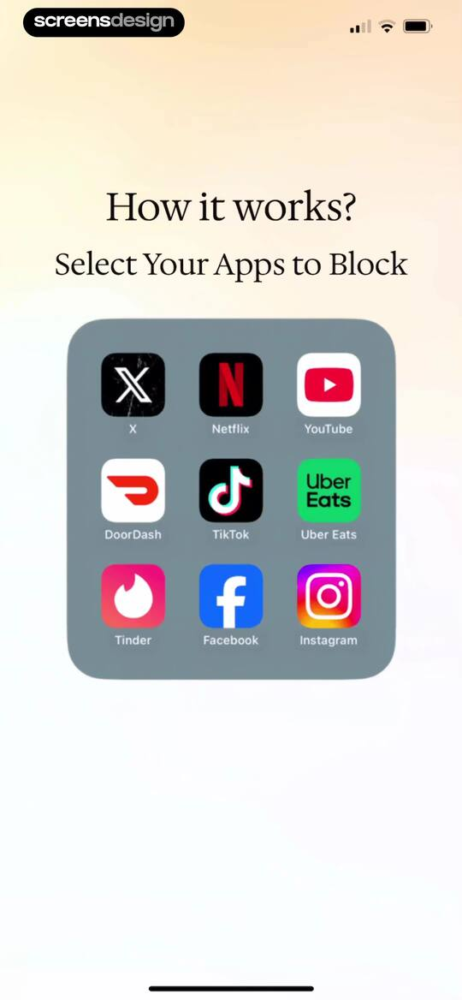 | Onboarding screen prompting users to select apps to block, featuring a grid of popular application icons. |
| 7 | 00:39 | 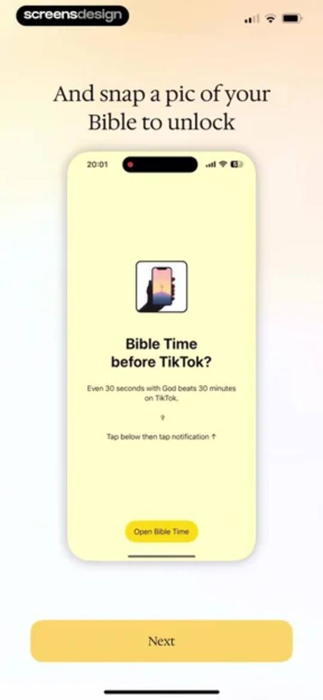 | Onboarding screen explaining how to unlock the app by taking a picture of a Bible, with an Open Bible Time button and a Next button. |
| 8 | 00:49 | 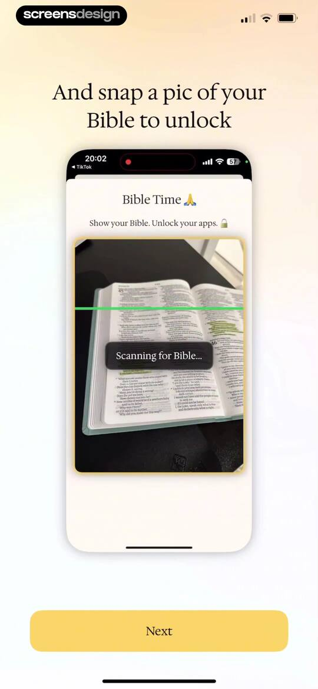 | Bible Time onboarding screen featuring a camera scanner mockup with a scanning status and a Next button. |
| 9 | 00:54 | locked | Onboarding screen displaying a dashboard mockup with progress statistics and a yellow Next button at the bottom. |
| 10 | 01:08 | locked | Bible Mode onboarding screen with value proposition text explaining hand-picked verses and a Get Your First Verse button at the bottom. |
| 11 | 01:20 | locked | Onboarding screen introducing Bible Mode with a featured verse card and a Get Devotional button at the bottom. |
| 12 | 01:24 | locked | Devotional screen displaying a scripture reflection card with tags for faith, anxiety, and trust, and a continue to prayer button. |
| 13 | 01:29 | locked | Spiritual reflection screen displaying a Joshua 1:8 pocket prayer with Refocus and Stillness tags, and a Continue to Affirmation button. |
| 14 | 01:33 | locked | Spiritual affirmation completion screen featuring a centered Joshua 1:8 reflection card with categorized tags and a yellow Finish Verse Flow button. |
| 15 | 01:37 | locked | Celebratory Bible Mode success screen with a user testimonial card from Chanlyn and scattered confetti elements. |
| 16 | 01:41 | locked | Congratulatory feedback screen displaying a user testimonial card and a Help spread the word button. |
| 17 | 01:45 | locked | App rating modal overlay prompting the user to rate the app with star icons, featuring Cancel and Submit buttons. |
| 18 | 01:47 | locked | Feedback modal overlay asking how an action felt, featuring a five-star rating prompt, Write a Review, and OK buttons. |
| 19 | 01:53 | locked | Onboarding screen asking how often the user reads Scripture per week, with the sometimes option selected and a continue button. |
| 20 | 01:57 | locked | Onboarding screen asking for average daily screen time with four range options, the 6+ hours option selected, and a Continue button. |
| 21 | 02:01 | locked | Onboarding age selection screen with the 25-34 range selected and a Continue button at the bottom. |
| 22 | 02:12 | locked | Onboarding screen displaying alarming phone usage statistics with a prominent yellow Continue button at the bottom. |
| 23 | 02:25 | locked | Bible Mode onboarding screen explaining how to replace wasted hours with purpose and peace, featuring a yellow Continue button at the bottom. |
| 24 | 02:30 | locked | Digital wellness app onboarding questionnaire with a final question, selection buttons, and a Continue button. |
| 25 | 02:44 | locked | Bible Mode onboarding loading screen showing a centered spinner and four completed progress items for setup tasks. |
| 26 | 02:50 | locked | Bible Mode onboarding screen featuring a growth graph, user testimonial card, and a yellow call-to-action button at the bottom. |
| 27 | 02:54 | locked | Paywall screen for the Bible Mode app featuring a feature list, a user testimonial card, and an Unlock All Features button. |
| 28 | 02:57 | locked | Paywall screen comparing weekly and annual subscription plans, with the weekly plan selected and a Continue button. |
| 29 | 03:02 | locked | App Store subscription checkout for Bible Mode showing a three-day free trial, annual pricing, and side button confirmation. |
| 30 | 03:07 | locked | Subscription paywall with a free trial option selected, a Continue button, and a purchase success confirmation modal in the center. |
| 31 | 03:13 | locked | Permission request screen asking to connect to Screen Time to enable Bible Mode, featuring two icons and a yellow Continue button. |
| 32 | 03:17 | locked | System permission modal for Bible Mode requesting Screen Time access, with Continue and Don't Allow buttons over a blurred background. |
| 33 | 03:20 | locked | Bible Mode permission request screen for Screen Time access, with an Allow with Face ID button and a Don't Allow option. |
| 34 | 03:23 | locked | Bible Mode permission confirmation screen showing that Screen Time access has been approved, with a blue Done button at the bottom. |
| 35 | 03:26 | locked | Bible Mode app permission request screen asking to allow camera access with an illustration and a Continue button. |
| 36 | 03:28 | locked | Permission request modal asking for Bible Mode camera access, with Allow and Don't Allow buttons. |
| 37 | 03:31 | locked | Permission request screen asking to allow notifications for app blocking alerts, with a central bell icon and a Continue button. |
| 38 | 03:32 | locked | System notification permission modal for the Bible Mode app, with Don't Allow and Allow buttons over a blurred background. |
| 39 | 03:35 | locked | Bible Mode activation confirmation modal over a dashboard with an I'm ready button and a weekly progress tracker. |
| 40 | 03:41 | locked | Dashboard displaying zero day streak stats, a daily devotional card, a scripture affirmation, and an activity heatmap calendar with bottom navigation. |
| 41 | 03:50 | locked | Dashboard with an open modal explaining how to earn Faith Points through various in-app activities and listing specific point values. |
| 42 | 03:53 | locked | Bible verse screen displaying Matthew 13:44 with a share button and navigation arrows at the bottom. |
| 43 | 03:59 | locked | Share sheet overlaying a Bible verse from Matthew 13:44, featuring a content preview, app carousel, and vertical action list. |
| 44 | 04:01 | locked | Permission request modal asking for photo access to export Bible verse images, with Allow and Don't Allow buttons. |
| 45 | 04:06 | locked | Devotional reader screen displaying Matthew 13:44 scripture and reflection text with a top progress bar and bottom navigation controls. |
| 46 | 04:09 | locked | Guided reflection screen with scripture prompts, an empty journaling text input area, and a bottom navigation bar. |
| 47 | 04:24 | locked | Prayer reading screen displaying personalized scripture reflection text with a top progress bar and bottom navigation and share buttons. |
| 48 | 04:27 | locked | Daily affirmation screen displaying a scripture reference, an affirmation text, and navigation controls at the bottom. |
| 49 | 04:29 | locked | Streak dashboard displaying a one-day streak counter, weekly progress row, motivational tip, and Unlock Apps and Get Another Verse buttons. |
| 50 | 04:32 | locked | Modal alert informing the user about missing app blocking setup, with an OK button and background streak counter. |
| 51 | 04:39 | locked | Bible verse reading screen displaying Isaiah 11:1-3 with a translation selection modal showing ESV selected. |
| 52 | 04:43 | locked | Daily Bible verse screen displaying Isaiah 11:1-3 with a share button and bottom navigation arrows. |
| 53 | 04:53 | locked | Dashboard displaying streak statistics, a daily prayer card, a calendar heatmap for 2025, and a bottom navigation bar. |
| 54 | 04:56 | locked | Activity dashboard featuring a Today section with a Matthew 13:44 card and bottom navigation bar. |
| 55 | 04:59 | locked | Daily verse content feed displaying Matthew 13:44 with a top progress bar, central scripture text, and bottom navigation controls including a share button. |
| 56 | 05:05 | locked | Bible Mode dashboard displaying weekly progress, a stats summary, and an action overlay with options to scan your Bible or get a verse. |
| 57 | 05:11 | locked | Bible Mode app screen with a camera viewfinder and an informational modal dialog about app blocking, featuring a Get Your Verse button. |
| 58 | 05:15 | locked | Camera viewfinder screen with Bible Mode instructions to scan a physical Bible page, featuring a Get Your Verse button and an alternative text link. |
| 59 | 05:18 | locked | Camera-based scanner interface showing a Bible page with a green scanning line and instructions to unlock apps. |
| 60 | 05:24 | locked | Bible Mode app unlock screen displaying a scripture preview, duration slider set to one hour, and an unlock action button. |
| 61 | 05:32 | locked | Home screen featuring a metrics dashboard with a one-day streak, a promotional card for a daily verse, a mini prayer, and a calendar tracking view. |
| 62 | 05:38 | locked | Bible Buddies feature introduction modal with a top illustration, a list of social benefits, a Sign in with Apple button, and a Stay solo for now link. |
| 63 | 05:45 | locked | Sign-in modal overlay for creating an account using Apple, displaying pre-filled name and email sharing options with a Done button. |
| 64 | 05:47 | locked | Bible Buddies onboarding screen prompting for the user's full name with a pre-filled input field and a Next button. |
| 65 | 05:51 | locked | Onboarding mascot selection screen featuring a grid of character icons with one selected and a Next button. |
| 66 | 05:55 | locked | Bible Buddies onboarding screen featuring a character avatar, a color selection grid with a green background selected, and an I'm ready button. |
| 67 | 06:02 | locked | Onboarding profile completion screen displaying the handle @juliascreens, a brain avatar, and a red Done button. |
| 68 | 06:05 | locked | Social hub screen titled Bible Buddies with a profile card, invite card, and an empty following list featuring a Find Bible Buddies search button. |
| 69 | 06:11 | locked | Empty notifications screen from the Bible Mode app featuring a minimal light layout with a spiritual background silhouette and a centered title. |
| 70 | 06:14 | locked | User profile screen displaying personal statistics, a calendar activity heatmap, and a recent activity feed with Edit profile and Share buttons. |
| 71 | 06:25 | locked | Social dashboard with a user profile and friend streaks section, overlaid by an iOS system share sheet. |
| 72 | 06:36 | locked | Chat dashboard with Scripture topic cards, an empty recent conversations state, and a selected Chat tab in the bottom navigation bar. |
| 73 | 06:39 | locked | Chat interface titled Ask the Bible with suggested prompt chips and an empty input field at the bottom. |
| 74 | 06:44 | locked | Chat screen titled Ask the Bible displaying a user query about anxiety, a scripture-based response, and an input field. |
| 75 | 06:46 | locked | Chat conversation about anxiety with scripture references, a Copied confirmation notification, and a bottom input field. |
| 76 | 06:52 | locked | Chat screen titled Ask the Bible showing an AI response about anxiety and a text input field containing I love that verse with a send button. |
| 77 | 07:00 | locked | Chat interface titled Ask the Bible displaying scripture verses about anxiety and a bottom message input field. |
| 78 | 07:02 | locked | Chat conversation about Bible verses on anxiety with a clear chat confirmation modal overlay showing Cancel and Clear buttons. |
| 79 | 07:13 | locked | Chat interface titled Faith displaying three suggested prompt bubbles about spiritual struggles and a bottom text input field. |
| 80 | 07:18 | locked | Chat interface discussing faith fluctuations with Bible verse references and a bottom input field. |
| 81 | 07:30 | locked | Chat history screen displaying a list of past conversations with a Clear All button and a Faith chat card. |
| 82 | 07:34 | locked | Chat history screen with a confirmation modal asking to clear all chat conversations, featuring Cancel and Clear buttons. |
| 83 | 07:37 | locked | Chat history empty state screen with no chats yet and the chat tab selected in the bottom navigation bar. |
| 84 | 07:40 | locked | Bible reading screen displaying Genesis Chapter 1 in a numbered list with a top version indicator and bottom navigation. |
| 85 | 07:47 | locked | Bible reading screen displaying Genesis chapter 1 verses, with a Mark as read button and the Bible tab selected in the bottom navigation. |
| 86 | 07:49 | locked | Chapter complete modal over a Bible reading screen with options to keep reading or unlock apps. |
| 87 | 07:52 | locked | Chapter completion modal over Genesis scripture text with Keep Reading and Unlock Apps buttons. |
| 88 | 07:54 | locked | Bible reading screen featuring a passage from Genesis and a modal overlay with a duration selector and an Unlock Apps for 1h button. |
| 89 | 07:57 | locked | Bible reading interface displaying Genesis Chapter 1 with a centered modal overlay stating apps are unlocked for one hour. |
| 90 | 08:04 | locked | Bible reading screen showing Genesis Chapter 2 with a translation selection menu and bottom navigation. |
| 91 | 08:09 | locked | Bible reading interface displaying Genesis Chapter 2 with an open modal overlay listing Old Testament books for selection. |
| 92 | 08:16 | locked | Bible reading interface displaying Genesis Chapter 2 in the background with a bottom modal showing a chapter selection grid for Psalms. |
| 93 | 08:20 | locked | Bible reading screen displaying Psalms Chapter 83 in a scrollable list with the Bible tab selected in the bottom navigation. |
| 94 | 08:26 | locked | Bible reading screen displaying Psalms Chapter 83 with a bottom sheet offering save, copy, and explanation options for a selected verse. |
| 95 | 08:32 | locked | Bible reading screen showing Psalms Chapter 83 with a selected verse and a bottom modal overlay offering save, copy, and devotional actions. |
| 96 | 08:35 | locked | Bible reading interface showing Psalms Chapter 83 with a highlighted verse and a bottom modal overlay preparing a devotional. |
| 97 | 08:41 | locked | Bible verse screen displaying Psalms 83:18 with a photo background, directional arrows, and a share button. |
| 98 | 08:44 | locked | Devotional screen displaying scripture reflection for Psalms 83:18, with a share button and navigation controls at the bottom. |
| 99 | 08:46 | locked | Guided reflection screen displaying scripture questions and a central journaling input field above a bottom navigation bar. |
| 100 | 08:54 | locked | Daily prayer reading screen displaying a personalized prayer for Psalms 83:18 with a top progress bar and bottom navigation and share buttons. |
| 101 | 08:55 | locked | Affirmation screen displaying a scripture quote with a progress bar and bottom navigation controls for sharing and liking. |
| 102 | 08:58 | locked | Streak progress screen showing a one-day streak with a weekly tracker, motivational text, and Unlock Apps and Return to Bible buttons. |
| 103 | 09:10 | locked | Verse explanation modal overlaying scripture verses, with a theological commentary for Psalm 83:18 and a Chat Deeper button. |
| 104 | 09:19 | locked | Chat interface displaying an AI-generated explanation of a Bible verse, with a user query and a bottom input field to ask follow-up questions. |
| 105 | 09:23 | locked | Quiet time dashboard featuring a ten-minute timer, a flame illustration, duration controls, an intention selector, and a red play button. |
| 106 | 09:25 | locked | Quiet Time setup screen with a top audio selection modal, duration controls set to 10m, and an intention selector. |
| 107 | 09:31 | locked | Home screen displaying a central activity selection card with the Bible activity selected, a red play button, and a top Soft Violin audio setting. |
| 108 | 09:38 | locked | Meditation timer dashboard with a central flame graphic, countdown timer, affirmation text, and a pause button. |
| 109 | 09:41 | locked | Meditation dashboard featuring a central flame progress indicator, motivational text, audio controls, and a pause button. |
| 110 | 09:48 | locked | Quiet time session confirmation screen with a timer, flame graphic, and a bottom modal asking to end or stay. |
| 111 | 09:52 | locked | Educational modal explaining the Quiet Time feature, featuring a description of blocked apps and a Got it button. |
| 112 | 09:56 | locked | Settings screen with grouped personalize and support sections, showing options like Blocked Apps and Bible Mode with the Menu tab selected. |
| 113 | 09:59 | locked | Onboarding screen displaying app blocking tips and technical guidelines with a Continue button in the top right. |
| 114 | 10:01 | locked | Category selection form listing app groups with icons and checkboxes, featuring Cancel and Done buttons in the top navigation bar. |
| 115 | 10:10 | locked | App selection form with a search bar and a list of apps and categories, featuring FaceTime and Facebook selected with blue checkmarks and a Done button. |
| 116 | 10:14 | locked | Blocking rules settings screen with an active Always On toggle card and a Create Custom Schedule button. |
| 117 | 10:28 | locked | New Rule creation form with day selection, time range inputs set to 6:00 AM and 9:00 AM, and a Save button. |
| 118 | 10:31 | locked | New rule form for scheduling app blocking times with day selection, start and end times, rule name input, and a save button. |
| 119 | 10:39 | locked | Troubleshooting screen listing solutions for app blocking issues, featuring five instructional cards and a Done button. |
| 120 | 10:47 | locked | Daily Bible Verse permission modal featuring a red bell icon and a toggle card to enable daily reminders. |
| 121 | 10:49 | locked | Notification settings screen for daily Bible verses, featuring a reminder toggle, a time picker, and a Done button. |
| 122 | 10:54 | locked | Widget configuration screen displaying a prayer preview card, selection buttons for content and refresh intervals, and step-by-step instructions for home and lock screens. |
| 123 | 11:04 | locked | Customize appearance settings screen with stacked interactive cards for theme, wallpaper, and app icon options, and a Done button. |
| 124 | 11:05 | locked | Theme selection modal displaying Light, Dark, and System cards over a blurred background, with the Light option selected. |
| 125 | 11:07 | locked | Customize appearance settings screen with stacked cards for selecting the theme, wallpaper, and app icon, alongside a Done button. |
| 126 | 11:12 | locked | Wallpaper selection screen for the Bible Mode app displaying a three-column grid of aesthetic background image cards and a top close button. |
| 127 | 11:16 | locked | App icon selection screen with a points balance header, categorized icon grids, and a close button. |
| 128 | 11:23 | locked | Feature voting form listing options like Audio Mode and a Live prayer wall, with a Done button in the top navigation bar. |
| 129 | 11:38 | locked | Feature voting modal form with multiple-choice questions, text input fields, and a Submit button. |
| 130 | 11:41 | locked | Thank-you modal thanking the user for sharing their voice and encouraging app promotion, with a Done button and Vote on Features title. |
| 131 | 11:45 | locked | Settings screen with a personalization list overlaid by a system share sheet modal showing sharing actions. |

## Free showcase screenshots (unordered)

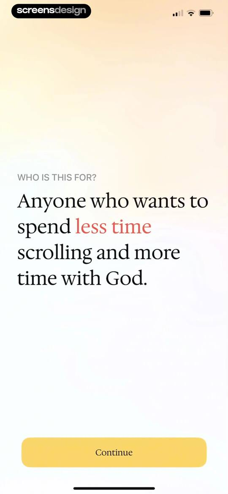
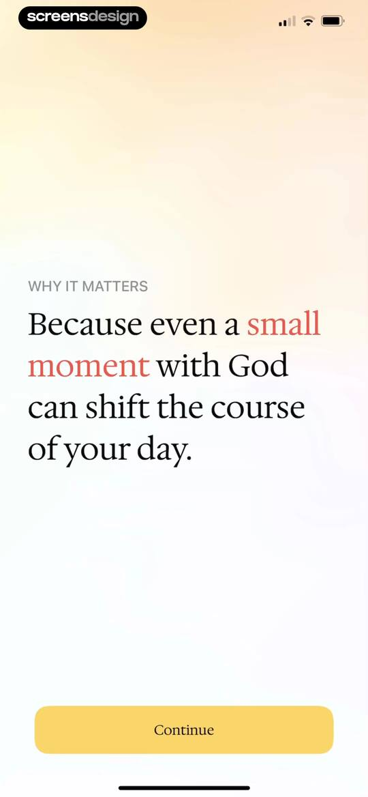
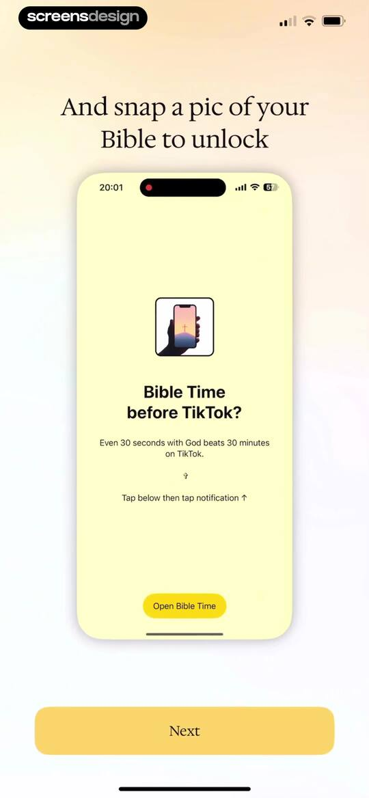
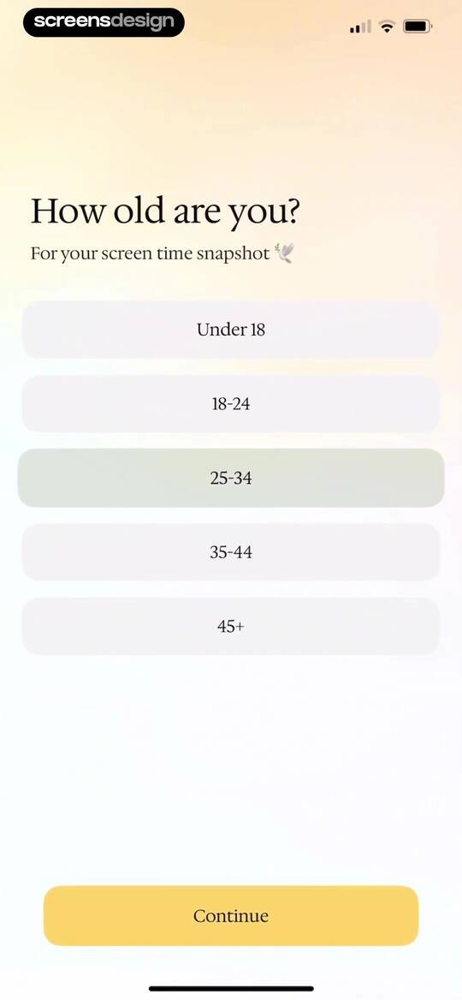
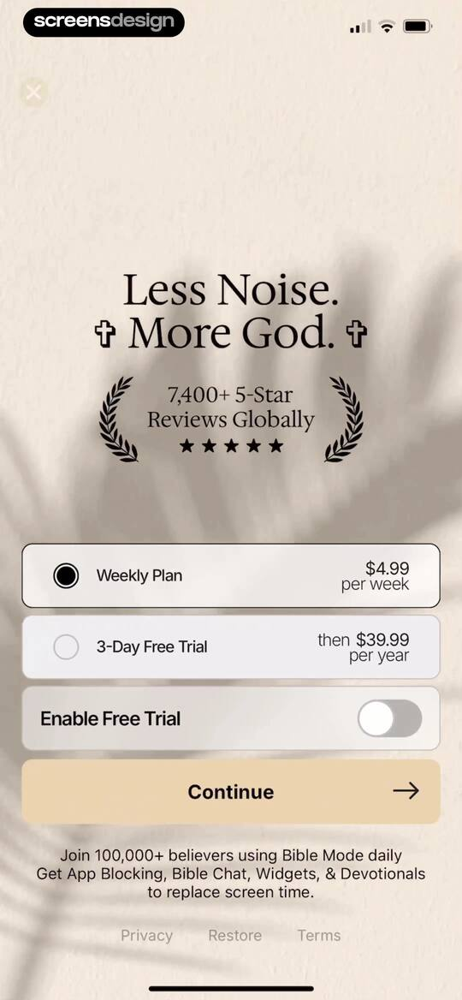
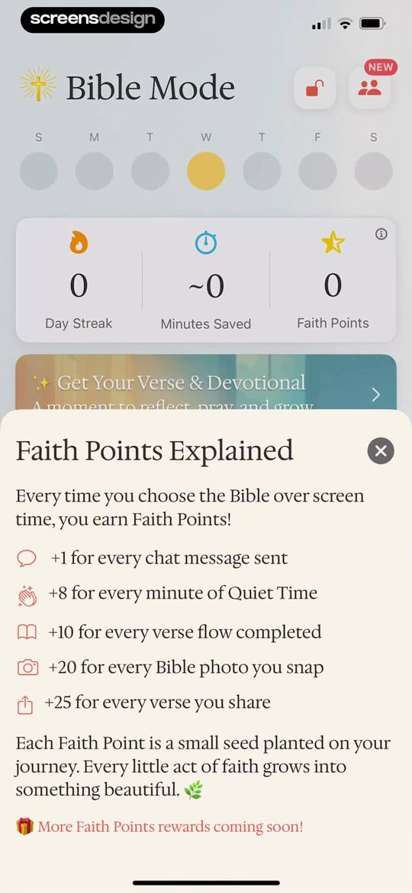
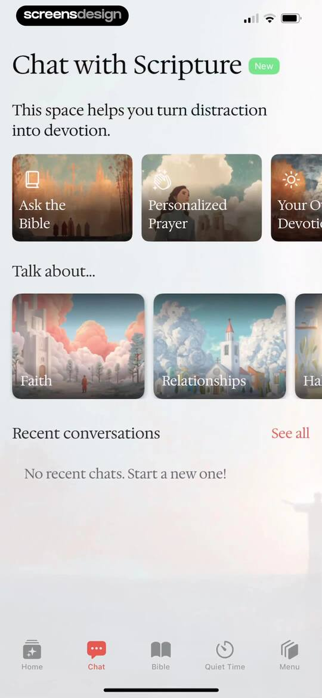
