# Brainrot: Screen Time Control Onboarding, Paywall & UX Flow — 51 Screens, $150k/mo

Source: https://screensdesign.com/apps/brainrot-screen-time-control/ (fetched 2026-10-05)

Stats: 

| # | Time | Image | What the screen shows |
|---|---|---|---|
| 1 | 00:00 | 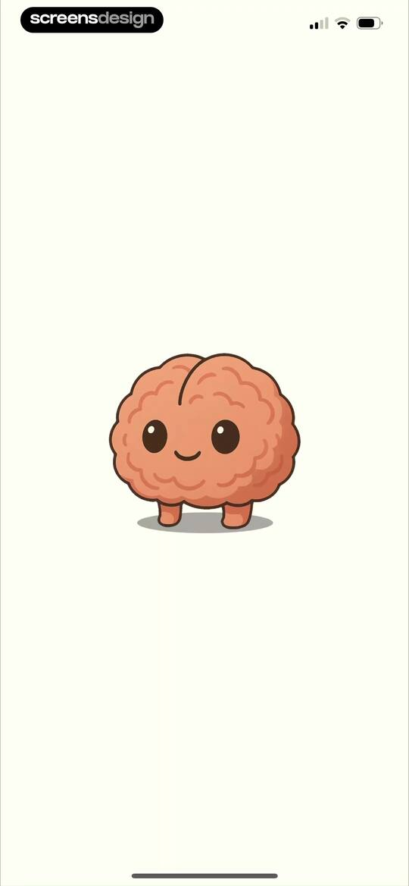 | Splash screen featuring a centered cartoon brain character with a smiling face against a solid cream background. |
| 2 | 00:03 | 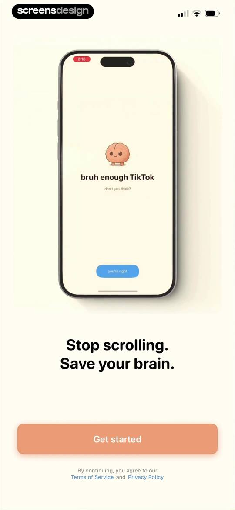 | Onboarding screen featuring a central product mockup, headline text about stopping scrolling, and a Get started button. |
| 3 | 00:05 | 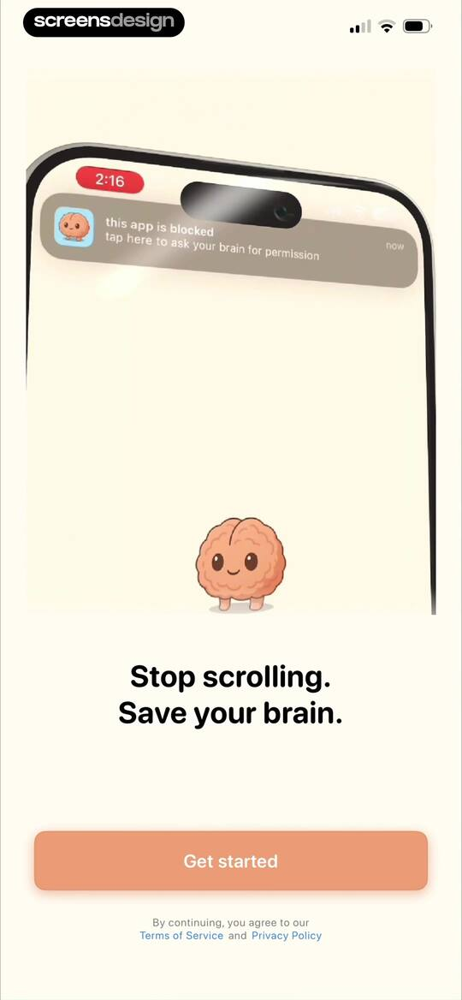 | Onboarding screen with a top mockup of a blocked app notification, headline text, and a Get started button. |
| 4 | 00:11 | 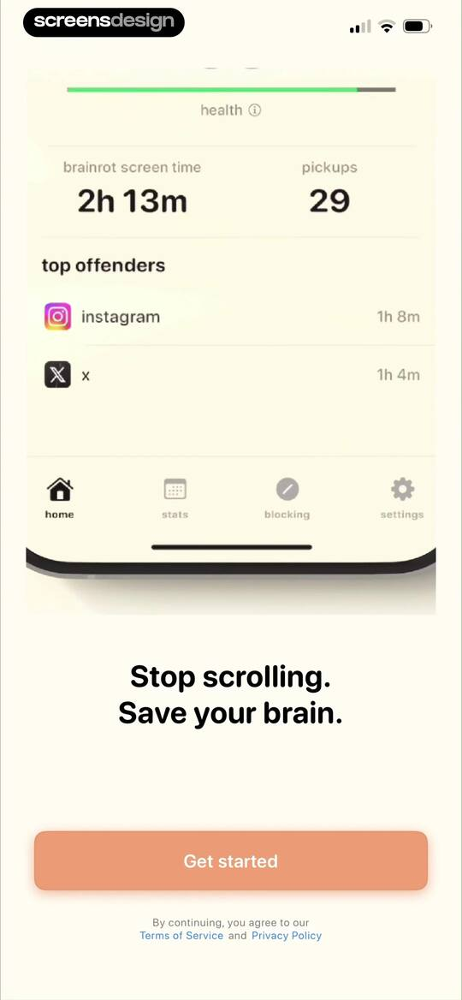 | Onboarding screen displaying a screen time statistics preview, motivational text, and a Get started button. |
| 5 | 00:25 | 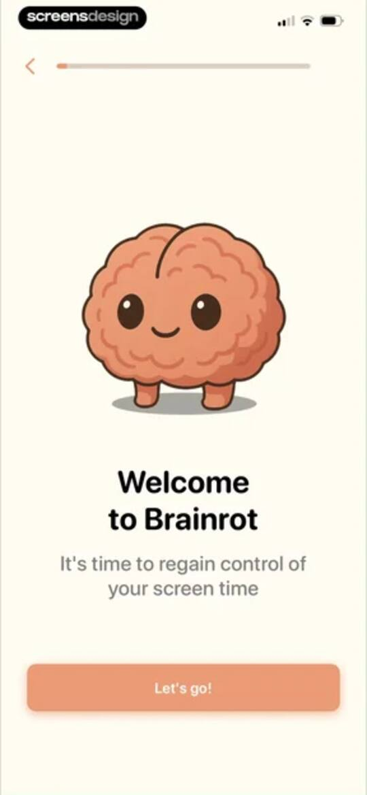 | Onboarding welcome screen for the Brainrot app featuring a brain character illustration, introductory text, and a Let's go! button. |
| 6 | 00:32 | 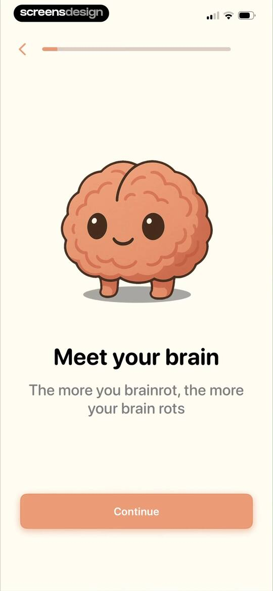 | Brainrot app onboarding screen featuring a cute brain illustration, introductory text, and a Continue button. |
| 7 | 00:34 | 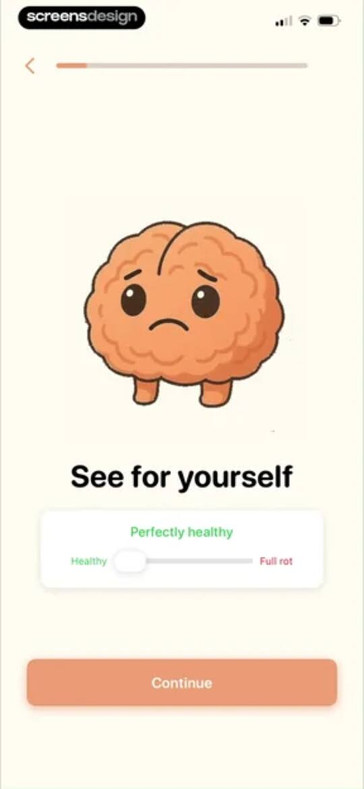 | Onboarding screen featuring an interactive health scale slider, a sad brain illustration, and a Continue button. |
| 8 | 00:37 | 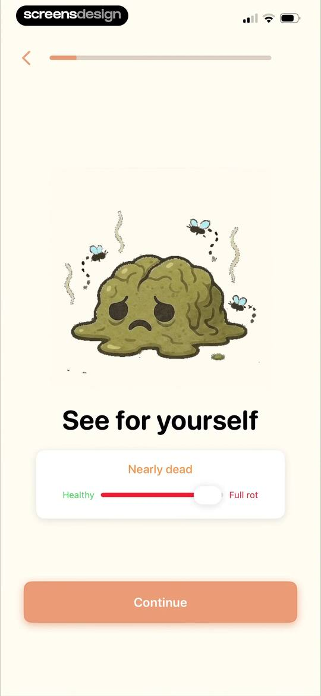 | Onboarding screen featuring a central illustration of a decaying brain, a status slider labeled from healthy to full rot, and a continue button. |
| 9 | 00:44 | locked | Onboarding screen explaining digital exploitation with a brain illustration, notification bubbles, and a Good to know button. |
| 10 | 00:49 | locked | Brainrot app onboarding screen featuring a central brain character illustration, headline text about personalization, and a Let's do it! button. |
| 11 | 00:54 | locked | Onboarding goal selection screen with the Sleep better option selected and a Continue button. |
| 12 | 00:58 | locked | Onboarding screen asking how screen time affects the user most, with anxiety and bad sleep options selected and a Continue button. |
| 13 | 01:03 | locked | Onboarding screen asking which best describes you, with a list of selectable persona cards, the Builder / Creator option selected, and a Continue button. |
| 14 | 01:07 | locked | Onboarding survey asking when the user usually loses control, with the During the day option selected and a Continue button. |
| 15 | 01:11 | locked | Onboarding survey screen asking about past screen time reduction attempts, with the option Yes, briefly worked selected and a Continue button. |
| 16 | 01:17 | locked | Onboarding screen displaying four educational cards about screen time statistics with a progress bar and Continue button. |
| 17 | 01:21 | locked | Onboarding age selection screen asking How old are you? with the 25-34 option selected and a Continue button. |
| 18 | 01:26 | locked | Onboarding screen asking daily screen time usage with a slider input set to 1 hour, an encouraging message, and a Continue button. |
| 19 | 01:28 | locked | Onboarding screen asking for daily screen time with an interactive slider set to 8 hours, feedback text, and a Continue button. |
| 20 | 01:30 | locked | Onboarding screen asking about daily screen time with a slider set to 10 hours, a mascot, and a Continue button. |
| 21 | 01:45 | locked | Loading screen with three vertically stacked progress bars for analyzing habits, calculating profile, and generating insights. |
| 22 | 01:49 | locked | Onboarding attention profile result displaying the Nighttime Scroller profile with data visualization sliders and a Makes sense button. |
| 23 | 01:52 | locked | Onboarding screen for a productivity app with the headline OOF and a Skip button at the bottom. |
| 24 | 01:56 | locked | Brainrot onboarding screen displaying a screen time statistic of 106 days on your phone with a skip button. |
| 25 | 02:01 | locked | Onboarding screen displaying a provocative screen time projection of 21 years with a melting brain illustration and a Next button. |
| 26 | 02:03 | locked | Onboarding screen featuring a centered text question about screen time and a skip button at the bottom. |
| 27 | 02:12 | locked | Onboarding screen displaying a lifespan dot grid visualization with a legend, life remaining text, and a bottom Skip button. |
| 28 | 02:17 | locked | Onboarding screen displaying a dot-grid visualization of life remaining versus phone usage, with a legend and a Next button. |
| 29 | 02:22 | locked | Brainrot onboarding screen with a smiling brain illustration, a motivational message about reclaiming time, and a Let's do this! button. |
| 30 | 02:27 | locked | Brainrot onboarding screen featuring a headline about reclaiming time and a dot grid data visualization with a legend. |
| 31 | 02:32 | locked | Onboarding screen featuring centered text and a dot pattern, with a large Let's do this! button at the bottom. |
| 32 | 02:37 | locked | Brainrot onboarding educational screen presenting three behavioral concept cards about dopamine loops and a Continue button. |
| 33 | 02:40 | locked | Onboarding screen comparing traditional methods to the app's approach, with three feature cards and a Continue button. |
| 34 | 02:42 | locked | Brainrot app onboarding screen highlighting research backing from Oxford, Harvard, and Cambridge universities, with a Continue button. |
| 35 | 02:49 | locked | Rating prompt modal asking users if they are enjoying the app with five empty star icons, a Submit button, and a Cancel button. |
| 36 | 02:50 | locked | Feedback modal overlay in the Brainrot app with a star rating selector, a Write a Review button, and an OK button. |
| 37 | 02:52 | locked | App rating and social proof screen displaying a 4.7-star rating, user testimonials, and a Continue button. |
| 38 | 02:56 | locked | Permission request onboarding screen for Brainrot to connect Screen Time, featuring a central illustration and a Continue button. |
| 39 | 02:58 | locked | Onboarding permission screen requesting Screen Time access with a system modal, a smiling brain illustration, and a bottom Continue button. |
| 40 | 03:03 | locked | App permission onboarding screen requesting Screen Time access with a system modal, a character illustration, and a disabled Continue button. |
| 41 | 03:05 | locked | Permission request screen for the Brainrot app asking for Screen Time access, with an Allow with Face ID button and a Don't Allow option. |
| 42 | 03:08 | locked | Permission confirmation screen showing that Brainrot has been approved to access Screen Time, with a Done button. |
| 43 | 03:13 | locked | Permissions modal for the Brainrot app requesting activity tracking, with Allow and Ask App Not to Track buttons. |
| 44 | 03:15 | locked | Brainrot onboarding permission request modal asking for Screen Time access, with a Continue button at the bottom. |
| 45 | 03:16 | locked | Brainrot onboarding screen listing four weekly benefits with icons and a Continue button. |
| 46 | 03:17 | locked | Digital wellbeing onboarding screen with an illustration of a handcuffed phone and a button to tap five times to break the chain. |
| 47 | 03:20 | locked | Onboarding screen featuring an illustration of a handcuffed phone and a call-to-action to tap 5x to break the chain. |
| 48 | 03:24 | locked | Brainrot onboarding screen with a congratulatory message, a zen brain illustration, and a Continue button. |
| 49 | 03:28 | locked | Paywall screen for the Brainrot app featuring a screen time comparison chart, value proposition list, user reviews, and a Continue button. |
| 50 | 03:31 | locked | Paywall screen comparing yearly and weekly subscription plans with social proof and a Continue button. |
| 51 | 03:34 | locked | Paywall screen offering a yearly subscription at 50 percent off with social proof and a Redeem Offer button. |

## Free showcase screenshots (unordered)

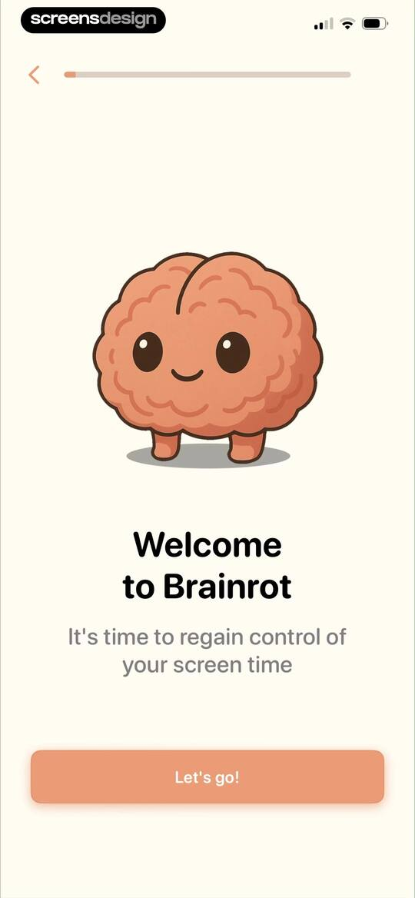

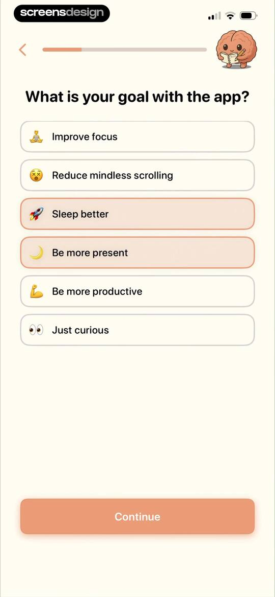
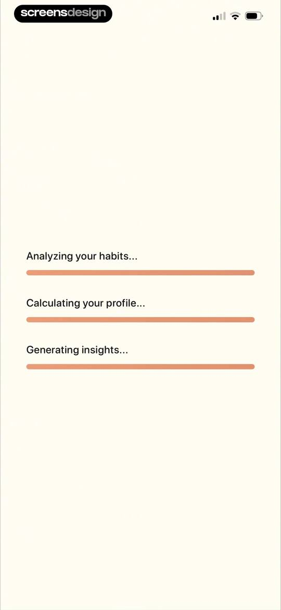
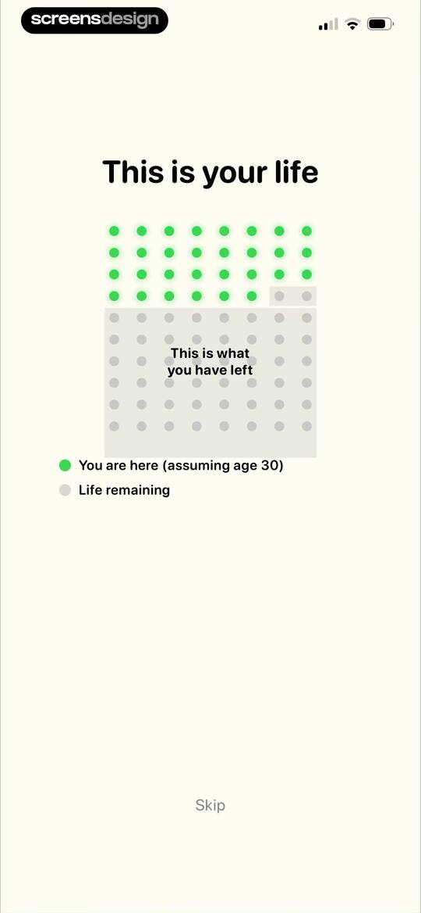
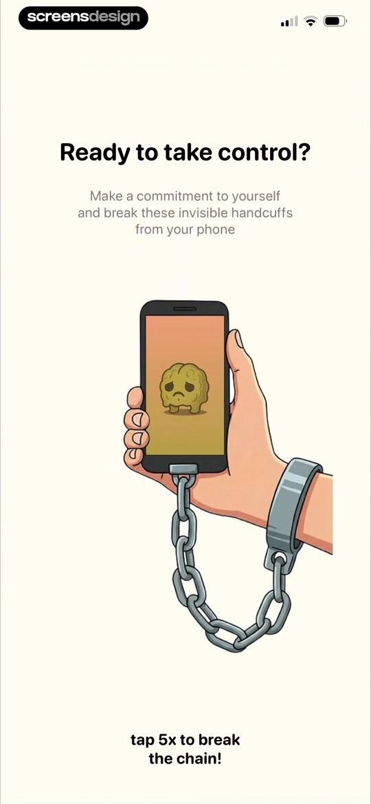
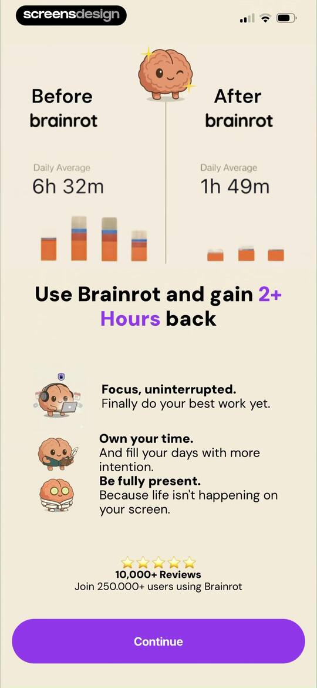
