# Cal AI - Calorie Tracker Onboarding, Paywall & UX Flow — 147 Screens, $1.8M/mo

Source: https://screensdesign.com/apps/cal-ai-calorie-tracker/ (fetched 2026-10-05)

Stats: 

| # | Time | Image | What the screen shows |
|---|---|---|---|
| 1 | 00:00 | 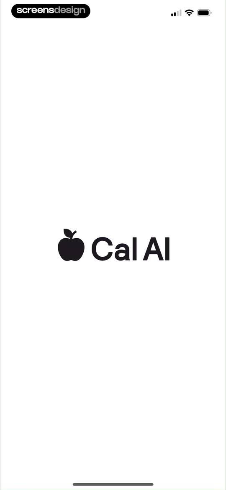 | Splash screen for the Cal AI app displaying a centered apple icon and app name on a plain background. |
| 2 | 00:07 | 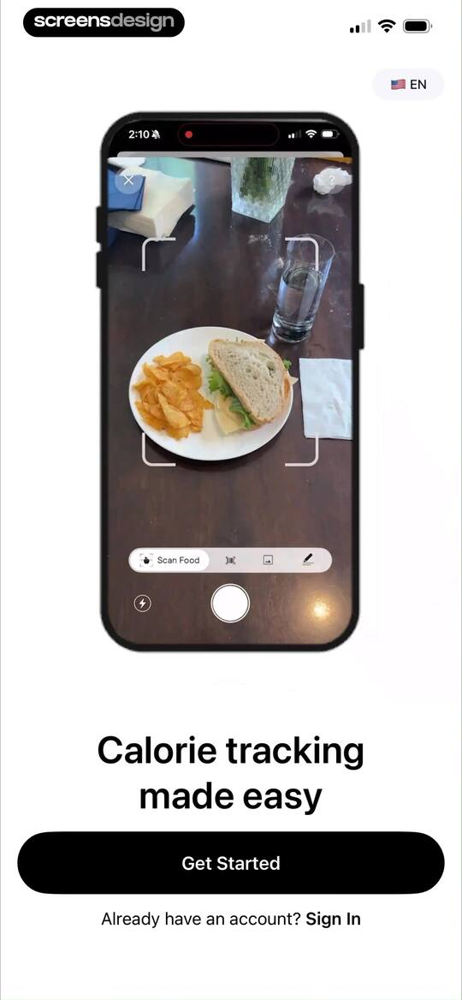 | Onboarding screen featuring a central product mockup of a food scanner interface, a heading for easy calorie tracking, and a Get Started button. |
| 3 | 00:18 | 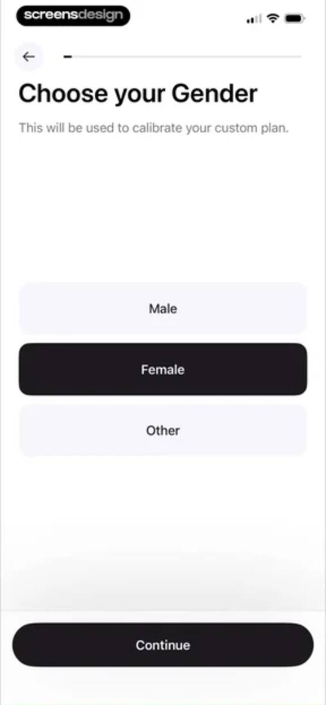 | Onboarding screen asking to choose gender with the Female option selected and a Continue button. |
| 4 | 00:22 | 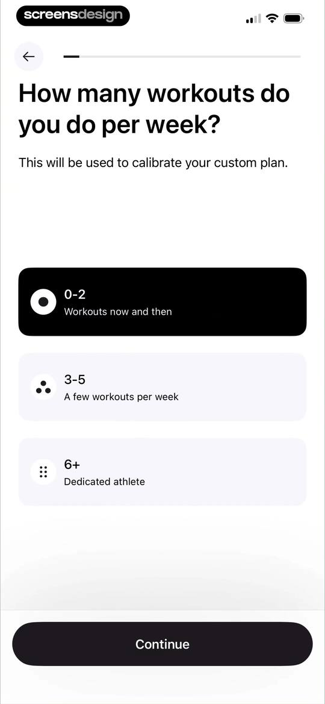 | Fitness onboarding screen asking for weekly workout frequency, with the first option selected and a Continue button. |
| 5 | 00:26 | 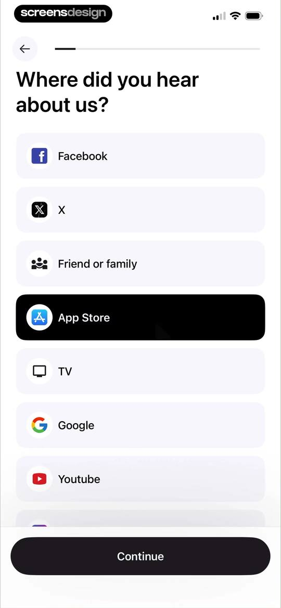 | Onboarding survey asking where the user heard about the app, with App Store selected and a Continue button. |
| 6 | 00:30 | 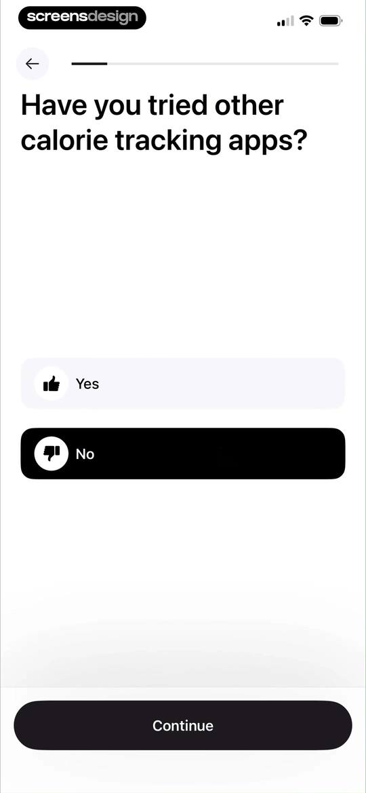 | Onboarding screen asking if the user has tried other calorie tracking apps, with the No option selected and a Continue button. |
| 7 | 00:33 | 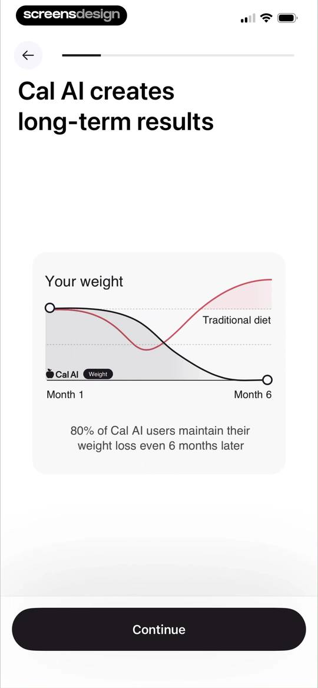 | Cal AI onboarding screen comparing weight loss results with a line graph and a Continue button. |
| 8 | 00:41 | 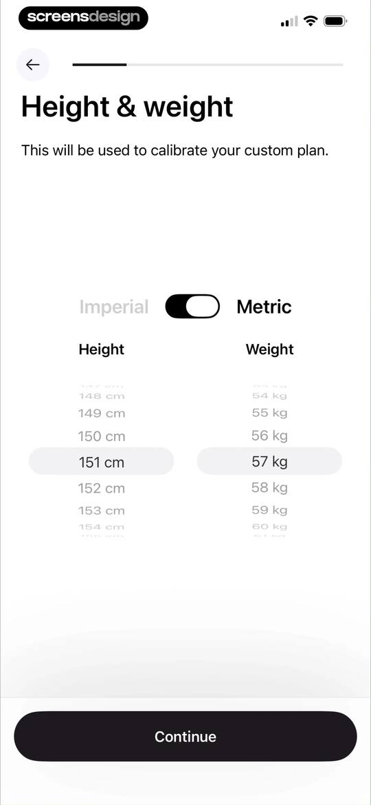 | Onboarding screen for height and weight with metric units selected, dual picker wheels showing 151 centimeters and 57 kilograms, and a Continue button. |
| 9 | 00:51 | locked | Onboarding date of birth screen featuring a central date picker and a Continue button. |
| 10 | 00:54 | locked | Onboarding question about working with a personal coach or nutritionist, with the No option selected and a Continue button. |
| 11 | 00:58 | locked | Onboarding goal selection screen with three options, Lose weight selected, and a Continue button. |
| 12 | 01:03 | locked | Onboarding weight selection screen asking for desired weight, displaying a central 50.0 kg value with an interactive ruler and a Continue button. |
| 13 | 01:04 | locked | Cal AI onboarding screen displaying a weight loss goal message, social proof, and a Continue button. |
| 14 | 01:08 | locked | Onboarding screen for weight loss speed with a slider control, recommended pace, and a Continue button. |
| 15 | 01:22 | locked | Cal AI onboarding screen featuring a weight loss comparison chart and a Continue button. |
| 16 | 01:26 | locked | Onboarding survey screen asking about obstacles to goals, with the unhealthy eating habits option selected and a continue button. |
| 17 | 01:30 | locked | Diet selection onboarding screen listing four options with the Classic card selected and a Continue button. |
| 18 | 01:34 | locked | Onboarding goal selection screen with four health options, the boost energy goal selected, and a continue button. |
| 19 | 01:39 | locked | Onboarding screen displaying a weight transition graph with a Continue button and progress indicator. |
| 20 | 01:41 | locked | Cal AI onboarding privacy screen with a central clapping hands illustration, privacy notice card, and a Continue button. |
| 21 | 01:44 | locked | Cal AI onboarding screen prompting the user to connect to Apple Health, with a central integration illustration, Continue button, and Skip link. |
| 22 | 01:47 | locked | Permissions prompt for Cal AI requesting access to Apple Health data, featuring toggles for health categories and Allow and Don't Allow buttons. |
| 23 | 01:53 | locked | Fitness app onboarding screen asking whether to add calories burned back to the daily goal, with a runner photo card and Yes and No buttons. |
| 24 | 01:55 | locked | Onboarding screen asking whether to enable a calorie rollover feature, featuring two explanatory cards and Yes and No buttons. |
| 25 | 01:59 | locked | App review screen featuring social proof metrics, user testimonials, and a centered rating modal prompting the user to rate the app. |
| 26 | 02:01 | locked | Social proof onboarding screen with user reviews and a centered feedback modal asking to write a review, featuring a Continue button. |
| 27 | 02:07 | locked | Permission request screen from the Cal AI onboarding flow asking to send notifications, featuring Allow and Don't Allow buttons. |
| 28 | 02:10 | locked | Permission request modal for Cal AI to send notifications, with Don't Allow and Allow buttons. |
| 29 | 02:12 | locked | Onboarding screen prompting for an optional referral code, with an input field, a submit button, and a skip button at the bottom. |
| 30 | 02:16 | locked | Onboarding completion screen with a success illustration, All done message, and a Continue button to generate a custom plan. |
| 31 | 02:19 | locked | Cal AI permissions prompt asking to track activity across other apps and websites, with Allow and Ask App Not to Track buttons. |
| 32 | 02:26 | locked | Cal AI onboarding progress screen showing 97% completion, a gradient progress bar, and a checklist of finalized nutrition metrics. |
| 33 | 02:28 | locked | Onboarding summary screen displaying a custom nutrition plan with daily calorie and macro recommendations, a health score, and a Let's get started button. |
| 34 | 02:30 | locked | Health app onboarding screen showing instructional cards on reaching goals, scientific source citations, and a Let's get started button. |
| 35 | 02:32 | locked | Onboarding signup screen titled Save your progress with a progress indicator and three authentication options for Apple, Google, and email. |
| 36 | 02:40 | locked | Email sign-in screen with a pre-filled address and an Email me a magic link button above the system keyboard. |
| 37 | 02:43 | locked | Email verification screen instructing the user to check screensdesignstest@gmail.com, with an Open email app button and a 30-second resend cooldown. |
| 38 | 02:48 | locked | Dashboard of the Cal AI app displaying daily remaining calories and macros, an empty meal history state, and a floating action button to add a meal. |
| 39 | 02:53 | locked | Dashboard for Cal AI displaying a date picker, remaining nutritional metrics, an uncalculated health score, and a prompt to add the first meal. |
| 40 | 02:54 | locked | Cal AI home dashboard displaying daily health metrics for steps, calories, and water with an empty meal logging state and a bottom navigation bar. |
| 41 | 03:02 | locked | CalAI paywall screen offering a free trial with an annual subscription plan and a Try Now button. |
| 42 | 03:21 | locked | Subscription paywall promoting a free trial with a reminder notification, annual pricing, and a Continue for FREE button. |
| 43 | 03:29 | locked | Paywall screen offering a three-day free trial with monthly and annual plan cards side-by-side, the annual plan selected, and a start trial button. |
| 44 | 03:34 | locked | App Store subscription confirmation modal for the Cal AI app displaying a three-day free trial and annual pricing. |
| 45 | 03:39 | locked | Paywall screen offering a three-day free trial with monthly and yearly subscription plans, featuring a purchase success modal dialog in the center. |
| 46 | 03:44 | locked | Cal AI app dashboard with a camera permission modal requesting access to analyze food, featuring Allow and Don't Allow buttons. |
| 47 | 03:47 | locked | Cal AI health app dashboard displaying calorie and macro tracking cards with an open action modal featuring a Scan food button. |
| 48 | 03:52 | locked | Onboarding screen showing scanning instructions with a demonstration photo, three tips, pagination dots, and a Next button. |
| 49 | 03:55 | locked | Onboarding screen explaining AI food analysis with a smartphone mockup of nutrition tracking and a Next button. |
| 50 | 03:57 | locked | Onboarding screen explaining how to verify and edit AI-analyzed food results, featuring an Avocado Salad mockup and a Next button. |
| 51 | 04:00 | locked | Onboarding screen displaying a camera viewfinder focused on broccolette, an instructional list for scanning methods, and a Scan now button. |
| 52 | 04:03 | locked | Camera viewfinder for scanning food with zoom controls, mode selection tabs including Scan Food, and a shutter button. |
| 53 | 04:18 | locked | Calorie tracker dashboard displaying a one-day streak card, remaining calories and macros, a recently uploaded food item, and a bottom navigation bar. |
| 54 | 04:36 | locked | Camera viewfinder screen with an instructional overlay to align a barcode, a Got it button, zoom controls, and a bottom scanning mode navigation bar. |
| 55 | 04:50 | locked | Onboarding modal explaining the nutrition label scanner feature with a central illustration and Got it button over a camera interface. |
| 56 | 04:55 | locked | Camera scanning screen for nutrition labels with a central viewfinder, zoom controls, and the Food label mode selected. |
| 57 | 05:08 | locked | Achievement badge modal displaying the unlocked Clean Sweep badge for logging three meals in a day, with share and view all buttons. |
| 58 | 05:12 | locked | Achievement screen displaying the Clean Sweep badge for logging three meals in a day, with a bottom-aligned share sheet. |
| 59 | 05:15 | locked | System permission modal requesting full access to the photo library with options to allow full access, limit access, or don't allow. |
| 60 | 05:33 | locked | Cal AI home dashboard displaying a daily calorie summary card, macro cards, a calendar strip, and a list of recently uploaded food entries with a bottom navigation bar. |
| 61 | 05:35 | locked | Cal AI home dashboard displaying nutritional remaining targets, a health score of 7/10, a calendar strip, and a list of recently uploaded food items. |
| 62 | 05:37 | locked | Cal AI home dashboard displaying daily health metrics including steps, calories, water intake, and a list of recently uploaded food items. |
| 63 | 05:45 | locked | Water logging form displaying a numerical input of 24 with fl oz selected, a quick-add card, a log button, and a numeric keypad. |
| 64 | 05:51 | locked | Water logging form displaying a large 2400 mL value, three preset cards, a Log button, and a full numeric keypad. |
| 65 | 05:56 | locked | Achievement celebration screen displaying an unlocked Hydrated badge with a share button and view all badges option. |
| 66 | 06:02 | locked | Achievement modal for an unlocked Clean Sweep badge with a central illustration, two action buttons, and a close icon. |
| 67 | 06:11 | locked | Cal AI dashboard showing a date picker, remaining nutritional targets for fiber, sugar, and sodium, a health score of 7 out of 10, and a recently uploaded activity list. |
| 68 | 06:14 | locked | Dashboard of Cal AI displaying a daily calorie summary, macro tracking cards, and recently uploaded food and water logs with a bottom navigation bar. |
| 69 | 06:23 | locked | Home screen of a nutrition app showing progress rings, a recently uploaded list of food and water entries, and a bottom navigation bar. |
| 70 | 06:26 | locked | Nutrition editor displaying extracted data for Peanut Butter with calories, macros, a food label preview, and a Done button. |
| 71 | 06:41 | locked | Correction form with a text input for AI food analysis feedback, an example card, and an Update button. |
| 72 | 06:53 | locked | Nutrition data confirmation screen displaying calorie and macro breakdown for peanut butter with a Done button. |
| 73 | 07:05 | locked | Food logging details screen with a modal explaining that AI-generated ingredients are hidden for accuracy, featuring a Got it button. |
| 74 | 07:15 | locked | Food summary screen displaying nutritional metrics, a health score of 8/10 for peanut butter, and Fix Issue and Done buttons. |
| 75 | 07:22 | locked | Nutritional summary dashboard displaying calories, macronutrient breakdown, and ingredient list for a vegetable and chickpea salad bowl with a Done button. |
| 76 | 07:23 | locked | Nutritional summary dashboard listing meal ingredients, calorie counts, portion sizes, a feedback prompt, and a Done button. |
| 77 | 07:25 | locked | Nutrition dashboard displaying a macro carousel, an ingredients list with calorie breakdowns, a feedback card, and Done and Fix Issue buttons. |
| 78 | 07:51 | locked | Food search screen showing database results for Caesar with a floating confirmation bar and a View button at the bottom. |
| 79 | 07:58 | locked | Food editor screen displaying calorie and protein summaries, an ingredient list for a vegetable and chickpea bowl, and a modal menu overlay with management options. |
| 80 | 08:06 | locked | Recipe detail screen with nutritional summary cards and a bottom modal overlay featuring a calendar date picker and a Copy button. |
| 81 | 08:11 | locked | Share sheet displaying nutritional data for a salad bowl with a bottom row of action buttons. |
| 82 | 08:17 | locked | Health dashboard displaying macro progress rings and a vertical list of recent food and water log cards with a bottom navigation bar. |
| 83 | 08:26 | locked | Milestones dashboard displaying summary cards for a one-day streak and earned badges, followed by a grid of achievement badges. |
| 84 | 08:30 | locked | Achievement screen showing a 10-day streak badge unlocked with the title Getting Serious and a disabled Locked button at the bottom. |
| 85 | 08:34 | locked | Achievement badge screen displaying the unlocked Hydrated badge with details and a bottom share sheet. |
| 86 | 08:40 | locked | Progress dashboard displaying a weight summary card with a Log weight button, a weight progress chart, and top streak and badge cards. |
| 87 | 08:52 | locked | Edit weight settings screen displaying a metric unit selection with 54.4 kg selected, an adjustment ruler, and a Save changes button. |
| 88 | 09:10 | locked | Health app progress dashboard displaying current weight stats, a weight progress line chart, streak and badge cards, and a bottom navigation bar. |
| 89 | 09:13 | locked | Health progress dashboard featuring stacked cards for weight changes, a progress photo upload prompt, and daily average calories. |
| 90 | 09:15 | locked | Permission request modal explaining photo privacy with a shield icon and a Continue button over a camera interface. |
| 91 | 09:19 | locked | Cal AI photo gallery grid with a segmented control, displaying user images and a Clean Sweep achievement badge. |
| 92 | 09:30 | locked | Weight entry confirmation screen with a bottom sheet calendar modal to adjust the date, displaying April 2026 and a Save button. |
| 93 | 09:34 | locked | Weight confirmation form displaying 55.0 kg, a progress photo thumbnail, date selector for Apr 3, 2026, a Submit button, and a numeric keypad. |
| 94 | 09:46 | locked | Health app progress dashboard displaying stacked daily macro charts and weekly energy comparison cards with a bottom navigation bar. |
| 95 | 10:01 | locked | Health and fitness progress dashboard displaying a calorie chart, expenditure changes list, and BMI status card with a healthy score of 19.7. |
| 96 | 10:03 | locked | BMI results screen displaying a score of 19.7 with a healthy status, visual scale, and explanatory educational content. |
| 97 | 10:10 | locked | Empty state screen stating that Groups is under maintenance, with a central illustration and bottom navigation bar. |
| 98 | 10:14 | locked | Profile settings screen featuring a user profile card, referral card, account and goals sections, and a bottom navigation bar with the profile tab selected. |
| 99 | 10:21 | locked | Onboarding name entry screen with pre-filled first and last name fields and a Continue button. |
| 100 | 10:27 | locked | Username creation onboarding screen with a filled input field, a validation success message stating the username is available, and a Continue button. |
| 101 | 10:29 | locked | Profile setup onboarding screen with an avatar carousel, an upload photo option, and a continue button. |
| 102 | 10:35 | locked | Onboarding profile photo setup screen displaying an avatar placeholder with initials and a Continue button. |
| 103 | 10:40 | locked | Profile screen with a referral card and account settings, overlaid with a modal grid of quick action buttons for logging food and exercise. |
| 104 | 10:43 | locked | Exercise logging form featuring a vertical list of four selection cards for Run, Weight lifting, Describe, and Manual options. |
| 105 | 10:45 | locked | Fitness activity configuration form for a run workout with an intensity slider, duration selection options, and a Continue button. |
| 106 | 10:56 | locked | Burned calories summary screen showing a total of 1626 Cals with an edit icon and a Log button at the bottom. |
| 107 | 11:00 | locked | Achievement celebration modal for unlocking The Omega Log badge, with options to share the badge or view all badges. |
| 108 | 11:16 | locked | Food logging screen displaying a list of saved items with calorie counts and a bottom toast confirmation with view and undo buttons. |
| 109 | 11:20 | locked | Empty state screen for logging meals, featuring tab navigation with My meals selected, an illustration, and a Create meal button. |
| 110 | 11:27 | locked | Form to change a food item name, showing the current value Protein Shake in the input field and an Update button. |
| 111 | 11:42 | locked | Food search results for milk in a calorie tracker, showing a vertical list of milk products with Whole Milk selected. |
| 112 | 11:46 | locked | Meal editor screen displaying a macro summary card for a Protein Shake, an ingredients list with Peanut Butter and Whole Milk, and a Create Meal button. |
| 113 | 11:49 | locked | Food logging screen displaying saved meals under the My meals tab, a search bar, a Protein Shake card, and a Create meal button. |
| 114 | 11:51 | locked | Empty state screen for personal food list with a food can illustration and an Add food button. |
| 115 | 12:06 | locked | Food addition form with four input fields for brand and serving details, a Next button, and a numeric keypad. |
| 116 | 12:16 | locked | Nutrition entry form with labeled fields for calories and macronutrients, pre-filled with values, and a Save food button. |
| 117 | 12:18 | locked | Food log search screen with the My foods tab selected, showing an entry for eggs and an Add food button. |
| 118 | 12:21 | locked | Food search and logging screen with a search bar, a list of food suggestions showing calorie counts, and Manual Add and Voice Log buttons. |
| 119 | 12:26 | locked | Permission request modal asking if Cal AI can access speech recognition for voice food logging, featuring Don't Allow and Allow buttons. |
| 120 | 12:28 | locked | Microphone permission modal for the Cal AI app requesting access for voice food logging, with Allow and Don't Allow buttons. |
| 121 | 12:32 | locked | Chat confirmation screen displaying processed food input with a loading animation, restart button, and confirm and cancel options at the bottom. |
| 122 | 12:40 | locked | Achievement badge modal celebrating the unlocked Forking Around badge for logging five meals, featuring a share button and view all badges option. |
| 123 | 12:51 | locked | Food logging editor with a search input, food suggestions list including calorie counts, and manual add and voice log buttons. |
| 124 | 12:55 | locked | Referral screen featuring a personal promo code card, a share button, and instructions to earn rewards for each friend who signs up. |
| 125 | 13:00 | locked | Referral screen displaying a personal promo code card and an active iOS share sheet overlay with sharing options. |
| 126 | 13:05 | locked | Personal details settings screen displaying a goal weight card with a change button and a list of editable health metrics. |
| 127 | 13:09 | locked | Preferences settings screen featuring an appearance selector for theme options and a vertical list of toggle switches for feature configurations. |
| 128 | 13:13 | locked | Preferences settings screen featuring an appearance card with Dark mode selected and a list of toggle settings for tracking features. |
| 129 | 13:19 | locked | Language selection modal listing multiple languages with English selected and a close button. |
| 130 | 13:23 | locked | Cal AI family plan subscription paywall detailing feature benefits, annual pricing, and an upgrade button. |
| 131 | 13:27 | locked | Settings screen featuring goals, tracking options, a widget carousel, and support links with a bottom navigation bar and floating action button. |
| 132 | 13:28 | locked | Nutrition goals settings screen with input fields for calories, protein, carbs, and fats, plus an Auto Generate Goals button. |
| 133 | 13:31 | locked | Nutrition goals form with input fields for calories and macros, and an Auto Generate Goals button at the bottom. |
| 134 | 13:44 | locked | Personal details settings screen displaying a goal weight card and a list of editable metrics including current weight, height, and step goal. |
| 135 | 13:46 | locked | Tracking reminders settings screen listing scheduled meal times with individual toggle switches and an end-of-day summary reminder card. |
| 136 | 13:48 | locked | Tracking reminders settings screen with a list of meal notifications and an active time picker modal for snack time. |
| 137 | 13:57 | locked | Weight history dashboard displaying a summary header, a list of historical weight cards with photos, and a Log Weight button. |
| 138 | 14:01 | locked | Help screen titled Ring Colors Explained featuring a calendar preview and a four-item legend list detailing calorie goal progress rings. |
| 139 | 14:07 | locked | Instructional modal with home screen widget setup steps, an illustration, and a Done button. |
| 140 | 14:16 | locked | Settings screen featuring grouped sections for support, legal documents, social links, and account actions with a bottom navigation bar. |
| 141 | 14:26 | locked | Feature requests dashboard for the Cal AI app displaying a vertical list of community suggestions with voting buttons and filter tabs. |
| 142 | 14:33 | locked | Onboarding feature list detailing PDF summary report contents with a central illustration and a Next button. |
| 143 | 14:36 | locked | Date range selection form listing four time periods with Last 7 Days selected and a Next button at the bottom. |
| 144 | 14:50 | locked | Email input form pre-filled with an address and a Send button to receive a summary report. |
| 145 | 14:52 | locked | Email delivery confirmation screen stating the file is on the way, with an email address and a Done button. |
| 146 | 14:58 | locked | Settings screen with a logout confirmation modal overlay displaying Cancel and Log out buttons. |
| 147 | 15:01 | locked | Settings screen with a Delete Account confirmation modal appearing over account actions and support options, featuring Cancel and Delete buttons. |

## Free showcase screenshots (unordered)

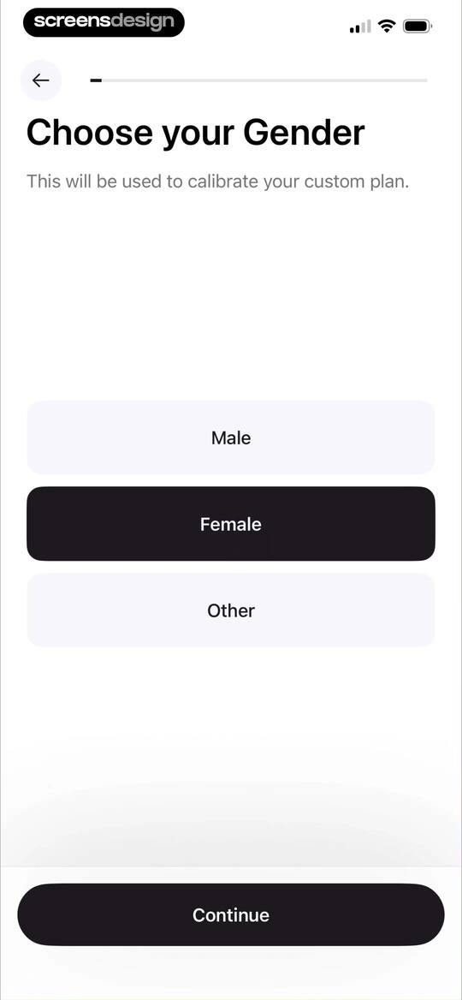
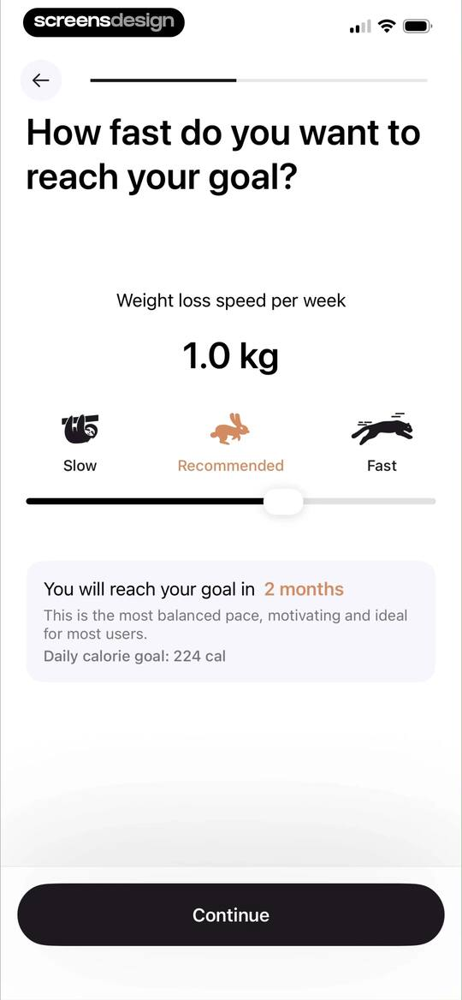
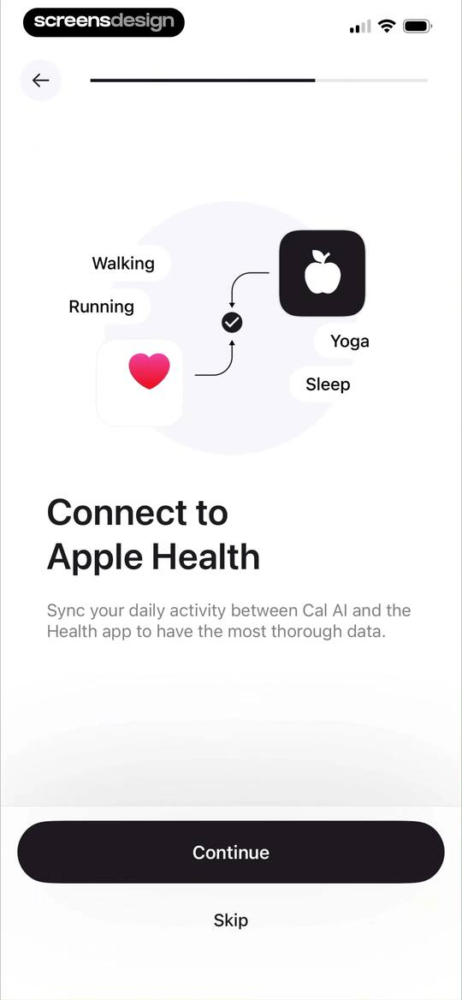
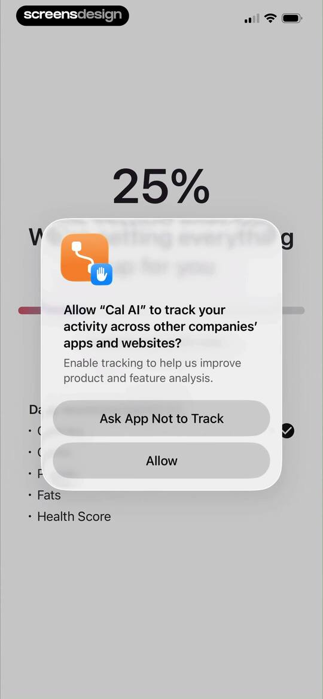
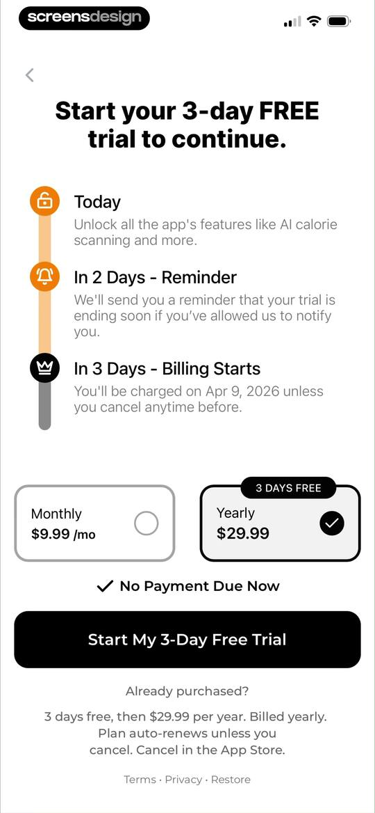
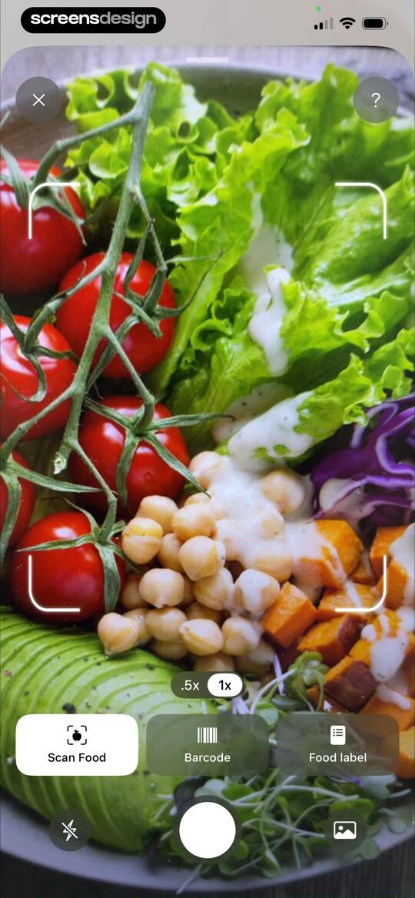
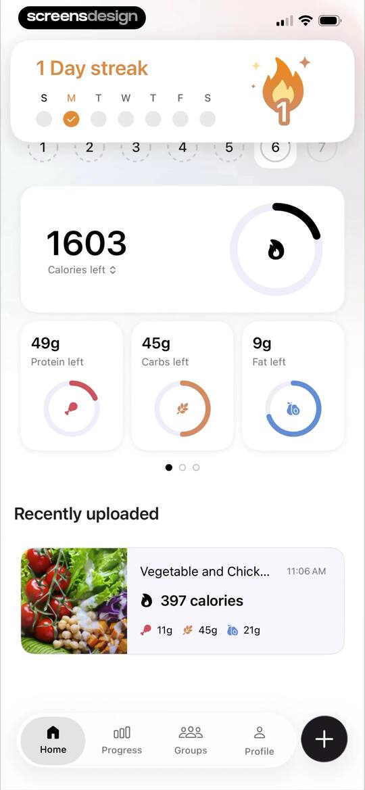
