# Calm Sleep - Rest & Relax Onboarding, Paywall & UX Flow — 98 Screens, $<5k/mo

Source: https://screensdesign.com/apps/calm-sleep-rest-relax/ (fetched 2026-10-05)

Stats: 

| # | Time | Image | What the screen shows |
|---|---|---|---|
| 1 | 00:02 | 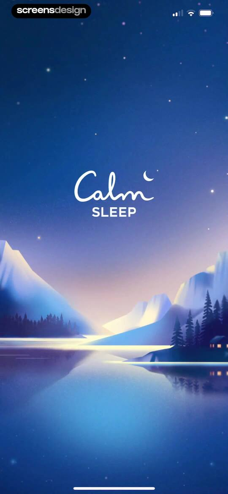 | Splash screen for the Calm Sleep app with a serene mountain illustration, brand logo, and sleep text against a deep blue night sky. |
| 2 | 00:05 | 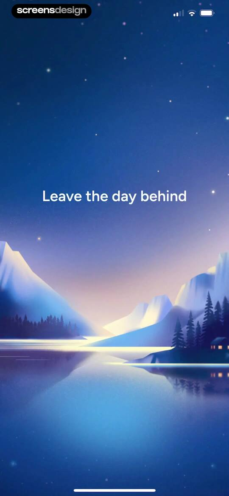 | Onboarding splash screen featuring a serene night landscape illustration and the centered text Leave the day behind. |
| 3 | 00:07 | 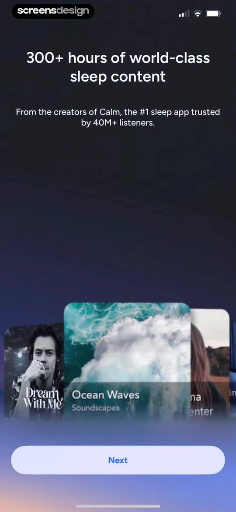 | Sleep app onboarding screen displaying a content carousel of audio experiences and a Next button. |
| 4 | 00:09 | 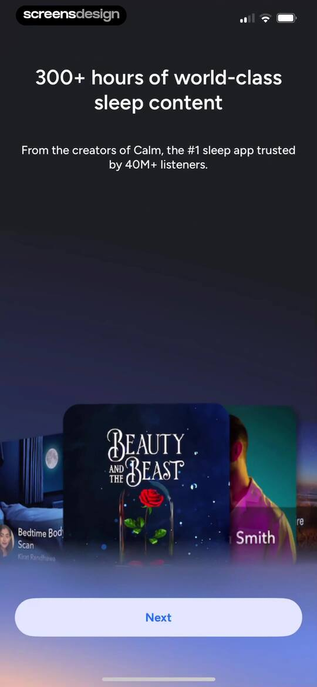 | Onboarding screen introducing sleep content with a central carousel of audio programs and a Next button. |
| 5 | 00:17 | 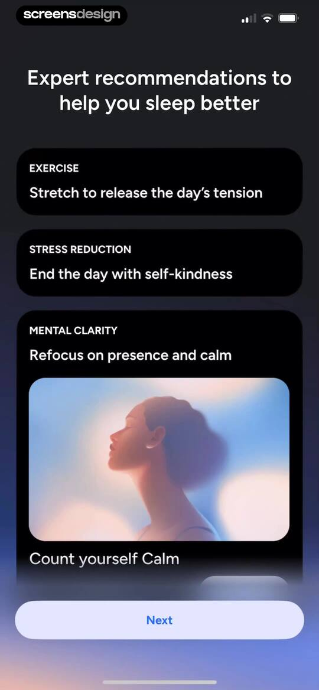 | Onboarding screen displaying expert wellness recommendations across three stacked category cards and a fixed Next button at the bottom. |
| 6 | 00:19 | 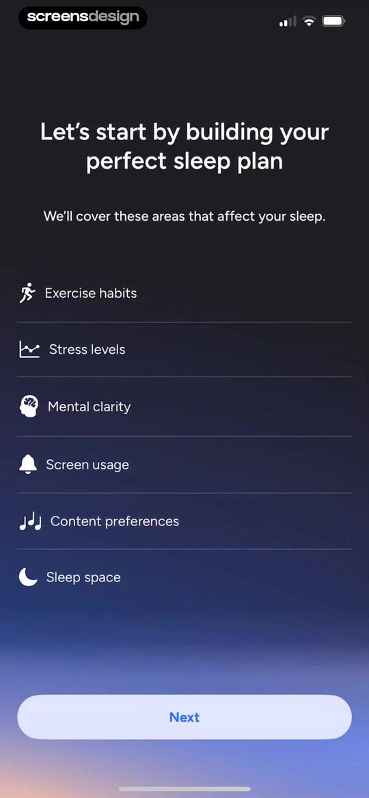 | Onboarding screen listing six sleep plan areas like exercise and stress levels, with a Next button at the bottom. |
| 7 | 00:22 | 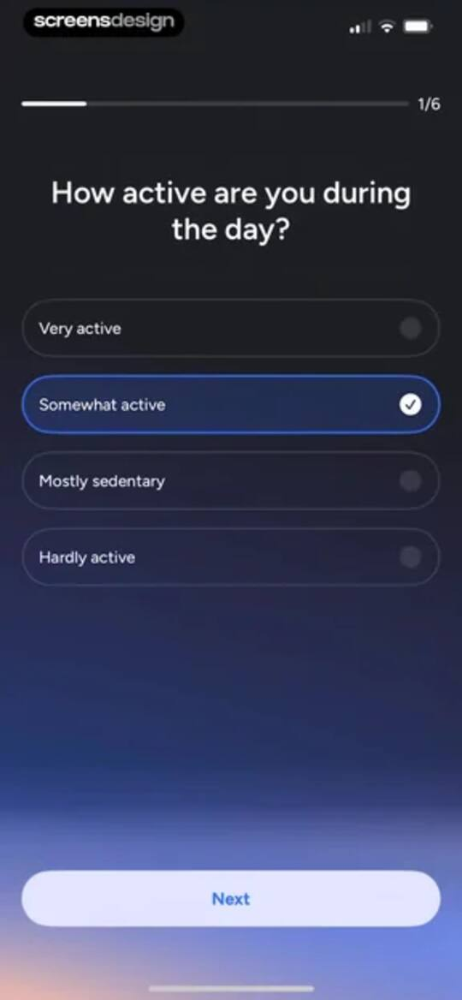 | Onboarding screen asking about daily activity level, with the somewhat active option selected and a next button. |
| 8 | 00:26 | 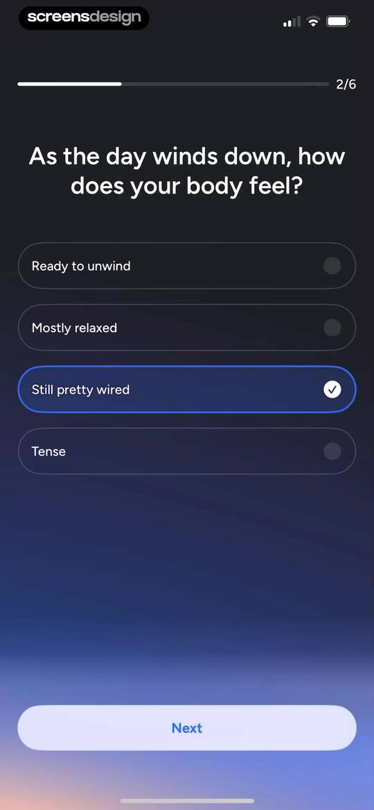 | Onboarding survey asking how the body feels at the end of the day, with the Still pretty wired option selected and a Next button. |
| 9 | 00:30 | locked | Onboarding questionnaire screen asking about the user's mental state before bed, with the first option selected and a Next button. |
| 10 | 00:33 | locked | Onboarding survey asking about bedtime screen habits, with four selectable cards where the last option is selected and a Next button below. |
| 11 | 00:39 | locked | Onboarding preference screen asking what helps you fall asleep, with Meditations, Breathing exercises, White noise, and Soundscapes selected, and a Next button. |
| 12 | 00:43 | locked | Onboarding questionnaire screen asking about bedroom sleep environment, with the option 'Kind of distracting' selected and a Next button. |
| 13 | 00:51 | locked | Sleep plan loading screen with a completed task list and a pending recommendations step. |
| 14 | 00:53 | locked | Sleep schedule onboarding screen with a circular dial for setting bedtime and wake-up times, accompanied by a Next button. |
| 15 | 01:04 | locked | Sleep schedule onboarding screen with a circular bedtime and wake-up dial, overlaid with a notification permission request modal. |
| 16 | 01:07 | locked | Permissions onboarding screen with an app tracking transparency modal overlaid on a sleep schedule graphic and a disabled Next button. |
| 17 | 01:09 | locked | Onboarding signup screen with a centered heading and a vertical list of four authentication options for email, Apple, Google, and Facebook. |
| 18 | 01:10 | locked | Permissions screen with a system authentication modal and multiple social sign-in options against a dark background. |
| 19 | 01:39 | locked | Calm account registration form with pre-filled user details, a password requirement box, and a Sign Up button. |
| 20 | 01:47 | locked | Onboarding welcome screen displaying a personalized greeting with the text Welcome to Calm Sleep, Julia against a dark gradient background. |
| 21 | 01:49 | locked | Subscription paywall screen promoting a seven-day free trial and yearly plan, with three feature points and a Try Free and Subscribe button. |
| 22 | 01:55 | locked | App Store subscription confirmation modal for Calm Sleep Premium showing a one-week free trial, annual pricing, and a side button confirmation prompt. |
| 23 | 02:00 | locked | Paywall screen with a centered success confirmation modal, feature list, and subscription pricing details with an OK button. |
| 24 | 02:06 | locked | Health app integration onboarding screen featuring a sleep duration chart and a Next button. |
| 25 | 02:10 | locked | Permission request screen featuring a weekly sleep quality chart card and a Next button. |
| 26 | 02:15 | locked | Onboarding check-in summary screen showing weekly sleep habits and a Next button. |
| 27 | 02:23 | locked | Health permissions request screen for Calm Sleep with toggles for data categories like sleep and heart rate, plus Allow and Don't Allow buttons. |
| 28 | 02:32 | locked | Onboarding survey screen asking how the user heard about Calm Sleep, with App Store selected and a Submit button. |
| 29 | 02:36 | locked | Onboarding screen explaining how completing tasks fills the sleep readiness bar, featuring a product mockup illustration and an I'm ready button. |
| 30 | 02:48 | locked | Home screen featuring a dark theme, a sleep readiness progress bar showing 0/3 completion, and daily mindfulness task cards. |
| 31 | 02:52 | locked | Calm app home screen with a daily progress indicator and two stacked cards for stress reduction and sleep space reflection. |
| 32 | 02:55 | locked | Sleep readiness onboarding screen with a progress indicator, a sleep space journaling card featuring a Start button, and a bottom navigation bar. |
| 33 | 02:57 | locked | Onboarding screen introducing the Journal feature with an illustration of a hand with a stylus, descriptive text, and a Next button. |
| 34 | 03:19 | locked | Onboarding text input form asking about an ideal sleep space, with user-entered text and a Save button. |
| 35 | 03:21 | locked | Onboarding screen prompting the user to describe their ideal sleep space, with user text entered and a saving status. |
| 36 | 03:23 | locked | Success confirmation screen displaying a checkmark icon and the text Entry saved in a minimalist dark theme. |
| 37 | 03:26 | locked | Onboarding screen displaying a sleep hygiene tip about bedroom environment and a Next button. |
| 38 | 03:28 | locked | Reflection screen displaying a journal entry about an ideal sleep space inside a central card with a close button. |
| 39 | 03:34 | locked | Home screen featuring a sleep readiness progress tracker, a featured meditation card with a play button, and an evening habit section. |
| 40 | 03:39 | locked | Onboarding splash screen featuring an autumn forest background and the centered white text overlay Moment of Calm. |
| 41 | 03:51 | locked | Audio player screen featuring an autumn forest background, centered pause and volume controls, and a bottom progress bar showing playback time. |
| 42 | 04:16 | locked | Dashboard with a progress bar and three content cards for mental clarity, digital hygiene, and stress reduction. |
| 43 | 04:17 | locked | Calm app dashboard featuring wellness content cards and a centered rating prompt asking if you are enjoying the app with Yes and No buttons. |
| 44 | 04:22 | locked | Dashboard with an app rating modal overlay asking the user to tap a star, featuring Cancel and Submit buttons. |
| 45 | 04:24 | locked | Feedback modal in the Calm app requesting a review with five gold stars and Write a Review and OK buttons. |
| 46 | 04:28 | locked | Calm app home screen with a sleep readiness progress bar and activity cards including a Start button for a stress reduction breathing exercise. |
| 47 | 04:32 | locked | Minimalist onboarding text explaining that longer exhales signal safety to the body and help unwind, set against a black background. |
| 48 | 04:36 | locked | Guided breathing exercise screen with a central breathing circle, the instruction Breathe In, a pause button, and three surrounding controls. |
| 49 | 04:41 | locked | Guided breathing exercise screen showing a central breathing visualizer with the instruction Breathe Out and a bottom control bar with pause and audio options. |
| 50 | 04:55 | locked | Calm home screen featuring a sleep readiness score, a Mental Clarity meditation card with a play button, and bottom navigation. |
| 51 | 05:00 | locked | Calm splash screen featuring an abstract swirling gradient background and centered white text that reads Moment of Calm. |
| 52 | 05:03 | locked | Audio player screen featuring centered playback controls and a progress bar over a vibrant abstract background. |
| 53 | 05:10 | locked | Sleep soundscape selection screen featuring a central Angel's Landing Trail card and a bottom swipe-to-play slider. |
| 54 | 05:13 | locked | Sleep soundscape selection screen featuring the Woodland Lake card and a bottom swipe-to-play slider. |
| 55 | 05:18 | locked | Media player screen for the Woodland Lake soundscape featuring a centered photo, playback controls, and a sleep timer. |
| 56 | 05:23 | locked | Sleep timer modal overlay listing duration options from Off to 6 hr, with Off selected and a close button. |
| 57 | 05:43 | locked | Search screen with a search bar, category tabs, and sections for top sleep stories and meditations. |
| 58 | 05:50 | locked | Content feed featuring top sleep stories of the week with narrator details and durations, displayed in a dark theme. |
| 59 | 05:56 | locked | Audio sleep story detail screen displaying media artwork for The Nordland Night Train, a description, narrator info, and a large play button. |
| 60 | 05:58 | locked | Audio content detail screen for The Nordland Night Train sleep story with a Play button and bottom navigation. |
| 61 | 06:03 | locked | Audio player screen for the sleep story The Nordland Night Train, featuring centered cover art, metadata, progress bar, and a large play button. |
| 62 | 06:25 | locked | Sleep meditations content feed featuring a list of audio tracks, a bottom mini-player for the current track, and a bottom navigation bar. |
| 63 | 06:28 | locked | Sleep meditation content detail page for Softly Back to Sleep with track variations, a play button, and a persistent mini-player in dark mode. |
| 64 | 06:40 | locked | Audio player screen for Softly Back to Sleep by Jerome Flynn, featuring a progress bar, mountain lake artwork, and a pause button. |
| 65 | 06:48 | locked | Content feed featuring sleep audio categories, playlists, and a search bar with a dark theme and active Discover navigation. |
| 66 | 06:51 | locked | Sleep tips discovery screen featuring a playlist card and a persistent mini-player with playback controls at the bottom. |
| 67 | 06:54 | locked | Content detail screen for a sleep audio series with a hero image, a play button, an episode list, and a bottom mini-player. |
| 68 | 07:14 | locked | Search screen displaying a dark-themed list of sleep audio results for the query sleep, with a persistent mini player and bottom navigation. |
| 69 | 07:21 | locked | Content detail screen for a sleep meditation featuring a hero image, play button, and a list of audio tracks. |
| 70 | 07:32 | locked | Health dashboard displaying weekly sleep insights with empty data cards and a central check-in button. |
| 71 | 07:43 | locked | Sleep quality assessment form asking How did you sleep last night with an Okay rating on the slider and a Next button. |
| 72 | 07:48 | locked | Sleep survey form asking how you slept last night, featuring a slider with the terrible rating selected and a Next button. |
| 73 | 07:51 | locked | Sleep survey screen asking how the user slept with a rating slider and a Next button. |
| 74 | 07:58 | locked | Sleep quality rating screen with the prompt 'How did you sleep last night?', the selection 'Good', a horizontal slider, and a Next button. |
| 75 | 08:02 | locked | Sleep quality rating form with the prompt asking how you slept, an Excellent label, a central glowing graphic, a slider, and a Next button. |
| 76 | 08:09 | locked | Onboarding sleep factors survey with categorized selectable pill buttons, featuring selected options like meditation and a primary plan button. |
| 77 | 08:14 | locked | Onboarding loading screen showing a progress list for generating a sleep plan, with three completed steps and the current step highlighted. |
| 78 | 08:18 | locked | Insights dashboard showing a weekly sleep check-in with empty duration and quality cards and a selected Tuesday check-in. |
| 79 | 08:25 | locked | My library home screen with horizontal carousels for favorites, recently played, and journal content cards in a dark theme. |
| 80 | 08:32 | locked | Content feed displaying a list of favorite meditation and sleep audio cards sorted by most recently added, with a bottom navigation bar. |
| 81 | 08:40 | locked | Journal dashboard displaying a single sleep reflection card with a prompt and a bottom navigation bar. |
| 82 | 08:43 | locked | Journal entry management screen with a bottom sheet modal offering options to edit or remove the selected entry. |
| 83 | 08:46 | locked | Onboarding text input form asking about an ideal sleep space, with a filled response and a Save button. |
| 84 | 08:49 | locked | Journal entry detail screen showing a sleep space reflection prompt and response, with edit and delete buttons. |
| 85 | 08:51 | locked | Journal entry confirmation modal asking to permanently remove an entry with Cancel and Delete buttons. |
| 86 | 08:54 | locked | Journal empty state screen with a dark theme, displaying a prompt to create the first entry and a bottom navigation bar with My Library selected. |
| 87 | 08:55 | locked | Empty state screen displaying an Entry removed message and a centered minus icon in a dark theme. |
| 88 | 09:05 | locked | Settings screen with grouped preference and account options, including sleep schedule and subscription management, displayed in dark mode with a bottom navigation bar. |
| 89 | 09:07 | locked | Sleep schedule settings screen with a circular dial displaying total sleep of 7 hours and 45 minutes, bedtime, wake-up time, and an Update button. |
| 90 | 09:14 | locked | Permissions screen providing numbered instructions for managing Apple Health data access in the Calm Sleep app. |
| 91 | 09:17 | locked | Notification settings screen with active toggles for morning and wind-down reminders in a dark theme. |
| 92 | 09:24 | locked | Calm Help Center screen featuring a search bar, landscape hero image, and category buttons for app support and troubleshooting. |
| 93 | 09:27 | locked | Manage Account settings screen with options to change account details or delete the Calm Sleep account. |
| 94 | 09:34 | locked | Calm login screen with social authentication buttons, email and password fields, and a Continue action button on a deep blue background. |
| 95 | 09:37 | locked | Account deletion confirmation screen in the Calm Sleep app detailing irreversible data loss and featuring a delete account button. |
| 96 | 09:39 | locked | Account deletion settings screen featuring an irreversible warning message, a confirmation modal, and a red delete account button. |
| 97 | 09:46 | locked | Settings about page displaying the Calm Sleep app version and legal links for Terms of Service and Privacy Policy. |
| 98 | 09:51 | locked | Legal document reader displaying the Calm Terms of Service with a Done button and bottom browser controls. |

## Free showcase screenshots (unordered)

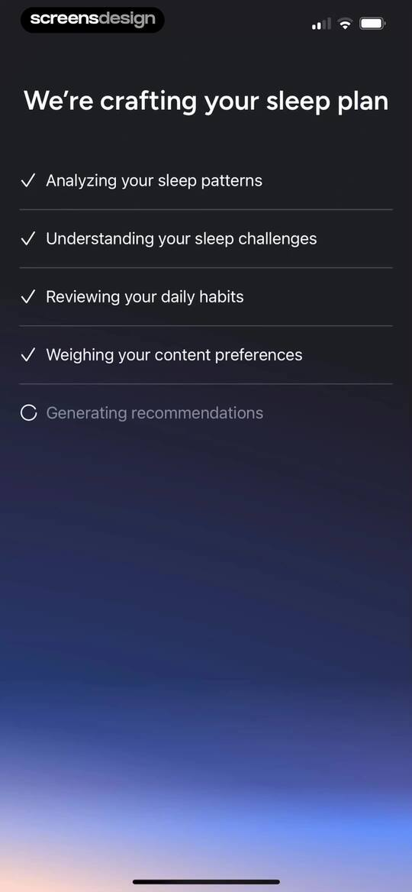
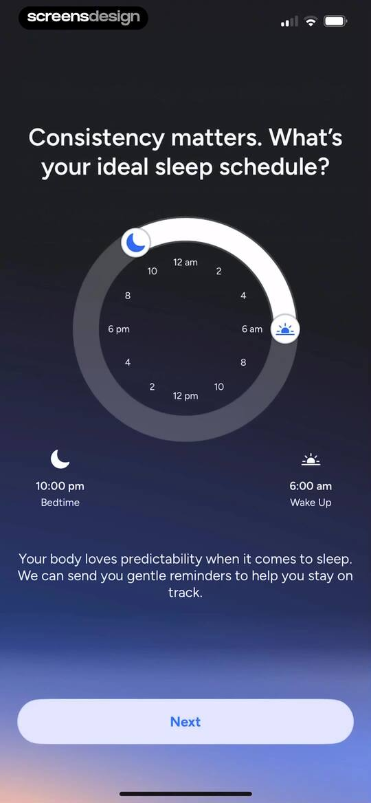
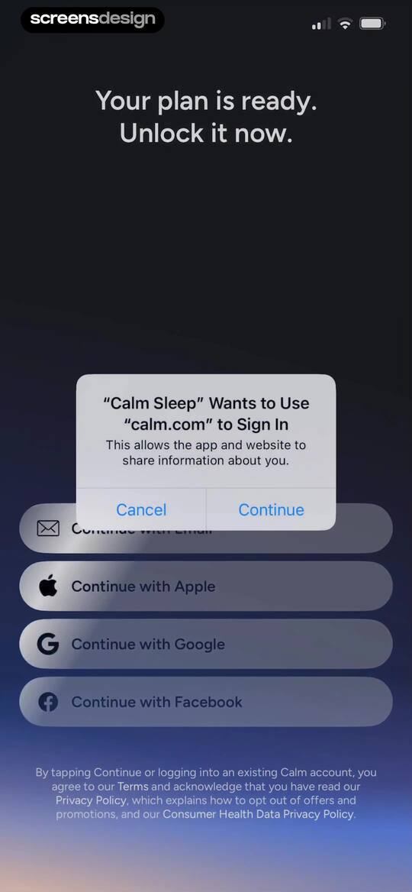
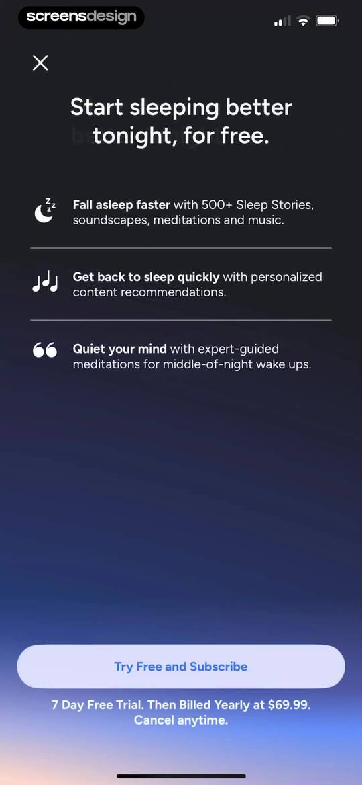
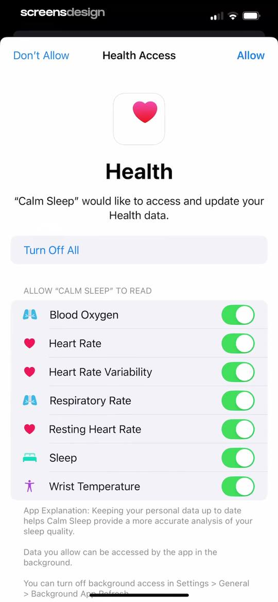
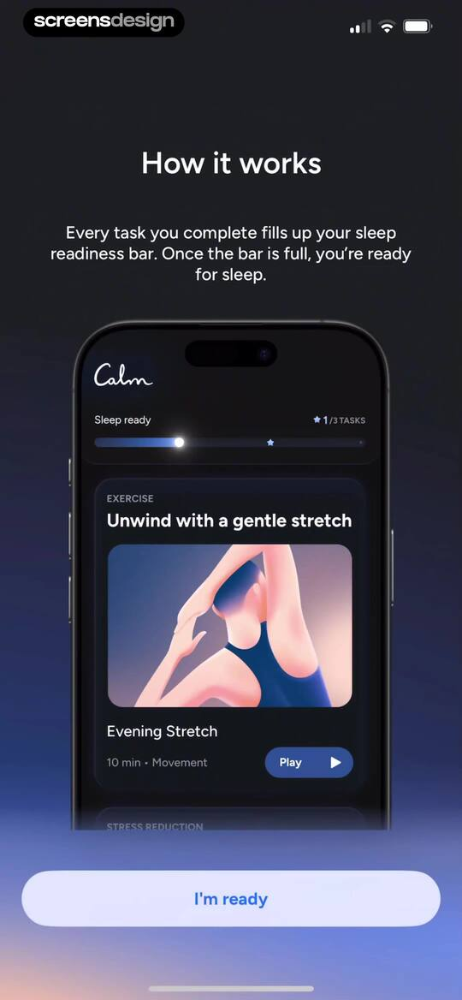
