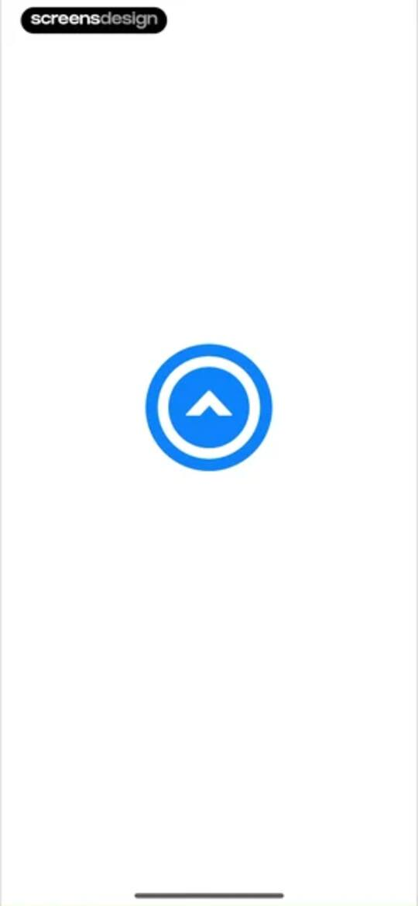
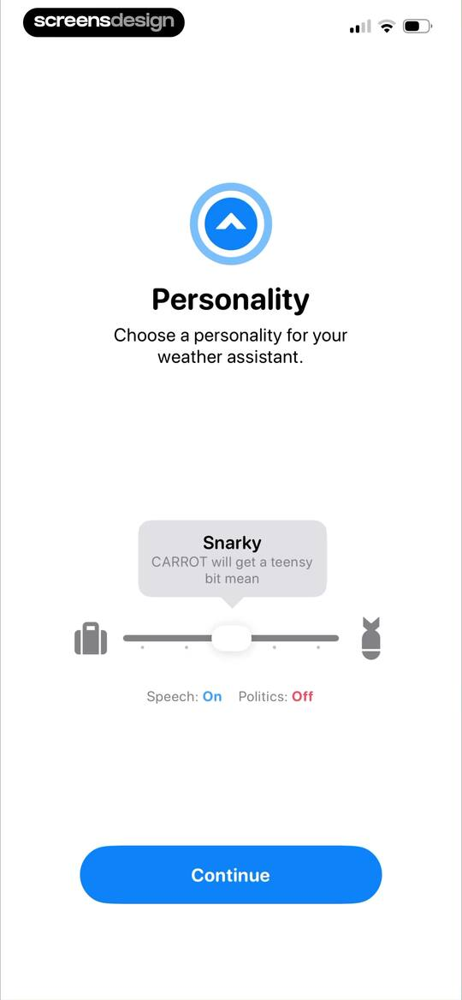
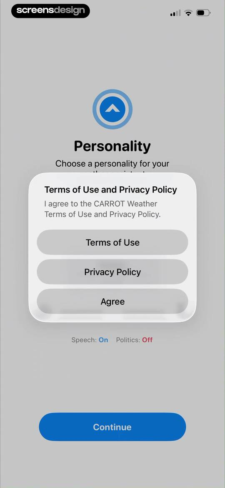
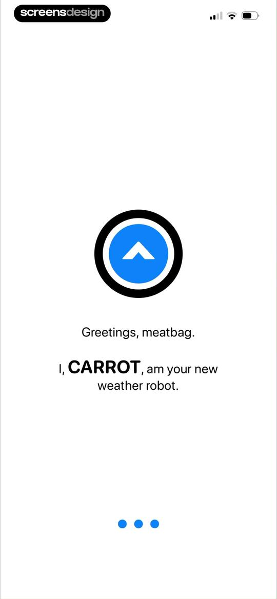
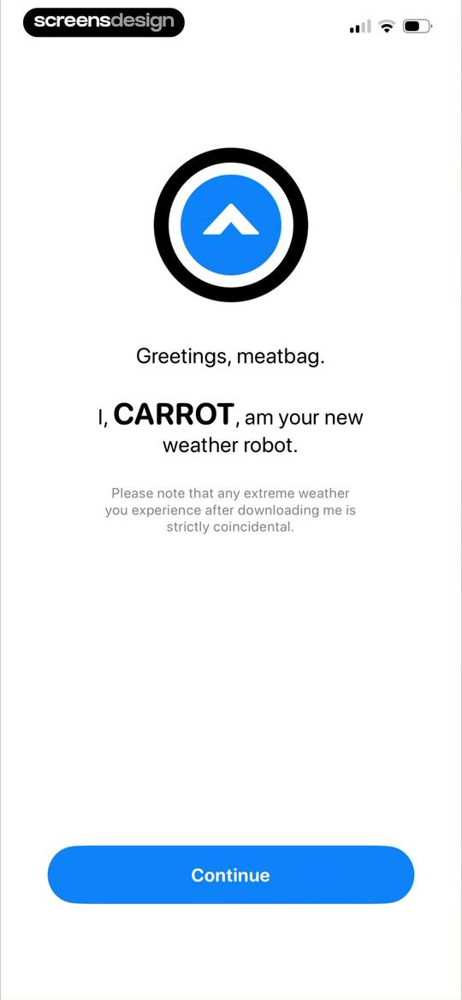
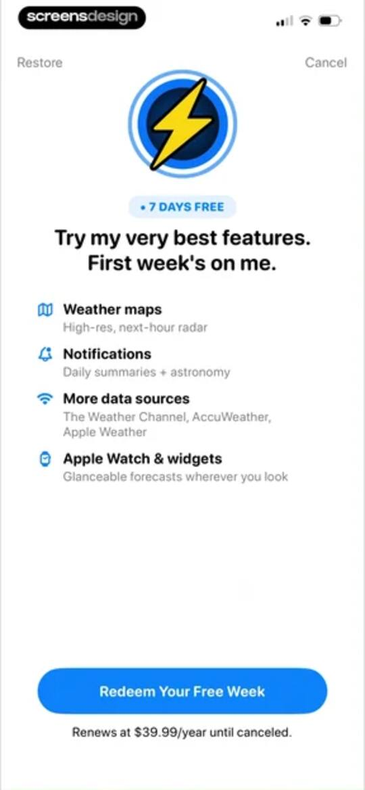
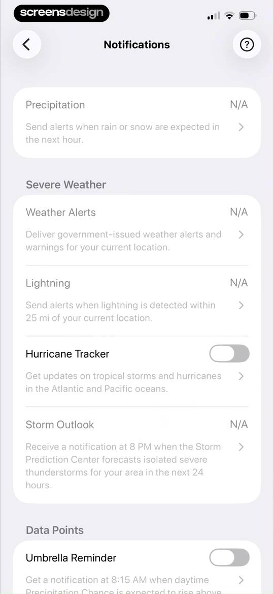
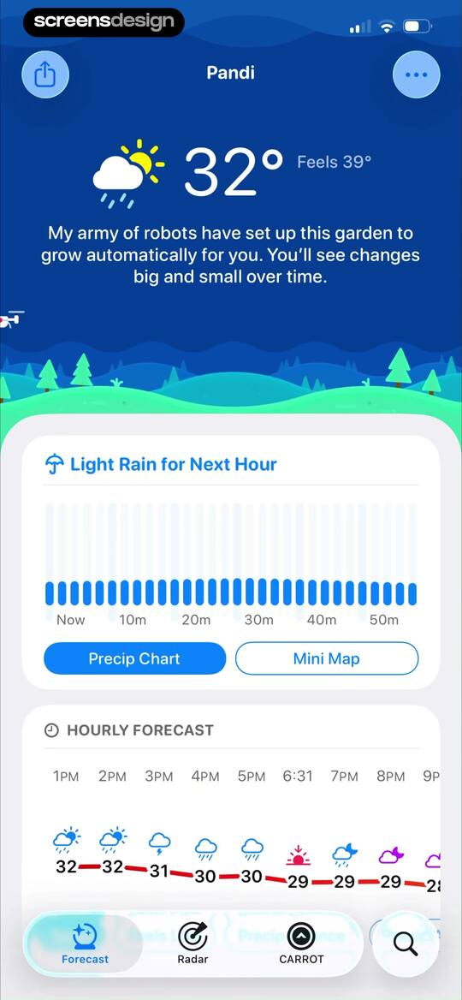
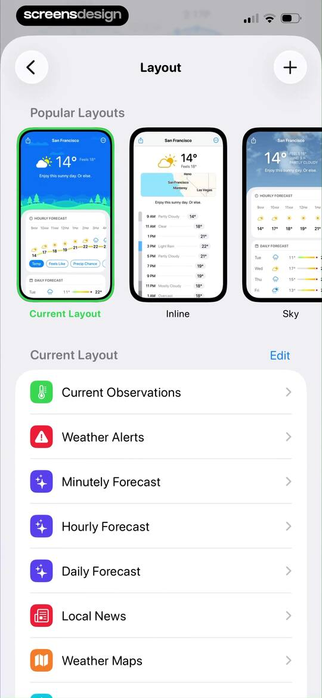
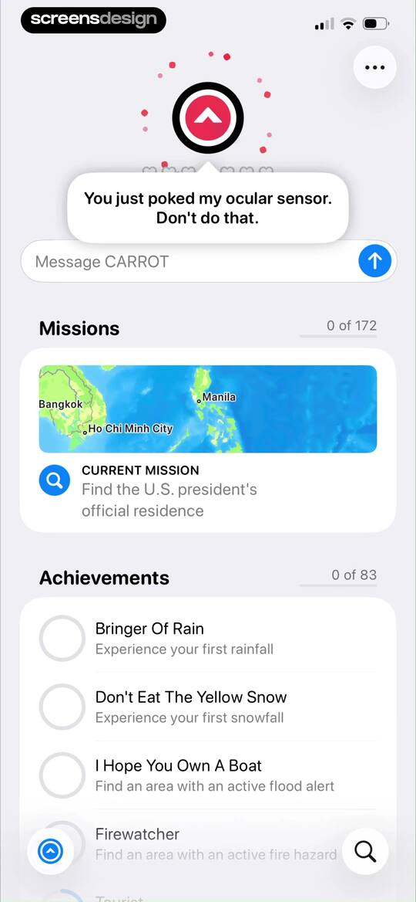

# CARROT Weather: Alerts & Radar Onboarding, Paywall & UX Flow — 164 Screens, $250k/mo

Source: https://screensdesign.com/apps/carrot-weather-alerts-radar/ (fetched 2026-10-05)

Stats: 

| # | Time | Image | What the screen shows |
|---|---|---|---|
| 1 | 00:00 |  | Minimalist transition screen with a centered blue circle containing a white upward-pointing chevron. |
| 2 | 00:11 |  | CARROT Weather onboarding screen with a personality slider set to Snarky, two settings toggles, and a Continue button. |
| 3 | 00:13 |  | CARROT Weather onboarding screen featuring a terms and privacy modal with an Agree button, settings toggles, and a Continue button. |
| 4 | 00:21 |  | CARROT Weather onboarding screen displaying a greeting message, the app logo, and pagination dots indicating the first step. |
| 5 | 00:24 |  | Onboarding screen for CARROT Weather featuring a welcome message, humorous disclaimer, and a Continue button. |
| 6 | 00:35 |  | Subscription paywall promoting a seven-day free trial with premium feature benefits and a Redeem Your Free Week button. |
| 7 | 00:42 |  | Subscription confirmation modal for CARROT Premium Ultra showing a one-week free trial and annual pricing. |
| 8 | 00:48 |  | Subscription paywall with a purchase success confirmation modal overlay and an OK button. |
| 9 | 00:51 | locked | Onboarding setup screen featuring interactive cards to configure notifications, widgets, and data providers, alongside a Premium Ultra membership plan and a Continue button. |
| 10 | 01:01 | locked | Permission request modal overlaying a notification settings page, explaining that location data must be stored on servers, with Continue, Privacy Policy, and Cancel buttons. |
| 11 | 01:04 | locked | Permission request modal asking if CARROT Would Like to Send You Notifications, overlaid on a notification settings list with Allow and Don't Allow buttons. |
| 12 | 01:10 | locked | Notification settings screen with grouped sections for precipitation, severe weather, and data points including toggles for hurricane tracker and umbrella reminder. |
| 13 | 01:12 | locked | Hurricane Tracker settings screen listing Atlantic Ocean and Eastern Pacific Ocean regions with both options selected. |
| 14 | 01:16 | locked | Notification settings screen displaying grouped report and astronomy alert options with toggle switches and a Do Not Disturb card. |
| 15 | 01:19 | locked | Moon phase settings screen featuring monitored phase icons with Full Moon selected and a delivery time set to 6:30 PM. |
| 16 | 01:24 | locked | Time selection form with a centered scroll wheel showing six forty PM and a back button in the top left corner. |
| 17 | 01:30 | locked | CARROT Weather settings screen for sunset alerts, displaying a Delivery Time option set to 30 Minutes Before. |
| 18 | 01:33 | locked | Settings screen for configuring sunrise notification delivery time, showing the current setting as thirty minutes before with an interactive card. |
| 19 | 01:41 | locked | Instructional screen for adding CARROT weather widgets to a lock screen, featuring a hero widget preview and a numbered guide. |
| 20 | 01:52 | locked | Weather data source settings screen listing global and regional providers, with Foreca selected and a featured provider card at the top. |
| 21 | 01:55 | locked | Data Source settings screen listing international weather providers, additional data toggles, and a back button. |
| 22 | 01:57 | locked | Data source settings screen displaying a modal overlay with a layout update notification and an OK button. |
| 23 | 02:11 | locked | Weather dashboard with a dark theme showing current temperature, a playful message, precipitation chart, and hourly forecast with the forecast tab selected. |
| 24 | 02:13 | locked | Weather dashboard displaying current temperature, personality text, a precipitation chart for light rain, and an hourly forecast. |
| 25 | 02:18 | locked | Weather details dashboard showing a grid of meteorological metrics and a bottom modal about precipitation live activity. |
| 26 | 02:23 | locked | Weather app temperature detail screen displaying a trend chart, summary cards for temperature and feels like, and an educational text block. |
| 27 | 02:38 | locked | CARROT Weather precipitation details dashboard displaying a daily chance chart, summary metric cards, and a humorous description. |
| 28 | 02:41 | locked | CARROT Weather precipitation dashboard displaying a rain intensity bar chart, summary cards for rain amount and chance, and educational text about precipitation. |
| 29 | 02:44 | locked | Weather dashboard screen displaying a wind speed chart, metric cards for speed and gusts, and educational text about wind. |
| 30 | 02:46 | locked | Weather dashboard displaying a line chart of wind gusts with a day selector, range summary, data toggle cards, and educational text about wind. |
| 31 | 02:51 | locked | UV Index screen in CARROT Weather showing a daily bar chart, day selection tabs, and educational information about ultraviolet radiation. |
| 32 | 02:55 | locked | Weather app humidity screen displaying a bar chart for Wednesday, July 8 with a range of 64% to 86% and educational text. |
| 33 | 03:00 | locked | Weather detail screen displaying a dew point line chart, daily temperature range, and an explanatory guide with a comfort scale. |
| 34 | 03:04 | locked | Weather dashboard line chart displaying atmospheric pressure trends for Wednesday, July 8, with day selector tabs and educational text below. |
| 35 | 03:09 | locked | Analytics screen for cloud cover in CARROT Weather featuring a bar chart, hourly data range, and educational text about okta measurements. |
| 36 | 03:15 | locked | Visibility weather dashboard showing a bar chart, visibility range for July 8, and educational text about visibility conditions. |
| 37 | 03:21 | locked | Air quality screen displaying a moderate index of 64, a pollutant breakdown list, and educational information about air pollution. |
| 38 | 03:28 | locked | Tide dashboard in the CARROT Weather app showing a tide chart, rising tide status, and a scrollable list of daily high and low tide events. |
| 39 | 03:35 | locked | Map selection screen with a tide station pin and an instructional footer to select a tide station for the location. |
| 40 | 03:46 | locked | Empty state screen titled Saved Stations with a top navigation bar and a minimalist white background. |
| 41 | 03:55 | locked | Astronomical data screen displaying a sun arc graphic, sunrise and sunset times, and photography lighting windows with a bottom navigation bar. |
| 42 | 03:58 | locked | Weather app sun dashboard displaying a graphical sun arc with sunrise and sunset times and a weekly forecast list. |
| 43 | 04:12 | locked | Moon phase screen displaying the current Last Quarter moon, illumination percentage, upcoming lunar events, and a seven-day forecast list. |
| 44 | 04:18 | locked | Weather dashboard in the CARROT weather app displaying a grid of data cards for metrics like temperature and wind speed, with a bottom navigation bar. |
| 45 | 04:22 | locked | Weather data points settings modal with a list of metrics like temperature and wind speed, featuring a Remove All button and delete controls. |
| 46 | 04:25 | locked | CARROT Weather data points settings modal with active and available metrics lists, a Remove All button, and a close icon. |
| 47 | 04:41 | locked | Weather dashboard displaying current temperature, precipitation map, and hourly forecast cards against a dark theme with a playful illustration. |
| 48 | 04:44 | locked | Weather dashboard in CARROT Weather showing hourly forecast, daily forecast list, and air quality index. |
| 49 | 04:46 | locked | CARROT Weather dashboard for Pandi featuring hourly and daily forecasts, air quality index, and bottom navigation. |
| 50 | 04:49 | locked | Weather dashboard in CARROT Weather displaying stacked cards for hourly forecast with precipitation data, daily forecast, and air quality index. |
| 51 | 04:51 | locked | CARROT Weather dashboard for Pandi displaying hourly and daily forecasts, precipitation details, and an air quality index with a bottom navigation bar. |
| 52 | 04:52 | locked | Weather dashboard in CARROT Weather showing hourly and daily forecasts, air quality index, and precipitation data for Pandi. |
| 53 | 04:55 | locked | Weather dashboard in CARROT Weather for Pandi, showing an hourly forecast with UV Index selected, a daily forecast list, and an air quality card. |
| 54 | 04:56 | locked | Weather dashboard for Pandi featuring hourly and daily forecast cards, an air quality index, and a bottom navigation bar. |
| 55 | 04:57 | locked | Weather app dashboard showing hourly and daily forecasts, metric toggles, and an air quality index with a bottom navigation bar. |
| 56 | 05:01 | locked | Weather app dashboard for Pandi featuring hourly and daily forecast cards and an air quality index. |
| 57 | 05:03 | locked | CARROT Weather dashboard for Pandi featuring hourly and daily forecast cards, an air quality index, and a bottom navigation bar. |
| 58 | 05:04 | locked | Weather dashboard for Pandi featuring hourly and daily forecast cards, an air quality index of 64, and a bottom navigation bar. |
| 59 | 05:07 | locked | CARROT Weather dashboard displaying stacked cards for Air Quality, Sun, and Moon data with a bottom navigation bar. |
| 60 | 05:10 | locked | Weather news feed listing headlines and sources, with a Customize Layout button and a bottom navigation bar. |
| 61 | 05:19 | locked | Layout settings screen displaying a carousel of layout presets with the current layout selected and a list of weather modules below. |
| 62 | 05:21 | locked | Sections settings screen for rearranging, inserting, or deleting weather dashboard items like forecasts and alerts with a reorderable vertical list. |
| 63 | 05:27 | locked | Weather app layout customization screen with a central dashboard preview, section configuration list, and an Add to My Layouts button. |
| 64 | 05:29 | locked | Weather widget preview screen displaying a phone mockup with current temperature, hourly forecast, and a humorous text snippet. |
| 65 | 05:32 | locked | CARROT Weather layout style settings modal with two selectable options, Plain and Card, with Plain currently selected. |
| 66 | 05:36 | locked | Weather layout settings modal displaying a list of configuration options, a preview for San Francisco, and an Add to My Layouts button. |
| 67 | 05:39 | locked | Sections settings screen with a vertical list of reorderable dashboard items and remove icons. |
| 68 | 05:43 | locked | Form modal prompting to choose a name for a new layout, with an input field containing the text Inline and an OK button. |
| 69 | 05:53 | locked | Layout gallery in CARROT Weather displaying categorized horizontal carousels of weather dashboard mockups with a close button in the top left. |
| 70 | 06:03 | locked | Weather app layout settings screen displaying an app preview, layout style options, a list of sections, and an Add to My Layouts button. |
| 71 | 06:04 | locked | Layout naming modal in CARROT Weather with the text Inline Copy entered and an OK button, over a settings background. |
| 72 | 06:09 | locked | Weather app settings screen displaying a dashboard preview, layout style selector, and an editable list of weather sections. |
| 73 | 06:17 | locked | Layout settings screen displaying preview cards for weather dashboard configurations and smart layout switching options. |
| 74 | 06:21 | locked | Layout settings screen displaying a carousel of layout previews, a layout gallery card, and smart layout configuration options. |
| 75 | 06:34 | locked | Weather dashboard for Pandi displaying a witty quote, an hourly forecast list, metric toggles with Temp selected, and summary precipitation details. |
| 76 | 06:35 | locked | Weather forecast dashboard for Pandi with metric tabs, summary details, a seven-day list, and a Customize Layout button. |
| 77 | 06:38 | locked | Weather dashboard showing a seven-day forecast list, summary details, and a Customize Layout button. |
| 78 | 06:40 | locked | CARROT Weather preview and share modal with the Plain style selected and a blue Share button at the bottom. |
| 79 | 06:44 | locked | CARROT Weather preview modal displaying a rainy weather card and an iOS system share sheet with various sharing and saving options. |
| 80 | 06:45 | locked | Permission request modal asking for photo access, displayed over a weather preview screen with settings toggles and an Allow button. |
| 81 | 06:49 | locked | Weather app home screen displaying a weekly forecast list and an open pop-up menu with options like Compare Sources and Settings. |
| 82 | 06:51 | locked | Weather source selection modal listing various providers with Foreca selected as the default, overlaid on a forecast list. |
| 83 | 06:56 | locked | Multi-Model Forecast dashboard displaying rain and temperature prediction charts across stacked cards with a day-selector tab bar. |
| 84 | 07:06 | locked | Weather forecast dashboard for Pandi with a Time Travel modal overlay open to July 4, 2026, displaying filter chips, hourly and daily forecasts, and bottom navigation. |
| 85 | 07:12 | locked | Weather dashboard displaying vertical metric cards for conditions, precipitation, and wind speed in Pandi, with a date selection bar set to July 5, 2026. |
| 86 | 07:14 | locked | Weather detail screen showing precipitation, wind speed, and solar data cards for Pandi, Philippines on July 5, 2026, with a date navigation bar. |
| 87 | 07:22 | locked | Weather home screen displaying a weekly forecast list with an open modal menu offering options like Compare Sources, Multi-Model Forecast, and Time Machine. |
| 88 | 07:32 | locked | Dashboard featuring a mission card to find the U.S. president's official residence and a list of locked weather achievements. |
| 89 | 07:36 | locked | CARROT Weather dashboard displaying an AI personality speech bubble, a message input field, and sections for missions and achievements. |
| 90 | 07:53 | locked | CARROT Weather dashboard displaying a mission map, message input, and a vertical list of achievements. |
| 91 | 07:55 | locked | CARROT Weather settings menu featuring a personality slider, voice configuration options, and feature toggles for achievements and secret locations. |
| 92 | 08:03 | locked | System permission modal requesting camera access for CARROT weather app features, overlaid on an achievement list and interaction controls. |
| 93 | 08:29 | locked | Achievement unlocked notification modal with a humorous prompt to feed an energy converter and a Continue button. |
| 94 | 08:32 | locked | App interface showing a central modal to pick an energy source overlaid on an achievement dashboard with character interaction buttons. |
| 95 | 08:38 | locked | Weather app interface featuring an achievement unlocked banner, server charge modal, and gamified mission tracker. |
| 96 | 08:52 | locked | CARROT Weather modal dialog instructing the user to speak a prompt aloud, featuring a Continue button and a background achievements list. |
| 97 | 08:56 | locked | Permission request modal asking for speech recognition access, overlaid on the CARROT app dashboard with Allow and Don't Allow buttons. |
| 98 | 08:58 | locked | Permissions modal requesting microphone access for CARROT with Allow and Don't Allow buttons over a dashboard view. |
| 99 | 09:00 | locked | Gamified weather app screen with a modal overlay prompting voice praise via a large microphone button over a list of missions and achievements. |
| 100 | 09:02 | locked | Modal alert in CARROT Weather titled Dictation Disabled, instructing the user to enable dictation in device settings, with an Ok button. |
| 101 | 09:13 | locked | Debug modal overlay displaying humorous character instructions and a Continue button over a gamified AI interaction and achievements screen. |
| 102 | 09:16 | locked | App interface with a centered Shake to Debug modal overlay over a dashboard featuring achievements and action buttons. |
| 103 | 09:17 | locked | Debug instruction modal with an OK button overlaid on a gamified dashboard showing achievements and action buttons. |
| 104 | 09:31 | locked | CARROT Weather dashboard with an AI interaction header, message input, missions, achievements, and a center modal to debug code. |
| 105 | 09:39 | locked | Chat restriction modal in CARROT Weather featuring a sarcastic AI message and an Ok button over the achievements list. |
| 106 | 09:47 | locked | Gamified mission interface with a world map background, a central modal introducing Mission No. 1, and a bottom status card displaying a clue. |
| 107 | 09:50 | locked | Mission screen featuring a playful modal prompt to locate the U.S. president's official residence over a world map background. |
| 108 | 10:01 | locked | Interactive map interface featuring a center scan prompt and a bottom mission card to find the U.S. president's official residence. |
| 109 | 10:12 | locked | Map screen displaying a current mission card with the objective to find the U.S. president's official residence. |
| 110 | 10:15 | locked | Map interface displaying a current mission card to find the president's official residence above a bottom navigation bar. |
| 111 | 10:19 | locked | Dashboard displaying achievements progress and a horoscope card with a Choose Zodiac Sign button. |
| 112 | 10:21 | locked | Achievement conditions screen displaying a vertical list of weather-related achievement cards with titles, descriptions, and icons. |
| 113 | 10:31 | locked | Dashboard with content cards for Horoscope, Term of the Day, and a Soundtrack progress tracker, featuring a Choose Zodiac Sign button. |
| 114 | 10:33 | locked | Zodiac sign selection form listing astrological signs with their date ranges, featuring a back button and floating search and scroll buttons. |
| 115 | 10:38 | locked | Dashboard showing soundtrack progress, high scores, and statistics with a card-based layout and bottom navigation. |
| 116 | 10:39 | locked | Soundtrack dashboard displaying unlock progress and a list of song titles with a progress indicator and lock icons. |
| 117 | 10:41 | locked | Soundtrack list with an unlock progress card showing one of fifteen tracks unlocked, a scrollable song list, and a persistent bottom media player. |
| 118 | 10:48 | locked | CARROT Weather profile screen displaying usage statistics and a list of social media links. |
| 119 | 10:50 | locked | Settings screen displaying a social media links list over statistics, with a floating menu featuring options like Edit Personality and AR Mode. |
| 120 | 10:52 | locked | Settings screen with a membership setup progress bar and grouped configuration options featuring trial badges. |
| 121 | 10:57 | locked | Home screen of the CARROT Weather app showing current weather, a map preview, precipitation chart, and hourly forecast with a witty personality message. |
| 122 | 11:02 | locked | Weather radar map showing a precipitation overlay over the Philippines, with a time scrubber panel at the bottom and a selected Radar tab. |
| 123 | 11:04 | locked | Weather map displaying a radar overlay with a playback timeline at the bottom and a layer selection menu in the corner. |
| 124 | 11:10 | locked | Weather radar map displaying a temperature overlay with a time scrubber panel and floating map tools at the bottom. |
| 125 | 11:18 | locked | Interactive weather map centered on the Philippines with a wind data overlay, top navigation icons, and a bottom time scrubber control panel. |
| 126 | 11:24 | locked | Interactive weather map displaying humidity levels across the Philippines with a bottom control panel for time-based forecast playback. |
| 127 | 11:29 | locked | Weather radar map showing precipitation over the Luzon region with a bottom control panel containing a time slider and play button. |
| 128 | 11:33 | locked | Weather radar map displaying precipitation over Luzon with a floating control panel, time slider, and layer toggle at the top right. |
| 129 | 11:42 | locked | Layers modal over a weather map listing options like radar, winds, and alerts with toggle switches and a close button. |
| 130 | 11:44 | locked | Weather radar settings screen displaying a map background with precipitation overlays and a bottom sheet modal with an opacity slider and forecast toggle. |
| 131 | 11:49 | locked | Weather map settings screen featuring an opacity slider for the winds layer and a back button inside a bottom sheet. |
| 132 | 11:52 | locked | Radar settings modal over a weather map, with the 1 Hour time range selected and a back button. |
| 133 | 12:03 | locked | Weather radar map screen with a modal alert about the Inspector Tool availability and an OK button. |
| 134 | 12:09 | locked | Location management screen displaying a weather summary card for Pandi, Philippines and a search bar at the bottom. |
| 135 | 12:14 | locked | Search screen displaying a list of airport locations matching the query JFK with an active search bar and keyboard. |
| 136 | 12:21 | locked | CARROT Weather home screen showing current temperature, a sarcastic personality message, a map widget, and an hourly forecast list. |
| 137 | 12:33 | locked | Weather home screen displaying a seven-day forecast, astronomical data for John F. Kennedy International Airport, and a Customize Layout button. |
| 138 | 12:45 | locked | Weather app home screen displaying an open overlay menu with advanced forecasting options and an hourly forecast list. |
| 139 | 12:51 | locked | Weather app dashboard showing an hourly visibility list with a personality text bubble and a top radar preview. |
| 140 | 12:54 | locked | Weather app preview and customization screen with a weather card, style options, toggle settings, and a Share button. |
| 141 | 13:00 | locked | Weather radar map in the CARROT Weather app with a bottom time-scrubber panel and the Radar tab selected. |
| 142 | 13:04 | locked | Settings screen displaying user statistics metrics and social media links in a light theme list layout. |
| 143 | 13:06 | locked | Settings screen featuring a top pop-up menu with personality options over statistics, a social media list, and bottom navigation. |
| 144 | 13:08 | locked | Settings screen with a membership setup progress bar and grouped setting lists featuring trial badges for premium features. |
| 145 | 13:10 | locked | Subscription management profile showing current Ultra Member status, renewal details, and a membership setup checklist. |
| 146 | 13:13 | locked | Subscription upgrade screen for a Premium Family plan at $59.99 per year, featuring an Upgrade to Family button and a help and support list. |
| 147 | 13:16 | locked | General settings screen in CARROT Weather displaying grouped options for units, location, personality, and audio. |
| 148 | 13:19 | locked | Settings menu with grouped options for general preferences, accessibility toggles, and a Delete Server-Side Data button at the bottom. |
| 149 | 13:22 | locked | Notifications settings screen for CARROT Weather with grouped sections for precipitation, severe weather, and data points containing toggle switches. |
| 150 | 13:26 | locked | Weather provider settings screen listing featured, popular nearby, and global options with Foreca selected. |
| 151 | 13:31 | locked | CARROT Weather Live Activities information screen detailing precipitation alerts and availability, with a Customize Live Activities button. |
| 152 | 13:36 | locked | Instructional screen detailing how to add and customize CARROT Weather widgets on an iOS Lock Screen, featuring a step-by-step list and widget previews. |
| 153 | 13:42 | locked | CarPlay How-To instruction guide for CARROT Weather featuring a product mockup and setup steps. |
| 154 | 13:47 | locked | Layout settings screen featuring a carousel of layout previews with the Inline option selected, a Layout Gallery card, and Smart Layout conditional options. |
| 155 | 13:51 | locked | Settings screen titled My Layouts listing weather dashboard options with thumbnail previews, delete buttons, and reorder handles. |
| 156 | 13:52 | locked | Settings screen titled My Layouts displaying a vertical list of saved weather dashboard layouts with delete and reorder controls. |
| 157 | 14:00 | locked | Display settings screen with appearance, weather icons, and font options, featuring San Francisco Rounded selected in the font list. |
| 158 | 14:03 | locked | Theme settings screen with options for light and dark mode, background choices, and accent colors, with Lucifer and Beelzebub selected. |
| 159 | 14:14 | locked | Settings screen listing icon set cards like SF Rocket Launcher and Paint Bomb for customizing weather app icons. |
| 160 | 14:26 | locked | App icon settings screen with a list of selectable icon options grouped by category, showing the Bolt icon selected. |
| 161 | 14:28 | locked | App icon settings screen displaying a list of icon options with Bolt selected and a confirmation modal overlay. |
| 162 | 14:37 | locked | About screen for CARROT Weather displaying app version details, social media links, grouped navigation lists, and a Self-Destruct button. |
| 163 | 14:40 | locked | CARROT Weather settings screen with a self-destruct confirmation modal displaying a warning and Cancel and Initiate buttons. |
| 164 | 14:46 | locked | Help and su pport screen with grouped list sections for user guides, bug reporting, and emergencies, plus a search bar. |

## Free showcase screenshots (unordered)

