# ClearSpace: Reduce Screen Time Onboarding, Paywall & UX Flow — 56 Screens, $7k/mo

Source: https://screensdesign.com/apps/clearspace-reduce-screen-time/ (fetched 2026-10-05)

Stats: 

| # | Time | Image | What the screen shows |
|---|---|---|---|
| 1 | 00:01 |  | Minimalist splash screen featuring a soft glowing cyan-blue light effect centered on a dark navy blue background. |
| 2 | 00:04 |  | ClearSpace onboarding sign-up screen with headline and stacked authentication buttons for phone, Google, and Apple sign-in. |
| 3 | 00:09 | 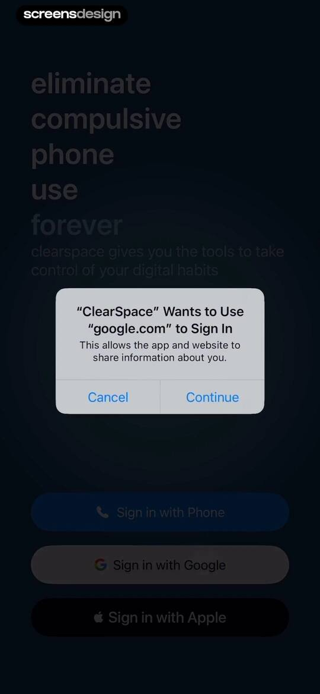 | ClearSpace app sign-up screen with a system permission modal for Google sign-in and alternative options for phone and Apple. |
| 4 | 00:12 | 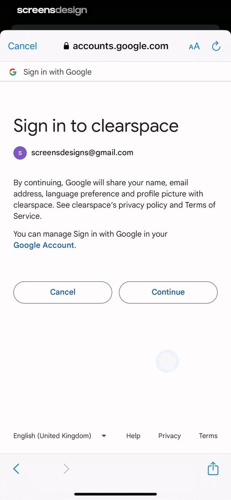 | Google OAuth consent screen for ClearSpace displaying the account email, sharing permissions, and Continue and Cancel buttons. |
| 5 | 00:25 | 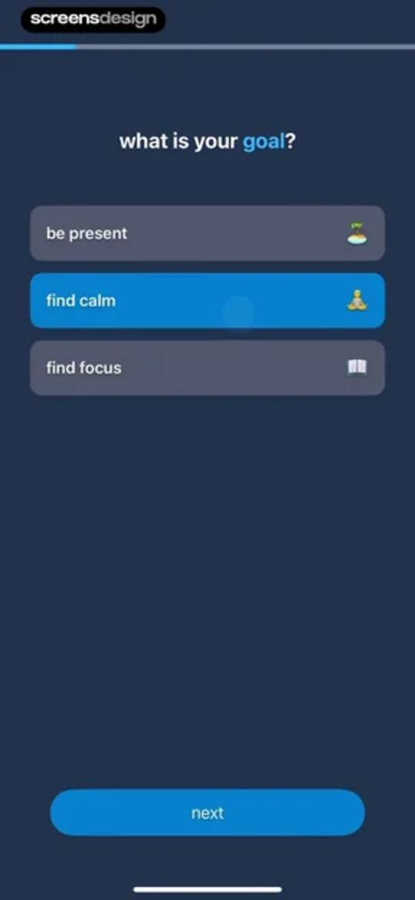 | Onboarding goal selection screen with three selectable cards, the find calm option selected, and a next button. |
| 6 | 00:31 | 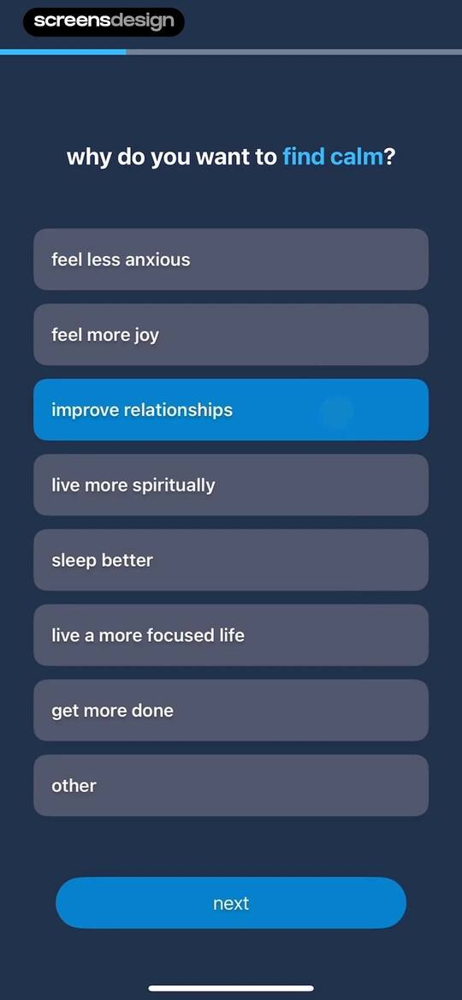 | Onboarding screen asking why you want to find calm, with improve relationships selected and a Next button. |
| 7 | 00:34 | 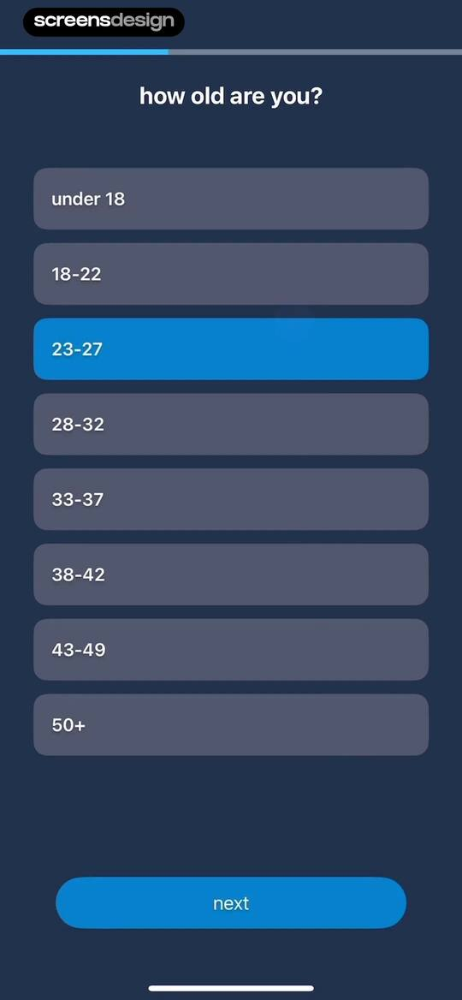 | Onboarding age selection screen asking how old are you, with the 23-27 age range selected and a Next button. |
| 8 | 00:38 | 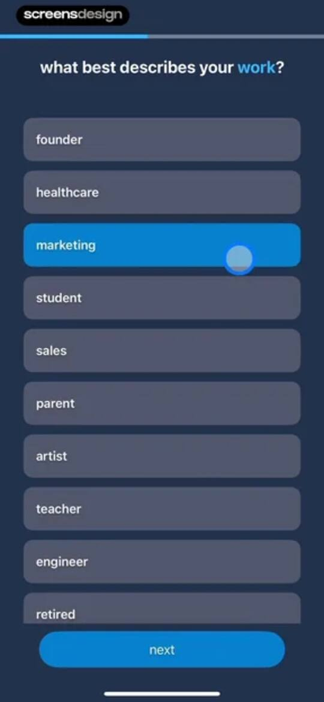 | Onboarding screen asking what best describes your work, with marketing selected from a list of categories and a next button. |
| 9 | 00:48 | locked | ClearSpace permissions onboarding screen with a system modal requesting access to Screen Time, featuring Continue and Don't Allow buttons. |
| 10 | 00:50 | locked | ClearSpace permissions onboarding screen requesting Screen Time access, featuring an hourglass icon, explanation text, and an Allow with Face ID button. |
| 11 | 00:55 | locked | Permission confirmation screen for the ClearSpace app stating that Screen Time access has been approved, with a Done button. |
| 12 | 00:59 | locked | ClearSpace onboarding permissions screen displaying a screen time card with a green checkmark and an iOS notification permission modal overlay. |
| 13 | 01:01 | locked | ClearSpace app onboarding permissions screen featuring a system tracking prompt modal with Allow and Ask App Not to Track buttons. |
| 14 | 01:03 | locked | Permissions onboarding screen requesting screen time and notifications access, with active green checkmark toggles and a Next button. |
| 15 | 01:09 | locked | Onboarding survey asking how the user heard about the app, with the from a friend option selected and a finish button. |
| 16 | 01:13 | locked | Subscription paywall for ClearSpace comparing screen time before and after use, featuring an annual plan option and a Start Trial button. |
| 17 | 01:30 | locked | ClearSpace onboarding empty state screen with a dark theme, featuring a prompt to restrict the first app and a prominent blue action button. |
| 18 | 01:42 | locked | Activity selection modal with a search bar, a scrollable list of apps where Facebook and Instagram are selected, and a save button. |
| 19 | 01:52 | locked | Form modal asking how many times to use the app per day, with a usage counter set to 3 and a save budget button. |
| 20 | 01:56 | locked | Onboarding setup complete modal with Facebook and Instagram icons, instruction text, and a Done button. |
| 21 | 02:01 | locked | ClearSpace home screen with a motivational habit tracker, app usage cards for Facebook and Instagram, and a bottom navigation bar. |
| 22 | 02:04 | locked | Strict mode confirmation modal with a time-picker set to five minutes, blocked app icons, a final warning message, and confirm buttons. |
| 23 | 02:23 | locked | Activity selection form featuring a search bar, a scrollable list of apps with Messenger selected, and a save button at the bottom. |
| 24 | 02:25 | locked | Onboarding form asking for daily app usage frequency, featuring a numeric counter set to 3 and a save budget button. |
| 25 | 02:28 | locked | Onboarding completion screen for a digital wellbeing app featuring a Messenger icon, setup complete message, and a done button. |
| 26 | 02:33 | locked | ClearSpace home screen with a streak tracker, strict mode toggle, and app usage cards showing a zero-day streak. |
| 27 | 02:35 | locked | Analytics screen showing a usage bar chart and a zero-day streak card, with the stats tab selected and a bottom navigation bar. |
| 28 | 02:41 | locked | App settings screen featuring a daily usage budget stepper, setup tab selected, and a strict mode active notification. |
| 29 | 02:49 | locked | Settings screen for configuring app session lengths with circular selection buttons and a highlighted two-minute duration. |
| 30 | 02:52 | locked | ClearSpace setup screen with a breathing duration selector highlighting fifteen seconds and multiple setting cards on a dark theme. |
| 31 | 03:02 | locked | App settings screen featuring a strict mode warning card, schedule tab selected, and a Get Started button. |
| 32 | 03:04 | locked | Schedule settings screen displaying a strict mode notification and a grid of access schedule options with the schedule tab selected. |
| 33 | 03:06 | locked | App schedule configuration screen displaying the working hours option with an activate button. |
| 34 | 03:08 | locked | Schedule settings screen in the ClearSpace app showing a working schedule card, strict mode alert, and add schedule button. |
| 35 | 03:11 | locked | Schedule settings screen displaying preset options like working hours and an alert about active strict mode. |
| 36 | 03:15 | locked | App settings modal displaying strict mode status and options to pause or remove Facebook with a remove app action in red. |
| 37 | 03:22 | locked | Usage statistics dashboard showing a weekly bar chart and a streak counter with zero sessions. |
| 38 | 03:25 | locked | Settings screen for configuring daily usage limits with a budget card, central counter, and configuration options. |
| 39 | 03:39 | locked | Active strict mode session screen displaying a four-minute countdown timer, an add time button, a list of blocked social media apps, and an OK button. |
| 40 | 03:43 | locked | Settings screen with strict mode active and a bottom modal listing app management actions like pausing or removing the app. |
| 41 | 03:48 | locked | Challenges dashboard listing three physical activity exercise cards with participant counts and start buttons above a bottom navigation bar. |
| 42 | 03:51 | locked | Challenge list form featuring a modal overlay with an invite code input field, cancel button, and join button. |
| 43 | 03:56 | locked | Challenge detail screen for a pushup fitness challenge, featuring an overview card, join and start buttons, and bottom navigation. |
| 44 | 04:03 | locked | Strict mode session screen indicating three minutes remaining, with an add time button and a list of blocked app icons. |
| 45 | 04:09 | locked | ClearSpace session extension screen with a time picker, a confirm button, and a list of blocked social media apps. |
| 46 | 04:18 | locked | Fitness challenge details screen with an overview of the squat to scroll challenge, a join a group button, and a start challenge button. |
| 47 | 04:21 | locked | Strict mode session screen displaying a one-minute timer, an add time button, a list of blocked app icons, and an ok button. |
| 48 | 04:36 | locked | Challenge detail screen for a step to scroll fitness activity with participation metrics, an overview card, and start challenge buttons. |
| 49 | 04:46 | locked | Settings screen with grouped sections for profile, account, help, and more, displayed on a dark theme with a bottom navigation bar. |
| 50 | 04:49 | locked | Goal setting form with filled input fields for a goal and subtext, a blue save button, and a system keyboard. |
| 51 | 04:57 | locked | Form for adding a teammate with an input field for name, an informational card, and an add teammate button. |
| 52 | 05:02 | locked | Teammate addition form with an informational card explaining notifications, a filled name field, and a disabled add teammate button. |
| 53 | 05:11 | locked | Form for adding a new teammate in ClearSpace, containing input fields for name and phone number, a save button, and a numeric keypad. |
| 54 | 05:13 | locked | Teammates management screen in dark mode, displaying a teammate entry for Mike, an add teammate button, and bottom navigation. |
| 55 | 05:18 | locked | Account settings screen displaying subscription dates and an edit subscription link, with the profile tab selected in the bottom navigation. |
| 56 | 05:24 | locked | Dark-themed settings screen with help, more, and account sections, including options to call a founder and sign out, with the profile tab selected. |

## Free showcase screenshots (unordered)

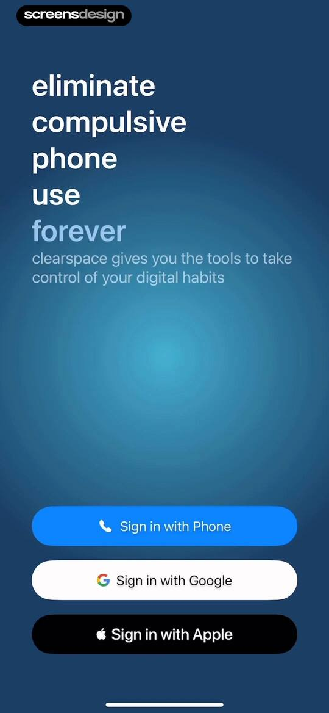

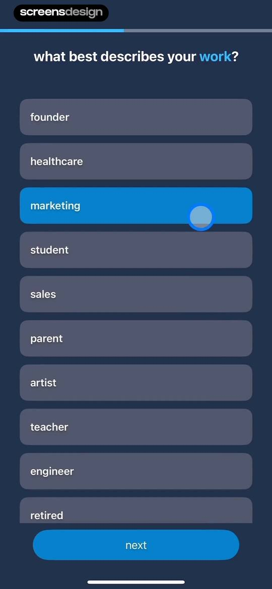
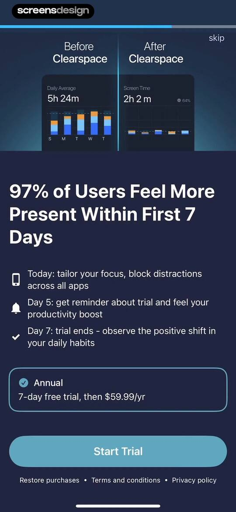
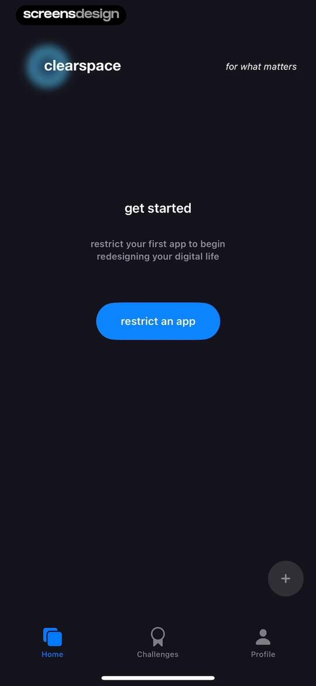
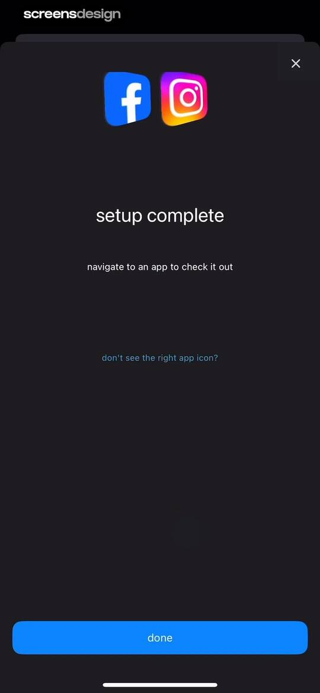
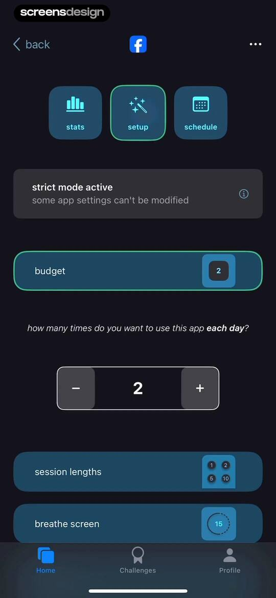
