# Duolingo: Language Lessons Onboarding, Paywall & UX Flow — 192 Screens, $53M/mo

Source: https://screensdesign.com/apps/duolingo-language-lessons/ (fetched 2026-10-05)

Stats: 

| # | Time | Image | What the screen shows |
|---|---|---|---|
| 1 | 00:00 | 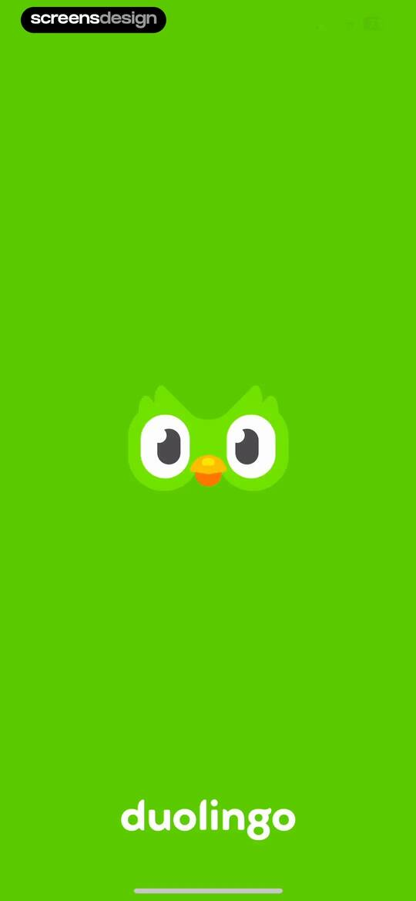 | Splash screen with a solid green background, the centered owl mascot logo, and the Duolingo brand name at the bottom. |
| 2 | 00:03 | 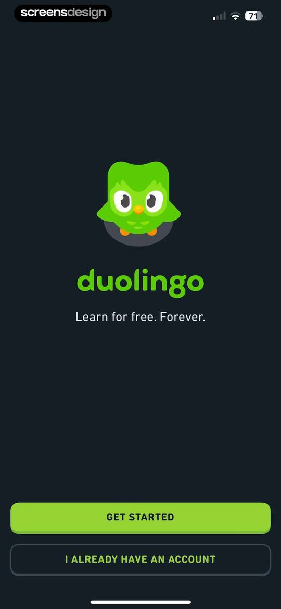 | Duolingo onboarding welcome screen displaying the owl mascot, tagline, Get Started button, and I Already Have An Account button on a dark background. |
| 3 | 00:13 | 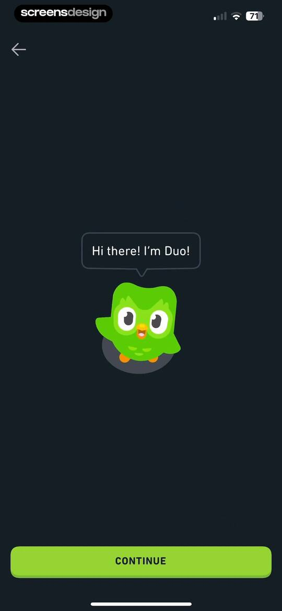 | Onboarding screen featuring a central mascot illustration with a speech bubble saying Hi there! I'm Duo! and a lime-green Continue button at the bottom. |
| 4 | 00:20 | 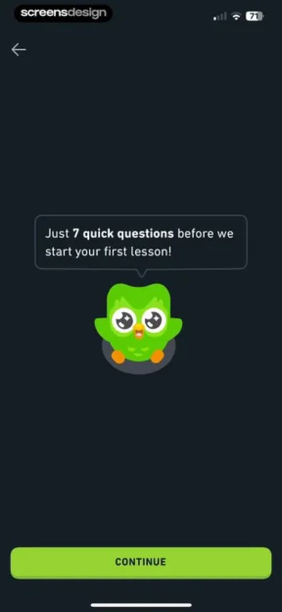 | Onboarding screen featuring the mascot in a speech bubble and a lime green Continue button. |
| 5 | 00:37 | 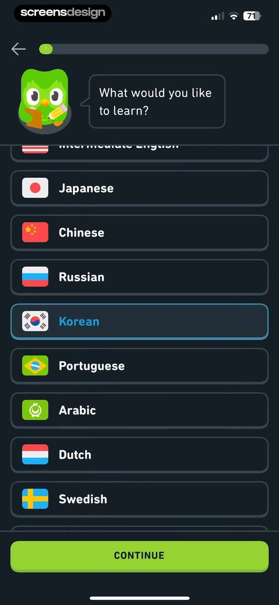 | Onboarding language selection screen with a scrollable list of languages, Korean selected, and a Continue button. |
| 6 | 00:41 |  | Loading screen displaying a central illustration of the Duolingo owl reading, with course building text and social proof. |
| 7 | 00:50 | 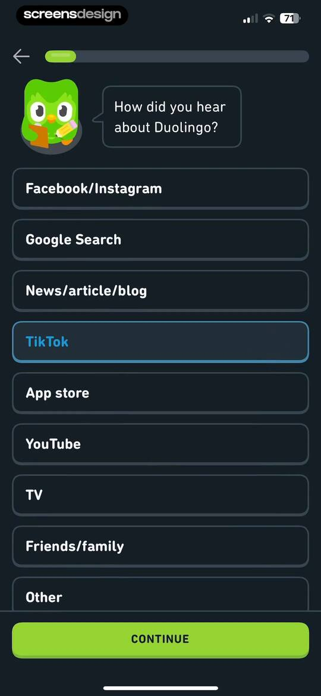 | Duolingo onboarding survey asking how the user heard about the app, with TikTok selected and a Continue button. |
| 8 | 00:57 | 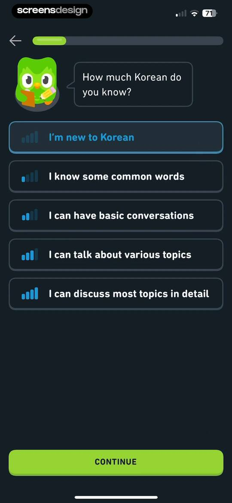 | Language proficiency onboarding screen asking how much Korean the user knows, with five selection cards and a Continue button. |
| 9 | 01:00 | locked | Onboarding screen featuring the mascot with a speech bubble and a lime-green Continue button at the bottom. |
| 10 | 01:07 | locked | Onboarding screen asking for language learning motivation with a list of options and a Continue button. |
| 11 | 01:11 | locked | Duolingo onboarding screen featuring the mascot in a speech bubble and a lime-green Continue button at the bottom. |
| 12 | 01:17 | locked | Onboarding screen asking for a daily learning goal, listing selectable time options with the casual goal selected and an I'M COMMITTED button. |
| 13 | 01:22 | locked | Language learning progress screen displaying a mascot message about learning 25 words in the first week, with a continue button. |
| 14 | 01:27 | locked | Duolingo notification permission request screen with a system modal, mascot speech bubble, directional arrow, and a bottom primary action button. |
| 15 | 01:30 | locked | Duolingo notification permission request screen featuring the mascot, a system modal, and a prominent green action button at the bottom. |
| 16 | 01:33 | locked | Widget promotion screen displaying a home screen preview with a streak icon, mascot speech bubble, and Add Widget button. |
| 17 | 01:44 | locked | Duolingo onboarding tutorial screen instructing the user to press and hold their home screen, featuring an owl mascot, central home screen graphic, and a Continue button. |
| 18 | 01:52 | locked | Duolingo onboarding tutorial illustrating how to add a widget, with instructions, a phone home screen graphic, and a Continue button. |
| 19 | 02:00 | locked | Onboarding screen outlining three-month learning benefits with a mascot, progress bar, and a Continue button. |
| 20 | 02:05 | locked | Onboarding screen asking where to start learning Korean, with the recommended start from scratch option selected and a Continue button. |
| 21 | 02:10 | locked | Onboarding screen featuring a mascot illustration, a speech bubble introducing the first lesson, and a Continue button. |
| 22 | 02:19 | locked | Language learning quiz screen with a correct answer feedback banner, an audio card, multiple choice options, and a continue button. |
| 23 | 02:27 | locked | Language learning quiz screen with a Korean character selection grid, correct answer feedback, and a Continue button. |
| 24 | 02:35 | locked | Language learning listening exercise with a speaker prompt, four choice cards, correct answer feedback, and a Continue button. |
| 25 | 03:34 | locked | Language learning audio quiz screen showing a correct answer selection with a green success message and a Continue button. |
| 26 | 03:38 | locked | Feedback overlay with a top progress bar, a mascot illustration, and the text 10 in a row on a dark background. |
| 27 | 04:00 | locked | Language learning matching exercise screen with a grid of Korean and romanized character cards, a success message, and a Continue button. |
| 28 | 04:19 | locked | Lesson completion screen displaying performance metrics including total XP, accuracy, and speed, with a Claim XP button. |
| 29 | 04:24 | locked | Duolingo onboarding screen featuring an encouraging speech bubble, a mascot illustration, and a Continue button. |
| 30 | 04:34 | locked | Milestone celebration screen showing a one-day streak with a mascot, weekly progress tracker, and an I'M COMMITTED button. |
| 31 | 04:46 | locked | Goal-setting onboarding screen with selectable streak duration cards, the 7 day streak option selected, and a commit button. |
| 32 | 04:49 | locked | Duolingo feature promotion screen encouraging users to add a home screen widget, featuring a preview of the widget and an Add Widget button. |
| 33 | 04:56 | locked | Onboarding prompt with a mascot illustration and message to save progress, featuring a Create Profile button and a Later link. |
| 34 | 05:05 | locked | Onboarding age input screen with the value 26 entered, a valid checkmark, a Next button, and social sign-up options. |
| 35 | 05:17 | locked | Onboarding name input form with filled fields for Julia and Screens, a top progress bar, and a NEXT button. |
| 36 | 05:32 | locked | Duolingo onboarding screen asking for an email address, with a pre-filled validated email and a Next button. |
| 37 | 05:42 | locked | Duolingo account creation screen featuring a password input field, a progress bar, and a CREATE PROFILE button on a dark background. |
| 38 | 05:51 | locked | Paywall screen comparing free and super subscription features, featuring a mascot at the top and a start my free week button at the bottom. |
| 39 | 05:56 | locked | Super Duolingo trial reminder modal featuring a mascot illustration, trial notification details, and a Start My Free Week button. |
| 40 | 06:02 | locked | Subscription paywall comparing family and individual plans, with the individual plan selected and a start free trial button. |
| 41 | 06:05 | locked | Paywall screen comparing three subscription plans, with the individual plan selected and a Start My Free Week button. |
| 42 | 06:19 | locked | iOS App Store payment modal for Super Duolingo subscription displaying trial details, pricing, and a confirmation button. |
| 43 | 06:26 | locked | Subscription success confirmation modal overlaying a paywall screen with multiple plan options and an OK button. |
| 44 | 06:34 | locked | Welcome screen for Super Duolingo featuring a glowing owl mascot illustration and the heading Welcome to Super Duolingo on a dark blue background. |
| 45 | 06:39 | locked | Super Duolingo paywall featuring the owl mascot and a Let's Go button on a dark gradient background. |
| 46 | 06:50 | locked | Onboarding screen highlighting ad-free lessons with a character illustration, progress bar, and a NEXT button. |
| 47 | 06:54 | locked | Onboarding feature tour screen with a progress bar, heading about the Practice Hub, product mockup illustration, and a More button. |
| 48 | 06:56 | locked | Duolingo onboarding screen introducing unlimited attempts at Legendary with a playful character illustration, progress bar, and a Continue button. |
| 49 | 06:59 | locked | Onboarding screen explaining the Unlimited Hearts feature with an infinity heart illustration, progress bar, and a GOT IT button. |
| 50 | 07:02 | locked | Onboarding screen featuring a progress bar at step five, an instructional prompt to turn on the Super App Icon, a central card with a toggle, and a Great button at the bottom. |
| 51 | 07:05 | locked | Duolingo onboarding confirmation screen showing a success message for changing the app icon with a progress bar and a Great button. |
| 52 | 07:07 | locked | Subscription confirmation screen displaying that a 3-day free trial has started, featuring an owl illustration and a NEXT button. |
| 53 | 07:10 | locked | Permission screen requesting contact access for Duolingo, featuring an owl mascot, a system permission modal, a sync contacts button, and a skip option. |
| 54 | 07:13 | locked | Duolingo permissions onboarding screen featuring a contact access request modal with options to sync contacts or continue without them. |
| 55 | 07:16 | locked | Permission request screen asking how to share contacts with Duolingo, featuring buttons for Select Contacts and Allow Full Access. |
| 56 | 07:19 | locked | Duolingo onboarding screen featuring a contact sync request and an error modal stating an unknown error occurred with an OK button. |
| 57 | 07:22 | locked | Duolingo onboarding success screen greeting Julia Screens with a mascot illustration and a Continue button. |
| 58 | 07:27 | locked | Home screen featuring a vertical learning path for Section 1 Unit 1 of a Korean course, with stats at the top and a bottom navigation bar. |
| 59 | 07:29 | locked | Duolingo dark mode home screen displaying a central lesson path, streak and currency counters at the top, and a bottom navigation bar. |
| 60 | 07:34 | locked | Subscription management settings screen featuring a Max promotion card, toggleable feature options, and a list of Super benefits. |
| 61 | 07:39 | locked | Duolingo Max paywall screen featuring a dark theme, a list of premium features with icons, an Upgrade to Max button, and a dismiss link. |
| 62 | 07:45 | locked | Duolingo Max paywall screen comparing Super and Max tiers with a feature table and an Upgrade to Max button. |
| 63 | 07:48 | locked | Subscription paywall comparing Family and Individual plans with the Family plan selected and an Upgrade to Max button. |
| 64 | 08:03 | locked | Subscription settings screen with a central confirmation modal stating that the app icon has been changed, featuring an OK button. |
| 65 | 08:14 | locked | Duolingo home screen displaying a Korean learning path with a pop-up modal to start lesson 2 of 7 for 20 XP. |
| 66 | 08:23 | locked | Language learning quiz screen showing a correct answer confirmation with the selection eo and a Continue button. |
| 67 | 08:31 | locked | Language learning quiz with a correct answer selected in a 2x2 grid, positive feedback, and a Continue button. |
| 68 | 08:35 | locked | Feedback modal overlay on a language learning lesson screen with options to report issues like audio or display problems. |
| 69 | 08:38 | locked | Language learning exercise screen displaying a multiple-choice question with four Korean character cards and a continue button. |
| 70 | 08:44 | locked | Language learning listening exercise with a central audio button, a 2x2 grid of answer cards with deo selected, and a Check button. |
| 71 | 08:47 | locked | Language learning exercise screen with an audio prompt, answer cards, and a bottom modal explaining the heart system, featuring a KEEP GOING button. |
| 72 | 08:50 | locked | Language learning listening exercise showing an incorrect answer state, the correct answer, and a GOT IT button. |
| 73 | 09:04 | locked | Language learning matching exercise showing an incorrect answer error message and a continue button. |
| 74 | 09:23 | locked | Language learning matching exercise showing a correct answer feedback message and a Continue button. |
| 75 | 09:43 | locked | Feedback screen showing a celebratory mascot illustration and the text 5 in a row over a dark background. |
| 76 | 10:18 | locked | Duolingo lesson review screen with a mascot speech bubble prompting to correct missed exercises, featuring a progress bar and a continue button. |
| 77 | 10:25 | locked | Language learning listening exercise with a 2x2 grid of answer cards, a selected option, and a continue button. |
| 78 | 10:37 | locked | Lesson complete summary screen featuring performance metric cards and a Claim XP button. |
| 79 | 10:48 | locked | Motivational screen showing a two-day streak challenge, weekly progress tracker with Monday completed, and a Continue button. |
| 80 | 10:53 | locked | Quest completion screen showing a Daily Quest complete notification with a 2/2 progress bar, gem counter, and a Continue button. |
| 81 | 10:59 | locked | Home screen showing a vertical language learning progress path for Korean with a green header card and a jump-ahead option. |
| 82 | 11:06 | locked | Modal prompt featuring the Duolingo mascot and an offer to pass a test to jump ahead to Unit 2, with Let's Go and Not Now buttons. |
| 83 | 11:19 | locked | Language learning quiz screen showing a correct answer selection with a Great feedback message and a Continue button. |
| 84 | 11:22 | locked | Language lesson exit confirmation modal with a warning about losing XP and buttons to keep learning or quit. |
| 85 | 11:35 | locked | Korean language course section selection screen with a vertical list of section cards, progress details, and a jump here action. |
| 86 | 11:41 | locked | Grammar explanation screen detailing Korean sentence structure with example phrases, audio icons, and collapsible sections for additional topics. |
| 87 | 11:48 | locked | Grammar guide screen displaying an expanded Word order lesson for Korean with sentence structure examples and collapsed sections. |
| 88 | 12:06 | locked | Super Duolingo settings screen with a Max upgrade card, feature toggles for unlimited hearts and app icon, and a list of subscription benefits. |
| 89 | 12:10 | locked | Duolingo shop screen featuring a Duolingo Max promotion card, a My Items inventory section, and subscription upgrade options. |
| 90 | 12:18 | locked | Subscription and inventory shop screen with a modal overlay explaining the Streak Freeze item and a Got It button. |
| 91 | 12:27 | locked | Subscription paywall screen promoting a family plan with benefit bullet points, a central illustration, and start and dismissal buttons. |
| 92 | 12:32 | locked | Subscription paywall comparing Family and Individual plans with the Family Plan selected and a switch button. |
| 93 | 12:36 | locked | Paywall screen comparing monthly, annual, and family subscription plans with pricing details and a Go Back button. |
| 94 | 12:45 | locked | Duolingo prompt offering an XP Boost for adding a home screen widget, featuring a preview illustration and Add Widget button. |
| 95 | 12:52 | locked | Onboarding instruction screen with a graphic illustration teaching how to add a widget and a Next button. |
| 96 | 12:57 | locked | Instructional overlay with a graphic illustration showing how to add a home screen widget, featuring a GOT IT button. |
| 97 | 13:07 | locked | Purchase modal for a timer boost with a buy button for 450 gems and a subscription section in the background. |
| 98 | 13:12 | locked | Duolingo shop modal displaying a Timer Boost item with a quantity of one and a Back to Shop button. |
| 99 | 13:23 | locked | Streak dashboard displaying a one-day streak summary, a social comparison insight card, and a monthly calendar view for March 2025. |
| 100 | 13:36 | locked | Streak dashboard displaying a one day personal streak summary card, activity stats, and a March 2025 calendar grid with milestone details. |
| 101 | 13:42 | locked | Streak feature screen with the Friends tab selected, a central mascot illustration, descriptive text, and an Add Friends button. |
| 102 | 13:45 | locked | Social discovery modal with three stacked action cards to find friends through contacts, search, or share link. |
| 103 | 13:48 | locked | Duolingo profile sharing modal displaying a QR code and user details, with buttons for messages, saving the image, and more options. |
| 104 | 13:50 | locked | Duolingo system permission modal requesting photo access overlaid on a sharing interface with Allow and Don't Allow buttons. |
| 105 | 13:53 | locked | Find your friends modal with three action cards and a toast notification indicating Image saved. |
| 106 | 14:00 | locked | Home screen showing an active Korean course, streak and gem counters, new course options, and a vertical learning path with a countdown timer. |
| 107 | 14:09 | locked | Course selection screen displaying categorized lists of new courses and language options, with a fixed Continue button at the bottom. |
| 108 | 14:12 | locked | Loading screen for a Duolingo math module with a central mascot illustration and the text Loading Math. |
| 109 | 14:16 | locked | Duolingo onboarding screen introducing the Math course with a mascot, three feature highlights, and a continue button. |
| 110 | 14:20 | locked | Onboarding screen asking where you are in your math studies with three level selection cards and a continue button. |
| 111 | 14:24 | locked | Onboarding level selection screen featuring beginner and intermediate math cards, a recommended tag, and a continue button. |
| 112 | 14:29 | locked | Learning path home screen showing a vertical progression map for Section 1 Unit 1 with an active lesson node and bottom navigation. |
| 113 | 14:32 | locked | Home screen featuring a horizontal course selector with Math selected, a new courses section including Music, and a bottom navigation bar. |
| 114 | 14:34 | locked | Duolingo loading screen featuring an illustration of the mascot reading books and motivational text about learning Korean. |
| 115 | 14:37 | locked | Proficiency test prompt modal with a mascot, featuring a START TEST button and a NO THANKS button. |
| 116 | 14:45 | locked | Korean learning screen featuring a LEARN THE LETTERS button and grids of vowel and double vowel cards. |
| 117 | 14:49 | locked | Onboarding lesson screen introducing basic Korean letters with character cards, audio buttons, and a Start Lesson button. |
| 118 | 14:57 | locked | Language lesson multiple-choice screen asking what sound a character makes, with options for a, g, and eo, and a disabled Continue button. |
| 119 | 15:09 | locked | Quest dashboard displaying daily progress and upcoming locked quests, with a bottom navigation bar showing the quests tab selected. |
| 120 | 15:17 | locked | Paywall screen promoting the Max subscription with a character illustration, UPGRADE TO MAX button, and a NO THANKS link. |
| 121 | 15:23 | locked | Paywall screen for Duolingo Max with a character illustration, a list of four premium benefits, and an upgrade button. |
| 122 | 15:27 | locked | Paywall screen highlighting Max subscription benefits with an upgrade button and feature cards for video calls and skill practice. |
| 123 | 15:31 | locked | Duolingo Max subscription paywall promoting Korean learning features with a character illustration, benefit list, and an upgrade button. |
| 124 | 15:35 | locked | Mistakes review dashboard displaying two recent learning errors and a start button to earn XP. |
| 125 | 15:38 | locked | Feedback screen featuring an illustrated mascot and a speech bubble with the message to review two mistakes, with a Continue button at the bottom. |
| 126 | 15:45 | locked | Language learning quiz screen showing a Korean character card, answer options, a correct feedback banner, and a Continue button. |
| 127 | 15:51 | locked | Language learning listening exercise with a 2x2 answer grid, correct feedback stating Amazing!, and a Continue button. |
| 128 | 15:56 | locked | Practice completion summary screen showing metric cards for XP, accuracy, and time, with a Claim XP button at the bottom. |
| 129 | 16:04 | locked | Duolingo success screen displaying a completion message for reviewing mistakes with a central owl illustration against a dark background. |
| 130 | 16:12 | locked | Korean vocabulary dashboard listing nine words with a disabled start practice button and instruction to complete more lessons. |
| 131 | 16:17 | locked | Korean vocabulary list with a sort bottom sheet overlaying the lower half, showing Recently learned selected with a checkmark. |
| 132 | 16:33 | locked | Instructional prompt screen with a mascot and speech bubble introducing a listening exercise, featuring a CONTINUE button. |
| 133 | 16:40 | locked | Language learning quiz screen with a Korean character pronunciation prompt, correct answer feedback, and a Continue button. |
| 134 | 16:45 | locked | Lesson exit confirmation modal with a concerned mascot illustration, a warning about losing XP, and Keep Learning and Quit buttons. |
| 135 | 16:52 | locked | Empty state screen for stories featuring an illustration of a mascot reading and the text Stories will appear here as you complete them. |
| 136 | 16:58 | locked | Leaderboard progress-gating screen with an instruction to finish 7 lessons, a leaderboard graphic, and a bottom navigation bar. |
| 137 | 17:00 | locked | Empty state screen with a placeholder leaderboard card and instruction to finish 7 lessons on a dark background. |
| 138 | 17:03 | locked | Content feed displaying achievement, streak tracker, and character cards with an active Start a Lesson button. |
| 139 | 17:06 | locked | Social discovery screen to find friends, featuring action cards for contacts, search, and a friend suggestion with a follow button. |
| 140 | 17:08 | locked | Profile sharing modal displaying a user card with a QR code and a bottom sheet for sharing options. |
| 141 | 17:10 | locked | Social discovery screen with options to find friends from contacts or by name, featuring a friend suggestion for ira allarey with a follow button. |
| 142 | 17:15 | locked | Language learning matching exercise screen with a grid of Korean characters and Romanized pronunciations, instruction text, and a disabled Continue button. |
| 143 | 17:26 | locked | Web view of a Duolingo advice blog post titled Dear Duolingo: tips for teaching kids a family language, with a Done button. |
| 144 | 17:34 | locked | Language learning app user profile screen displaying user stats, a weekly progress chart, and summary cards for streak and total XP. |
| 145 | 17:38 | locked | Course list screen displaying ira allarey's Korean language course with 205 XP. |
| 146 | 17:40 | locked | Social connections screen for Duolingo with the Following tab selected and an empty state message reading Not following anyone yet. |
| 147 | 17:42 | locked | Duolingo social screen showing the Followers list with one user card for Julia Screens and the Followers tab selected. |
| 148 | 17:49 | locked | Duolingo profile sharing screen displaying a central profile card with a QR code and avatar, accompanied by sharing options at the bottom. |
| 149 | 17:56 | locked | Profile achievements screen displaying personal records and a grid of award badges with progress indicators. |
| 150 | 17:57 | locked | Milestone celebration screen displaying an orange flame badge and text stating the user's longest streak is 4, set against a dark maroon background. |
| 151 | 18:02 | locked | Achievement milestone screen celebrating five perfect lessons on March 8, 2025, with a central character badge and close button. |
| 152 | 18:12 | locked | User profile report modal displaying reason options like Nudity and Spam over a dark-themed progress chart and stat cards. |
| 153 | 18:17 | locked | Profile dashboard with weekly progress and achievements, overlaid by an unblock user confirmation modal with Unblock and Cancel buttons. |
| 154 | 18:34 | locked | User profile screen displaying personal stats, an overview grid of gamification metrics, an Add Friends button, and friend streak slots. |
| 155 | 18:37 | locked | Avatar customization screen with a preview area, category tabs, a grid of body options, and a DONE button. |
| 156 | 18:45 | locked | Avatar customization screen showing a central preview, category tabs with eyes selected, eye color swatches, and a DONE button. |
| 157 | 18:51 | locked | Character customization screen for creating an avatar, featuring a central character preview, category tabs with hair selected, and a Done button. |
| 158 | 19:18 | locked | Avatar customization profile screen showing a cartoon avatar preview, category tabs with background color selected, and a color selection grid with a Done button. |
| 159 | 19:29 | locked | Profile screen showing user statistics, overview metrics, an add friends button, and friend streaks against a dark theme. |
| 160 | 19:39 | locked | User course list showing a single Korean language course card with 52 XP against a dark background. |
| 161 | 19:42 | locked | Duolingo friends list in dark mode, showing the selected FOLLOWING tab, a user profile card, and an Add Friends button. |
| 162 | 19:47 | locked | Social discovery screen to find friends featuring a close button and three action cards for choosing contacts, searching by name, and sharing a follow link. |
| 163 | 19:51 | locked | Profile sharing modal displaying a Duolingo QR code, user details, and a bottom action sheet with sharing options. |
| 164 | 20:00 | locked | Social discovery screen titled Find your friends, featuring three stacked interactive cards to connect via contacts, name search, or link sharing. |
| 165 | 20:04 | locked | Monthly badges dashboard for 2025 featuring a grid of circular placeholders with lock icons for each month. |
| 166 | 20:08 | locked | Achievements profile screen displaying personal records and a grid of earned and locked award badges on a dark background. |
| 167 | 20:10 | locked | Gamified achievement summary screen displaying a mascot illustration, date badge, and text confirming 52 XP earned in a day. |
| 168 | 20:12 | locked | Duolingo achievement sharing screen displaying a record of 52 XP earned in a day, with bottom sharing options including messages and save image. |
| 169 | 20:20 | locked | Achievement screen displaying a Flawless Finisher badge for completing a perfect lesson, with a Claim Reward button. |
| 170 | 20:24 | locked | Reward screen with a treasure chest illustration, a confirmation message that 10 gems were earned, and a continue button. |
| 171 | 20:35 | locked | Duolingo settings screen with grouped sections for account, subscription, and support options, featuring a Done button at the top. |
| 172 | 20:38 | locked | Duolingo settings screen with a vertical list of lesson experience toggles for sound, haptics, messages, exercises, and streaks. |
| 173 | 20:41 | locked | Profile settings form with a centered avatar, filled user input fields, and a delete account button at the bottom. |
| 174 | 20:50 | locked | Account deletion confirmation screen listing warnings about data loss and subscriptions, with a red Delete Account button. |
| 175 | 20:56 | locked | Notifications settings screen featuring a dark mode list of four categories for managing reminders, friends, leaderboards, and announcements preferences. |
| 176 | 21:11 | locked | Reminders settings screen with notification preferences and an active time-picker modal set to 5:00 PM with a Done confirmation button. |
| 177 | 21:17 | locked | Reminders settings screen displaying grouped notification preferences for practice and streaks, with a restore default button at the bottom. |
| 178 | 21:22 | locked | Notification settings screen displaying toggle options for New follower and Friend activity against a dark background. |
| 179 | 21:25 | locked | Leaderboards dashboard featuring a dark theme and a single league status card below the top navigation bar. |
| 180 | 21:31 | locked | Notification settings screen with toggle options for marketing and product updates, and a restore default button. |
| 181 | 21:36 | locked | Courses management screen displaying the Korean language course card with a remove action button in a dark theme. |
| 182 | 21:38 | locked | Course deletion confirmation modal warning about lost progress, with Remove and Cancel buttons over a dark background. |
| 183 | 21:46 | locked | Join a Classroom form in Duolingo for Schools with an empty six-digit input field row and a disabled SUBMIT button. |
| 184 | 21:50 | locked | Social accounts settings screen with options for Facebook, Google, and Contacts, showing the Contacts toggle enabled and others disabled. |
| 185 | 21:54 | locked | Privacy settings screen featuring toggles for analytics information collection and Duolingo location features. |
| 186 | 21:58 | locked | Subscription management screen displaying the current monthly plan details and upgrade offer cards with upgrade buttons. |
| 187 | 22:10 | locked | Duolingo Help Center FAQ screen listing expandable questions such as Why did my course change and What is a streak. |
| 188 | 22:17 | locked | Duolingo feedback form in a dark theme with a pre-filled email address and empty issue description and subject fields. |
| 189 | 22:25 | locked | In-app browser showing Duolingo terms and conditions of service with a promotional app banner and a Done button. |
| 190 | 22:31 | locked | In-app browser showing the Duolingo Privacy Policy with an app promotional banner at the top and a Done button. |
| 191 | 22:38 | locked | Acknowledgements screen listing open-source libraries used by Duolingo, with a top navigation bar and a Done button. |
| 192 | 22:42 | locked | Duolingo settings screen in dark mode with grouped options for account management, subscription details, and a Done button. |

## Free showcase screenshots (unordered)

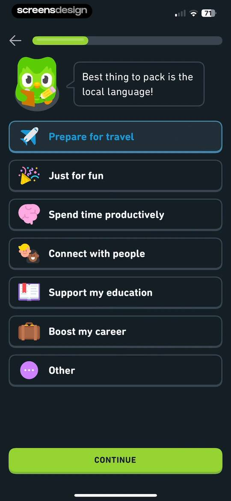
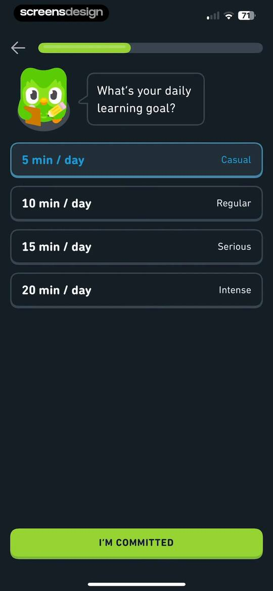
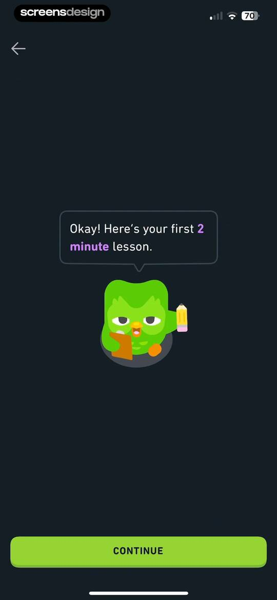
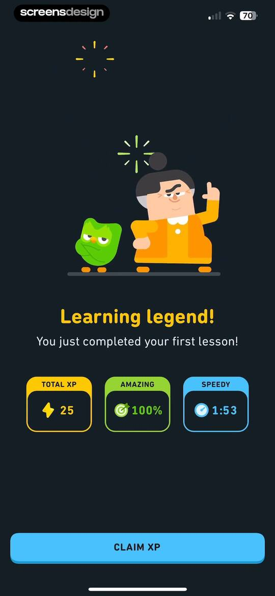
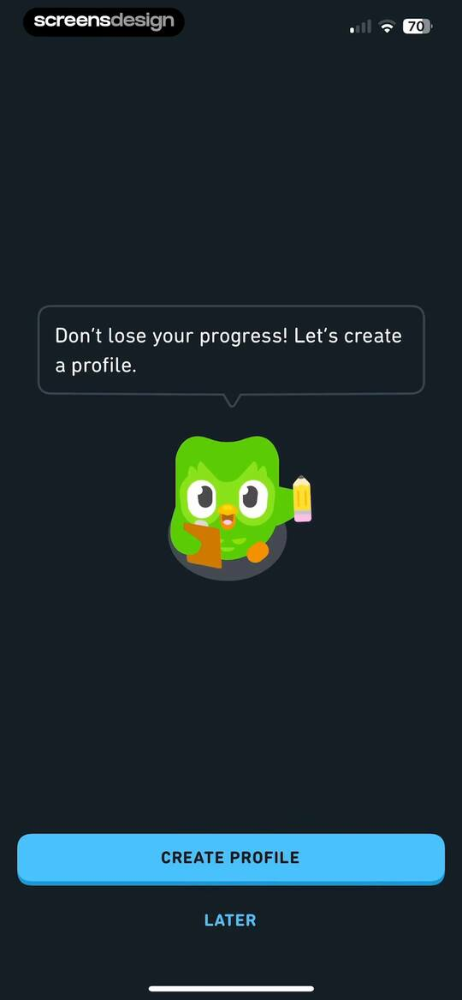

