# Finch: Self-Care Pet Onboarding, Paywall & UX Flow — 183 Screens, $1M/mo

Source: https://screensdesign.com/apps/finch-self-care-pet/ (fetched 2026-10-05)

Stats: 

| # | Time | Image | What the screen shows |
|---|---|---|---|
| 1 | 00:00 | 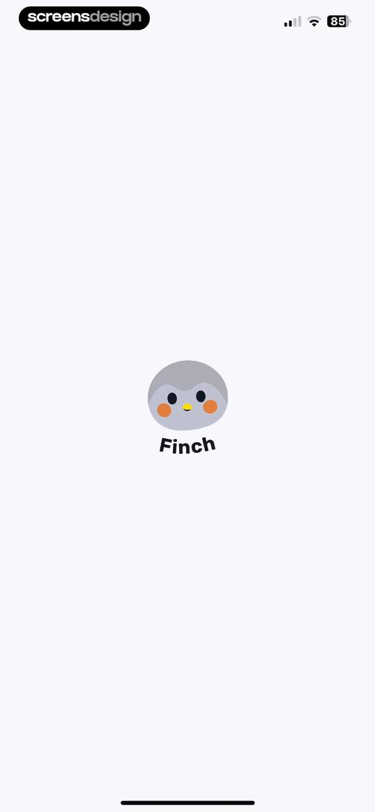 | Splash screen for the Finch app featuring a centered mascot illustration above the brand name on a minimalist white background. |
| 2 | 00:04 | 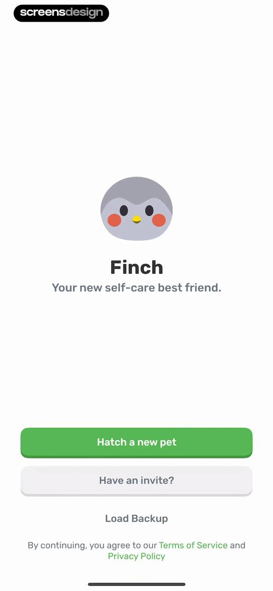 | Finch onboarding screen with a character illustration, tagline, and action buttons to hatch a new pet, use an invite, or load a backup. |
| 3 | 00:09 | 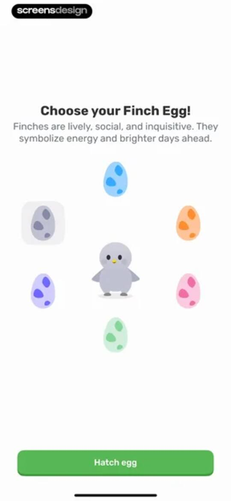 | Finch onboarding screen prompting users to choose a virtual pet egg, featuring a circular egg arrangement and a Hatch egg button. |
| 4 | 00:17 | 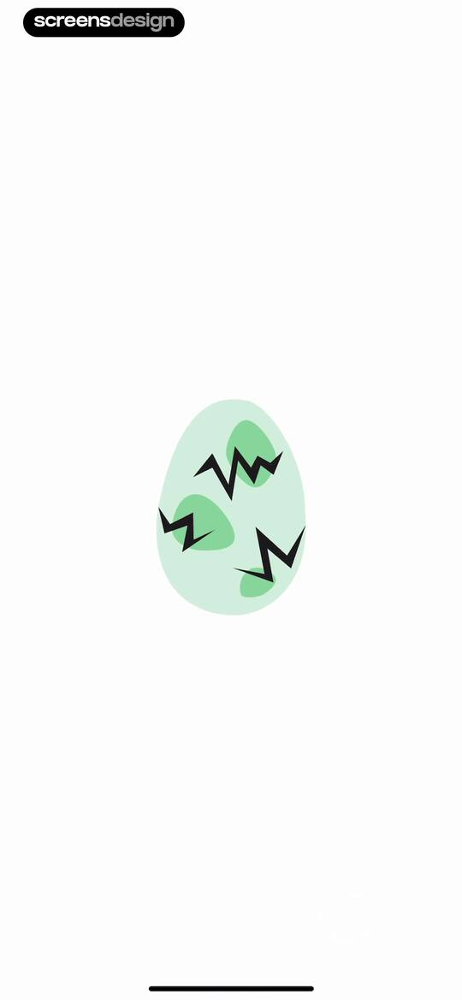 | Onboarding loading screen featuring a centered minimalist illustration of a cracked light green egg on a white background. |
| 5 | 00:18 | 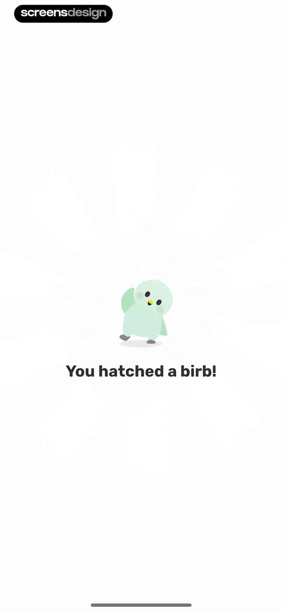 | Finch onboarding screen featuring a cute character illustration of a hatched virtual pet and the text You hatched a birb. |
| 6 | 00:24 |  | Onboarding screen for selecting virtual pet pronouns with the she/her option selected and a Next button. |
| 7 | 00:33 | 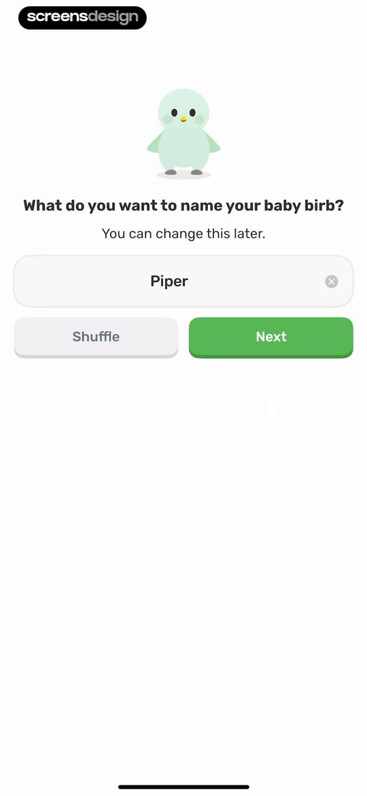 | Finch onboarding screen prompting users to name their baby birb, featuring a text input pre-filled with Piper and Shuffle and Next buttons. |
| 8 | 00:39 | 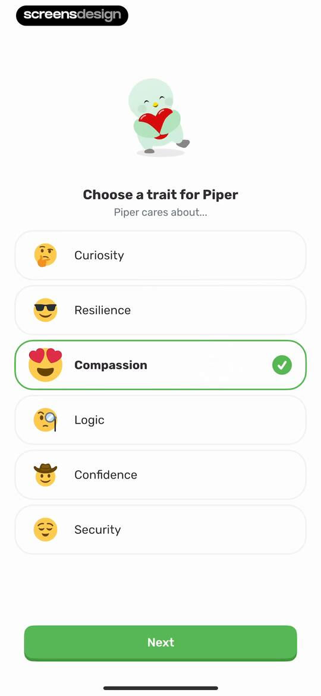 | Onboarding screen for selecting a virtual pet trait, featuring a list of options with Compassion selected and a Next button. |
| 9 | 00:49 | locked | Finch onboarding screen featuring a virtual pet asking for the user's name, with the name Julia entered in the input field and a Next button. |
| 10 | 00:52 | locked | Onboarding screen featuring a virtual pet asking what self-care is, with two stacked buttons offering different definitions. |
| 11 | 00:58 | locked | Finch app reward screen showing a pet character with a speech bubble, a Logic stat gain notification, and a Next button. |
| 12 | 01:03 | locked | Finch onboarding screen featuring an illustration of Piper the bird, an energy progress card showing 0 out of 15, and a Next button. |
| 13 | 01:08 | locked | Notification permission prompt featuring a preview card, a character illustration of Piper, and Turn on notifications and Maybe later buttons. |
| 14 | 01:14 | locked | Notification permission screen featuring a mock reminder from a virtual pet and a system alert modal with Allow and Don't Allow options. |
| 15 | 01:29 | locked | Email subscription onboarding screen for the Finch app with a pre-filled email address, a Complete button, and a Skip for now option. |
| 16 | 01:31 | locked | Finch onboarding screen featuring an illustration of Piper the bird and a Next button. |
| 17 | 01:39 | locked | Finch onboarding screen asking for age selection with a character illustration and a vertical list of age range buttons. |
| 18 | 01:45 | locked | Onboarding gender selection screen featuring a Finch bird character illustration and options for Male, Female, Non-binary, and Prefer not to answer. |
| 19 | 01:48 | locked | Onboarding screen asking if you have used Finch before, with two stacked selection buttons for new and returning users. |
| 20 | 01:50 | locked | Onboarding screen asking for typical sleep duration, with a character illustration and four selectable option cards. |
| 21 | 01:53 | locked | Onboarding question asking how easy it is to get out of bed, accompanied by a character illustration and three selectable answer cards. |
| 22 | 01:54 | locked | Onboarding screen asking about daily activity level, featuring a character illustration and four selectable cards with activity options. |
| 23 | 01:56 | locked | Onboarding screen featuring a character illustration, progress indicator, and a question about stress frequency with three selectable answer cards. |
| 24 | 01:57 | locked | Onboarding screen asking about support networks with a list of four selectable options ranging from three or more to just me. |
| 25 | 01:59 | locked | Onboarding survey screen asking about routine satisfaction, featuring a character illustration and three stacked selection cards with a progress indicator. |
| 26 | 02:00 | locked | Onboarding screen asking about mental health challenges with a list of selectable condition cards and a Next button. |
| 27 | 02:07 | locked | Finch onboarding goal selection screen with a vertical list of support areas, several selected options, and a Next button. |
| 28 | 02:16 | locked | Onboarding screen asking about procrastination habits with selectable cards and a Next button. |
| 29 | 02:24 | locked | Onboarding questionnaire screen asking why you put things off, with a list of selectable reasons and a Next button. |
| 30 | 02:27 | locked | Loading screen featuring a circular progress animation with a character illustration and text stating generating your self care goals with Piper. |
| 31 | 02:29 | locked | Onboarding screen displaying a starter plan list of daily self-care goals with a character illustration and a Let's do it! button. |
| 32 | 02:37 | locked | Finch app paywall offering a 7-day free trial of Finch Plus, featuring a central bird illustration and a See my FREE offer button. |
| 33 | 02:41 | locked | Paywall screen offering a free trial reminder, featuring a bird illustration and a See my FREE offer button. |
| 34 | 02:43 | locked | Finch paywall screen featuring a promotional discount offer, a character illustration of Piper in a floatie, and a See one-time FREE offer button. |
| 35 | 02:46 | locked | Subscription paywall screen offering a 7-day free trial and discounted annual plan with a trial timeline and primary start button. |
| 36 | 02:52 | locked | App Store subscription confirmation modal offering a one-week free trial and annual plan for Finch Plus with a side button confirmation. |
| 37 | 02:56 | locked | Paywall screen with a trial timeline and a centered purchase success modal displaying an OK button. |
| 38 | 03:01 | locked | Subscription trial confirmation modal in the Finch app showing that a 7-day trial has started, with an Okay button and community links. |
| 39 | 03:04 | locked | Finch PLUS thank you screen welcoming the subscriber with a celebratory illustration, community links for Discord and Facebook, and a Done button. |
| 40 | 03:10 | locked | Finch onboarding survey screen asking how the user heard about the app, with App Store selected and a Continue button. |
| 41 | 03:14 | locked | Onboarding screen for the Finch app featuring a character illustration of Baby Piper, daily check-in text, and a Start today button. |
| 42 | 03:22 | locked | Milestone screen celebrating a one-day streak with a character named Piper, a weekly progress tracker, and a Let's go button. |
| 43 | 03:37 | locked | Onboarding screen from the Finch app asking how many days to take care of Piper, with a list of goal duration cards and a Commit to this goal button. |
| 44 | 03:43 | locked | Daily affirmation screen featuring an affirmation card with a bird illustration and a bottom mood selection panel asking how you are feeling. |
| 45 | 03:45 | locked | Finch feature promotion modal inviting users to add a Piper widget to their home screen, with an Add widget button and No thanks link. |
| 46 | 03:47 | locked | Onboarding tutorial modal explaining how to touch and hold an empty area on the home screen, with a Next button. |
| 47 | 03:49 | locked | Finch app onboarding tutorial modal instructing users to tap the plus button, with a Next button and a progress indicator. |
| 48 | 03:51 | locked | Finch onboarding tutorial modal with instructions to add a widget, a graphic illustration, a progress bar, and a Done button. |
| 49 | 03:54 | locked | Home screen featuring a virtual pet environment, adventure progress bar, and a scrollable list of daily self-care goals. |
| 50 | 03:56 | locked | Home screen showing a virtual pet dashboard with a modal overlay for adventure destinations and a list of daily goals below. |
| 51 | 04:00 | locked | Gamified habit tracker dashboard featuring pet companion Piper, adventure progress, remaining daily goals, and a list of habit cards with completion buttons. |
| 52 | 04:10 | locked | Dashboard displaying the virtual pet Piper, an adventure progress bar, and a list of daily self-care goals. |
| 53 | 04:13 | locked | Gamified habit tracker dashboard featuring a virtual pet, an adventure progress bar, and a daily goals list with completion checkmarks. |
| 54 | 04:18 | locked | Dashboard listing daily health and self-care goals for May 28, including completed habits and an empty reflections section. |
| 55 | 04:22 | locked | Dashboard with a green header showing tomorrow's date, a list of seven daily goal cards, and a floating Today button. |
| 56 | 04:29 | locked | Dashboard with a habit task list and an open action modal displaying options to mark as complete, skip, reflect, or edit a goal. |
| 57 | 04:30 | locked | Dashboard displaying a daily goal list with completion checkmarks, a horizontal date calendar, adventure progress, and a bottom notification toast. |
| 58 | 04:37 | locked | Daily habit dashboard showing a list of goal cards, a calendar strip, and a snackbar notification. |
| 59 | 04:42 | locked | Reflection modal with a giraffe illustration and three cards prompting users to evaluate their completed goal. |
| 60 | 04:49 | locked | Goal reflection text input form featuring a sample entry, a bottom toolbar with Cancel and Done buttons, and the system keyboard. |
| 61 | 04:51 | locked | Reward modal celebrating Piper gaining energy, with a progress bar and a Done button. |
| 62 | 05:00 | locked | Finch habit-tracking dashboard with a sort goals modal overlay displaying Standard and By time sorting options. |
| 63 | 05:03 | locked | Goal sorting modal over a self-care dashboard with options for Standard or By time and a toggle for section expansion. |
| 64 | 05:07 | locked | Finch dashboard screen titled My Self-Care Areas with a top pet illustration, a Start a new area action card, and a feedback link at the bottom. |
| 65 | 05:11 | locked | Category selection modal asking what area to focus on, displaying a grid of eight illustrated wellness cards. |
| 66 | 05:13 | locked | Onboarding screen asking how to start being kinder to yourself with a vertical list of selectable self-care activity cards and a top character illustration. |
| 67 | 05:18 | locked | Goal frequency setup screen with a day-of-the-week selector showing Wednesday through Friday selected and a Commit to this goal button. |
| 68 | 05:23 | locked | Self-kindness dashboard with a weekly progress tracker, goals list, and a toast notification confirming a new goal was added. |
| 69 | 05:26 | locked | Dashboard modal displaying a May 2025 calendar grid, summary statistics of zero active days, and a recurring daily self-care task for May 28. |
| 70 | 05:30 | locked | Dashboard with a weekly calendar, milestones card, and a goal list for self-kindness, featuring an add goal button. |
| 71 | 05:36 | locked | Onboarding activity selection screen asking how to move more, featuring a mascot illustration and a vertical list of fitness suggestions. |
| 72 | 05:40 | locked | Goal frequency configuration form for a movement habit, with every day selected and a Commit to this goal button. |
| 73 | 05:42 | locked | Fitness category dashboard with a character greeting, weekly calendar, milestone card, a plank goal, and a goal creation notification. |
| 74 | 05:44 | locked | Fitness dashboard with a weekly calendar widget, a weekly milestones card, and a list containing a daily plank goal. |
| 75 | 05:48 | locked | Habit management modal menu displaying edit, pause, archive, and delete options for the Movement area over a dashboard. |
| 76 | 05:49 | locked | Confirmation modal to pause the Movement area, with options to pause, cancel, archive, or delete. |
| 77 | 05:51 | locked | Fitness dashboard showing a paused movement category with a weekly calendar, a paused plank habit card, and a break message. |
| 78 | 05:56 | locked | Archive confirmation modal asking to archive the Movement area, with a descriptive message and Archive area and Cancel buttons. |
| 79 | 05:58 | locked | Finch app dashboard displaying a completed movement category with weekly progress, an archived goal to hold a plank, and a notification banner. |
| 80 | 06:03 | locked | Confirmation modal asking to delete an area and its goals, with a warning message, a delete button, and a cancel button. |
| 81 | 06:05 | locked | Dashboard showing self-care areas with a Self-kindness card, an option to start a new area, and a bottom feedback prompt. |
| 82 | 06:08 | locked | Finch app self-care areas dashboard with self-kindness and feedback cards, topped with a bird illustration and an error notification snackbar at the bottom. |
| 83 | 06:20 | locked | Gamified self-care reward screen celebrating Piper's progress with a character illustration, earned currency card, and Continue button. |
| 84 | 06:31 | locked | Finch pet evolution screen showing a progress card for Piper at one of seven full-energy days, with a Start Adventure button. |
| 85 | 06:35 | locked | Finch app notification screen announcing that the pet Piper has started a new adventure, with a countdown timer and a Got it! button. |
| 86 | 06:47 | locked | Home screen featuring a central mascot illustration above an activity grid with options like Breathe and First Aid Kit. |
| 87 | 06:49 | locked | Soundscapes library featuring a horizontal filter tab bar and a vertical list of category cards with descriptions and icons. |
| 88 | 06:53 | locked | Soundscapes library feed with horizontal category filters and a vertical list of audio cards showing descriptions and currency costs. |
| 89 | 06:55 | locked | Travel Soundscapes configuration modal with duration and sound selection grids, a bell toggle, and a Start button showing an energy cost. |
| 90 | 07:03 | locked | Audio player screen for Train Cabin soundscape displaying playback controls, a progress bar, and a volume menu. |
| 91 | 07:05 | locked | Audio player interface for Travel Soundscapes featuring a Train Cabin title, progress bar from 00:01 to 10:00, and playback controls. |
| 92 | 07:10 | locked | Audio player interface for Train Cabin soundscape with a center confirmation modal asking to stop the soundscape. |
| 93 | 07:18 | locked | Dashboard with a top promotional banner and a list of daily quests featuring a Claim button for completed tasks. |
| 94 | 07:21 | locked | Quests dashboard displaying a seasonal event banner and a vertical list of daily quests with a Claim button and bottom navigation. |
| 95 | 07:25 | locked | Onboarding screen titled Name your emotion with an illustration of a bird mascot and a Start button. |
| 96 | 07:28 | locked | Mood check-in screen prompting the user to pause and choose between Pleasant, Neutral, and Unpleasant options. |
| 97 | 07:32 | locked | Emotional check-in form featuring selectable emotion tags with Good, Calm, and Neutral selected, and a Next button. |
| 98 | 07:37 | locked | Finch reflection form asking what made the user feel calm, with a grid of category tags, a text input area, and a Save button. |
| 99 | 07:40 | locked | Confirmation screen in the Finch app showing a bird character, a saved emotion message, and a Done button. |
| 100 | 07:50 | locked | Reward modal in the Finch app announcing Piper found 3 Rainbow Stones, with an illustration of the pet and a Done button. |
| 101 | 07:59 | locked | Dashboard featuring a seasonal event banner and a vertical list of daily quests with a claim button. |
| 102 | 08:05 | locked | Breathing exercise selection screen with a horizontal tab bar and a vertical list of three exercise cards. |
| 103 | 08:08 | locked | Breathing exercise instructions modal explaining a stress-relief technique, with an Okay button to dismiss. |
| 104 | 08:11 | locked | Guided breathing setup screen with duration and breath type options, the 1-minute and normal options selected, and a Start button. |
| 105 | 08:19 | locked | Breathing exercise timer screen with a countdown number, a progress bar, and a Pause button. |
| 106 | 08:30 | locked | Breathing exercise screen with a central animation, a progress bar, and a Pause button. |
| 107 | 08:46 | locked | Mindfulness exercise start screen with a circular timer, progress bar, and a Start button showing a cost of ten. |
| 108 | 08:48 | locked | Finch app confirmation modal asking to exit the breathing exercise, warning that energy won't be gained, with Yes and No buttons. |
| 109 | 08:54 | locked | Dashboard showing a special quests list with task cards, a top goal card with a Claim button, and a bottom navigation bar. |
| 110 | 08:57 | locked | Quest detail modal displaying progress and rewards for a special quest over a dashboard with a bottom navigation bar. |
| 111 | 09:00 | locked | Shop category selection modal with active Outfit and Furniture options and disabled Color and Travel buttons. |
| 112 | 09:03 | locked | Virtual shop interface with a currency header, a featured 50% off sale item, and a grid of shop items categorized by tabs like Outfit. |
| 113 | 09:09 | locked | Virtual pet shop screen displaying a featured sale item, character dialogue, and a grid of outfit items with price tags and category tabs. |
| 114 | 09:20 | locked | Finch app shop screen displaying a character wearing an Orange Acorn Cap, with a price button and a bottom item selection carousel. |
| 115 | 09:23 | locked | Shop screen displaying Green Farm Overalls for 450 crystals, with an insufficient funds error message and a bottom item carousel. |
| 116 | 09:28 | locked | Character customization screen for a virtual pet with a top character preview, category navigation, and a clothing grid. |
| 117 | 09:31 | locked | Character customization screen showing a virtual pet preview, category icons, and a grid of clothing items with the Items tab selected. |
| 118 | 09:33 | locked | Virtual pet customization screen displaying a pet preview above a clothing item grid and a category icon bar. |
| 119 | 09:34 | locked | Character customization screen featuring a virtual pet preview, category navigation, an item grid, and a bottom color selection modal. |
| 120 | 09:35 | locked | Character customization editor showing a virtual pet preview, category tabs, and a grid of clothing items with the red dress selected. |
| 121 | 09:49 | locked | Virtual pet customization screen showing the character preview, category icons, and a Visit Mr. Prickles button with the Items tab selected. |
| 122 | 09:54 | locked | Inventory screen showing an empty category with the message No items of this type to sell and a currency balance of 285 Rainbow Stones. |
| 123 | 10:00 | locked | Shop interface displaying Finkea Furnishings with a featured sale item, currency counter, refresh timer, furniture grid, and bottom navigation tabs with Furniture selected. |
| 124 | 10:05 | locked | Furniture shop screen displaying a featured sale item banner, item grid with prices, currency counter, and a bottom navigation bar with the Furniture tab selected. |
| 125 | 10:08 | locked | Finch app furniture shop displaying a featured 50% off banner, a character named Robin, a grid of items with prices, and a bottom tab bar with Furniture selected. |
| 126 | 10:12 | locked | Instructional modal detailing ways to earn Rainbow Stones, featuring a list of four daily activities and a learn more button. |
| 127 | 10:15 | locked | Finch referral screen with an invite friends button, instructions to choose a micropet, and a rewards list showing unlockable items and progress bars. |
| 128 | 10:21 | locked | Finch app modal to send a micropet, featuring Talon the Gryphon selected in a grid and a Send Talon button. |
| 129 | 10:24 | locked | Modal overlay featuring a character illustration and notification card with the message I picked a micropet just for you, above an iOS share sheet. |
| 130 | 10:36 | locked | Social features modal in the Finch app featuring a grid of friend activities and an Invite your cheeps button. |
| 131 | 10:41 | locked | Referral program screen with an invite prompt, action buttons, and a rewards list tracking progress for virtual items and currency. |
| 132 | 10:43 | locked | Friend invitation modal with a grid of six selectable Micropet cards, instructional text, and a Send Invitation button. |
| 133 | 10:50 | locked | Social modal in the Finch app with an illustration and three action cards to invite, find, or share links with friends. |
| 134 | 10:53 | locked | Game interface with an iOS system share sheet overlay displaying a friend code and sharing options. |
| 135 | 10:57 | locked | Inventory modal overlay titled Piper's bag with a grid of navigation buttons for mail, outfits, and furniture over a forest background. |
| 136 | 10:59 | locked | Piper's Mail empty state screen featuring a mailbox illustration and the message No new mail in sight! |
| 137 | 11:04 | locked | Virtual pet shop screen featuring an invitation to exchange Rainbow Stones for items with a Visit Mr. Prickles button. |
| 138 | 11:08 | locked | Virtual pet profile screen displaying Baby Piper's details, a one-day streak card, and a micropets collection section with the profile tab selected. |
| 139 | 11:16 | locked | Friendship level milestone modal displayed over a pet profile card, with a heart icon, status details, and a Got it button. |
| 140 | 11:20 | locked | Name input modal in the Finch app with the name Julia entered in the field and a Save button. |
| 141 | 11:22 | locked | Virtual pet profile screen displaying Baby Piper's details, a one-day streak card, and a collection section with a bottom navigation bar. |
| 142 | 11:24 | locked | Virtual pet profile screen displaying Baby Piper's details, a friend code with a copy confirmation toast, streak status, and a micropets collection. |
| 143 | 11:27 | locked | Habit streak dashboard displaying a one-day streak summary, streak repair card, character illustration, and a May 2025 calendar view. |
| 144 | 11:33 | locked | Finch streak achievement screen with an open iOS share sheet displaying share options and a streak repair card. |
| 145 | 11:35 | locked | System permission modal requesting photo library access for the Finch app, with options to allow full access, limit access, or deny. |
| 146 | 11:42 | locked | Finch app settings modal with toggle switches for streak tracking, pause mode, and day boundary adjustment options. |
| 147 | 11:44 | locked | Confirmation modal for turning on Pause mode with an option to set a duration and a Turn it on now button. |
| 148 | 11:47 | locked | Pause mode status screen indicating the streak is preserved for three more days, with a Turn Pause mode off button. |
| 149 | 11:49 | locked | Confirmation modal asking to turn Pause mode off in the Finch app, featuring streak details and a Turn it off now button. |
| 150 | 11:51 | locked | Virtual pet profile screen showing pet details for Baby Piper, a one-day streak card, and a micropets collection grid. |
| 151 | 11:57 | locked | Collection screen displaying a Micropedia progress tracker with zero of fifty-six items found, a grid of empty slots, and an informational footer. |
| 152 | 12:01 | locked | Dashboard showing a virtual pet's one-day streak card alongside Micropets and Discovery collection progress sections. |
| 153 | 12:08 | locked | User profile screen displaying a virtual pet named Piper, a grid of locked items, and a Finchie Forest location progress card. |
| 154 | 12:09 | locked | Dashboard displaying a collection grid with locked items and a locations section showing Finchie Forest and pagination controls. |
| 155 | 12:13 | locked | Finch app settings menu displaying a user profile card with a Plus subscription, navigation grid, and community and account list sections. |
| 156 | 12:16 | locked | Dashboard screen showing self-care areas with a Self-kindness card, an option to start a new area, and a feedback prompt. |
| 157 | 12:19 | locked | Goal dashboard displaying a vertical list of white cards with colorful icons for daily and weekly habits, alongside an add button. |
| 158 | 12:22 | locked | Insights analytics screen with a mood calendar, action buttons, and stacked cards for goals and reflections. |
| 159 | 12:25 | locked | Analytics screen showing a mood trend line chart with a color-coded legend and a bottom floating action button. |
| 160 | 12:33 | locked | Search screen displaying a top search bar, filter tabs, and a list of activity cards including Reflection and Stretch. |
| 161 | 12:34 | locked | Search screen featuring a top search bar, a horizontal row of filter pills with Activity selected, and a Reflection content card. |
| 162 | 12:36 | locked | Search screen displaying a 'No tags found' empty state message beneath a search bar and horizontal filter chips. |
| 163 | 12:42 | locked | Search and filter interface displaying tracked self-care items and a bottom sort modal with Last mentioned selected. |
| 164 | 12:44 | locked | Search screen with a top search bar, filter tabs, and a categorized list of activities including Reflection and Stretch. |
| 165 | 12:48 | locked | Insights dashboard with a mood calendar and goals summary, displaying an active filter modal overlay with the two weeks option selected. |
| 166 | 12:55 | locked | Empty state screen for Piper's Newsletters featuring a centered newspaper icon and the subtitle Personalized for you. |
| 167 | 12:58 | locked | Daily habit tracking dashboard displaying a list of eight self-care goals and a calendar date selector for May 28. |
| 168 | 13:02 | locked | Settings screen featuring a profile card, quick access grid, community options, and an error toast notification at the bottom. |
| 169 | 13:09 | locked | Finch app profile and social settings screen featuring a central invite code modal with a friend code input and disabled submit button. |
| 170 | 13:13 | locked | Community links screen listing social media options and an app store rating link inside two white cards. |
| 171 | 13:19 | locked | Settings menu for the Finch app with grouped vertical lists for account options, subscription status, and support resources. |
| 172 | 13:21 | locked | Notifications settings screen featuring toggleable push notification preferences and an email notifications card. |
| 173 | 13:25 | locked | Profile settings screen in the Finch app featuring grouped list sections for pet and user details, including editable fields for pet name and user name. |
| 174 | 13:28 | locked | Preferences settings screen with grouped list sections for app experience and app settings, featuring toggle switches and navigation items. |
| 175 | 13:33 | locked | Your data settings screen with options for cloud and manual backups, data export, and a red delete data action. |
| 176 | 13:35 | locked | Data settings screen with a delete confirmation modal warning that all Finch data will be permanently removed. |
| 177 | 13:40 | locked | Finch app settings menu with an active Finch Plus subscription modal showing free trial details and a cancel subscription button. |
| 178 | 13:43 | locked | Help center screen listing FAQ, report issue, and subscription cancellation options inside a central white card. |
| 179 | 13:51 | locked | Finch FAQ page displaying a list of help links and a hero illustration of cartoon birds. |
| 180 | 13:56 | locked | Finch app About settings screen with a central card listing Privacy, Terms of use, and Science behind Finch options. |
| 181 | 14:00 | locked | Privacy policy document view displaying a vertical list of section links and a Done button in the browser header. |
| 182 | 14:04 | locked | Settings screen with a report issue modal asking whether to include a backup file, featuring options to report with or without the file. |
| 183 | 14:08 | locked | Finch app settings screen with Account, Subscription, and Support sections, accompanied by a bottom modal reporting a mail app access error. |

## Free showcase screenshots (unordered)

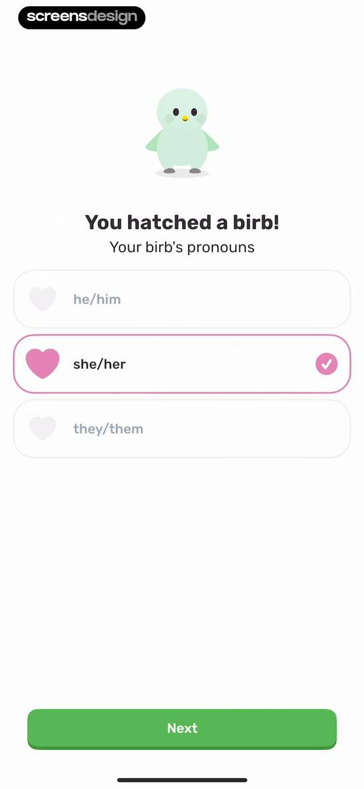
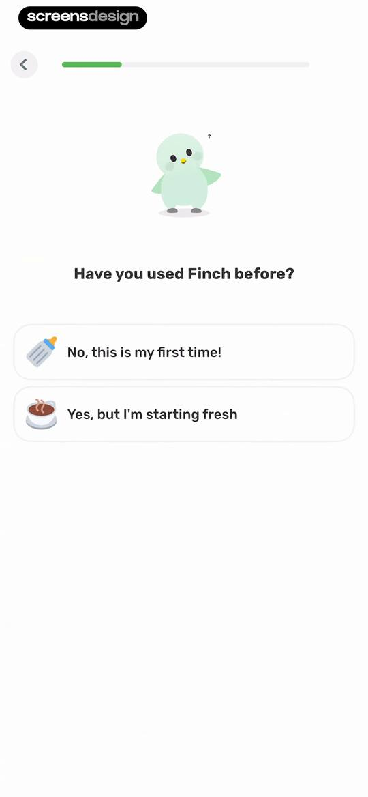
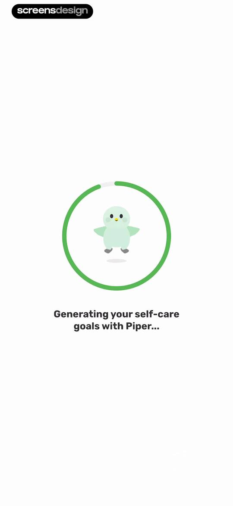

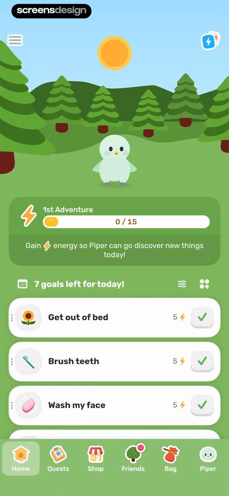
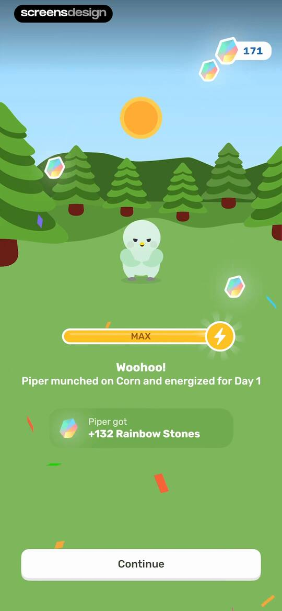
