# Focus Friend, by Hank Green Onboarding, Paywall & UX Flow — 46 Screens, $150k/mo

Source: https://screensdesign.com/apps/focus-friend-by-hank-green/ (fetched 2026-10-05)

Stats: 

| # | Time | Image | What the screen shows |
|---|---|---|---|
| 1 | 00:02 | 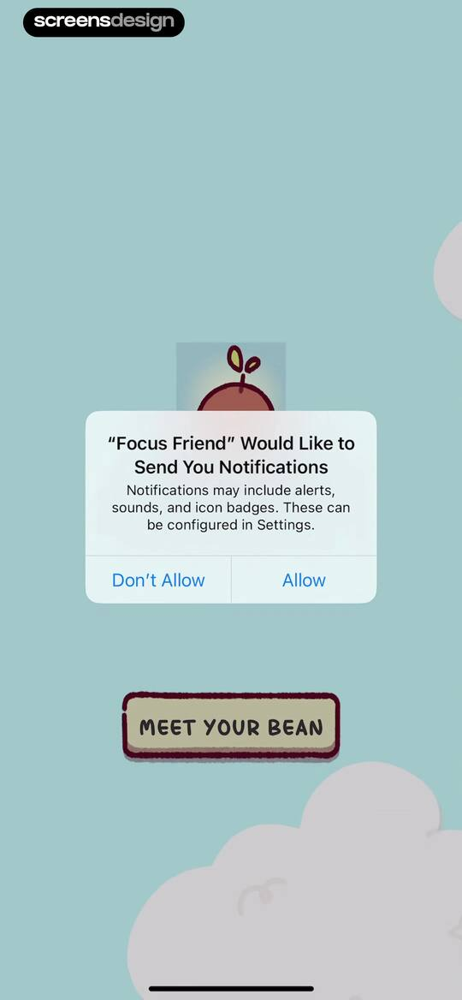 | Permissions onboarding screen with a system notification prompt for Focus Friend and a MEET YOUR BEAN button below. |
| 2 | 00:05 | 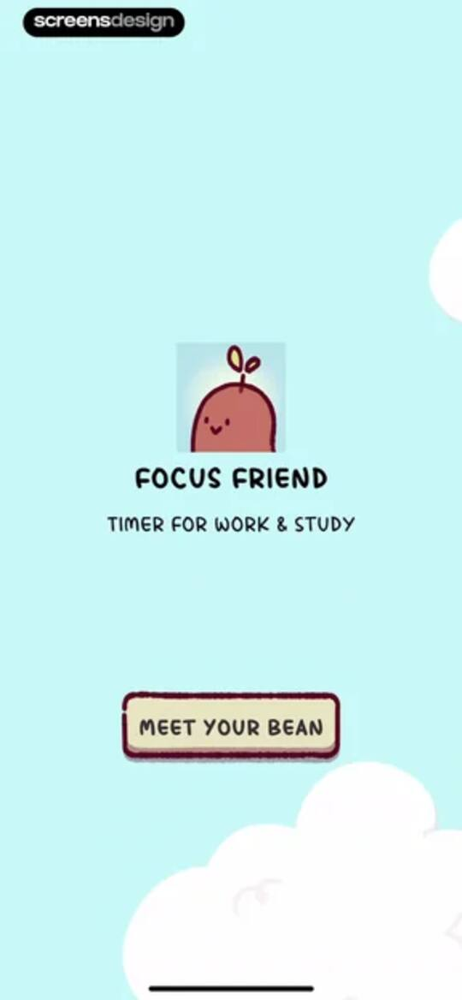 | Focus Friend onboarding welcome screen featuring a bean character illustration, app title, and a Meet Your Bean button. |
| 3 | 00:09 | 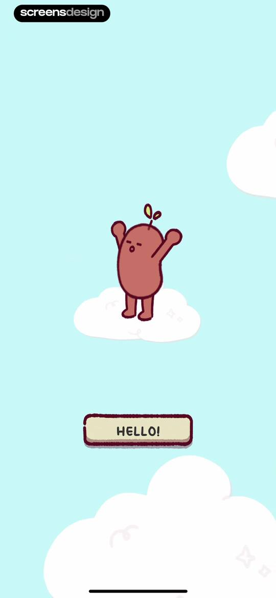 | Onboarding welcome screen featuring a cute bean mascot illustration on a light blue background with a HELLO! button. |
| 4 | 00:17 | 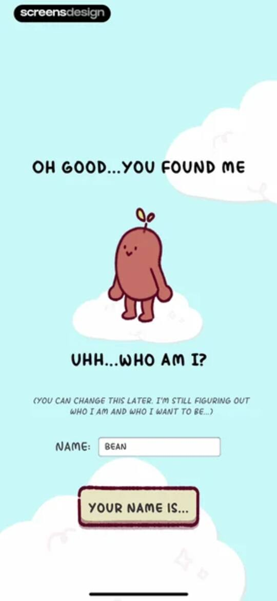 | Focus Friend onboarding screen with a character illustration, a text input field populated with Bean, and a Your Name Is button. |
| 5 | 00:21 | 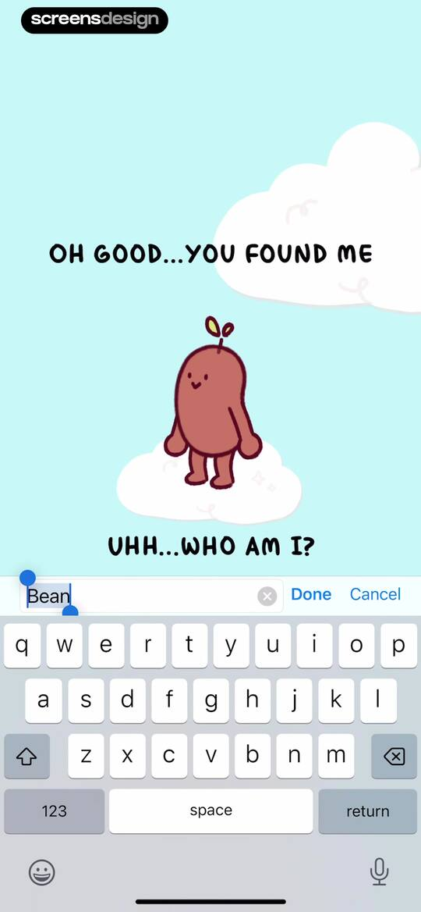 | Character naming onboarding screen featuring a central mascot illustration, a pre-filled text input field with the name Bean, and a Done button. |
| 6 | 00:28 | 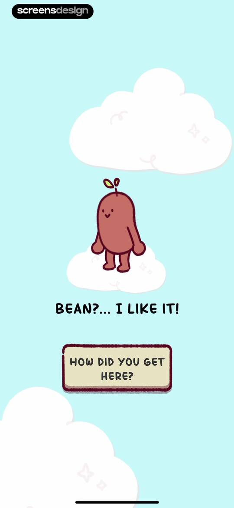 | Onboarding screen featuring a cute character mascot named Bean and a button to advance with the text HOW DID YOU GET HERE. |
| 7 | 00:32 | 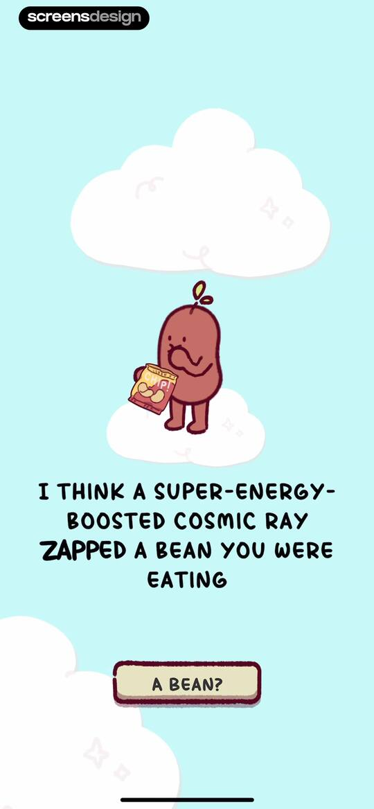 | Onboarding narrative screen featuring a bean character illustration, dialogue about a cosmic ray, and a bottom action button reading A BEAN? |
| 8 | 00:41 | 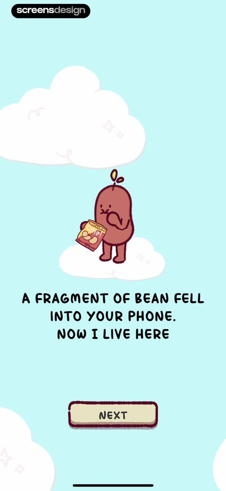 | Focus Friend onboarding screen introducing the mascot character with a playful message and a Next button. |
| 9 | 00:46 | locked | Character onboarding screen featuring a bean mascot on a cloud with dialogue text and an active button to advance the conversation. |
| 10 | 00:52 | locked | Focus Friend onboarding screen featuring a character knitting, text about making things, and a Next button at the bottom. |
| 11 | 00:58 | locked | Focus Friend onboarding screen featuring a sad bean mascot holding knitting needles, centered text about phone distractions, and a Next button. |
| 12 | 01:04 | locked | Narrative onboarding screen featuring a sad bean character and an I Want To Help button. |
| 13 | 01:12 | locked | Focus Friend onboarding screen featuring a knitting bean character illustration, explanatory text about the focus timer, and a Next button. |
| 14 | 01:16 | locked | Onboarding screen featuring a bean character knitting and a Next button to proceed through the tutorial. |
| 15 | 01:21 | locked | Focus Friend onboarding screen explaining room decoration trades with an isometric character illustration and a Next button. |
| 16 | 01:28 | locked | Focus Friend Pro paywall screen with an illustration of a bean character knitting and a Next button. |
| 17 | 01:32 | locked | Onboarding screen featuring an isometric illustration of a bean character in a room, with the prompt are you ready to do this with me and a lets focus together button. |
| 18 | 01:38 | locked | Home screen showing a virtual room with a bean character and a prominent Focus! button. |
| 19 | 01:45 | locked | Home screen featuring a central isometric room with a bean character, currency counters, and a prominent Focus! button. |
| 20 | 01:55 | locked | Home screen showing a virtual room with a bean character and a prominent FOCUS button. |
| 21 | 01:58 | locked | Focus timer home screen displaying a 15-minute timer, a bean character mascot, a deep focus mode toggle set to off, and a start button. |
| 22 | 02:10 | locked | System permission request modal asking to access Screen Time, with Continue and Don't Allow buttons over a timer and character illustration. |
| 23 | 02:13 | locked | Focus Friend app permissions screen requesting Screen Time access, with an illustration and Allow with Face ID and Don't Allow buttons. |
| 24 | 02:18 | locked | Focus Friend permission confirmation screen stating the app has been approved to access Screen Time, with a Done button. |
| 25 | 02:21 | locked | Focus session screen displaying a character, a countdown timer at 04:49, and a Stop Focusing button. |
| 26 | 02:35 | locked | Confirmation modal asking if you are sure you want to stop focusing, with options to keep focusing or stop focusing and a countdown timer. |
| 27 | 02:42 | locked | Focus Friend feedback screen displaying a centered bean character with a speech bubble reading IT'S OK! WE TRIED! |
| 28 | 02:44 | locked | Gamified productivity app screen prompting whether to start a break timer, featuring a bean character in a virtual room and Yes and No buttons. |
| 29 | 02:49 | locked | Gamified focus timer screen featuring a central timer device with a character behind it, a start button, and a sound icon. |
| 30 | 02:56 | locked | Break timer dashboard showing an active countdown, a character in a room, and an End Break button. |
| 31 | 03:01 | locked | Room decoration editor featuring an isometric room view, a digital timer showing 19:53, and a Done Decorating button. |
| 32 | 03:05 | locked | Decorating modal overlay showing a clipboard with item selection cards and Confirm and Cancel buttons over a virtual room view. |
| 33 | 03:11 | locked | Item purchase modal displaying a greenhouse decoration costing 150 socks, with purchase and cancel buttons. |
| 34 | 03:30 | locked | Character editor modal titled edit bean with a name text input field and cancel and save buttons. |
| 35 | 03:32 | locked | Character editor modal titled Edit Bean featuring a locked calico cat character, a name input field, and a Buy in Shop button. |
| 36 | 03:37 | locked | Shop screen featuring a premium upgrade banner and a grid of character skin cards with price tags. |
| 37 | 03:40 | locked | Focus Friend Pro paywall comparing monthly, yearly, and lifetime plans with a list of features and a continue button. |
| 38 | 03:51 | locked | Shop screen featuring currency counters, a promotional card to unlock Pro, and a grid of character skin cards with prices. |
| 39 | 03:59 | locked | Focus Friend paywall modal detailing Pro subscription benefits with a central feature list and a Get Focus Friend Pro button. |
| 40 | 04:07 | locked | Shop screen displaying a promo banner for Focus Friend Pro and a grid of character skin cards with prices. |
| 41 | 04:18 | locked | Home screen featuring an isometric room with a character needing focus, currency counters, and a prominent focus button at the bottom. |
| 42 | 04:22 | locked | Settings modal displaying sound, deep focus, and other configuration options with toggle switches and a close button. |
| 43 | 04:28 | locked | Settings modal featuring sound, deep focus, and other preference sections with a close button at the bottom. |
| 44 | 04:31 | locked | Paywall modal requiring Focus Friend Pro to unlock deep focus app whitelisting, featuring a Get Focus Friend Pro button and close option. |
| 45 | 04:37 | locked | Focus Friend app settings menu featuring sound and display toggles with a centered modal confirming cloud data backup. |
| 46 | 04:44 | locked | Credits modal listing app creators, artists, animators, and music composers, with a close button at the bottom. |

## Free showcase screenshots (unordered)

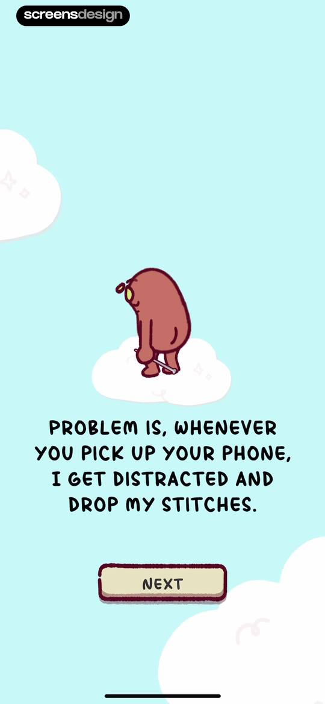
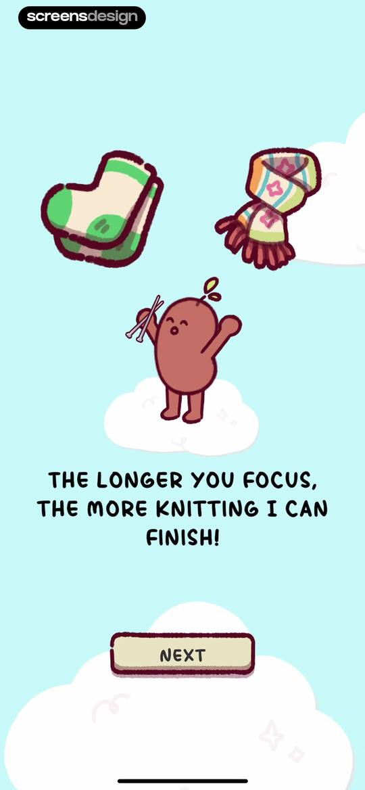
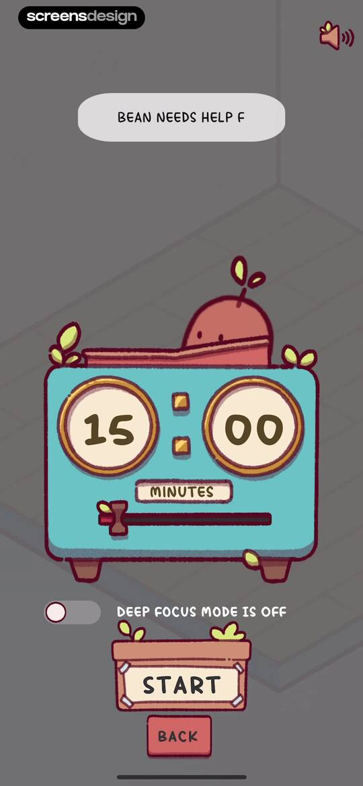
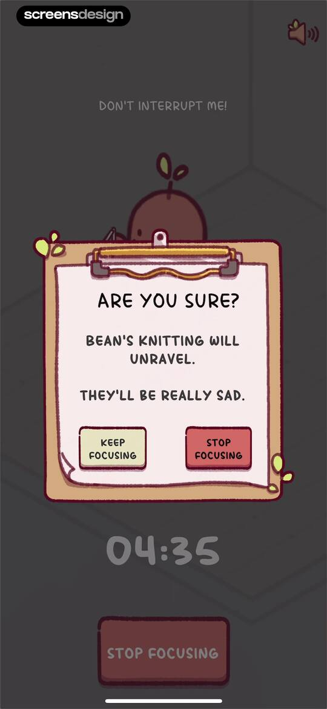
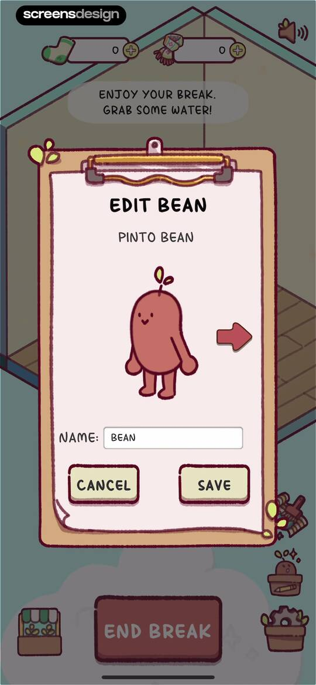
