# Headspace: Sleep & Meditation Onboarding, Paywall & UX Flow — 131 Screens, $2M/mo

Source: https://screensdesign.com/apps/headspace-meditation-sleep/ (fetched 2026-10-05)

Stats: 

| # | Time | Image | What the screen shows |
|---|---|---|---|
| 1 | 00:00 | 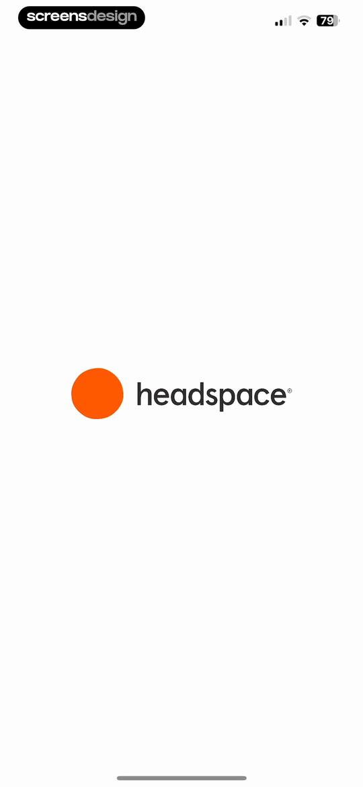 | Splash screen for the Headspace app with the brand logo centered on a light background. |
| 2 | 00:04 | 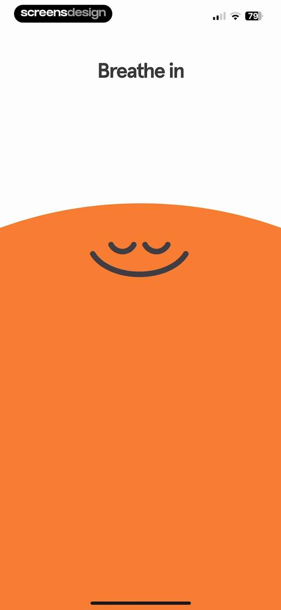 | Headspace breathing exercise screen with the text Breathe in against a white background above a large orange area featuring a calm face icon. |
| 3 | 00:09 | 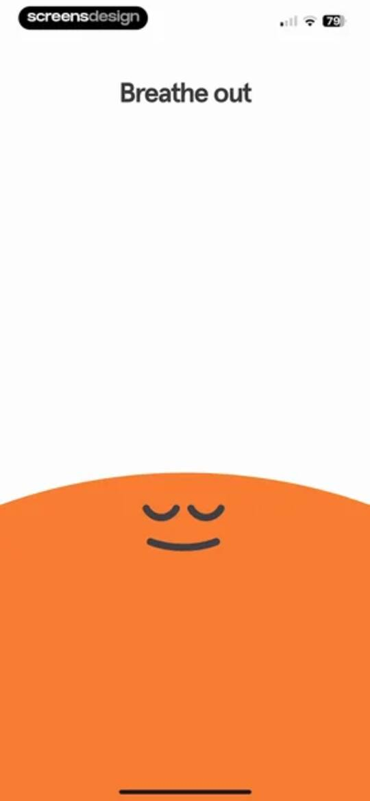 | Headspace guided breathing exercise screen with the text Breathe out at the top and a large orange breathing graphic at the bottom. |
| 4 | 00:13 | 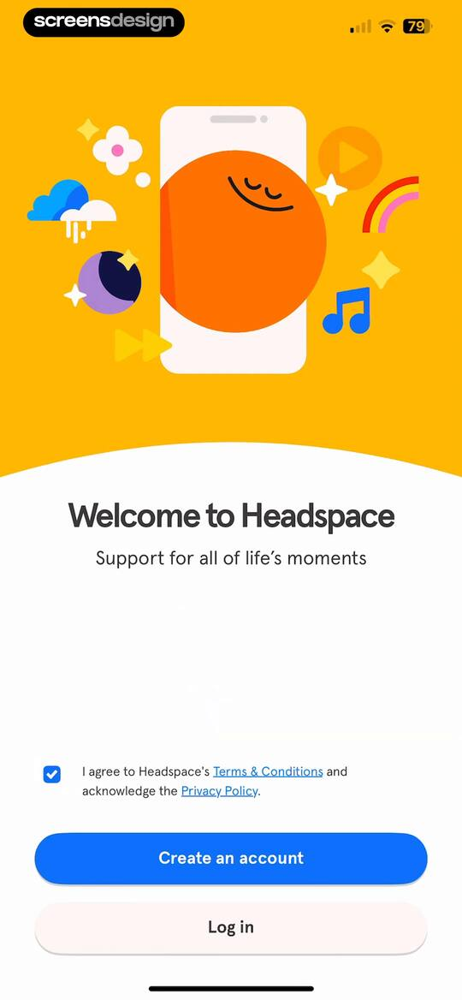 | Headspace onboarding welcome screen featuring a yellow illustration, a terms agreement checkbox, and buttons to create an account or log in. |
| 5 | 00:16 |  | Account creation screen featuring a top illustration, a vertical stack of authentication buttons, and a bottom login link. |
| 6 | 00:42 | 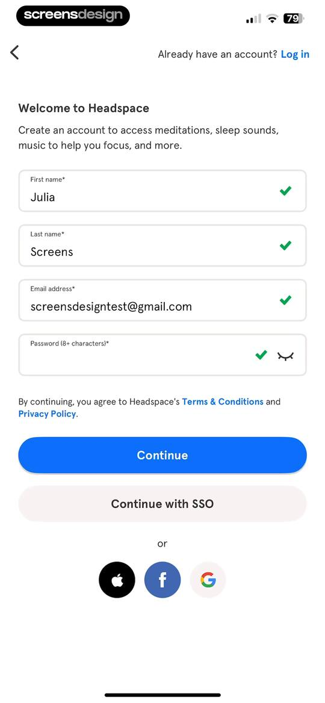 | Headspace account registration form filled with sample user details, validation checkmarks, and a Continue button. |
| 7 | 00:49 | 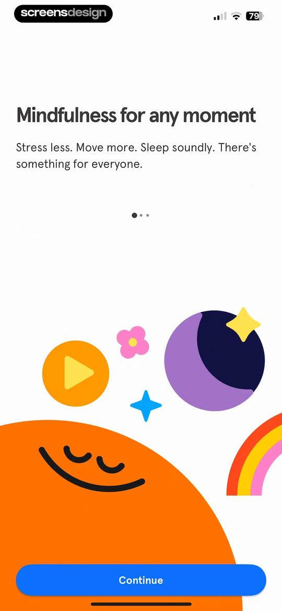 | Onboarding screen featuring the text Mindfulness for any moment, colorful playful illustrations, and a bottom Continue button. |
| 8 | 00:52 | 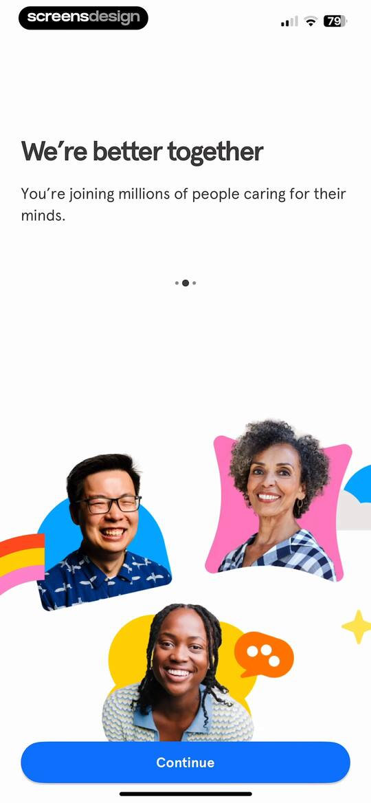 | Headspace onboarding screen featuring a smiling people collage, welcome text about community, and a blue Continue button. |
| 9 | 00:54 | locked | Headspace onboarding screen featuring science-backed meditation benefits, a playful character illustration, pagination dots, and a Continue button. |
| 10 | 01:00 | locked | Onboarding goal selection screen with Manage anxiety and Be present and mindful selected, and a Continue button. |
| 11 | 01:03 | locked | Onboarding screen featuring a character illustration, feature list for meditations and skills, and a Continue button. |
| 12 | 01:06 | locked | Paywall screen detailing a 14-day free trial with an annual and monthly billing toggle, a three-step timeline, and a Try for $0.00 button. |
| 13 | 01:09 | locked | Paywall screen with a trial explanation timeline, a monthly billing option selected, and a Try for $0.00 button. |
| 14 | 01:17 | locked | iOS system subscription confirmation modal for Headspace showing an annual plan with a two-week free trial and side button confirmation. |
| 15 | 01:23 | locked | Subscription success modal overlaying a paywall with a trial timeline and annual billing selected, displaying a success message and an OK button. |
| 16 | 01:29 | locked | Permission request screen for trial notifications featuring a smiling bell illustration, Remind me button, and Maybe later option. |
| 17 | 01:37 | locked | Notification permission request screen overlaying a trial start message, with allow and don't allow options. |
| 18 | 01:41 | locked | Headspace onboarding screen welcoming the user with a short exercise prompt, a Begin button, and a yellow sun illustration at the bottom. |
| 19 | 01:48 | locked | Onboarding screen featuring a blue sky background with clouds, centered mindfulness text, and a close button in the top right corner. |
| 20 | 01:51 | locked | Onboarding screen with an inspirational quote about clouds on a blue background and a close button in the top right corner. |
| 21 | 01:56 | locked | Mindfulness breathing exercise screen with a cloud background, centered text prompting three breaths, and a close button in the top right corner. |
| 22 | 02:03 | locked | Guided breathing exercise screen showing the instruction Breathe in, a progress indicator, and two breaths left on a sky background. |
| 23 | 02:05 | locked | Breathing exercise screen from Headspace with a Hold instruction, a progress bar, and two breaths left. |
| 24 | 02:09 | locked | Guided breathing exercise screen displaying 'Breathe out' and '2 breaths left' against a sky-themed background with a close button in the top right. |
| 25 | 02:12 | locked | Guided breathing exercise screen showing the instruction Hold, a progress bar, and two breaths left over a sky-themed background. |
| 26 | 02:16 | locked | Guided breathing exercise screen showing 'Breathe in' instructions, a progress bar, and '1 breath left' on a blue background with clouds. |
| 27 | 02:17 | locked | Guided breathing exercise screen showing a progress bar with the text Hold and 1 breath left against a blue sky background. |
| 28 | 02:22 | locked | Guided breathing exercise screen showing 'Breathe out' instructions, a progress bar, and one breath left against a sky background. |
| 29 | 02:24 | locked | Guided breathing exercise screen displaying the instruction Hold, a progress bar, and the text 1 breath left. |
| 30 | 02:27 | locked | Guided breathing exercise screen displaying a progress bar, the text Breathe in, and a close button in the top right corner. |
| 31 | 02:30 | locked | Headspace breathing exercise screen displaying a progress bar, instructions to hold, and a close button in the top right corner. |
| 32 | 02:34 | locked | Headspace breathing exercise screen with the text Breathe out and Last breath, a progress bar, and a close button. |
| 33 | 02:36 | locked | Headspace breathing exercise screen with a progress bar, the text Hold and Last breath, and a close button. |
| 34 | 02:40 | locked | Mindfulness transition screen with a bright blue sky illustration, centered text stating Remember the blue sky, and a top-right close button. |
| 35 | 02:48 | locked | Check-in form asking how a breathing exercise made you feel, with the Very relaxed option selected and a Continue button. |
| 36 | 02:50 | locked | Onboarding screen suggesting the Basic meditation course, featuring an orange course card and a Maybe later button. |
| 37 | 02:56 | locked | Meditation player screen for Learn the Basics of Meditation, featuring playback controls, session details, and helpful tooltips on a yellow and orange background. |
| 38 | 03:05 | locked | Audio player screen for a meditation session with playback controls, a progress bar, and a large pause button. |
| 39 | 03:16 | locked | Home feed with a personalized greeting, a tooltip overlay about sharing sessions, and vertical meditation content cards. |
| 40 | 03:20 | locked | Home screen of the Headspace app greeting user Julia with a vertical timeline of daily meditation and mindfulness content cards. |
| 41 | 03:22 | locked | Home feed for Headspace with a personalized daily timeline of mindfulness content and an open bottom sheet modal. |
| 42 | 03:32 | locked | Share sheet modal overlaying a health app dashboard with options for AirDrop, Messages, and system actions. |
| 43 | 03:35 | locked | Home screen featuring a personalized daily feed of mindfulness content cards, a greeting for Julia, and a bottom navigation bar. |
| 44 | 03:43 | locked | Video detail screen for Getting Started with Headspace, featuring a top yellow header, sharing tooltip, and bottom Play button. |
| 45 | 03:55 | locked | Headspace splash screen featuring a centered illustration of a hand holding a phone against a solid yellow background. |
| 46 | 03:59 | locked | Minimalist audio playback screen featuring central pause and skip controls, a progress bar with timestamps, and a dark grey theme. |
| 47 | 04:03 | locked | AirPlay device selection modal overlaying a media player, with iPhone selected and a checkmark. |
| 48 | 04:12 | locked | Media player screen displaying central playback controls over a background content list, featuring a bottom progress bar and a floating settings menu. |
| 49 | 04:14 | locked | Media playback interface with an open playback speed modal overlay showing options from 0.5x to 2.0x and 1.0x selected. |
| 50 | 04:17 | locked | Audio player interface for Rainday Antiques with playback controls and an open audio settings modal at the bottom. |
| 51 | 04:19 | locked | Audio playback screen for Rainday Antiques with centered controls, a progress bar, and an open Enhance Dialogue modal menu. |
| 52 | 04:22 | locked | Audio meditation player showing playback controls, progress bar, and an open subtitle selection modal with English selected. |
| 53 | 04:36 | locked | Home screen of the Headspace app greeting Julia with a vertical timeline of daily meditation and mindfulness content cards. |
| 54 | 04:45 | locked | Audio player screen for Brown Noise with a 60 min duration selector, central play button, and a referral tooltip. |
| 55 | 04:57 | locked | Duration selection modal overlay on a dark media player screen, with the 60 min option selected. |
| 56 | 05:09 | locked | Content detail screen for Brown Noise sleep music featuring a hero image, description, download toggle, and related content cards. |
| 57 | 05:15 | locked | Share sheet overlay displaying system sharing options and actions over a Brown Noise media player background. |
| 58 | 05:19 | locked | Audio detail page for Brown Noise featuring a hero image, description, download toggle, related content cards, and a sharing confirmation snackbar. |
| 59 | 05:22 | locked | Content detail screen for Brown Noise sleep music, featuring a header illustration, track description, download option, and related sound cards. |
| 60 | 05:29 | locked | Audio playback interface for Brown Noise sleep music with an active AirPlay modal showing iPhone selected as the output device. |
| 61 | 05:32 | locked | Duration selection modal overlay on a sleep music player, showing the 480 min length selected alongside a 60 min option. |
| 62 | 05:40 | locked | Share sheet modal titled Share some Headspace displaying options like AirDrop, Messages, and Copy over a media player background. |
| 63 | 05:44 | locked | Media player displaying the Brown Noise sleep music track with a 480 minute duration button and a share confirmation toast. |
| 64 | 05:51 | locked | Favorites list in Headspace displaying saved meditation and sleep content cards such as Brown Noise and Getting Started. |
| 65 | 05:54 | locked | Media player screen for brown noise sleep audio featuring a central play button, duration set to 480 minutes, and bottom playback controls. |
| 66 | 06:02 | locked | Recent content feed in the Headspace app listing played meditations like Brown Noise with a back button and content cards. |
| 67 | 06:06 | locked | Headspace explore screen with a search bar, category buttons, guided programs like Finding Your Best Sleep, and a bottom navigation bar. |
| 68 | 06:10 | locked | Meditation app home screen featuring a featured Breathe meditation card with a Play button, content tabs, and Today's Meditation section. |
| 69 | 06:18 | locked | Meditation player screen titled Breathe, with duration and instructor options, a central play button, and bottom playback controls. |
| 70 | 06:21 | locked | Meditation player interface on a mustard yellow background with a bottom sheet modal displaying teacher information for Andy Puddicombe and a central play button. |
| 71 | 06:23 | locked | Meditation session preview with a teacher selection modal displaying a profile card for Eve Lewis Prieto and a central play button. |
| 72 | 06:40 | locked | Meditation playback screen titled Breathe with a three-minute duration, pause button, and guided instruction text. |
| 73 | 06:54 | locked | Meditation content feed displaying a hero illustration, a featured Breathe card with a play button, and a recommended course list. |
| 74 | 07:02 | locked | Program overview for Finding Your Best Sleep with metadata, a three-part curriculum list, and a Begin program button. |
| 75 | 07:04 | locked | Program overview for Finding Your Best Sleep with an 18-session list, instructor video, and a Begin program button. |
| 76 | 07:15 | locked | Guided program screen titled Finding Your Best Sleep, featuring a featured video session card and a vertical list of upcoming sessions. |
| 77 | 07:21 | locked | Video player screen in the Headspace app showing a meditation teacher with a caption introducing the first part of a sleep journey. |
| 78 | 07:24 | locked | Video player for a guided meditation session featuring a teacher, playback controls, and a caption. |
| 79 | 07:31 | locked | Guided program session screen with a bottom modal overlay offering options to view the program overview or leave the program. |
| 80 | 07:34 | locked | Program overview screen for Finding Your Best Sleep with session details, a summary paragraph, and three expandable curriculum cards. |
| 81 | 07:42 | locked | Program confirmation modal asking to leave the guided meditation program, with Yes, I'm sure and Stay buttons over a session list. |
| 82 | 07:47 | locked | Explore screen with a search bar and a vertical list of colorful thematic content cards including Podcasts and Mindfulness at Work. |
| 83 | 07:51 | locked | Podcast feed displaying a two-column grid of illustrated cards for series like Radio Headspace and Sunday Scaries. |
| 84 | 07:57 | locked | Podcast detail screen for The Yes Theory Podcast featuring a hero illustration, series description, and a list of episodes with durations and play buttons. |
| 85 | 08:03 | locked | Podcast episode detail screen for American Dreams, featuring descriptive text, a download toggle, and a fixed bottom play button. |
| 86 | 08:09 | locked | Podcast player screen for American Dreams with central playback controls, skip buttons, and a progress bar at the start. |
| 87 | 08:27 | locked | Search results screen displaying content cards for the query Anxiety with a medical disclaimer and a vertical list of meditation topics. |
| 88 | 08:32 | locked | Onboarding questionnaire screen with step one of ten, the Fairly often option selected, and a Next button. |
| 89 | 08:34 | locked | Health assessment question screen with the option Sometimes selected and a Next button. |
| 90 | 09:00 | locked | Health assessment questionnaire onboarding screen with a mental health question, the Almost never option selected, and a Next button. |
| 91 | 09:05 | locked | Headspace dashboard displaying a guest pass card, a stress and anxiety progress tracking chart, and a Check in button. |
| 92 | 09:13 | locked | Explore screen with a search bar, category buttons, guided programs list, and collection cards for meditation and wellness content. |
| 93 | 09:19 | locked | Profile screen for the Headspace app displaying a user welcome card, a 30-day guest pass promotional card, and progress tracking sections. |
| 94 | 09:23 | locked | Meditation content feed featuring a featured course card and two getting started video cards with a bottom navigation bar. |
| 95 | 09:26 | locked | Content feed for beginning meditation in the Headspace app, featuring a guided meditation carousel and getting started videos with the Explore tab selected. |
| 96 | 09:27 | locked | Headspace beginning meditation content feed featuring Breathwork Basics and Getting Started videos with bottom navigation tabs. |
| 97 | 09:29 | locked | Headspace meditation content feed featuring a Beginning Meditation course, a featured Breathe card, and Getting Started videos. |
| 98 | 09:40 | locked | Headspace referral screen promoting a 30-day guest pass with a central illustration and a Refer a friend now button. |
| 99 | 09:43 | locked | Share sheet for a Headspace 30-Day Guest Pass featuring system sharing options and app shortcuts over a yellow background. |
| 100 | 09:45 | locked | User profile screen displaying a welcome modal overlay with a kindness acknowledgement message, progress section, and a bottom navigation bar. |
| 101 | 09:51 | locked | Health dashboard featuring a progress chart, a check-in button, an activity history list, and a bottom navigation bar. |
| 102 | 09:55 | locked | Stress assessment results dashboard displaying a moderate stress score of 24, a progress bar, and suggested meditation content cards. |
| 103 | 10:04 | locked | Mental health dashboard showing an anxiety progress chart with a Check in button and a list of recent activity history items. |
| 104 | 10:09 | locked | Mental health assessment questionnaire screen asking about anxiety frequency, with Several days selected and a Next button. |
| 105 | 10:27 | locked | Health assessment questionnaire screen asking about symptom frequency, with Several days selected and a Next button. |
| 106 | 10:30 | locked | Dashboard with a progress chart, a check-in button, an activity history list, and bottom navigation. |
| 107 | 10:35 | locked | Wellness dashboard showing a Check in button, activity history list with podcast and meditation items, and a bottom navigation bar. |
| 108 | 10:39 | locked | Dashboard with a monthly progress timeline, a Check in button, and an activity history list showing recent podcasts and meditations. |
| 109 | 10:42 | locked | Activity history dashboard displaying a chronological list of past meditation and wellness sessions with durations and content categories. |
| 110 | 10:48 | locked | Headspace settings menu with a vertical list of configuration options including account, notifications, downloads, and support. |
| 111 | 10:50 | locked | Account and subscription settings list displaying user profile details and management options with a delete account button at the bottom. |
| 112 | 10:54 | locked | Headspace referral screen promoting a 30-day guest pass with an illustration of smiling faces and a Refer a friend now button. |
| 113 | 10:57 | locked | Headspace community settings screen featuring an informational banner and a toggle for Community Thoughts set to the on position. |
| 114 | 11:01 | locked | Notifications settings screen listing categories like Mindful Moments and Meditation Reminders with drill-down options. |
| 115 | 11:04 | locked | Notification settings screen with an informational text block and a green toggle switch labeled Notifications. |
| 116 | 11:06 | locked | Headspace recommendations settings screen with a descriptive text block and an active notification toggle switch. |
| 117 | 11:09 | locked | Headspace notification settings screen with an informational banner and an active toggle for Community Thoughts push notifications. |
| 118 | 11:18 | locked | Confirmation modal showing a successfully added Siri shortcut for the Headspace app, with a Done button and options to edit or remove the shortcut. |
| 119 | 11:21 | locked | Headspace Siri Shortcuts settings screen listing meditation activities with an Added status on the first item and Add to Siri buttons on the rest. |
| 120 | 11:24 | locked | Language selection screen with a vertical list of language options, with English currently selected by a green checkmark. |
| 121 | 11:26 | locked | Empty state screen titled Available offline, featuring a character illustration and instructions to download favorite sessions. |
| 122 | 11:33 | locked | Permissions modal for Headspace requesting Apple Health access, featuring a Mindful Minutes toggle and Allow and Don't Allow buttons. |
| 123 | 11:36 | locked | Headspace settings screen for Apple Health integration, featuring the Mindful Minutes list item with an active toggle switch. |
| 124 | 11:41 | locked | Settings screen for Audio Description featuring a descriptive explanation and an active green toggle switch. |
| 125 | 11:46 | locked | Support center screen featuring a search bar and a vertical list of category cards including Top FAQ and Troubleshooting. |
| 126 | 11:49 | locked | Help Center support screen with a search bar, categorized FAQ links, and a floating chat button. |
| 127 | 11:56 | locked | Terms and conditions screen displaying the Headspace legal agreement text, effective date, and accessibility support details. |
| 128 | 12:04 | locked | Settings screen featuring a vertical list of configuration options, account details, and a log out button at the bottom. |
| 129 | 12:06 | locked | Headspace privacy policy settings screen listing legal document links and a support email address. |
| 130 | 12:15 | locked | Headspace account settings screen displaying personal user data fields, the selected info tab, and an email support button. |
| 131 | 12:20 | locked | Settings screen with a logout confirmation modal displaying a warning about clearing progress and downloaded sessions, alongside Yes and No buttons. |

## Free showcase screenshots (unordered)

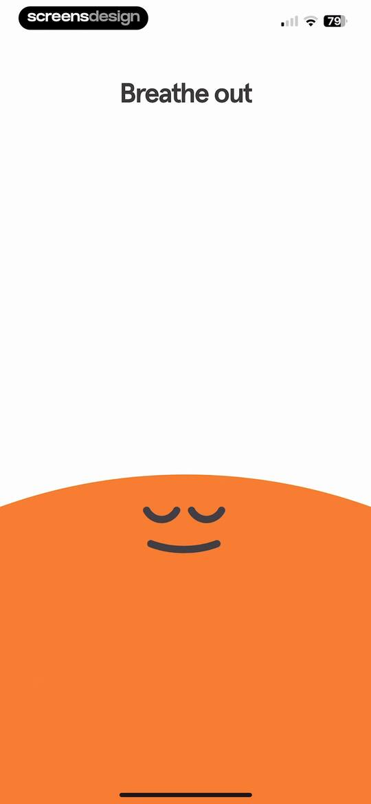
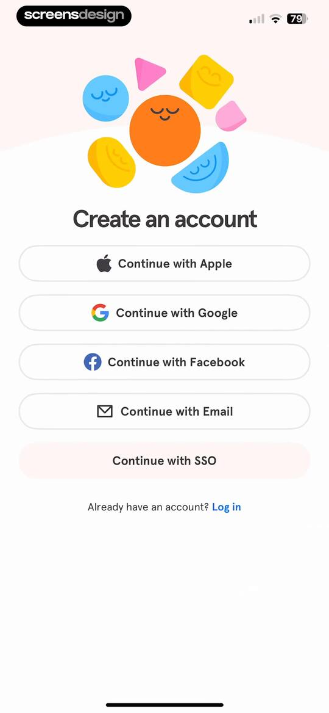
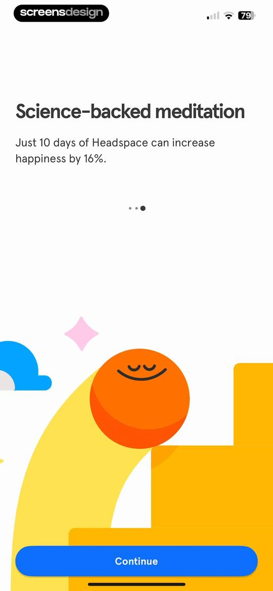
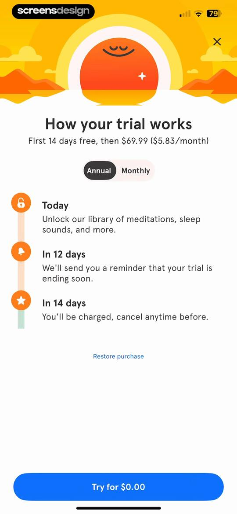
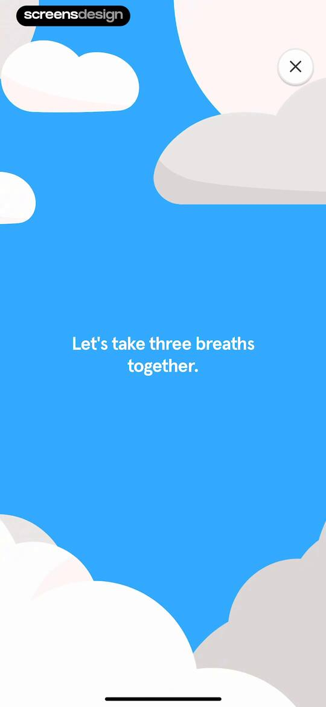
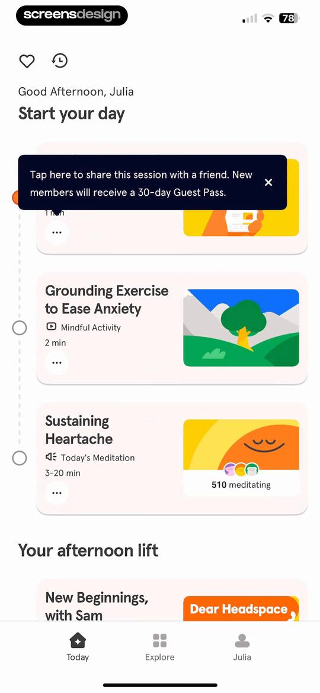
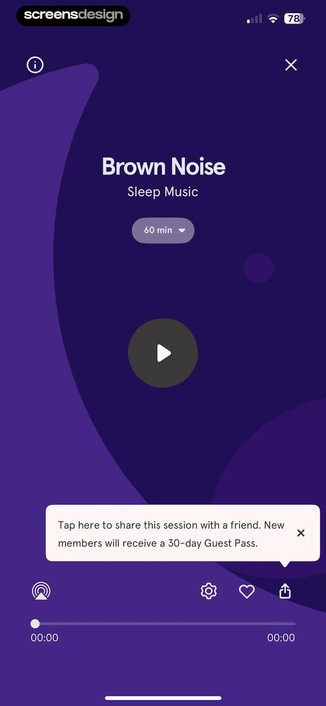
