# Headway - Daily Micro Learning Onboarding, Paywall & UX Flow — 161 Screens, $850k/mo

Source: https://screensdesign.com/apps/headway-daily-micro-learning/ (fetched 2026-10-05)

Stats: 

| # | Time | Image | What the screen shows |
|---|---|---|---|
| 1 | 00:00 | 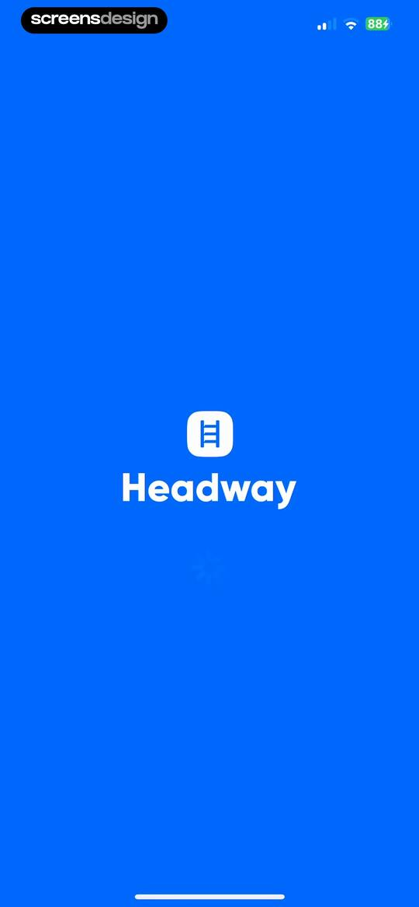 | Splash screen for the Headway app displaying the white ladder logo and brand name on a solid blue background. |
| 2 | 00:04 | 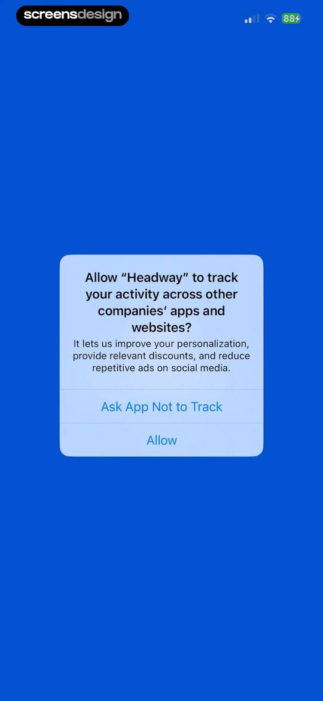 | App tracking transparency permission modal for the Headway app with options to ask the app not to track or allow. |
| 3 | 00:07 | 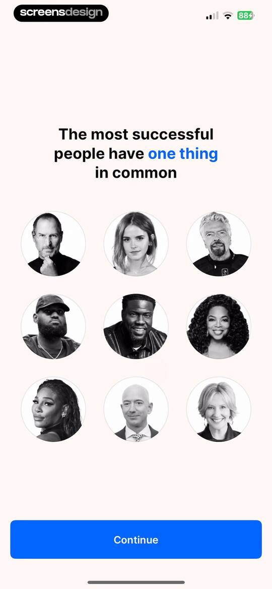 | Headway onboarding screen displaying a portrait grid of successful people, header text, and a blue Continue button. |
| 4 | 00:10 | 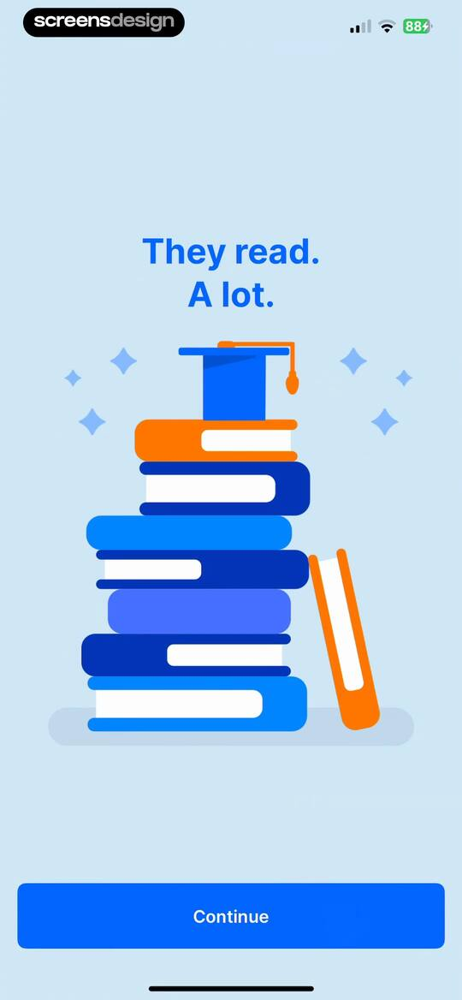 | Headway onboarding screen with a stack of books illustration, the text 'They read. A lot.', and a Continue button. |
| 5 | 00:13 | 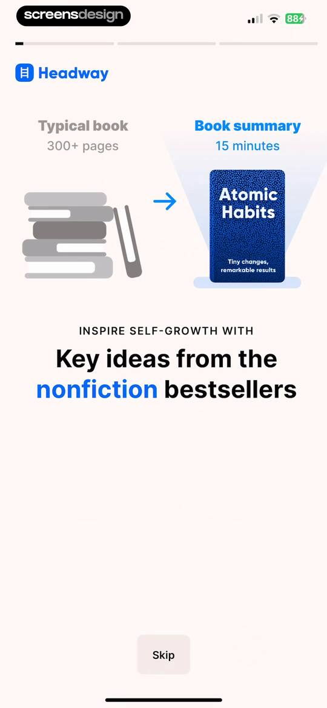 | Headway onboarding screen comparing a typical 300-page book to a 15-minute summary, with a progress bar and skip button. |
| 6 | 00:18 | 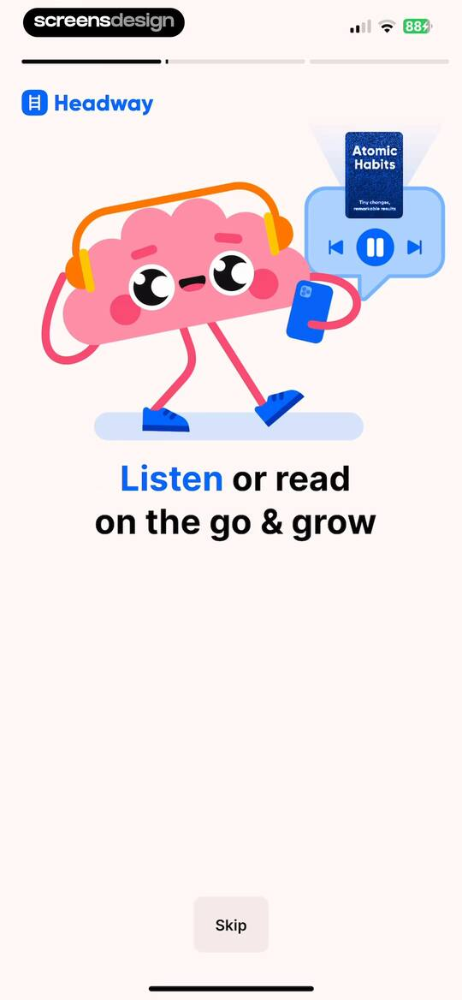 | Headway onboarding screen featuring a central brain illustration, media player controls for Atomic Habits, and a bottom skip button. |
| 7 | 00:29 | 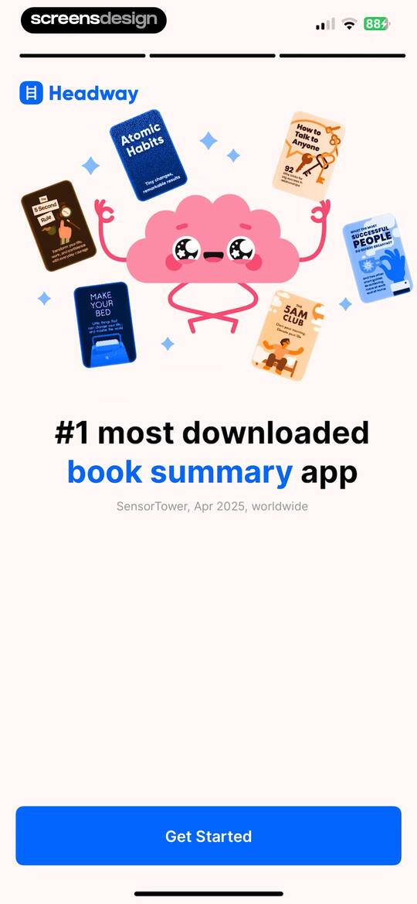 | Headway onboarding screen featuring a central cartoon brain illustration surrounded by floating popular book covers and a Get Started button. |
| 8 | 00:32 | 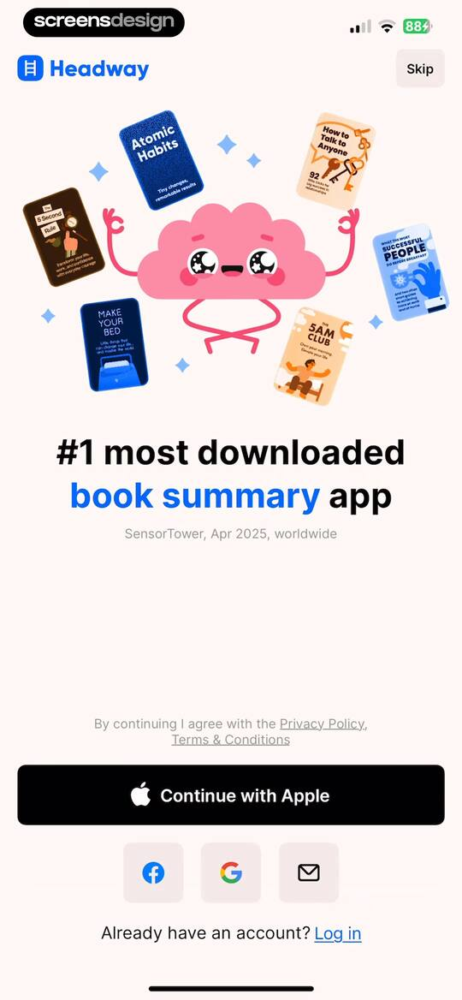 | Headway app sign-up screen with a central book illustration, social sign-up buttons, and a log-in link at the bottom. |
| 9 | 00:57 | locked | Account creation form for Headway with pre-filled name and email fields, a password field, and a Get Started button. |
| 10 | 01:06 | locked | Headway app onboarding welcome screen featuring a character illustration, social proof statistics, and a Continue button. |
| 11 | 01:10 | locked | Onboarding questionnaire screen asking what is key to realizing potential, with three stacked selection buttons for Consistency, Motivation, and Productivity. |
| 12 | 01:15 | locked | Headway onboarding screen introducing quiz personalization with an illustration of a brain climbing stairs and a Continue button. |
| 13 | 01:20 | locked | Onboarding screen prompting the user to select their gender, with options for male, female, non-binary, and a preference not to say. |
| 14 | 01:22 | locked | Onboarding screen asking What is your age? with a vertical stack of five age range buttons and a progress bar. |
| 15 | 01:29 | locked | Onboarding screen displaying a list of selectable goal cards with three options selected and a Continue button at the bottom. |
| 16 | 01:32 | locked | Onboarding screen asking What's your focus right now with a vertical list of selectable personal growth options and a top progress bar. |
| 17 | 01:35 | locked | Onboarding screen comparing a typical book to a book summary, with a value proposition headline and a Continue button. |
| 18 | 01:40 | locked | Onboarding goal setting screen for the Headway app with a vertical scroll picker set to 7 summaries and a Continue button. |
| 19 | 01:42 | locked | Onboarding screen explaining the time commitment and summary goal, with a playful brain illustration and a Continue button. |
| 20 | 01:45 | locked | Onboarding goal selection screen with four streak milestone cards, the 7-day streak selected, a motivational character illustration, and a Continue button. |
| 21 | 01:47 | locked | Onboarding screen featuring a habit-building statistic, a central illustration of a calendar, and a Continue button. |
| 22 | 01:49 | locked | Onboarding screen asking when you like to find out new ideas, with a list of selectable time options. |
| 23 | 01:54 | locked | Habit formation onboarding screen with a time picker set to 11:00 PM, a daily reminder message, and a Continue button. |
| 24 | 01:57 | locked | Notification permission request modal overlaying a habit building onboarding screen with a Day 21 flame illustration and an Allow button. |
| 25 | 01:59 | locked | Onboarding screen highlighting audio summary features with a central illustration and a Continue button. |
| 26 | 02:02 | locked | Headway onboarding questionnaire screen asking if the user relates to a reading difficulty statement, with No and Yes selection buttons. |
| 27 | 02:05 | locked | Headway onboarding screen asking whether the user relates to a personal growth statement, with No and Yes selection buttons at the bottom. |
| 28 | 02:07 | locked | Headway onboarding screen asking if the user relates to a personal growth statement, featuring Yes and No buttons at the bottom. |
| 29 | 02:09 | locked | Social proof onboarding screen with a user testimonial card, App Store rating badge, and a Continue button. |
| 30 | 02:14 | locked | Onboarding book selection screen with a grid of titles and a Continue button. |
| 31 | 02:22 | locked | Onboarding screen displaying a grid of book cards to select 3+ titles, with a progress bar and a continue button. |
| 32 | 02:26 | locked | Onboarding confirmation screen stating that selected book summaries were saved to the Library page, featuring a central illustration and a Continue button. |
| 33 | 02:30 | locked | Headway onboarding screen with a 49% progress bar, a personalization question card featuring Yes and No buttons, and a social proof footer. |
| 34 | 02:36 | locked | Onboarding question card asking whether you want to give up when things get hard, with No and Yes buttons and a 49% progress bar. |
| 35 | 02:42 | locked | Headway onboarding screen asking whether you like to learn by listening, with Yes and No buttons, progress tracking at 49%, and social proof at the bottom. |
| 36 | 02:45 | locked | Headway onboarding completion screen with three checked steps and a Continue button. |
| 37 | 02:47 | locked | Onboarding screen offering a free premium trial, featuring a pink brain character illustration and a Continue button. |
| 38 | 02:53 | locked | Headway onboarding commitment pact screen featuring a goal statement and a blue button with a fingerprint icon to confirm. |
| 39 | 03:00 | locked | Loading screen with the text Sealing your commitment on a vibrant blue background, featuring a fingerprint icon and a progress indicator at the bottom. |
| 40 | 03:03 | locked | Biometric confirmation screen displaying a success message with a checkmark and a large fingerprint button at the bottom. |
| 41 | 03:05 | locked | Quiz completion screen with a celebratory brain illustration, congratulatory message, and a Continue button. |
| 42 | 03:09 | locked | Paywall screen for Headway featuring a free trial guide timeline, trial terms, and a Start free trial button. |
| 43 | 03:12 | locked | Subscription trial screen featuring a cartoon brain illustration, a reminder notice for April 21, and a Start free trial button. |
| 44 | 03:15 | locked | Paywall offering a seven-day free trial followed by annual billing, with an App Store security badge and a Start free trial button. |
| 45 | 03:18 | locked | Subscription paywall comparing annual, three-month, and monthly plans with the annual plan selected as best value and a Continue button. |
| 46 | 03:24 | locked | Subscription checkout screen displaying the Headway premium annual plan for $59.99 per year with a system confirmation modal. |
| 47 | 03:34 | locked | App Store subscription confirmation modal for Headway Premium with annual pricing and a side button prompt. |
| 48 | 03:41 | locked | Purchase confirmation modal displaying a success message and an OK button over a blurred background. |
| 49 | 03:47 | locked | Headway subscription success screen with a confirmation message, star icon, and a Let's grow button. |
| 50 | 03:51 | locked | Splash screen for the Headway app with a stylized yellow shooting star on a blue background. |
| 51 | 03:55 | locked | Premium welcome screen listing six self-growth benefits with checkmarks against a blue background with star elements. |
| 52 | 04:01 | locked | Home screen featuring personalized book recommendations and a reward modal overlay with an Unlock reward button. |
| 53 | 04:05 | locked | Paywall screen offering a lifetime subscription discount of 44% with a reward illustration, pricing details, and a Continue button. |
| 54 | 04:09 | locked | Checkout subscription screen for Headway premium at forty-nine dollars and ninety-nine cents per year, displaying an Apple system confirmation modal with a side button instruction. |
| 55 | 04:14 | locked | Paywall screen offering lifetime access to 50 visualized book summaries and a special gift e-book for a discounted one-time price of $24.99 with a Get Now button. |
| 56 | 04:16 | locked | Paywall screen offering a discounted one-time subscription for $24.99 with a top carousel of book summaries, a special gift e-book, and a Get Now button. |
| 57 | 04:18 | locked | Paywall screen offering a one-time deal of $24.99 for lifetime access to book summaries, featuring a carousel of titles and a Get Now button. |
| 58 | 04:20 | locked | Paywall screen offering 50 visualized bestsellers and a bonus self-reflection e-book for $24.99, featuring a book carousel and a Get Now button. |
| 59 | 04:25 | locked | Headway home screen displaying personalized book summary recommendations, a random discovery card, and a bottom navigation bar with the For You tab selected. |
| 60 | 04:31 | locked | Book summary detail screen for AI Superpowers with metadata, a description, and Read and Listen action buttons at the bottom. |
| 61 | 04:37 | locked | Headway book summary modal displaying a numbered list of eight key points, an author section, and a bottom action bar with Read and Listen buttons. |
| 62 | 04:43 | locked | Narrator selection modal over a book summary reading view, with the Maya female narrator card selected and a Continue button. |
| 63 | 04:52 | locked | Reading interface for the AI Superpowers book summary with an active text selection and a bottom audio player bar. |
| 64 | 04:56 | locked | Reading interface showing an AI article with a highlighted key takeaway, Share and Remember buttons, and a bottom navigation bar. |
| 65 | 05:00 | locked | Article reading screen displaying an educational text about China and AI technology with a minimalist serif layout. |
| 66 | 05:05 | locked | Reading screen in the Headway app with a Jumpstart notification card at the top and an article about artificial intelligence below. |
| 67 | 05:20 | locked | Reading interface displaying AI Superpowers text with a floating highlight menu and a bottom audio player bar. |
| 68 | 05:23 | locked | Reading interface showing AI Superpowers text with a floating selection menu for highlight, look up, and share options, plus a bottom audio player. |
| 69 | 05:26 | locked | System-level Look Up modal overlaying a book summary with feature description, five service icons, and a Continue button. |
| 70 | 05:31 | locked | Book summary reader interface with a native iOS share sheet overlay displaying sharing options and actions. |
| 71 | 05:41 | locked | iOS share sheet overlaying the Headway app with options to share text content via various apps, copy, or save. |
| 72 | 05:47 | locked | Educational reading screen displaying an article about AI evolution with a page counter showing 3 of 8 and bottom navigation arrows. |
| 73 | 06:00 | locked | Article reading screen displaying a text summary about the societal implications of AI, featuring a highlighted insight block with Share and Remember buttons. |
| 74 | 06:08 | locked | Book summary conclusion screen in Headway displaying text about AI and a Finish summary button. |
| 75 | 06:20 | locked | Feedback form with weekly growth metrics, a star rating card, a grid of selectable qualitative tags, and a submit button. |
| 76 | 06:31 | locked | Streak progress modal highlighting a one-day streak with a weekly calendar, instructional card, and a Got it button. |
| 77 | 06:36 | locked | Headway onboarding screen explaining learning streaks with a flame graphic showing a 21-day counter and a Continue button. |
| 78 | 06:39 | locked | Mission progress screen showing a pink brain illustration, mission objectives with completion status, and a Got it button. |
| 79 | 06:42 | locked | Onboarding screen introducing progress tracking with an illustration of the Activity tab and a Continue learning button. |
| 80 | 06:44 | locked | Recommendation screen suggesting personalized book summaries with a horizontal carousel and a based on your ratings badge. |
| 81 | 06:53 | locked | Headway home screen featuring a daily goal card, a featured book recommendation for Atomic Habits with read and listen options, and a bottom navigation bar. |
| 82 | 06:58 | locked | Activity dashboard displaying a daily mission card with a progress bar, weekly growth stats, and an achievements carousel. |
| 83 | 07:08 | locked | Audio player screen for the Atomic Habits book summary showing playback controls, a progress bar, and key point text. |
| 84 | 07:17 | locked | Audiobook playback speed modal overlaying the Atomic Habits player with preset speeds, a speed slider, and a Continue button. |
| 85 | 07:41 | locked | Article content about habit formation with a James Clear quote and a floating audio control bar at the bottom. |
| 86 | 07:45 | locked | Narrator selection modal with Paul selected as the featured male voice, a toggle option, and a Continue button. |
| 87 | 07:52 | locked | Narrator selection modal with Paul selected as the featured male voice, listing options and a Continue button over an audio player background. |
| 88 | 07:58 | locked | Audio playback screen displaying Atomic Habits key point summary with progress bar, playback controls, speed setting, and bottom floating control bar. |
| 89 | 08:17 | locked | Audio player interface for an Atomic Habits summary displaying conclusion playback controls and a Finish summary button. |
| 90 | 08:27 | locked | Feedback form for the book summary Atomic Habits, featuring growth stats, a star rating, selectable tags, and a Submit button. |
| 91 | 08:33 | locked | App review prompt modal in the Headway app with a central brain illustration, rating stars, and a Help Headway button. |
| 92 | 08:43 | locked | Headway home screen featuring a book recommendation for Emotional Intelligence with read and listen options, a similar summaries carousel, and bottom navigation. |
| 93 | 08:51 | locked | Headway app home screen with a streak counter, category cards, daily microlearning session, featured Deep Work book card, and bottom navigation. |
| 94 | 08:53 | locked | Category feed for Business and Career displaying a grid of book summary cards and a floating Roll the dice action banner. |
| 95 | 09:05 | locked | Content feed insight screen displaying a text quote about cold stress with share and save buttons, and a bottom reference card for The Wim Hof Method. |
| 96 | 09:09 | locked | Book summary detail page for The Wim Hof Method with metadata, description, and bottom action buttons for reading and listening. |
| 97 | 09:12 | locked | Share sheet overlay displaying book sharing options and system actions over a book cover preview. |
| 98 | 09:17 | locked | Book summary details page for The Wim Hof Method with metadata, descriptive text, and Read and Listen action buttons. |
| 99 | 09:27 | locked | Article reading screen for The Wim Hof Method with a bulleted list of three core pillars, share and remember buttons, and a bottom audio player. |
| 100 | 09:33 | locked | Reading interface displaying a Wim Hof Method book summary with body text, a highlighted callout box, and a floating audio control bar at the bottom. |
| 101 | 09:36 | locked | Audio player screen for The Wim Hof Method book summary showing playback controls, a progress slider at 00:03, and the audio mode selected. |
| 102 | 09:43 | locked | Promotional modal for Headway for Business displayed over a book summary reading view, featuring feature highlights and a Discover Headway for Business button. |
| 103 | 09:48 | locked | Headway app contents screen with a numbered list of chapters and the first chapter highlighted. |
| 104 | 09:54 | locked | Article reading screen displaying a biographical text about Wim Hof under the bold heading A knack for the unusual. |
| 105 | 10:03 | locked | Content feed displaying book insight cards with share and remember buttons, with the Insights tab selected and bottom navigation visible. |
| 106 | 10:11 | locked | Book summary reading screen with a text customization modal at the bottom displaying background color and text size options. |
| 107 | 10:28 | locked | Daily mission completion modal featuring a pink brain character with a trophy, a task list card with green checkmarks, and a Got it button. |
| 108 | 10:39 | locked | Home screen showing personalized collections, a goal management card with a Manage button, a bottom audio player, and a four-tab navigation bar. |
| 109 | 10:41 | locked | Onboarding goal selection screen with a list of personal growth goals, three selected options, and a Continue button. |
| 110 | 10:48 | locked | Goal selection onboarding screen with a list of selectable goal cards and a bottom confirmation modal featuring an Update button. |
| 111 | 10:58 | locked | Book summary reading interface for The Wim Hof Method with text content about his childhood and a floating bottom control bar for audio and text modes. |
| 112 | 11:02 | locked | Paywall screen offering a lifetime annual subscription discount with a reward badge, strikethrough pricing, and a Continue button. |
| 113 | 11:05 | locked | Streak modal showing a 1-day streak with a large flame graphic, weekly progress tracker, and instructional card. |
| 114 | 11:10 | locked | Loading state screen in the Headway app with a centered spinner, persistent mini-player card for The Wim Hof Method, and bottom navigation. |
| 115 | 11:12 | locked | Headway explore screen with a search bar, category grid, latest summaries carousel, and a challenges section. |
| 116 | 11:18 | locked | Content feed displaying Business and Career book summary cards in a grid layout, with a persistent audio mini-player and bottom navigation bar. |
| 117 | 11:21 | locked | Book summary detail page for In Search of Excellence with metadata, a descriptive overview, and Read and Listen action buttons. |
| 118 | 11:31 | locked | Achievements dashboard displaying a 28-day challenge progress tracker, daily challenge cards, a trophy hall, and Read and Listen buttons at the bottom. |
| 119 | 11:34 | locked | Book summary details screen showing metadata, a description, and Read and Listen action buttons. |
| 120 | 11:40 | locked | Narrator selection modal with Mark selected, a toggle to not ask again, and a Continue button. |
| 121 | 11:52 | locked | Reading interface displaying a book summary for Make Your Bed, with a top navigation bar and a floating bottom audio control bar. |
| 122 | 11:56 | locked | Conclusion screen of a book summary in the Headway app displaying actionable tips and a Finish summary button. |
| 123 | 12:03 | locked | Book summary feedback form with growth stats, a star rating card, selectable feedback tags, and a Submit button. |
| 124 | 12:04 | locked | Book recommendation modal featuring a completed book summary indicator, main title, and a horizontal carousel of personalized reading suggestions. |
| 125 | 12:13 | locked | Trophy hall dashboard with a modal overlay celebrating a first achievement, featuring an acorn illustration and a Claim trophy button. |
| 126 | 12:26 | locked | Onboarding screen asking What is your intelligence type with a central brain illustration and a Continue button. |
| 127 | 12:36 | locked | Onboarding screen introducing an intelligence assessment with a brain illustration, three feature highlights, and a Start button. |
| 128 | 12:42 | locked | Onboarding personality quiz screen asking if a statement seems like you, with a central quote card and a bottom Likert scale ranging from strongly disagree to strongly agree. |
| 129 | 12:45 | locked | Onboarding survey screen asking if the user is in a good physical condition, with a Likert response scale at the bottom. |
| 130 | 12:46 | locked | Onboarding personality assessment screen asking whether wordplay is funny, with a central quote card and a horizontal scale of emoji agreement buttons. |
| 131 | 13:11 | locked | Library home screen displaying a continue section for The Wim Hof Method, saved book summaries, and a bottom navigation bar. |
| 132 | 13:14 | locked | Dashboard screen showing the Library tab with a book entry for The Wim Hof Method and a persistent bottom player. |
| 133 | 13:16 | locked | Library screen displaying a bottom sheet modal over a book entry with options to share, mark as finished, or remove. |
| 134 | 13:19 | locked | Book summary card with an open iOS system share sheet displaying sharing and action options. |
| 135 | 13:29 | locked | Saved library list displaying book titles, authors, a roll the dice randomizer card, and a bottom navigation bar. |
| 136 | 13:30 | locked | Saved for later book list with a bottom sheet modal open for a book, displaying options to share, mark as finished, and remove from library. |
| 137 | 13:35 | locked | Saved books list with an active bottom modal for sorting by last added or name. |
| 138 | 13:48 | locked | Book summary details for Emotional Intelligence by Daniel Goleman, featuring metadata, a descriptive overview, and Read and Listen action buttons. |
| 139 | 13:55 | locked | Library screen displaying saved and finished book summary lists with a bottom sheet overlay for share and remove options. |
| 140 | 13:58 | locked | Library dashboard showing spaced repetition decks, with the Repetition tab selected and a primary button to repeat seven cards. |
| 141 | 14:01 | locked | Flashcard learning screen displaying the term steam with a sentence, a Look up button, and Yes and No assessment buttons. |
| 142 | 14:04 | locked | Delete confirmation modal over a learning card interface, with Delete and Cancel buttons. |
| 143 | 14:19 | locked | Completion screen with a celebratory illustration of a brain holding a trophy, encouraging text, and a Finish button. |
| 144 | 14:23 | locked | Headway vocabulary flashcard displaying the word steam with a context sentence, delete and look up actions, and a pagination indicator. |
| 145 | 14:26 | locked | System-level Look Up feature modal overlaying an educational flashcard, with explanatory text, category icons, and a Continue button. |
| 146 | 14:32 | locked | Library screen with the Highlights tab selected, displaying a single book card and a bottom card for a random summary. |
| 147 | 14:34 | locked | Content feed displaying an AI Superpowers book summary key point with share and delete buttons and a bottom promotional card. |
| 148 | 14:42 | locked | Book summary details screen for We're Going to Need More Wine with metadata, description, and Read and Listen action buttons. |
| 149 | 14:48 | locked | Dashboard screen showing daily mission progress, weekly growth stats, and achievement badges with the Activity tab selected. |
| 150 | 14:54 | locked | Achievement sharing modal displaying the Star shooter milestone with a central character illustration and two share buttons. |
| 151 | 14:57 | locked | iOS share sheet overlay displaying a Headway app achievement notification with options to share or save. |
| 152 | 15:04 | locked | Activity dashboard featuring achievement badges, a business upsell card, a social invite button, and a random summary generator. |
| 153 | 15:06 | locked | Headway referral modal featuring a central illustration of a brain character with tickets and two stacked buttons for Message and More options. |
| 154 | 15:08 | locked | iOS share sheet overlay showing a Headway app referral message preview, app icons, and system action options. |
| 155 | 15:12 | locked | Headway app settings screen with a vertical list of account and policy links, a Contact support button, and a bottom navigation bar. |
| 156 | 15:18 | locked | Headway app promotion for a gift subscription overlaid with a privacy consent modal containing Accept All, Customize, and Reject All buttons. |
| 157 | 15:23 | locked | Privacy consent modal on a mobile web page with Accept All, Customize, and Reject All buttons. |
| 158 | 15:28 | locked | Terms and conditions web page with a cookie consent modal overlay displaying privacy choices and Accept All, Customize, and Reject All buttons. |
| 159 | 15:33 | locked | Subscription terms page displaying legal text and a bottom cookie consent modal with Accept All, Customize, and Reject All buttons. |
| 160 | 15:37 | locked | Subscription settings screen showing an active subscription status, user email, expiration date, and a Cancel subscription button. |
| 161 | 15:41 | locked | Settings screen with a modal dialog stating that you need to cancel your subscription before deleting your account, featuring an Unsubscribe button. |

## Free showcase screenshots (unordered)

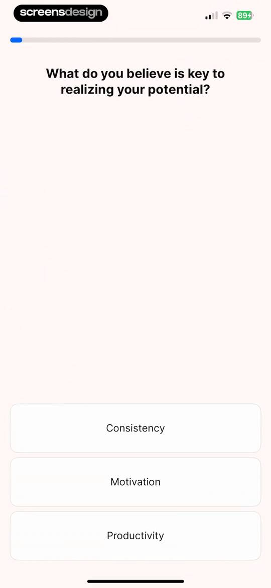
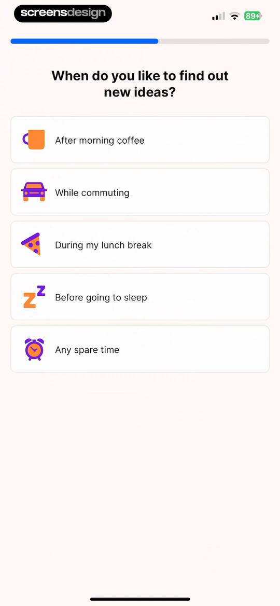
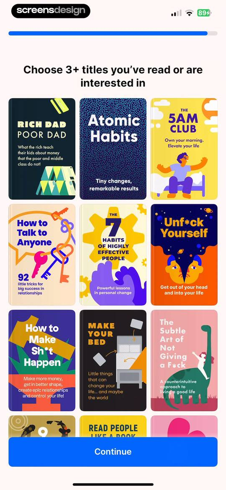
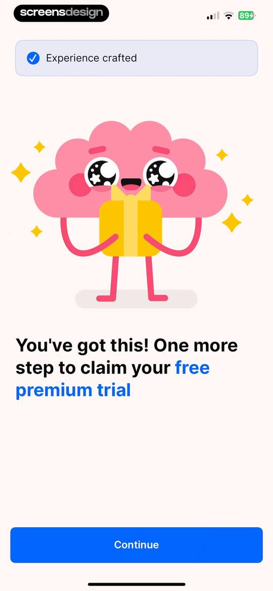
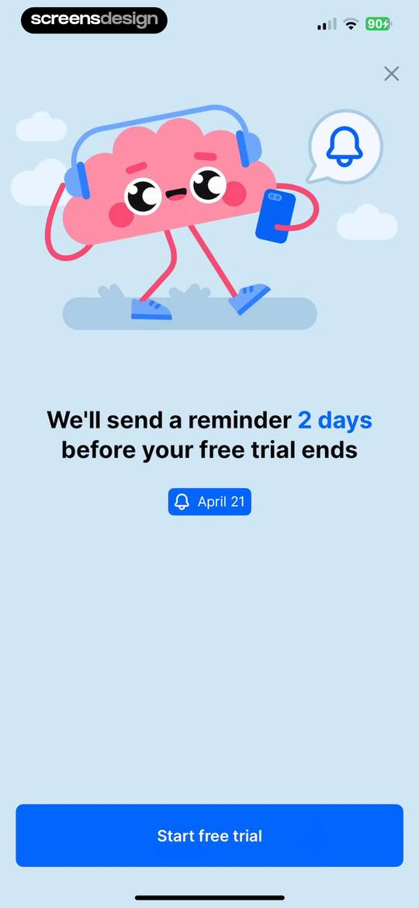
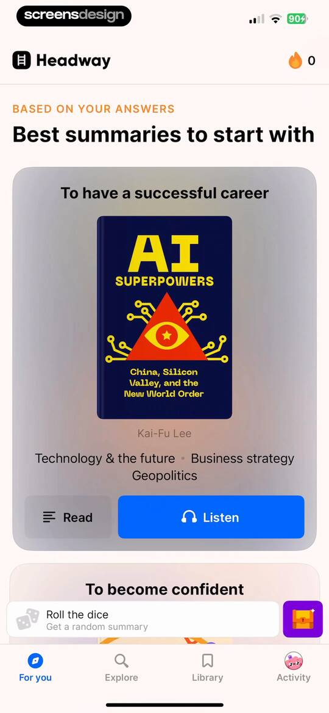
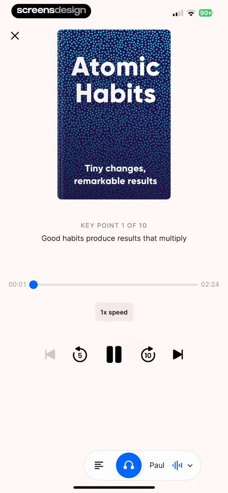
