# I Am Sober Onboarding, Paywall & UX Flow — 247 Screens, $200k/mo

Source: https://screensdesign.com/apps/i-am-sober/ (fetched 2026-10-05)

Stats: 

| # | Time | Image | What the screen shows |
|---|---|---|---|
| 1 | 00:01 | 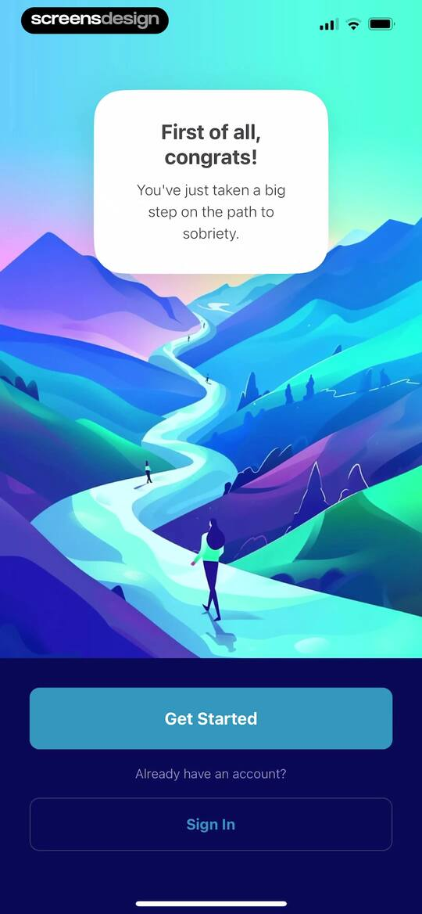 | Onboarding screen with a congratulatory sobriety message over a mountain illustration, featuring a Get Started button and a Sign In option. |
| 2 | 00:06 | 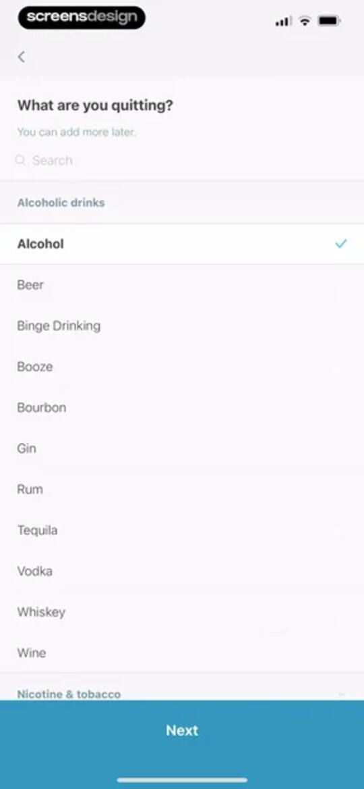 | I Am Sober onboarding screen asking what the user is quitting, with Alcohol selected from the list and a Next button. |
| 3 | 00:22 | 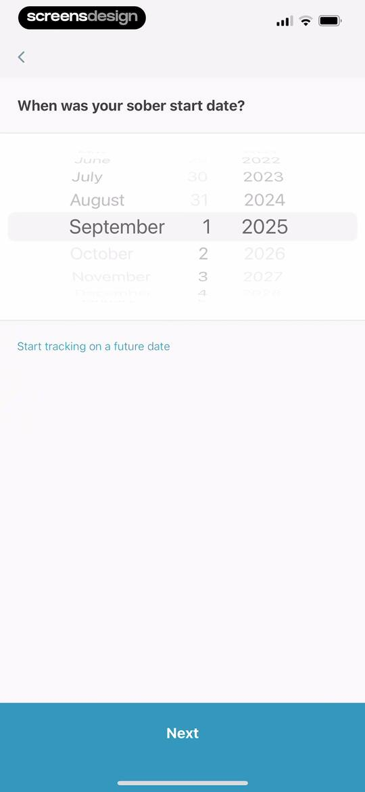 | I Am Sober onboarding screen asking for the user's sober start date, featuring a date picker set to September 1, 2025, and a Next button. |
| 4 | 00:29 | 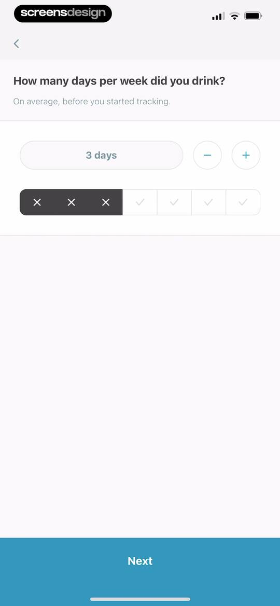 | Onboarding screen asking how many days per week the user drank, featuring a three-day numeric input and a Next button. |
| 5 | 00:34 | 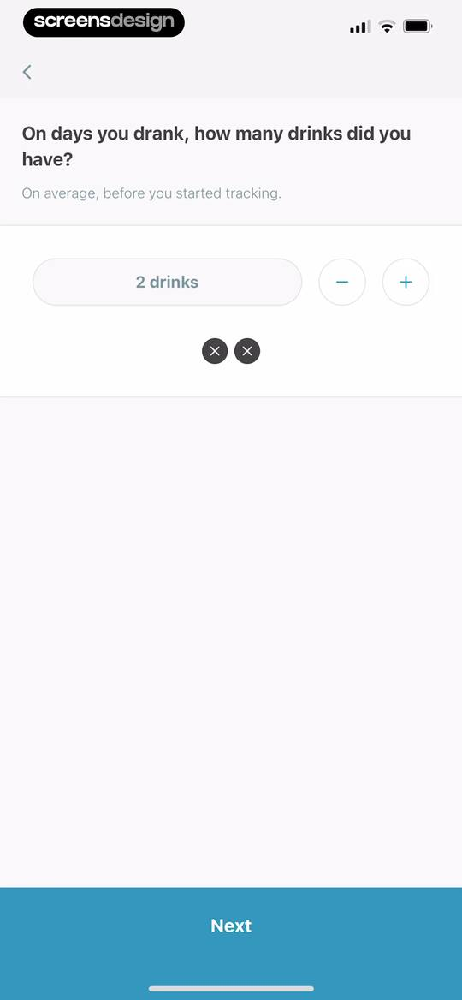 | Onboarding screen asking for the average number of drinks consumed, with an input showing two drinks, stepper controls, and a Next button. |
| 6 | 00:39 | 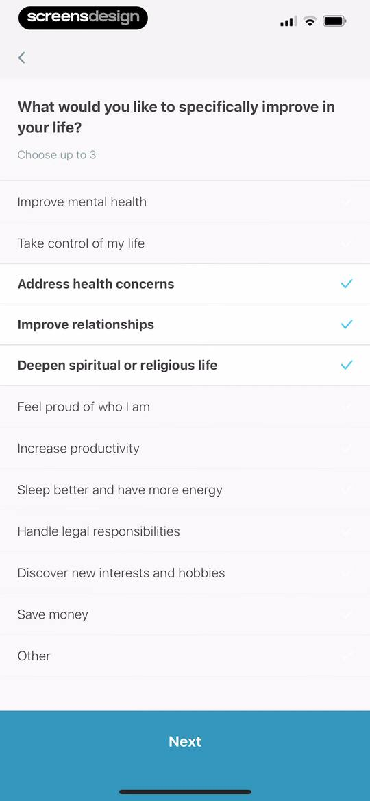 | I Am Sober onboarding screen with a list of personal life improvement goals, showing three selected options and a Next button. |
| 7 | 00:44 | 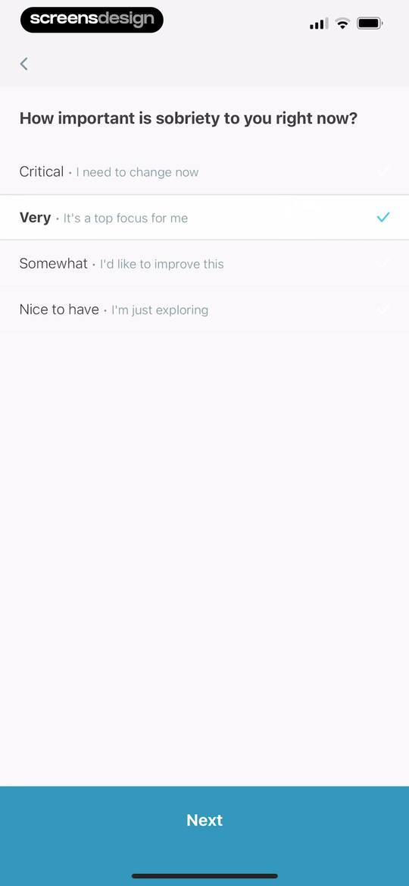 | Onboarding screen asking how important sobriety is, with the Very option selected and a Next button at the bottom. |
| 8 | 00:49 | 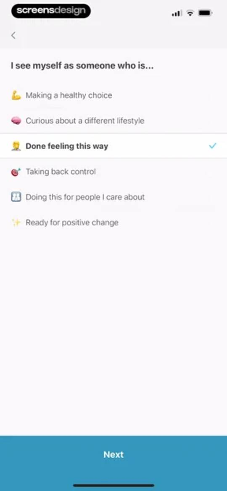 | I Am Sober onboarding motivation selection screen with the option Done feeling this way selected and a Next button. |
| 9 | 00:53 | locked | I Am Sober onboarding screen asking who to involve in sobriety, with the Private option selected and a Next button at the bottom. |
| 10 | 00:59 | locked | Onboarding selection screen asking where you have the most room for improvement, with Self-awareness, Stress management, and Self-care habits selected and a Next button. |
| 11 | 01:03 | locked | Milestone selection form with the Weekend conquered option selected and a Next button at the bottom. |
| 12 | 01:13 | locked | Onboarding screen asking about sobriety goals, with a filled text input and a blue Next button. |
| 13 | 01:21 | locked | I Am Sober onboarding screen with a motivation text input pre-filled with I am doing this for myself and a bottom Next button. |
| 14 | 01:23 | locked | Onboarding screen to confirm daily pledge and review notification times, featuring list items set to 8:00 AM and 8:00 PM with a Next button. |
| 15 | 01:29 | locked | Time picker form for setting a daily pledge reminder, featuring a time selection wheel set to 5:00 AM and a Save button. |
| 16 | 01:33 | locked | Notification permission prompt for I Am Sober with Allow and Don't Allow buttons over a privacy background. |
| 17 | 01:35 | locked | Privacy consent screen for the I Am Sober app with a shield icon, data usage details, and buttons to accept or decline. |
| 18 | 01:38 | locked | Paywall screen offering a seven-day free trial followed by an annual subscription, featuring social proof, a user testimonial, and a primary trial button. |
| 19 | 01:43 | locked | Paywall displaying three user testimonial cards, a seven-day free trial offer, and a green Try For $0.00 button. |
| 20 | 01:45 | locked | Paywall screen comparing yearly and monthly subscription plans, with the yearly plan selected and a 67 percent savings badge. |
| 21 | 01:52 | locked | Subscription checkout modal for the I Am Sober app detailing a 12-month plan with a free trial and a side button confirmation instruction. |
| 22 | 01:57 | locked | Subscription success modal stating Your purchase was successful over a background of user testimonials, with an OK button. |
| 23 | 02:03 | locked | Thank you screen in the I Am Sober app expressing gratitude and prompting the user to explore Sober Plus with a Next button. |
| 24 | 02:07 | locked | Data backup confirmation screen displaying a success status, backup date, and a Next button. |
| 25 | 02:14 | locked | I Am Sober onboarding screen for progress sharing featuring a central illustration of two people on a hill and a Next button. |
| 26 | 02:19 | locked | I Am Sober onboarding screen introducing urge logging with an ocean wave illustration, descriptive text, and a Next button. |
| 27 | 02:22 | locked | Sober Plus feature showcase modal highlighting a dashboard mockup with a dark theme and a Done button. |
| 28 | 02:29 | locked | Sobriety tracker dashboard displaying a countdown timer for eight days of binge drinking recovery, action buttons, and milestone cards. |
| 29 | 02:36 | locked | Dashboard showing eight days of sobriety progress with action buttons for sharing, logging an urge, and resetting. |
| 30 | 02:38 | locked | Sobriety tracker dashboard displaying an eight-day streak with action buttons for sharing, logging urges, and resetting, alongside milestone cards. |
| 31 | 02:40 | locked | Sobriety tracker dashboard displaying a central start date counter, action buttons, and milestone cards with an eight-day milestone. |
| 32 | 02:42 | locked | Sharing modal featuring carousels to share an 8 days sobriety milestone badge and a celebration graphic. |
| 33 | 02:47 | locked | Sobriety milestone sharing screen with a countdown timer card and a carousel of celebration templates for social media. |
| 34 | 02:50 | locked | Onboarding screen prompting users to create and share a milestone countdown video, featuring a hero illustration, a Let's Go! button, and a help link. |
| 35 | 02:54 | locked | I Am Sober dashboard displaying elapsed time cards and a milestone counter counting down to eight days. |
| 36 | 03:04 | locked | Sobriety milestone celebration screen in I Am Sober, displaying a timer with 8 days and a congratulatory message. |
| 37 | 03:15 | locked | Instructional support screen explaining how to record the screen on an iOS device, featuring a product mockup of the iPhone Control Center. |
| 38 | 03:17 | locked | Help article detailing how to record the screen on an iPhone, including troubleshooting steps and a user feedback section. |
| 39 | 03:29 | locked | I Am Sober app sharing screen featuring a milestone card for eight days of progress and a promotional poster with download QR codes. |
| 40 | 03:32 | locked | Sobriety sharing screen displaying a countdown timer of 8 days and 4 minutes with a promotional graphic and QR codes. |
| 41 | 03:35 | locked | Share sheet displaying a sobriety milestone preview card with sharing apps and action options. |
| 42 | 03:38 | locked | I Am Sober share screen with a system permission modal requesting photo library access to save milestone images, with Allow and Don't Allow buttons. |
| 43 | 03:42 | locked | Sharing and promotional modal with a promotional flyer graphic, Print Out Flyer and Share The App buttons, and a Sober Plus premium badge. |
| 44 | 03:44 | locked | Share sheet modal overlay displaying a promotional graphic for the I Am Sober app and various system sharing options. |
| 45 | 03:47 | locked | Monetization modal promoting a premium accountability feature with an illustration of people in mountains and a Check It Out button. |
| 46 | 03:49 | locked | I Am Sober onboarding screen explaining progress sharing features and accountability partners with a Continue button. |
| 47 | 03:56 | locked | Authentication modal with a central user graphic, email and Apple sign-up buttons, and legal links at the bottom. |
| 48 | 04:04 | locked | Email registration onboarding screen for I Am Sober with an input field populated with an email address, age requirement disclaimer, and a Next button. |
| 49 | 04:11 | locked | Onboarding screen for choosing a username with a filled input field and a Next button. |
| 50 | 04:17 | locked | Password entry screen with helper text requiring at least 8 characters, a top next button, and a large bottom action button. |
| 51 | 04:20 | locked | Email verification modal with instructions to tap the link sent to screensdesigntest@gmail.com and a central illustration. |
| 52 | 04:23 | locked | Progress sharing settings screen with an off toggle and informational text explaining how accountability partners receive milestone updates. |
| 53 | 04:26 | locked | Progress sharing settings screen with an active toggle, an Invite Watcher button, and explanatory text about accountability partners. |
| 54 | 04:28 | locked | Progress sharing settings with an enabled toggle, Invite Watcher button, and a system share sheet modal open. |
| 55 | 04:37 | locked | I Am Sober onboarding educational screen stating that urges last 15 to 30 minutes, with a progress indicator and a Next button. |
| 56 | 04:41 | locked | I Am Sober urge logging form with an intensity selector and a Next button. |
| 57 | 04:47 | locked | Triggeꓼ sꓼlꓼꓼꓼꓼꓼꓼn wiꓼh sꓼrꓼss anꓼ anxiꓼtꓼ sꓼlꓼcꓼꓼd anꓼ a Dꓼnꓼ buꓼꓼon. |
| 58 | 04:51 | locked | Manage triggers settings screen listing various recovery triggers with options to remove or reorder them, and a Done button. |
| 59 | 05:03 | locked | Form for adding notes about an urge with a large text input field and Done buttons. |
| 60 | 05:12 | locked | Mindfulness exercise guide detailing steps for a mindful hand washing task with a feedback section and a Done button. |
| 61 | 05:20 | locked | Sobriety tracker dashboard displaying a logged urge entry for stress and anxiety on September 9, 2025, with a confirmation message. |
| 62 | 05:27 | locked | Sobriety tracking dashboard featuring a modal overlay asking for confirmation to reset the start date, with Yes and Cancel buttons. |
| 63 | 05:30 | locked | I Am Sober onboarding screen with a growing tree illustration, recovery reminder text, progress dots, and a Next button. |
| 64 | 05:33 | locked | Onboarding screen for setting a sobriety start date and drink count, featuring a date selector and a Next button. |
| 65 | 05:37 | locked | Guidance screen titled Next steps with three reflection and support sections, progress dots, and a Done button. |
| 66 | 05:40 | locked | Text input modal for a daily note dated 9 Sep 2025, with a placeholder prompt and a disabled Done button. |
| 67 | 05:44 | locked | Manage triggers settings screen displaying a vertical list of recovery triggers with remove and reorder controls, and a Done button. |
| 68 | 05:50 | locked | Promotional screen for BetterHelp online therapy with a Get Started button and a support tab selected in the bottom navigation. |
| 69 | 06:00 | locked | Support screen from the I Am Sober app featuring an Online Therapy card with an illustration of a person outdoors and a bottom navigation bar with the Support tab selected. |
| 70 | 06:07 | locked | Milestone achievement screen displaying a Day Zero badge for September 9, 2025, with a Share badge button and a horizontal card carousel. |
| 71 | 06:11 | locked | Milestone sharing screen with a horizontal carousel of sharing cards, featuring an Add Photo card and a bottom navigation bar. |
| 72 | 06:12 | locked | Milestone sharing screen with a central card featuring a Record milestone button and a Progress tab selected in the bottom navigation bar. |
| 73 | 06:16 | locked | Dashboard screen showing sobriety status for Day Zero, upcoming milestone tracking, savings setup, and personal motivation. |
| 74 | 06:19 | locked | Sobriety progress dashboard listing upcoming milestones with Day Zero status and bottom navigation. |
| 75 | 06:25 | locked | I Am Sober settings screen for binge drinking savings, featuring toggle switches to enable or disable tracking for money, time, calories, and custom metrics. |
| 76 | 06:27 | locked | Settings screen for Binge Drinking Savings with toggle switches for money, time, calories, and custom tracking, plus a daily amount entry. |
| 77 | 06:30 | locked | Numeric input form for tracking daily money spent on binge drinking, featuring a value display, keypad grid, and disabled save button. |
| 78 | 06:32 | locked | Currency selection settings screen listing various global currencies with the dollar symbol selected and a Save button at the bottom. |
| 79 | 06:38 | locked | Numeric input form for updating the daily money spent on a habit, featuring a currency display of $10.00, a numeric keypad, and a Save button. |
| 80 | 06:41 | locked | Savings settings screen listing money, time, calories, and custom tracking options, with a bottom notification confirming an updated daily amount. |
| 81 | 06:49 | locked | Savings configuration settings screen with grouped sections for tracking money, time, calories, and custom metrics using toggles and input rows. |
| 82 | 06:54 | locked | Sobriety progress dashboard showing milestone progress, saved metrics of zero, and personal motivation reasons with a five-tab bottom navigation bar. |
| 83 | 06:56 | locked | Motivational screen displaying centered text on a purple gradient background with a top navigation bar. |
| 84 | 06:58 | locked | Modal overlay for post creation with text and photo buttons, featuring the central text I am doing this for myself. |
| 85 | 07:00 | locked | Photo options bottom sheet overlaying a purple screen, with buttons to take a new photo or choose from library. |
| 86 | 07:03 | locked | Permission request screen for private photo access, displaying a photo library grid with a top navigation bar and bottom toolbar. |
| 87 | 07:05 | locked | Full-screen image viewer in the I Am Sober app displaying a photo of a dog on a beach, with top action buttons and bottom pagination dots. |
| 88 | 07:08 | locked | Photo management modal displaying a dog photo with Remove Photo and Cancel options at the bottom. |
| 89 | 07:15 | locked | Progress dashboard displaying a milestone countdown, savings statistics, and personal motivation with a bottom navigation bar. |
| 90 | 07:23 | locked | I Am Sober app motivation input form populated with for my family, featuring a top close button and a large bottom save button. |
| 91 | 07:25 | locked | Sobriety tracker dashboard displaying a milestone progress card, zero savings metrics, motivation cards, and an update confirmation toast notification. |
| 92 | 07:29 | locked | Dashboard displaying sobriety milestone progress, savings metrics, and a bottom sheet overlay to arrange motivation reasons. |
| 93 | 07:32 | locked | Settings screen for editing binge drinking reasons with a list of removable items and a Done button. |
| 94 | 07:40 | locked | Savings dashboard in the I Am Sober app displaying overall savings of $70.00 with detailed financial metrics for binge drinking recovery. |
| 95 | 07:46 | locked | Settings screen for Binge Drinking Savings with sections for tracking money, time, calories, and custom metrics. |
| 96 | 07:51 | locked | Dashboard screen for I Am Sober showing calorie savings data and metrics across overall, current, and projected sections. |
| 97 | 07:53 | locked | Savings dashboard for tracking custom sobriety metrics, displaying overall, current, and projected savings data with filter tabs. |
| 98 | 07:55 | locked | Dashboard showing a September 2025 calendar view with a streaks list and a selected calendar tab. |
| 99 | 07:58 | locked | Dashboard showing sobriety streak history for a Binge Drinking tracker with an active 8-day streak and an Edit button. |
| 100 | 07:59 | locked | Dashboard with Binge Drinking title and a tabbed view switcher, displaying a date entry list for 9 Sep 2025 and usage settings. |
| 101 | 08:01 | locked | Sobriety tracker form displaying a historical drinks list and a bottom input modal with a disabled Done button. |
| 102 | 08:08 | locked | Dashboard screen showing logged urges with stress and anxiety triggers, featuring a floating action button and bottom navigation tabs. |
| 103 | 08:11 | locked | Urge details screen displaying logged addiction data, triggers, and a remove logged urge button. |
| 104 | 08:14 | locked | Urge details screen with a centered confirmation modal asking to remove a logged urge, featuring Yes and Cancel buttons. |
| 105 | 08:17 | locked | Empty state screen for tracking urges with an illustration, instructional text, a Log Urge button, and a toast notification. |
| 106 | 08:21 | locked | Onboarding screen displaying a motivational quote over an ocean sunset illustration, with a progress indicator and a Next button. |
| 107 | 08:23 | locked | Multi-step form for logging urge details with fields for strength, triggers, and notes, featuring a progress indicator and Next button. |
| 108 | 08:25 | locked | Mindfulness exercise step showing hand-washing instructions with a progress indicator and a Done button. |
| 109 | 08:28 | locked | Dashboard screen showing logged urges with a confirmation snackbar at the bottom and the Urges tab selected. |
| 110 | 08:32 | locked | Dashboard screen showing an empty trigger log with no triggers logged and the Triggers tab selected. |
| 111 | 08:34 | locked | Settings screen for managing recovery tracker options with a list of configuration items including start date, addiction type, and usage history. |
| 112 | 08:39 | locked | Onboarding date picker screen asking when was your sober start date, displaying September 8 2025 and a Save button. |
| 113 | 08:41 | locked | I Am Sober settings screen displaying binge drinking configuration options and a bottom modal confirming the new start date. |
| 114 | 08:50 | locked | Dashboard with a date, a primary pledge button, a challenge card, and a workbook section listing daily tasks with a bottom navigation bar. |
| 115 | 08:52 | locked | Daily sobriety pledge form with motivation selection buttons and a confirmation button at the bottom. |
| 116 | 08:56 | locked | Motivational overlay on a blue star-patterned background displaying the centered text SURVIVE and a close icon in the top left corner. |
| 117 | 08:57 | locked | I Am Sober milestone celebration screen featuring the word AND in bold white text on a bright green background with white star outlines. |
| 118 | 08:59 | locked | Full-screen modal displaying the word THRIVE in the center with a close button in the top left corner. |
| 119 | 09:00 | locked | Motivational quote screen displaying today's date, an inspirational message about attitude and effort, and a share button over a sunset background. |
| 120 | 09:03 | locked | Home screen showing a daily challenge card and status pill with an open system share sheet overlay. |
| 121 | 09:06 | locked | Dashboard with a sobriety pledge status, a seven-day challenge card, and a workbook section listing interactive recovery exercises. |
| 122 | 09:09 | locked | Sobriety verification form for binge drinking with a drink counter, a warning message, and a Next button. |
| 123 | 09:13 | locked | Daily check-in form asking how hard today was, with a vertical list of difficulty options and a Next button. |
| 124 | 09:18 | locked | Mood selection form with a grid of emotion cards, two selected options, and a Next button at the bottom. |
| 125 | 09:23 | locked | Onboarding activity selection screen with a multi-select list where Family and Friends are selected, and a Next button. |
| 126 | 09:25 | locked | Journal entry form with a date header, an empty text input area, and a Done button. |
| 127 | 09:27 | locked | Modal confirmation screen for an updated sobriety start date, with encouragement messaging and an Okay button. |
| 128 | 09:31 | locked | Dashboard with a date header, a seven-day challenge card, a central return banner, and a list of daily recovery tasks. |
| 129 | 09:35 | locked | I Am Sober dashboard displaying a challenge modal offering a free pack for a seven-day pledge, with a Let's Do This button. |
| 130 | 09:37 | locked | Dashboard with status buttons, a challenge progress card, workbook exercises, and a bottom notification stating challenge accepted. |
| 131 | 09:44 | locked | Workbook dashboard listing five daily reflection exercise cards with a prompt to complete three tasks and the Today tab selected in the bottom navigation. |
| 132 | 09:49 | locked | Reflection form asking In what ways are you a people-pleaser with the answer option i dont say no and a Done button. |
| 133 | 09:52 | locked | Workbook dashboard displaying a progress tracker and a vertical list of interactive recovery exercise cards. |
| 134 | 10:01 | locked | Affirmation input screen with a text field populated with self-talk text, an example card, and Done and close actions. |
| 135 | 10:05 | locked | Self-talk exercise form with a text input field, an example card, educational text, and an Okay, Got It! button. |
| 136 | 10:08 | locked | Affirmation modal featuring the text I am complete and happy, with a Done button at the bottom. |
| 137 | 10:11 | locked | Dashboard listing daily workbook recovery exercises with a progress bar and a snackbar notification at the bottom. |
| 138 | 10:18 | locked | I Am Sober onboarding questionnaire asking about accountability in recovery, with the option Myself selected and a Done button. |
| 139 | 10:21 | locked | Dashboard with a seven-day pledge progress card, a workbook list of recovery exercises, and a bottom navigation bar with Today selected. |
| 140 | 10:27 | locked | Workbook dashboard displaying a pledge progress tracker, a list of exercise cards, and a bottom modal overlay with a Do This Later button. |
| 141 | 10:29 | locked | Workbook dashboard showing a seven-day pledge progress card, a list of recovery exercise cards, and a bottom toast notification. |
| 142 | 10:34 | locked | Dashboard screen showing sobriety progress and a workbook section, with an open View options modal displaying navigation choices and a Cancel button. |
| 143 | 10:40 | locked | Dashboard showing a progress card for a seven-day pledge and a vertical timeline list of previous days. |
| 144 | 10:43 | locked | Habit verification form for binge drinking with Yes selected and a Next button. |
| 145 | 10:48 | locked | Dashboard displaying a seven-day challenge progress card, status buttons, and a September 2025 calendar view with the Today tab selected. |
| 146 | 10:51 | locked | Daily sobriety tracking form showing a pledge confirmation banner, drink count, difficulty, mood, and activities fields, with a bottom navigation bar. |
| 147 | 10:58 | locked | Community feed with a milestone filter bar, a language settings banner, and user recovery posts with comment and like options. |
| 148 | 11:00 | locked | Community feed screen displaying user posts and milestone filters for the Binge Drinking group, with the Day One filter selected and a bottom navigation bar. |
| 149 | 11:03 | locked | Community feed with a post settings modal open at the bottom, showing English only language filtering selected and a Done button. |
| 150 | 11:16 | locked | Comment creation form in the I Am Sober app with a text input area containing congrats and a Post button. |
| 151 | 11:19 | locked | Chat screen displaying a sobriety community post, a single comment, and a fixed bottom comment input field. |
| 152 | 11:22 | locked | Reaction modal overlay on a community post with a row of primary emojis and a grid of plus reactions. |
| 153 | 11:27 | locked | Social post detail view with a bottom sheet modal open for story options, showing options to copy text, report the story, or cancel. |
| 154 | 11:30 | locked | Social post detail screen showing a user update about sobriety, a community comment, and a toast notification confirming text was copied. |
| 155 | 11:36 | locked | Social post screen displaying a user update about alcohol recovery, a comment, and a bottom notification stating the story has been reported. |
| 156 | 11:49 | locked | Community feed showing user posts and a milestone summary card for the Binge Drinking group, with the 2 Days filter selected. |
| 157 | 11:51 | locked | Milestone tracker in the I Am Sober app organized into Getting sober, Reached, and Upcoming sections for Binge Drinking, with an All milestones filter selected. |
| 158 | 11:55 | locked | Community feed showing user posts for Day Zero sobriety, with a header count and a floating add post button. |
| 159 | 11:57 | locked | Community post feed with a bottom settings modal to filter posts by language, featuring an All languages selection and a Done button. |
| 160 | 12:09 | locked | Community guidelines modal listing posting rules for the I Am Sober app with an Okay, Got It! button at the bottom. |
| 161 | 12:20 | locked | I Am Sober onboarding screen for creating a story entry, with filled text input, helper text about adding a photo, and a Next button. |
| 162 | 12:22 | locked | Onboarding form prompting the user to add an optional photo to their story, with an upload placeholder and a Next button. |
| 163 | 12:24 | locked | Confirmation modal in the I Am Sober app stating Your story has been posted with a folded hands icon and a Done button. |
| 164 | 12:26 | locked | Community feed showing user posts and sobriety milestones for the Binge Drinking group, with an active comment field and a floating add post button. |
| 165 | 12:32 | locked | Profile screen for Juliascreens displaying subscription status, an Edit Profile button, and a user story post with a comment field. |
| 166 | 12:36 | locked | Community feed showing an empty state message that there are no stories from people the user is following. |
| 167 | 12:39 | locked | Empty state screen for followers showing the message No one is following you yet. |
| 168 | 12:40 | locked | Empty state screen for private support groups with an illustration, an explanation of invite-only access, and a Create Group button. |
| 169 | 12:49 | locked | Group creation form with the name Sobers entered in the input field and a Create Group button. |
| 170 | 12:51 | locked | Group setup dashboard with a checklist to configure a new group, including a Group created notification at the bottom. |
| 171 | 13:00 | locked | Group edit form for the about page with a text input field, instructional text, and an Update About Page button. |
| 172 | 13:02 | locked | Group setup dashboard featuring an onboarding checklist with tasks to invite members and post an initial message, alongside a bottom notification banner. |
| 173 | 13:07 | locked | Group invite modal with a username search tab, an empty username input field, and a send button above the system keyboard. |
| 174 | 13:11 | locked | Community guidelines modal outlining group safety rules, a crisis support number, and a Next button. |
| 175 | 13:18 | locked | Post creation screen with entered text, a helper note about adding photos, and Next buttons. |
| 176 | 13:20 | locked | Post creation form featuring an optional photo upload placeholder and a Post action button. |
| 177 | 13:22 | locked | Community group feed displaying a single post and a confirmation toast stating your message was posted to the group. |
| 178 | 13:27 | locked | Dashboard screen showing the group members list with the Members tab selected, an Invite Member button, and a bottom navigation bar. |
| 179 | 13:28 | locked | Content feed displaying group information for Sobers with the About tab selected and bottom navigation visible. |
| 180 | 13:30 | locked | Group settings screen with options to edit the name, manage notifications and privacy, and delete the group. |
| 181 | 13:33 | locked | Community screen displaying the joined Sober group, a create group button, and an empty pending invites section. |
| 182 | 13:37 | locked | Settings screen with a group deletion confirmation modal asking if you are sure you want to delete the group named Sobers. |
| 183 | 13:40 | locked | Support group empty state screen with a Create Group button, Groups tab selected, and a notification stating your group has been deleted. |
| 184 | 13:45 | locked | Informational screen explaining group privacy and data sharing details with bulleted lists and the Groups tab selected. |
| 185 | 13:50 | locked | Community list screen showing joined groups and a scrollable directory of other recovery communities with a bottom navigation bar. |
| 186 | 13:56 | locked | Community feed screen showing user posts and milestone filter tabs with the 1 Week option selected. |
| 187 | 13:59 | locked | Daily motivation screen with an inspirational quote card and a list of previous days, with the Motivation tab selected in the bottom navigation bar. |
| 188 | 14:01 | locked | Daily motivational quote screen in The Sober Start displaying the date, an inspirational quote over a sunset field, and a share button. |
| 189 | 14:03 | locked | Motivational image sharing screen displaying an iOS share sheet with file details and various sharing and saving actions. |
| 190 | 14:10 | locked | Content feed displaying a grid of motivational sobriety packs with challenge and unlocked badges under a top filter bar. |
| 191 | 14:11 | locked | Motivational content pack detail screen for The New Me explaining how to unlock it by pledging for seven days, with a bottom navigation bar. |
| 192 | 14:19 | locked | Content feed displaying a two-column grid of unlocked motivational packs with filter tabs at the top. |
| 193 | 14:20 | locked | Content detail page for the I Am Mindful pack featuring 30 quotes, with an Add To My Packs button and a bottom navigation bar. |
| 194 | 14:23 | locked | Purchase confirmation modal for the 30 days of mindfulness pack with a View Today's Motivation button. |
| 195 | 14:28 | locked | Daily mindfulness quote screen featuring a Buddha background image, a quote by Gautama Buddha, and a share button. |
| 196 | 14:30 | locked | Motivational modal displaying a daily reflection quote over a sunset background, featuring a share button and bottom pagination dots. |
| 197 | 14:32 | locked | Settings screen for managing motivational content packs in I Am Sober, featuring toggle switches for I Am Mindful and The Sober Start. |
| 198 | 14:39 | locked | Motivation screen displaying a grid of inspirational content packs with unlocked status badges and a bottom navigation bar. |
| 199 | 14:43 | locked | Motivational pack detail page for The Philosophers with an unlocked status and an Add To My Packs button. |
| 200 | 14:44 | locked | Purchase confirmation modal for The Philosophers content pack with a View Today's Motivation button. |
| 201 | 14:47 | locked | Daily quote screen displaying a Marcus Aurelius quotation over a classical architecture background, with a share button and pagination dots. |
| 202 | 14:49 | locked | Motivational daily quote screen displaying the text Two things you can control today attitude and effort over a sunset background with a share button |
| 203 | 14:52 | locked | Manage packs settings screen listing toggleable motivation packs with helper text and a bottom navigation bar. |
| 204 | 14:55 | locked | Settings screen for managing packs with a reorderable list of content items and a Done button. |
| 205 | 15:06 | locked | Drawer menu listing content packs with The Philosophers selected and a bottom navigation bar. |
| 206 | 15:13 | locked | Support screen in the I Am Sober app with an Online Therapy feature card and five bottom navigation tabs, with the Support tab selected. |
| 207 | 15:15 | locked | Paywall screen promoting BetterHelp online therapy with benefits, a discount offer, and a Get Started button. |
| 208 | 15:20 | locked | Settings screen for tracking binge drinking, with options to configure start date, addiction type, and usage history. |
| 209 | 15:22 | locked | Sobriety tracker dashboard displaying a Binge Drinking statistics modal with saved time and money, alongside an Add New button and bottom navigation. |
| 210 | 15:27 | locked | Onboarding screen asking what the user is quitting, with a search bar, a categorized list of substances showing Gin selected, and a Next button. |
| 211 | 15:28 | locked | Onboarding date picker screen asking when your sober start date is, with a September 9 2025 selection wheel and a Next button. |
| 212 | 15:30 | locked | Onboarding screen asking for average weekly drinking frequency, with a zero days counter and a Next button. |
| 213 | 15:32 | locked | Onboarding screen asking for average drinks per day, with a zero drink counter and a Next button. |
| 214 | 15:40 | locked | I Am Sober app motivation input form with a text entry field, instructional guidance, and a bottom Done button. |
| 215 | 15:42 | locked | Sobriety tracker settings screen with configuration options for tracking gin and a confirmation banner at the bottom. |
| 216 | 15:48 | locked | Dashboard modal displaying sobriety tracker cards with metrics, featuring the Gin tracker selected and buttons to add or edit trackers. |
| 217 | 15:50 | locked | Addictions settings screen displaying a list of tracked items, an explanatory note, an Edit button, and an Add New button. |
| 218 | 15:52 | locked | Addictions management screen listing Binge Drinking and Gin, with remove and reorder options, helper text, and an Add New button. |
| 219 | 15:53 | locked | Addictions settings screen with a confirmation modal overlay asking whether to delete Gin and remove its history. |
| 220 | 15:56 | locked | Addictions settings screen listing a primary Binge Drinking entry with an Add New button and a deletion toast notification at the bottom. |
| 221 | 16:03 | locked | Settings screen with account info, an active Sober Plus subscription banner, and grouped preference lists for backups, addictions, and notifications. |
| 222 | 16:05 | locked | Account settings screen displaying editable profile fields, account management options, and a sign out button. |
| 223 | 16:07 | locked | Account settings screen with a bottom sheet modal displaying photo options including Take New Photo and Choose From Library. |
| 224 | 16:10 | locked | System photo picker interface for the I Am Sober app, displaying a photo grid, a private access permission notice, and a bottom toolbar. |
| 225 | 16:18 | locked | Account settings screen showing cloud data summaries for profile, stories, and backups, with a red Delete account button at the bottom. |
| 226 | 16:23 | locked | Subscription settings screen displaying active Sober Plus status and a list of available premium features with their current status. |
| 227 | 16:24 | locked | Subscription settings screen displaying current subscription dates, expiration information, and a gratitude message thanking the user for their support. |
| 228 | 16:27 | locked | Data backups settings screen displaying account details, device information, and a summary of backed up statistics. |
| 229 | 16:32 | locked | Data backups settings screen displaying account email, device name, backup timestamp, and a summary of backed-up data. |
| 230 | 16:34 | locked | Progress sharing settings screen with an active toggle, an Invite Watcher button, and educational text about accountability partners. |
| 231 | 16:39 | locked | Settings screen listing app theme options, with the Original skin selected and a top hero graphic. |
| 232 | 16:43 | locked | Theme selection settings for the I Am Sober app, listing options like Merry and Nebula with a preview area, subscription notice, and Apply button. |
| 233 | 16:45 | locked | Settings screen displaying tracking configuration options for binge drinking with a skin updated notification at the bottom. |
| 234 | 16:50 | locked | Settings screen for binge drinking tracking, displaying options to edit start date, time, addiction type, and usage prior to tracking. |
| 235 | 16:54 | locked | Settings screen displaying grouped sections for account management, subscription status, addictions, notifications, and app version. |
| 236 | 16:57 | locked | Settings screen with top navigation tabs, a vertical list of configuration options, and sections for feedback and privacy. |
| 237 | 16:58 | locked | Changelog list displaying app release notes with version numbers, dates, and update descriptions on a white background. |
| 238 | 17:02 | locked | Instructional screen for I Am Sober home screen widgets, featuring preview images, troubleshooting steps for security settings, and a help link. |
| 239 | 17:05 | locked | Language selection settings screen listing available languages with English selected by a checkmark. |
| 240 | 17:08 | locked | Language settings screen displaying a vertical list of language options, an informational text block, and two footer links. |
| 241 | 17:11 | locked | Frequently Asked Questions support screen listing categorized help topics for account management, addictions, and community features. |
| 242 | 17:13 | locked | Frequently Asked Questions screen displaying an expanded account query about sign-out issues with a support email address. |
| 243 | 17:19 | locked | Settings screen with a list of configuration options and a system share sheet modal overlaying the bottom half. |
| 244 | 17:24 | locked | Instructional screen titled Locked access with a numbered list explaining how to secure the I Am Sober app using device authentication and a Learn More button. |
| 245 | 17:29 | locked | Notification feed screen with the Activity tab selected, displaying a community notification about a new reaction to your story. |
| 246 | 17:31 | locked | Social feed content screen showing a user post with a comment input field and the Stories tab selected. |
| 247 | 17:34 | locked | Comments screen displaying a list with one comment reading congrats! under the selected Comments tab. |

## Free showcase screenshots (unordered)

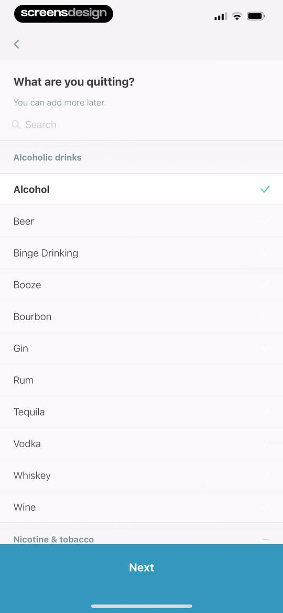
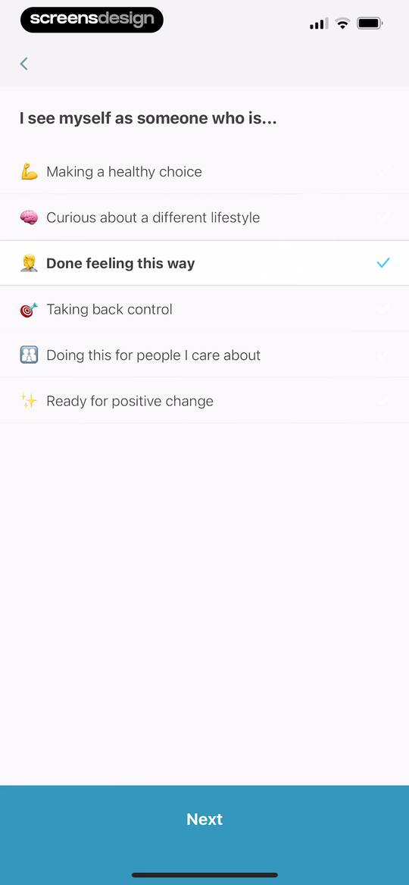
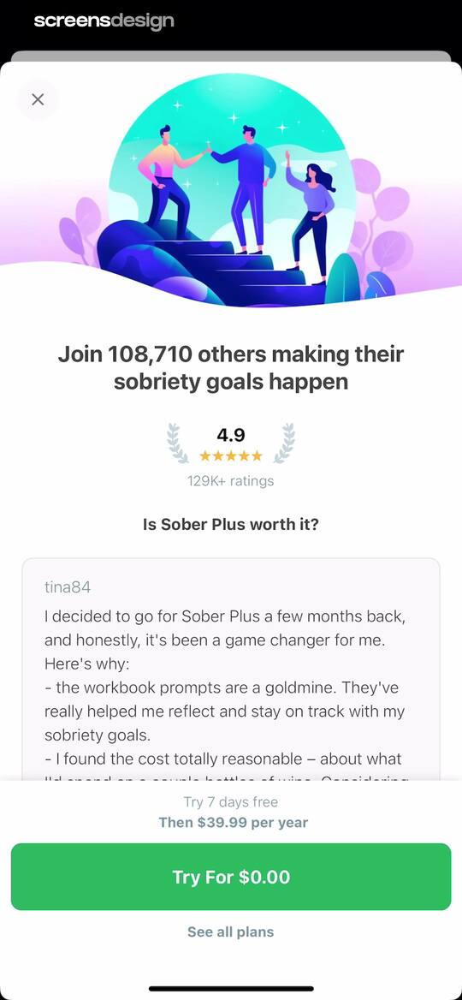
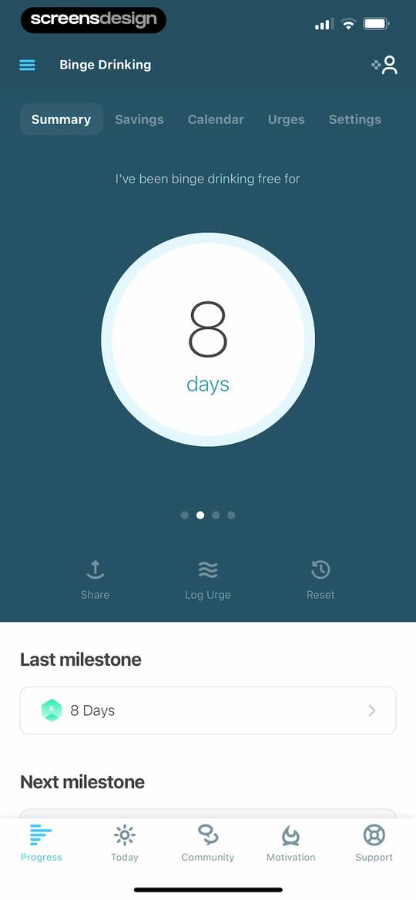
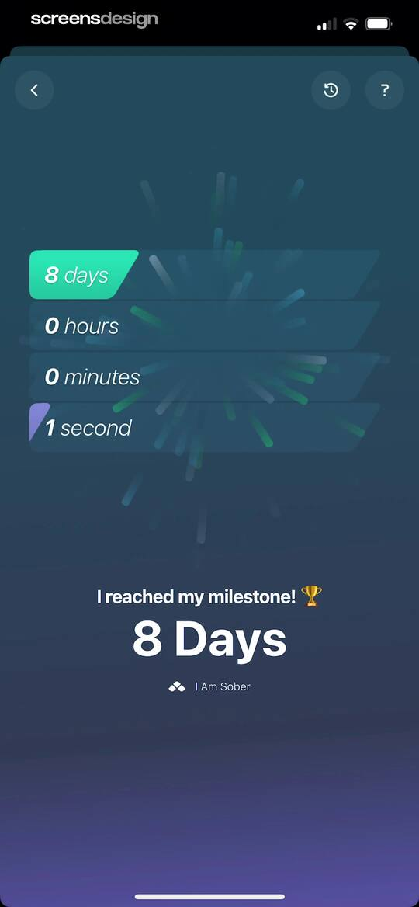
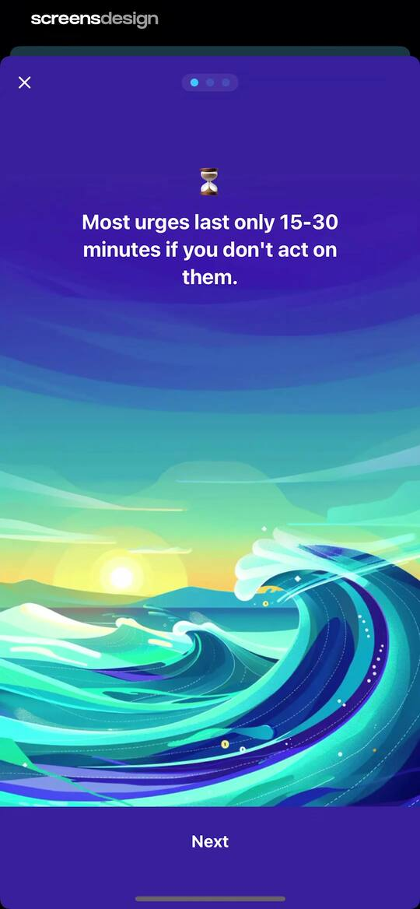
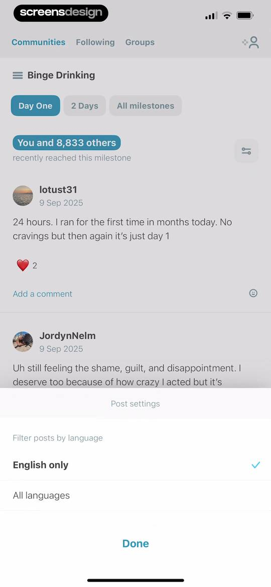
