# Imprint: Visual Micro Learning Onboarding, Paywall & UX Flow — 114 Screens, $250k/mo

Source: https://screensdesign.com/apps/imprint-learn-visually/ (fetched 2026-10-05)

Stats: 

| # | Time | Image | What the screen shows |
|---|---|---|---|
| 1 | 00:00 | 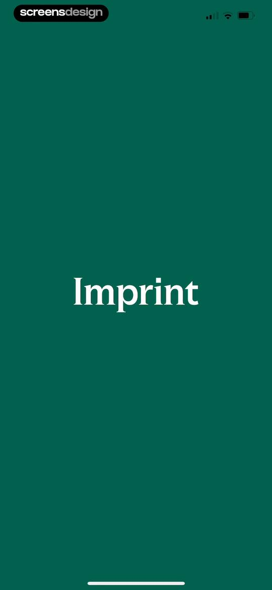 | Splash screen for the Imprint app with the app name centered in white serif text on a solid forest green background. |
| 2 | 00:02 | 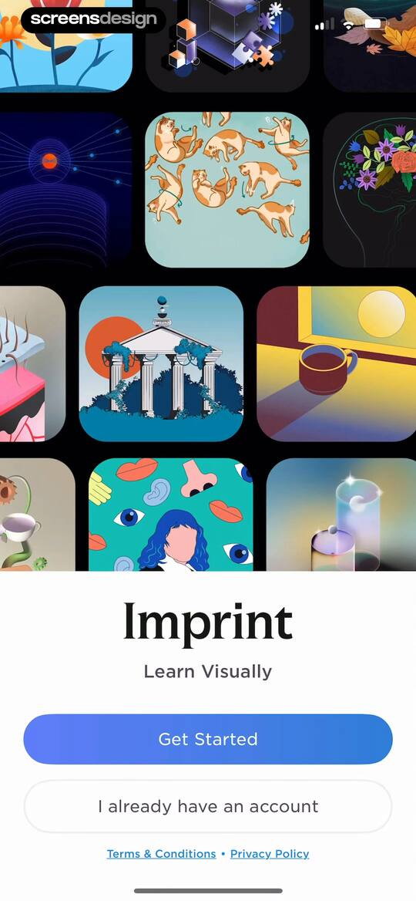 | Onboarding screen with an illustrative background grid and a white modal displaying Get Started and sign-in buttons. |
| 3 | 00:03 | 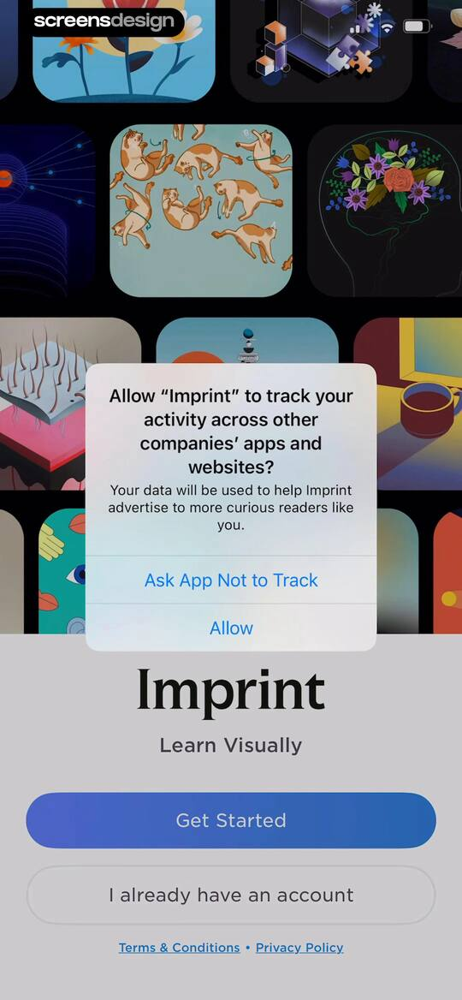 | System permission modal requesting app tracking transparency for Imprint, overlaid on an onboarding screen with course thumbnails and get started buttons. |
| 4 | 00:28 |  | Onboarding screen for the Imprint app featuring a DNA double helix illustration, progress bar, and a Continue button. |
| 5 | 00:32 | 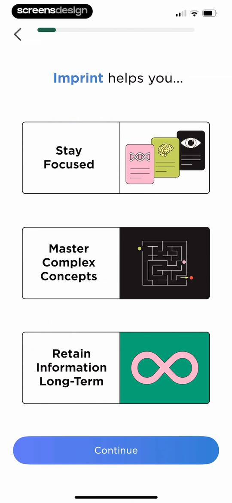 | Onboarding screen showcasing three feature cards and a progress bar, with a Continue button at the bottom. |
| 6 | 00:36 | 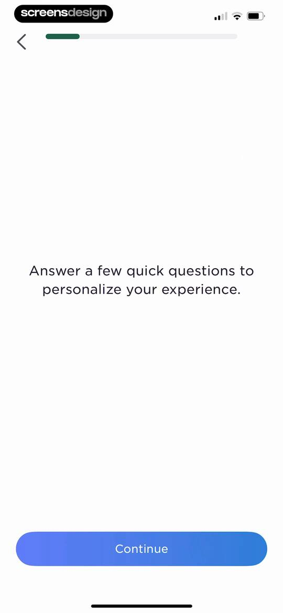 | Onboarding screen featuring a progress indicator, a prompt to answer personalization questions, and a Continue button. |
| 7 | 00:43 | 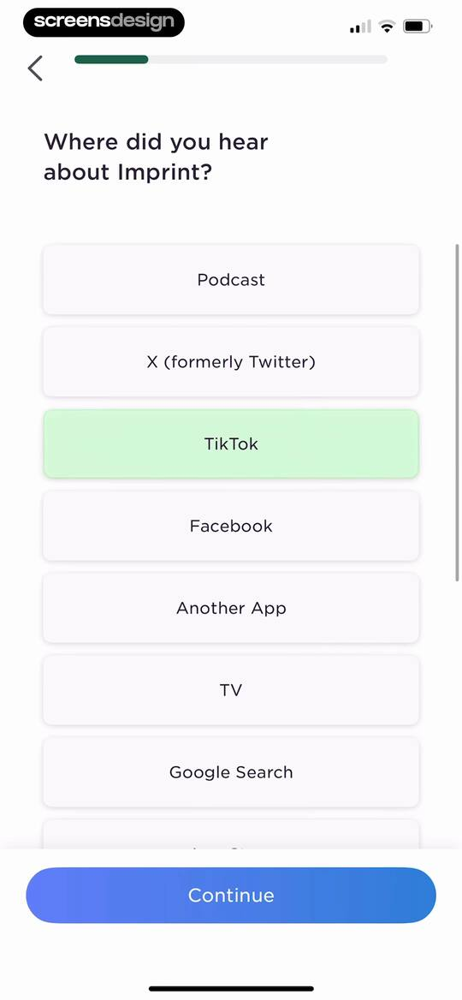 | Imprint onboarding survey asking how the user heard about the app, with TikTok selected and a Continue button. |
| 8 | 00:48 | 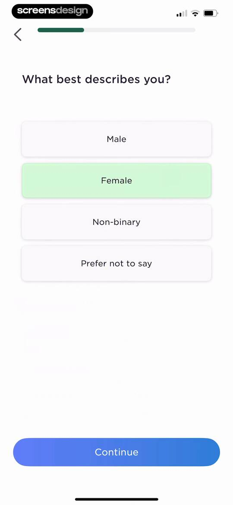 | Onboarding screen asking What best describes you with four gender options, the Female option selected, and a Continue button. |
| 9 | 00:53 | locked | Onboarding age selection screen with options from 17 or younger to 45 or older, with the 25 - 34 option selected and a Continue button. |
| 10 | 01:00 | locked | Onboarding interest selection screen with a list of topics, History, Psychology, and Health and Wellness selected, and a Continue button. |
| 11 | 01:08 | locked | Onboarding interest selection screen asking which history topics interest the user, with two options selected and a Continue button. |
| 12 | 01:15 | locked | Onboarding preference selection screen asking which psychology topics interest you, with multiple selection cards checked and a Continue button. |
| 13 | 01:23 | locked | Onboarding health and wellness interest selection screen with two topics selected and a Continue button. |
| 14 | 01:27 | locked | Onboarding goal selection screen listing topics with the finance card selected and a Continue button. |
| 15 | 01:36 | locked | Imprint app onboarding screen explaining the learning methodology with a central diagram of three pillars and a Continue button. |
| 16 | 01:40 | locked | Onboarding testimonial screen featuring a user quote, an Apple Essential Education App badge, and a Continue button. |
| 17 | 01:45 | locked | Onboarding screen to set a daily learning goal, featuring three selectable time options with Quick selected, a motivational insight card, and a Continue button. |
| 18 | 01:49 | locked | Onboarding screen confirming a set goal with a learning path illustration and a Continue button. |
| 19 | 01:54 | locked | Permission request screen asking users to enable notifications for daily goals, with an illustration, an Enable Notifications button, and a Not now link. |
| 20 | 01:56 | locked | Permission onboarding screen for the Imprint app with a notification request modal, a central illustration, and Enable Notifications and Not now buttons. |
| 21 | 01:58 | locked | Referral screen promoting a free 7-day guest pass with an Invite a Friend button and a Not now option. |
| 22 | 02:01 | locked | iOS share sheet overlaying an invitation prompt to share a 7-day app pass with a friend. |
| 23 | 02:04 | locked | Onboarding screen for selecting a daily learning time, with the morning option selected and a Continue button. |
| 24 | 02:10 | locked | Imprint onboarding personalization completion screen featuring a central illustration collage with a green checkmark and a Continue button. |
| 25 | 02:12 | locked | Imprint onboarding personalization screen featuring a progress bar, a centered checkmark icon, and a Continue button. |
| 26 | 02:15 | locked | Onboarding testimonial screen featuring a user quote card, over 20 thousand star ratings, and a Continue button. |
| 27 | 02:18 | locked | Imprint app paywall screen featuring a learning illustration, text offering a seven-day free trial, and an I'm Ready button. |
| 28 | 02:22 | locked | Trial reminder screen featuring a bell illustration, policy text about a two-day notice, and a Try for Free button. |
| 29 | 02:27 | locked | Paywall screen offering a 7-day free trial for an annual subscription with a Start Your 7-Day Free Trial button. |
| 30 | 02:30 | locked | Subscription paywall comparing yearly and monthly plans with a 7-day free trial offer and a start trial button. |
| 31 | 02:35 | locked | Subscription checkout modal displaying yearly pricing and terms for Imprint Learn Visually with an instruction to confirm using the side button. |
| 32 | 02:41 | locked | Subscription paywall screen displaying plan options and features with a successful purchase confirmation modal overlaid in the center. |
| 33 | 02:47 | locked | Subscription paywall screen with a list of benefits and two plan cards, overlaid by a centered success alert modal with an OK button. |
| 34 | 02:51 | locked | Account creation screen featuring a heading, benefits subtext, three authentication buttons, and a log-in link. |
| 35 | 03:10 | locked | Account creation form with email and password fields, pre-filled email address, and a Create Account button. |
| 36 | 03:14 | locked | Imprint app onboarding screen with a course discovery funnel illustration, centered text about 120+ courses, and a Continue button. |
| 37 | 03:18 | locked | Onboarding screen featuring text about learning complex topics, a trajectory arc illustration with a location pin, and a Continue button. |
| 38 | 03:23 | locked | Onboarding screen illustrating a bite-sized learning path with icons and a Continue button at the bottom. |
| 39 | 03:26 | locked | Onboarding screen with centered text prompting a quick first lesson and a Continue button at the bottom. |
| 40 | 03:31 | locked | Onboarding course selection screen with three options, featuring the Interpersonal Dynamics card highlighted in yellow and a Start button. |
| 41 | 03:36 | locked | Onboarding tutorial screen displaying instructional text on either side of a vertical line, with a progress bar at the top and a floating action bar at the bottom. |
| 42 | 03:42 | locked | Lesson editor displaying text content and a Card Saved confirmation toast, with a top progress indicator and bottom action bar. |
| 43 | 03:46 | locked | Lesson content screen with an open iOS share sheet modal displaying sharing options and action items. |
| 44 | 03:48 | locked | System permission request modal overlaid on a lesson screen, asking to add to photos with Allow and Don't Allow buttons. |
| 45 | 03:52 | locked | Educational lesson screen featuring central text content and an open bottom feedback modal with options like report a typo and ask a question. |
| 46 | 04:01 | locked | Error reporting form with a filled feedback text area and a Submit feedback button. |
| 47 | 04:06 | locked | Lesson screen displaying Lesson 1 titled The Key Ideas with a progress indicator and a bottom floating action bar. |
| 48 | 04:09 | locked | Lesson slide showing educational text and an illustration of primitive huts, with a progress bar and a floating action bar at the bottom. |
| 49 | 04:12 | locked | Educational lesson screen displaying text about human relationships and an illustration of primitive huts, with a Card Saved confirmation overlay. |
| 50 | 04:16 | locked | Educational lesson screen from the Imprint app with historical text about early human social worlds, an illustration with labeled primitive huts, and a bottom floating action bar. |
| 51 | 04:19 | locked | Imprint educational lesson slide comparing human social life from 100,000 years ago to today, with a top progress bar and bottom engagement controls. |
| 52 | 04:24 | locked | Onboarding screen displaying a global network globe illustration, text about interconnected lives, a progress bar, and a bottom action bar. |
| 53 | 04:25 | locked | Imprint app quiz screen with a multiple-choice question about ancient humans, two answer options, and a disabled Check Answer button. |
| 54 | 04:27 | locked | Quiz screen displaying a multiple-choice question about ancient humans with two answer options and a Check Answer button. |
| 55 | 04:30 | locked | Quiz feedback screen showing a correct answer, a plus ten XP reward, and a continue button. |
| 56 | 04:33 | locked | Educational lesson screen comparing past and present human social life with side-by-side illustrations, text, a top progress bar, and a bottom engagement bar. |
| 57 | 04:34 | locked | Lesson screen displaying central text on human interaction, a progress indicator at the top, and a bottom floating action bar with like, share, and comment icons. |
| 58 | 04:38 | locked | Lesson screen displaying educational text about human nature, a Card Saved confirmation toast, and a bottom floating action bar. |
| 59 | 04:41 | locked | Educational lesson screen from the Imprint app featuring text about social psychology, a central illustration of three connected head silhouettes, and a bottom floating action bar with interaction icons. |
| 60 | 04:47 | locked | Quiz question screen asking whether evolution has changed the human brain, featuring True and False options and a Check Answer button. |
| 61 | 04:49 | locked | True or false quiz screen featuring a brain evolution question, an illustrated comparison card, the False option selected, and a Check Answer button. |
| 62 | 04:51 | locked | True or false quiz screen showing a correct answer with a +10 XP reward, a visual comparison card, and a Continue button. |
| 63 | 04:56 | locked | True or false quiz screen with a question about human social needs, a central illustration, True and False selection buttons, and a Check Answer button. |
| 64 | 04:58 | locked | Interactive quiz screen showing a correct answer for a true or false question, with a progress bar, XP reward, and Continue button. |
| 65 | 05:02 | locked | Quiz question screen asking whether social psychology benefits relationships, with True and False options and a Check Answer button. |
| 66 | 05:04 | locked | Quiz feedback screen displaying an incorrect answer result, the correct answer, and a Continue button. |
| 67 | 05:06 | locked | Educational lesson screen displaying a Key Insight card with a brain illustration and a progress indicator at the top. |
| 68 | 05:07 | locked | Educational content card screen displaying a brain illustration and a Card Saved confirmation message with a floating action bar. |
| 69 | 05:10 | locked | Lesson completion screen displaying the message Lesson Complete!, a total lesson XP of 24, and a metrics card showing correct answers and earned XP. |
| 70 | 05:13 | locked | Lesson completion screen displaying the text Lesson Complete, a total of 80 lesson XP, and a Continue button. |
| 71 | 05:17 | locked | Streak activation screen featuring a central flame icon and the prompt to tap and start your daily habit. |
| 72 | 05:19 | locked | Streak progress screen showing a one-day streak with a flame icon and a Continue button. |
| 73 | 05:25 | locked | Onboarding streak goal selection screen featuring a vertical list of four streak options with the 7 day streak selected in light green and a Commit to My Goal button. |
| 74 | 05:28 | locked | Onboarding session scheduling screen featuring a time selector set to 3:00 PM, an active calendar sync toggle, and Schedule and Skip buttons. |
| 75 | 05:30 | locked | Permission request modal asking for calendar access, featuring an event preview and Allow Full Access and Don't Allow buttons. |
| 76 | 05:32 | locked | Daily challenge dashboard showing a progress card with two of ten minutes completed and a continue button. |
| 77 | 05:35 | locked | Home screen featuring a learning desk illustration, the text Keep learning!, and Continue and Explore Imprint buttons. |
| 78 | 05:40 | locked | Home screen featuring a vertical lesson path for a psychology course, with a streak counter, user stats, and a Start button on the active lesson. |
| 79 | 05:44 | locked | Imprint instructional screen with a progress bar, central text divided by a vertical line to show navigation, and bottom action icons. |
| 80 | 05:48 | locked | Interactive quiz screen comparing historical and modern social life, with the option 'Evolved too' selected and a Check Answer button. |
| 81 | 05:50 | locked | Imprint app lesson feedback screen showing an incorrect answer for a human social life question, the correct answer, and a Continue button. |
| 82 | 05:52 | locked | Learning dashboard displaying a vertical course progress path, unit banner, header stats, and bottom navigation. |
| 83 | 05:54 | locked | Dashboard screen showing a course module titled Foundations of Human Relationships with a 100 percent complete status and a Start button. |
| 84 | 05:58 | locked | Home screen showing a vertical lesson path for Interpersonal Dynamics with a Basic Human Needs card and a Start button. |
| 85 | 06:05 | locked | Course action menu modal with options to save to library, share, and download. |
| 86 | 06:08 | locked | Course screen displaying an iOS share sheet overlay with sharing apps and system action options. |
| 87 | 06:26 | locked | Course options modal with a list including save to library, share, and downloaded actions over a course progress map. |
| 88 | 06:35 | locked | Home screen displaying a daily streak tracker, a featured course card with a continue button, and a bottom navigation bar. |
| 89 | 06:37 | locked | Home screen featuring a daily streak tracker and a recommended course card with an Open button. |
| 90 | 06:39 | locked | Home screen featuring a current streak tracker, a featured course carousel displaying The Science of Happiness, and a bottom navigation bar. |
| 91 | 06:44 | locked | Home screen featuring a Daily Read card, a course card to jump back into, and a bottom navigation bar. |
| 92 | 06:48 | locked | Course discovery screen featuring filter chips with New selected, a two-column grid of illustrated course cards, and a bottom navigation bar. |
| 93 | 06:53 | locked | Course progression screen displaying a vertical lesson path for How to Talk to Anyone with a Start button. |
| 94 | 06:57 | locked | Onboarding screen showing navigation instructions split by a vertical line, with a top progress bar and bottom action icons. |
| 95 | 07:03 | locked | Course discovery screen displaying a grid of philosophy course cards with category filters and a bottom navigation bar. |
| 96 | 07:05 | locked | Imprint app course discovery screen with a search input, category filter chips, and cards to suggest titles or share the app. |
| 97 | 07:09 | locked | Course catalog content feed with a top search bar and a two-column grid of illustrated course cards on philosophy, psychology, and finance. |
| 98 | 07:15 | locked | Search results screen displaying a two-column grid of health-related course cards with a search bar at the top. |
| 99 | 07:18 | locked | Loading screen showing the text Loading visuals, a 68% progress indicator, and a back button. |
| 100 | 07:20 | locked | Onboarding instruction screen with a top progress bar, vertical split showing tap instructions to navigate back or forward, and a bottom action bar with comment, share, and like icons. |
| 101 | 07:22 | locked | Imprint lesson screen titled Wildfire Smoke and the Air Quality Index, Explained, featuring a top progress bar and a bottom floating action bar. |
| 102 | 07:30 | locked | Search screen featuring category pills, a suggestion card, and a bottom-anchored system share sheet modal with sharing options. |
| 103 | 07:33 | locked | Home screen featuring a featured daily read card, recent courses with progress bars, and a bottom navigation bar. |
| 104 | 07:36 | locked | Imprint app library profile screen displaying a top course carousel, a downloads list, social media links, and a bottom navigation bar with the Library tab selected. |
| 105 | 07:40 | locked | Imprint search screen with filter chips, a discover input field, course suggestion and sharing cards, social links, and a bottom navigation bar. |
| 106 | 07:43 | locked | Library content feed showing a grid of educational course cards with filter tabs for All, To Read, and Complete, featuring the All tab selected. |
| 107 | 07:45 | locked | Library screen displaying a grid of course cards with the To Read tab selected. |
| 108 | 07:52 | locked | Home screen featuring a course progression path for How to Talk to Anyone with a Start button and top stats. |
| 109 | 07:57 | locked | Saved content feed displaying learning cards organized by topic with a sorting toggle and a bottom navigation bar. |
| 110 | 08:01 | locked | Saved cards content feed displaying educational snippets in a grid with a sorting toggle and the Saved tab selected in the bottom navigation bar. |
| 111 | 08:07 | locked | Imprint referral screen promoting a free 7-day guest pass for friends, featuring a green gradient card and an Invite button. |
| 112 | 08:11 | locked | Imprint app sharing modal inviting friends with a free 7-day pass and displaying a system share sheet. |
| 113 | 08:16 | locked | Home dashboard featuring a Streaks and Goals modal overlay displaying a current streak of one day, streak freezes, and a Continue button. |
| 114 | 08:20 | locked | Account Details settings screen displaying editable user fields, subscription management links, and a Log Out button. |

## Free showcase screenshots (unordered)

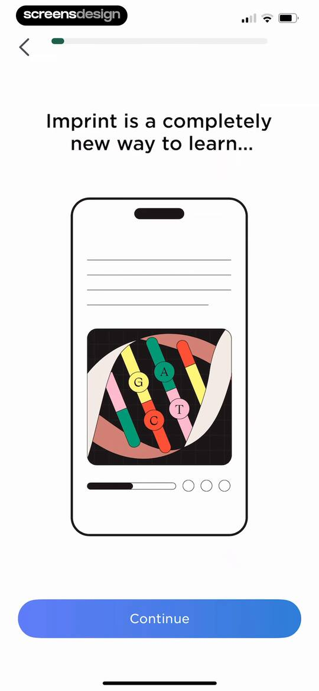
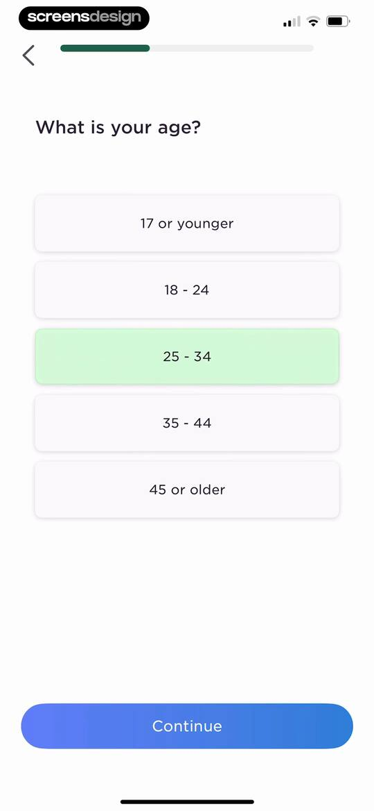
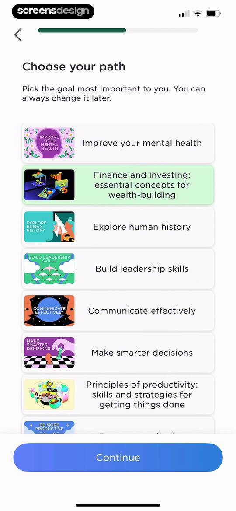
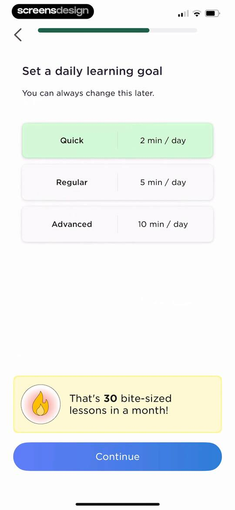
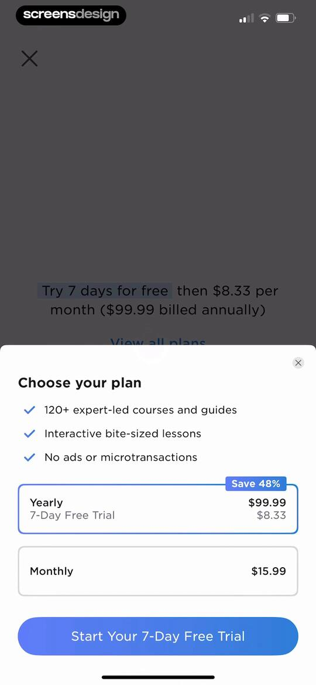
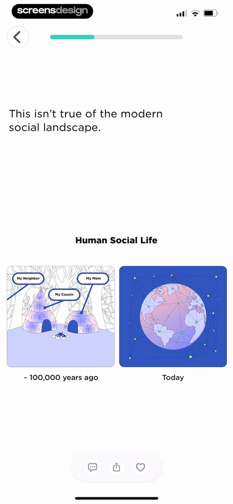
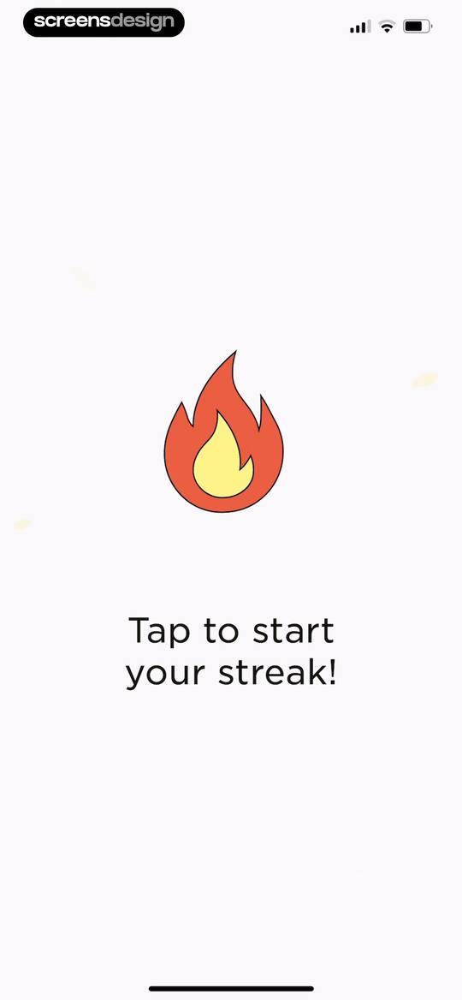
