# Liven: AI Life Coach Onboarding, Paywall & UX Flow — 163 Screens, $350k/mo

Source: https://screensdesign.com/apps/liven-discover-yourself/ (fetched 2026-10-05)

Stats: 

| # | Time | Image | What the screen shows |
|---|---|---|---|
| 1 | 00:01 | 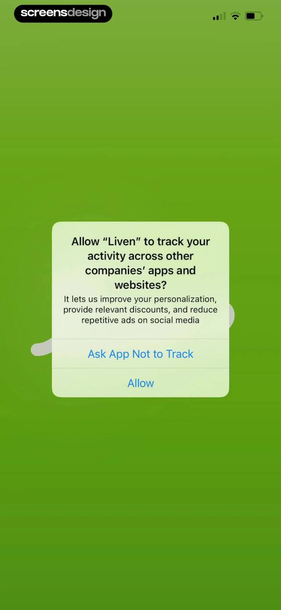 | App tracking transparency permission prompt for Liven, displayed over a green background with options to allow or ask the app not to track. |
| 2 | 00:04 | 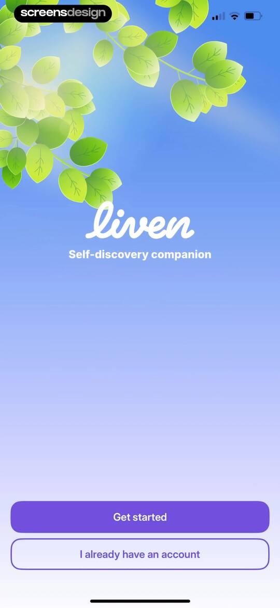 | Onboarding screen featuring nature imagery, the Liven app logo, and Get started and I already have an account buttons. |
| 3 | 00:09 | 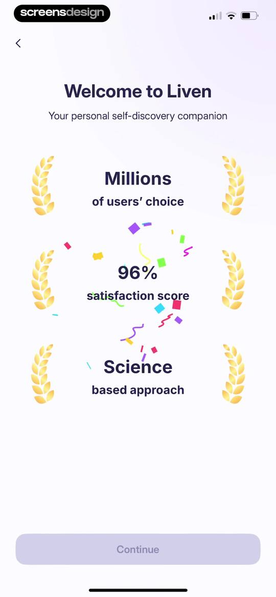 | Liven onboarding screen displaying social proof metrics with laurel icons and a disabled Continue button at the bottom. |
| 4 | 00:15 |  | Liven onboarding screen featuring a top progress bar, a cherry blossom illustration, and the heading Let's personalize Liven for you! |
| 5 | 00:24 | 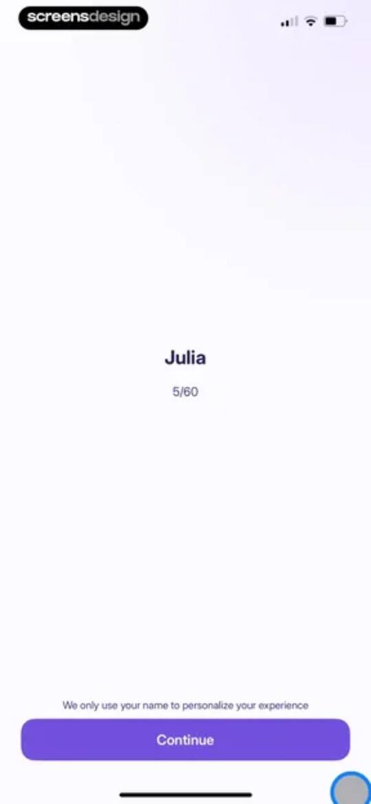 | Onboarding screen displaying the name Julia with a progress indicator and a Continue button. |
| 6 | 00:27 | 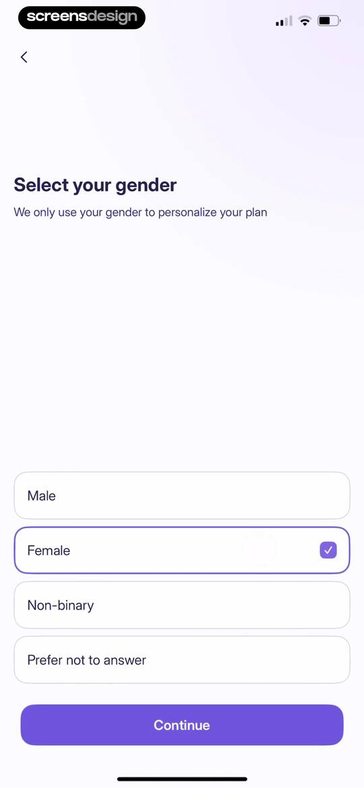 | Gender selection onboarding screen with the Female option selected and a Continue button. |
| 7 | 00:32 | 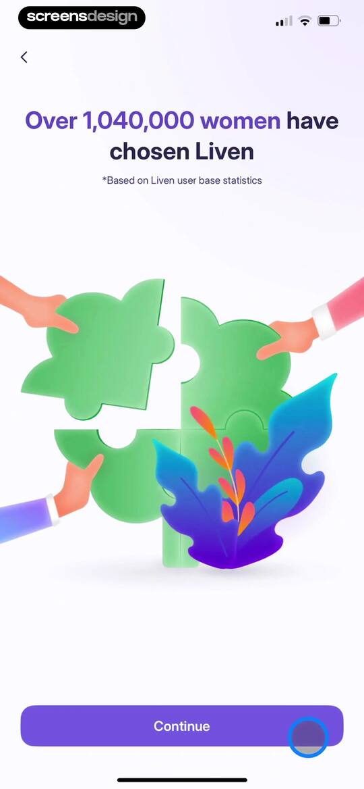 | Onboarding social proof screen for the Liven app showing user statistics, a central illustration, and a Continue button. |
| 8 | 00:36 | 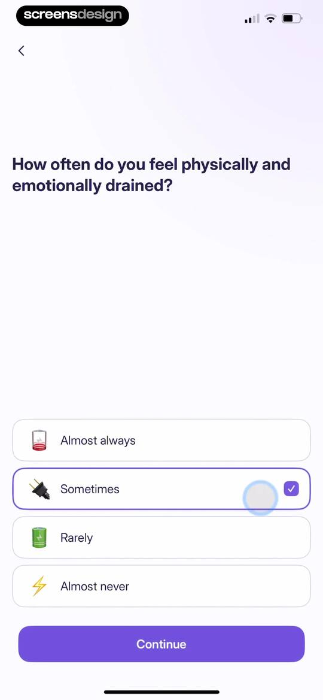 | Onboarding assessment screen asking how often the user feels drained, with the sometimes option selected and a continue button. |
| 9 | 00:40 | locked | Health onboarding screen asking about energy levels, with the Rarely option selected and a Continue button. |
| 10 | 00:48 | locked | Mental health onboarding screen featuring a stress prompt, a meditation illustration, a rating slider from 0 to 10, and a Continue button. |
| 11 | 00:50 | locked | Onboarding assessment screen asking about stress or anxiety with an illustration, a numeric slider, and a Continue button. |
| 12 | 00:51 | locked | Mental health onboarding screen featuring a stress prompt, a central illustration, a numerical slider, and a Continue button. |
| 13 | 00:56 | locked | Onboarding survey question about task overload with four emoji options, the Sometimes option selected, and a Continue button. |
| 14 | 00:58 | locked | Onboarding screen featuring a user testimonial card and a Continue button. |
| 15 | 01:06 | locked | Onboarding screen featuring a progress bar, a prompt to reflect on current challenges, and a central hot air balloon illustration. |
| 16 | 01:12 | locked | Onboarding questionnaire screen displaying a mental health question with the Sometimes option selected and a Continue button. |
| 17 | 01:15 | locked | Onboarding questionnaire asking a self-reflection question, with the Rarely option selected and a Continue button. |
| 18 | 01:18 | locked | Onboarding questionnaire screen asking about overthinking, with the Almost always option selected and a Continue button. |
| 19 | 01:21 | locked | Onboarding question screen asking whether you leave things to the last minute, with the Sometimes option selected and a Continue button. |
| 20 | 01:23 | locked | Onboarding question about distraction levels with a central illustration, a 0 to 10 slider, and a disabled Continue button. |
| 21 | 01:29 | locked | Onboarding question about distraction levels, featuring a central illustration, a 0 to 10 slider, and a Continue button. |
| 22 | 01:38 | locked | Onboarding questionnaire screen asking if you feel like you are using your phone to escape, with the Sometimes option selected and a Continue button. |
| 23 | 01:41 | locked | Onboarding question screen asking if you feel stuck, with the 'Almost always' option selected and a Continue button. |
| 24 | 01:43 | locked | Liven onboarding social proof screen with a trophy illustration, user statistics, and a Continue button. |
| 25 | 01:51 | locked | Onboarding goal selection screen listing personal development options with two items selected and a Continue button. |
| 26 | 01:56 | locked | Mental health onboarding questionnaire with multiple selection options, showing three selected concerns and a Continue button. |
| 27 | 01:58 | locked | Onboarding screen displaying scientific credibility claims with cards for Harvard, Oxford, and Cambridge universities, and a Continue button. |
| 28 | 02:03 | locked | Onboarding assessment screen asking about Cognitive Behavioral Therapy knowledge, with the option 'I've heard of it' selected and a Continue button. |
| 29 | 02:05 | locked | Onboarding screen displaying scientific claims and user statistics about behavior science, with a central brain illustration and a Continue button. |
| 30 | 02:09 | locked | Liven onboarding questionnaire asking how the user heard about the app, with the No option selected and a Continue button. |
| 31 | 02:13 | locked | Onboarding screen to set a daily goal, featuring four intensity options with the Easy card selected and a Continue button. |
| 32 | 02:18 | locked | Onboarding progress screen showing seventy percent completion with a greeting, completed steps, and a progress bar. |
| 33 | 02:28 | locked | Liven onboarding screen comparing before and after wellness states using two overlapping cards and a Continue button. |
| 34 | 02:31 | locked | Onboarding commitment contract screen featuring personal resolutions, an empty digital signature pad, and a disabled commit button. |
| 35 | 02:37 | locked | Blank empty state screen with a status bar at the top and no visible content or controls. |
| 36 | 02:37 | locked | Minimalist celebration screen featuring two party popper illustrations at the bottom corners firing colorful confetti into the air. |
| 37 | 02:40 | locked | Onboarding completion screen for the Liven app with the message You are all set! surrounded by a colorful confetti animation. |
| 38 | 02:46 | locked | Subscription paywall screen comparing weekly, yearly, and lifetime plans, with the weekly plan and its free trial selected alongside a continue button. |
| 39 | 02:52 | locked | Checkout screen displaying an iOS App Store subscription confirmation modal with weekly trial pricing and a side button confirmation prompt. |
| 40 | 02:57 | locked | Paywall screen with a centered modal confirming a successful purchase and an OK button. |
| 41 | 03:15 | locked | Account creation form populated with a username and email, a legal disclaimer, and a Create account button. |
| 42 | 03:36 | locked | Paywall offering psychology workbooks with a bundle option selected, discounted pricing, expert review details, and an Add to my plan button. |
| 43 | 03:42 | locked | Paywall screen offering a workbook bundle with discounted pricing, social proof, and an Add to my plan button. |
| 44 | 04:08 | locked | Onboarding welcome screen featuring a minimalist sunset illustration and the centered text Hello. |
| 45 | 04:09 | locked | Onboarding screen for the Liven app with a sunset illustration, centered welcome text, and a Start now button at the bottom. |
| 46 | 04:14 | locked | Liven app onboarding welcome screen featuring a sunset landscape illustration, the tagline Your self-discovery companion, and a Start now button. |
| 47 | 04:14 | locked | Splash screen for the Liven app featuring a sunset-themed background with floral and landscape illustrations and a circular logo container. |
| 48 | 04:14 | locked | Splash screen for the Liven app featuring a minimalist abstract purple background and a partially visible brand logo. |
| 49 | 04:19 | locked | Loading screen featuring a circular progress indicator surrounded by confetti, with the text One second, we're carefully tailoring your plan... |
| 50 | 04:20 | locked | Loading screen displaying a festive confetti background, a central loading animation with small icons, and status text about tailoring your plan. |
| 51 | 04:22 | locked | Notification permission request screen in the Liven app featuring a system prompt modal and a primary Remind me to practice button. |
| 52 | 04:26 | locked | Permission request screen with a system notification prompt and an arrow pointing to the Allow button. |
| 53 | 04:29 | locked | Personalized plan overview displaying course summary cards, a locked progress timeline with an Introduction section, and a Continue button. |
| 54 | 04:39 | locked | Onboarding screen featuring a phone mockup displaying a content feed, introductory headline, and a Continue button at the bottom. |
| 55 | 04:42 | locked | Onboarding screen displaying a daily tasks mockup and routine setup instructions, with a Continue button at the bottom. |
| 56 | 04:45 | locked | Onboarding screen displaying a grid of science-based test cards in a mobile mockup with a Continue button. |
| 57 | 04:46 | locked | Onboarding screen introducing Lesson 1 of a well-being course, featuring a central brain illustration and a Dive in button. |
| 58 | 04:51 | locked | Onboarding lesson screen welcoming the user to personal growth with a Start lesson button and progress indicator. |
| 59 | 04:57 | locked | Onboarding introduction screen with a welcome message and text explaining the app's mission as a self-discovery companion. |
| 60 | 05:00 | locked | Onboarding screen explaining the self-discovery plan with introductory text and a Continue button. |
| 61 | 05:02 | locked | Personalized course onboarding screen featuring introductory text, audio playback controls, a Continue button, and a disabled Complete lesson button. |
| 62 | 05:15 | locked | Audio lesson player screen featuring a central vinyl record graphic, playback controls, and a Complete lesson button. |
| 63 | 05:18 | locked | Onboarding completion screen with a success checkmark, experience rating prompt, and a Continue button. |
| 64 | 05:21 | locked | Onboarding completion screen featuring a success message, rating stars, optional feedback input, and a continue button. |
| 65 | 05:24 | locked | Milestone achievement screen featuring a Level Up badge, congratulatory text, and a Continue button. |
| 66 | 05:28 | locked | Streak celebration screen showing a one-day streak with a progress tracker for the days of the week and a Continue button. |
| 67 | 05:33 | locked | Goal setting screen for a streak duration with the three days option selected and a Commit to my goal button. |
| 68 | 05:35 | locked | Onboarding screen for setting a streak goal with a selection list, the 3 days option selected, and a Commit to my goal button. |
| 69 | 05:39 | locked | App review prompt asking users to leave a 5-star rating on the App Store, with a primary action button. |
| 70 | 05:44 | locked | App review prompt modal featuring a user testimonial, a request for a 5-star App Store review, and two action buttons. |
| 71 | 05:47 | locked | Home screen displaying a personalized plan with a chapter card and a vertical progress path of nodes. |
| 72 | 05:50 | locked | Dashboard displaying a personalized plan with chapter nodes on a vertical path and a bottom sheet modal detailing Chapter 1 Introduction. |
| 73 | 05:53 | locked | Wellness course lesson screen featuring an introduction chapter card, a welcome message, a Repeat button, and a vertical path of locked lessons. |
| 74 | 05:55 | locked | Wellness journey dashboard showing Chapter 1 Introduction with a progression path of nodes and a Start button. |
| 75 | 05:59 | locked | Lesson introduction screen for Understanding Well-Being with bulleted objectives and a Start lesson button. |
| 76 | 06:04 | locked | Loading screen displaying a centered spinner with the ADHD logo and a close button in the top left corner. |
| 77 | 06:08 | locked | Editor screen showing a well-being lesson with text and audio playback controls, a top progress bar, and a disabled complete lesson button. |
| 78 | 06:13 | locked | Onboarding screen with educational well-being text, a self-discovery question with binary choice buttons, a feedback card, and a Continue button. |
| 79 | 06:16 | locked | Well-being reading screen featuring sections on physical, mental, and emotional health, with a top progress bar and bottom navigation controls. |
| 80 | 06:17 | locked | Onboarding screen displaying educational text about mental and emotional well-being, featuring a top progress bar and a continue button. |
| 81 | 06:21 | locked | Onboarding article about habit building with bullet points, a top progress bar, and a bottom navigation bar with audio and text toggles. |
| 82 | 06:25 | locked | Self-discovery questionnaire screen with binary choice buttons, a supportive message card, and a Continue button. |
| 83 | 06:50 | locked | Lesson summary screen displaying a bulleted list of well-being takeaways and a Complete lesson button. |
| 84 | 06:53 | locked | Lesson completion screen with a success icon, experience rating scale, and a Continue button. |
| 85 | 06:56 | locked | Lesson completion screen with a success icon, rating stars, optional feedback text input area, and a Continue button. |
| 86 | 06:59 | locked | Personalized plan dashboard displaying a vertical journey path with Chapter 1 Introduction and an active node. |
| 87 | 07:02 | locked | Personalized plan dashboard featuring a vertical progress path with chapter cards and a locked content module. |
| 88 | 07:08 | locked | Streak calendar dashboard displaying a November 2025 monthly grid, a current streak summary of one, and a lightning bolt icon marking the seventh day. |
| 89 | 07:10 | locked | Onboarding screen introducing the streak feature with a central illustration and a Continue button. |
| 90 | 07:12 | locked | Onboarding screen introducing streak hunter mode with a central heart illustration and a Continue button. |
| 91 | 07:14 | locked | Educational modal explaining streak-reset rules with a calendar illustration and a Got it! button. |
| 92 | 07:23 | locked | Home screen greeting Julia with a central mood logging prompt, feature buttons, a recommended well-being article, and a bottom navigation bar. |
| 93 | 07:26 | locked | Mood-tracking onboarding form asking How do you feel right now with a central neutral mood visualization and a Continue button. |
| 94 | 07:30 | locked | Liven onboarding screen asking how you feel with a mood slider and Continue button. |
| 95 | 07:34 | locked | Mood check-in form asking how you feel right now, with a central graphic, a mood slider set to bad, and a Continue button. |
| 96 | 07:43 | locked | Liven mood check-in form asking how the user feels with an orange star illustration, a mood slider set to Awesome, and a Continue button. |
| 97 | 07:51 | locked | Emotion selection screen with a search bar, category tabs, a list showing Angry selected with a checkmark, and a Done button. |
| 98 | 07:54 | locked | Emotion selection form with mood categories, a list of specific feelings with descriptions, and a Done button at the bottom. |
| 99 | 07:58 | locked | Mood-tracking selection screen with multiple feeling tags, a definition card for the selected feeling, and a Continue button. |
| 100 | 08:06 | locked | Mood tracking form asking what causes a positive feeling, with selectable activity, location, and social tags and a Continue button. |
| 101 | 08:15 | locked | Mood analysis summary screen displaying a monthly awesome mood count, an emotional trigger chart with a brain icon, and a Continue button. |
| 102 | 08:18 | locked | Liven analytics dashboard displaying a weekly mood distribution chart and list of feelings, with a purple Continue button at the bottom. |
| 103 | 08:22 | locked | Liven analytics screen displaying lists of moods and linked life factors around a central radial chart, with a Continue button. |
| 104 | 08:24 | locked | Onboarding confirmation screen with a progress graphic, habit-building message, and a Continue button. |
| 105 | 08:28 | locked | Liven app onboarding screen explaining the benefits of regular mood tracking, featuring a central progress arc and a Continue button. |
| 106 | 08:34 | locked | Home screen greeting Julia with a prompt to log her mood, quick access tool cards, and a featured wellness article. |
| 107 | 08:36 | locked | Home screen greeting Julia, featuring a central mood logging circle, quick navigation buttons, and personalized wellness content cards. |
| 108 | 08:38 | locked | Journal loading screen with a centered progress indicator and smiling face icon within the Liven app. |
| 109 | 08:48 | locked | Journal entry screen with a text input field containing user notes, a prompt button, and a Save button above the system keyboard. |
| 110 | 08:52 | locked | Journal timeline screen displaying a prompt card, past entries list, and a bottom action button to write out thoughts. |
| 111 | 08:57 | locked | Task management empty state screen for the Liven app, featuring a horizontal date picker with November 07 selected and a New task button. |
| 112 | 09:00 | locked | New task form with an empty name field, category tabs, a list of suggested chores, and an Add task button at the bottom. |
| 113 | 09:02 | locked | New task creation form with a prefilled title, selected color swatch, Today due date, and an Add task button. |
| 114 | 09:06 | locked | Schedule task screen displaying a November 2025 monthly calendar grid with November 7 selected and a top navigation bar. |
| 115 | 09:19 | locked | Task management dashboard showing a horizontal date picker, a progress indicator, the task Water your plants, and a New task button. |
| 116 | 09:21 | locked | Task dashboard showing a completed plant-watering task, a horizontal calendar strip for November 8, and a New task button. |
| 117 | 09:33 | locked | Test selection screen featuring a vertical list of psychological assessments including Adult ADHD and Personality test with a back button. |
| 118 | 09:36 | locked | Assessment test landing page detailing the Childhood Trauma Impact test with 25 questions, benefits list, progress tracker, and a Start test button. |
| 119 | 09:38 | locked | Progress loading screen with two loading spinners and a close button in the top left corner. |
| 120 | 09:44 | locked | Single-choice questionnaire form with a progress indicator, an emotional focus question, the Sometimes option selected, and a Continue button. |
| 121 | 09:52 | locked | Sound category selection screen with a two-column grid of eight cards featuring titles like Nature Escape and Deep Sleep. |
| 122 | 09:55 | locked | Wellness app soundscape selection screen featuring a top category carousel, the title Floating, and a vertical list of tracks with favorite icons. |
| 123 | 09:58 | locked | Soundscape selection screen for the Floating category in the Liven app, featuring a track list with heart icons and an Added to Favorites confirmation button. |
| 124 | 10:07 | locked | Audio track selection list for Focus Flow with a hero illustration and tracks like Float to focus and Soft drive. |
| 125 | 10:24 | locked | Liven app onboarding video screen featuring a full-screen introductory video with an audio control in the top right and a bottom progress bar. |
| 126 | 10:35 | locked | Video playback screen with a bottom sheet modal displaying playback speed options ranging from 0.5x to 2.0x. |
| 127 | 10:47 | locked | Article reader screen titled Find hidden gems around you, featuring a 4 mins duration tag, a treasure chest illustration, and educational text about the neuroscience of novelty. |
| 128 | 10:49 | locked | Article screen titled Mindful Walk with step-by-step instructions, feedback buttons, and a related content section at the bottom. |
| 129 | 10:54 | locked | Explore content feed displaying mental wellness articles and videos, with quick-access links and bottom navigation. |
| 130 | 10:56 | locked | Loading screen with a centered spinner and a bottom navigation bar showing the Journey tab selected. |
| 131 | 11:03 | locked | Explore content feed with a trending featured card for love languages and a list of mental health video cards. |
| 132 | 11:06 | locked | Article reader screen displaying the title Love languages: How we give and receive love, a hero illustration, and multi-paragraph body text. |
| 133 | 11:09 | locked | Article screen displaying gratitude sharing tips, feedback buttons, and a list of recommended articles at the bottom. |
| 134 | 11:17 | locked | Content feed featuring a two-column grid of six self-discovery collection cards with illustrations and a selected Explore navigation tab. |
| 135 | 11:21 | locked | Work-Life Balance Guides content feed displaying a vertical list of articles and videos about wellness topics with reading times. |
| 136 | 11:24 | locked | Content feed displaying a grid of six self-discovery and wellness guide cards with a bottom navigation bar. |
| 137 | 11:29 | locked | Onboarding screen introducing the AI self-discovery companion Livie, featuring a bulleted feature list, disclaimer text, and a Start conversation button. |
| 138 | 11:34 | locked | Chat onboarding screen for an AI self-discovery companion named Livie, featuring an AI orb graphic, a Start conversation button, and quick reply suggestion chips. |
| 139 | 11:43 | locked | Chat screen for the Livie AI-Companion showing a supportive conversation about future worries and a message input field. |
| 140 | 11:46 | locked | Livie chat screen featuring an AI conversation about future worries and a bottom feedback modal with a Submit button. |
| 141 | 11:49 | locked | Chat interface with an AI companion displaying a conversation about the future, a feedback confirmation button, and a bottom text input. |
| 142 | 11:53 | locked | Livie AI-companion chat screen with a confirmation modal overlay asking to start from scratch and delete chat history. |
| 143 | 12:06 | locked | Chat screen for the AI companion Livie showing an active conversation about fatigue, a text input field, and a send button. |
| 144 | 12:10 | locked | Livie AI companion chat screen displaying a conversation about fatigue, feedback icons, and a bottom text input field. |
| 145 | 12:12 | locked | Feedback form asking users to rate their chat experience with a five-star scale and a disabled Continue button. |
| 146 | 12:14 | locked | Feedback form with a rating stars section, an optional text input field, and a Continue button. |
| 147 | 12:17 | locked | Liven app chat screen featuring an AI orb, an empathetic prompt, and a continue conversation button with the companion tab selected. |
| 148 | 12:24 | locked | Chat screen featuring a central AI orb, a check-in prompt, a view chat summaries link, and a Continue conversation button. |
| 149 | 12:28 | locked | Profile screen displaying user information, a one-day streak card, and a vertical list of mood tracking insight cards. |
| 150 | 12:32 | locked | Streak dashboard displaying a summary card for current streak stats and a November 2025 calendar grid. |
| 151 | 12:36 | locked | Mood timeline dashboard displaying past emotional history entries, including timestamps, felt emotions, and contributing factors. |
| 152 | 12:41 | locked | Analytics dashboard displaying a mood breakdown with a seven-day range selected and three data cards showing overall mood, time of day, and weekly trends. |
| 153 | 12:53 | locked | Analytics screen displaying most frequent feelings with frequency bars and a segmented control for time range. |
| 154 | 12:55 | locked | Analytics screen displaying most frequent feelings over a date range, with the 7 days filter selected and a list of emotions showing frequency bars. |
| 155 | 13:05 | locked | Analytics screen titled Reasons for your mood displaying categorized list items with progress bars and a 7 days time filter selected in the Liven app. |
| 156 | 13:12 | locked | Feedback topic selection screen with a list of categories including technical issue, experience feedback, and account management. |
| 157 | 13:18 | locked | Feedback form with a text input field containing user text and a Send message button above the keyboard. |
| 158 | 13:23 | locked | Confirmation screen in the Liven app with a success message and a Back to main screen button. |
| 159 | 13:30 | locked | Settings screen featuring a feedback card followed by grouped sections for account details, app settings, and help options. |
| 160 | 13:33 | locked | Username settings form with an empty input field, helper text, and a disabled Save button. |
| 161 | 13:37 | locked | Change password settings screen with input fields for a new password, account details, app settings, and a help and support section. |
| 162 | 13:45 | locked | Settings screen with a feedback card and grouped options for account, app settings, and help, with an appearance theme modal open. |
| 163 | 13:46 | locked | Settings screen with a dark theme, a feedback card, and grouped list sections for account, app settings, and help and support. |

## Free showcase screenshots (unordered)

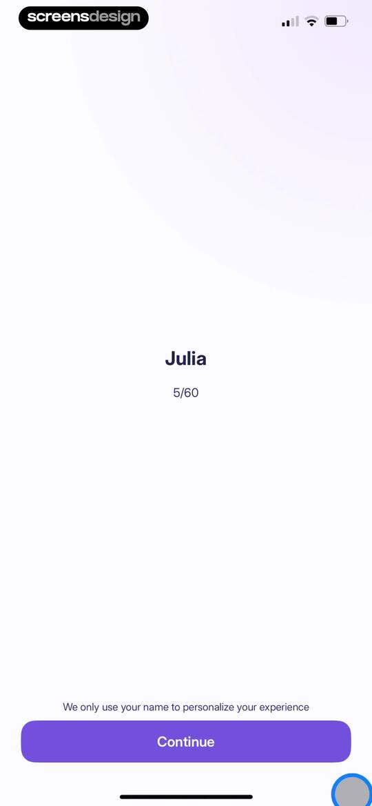
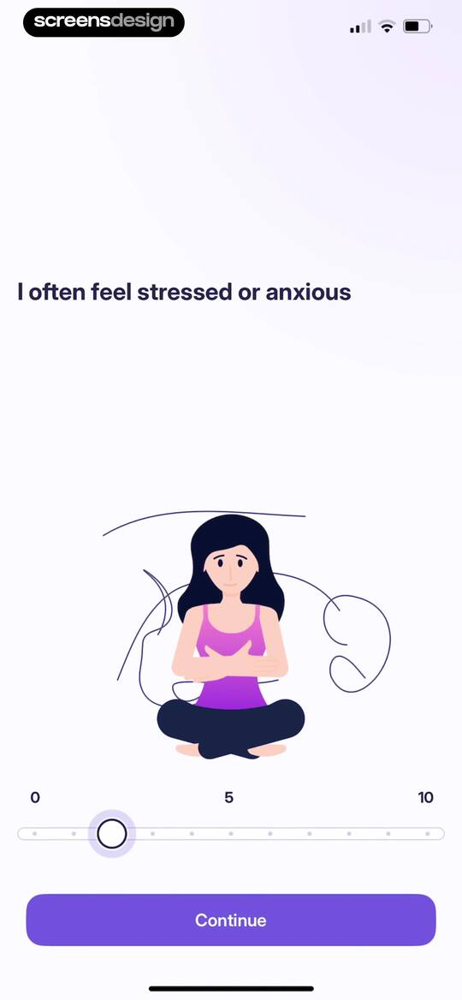
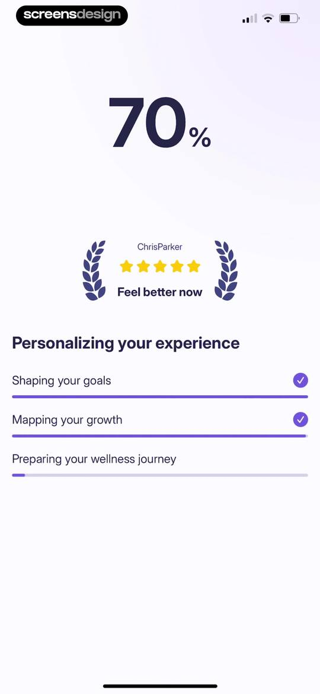
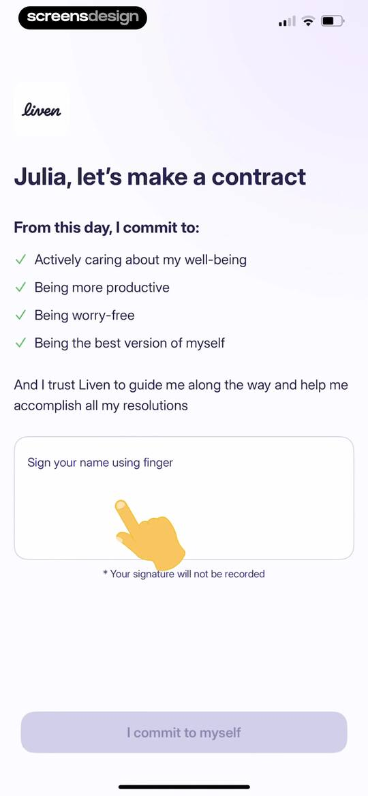
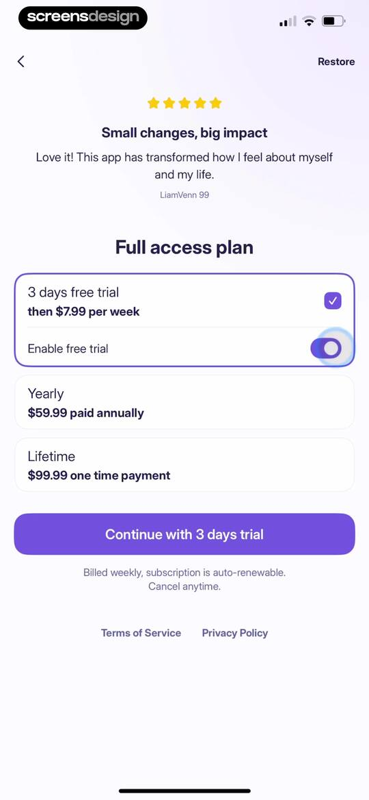
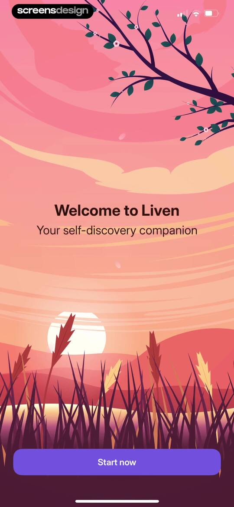
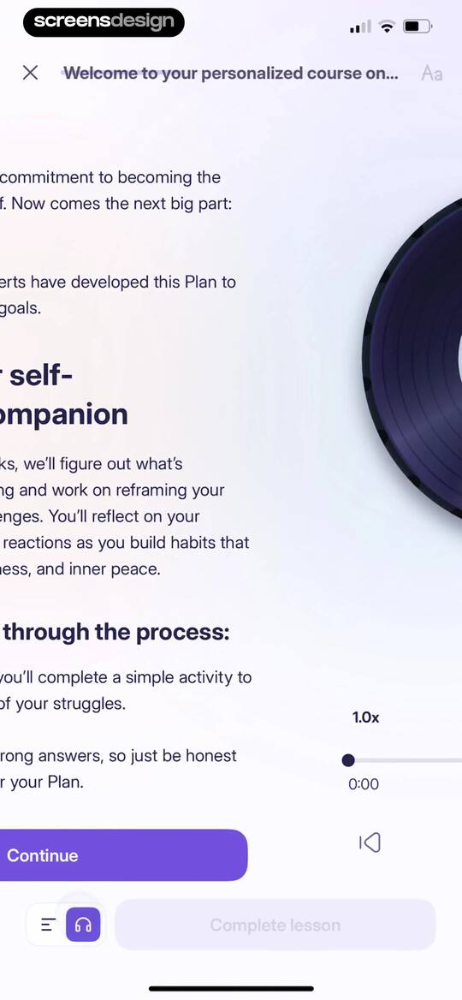
