# Loóna: Sleep, reduce anxiety Onboarding, Paywall & UX Flow — 93 Screens, $14k/mo

Source: https://screensdesign.com/apps/loona-sleep-reduce-anxiety/ (fetched 2026-10-05)

Stats: 

| # | Time | Image | What the screen shows |
|---|---|---|---|
| 1 | 00:00 |  | Splash screen for the Loóna app featuring the brand name centered in white text on a dark background. |
| 2 | 00:09 | 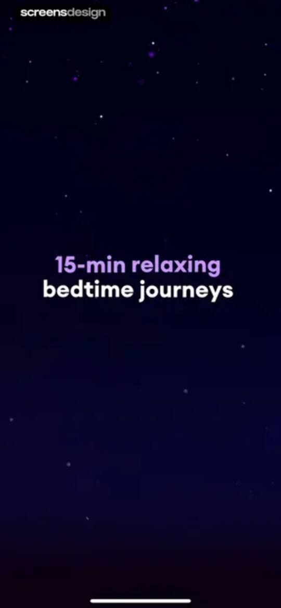 | Loóna onboarding screen featuring a dark starry background and centered text about 15-minute relaxing bedtime journeys. |
| 3 | 00:15 | 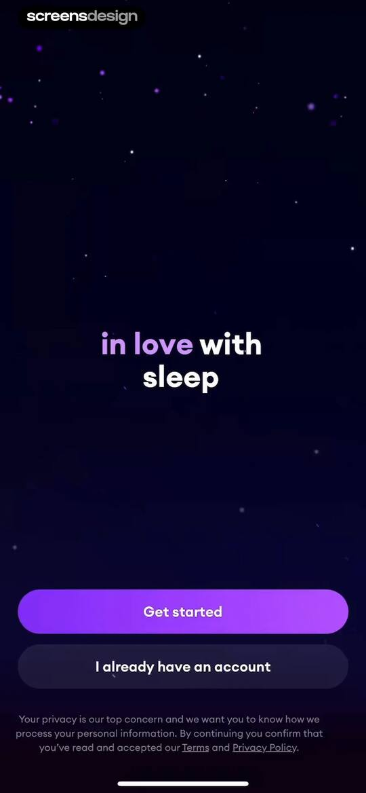 | Onboarding welcome screen with a dark background, centered title, Get started button, account sign-in option, and privacy footer. |
| 4 | 00:25 | 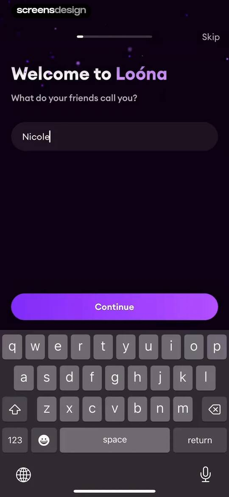 | Loóna onboarding name entry screen with the name Nicole filled in the input field and a Continue button. |
| 5 | 00:29 | 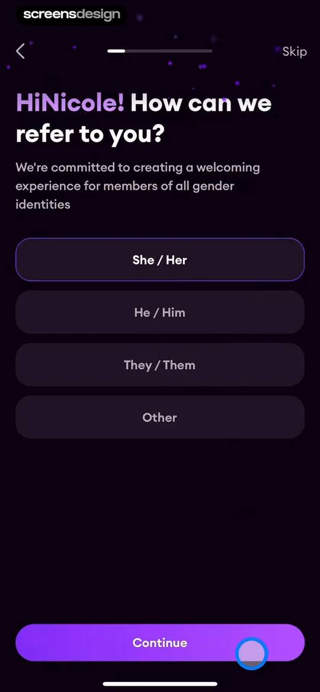 | Onboarding screen asking for preferred pronouns with a vertical list of options and a disabled Continue button. |
| 6 | 00:34 | 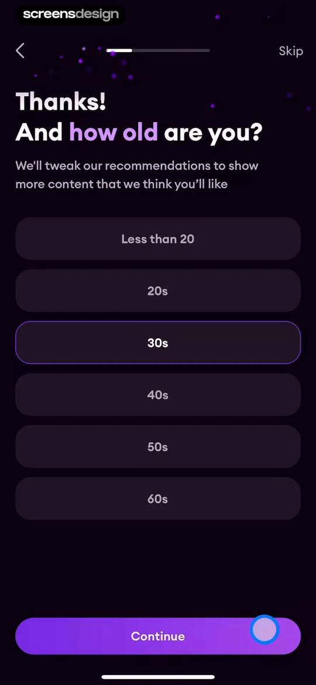 | Onboarding age selection screen with the 30s option selected, a Continue button, and a Skip button at the top. |
| 7 | 00:36 | 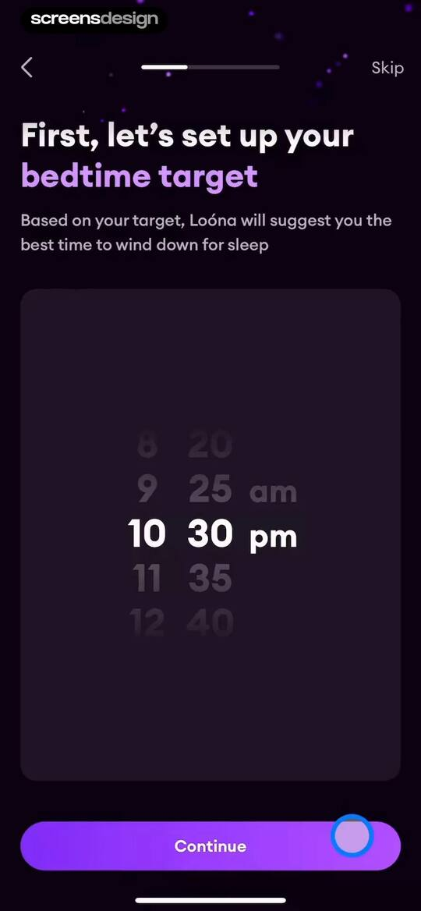 | Onboarding bedtime setup screen with a central time picker showing 10:30 pm and a Continue button. |
| 8 | 00:38 |  | Loóna app onboarding screen requesting notification permissions, featuring a bedtime target setup context and a Continue button. |
| 9 | 00:42 | locked | Loóna onboarding goal selection screen with three options selected and a Continue button. |
| 10 | 00:45 | locked | Onboarding screen featuring a central illustration of a tangled mind, descriptive text about a wandering mind, and a Continue button. |
| 11 | 00:49 | locked | Loóna onboarding screen with a bedroom illustration, sleep plan text, and a Personalize my plan button on a dark background. |
| 12 | 00:56 | locked | Onboarding content preference screen asking what helpful night-time content to find, with four selected options and a Continue button. |
| 13 | 01:02 | locked | Onboarding preference selection screen with multiple selectable content scenarios, three selected options, and a Continue button. |
| 14 | 01:08 | locked | Onboarding color selection screen prompting users to choose three or more favorite colors, featuring a grid of color swatches and a Continue button. |
| 15 | 01:15 | locked | Onboarding preference selection screen with narrative categories, with Realistic, Fairy-tale, and Sentimental selected and a Continue button. |
| 16 | 01:20 | locked | Loóna onboarding survey asking how the user heard about the app, with Online ad selected and a Continue button. |
| 17 | 01:48 | locked | Onboarding personalization progress screen showing setup steps, an 80% progress bar, and a user testimonial card at the bottom. |
| 18 | 02:05 | locked | Loóna app onboarding completion screen with a personalized greeting, a list of four completed setup steps, and a Start my escape button. |
| 19 | 02:10 | locked | Loóna subscription paywall comparing 12-week and 12-month plans with a user testimonial, annual plan selected, and a Continue button. |
| 20 | 02:16 | locked | Subscription paywall screen for the Loóna app featuring a vertical timeline of trial steps and a Start free button. |
| 21 | 02:32 | locked | Loóna subscription success screen confirming Loóna PLUS membership with a congratulatory message and a Continue button. |
| 22 | 02:37 | locked | Gift card sharing screen with an iOS share sheet overlaying a Loóna Plus membership preview and a list of sharing options. |
| 23 | 02:40 | locked | Gift card interface for a 1-month Loóna Plus membership with a remaining balance indicator and a Send gift card button. |
| 24 | 02:51 | locked | Email collection modal with a reminder about a free trial, a pre-filled email address, and a Continue button. |
| 25 | 02:55 | locked | Home screen featuring daily sleep picks, a central card for a 15-minute coloring activity, and a Play & Color button. |
| 26 | 02:59 | locked | Loading screen for the Loóna app displaying 99% progress, a central 3D illustration of a building at night, and a sleep tip at the bottom. |
| 27 | 03:07 | locked | Loóna app sleepscape screen featuring an interactive 3D model, progress at 0%, and a welcome message against a dark purple background. |
| 28 | 03:15 | locked | Sleep relaxation app screen showing an auto-coloring mode modal over a central 3D diorama of an ancient structure. |
| 29 | 03:35 | locked | Interactive relaxation screen displaying a 3D diorama with glowing paper lanterns against a dark purple background, accompanied by the text Wonderful! |
| 30 | 04:12 | locked | Loóna app interactive 3D coloring scene featuring a pagoda model, glowing lanterns, an instruction card at the top, and a text caption at the bottom. |
| 31 | 04:18 | locked | Pause menu overlay with centered text buttons including Continue, Restart, and Save and exit over a dark background. |
| 32 | 04:28 | locked | Educational modal explaining the wake-up alarm feature in the Loóna app, with instructions to switch the toggle before bed and a Got it button. |
| 33 | 04:32 | locked | App rating prompt modal over a dark alarm settings background, featuring star rating icons and Cancel and Submit buttons. |
| 34 | 04:40 | locked | Alarm settings modal showing a wake-up alarm set for 8:00am with an active toggle and a countdown timer. |
| 35 | 04:43 | locked | Modal confirmation dialog stating the alarm is now set, with a Got it button over the main app interface. |
| 36 | 04:45 | locked | Home screen featuring a featured sleep story card for The Dragon's Shrine at twenty-four percent progress with a Continue button and a category filter list. |
| 37 | 04:49 | locked | Home screen of a sleep and relaxation app featuring daily personalized pick cards, a featured music card with a Listen button, and category tags. |
| 38 | 04:55 | locked | Home screen featuring a daily picks carousel, an exclusive music card with a Listen button, and a persistent mini-player with playback controls. |
| 39 | 04:56 | locked | Media player screen for the ambient track Elven Toy Factory, showing a top liked notification, central artwork card, and playback controls. |
| 40 | 05:02 | locked | Sleep timer modal bottom sheet listing duration options with Off selected and a Done button. |
| 41 | 05:09 | locked | Loading screen in the Loóna app at 90% progress, displaying a central guitar illustration and a helpful relaxation tip. |
| 42 | 05:16 | locked | Onboarding screen featuring a 3D acoustic guitar on a stand against a dark background, with a one percent progress bar and a welcome label. |
| 43 | 05:47 | locked | Interactive 3D scene from the Loóna app showing a guitar on a platform with 10% progress and a Reveal the floor button. |
| 44 | 06:02 | locked | Editor screen featuring a 3D acoustic guitar scene with an active auto coloring mode notification and bottom narrative text. |
| 45 | 06:19 | locked | Pause menu overlay with a centered list of action buttons and a dark background featuring an acoustic guitar. |
| 46 | 06:31 | locked | Music for sleep list featuring soothing tracks, social proof of listening users, and playback controls with a track currently playing. |
| 47 | 06:41 | locked | Audio library listing relaxing nature soundscapes with active user counts and play buttons for each card. |
| 48 | 06:57 | locked | Content feed displaying a list of soothing lullabies with active listener counts and play buttons for each audio track. |
| 49 | 07:11 | locked | Content detail page featuring an immersive sleep story with a Play and Color button, music section, and persistent mini-player on a dark background. |
| 50 | 07:16 | locked | Content feed displaying details for On the Shores of Lake Como with a Play and Color button, a music section, and a top toast notification. |
| 51 | 07:29 | locked | Music library screen with an ambient sounds informational modal, a random play section, a track list, and a persistent player bar. |
| 52 | 07:39 | locked | Home screen featuring a magical tree illustration, a 5-minute relaxation session prompt, and a media player card at the bottom. |
| 53 | 07:46 | locked | Audio track list for Nature ambience featuring seven soundscape cards with play buttons and a listener count. |
| 54 | 07:47 | locked | Home screen featuring a sleep goal message, a carousel of nature and night sound cards, and a list of nighttime audio journeys with a dark theme. |
| 55 | 07:51 | locked | Loóna home screen featuring a promotional gift card offer for a one-month membership and a continue button. |
| 56 | 07:55 | locked | Content feed screen featuring a mood selection grid, a featured shorts carousel, and a persistent bottom player. |
| 57 | 08:04 | locked | Content feed displaying sleep escape cards and a persistent media player at the bottom, with the Escapes tab selected. |
| 58 | 08:08 | locked | Content detail screen for Sweet Dreams Inc. with a hero illustration, duration, Play & Color button, and bottom mini-player. |
| 59 | 08:19 | locked | Content feed displaying chapter sections with horizontal sleep story cards, a bottom mini-player, and the Escapes tab selected. |
| 60 | 08:31 | locked | Modal overlay featuring three stacked action cards, including an alarm management option to turn off the Loóna alarm. |
| 61 | 08:32 | locked | Loóna alarm settings screen displaying a wake-up time of 8:00am, an active toggle, and a countdown of seven hours and twelve minutes. |
| 62 | 08:39 | locked | Onboarding screen asking how the user is feeling, with circular mood selectors, the happy option selected, and a Continue button. |
| 63 | 08:44 | locked | Onboarding screen prompting the user to describe feeling intensity, with the Somewhat option selected in a horizontal indicator row and a Continue button. |
| 64 | 08:48 | locked | Onboarding screen asking if you feel like falling asleep now, with a sleep readiness slider and a Continue button. |
| 65 | 08:57 | locked | Self-assessment hub dashboard featuring a recommended Circadian Type test card and a list of secondary assessment cards like Sleep and Anxiety. |
| 66 | 09:00 | locked | Sleep schedule onboarding screen with an educational disclaimer and a Take a test button. |
| 67 | 09:02 | locked | Onboarding screen asking for preferred wake-up time, featuring a progress indicator and a vertical list of time range selection buttons. |
| 68 | 09:08 | locked | Onboarding survey asking about morning energy levels, with the Fairly-tired option selected among four choices. |
| 69 | 09:11 | locked | Onboarding screen asking when you feel tired, with five time range options and the 10:15 - 12:45am option selected. |
| 70 | 09:13 | locked | Onboarding screen asking about peak mental performance time, with the 5 - 10pm option selected from a vertical list of time ranges. |
| 71 | 09:18 | locked | Onboarding question asking users to identify their chronotype, with four selection buttons and the evening-type option selected. |
| 72 | 09:30 | locked | Loading screen showing Analyzing your responses with a central checkmark icon and a dark purple theme. |
| 73 | 09:31 | locked | Circadian rhythm test result screen displaying a Definitely Evening result with an illustration and Continue button. |
| 74 | 09:36 | locked | Self-assessment hub in Loóna featuring a recommended Circadian Type test with a Take a test button and a list of wellness tests. |
| 75 | 09:40 | locked | Onboarding screen asking What type of sleeper are you with a Take a test button and an educational disclaimer. |
| 76 | 09:42 | locked | Onboarding survey question about bedtime routines with five selectable agreement options ranging from strongly disagree to strongly agree. |
| 77 | 10:13 | locked | Onboarding result screen displaying an Easy sleeper profile with advice, a share button, and a Continue button. |
| 78 | 10:16 | locked | Self-assessment hub dashboard with a featured Circadian Type recommendation card, Take a test button, and a list of available wellness tests. |
| 79 | 10:21 | locked | Stories content feed with horizontal category cards, a vertical list of immersive story cards, and a bottom navigation bar. |
| 80 | 10:28 | locked | Content feed displaying lists of immersive audio stories in cards, with a persistent mini-player and bottom navigation. |
| 81 | 10:35 | locked | Stories feed showing explore category cards, immersive story collections with play buttons, a persistent player bar, and a bottom navigation bar with the Stories tab selected. |
| 82 | 10:37 | locked | Stories content feed with categorized audio cards and a persistent mini-player above the bottom navigation bar. |
| 83 | 10:49 | locked | Home screen displaying a list of audio story cards with a top toast notification confirming a favorite addition and a mini-player above the bottom navigation bar. |
| 84 | 10:54 | locked | Music content feed in dark mode featuring category cards, a Play random button, and a list of audio tracks. |
| 85 | 10:57 | locked | Liked music feed featuring a single track card for Baubles in the breeze with a play button. |
| 86 | 11:06 | locked | Music library screen displaying a list of relaxing tracks, a play random action, and a persistent mini-player with playback controls. |
| 87 | 11:23 | locked | Content feed displaying a scrollable list of ambient music tracks with a top toast notification and a persistent mini-player at the bottom. |
| 88 | 11:26 | locked | Content feed displaying a vertical list of recently played audio cards under a Today header, featuring a dark theme and play buttons. |
| 89 | 11:28 | locked | Recent content screen displaying a vertical list of four relaxation and sleep cards with a close button at the top left. |
| 90 | 11:34 | locked | Dashboard with a user greeting, mindful minutes stat, and a promotional card for gifting a one-month membership with a Continue button. |
| 91 | 11:41 | locked | Empty state screen for user favorites in the Loóna app, showing the Escapes tab selected and a message indicating no favorites yet. |
| 92 | 11:43 | locked | Favorites screen displaying an immersive stories list with the Mysteries of the Desert item and a heart icon in dark mode. |
| 93 | 11:46 | locked | Settings screen with grouped categories for health, escapes, and privacy, featuring toggles, volume sliders, and a back button. |

## Free showcase screenshots (unordered)

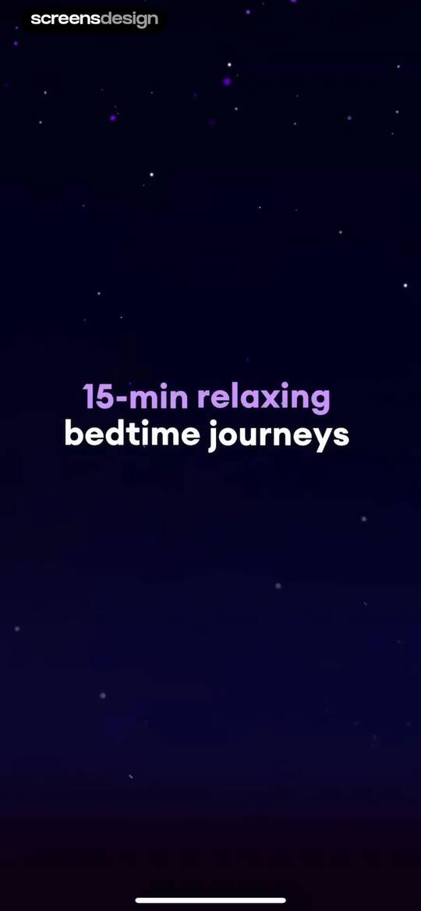
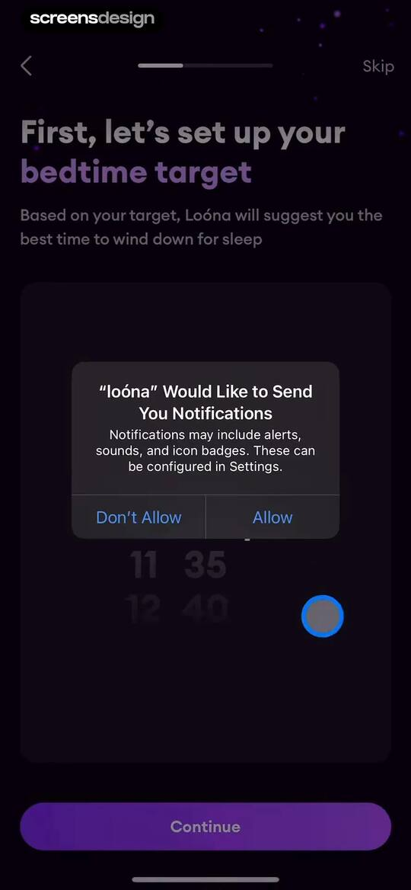
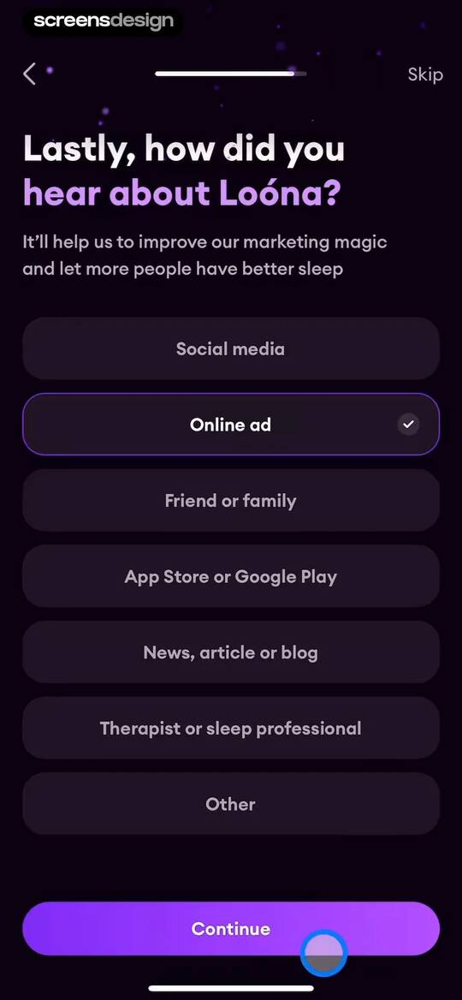
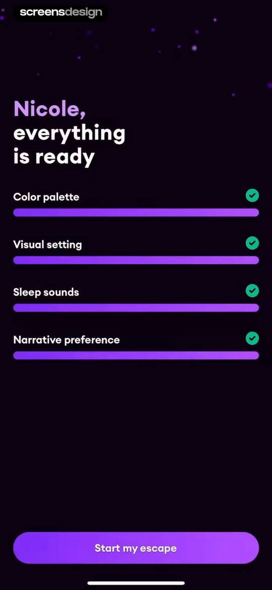
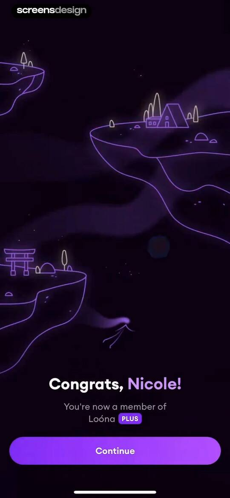
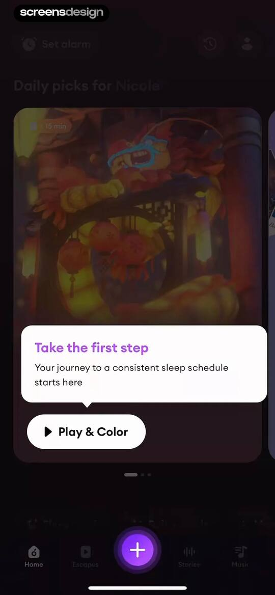
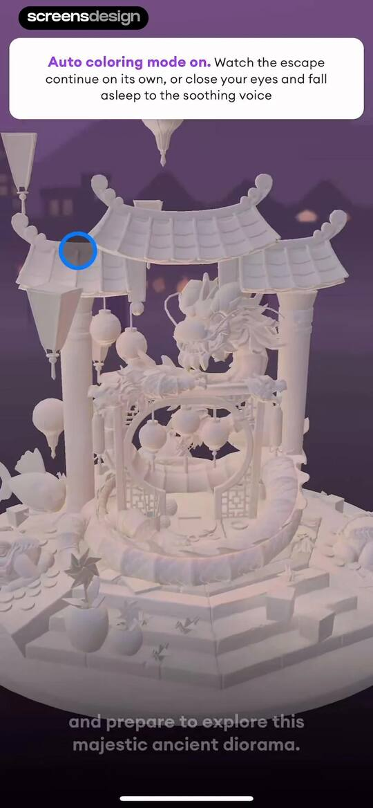
