# Lose It! – Calorie Counter Onboarding, Paywall & UX Flow — 261 Screens, $1M/mo

Source: https://screensdesign.com/apps/lose-it-calorie-counter/ (fetched 2026-10-05)

Stats: 

| # | Time | Image | What the screen shows |
|---|---|---|---|
| 1 | 00:00 | 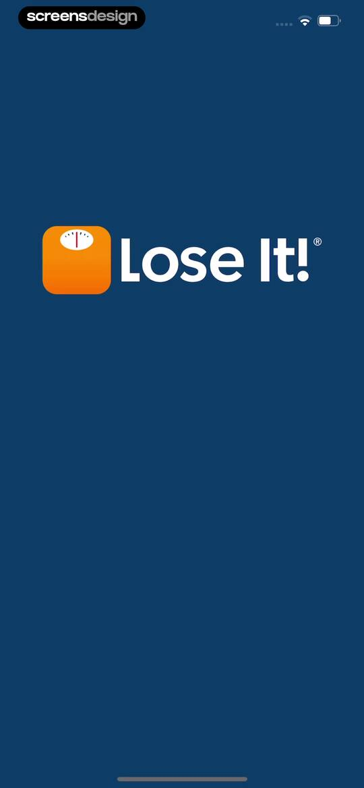 | Splash screen for the Lose It! app featuring the centered brand logo against a solid deep navy blue background. |
| 2 | 00:02 | 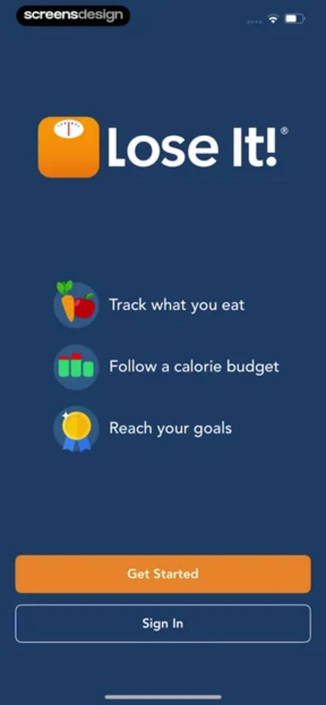 | Lose It! onboarding screen displaying three core features with icons, a Get Started button, and a Sign In button on a dark background. |
| 3 | 00:05 | 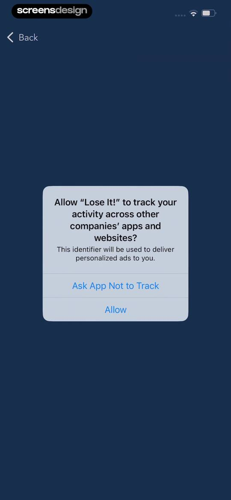 | App tracking transparency permission modal asking to track activity for personalized ads, with Allow and Ask App Not to Track buttons. |
| 4 | 00:07 | 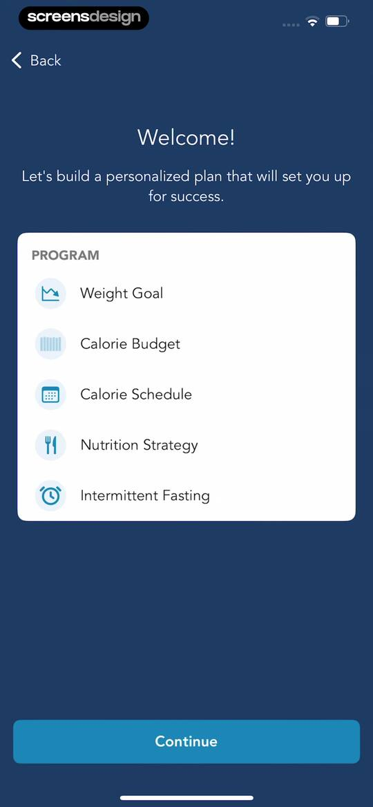 | Onboarding screen outlining a personalized plan with five program components and a Continue button. |
| 5 | 00:11 | 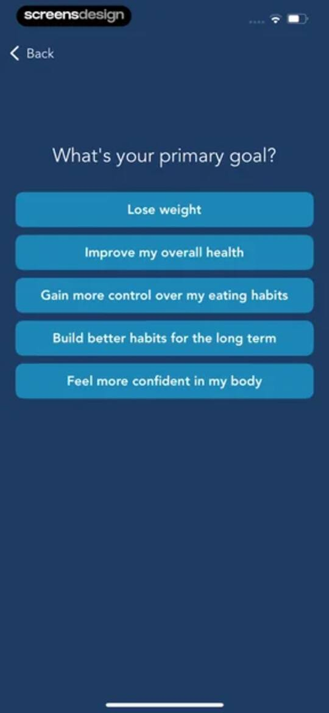 | Onboarding screen asking for the user's primary goal with a vertical stack of five selection buttons on a dark background. |
| 6 | 00:13 | 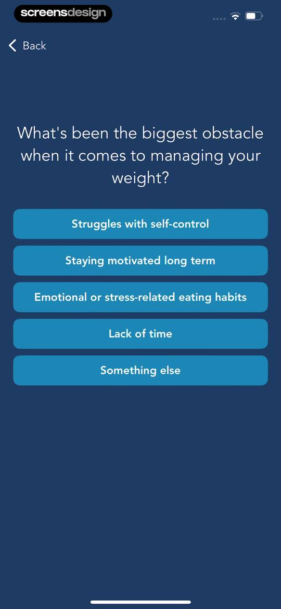 | Onboarding screen asking about weight management obstacles, featuring a vertical list of selectable options including self-control and motivation. |
| 7 | 00:14 | 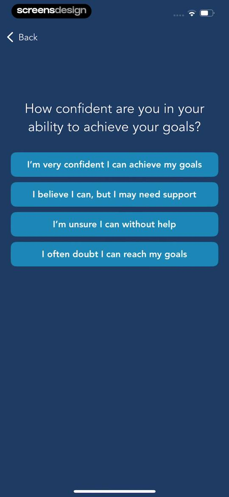 | Onboarding questionnaire screen asking about goal confidence with a vertical list of four selectable answer buttons. |
| 8 | 00:16 | 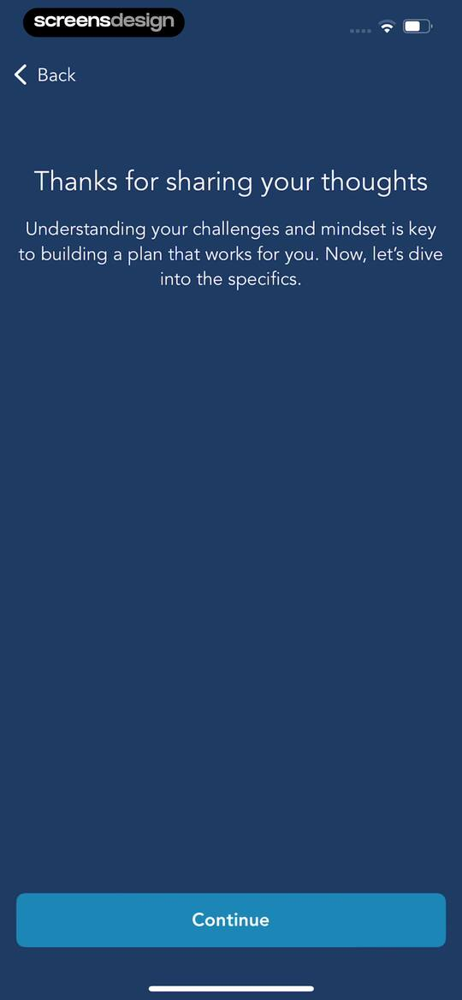 | Lose It app onboarding screen with a thank you message, explanatory text about building a personalized plan, and a Continue button. |
| 9 | 00:18 | locked | Onboarding screen for setting a weight goal, displaying a program selection list with Weight Goal selected and a Continue button. |
| 10 | 00:26 | locked | Onboarding weight input screen with a scrolling picker, kilograms selected as the unit, and a Next button. |
| 11 | 00:29 | locked | Onboarding screen prompting the user to set their goal weight, featuring explanatory text and a Continue button. |
| 12 | 00:33 | locked | Lose It! onboarding screen asking for goal weight, featuring a weight picker set to 50.5 kg with a unit toggle and Next button. |
| 13 | 00:35 | locked | Onboarding summary screen showing a personalized weight loss program list with five plan steps and a Continue button. |
| 14 | 00:37 | locked | Onboarding program summary screen displaying a calorie budget list with a highlighted item and a Continue button. |
| 15 | 00:39 | locked | Onboarding screen asking if you have counted calories before, with a centered illustration and Yes and No buttons. |
| 16 | 00:43 | locked | Onboarding screen asking how the user last counted calories, with a vertical list of four options. |
| 17 | 00:46 | locked | Lose It! onboarding screen highlighting app features and benefits, with a heading and a Continue button. |
| 18 | 00:48 | locked | Onboarding screen asking if the user wants a calorie counting refresher, with Yes, please! and No, thanks buttons. |
| 19 | 00:50 | locked | Onboarding screen explaining the simple math of weight loss with a central illustration and a Continue button. |
| 20 | 00:52 | locked | Onboarding screen explaining the two-step calorie budget calculation process, with a Continue button at the bottom. |
| 21 | 00:53 | locked | Onboarding screen introducing personal data collection for calorie estimation, with step one instructions and a Continue button. |
| 22 | 01:04 | locked | Onboarding screen asking for the user's birthday with a date picker and a Next button. |
| 23 | 01:09 | locked | Onboarding height input screen with a picker set to 5 feet and 0 inches, a unit toggle for ft/in and cm, and a Next button. |
| 24 | 01:11 | locked | Onboarding screen prompting the user to select their gender from four vertical buttons. |
| 25 | 01:13 | locked | Onboarding screen explaining the daily calorie burn calculation with a central calculator illustration and a Continue button. |
| 26 | 01:17 | locked | Onboarding screen asking about weight loss medications with a clipboard illustration and four vertical selection buttons. |
| 27 | 01:19 | locked | Onboarding screen explaining the weight loss plan selection process, with explanatory text about plan trade-offs and a Continue button. |
| 28 | 01:21 | locked | Onboarding screen recommending the Relaxed weight loss plan, displaying calorie and timeline details with a Select button. |
| 29 | 01:23 | locked | Weight loss plan selection screen displaying the Steady plan card with a not recommended badge and a select button. |
| 30 | 01:24 | locked | Onboarding screen displaying a weight loss plan card with a Not Recommended badge and a Select button. |
| 31 | 01:26 | locked | Onboarding screen displaying the Vigorous weight loss plan card with a not recommended badge, calorie details, and a Select button. |
| 32 | 01:29 | locked | Fitness app onboarding screen displaying a budget of 1,239 calories with a flame icon and a Continue button. |
| 33 | 01:31 | locked | Lose It! onboarding screen asking if the user plans to exercise during weight loss, featuring an illustration of a kettlebell and water bottle with two option buttons. |
| 34 | 01:34 | locked | Fitness app onboarding screen asking about exercise plans with a vertical list of four selection buttons and a back button. |
| 35 | 01:36 | locked | Onboarding screen explaining exercise benefits for weight loss, featuring an illustration and a Continue button. |
| 36 | 01:38 | locked | Onboarding program summary screen displaying personalized weight loss goals, daily calorie targets, and a Continue button. |
| 37 | 01:40 | locked | Program selection screen for adding a calorie schedule with options like weight loss goals and a Continue button. |
| 38 | 01:42 | locked | Onboarding screen prompting the user to pick high calorie days from a vertical list of four options. |
| 39 | 01:44 | locked | Calorie scheduling onboarding screen displaying weekday and weekend calorie breakdowns with options to apply the schedule or continue without it. |
| 40 | 01:46 | locked | Onboarding success screen confirming the calorie schedule has been applied, featuring a calendar icon and a Continue button. |
| 41 | 01:49 | locked | Onboarding summary screen displaying a customized weight loss program with target metrics, calorie goals, and a Continue button. |
| 42 | 01:50 | locked | Onboarding program summary screen displaying weight loss goals and nutrition details in a white card with a Continue button. |
| 43 | 01:52 | locked | Onboarding questionnaire screen asking about current eating habits with a top illustration and four sentiment selection buttons. |
| 44 | 01:54 | locked | Onboarding questionnaire screen displaying a behavioral question about temptation and four vertical selection buttons for user response. |
| 45 | 01:56 | locked | Onboarding survey asking what is most important when it comes to food, with a vertical list of five priority selection buttons. |
| 46 | 01:57 | locked | Onboarding question about food habits with a centered plate icon and four selection buttons ranging from often to never. |
| 47 | 01:59 | locked | Onboarding questionnaire screen asking how the user feels after most meals, with a vertical list of four answer choices. |
| 48 | 02:01 | locked | Onboarding screen asking whether the user is interested in watching nutrition, with two stacked buttons to opt in or focus only on calories. |
| 49 | 02:03 | locked | Nutrition onboarding screen inviting users to find their recommended strategy or browse all strategies with two action buttons. |
| 50 | 02:05 | locked | Onboarding screen asking for the user's most important goal, featuring three selection buttons for losing weight, improving health, or getting stronger. |
| 51 | 02:07 | locked | Onboarding question about past weight loss history with three response options and a back button. |
| 52 | 02:09 | locked | Onboarding question asking about past eating styles, with Yes and No selection buttons on a dark blue background. |
| 53 | 02:10 | locked | Lose It! onboarding survey screen asking if the user's eating style felt sustainable, with Yes and No options. |
| 54 | 02:12 | locked | Onboarding screen explaining the role of nutrition in weight loss, featuring an educational text block and a Continue button. |
| 55 | 02:14 | locked | Onboarding screen asking about typical fiber intake, featuring a pear illustration and three selection buttons. |
| 56 | 02:16 | locked | Onboarding survey asking about protein intake habits, featuring a salmon illustration and three stacked selection options. |
| 57 | 02:18 | locked | Onboarding screen asking about saturated fat intake frequency with a bacon illustration and three selection buttons. |
| 58 | 02:20 | locked | Onboarding strategy reveal screen featuring a drum illustration, anticipation text, and a See my Recommended Strategy button against a dark blue background. |
| 59 | 02:22 | locked | Nutrition strategy onboarding screen recommending the Balanced plan, featuring two selection cards for Balanced and High Satisfaction, and a browse button. |
| 60 | 02:24 | locked | Nutrition strategy detail screen displaying protein, carbohydrate, and fat targets, with an Apply this strategy button. |
| 61 | 02:27 | locked | Program summary screen displaying weight loss goals, calorie targets, and dietary strategy inside a white card with a Continue button. |
| 62 | 02:29 | locked | Onboarding program selection screen with a list of health goals and the Intermittent Fasting option selected, alongside a Continue button. |
| 63 | 02:31 | locked | Lose It! app onboarding screen explaining intermittent fasting methods and asking if the user wants to add fasting to their program, with two action buttons. |
| 64 | 02:33 | locked | Onboarding screen asking the user to choose a fasting style, with options for Traditional Fasting and Reduce Evening Snacking. |
| 65 | 02:36 | locked | Onboarding screen asking to choose a fasting schedule, featuring a vertical list of options ranging from twelve to eighteen hours and a custom selection button. |
| 66 | 02:40 | locked | Onboarding screen asking what days of the week to start a fast, with Wednesday and Thursday selected and a Continue button. |
| 67 | 02:48 | locked | Fasting setup screen with a time picker set to 8:00 AM, a Next button, and a dark theme. |
| 68 | 02:50 | locked | Permission screen asking whether to receive fasting notifications, with a vertical stack of four preference options. |
| 69 | 02:52 | locked | Permission request screen in the Lose It! app asking the user to enable notifications for fasting reminders, with a Next button. |
| 70 | 02:54 | locked | Program summary onboarding screen displaying weight loss goals, calorie targets, and nutrition strategy within a white card and a Continue button. |
| 71 | 02:56 | locked | Onboarding screen prompting user reflection on strengths and challenges with a lightning bolt icon and a Continue button. |
| 72 | 02:57 | locked | Onboarding questionnaire screen asking how the user views challenges, displaying a vertical stack of four selection buttons with a dark theme. |
| 73 | 02:59 | locked | Onboarding questionnaire asking how you handle unexpected changes, with four selectable response buttons. |
| 74 | 03:01 | locked | Onboarding questionnaire asking about decision-making confidence with four selectable response buttons. |
| 75 | 03:02 | locked | Onboarding questionnaire screen asking how the user responds to setbacks, featuring a vertical list of four selection buttons. |
| 76 | 03:04 | locked | Onboarding questionnaire screen asking how the user manages stress, with a vertical list of four selection options. |
| 77 | 03:05 | locked | Onboarding questionnaire asking how you handle difficult situations, with a vertical list of four selectable coping strategy buttons. |
| 78 | 03:07 | locked | Onboarding screen announcing readiness to project the user's goal date, with a central lightning bolt illustration and a Continue button. |
| 79 | 03:10 | locked | Loading screen with the message Generating Your Custom Plan and a 4.8 star rating from the app store framed by laurel graphics. |
| 80 | 03:13 | locked | Onboarding loading screen generating a custom plan with statistics for over 60 million foods and 56 million members. |
| 81 | 03:16 | locked | Loading screen displaying Generating Your Custom Plan with a kettlebell graphic and social proof of 150 Million+ pounds lost. |
| 82 | 03:20 | locked | Lose It! app onboarding success screen announcing that the personalized health plan is ready, featuring a gold medal and motivational message. |
| 83 | 03:22 | locked | Onboarding completion screen summarizing a weight loss program with goal details and a Save my program button. |
| 84 | 03:38 | locked | Lose It! account creation screen with an email field, legal consent checkboxes, an orange Create Account button, and a Sign up with Apple button. |
| 85 | 03:42 | locked | Paywall screen featuring a meal photo camera viewfinder, a no payment due trust signal, and a Continue For Free button. |
| 86 | 03:47 | locked | Paywall screen with a headline and food diary mockup in the background, featuring a No Payment Due Now trust signal and Continue For Free button. |
| 87 | 03:55 | locked | Subscription onboarding screen featuring a trial reminder illustration, trust signals about no immediate payment, and a Continue For Free button. |
| 88 | 03:59 | locked | Paywall screen outlining a seven-day free trial timeline, pricing details of thirty-nine dollars and ninety-nine cents per year, and a Start Free Trial button. |
| 89 | 04:04 | locked | Paywall screen offering a 7-day free trial followed by an annual subscription of $39.99, featuring user testimonials, an FAQ section, and a Start Free Trial button. |
| 90 | 04:11 | locked | App Store subscription confirmation modal for Lose It! Premium displaying a one-week free trial and annual pricing with a side button confirmation prompt. |
| 91 | 04:16 | locked | Subscription paywall with testimonials, an FAQ section, and a purchase success modal with an OK button. |
| 92 | 04:18 | locked | Subscription paywall featuring trial terms, testimonials, an FAQ section, and a prominent start trial button. |
| 93 | 04:22 | locked | Permission request screen for push notifications with a value proposition about weight loss, an orange Turn on notifications button, and a No thanks link. |
| 94 | 04:25 | locked | Permission request screen featuring a system notification prompt to send alerts, with Allow and Don't Allow options. |
| 95 | 04:28 | locked | Calorie tracking dashboard with a modal overlay asking when you last eat, featuring options for Yesterday and Today. |
| 96 | 04:30 | locked | Calorie tracking dashboard displaying a daily budget summary, meal cards, and an overlay prompt to log a meal using the plus button. |
| 97 | 04:32 | locked | Instructional modal overlay on a blurred dashboard prompting the user to select their most recent meal, featuring breakfast, lunch, and dinner buttons. |
| 98 | 04:35 | locked | Food search screen with a top search bar, tab navigation, a list of food items with calorie counts, and an active keyboard. |
| 99 | 04:39 | locked | Food search results for milk showing a vertical list of matching items with calorie counts and a barcode scanner button. |
| 100 | 04:43 | locked | Food logging form for milk showing nutrition facts, verified nutrients, and a serving size picker with an Add button. |
| 101 | 04:49 | locked | Food search screen with a modal overlay asking if you are done adding to the meal, featuring a list of food items and a top Done button. |
| 102 | 04:52 | locked | Calorie tracking dashboard with a central tutorial modal and an End Tutorial button over a daily meal log. |
| 103 | 04:54 | locked | Fitness app dashboard displaying a calorie summary, intermittent fasting card, and a meal log with breakfast, lunch, and dinner sections. |
| 104 | 04:56 | locked | Subscription upsell modal in Lose It! promoting premium features, with a Learn Now button and No Thanks link. |
| 105 | 05:00 | locked | Lose It! premium feature promotion modal with a flag icon, Explore Features button, and No Thanks option. |
| 106 | 05:02 | locked | Onboarding screen explaining smart food logging features, with descriptive text and a View Your Dashboard button at the bottom. |
| 107 | 05:04 | locked | Onboarding screen explaining the dashboard features with a preview card and a Track Your Progress button. |
| 108 | 05:06 | locked | Onboarding tutorial screen explaining goal tracking with a protein intake chart, instructional text, and a bottom One Last Tip button. |
| 109 | 05:08 | locked | Paywall screen promoting meal tracking consistency features, with a progress chart icon, two stacked action buttons, and a close icon. |
| 110 | 05:12 | locked | Calorie counter dashboard showing a daily budget of 1,188, a fasting card with a Start Fast Now button, and a list of meals. |
| 111 | 05:14 | locked | Dashboard with a nutritional metrics modal overlay listing options like calories, macronutrients, and specific nutrient goals. |
| 112 | 05:17 | locked | Form for setting a daily saturated fat goal with an input field showing 13 grams, a help link, and a bottom numeric keypad. |
| 113 | 05:22 | locked | Settings screen displaying saturated fat recommendations across four dietary strategies, a medical disclaimer, and an Edit Nutrition Strategy button. |
| 114 | 05:32 | locked | Calendar view screen displaying a monthly grid of daily progress circles and a top navigation bar with date selection controls. |
| 115 | 05:53 | locked | Nutrition dashboard displaying a macronutrient summary, intermittent fasting card, and a meal log list with breakfast, lunch, and dinner sections. |
| 116 | 05:58 | locked | Fasting configuration modal asking when the fast should start, with options for Right now and Today at 8:00 AM. |
| 117 | 06:00 | locked | Health and nutrition safety warning modal in Lose It! with a medical disclaimer about intermittent fasting, featuring an I understand button and a Turn off fasting button. |
| 118 | 06:03 | locked | Health and nutrition dashboard displaying daily calorie totals, an active intermittent fasting countdown timer with an End Fast Now button, and a meals list. |
| 119 | 06:06 | locked | Dashboard screen showing a calorie summary and an intermittent fasting card with a modal overlay for editing the fasting start time and a Save button. |
| 120 | 06:14 | locked | Dashboard screen showing a daily calorie summary, intermittent fasting progress, and meal list with breakfast logged. |
| 121 | 06:16 | locked | Calorie counter dashboard showing a daily budget summary, intermittent fasting card with an active schedule menu, and meal sections with food logging options. |
| 122 | 06:18 | locked | Fasting settings modal in the Lose It app summarizing current schedule details with an Edit fasting settings button. |
| 123 | 06:21 | locked | Fasting settings screen displaying options to edit schedule details like length and start time, along with controls to edit everything or turn off fasting. |
| 124 | 06:23 | locked | Onboarding screen asking for a fasting schedule, featuring a vertical list of uniform selection buttons for various time windows. |
| 125 | 06:25 | locked | Fasting schedule confirmation screen displaying 12-hour length and start time, with a submit button and modify option. |
| 126 | 06:31 | locked | Dashboard with calorie and intermittent fasting summaries, displaying a confirmation modal to disable intermittent fasting with Cancel and Disable buttons. |
| 127 | 06:38 | locked | Food search and logging screen with a search bar, action buttons for voice, scan, and photo input, and a list of lunch food items with calorie counts. |
| 128 | 06:41 | locked | Speech recognition permission modal asking to access speech recognition for voice logging, with Don't Allow and Allow buttons. |
| 129 | 06:43 | locked | Microphone permission prompt for Lose It! requesting access for voice food tracking, featuring Allow and Don't Allow buttons. |
| 130 | 06:46 | locked | Voice recording screen displaying listening status with a central stop button and instructions for logging food intake. |
| 131 | 06:52 | locked | Loading screen showing the text Analyzing... and Two large eggs with a circular loading indicator in the Lose It app. |
| 132 | 06:53 | locked | Voice log editor showing lunch summary with a logged food item card, swap, edit, and delete options, and an Add More button. |
| 133 | 07:00 | locked | Camera permission request modal in the Lose It! app, explaining access is needed for scanning barcodes and photos, with Allow and Don't Allow buttons. |
| 134 | 07:03 | locked | Barcode scanner interface with a central camera viewfinder frame, an analyzing status, and instructions to center the barcode. |
| 135 | 07:05 | locked | Food logging form displaying nutrition facts for Fresh Cow's Milk by Nestle and a scrollable amount picker set to 250 Milliliters, with Cancel and Add actions. |
| 136 | 07:19 | locked | Camera capture screen with instructional text to take a photo of your meal, a central viewfinder frame, and a shutter button. |
| 137 | 07:21 | locked | System permission modal from the Lose It! app requesting photo library access, with media count, privacy details, and three stacked action buttons. |
| 138 | 07:24 | locked | Photo library selection screen with a search bar and a grid of photo thumbnails showing food items and other images. |
| 139 | 07:25 | locked | Photo selection screen displaying a preview of a salad bowl with a Cancel button and a Choose button. |
| 140 | 07:38 | locked | Food log editor displaying a list of lunch items totaling 401 calories, with the first item expanded to show edit and delete buttons and a save action at the top. |
| 141 | 07:53 | locked | Food search screen displaying a search bar, category tabs, a list of food items with calorie information, and a keyboard. |
| 142 | 08:01 | locked | Food search screen with an input field for Salad, a scrollable list of food suggestions, an Add button, and a keyboard. |
| 143 | 08:04 | locked | Edit Icon selection screen with a search bar and a scrollable list of food items, showing Salad selected with a checkmark and a Save button. |
| 144 | 08:10 | locked | Edit serving form displaying a summary card for 100 Grams, a bottom picker wheel, and Cancel and Save buttons. |
| 145 | 08:16 | locked | Serving size editor modal with a summary card showing 100 Milliliters, a picker wheel, Cancel, and Save buttons. |
| 146 | 08:25 | locked | Serving size edit form with an orange header, a serving amount input set to 1 Serving, a bottom picker wheel, and Save and Cancel buttons. |
| 147 | 08:32 | locked | New food entry form with detailed nutritional input fields and an enabled community sharing toggle. |
| 148 | 08:34 | locked | New food entry form with a validation error modal stating that calorie information is required. |
| 149 | 08:49 | locked | Recipe creation modal featuring three stacked selection cards for searching ingredients, adding from the web, and pasting ingredients, with a Done button. |
| 150 | 08:56 | locked | New Recipe web import form with a filled URL input field and a Build Recipe button. |
| 151 | 09:02 | locked | Recipe editor displaying the details and ingredient list for Seafood Chowder with a Done button. |
| 152 | 09:05 | locked | Recipe editor showing details for Seafood Chowder with an ingredients list and a Done button. |
| 153 | 09:06 | locked | Recipe editor interface with an ingredient list and a confirmation modal overlay asking to delete an ingredient, with Cancel and Delete buttons. |
| 154 | 09:10 | locked | Recipe editor screen displaying an ingredients list and an open action modal with options to edit, replace, or delete an ingredient. |
| 155 | 09:14 | locked | New Recipe editor showing an ingredient list, an Add Food button, a nutrition summary card with 983 calories, and recipe notes. |
| 156 | 09:17 | locked | Food logging form for Seafood Chowder showing nutrition facts, portion size, and log details with an Add button. |
| 157 | 09:24 | locked | Food search screen with an active search bar, categorized item list, and a floating barcode scanner button above the keyboard. |
| 158 | 09:27 | locked | Food search and logging interface with a search bar, Meals tab selected, breakfast entry for milk, and a barcode scanner button. |
| 159 | 09:28 | locked | Recipe search screen with tabs, displaying the Seafood Chowder item and a Create Recipe option above a barcode scanner button. |
| 160 | 09:31 | locked | Food log dashboard displaying a calorie summary, a list of logged lunch items, an Add Food button, and a Done logging toggle. |
| 161 | 09:38 | locked | Calorie tracking dashboard showing a daily food log with a calorie budget progress bar and meal sections for breakfast and lunch. |
| 162 | 09:41 | locked | Calorie tracking dashboard showing a daily food log with a calorie summary, meal entries, and an open action modal with options like Scan It and Snap It. |
| 163 | 09:46 | locked | Calorie tracker dashboard with a Choose a Friend modal overlay displaying a Share via button and background food log list. |
| 164 | 09:51 | locked | Calorie tracking dashboard with a meal log and a centered iOS share sheet modal overlay. |
| 165 | 09:53 | locked | Health and fitness log dashboard featuring content cards for exercise, notes, and weight, with the Log tab selected in the bottom navigation. |
| 166 | 09:56 | locked | Apps and devices settings screen displaying categorized sections of connectable health apps, wearables, and other devices with a Done button. |
| 167 | 09:58 | locked | Permissions settings screen for Apple Health integration with Lose It! featuring a hero image and toggle switches for food, weight, and workout data. |
| 168 | 10:02 | locked | Health access permission prompt for Lose It! with a scrollable list of enabled health categories and Turn Off All, Allow, and Don't Allow buttons. |
| 169 | 10:08 | locked | Permissions screen requesting Apple Health data access for the Lose It! app, featuring write and read toggles with Allow and Don't Allow buttons. |
| 170 | 10:14 | locked | Permissions request screen for the Lose It! app to read and write Apple Health data, featuring toggles for workouts and Allow and Don't Allow buttons. |
| 171 | 10:26 | locked | Exercise search screen with an active search bar, alphabetical index, and a scrollable list of fitness activities. |
| 172 | 10:30 | locked | Fitness app search screen showing search results for running with the Browse Exercises tab selected and an option to create a new exercise. |
| 173 | 10:32 | locked | Add Exercise form for logging a running session, with inputs for duration, speed, and an Add button. |
| 174 | 10:39 | locked | Exercise speed selection list for running, with 5 mph selected and indicated by a blue checkmark. |
| 175 | 10:53 | locked | Text editor modal for adding a note with the title Add Note, containing a filled input field and a Done button. |
| 176 | 10:58 | locked | Weight entry form with a numeric keypad, displaying the weight value 57.1 kgs, an optional progress photo upload, and a save button. |
| 177 | 11:01 | locked | Weight entry form displaying the value 57.1 kgs and a progress photo option with an open bottom action sheet. |
| 178 | 11:04 | locked | Lose It! photo library selection screen featuring a large grid of photo thumbnails, a search bar, and a Photos tab selected. |
| 179 | 11:06 | locked | Lose It! photo editor displaying a user portrait with a cropping overlay, bottom editing tools, and Cancel and Done buttons. |
| 180 | 11:09 | locked | Weight entry form displaying a logged weight of 57.1 kgs for October 30, a progress photo preview, and a delete button. |
| 181 | 11:13 | locked | Health dashboard displaying an orange header with calorie information and a vertical list of metric cards for weight, water, and steps. |
| 182 | 11:16 | locked | Water intake form displaying a daily goal input of 64 fluid ounces, a help link, a numeric keypad, and cancel and save buttons. |
| 183 | 11:24 | locked | Water intake tracking dashboard featuring a line chart, time range filters with the 1W option selected, an update button, and an empty entries list. |
| 184 | 11:26 | locked | Water intake tracker dashboard displaying today's progress, a central glass graphic, quick-add buttons, and a set goal option. |
| 185 | 11:35 | locked | Water intake form with an orange header, a date navigation row, a fluid ounces input field set to 16, and a numeric keypad. |
| 186 | 11:41 | locked | Water intake tracker dashboard displaying a daily goal of 70 fl oz with quick-add buttons and a progress visualization. |
| 187 | 11:47 | locked | Goal settings screen with starting date, water intake target, log tab visibility toggle, and a delete goal button. |
| 188 | 11:50 | locked | Water intake dashboard displaying a weekly bar chart, daily average, and a list of recent log entries with an update button. |
| 189 | 11:55 | locked | Goals dashboard displaying a weight progress chart with a Record Weight button, journey milestone tracker, and water intake card. |
| 190 | 12:01 | locked | Weight tracking dashboard showing a progress chart, a goal prediction of Sunday, Feb 1, 2026, an Update Your Weight button, and a list of historical weight entries. |
| 191 | 12:03 | locked | Weight tracking dashboard featuring a progress line chart, a time-range selector with 1W selected, an Update Your Weight button, and a photo gallery. |
| 192 | 12:09 | locked | Weight entry form showing a date of October 28, a weight value of 53 kilograms, a progress photo upload area, a delete button, and a numeric keypad. |
| 193 | 12:10 | locked | Weight entry form overlaid with a confirmation dialog asking to delete the weight entry, featuring a red Delete button. |
| 194 | 12:17 | locked | Health app goals dashboard displaying water intake and carbohydrate tracking cards with a time-range selector and a Record Water Intake button. |
| 195 | 12:20 | locked | Goals dashboard displaying a progress chart with time-range tabs and a list of goal categories to set a new goal. |
| 196 | 12:23 | locked | Goal type selection screen listing Body Fat and Water Intake options, with Water Intake currently selected and a cancel button in the top bar. |
| 197 | 12:25 | locked | Health and fitness onboarding form for entering starting body fat percentage, featuring an input field, a numeric keypad, and a Save button. |
| 198 | 12:30 | locked | Goal body fat percentage entry form displaying the value 15 percent, a guidance link, a numeric keypad, and Cancel and Save buttons. |
| 199 | 12:33 | locked | Body fat tracking dashboard displaying a line chart with a single entry of 20 percent, time range selectors, and an Update Your Body Fat button. |
| 200 | 12:41 | locked | Goal selection screen with three options for Exercise Calories, Exercise Minutes, and Steps, featuring a cancel button in the header. |
| 201 | 12:43 | locked | Exercise calorie goal input form showing the current value 1049.2, a help link, a numeric keypad, and Cancel and Save actions. |
| 202 | 12:45 | locked | Analytics screen showing exercise calorie data with a 1W time range selected, a green area chart, and a weekly entries list. |
| 203 | 12:56 | locked | Nutrition dashboard displaying daily macronutrient tracking cards for protein, carbohydrates, and fat, alongside a promotional card for free nutrition coaching. |
| 204 | 12:59 | locked | Promotional modal advertising nutrition coaching with an orange header, service details, and a button to take an insurance quiz. |
| 205 | 13:05 | locked | Health app dashboard displaying four metric cards for protein, carbohydrates, fat, and calories with intake progress rings and weekly bar charts. |
| 206 | 13:07 | locked | Protein analytics screen displaying a weekly bar chart, daily entry list, and a View Protein Insights link. |
| 207 | 13:11 | locked | Nutrition dashboard displaying daily protein, carbohydrate, fat, and calorie progress cards with an open menu for the protein card. |
| 208 | 13:13 | locked | Nutrition dashboard displaying daily progress cards for protein, carbohydrates, fat, and calories with intake amounts and a bottom navigation bar. |
| 209 | 13:17 | locked | Goal settings screen displaying protein details, personalized guidance, dashboard visibility toggle, and a delete goal button. |
| 210 | 13:19 | locked | Goal settings screen displaying protein details and guidance, with a confirmation modal asking if you want to delete your protein goal. |
| 211 | 13:21 | locked | Goal settings screen with a confirmation modal informing the user that changing the goal will switch to a custom strategy, featuring Cancel and Continue buttons. |
| 212 | 13:24 | locked | Goals dashboard featuring a weight progress chart, time range selector, journey milestone card, and a record weight button. |
| 213 | 13:32 | locked | Dashboard screen showing daily calorie summary, macronutrient breakdown, streak and weight cards, and upcoming highlights. |
| 214 | 13:37 | locked | Health dashboard with a date selector, vertical list of metric cards for calories, weight, and water, and a bottom navigation bar. |
| 215 | 13:43 | locked | Step goal settings form displaying the current value 10000 in an input field, a help link, and a numeric keypad with Save and Cancel buttons. |
| 216 | 13:46 | locked | Fitness dashboard displaying an empty step chart with a 1W time range selected and an Update Your Steps button. |
| 217 | 13:48 | locked | Step count input form with an orange top navigation bar, central input field set to zero, and a bottom numeric keypad. |
| 218 | 14:04 | locked | Sleep goal form with a picker wheel set to 8 hours and 0 minutes, featuring Cancel and Save buttons. |
| 219 | 14:10 | locked | Sleep tracking dashboard displaying a nightly average of zero hours, an empty chart, an update action button, and a notice of no recent entries. |
| 220 | 14:15 | locked | Health tracking dashboard featuring grids for goals and food and exercise options, with a close button at the bottom. |
| 221 | 14:30 | locked | Recipe search screen with the Recipes tab selected, showing a search bar, Seafood Chowder result, and Create Recipe button. |
| 222 | 14:37 | locked | Food search results screen with a list of egg items and calorie counts, a search bar at the top, and a keyboard. |
| 223 | 14:40 | locked | Food logging form for a Large Egg showing its nutrition facts card, a quantity picker set to 1 Each, and an Add button. |
| 224 | 14:45 | locked | Fitness app goals dashboard featuring a weight progress chart, journey milestone tracker, and a Record Weight button. |
| 225 | 14:59 | locked | Discover content feed featuring health and lifestyle articles, promotional offers, and tab navigation. |
| 226 | 15:04 | locked | Article view titled 7 Tips for Building Healthy Tracking Habits with author metadata, a hero image, and expert review details. |
| 227 | 15:11 | locked | Article reading screen about fitness tracker accuracy with an open floating options menu showing share and browser actions. |
| 228 | 15:16 | locked | Article sharing screen with an iOS share sheet overlaying an article about healthy tracking. |
| 229 | 15:29 | locked | Content feed displaying the Courses tab with a featured mindset course card and a promotional support card. |
| 230 | 15:34 | locked | Course detail page for Change Your Thinking, Change Your Weight showing lesson information, a $19.99 price tag, a Buy button, and a list of course modules. |
| 231 | 15:37 | locked | Lose It! app onboarding screen introducing a mindset course with a descriptive text block and a Continue button. |
| 232 | 15:40 | locked | Onboarding screen titled Who Is This Course For? detailing the target audience for a weight loss mindset course, with a Continue button. |
| 233 | 15:41 | locked | About the authors screen with circular portraits, biographical text, and a Continue button. |
| 234 | 15:43 | locked | Coach biography screen featuring Catherine Wygal's personal weight loss story, credentials, and a Continue button. |
| 235 | 15:45 | locked | Success story screen featuring a user profile for Hannah Cole, a testimonial about weight loss, and a Continue button. |
| 236 | 15:48 | locked | Biographical profile modal for Sarah Molhan featuring her personal journey and professional background, with a bottom close button. |
| 237 | 15:50 | locked | Course detail screen for Change Your Thinking, Change Your Weight showing purchase pricing, lesson counts, and a curriculum list with a Buy button. |
| 238 | 15:52 | locked | Onboarding screen from the Lose It! app explaining the role of mindset in weight loss, with a Continue button. |
| 239 | 16:01 | locked | Content feed displaying community posts with a welcome card, filter and manage buttons, and a bottom navigation bar. |
| 240 | 16:07 | locked | Filter modal overlay with checkboxes for topics like Popular Posts and Carb-Focused, displayed over a community feed screen. |
| 241 | 16:13 | locked | Comments screen displaying a discussion thread with posts from Kate and Barb, an orange header, and an input bar at the bottom. |
| 242 | 16:17 | locked | Comments screen showing a discussion thread about intermittent fasting with an active text input area and post button at the bottom. |
| 243 | 16:22 | locked | Chat comments screen displaying a list of user comments about intermittent fasting and a fixed bottom input field. |
| 244 | 16:24 | locked | Comment thread with a delete confirmation modal overlaying the bottom of the screen, featuring red Delete and blue Cancel buttons. |
| 245 | 16:29 | locked | Comments screen displaying a discussion thread about intermittent fasting with user comments and a fixed bottom input field. |
| 246 | 16:30 | locked | Report comment modal displaying a list of policy violation reasons centered over a community discussion feed. |
| 247 | 16:33 | locked | Add a comment modal overlaying a community discussion with an optional note text input and a Submit button. |
| 248 | 16:39 | locked | User profile screen for Barb VA with an about section, Send Message and Add Friend buttons, and a list of recently logged foods. |
| 249 | 16:47 | locked | User profile for Kate Nkognito featuring Send Message and Add Friend buttons, with a privacy notice stating the profile details are private. |
| 250 | 16:56 | locked | Fitness social feed screen displaying friend activity updates, a post button, and a bottom navigation bar. |
| 251 | 16:59 | locked | Friends tab social hub featuring a promotional card to join the Losing It Together group and a personal profile list item. |
| 252 | 17:02 | locked | Empty inbox screen with sections for notifications and messages, featuring an orange header and a compose button. |
| 253 | 17:04 | locked | Health app dashboard displaying a user profile header, a weekly calorie bar chart, and a vertical list of program settings. |
| 254 | 17:08 | locked | Lose It! settings screen with an automatic tracking integration carousel, insights lists, data export options, and a personalization section. |
| 255 | 17:15 | locked | Theme selection settings screen displaying vertical cards for Christmas and Hanukkah themes with preview and apply buttons. |
| 256 | 17:30 | locked | Settings screen titled Theme Settings with an Enable Sounds toggle switch inside a card. |
| 257 | 17:37 | locked | Meal settings screen displaying enabled meal categories with toggles and a meal targets section for configuring nutritional metrics. |
| 258 | 17:49 | locked | Reminders settings screen with toggle lists for meals and goals, displaying a centered time selection modal overlay with a save button. |
| 259 | 17:57 | locked | Lose It! settings menu with grouped sections for exercises, preferences, account management, and support. |
| 260 | 17:59 | locked | Application Preferences settings screen with grouped toggle options for food search, logs, other features, and promotions. |
| 261 | 18:06 | locked | About screen for the Lose It! app showing version information, analytics settings, and legal document links. |

## Free showcase screenshots (unordered)

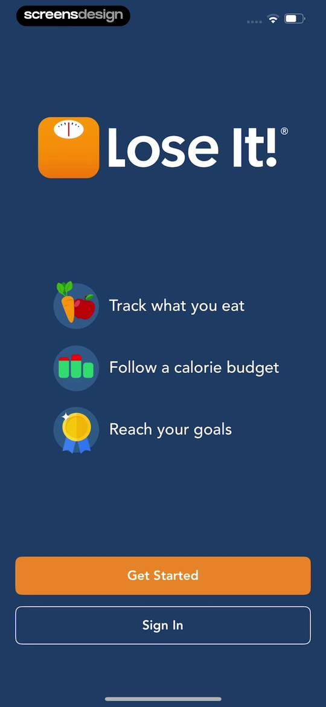
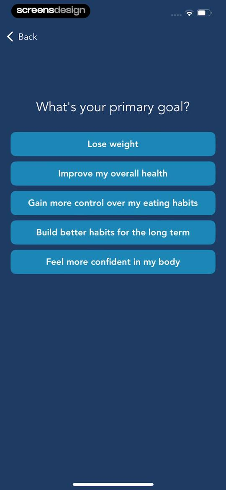
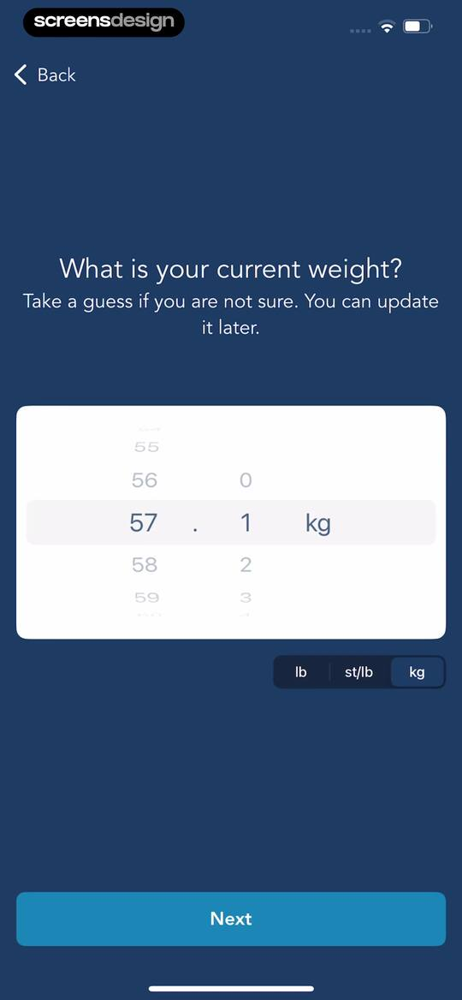
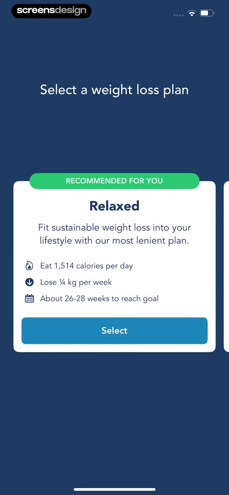
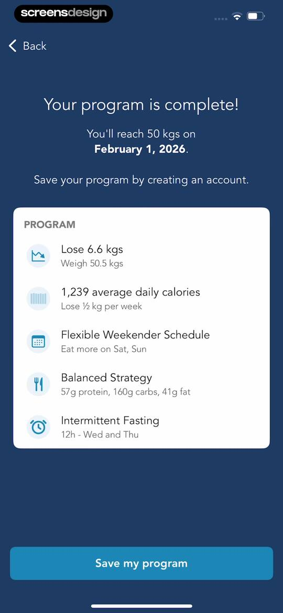
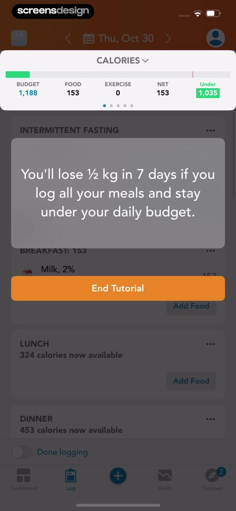
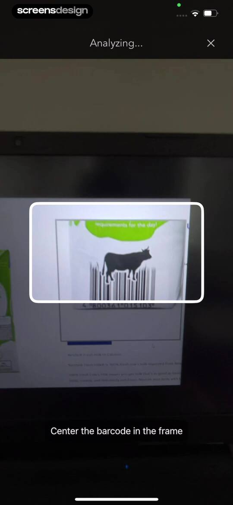
