# Noom Weight Loss, Food Tracker Onboarding, Paywall & UX Flow — 317 Screens, $500k/mo

Source: https://screensdesign.com/apps/noom-weight-loss-food-tracker/ (fetched 2026-10-05)

Stats: 

| # | Time | Image | What the screen shows |
|---|---|---|---|
| 1 | 00:01 | 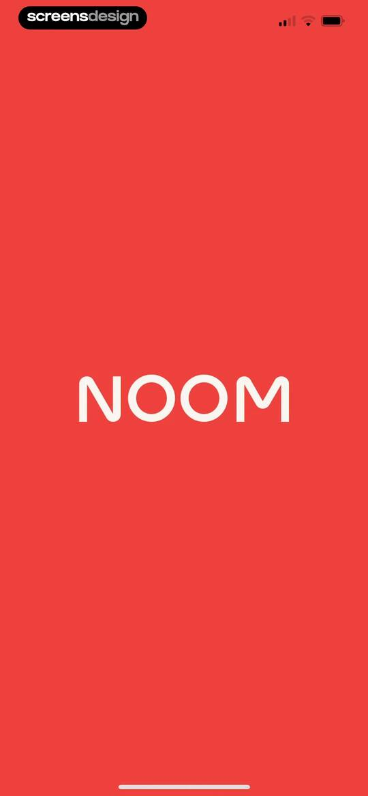 | Splash screen for the Noom app, featuring the white brand name centered on a solid red background. |
| 2 | 00:03 | 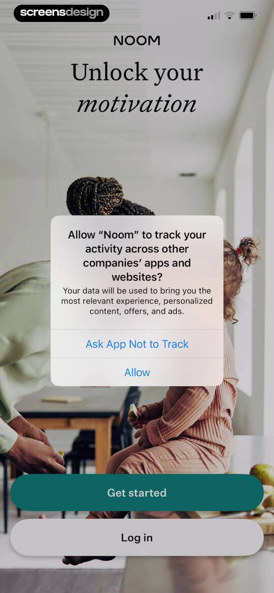 | Noom onboarding screen displaying a tracking permission prompt over a background lifestyle image, with Get started and Log in buttons at the bottom. |
| 3 | 00:05 | 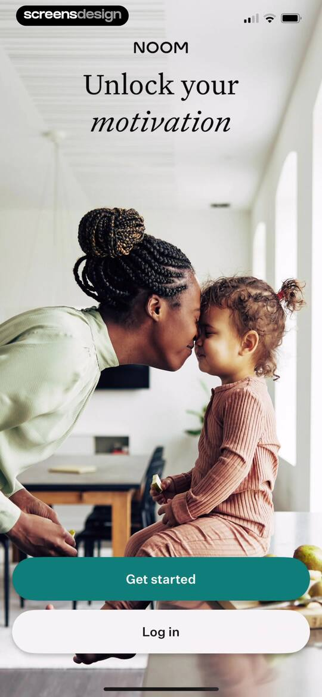 | Noom onboarding welcome screen with a lifestyle image of a woman and child, a headline, Get started button, and Log in button. |
| 4 | 00:08 | 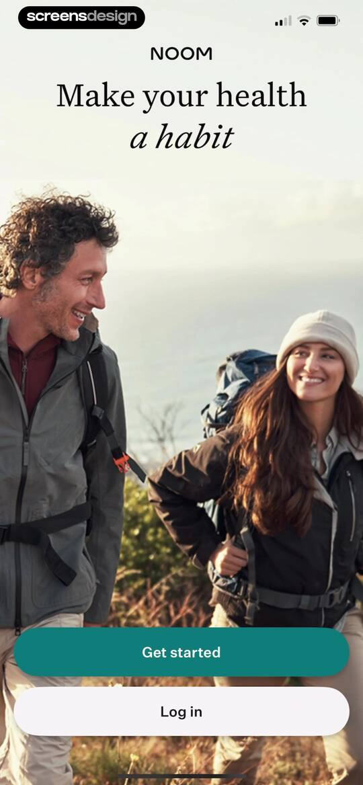 | Noom welcome screen featuring a lifestyle photo of a hiking couple, headline, Get started button, and Log in button. |
| 5 | 00:13 | 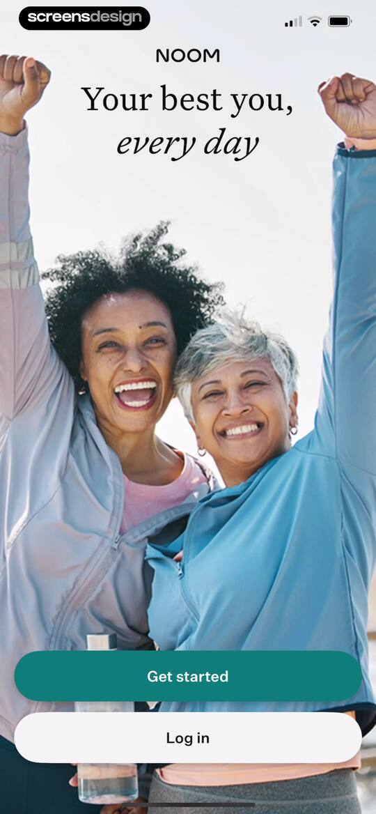 | Noom onboarding welcome screen with a headline, hero background image, Get started button, and Log in button. |
| 6 | 00:18 | 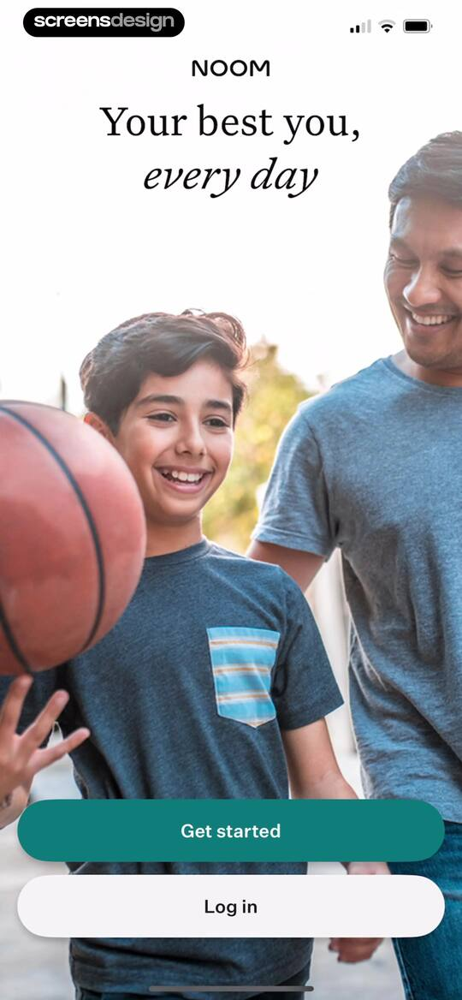 | Noom welcome onboarding screen featuring a father and son playing basketball, a headline, and Get started and Log in buttons. |
| 7 | 00:23 | 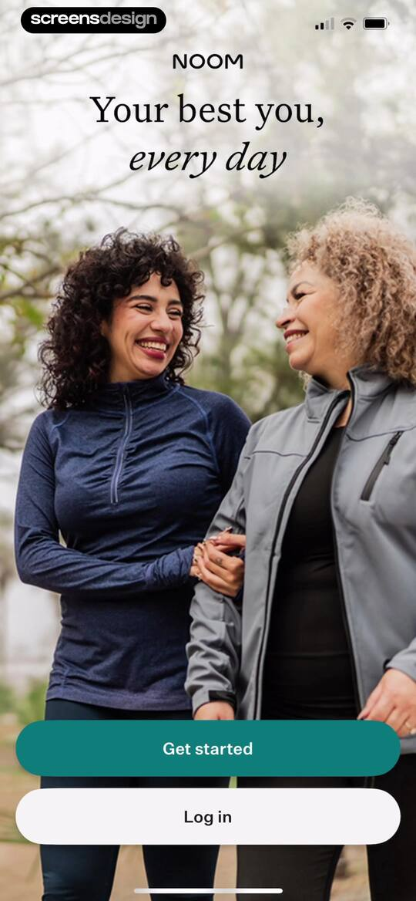 | Noom welcome screen featuring a lifestyle photo of two women walking, the headline Your best you, every day, and Get started and Log in buttons. |
| 8 | 00:29 | 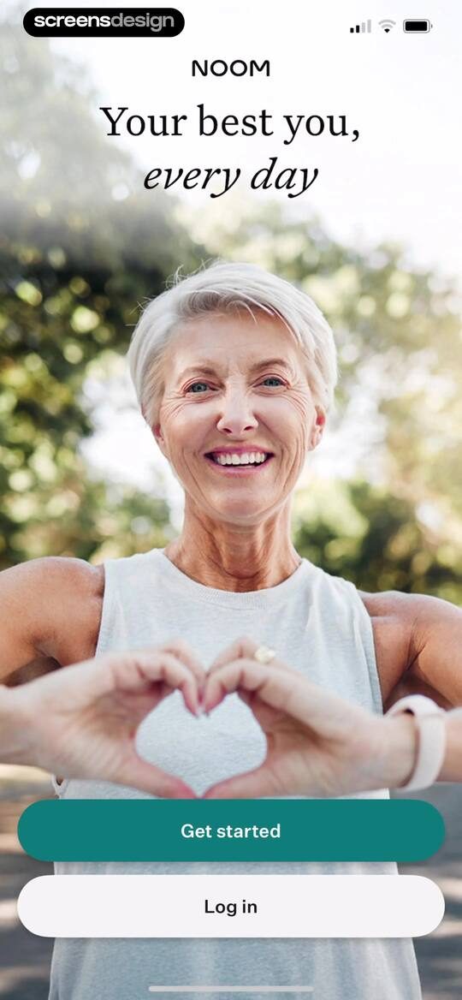 | Noom onboarding welcome screen featuring a hero photo of a smiling woman, with Get started and Log in buttons at the bottom. |
| 9 | 00:36 | locked | Noom sign-up form with empty email and password fields, a disabled Continue button, and social login options. |
| 10 | 00:53 | locked | Account setup loading screen in the Noom app, featuring a large red star icon and the text Setting up your account. |
| 11 | 01:10 | locked | Noom onboarding name entry screen with the question What should we call you?, the name Julia entered, and a Continue button. |
| 12 | 01:13 | locked | Noom onboarding welcome screen greeting Julia with a friendly character illustration, a progress indicator, and a Continue button. |
| 13 | 01:23 | locked | Noom onboarding screen asking for age, with an input field pre-filled with 26 and a Continue button. |
| 14 | 01:30 | locked | Noom onboarding height input screen with side-by-side fields for feet and inches and a Continue button. |
| 15 | 01:41 | locked | Noom onboarding weight input screen asking What's your current weight? with a pre-filled value of 136 lbs and a teal Continue button. |
| 16 | 01:45 | locked | Noom onboarding gender selection screen asking which best describes you, with Female selected and a Continue button. |
| 17 | 01:50 | locked | Noom onboarding health goal selection screen with three goals selected and a Continue button. |
| 18 | 01:53 | locked | Noom onboarding question screen featuring a modal overlay with weight loss subscription value propositions and two action buttons. |
| 19 | 01:56 | locked | Noom onboarding screen asking for the user's weight loss goal with four selectable target range buttons and a close icon. |
| 20 | 02:08 | locked | Noom onboarding screen asking for target weight with an input field prefilled to 120 lb, a recommended range, and a Next button. |
| 21 | 02:09 | locked | Onboarding demographic profile questionnaire asking users to describe their lifestyle, with a vertical list of employment status options. |
| 22 | 02:13 | locked | Health app onboarding screen asking the user to select medical conditions, with None selected in teal and a red Next button. |
| 23 | 02:15 | locked | Noom onboarding screen asking if the user has been diagnosed with diabetes, with Yes and No buttons. |
| 24 | 02:19 | locked | Noom onboarding screen featuring a trust-building social proof message, a central helping hand illustration with a weight loss progress graph, and a Continue button. |
| 25 | 02:22 | locked | Noom onboarding screen highlighting brand trust and health insurance partnerships, with a central illustration and a Continue button. |
| 26 | 02:29 | locked | Noom onboarding screen asking for health insurance provider, with I don't have health insurance selected and a Next button. |
| 27 | 02:33 | locked | Noom Weight onboarding screen featuring a comparison chart between a restrictive diet and Noom Weight, with a Got it! button. |
| 28 | 02:38 | locked | Onboarding screen asking users to select focus areas for a weight loss plan, with Nutrition and Physical activity selected and a Next button. |
| 29 | 02:41 | locked | Onboarding screen asking about upcoming personal events for weight loss motivation, featuring a vertical list of selection options from vacation to other. |
| 30 | 02:45 | locked | Date selection form with an October 2025 calendar modal, displaying a highlighted selected date and descriptive text for a weight loss goal. |
| 31 | 02:50 | locked | Onboarding date selection screen asking when a vacation is, with November 14 2025 selected in the input field, a Next button, and a Skip link. |
| 32 | 02:52 | locked | Onboarding screen asking for preferred weight loss pace, with three stacked selection buttons for speed options and a top progress bar. |
| 33 | 02:54 | locked | Noom onboarding testimonial screen featuring a user quote and a Got it! button. |
| 34 | 02:56 | locked | Onboarding screen asking whether the user is currently taking a GLP-1 medication, with three stacked answer buttons and a progress bar. |
| 35 | 03:02 | locked | Noom onboarding questionnaire asking about interest in weight-loss medication with three selection buttons. |
| 36 | 03:12 | locked | Noom onboarding loading screen displaying a weight loss comparison chart, a 66% progress indicator, and the text calculating weight loss pace. |
| 37 | 03:20 | locked | Noom onboarding weight loss prediction screen featuring a line chart visualization of projected progress to 120 pounds by February and a Continue button. |
| 38 | 03:26 | locked | Onboarding screen titled Behavioral Profile Quiz with a row of circular icons and a Start Your Quiz button at the bottom. |
| 39 | 03:38 | locked | Onboarding quiz screen with a binary choice slider for weight loss versus lifestyle change, featuring a teal highlighted option and a Next button. |
| 40 | 03:42 | locked | Onboarding quiz question about weight goals featuring a binary choice slider, instructional footer text, and a Next button. |
| 41 | 03:44 | locked | Behavioral profile quiz question screen from Noom asking about body love, with two options, an intensity slider, and a Next button. |
| 42 | 03:48 | locked | Behavioral profile quiz question comparing two statements with a horizontal slider for selection and a Next button. |
| 43 | 03:51 | locked | Behavioral profile quiz step five of ten featuring a slider to weigh internal versus external weight loss barriers and a Next button. |
| 44 | 03:54 | locked | Behavioral profile quiz question asking about weight loss goals, featuring a slider input and a Next button. |
| 45 | 03:57 | locked | Behavioral profile quiz question asking about weight goal motivation with binary choice cards, agreement slider scale, and a Next button. |
| 46 | 04:01 | locked | Behavioral profile quiz step 8 of 10 asking to choose between two health statements, with an agreement slider and a Next button. |
| 47 | 04:05 | locked | Behavioral profile quiz question step 9 of 10 with a horizontal slider input and a Next button. |
| 48 | 04:07 | locked | Behavioral profile quiz final step featuring a weight loss program preference question, an intensity slider, and a Next button. |
| 49 | 04:09 | locked | Loading screen with a center puzzle illustration and the text Analyzing your profile... on a light background. |
| 50 | 04:12 | locked | Onboarding screen displaying a behavioral profile result titled Proof Seeker, with a descriptive summary and a Next button. |
| 51 | 04:20 | locked | Noom onboarding questionnaire asking about current subscriptions, with Fitness App and Meditation App selected and a Next button. |
| 52 | 04:22 | locked | Onboarding questionnaire asking whether weight has affected socializing, with a central illustration and Yes and No selection buttons at the bottom. |
| 53 | 04:24 | locked | Onboarding question screen asking if you relate to a weight loss statement, with an illustration and No and Yes buttons. |
| 54 | 04:25 | locked | Onboarding screen asking a lifestyle question for a weight loss profile, with a central illustration and Yes and No selection buttons. |
| 55 | 04:31 | locked | Onboarding prediction screen showing a weight loss trajectory chart and a Next button. |
| 56 | 04:32 | locked | Onboarding question about dietary restrictions or food allergies, with Yes and No selection buttons and a progress indicator. |
| 57 | 04:35 | locked | Julia onboarding screen presenting a nutritional behavior question about multitasking while eating, with an illustration and No and Yes buttons. |
| 58 | 04:38 | locked | Onboarding survey screen asking whether you clear your plate when full, with a central illustration and No and Yes buttons. |
| 59 | 04:40 | locked | Onboarding assessment screen asking a habit formation question, featuring a central illustration and side-by-side No and Yes buttons. |
| 60 | 04:44 | locked | Noom onboarding screen featuring a line graph illustrating the yo-yo dieting effect, descriptive text, and a Next button. |
| 61 | 04:48 | locked | Noom onboarding screen displaying the psychology value proposition with a food-themed Newton's cradle illustration and a building plan loading status. |
| 62 | 04:50 | locked | Noom onboarding loading screen with a behavior change illustration and building plan status text. |
| 63 | 04:54 | locked | Noom onboarding loading screen with a vegetable and book illustration, displaying the text Why Noom Is Different and a Building Plan status. |
| 64 | 04:58 | locked | Noom onboarding screen explaining why the app is different, with a central vegetable book illustration and a building plan loading status at the bottom. |
| 65 | 05:04 | locked | Noom onboarding screen explaining that favorite foods are allowed, featuring a produce illustration and a building plan status message. |
| 66 | 05:08 | locked | Noom onboarding screen explaining the caloric density food system with a central food wheel graphic and a building plan loading indicator at the bottom. |
| 67 | 05:14 | locked | Noom onboarding loading screen with an encouraging message, a thumbs-up on scale illustration, and a BUILDING PLAN status. |
| 68 | 05:19 | locked | Noom onboarding educational screen explaining the health benefits of weight loss, featuring a central icon and a red Next button. |
| 69 | 05:21 | locked | Health and fitness onboarding questionnaire asking about physical limitations, featuring stacked Yes and No selection buttons and a progress bar. |
| 70 | 05:24 | locked | Health and fitness onboarding questionnaire asking about smartwatch usage with Yes and No selection buttons. |
| 71 | 05:26 | locked | Health and fitness app onboarding screen asking if the user owns a scale, with three stacked answer options and a progress bar. |
| 72 | 05:32 | locked | Onboarding weight loss projection screen displaying a trend line chart, goal predictions, motivational feedback, and a Next button. |
| 73 | 05:40 | locked | Onboarding goal selection screen asking what else to explore, with multiple wellness options selected in teal and a red Next button. |
| 74 | 05:46 | locked | Onboarding questionnaire screen asking about motivation changes over time, featuring three stacked selection buttons and a progress indicator at the top. |
| 75 | 05:48 | locked | Onboarding question asking about motivation to reach target weight, with four vertical selection buttons including I'm ready and Feeling hopeful. |
| 76 | 05:50 | locked | Noom onboarding screen featuring motivational text about goal setting and a bottom-aligned Set My First Goal button. |
| 77 | 05:56 | locked | Onboarding goal selection screen with three selected goals and a Next button. |
| 78 | 05:59 | locked | Noom onboarding screen explaining a psychology-based approach to weight loss, with a red Next button at the bottom. |
| 79 | 06:01 | locked | Onboarding quiz screen asking which snack is healthier, with stacked selection buttons for Grapes and Raisins. |
| 80 | 06:04 | locked | Educational lesson screen about nutrition, featuring a text-heavy body section explaining caloric density with grapes and a large Next button at the bottom. |
| 81 | 06:06 | locked | Onboarding quiz screen asking how mindful eating can help, with three stacked selection buttons including Lose more weight and Increase your self-awareness. |
| 82 | 06:08 | locked | Onboarding educational screen about mindful eating with bullet points, a top navigation bar, and a bottom Next button. |
| 83 | 06:10 | locked | Onboarding quiz screen asking when is the best time to weigh yourself, with two selectable answer cards and a progress bar. |
| 84 | 06:12 | locked | Educational onboarding screen with tips on daily weighing, a thumbs-up illustration, and a Next button. |
| 85 | 06:15 | locked | Noom onboarding screen with a personalized program message, red diamond icon, and a Next button. |
| 86 | 06:19 | locked | Noom onboarding screen presenting social proof with a progress bar, a chart card showing 32 percent faster progress, and a Next button. |
| 87 | 06:21 | locked | Noom onboarding screen asking whether to gift two free weeks to a friend, with Yes and No action buttons. |
| 88 | 06:33 | locked | Noom onboarding survey screen asking where the user heard about the app, with Facebook selected from a vertical list of radio button cards. |
| 89 | 06:35 | locked | Onboarding survey form listing acquisition sources like search engines and social media, with a red Next button at the bottom. |
| 90 | 06:38 | locked | Onboarding progress screen showing demographic profile analysis at 49 percent and six pending categories with a closing button at the top right. |
| 91 | 06:39 | locked | Onboarding health questionnaire modal asking about a history of heart disease or diabetes, with yes and no response buttons. |
| 92 | 06:45 | locked | Onboarding modal asking a meal timing question with Yes and No buttons, displayed over a behavioral trends page. |
| 93 | 06:51 | locked | Noom onboarding modal asking about daily activity level, with ACTIVE and SEATED buttons. |
| 94 | 06:57 | locked | Noom onboarding progress screen showing a completed checklist of seven health profile categories and a plan generation message. |
| 95 | 06:59 | locked | Employer benefit verification form asking where the user works, with an empty input field and a disabled Next button. |
| 96 | 07:03 | locked | Onboarding form asking for approximate organization employee count with a vertical list of range buttons. |
| 97 | 07:07 | locked | Noom onboarding screen explaining employer reimbursement options, with a red Next button at the bottom. |
| 98 | 07:14 | locked | Noom Weight welcome screen with centered brand text on a dark background and a close button in the top right corner. |
| 99 | 07:17 | locked | Noom onboarding transition screen displaying centered text based on your answers and a close button in the top right corner. |
| 100 | 07:20 | locked | Noom onboarding screen displaying the centered message 'we've created a personalized plan' on a plain background with a close button in the top right corner. |
| 101 | 07:23 | locked | Noom onboarding screen showing a personalized weight loss goal of 120 pounds by December 31 with a close button. |
| 102 | 07:26 | locked | Noom app onboarding screen displaying a weight loss goal statement and a close button in the top right corner. |
| 103 | 07:29 | locked | Noom onboarding welcome screen with centered text saying Let's get started and a close button in the top right corner. |
| 104 | 07:37 | locked | Weight loss projection screen showing a line chart of weight milestones and an informational card about health benefits with a Next button. |
| 105 | 07:40 | locked | Personalized plan summary screen showing a reservation countdown timer, goal details, and a weight loss trend chart with a view plan button. |
| 106 | 07:45 | locked | Noom paywall screen displaying a personalized weight loss chart, plan highlights, a free 7-day trial offer, and a countdown timer. |
| 107 | 07:48 | locked | Noom paywall screen detailing a free 7-day trial and a 2-month plan with a reminder checkbox and Continue button. |
| 108 | 07:55 | locked | Noom subscription checkout screen detailing the 7-day free trial terms, auto-renewal pricing, an agreement checkbox, and a Submit button. |
| 109 | 08:04 | locked | Noom subscription checkout screen displaying a native App Store confirmation modal with a 1-week free trial and side button prompt. |
| 110 | 08:10 | locked | Checkout screen displaying subscription terms and an overlay modal confirming a successful purchase with an OK button. |
| 111 | 08:14 | locked | Noom app loading screen displaying the text Upgrading to your new program with a centered progress indicator. |
| 112 | 08:17 | locked | Minimalist onboarding splash screen featuring a centered coral-red star icon and the welcoming text Let's get started on an off-white background. |
| 113 | 08:26 | locked | Noom onboarding permission screen featuring a system notification modal overlaid on a health data tracking setup with a Continue button. |
| 114 | 08:28 | locked | Noom health app permission request screen asking to access and update Apple Health data, with a Continue button. |
| 115 | 08:33 | locked | Permissions request screen for Noom to access health data, featuring a list of categories with individual toggles and Allow and Don't Allow options. |
| 116 | 08:39 | locked | Success confirmation screen showing Connected! with an Apple Health integration message and two stacked buttons for proceeding or connecting another device. |
| 117 | 08:43 | locked | Noom onboarding welcome screen with a hiker illustration, a personalized plan message, and a Let's Do It button. |
| 118 | 08:45 | locked | Onboarding screen outlining key program features with a trophy illustration, a numbered feature list, and a Success, Please button. |
| 119 | 08:50 | locked | Noom onboarding screen with a hero illustration of a helping hand, introductory text about the program, and an Awesome button. |
| 120 | 08:55 | locked | Noom onboarding time commitment selection screen with options from 1 to 12 minutes, with the 1 to 4 minutes option selected. |
| 121 | 09:02 | locked | Noom dashboard with a calorie progress bar and a bottom modal celebrating a completed learning goal. |
| 122 | 09:04 | locked | Noom health app dashboard featuring a calorie progress bar and a modal overlay displaying a completed learning goal with Read and Listen buttons. |
| 123 | 09:08 | locked | Educational screen introducing an app food system update with bullet points, an illustration, and an I'M IN button. |
| 124 | 09:10 | locked | Educational screen in the Noom app explaining updates to the food categorization system with a central circular infographic and explanatory text. |
| 125 | 09:14 | locked | Health app lesson explaining a food classification chart with a confirmation modal for saved lessons and an AWESOME button. |
| 126 | 09:17 | locked | Educational nutrition screen with a circular infographic explaining green, yellow, and orange food classifications, accompanied by a bottom audio player and navigation tabs. |
| 127 | 09:25 | locked | Noom article card about food classifications overlaid with an iOS share sheet displaying messaging apps and system actions. |
| 128 | 09:27 | locked | Noom educational screen with a food classification chart overlaid by a system permission modal requesting photo access, featuring Allow and Don't Allow buttons. |
| 129 | 09:33 | locked | Informational update screen detailing changes to food color goals, with progress charts and a Food Lookup search tool. |
| 130 | 09:38 | locked | Noom dashboard showing daily progress, a task list, and a modal overlay celebrating a completed learning goal with Read and Listen actions. |
| 131 | 09:45 | locked | Noom daily health dashboard showing a weekly calendar, calorie tracking summary, daily task cards, and a Track more habits button. |
| 132 | 09:47 | locked | Noom health app dashboard displaying a calendar strip, daily habit tracking cards including meal logging and step progress, and a bottom navigation bar. |
| 133 | 09:50 | locked | Settings screen for Macro Monitoring featuring a macro targets toggle set to OFF and a bottom navigation bar. |
| 134 | 09:52 | locked | Macro monitoring settings screen displaying a toggle for macro targets, a list of protein, carbohydrate, and fat goals with percentages, and an informational health disclaimer. |
| 135 | 09:54 | locked | Macro Monitoring settings screen with a list of nutrient targets and a bottom sheet for adjusting percentage distribution with an Update button. |
| 136 | 10:08 | locked | Macro Monitoring settings screen with an active macro targets toggle, a list of protein, carbohydrate, and fat percentages, and an informational text block. |
| 137 | 10:13 | locked | Health dashboard displaying a calorie progress summary and three empty food category cards for green, yellow, and orange foods. |
| 138 | 10:15 | locked | Nutritional analysis dashboard with a calorie progress bar and color-coded food category cards for Green and Yellow foods. |
| 139 | 10:19 | locked | Health analytics screen displaying a calorie progress bar and expandable cards for green and yellow food categories with the Health tab selected. |
| 140 | 10:23 | locked | Analytics screen displaying color-coded nutritional food category cards with calorie tracking and a Share Analysis button. |
| 141 | 10:25 | locked | Calorie tracking dashboard overlaid with a system share sheet modal showing a meal analysis preview and app sharing options. |
| 142 | 10:28 | locked | Reward notification modal in the Noom app stating you earned your first NoomCoin for the day, featuring a Keep Going button. |
| 143 | 10:36 | locked | Weight and calorie settings screen displaying the current calorie budget, starting and goal weights, and a body scan promo card with a start button. |
| 144 | 10:38 | locked | Weight and calorie settings screen showing a current calorie budget, a weight input ruler set to 136 pounds, and a promotional card to start a body scan. |
| 145 | 10:46 | locked | Weight and calorie settings screen displaying the current calorie budget summary, weight stats, and activity level options with Dynamic selected. |
| 146 | 10:54 | locked | Health app onboarding modal for a personalized health report and 3D body scan, featuring a 3D avatar, body metrics, and Continue and Maybe later buttons. |
| 147 | 10:57 | locked | Noom body scan privacy and consent disclosure screen with a checked consent checkbox and a Continue button. |
| 148 | 11:00 | locked | Weight update form in Noom with current and goal weight input fields and a Continue button. |
| 149 | 11:02 | locked | Weight update form with a scale picker showing 135 pounds, a goal weight of 120 lbs, and a Continue button. |
| 150 | 11:15 | locked | Birthday selection form with an input field and a scrollable date picker wheel showing May 31, 1999. |
| 151 | 11:17 | locked | Birthday input form for a body scan featuring a filled birth date and a Continue button. |
| 152 | 11:20 | locked | Onboarding demographic selection screen asking for sex assigned at birth, with Female selected and a Continue button. |
| 153 | 11:23 | locked | Noom mode selection screen for the body scan feature, with Normal mode selected and a Continue button. |
| 154 | 11:29 | locked | Fitness app onboarding screen titled How it works, featuring a central photo, instructional text about space setup, and bottom progress dots. |
| 155 | 11:39 | locked | Onboarding instruction screen titled How it works with a central media area, instructional text to wear tight fitting clothes, and bottom navigation controls. |
| 156 | 11:48 | locked | Onboarding screen titled How it works, featuring an instructional photo and text to keep hair off your shoulders and face, with a progress indicator and navigation arrows. |
| 157 | 11:56 | locked | Onboarding instructional screen with the heading How it works, a photo demonstrating phone placement, and text instructing users to lean their phone against an object. |
| 158 | 12:05 | locked | Onboarding instruction screen explaining how to perform a body scan, with a central photo, posture instructions, and a Start button. |
| 159 | 12:18 | locked | Noom permissions screen with a system dialog requesting camera access for meal analysis and barcode scanning, featuring Don't Allow and Allow buttons. |
| 160 | 12:20 | locked | Onboarding screen titled Device Placement with a phone placement illustration and a Level Device button. |
| 161 | 12:22 | locked | Device calibration screen with the instruction to tilt the device towards you and a not level status button at the bottom. |
| 162 | 12:27 | locked | Noom dashboard with a calorie tracker, daily plan task cards, and a bottom navigation bar. |
| 163 | 12:36 | locked | Meal logging dashboard with an educational card, a vertical list of daily meal categories, a Finish day button, and a bottom navigation bar. |
| 164 | 12:42 | locked | Onboarding screen explaining the meal logging tool and Weight Loss Zone with a calorie range visualization and a Continue button. |
| 165 | 12:46 | locked | Noom onboarding screen explaining how to build a meal logging habit, featuring a tool to scan and analyze meal photos with an illustration. |
| 166 | 12:49 | locked | Noom nutritional education screen detailing the color system with three circular charts and definitions for green, yellow, and orange food categories. |
| 167 | 12:52 | locked | Noom onboarding screen displaying weight loss recommendations, with pagination dots and a Done button. |
| 168 | 12:59 | locked | Food search screen for breakfast with a search input field, action cards to scan or describe a meal, and helper text. |
| 169 | 13:01 | locked | Onboarding screen explaining the meal scanning feature with visual examples and a Next button. |
| 170 | 13:04 | locked | Food logging camera instructions screen featuring visual framing examples for breakfast and a Next button. |
| 171 | 13:06 | locked | Food logging review screen listing breakfast items like grilled chicken and grape tomatoes, with options to edit and a start photo logging button. |
| 172 | 13:09 | locked | Meal logging camera screen displaying a salad bowl photo, instructional text, shutter controls, and a bottom navigation bar. |
| 173 | 13:19 | locked | Loading screen with a central illustration of a cooking pot, detecting ingredients text, and an educational spinach food fact. |
| 174 | 13:25 | locked | Meal review screen displaying a food photo, 445 calories total, a list of 9 ingredients, and a Log Breakfast button. |
| 175 | 13:28 | locked | Ingredient replacement form showing a search bar and a list of avocado options with serving sizes, and a disabled Replace ingredient button. |
| 176 | 13:38 | locked | Meal review modal for replacing an ingredient, featuring a search bar, a list of avocado food options with Avocado Toast selected, and a Replace ingredient button. |
| 177 | 13:40 | locked | Meal review screen showing a list of nine food items totaling 473 calories, with an ingredient replacement notification and Log Breakfast button. |
| 178 | 13:47 | locked | Food logging form for Creamy Sauce with a horizontal unit selector, an interactive quantity slider set to 2 tbsp, and a Log 2 button. |
| 179 | 13:52 | locked | Serving size modal displaying options with calorie counts for Creamy Sauce, featuring an Other Units button at the bottom. |
| 180 | 13:55 | locked | Meal review screen displaying a list of food items with calorie counts, a portion updated notification, and a Log Breakfast button. |
| 181 | 14:09 | locked | Meal editor listing ingredients with calorie counts, a servings summary, Save meal and Cancel buttons, and a bottom navigation bar. |
| 182 | 14:12 | locked | Meal review form listing eight food items totaling 458 calories, with an option to save the meal and a Log Breakfast button. |
| 183 | 14:16 | locked | Calorie tracking dashboard showing a daily summary, a progress bar in the weight loss zone, and a Done button. |
| 184 | 14:19 | locked | Noom onboarding notification permission screen featuring an illustration, accountability message, and Set a reminder and Maybe later buttons. |
| 185 | 14:23 | locked | Meal reminders settings screen displaying a list of meal times with a bottom sheet modal for time selection and a Save button. |
| 186 | 14:33 | locked | Calorie analysis screen showing a daily progress bar and stacked collapsible cards for Green, Yellow, and Orange food categories. |
| 187 | 14:44 | locked | Meal logging dashboard displaying a list of meal categories, a calorie count, and Finish day and View analysis action buttons. |
| 188 | 14:47 | locked | Food logging screen displaying search and quick action buttons for scanning or describing meals, along with a list of logged items including Salad and Yellow Bell Pepper. |
| 189 | 14:49 | locked | Meal logging form prompting the user to describe their lunch by voice or text, with a Next button at the bottom. |
| 190 | 14:51 | locked | Meal logging form with a text input area, an instructional card displaying tiered examples for accuracy, and a Next button. |
| 191 | 14:53 | locked | Meal logging editor displaying a list of food items with calorie details, a review prompt, and a Start smart log button. |
| 192 | 14:55 | locked | Meal logging form prompting the user to describe lunch by voice or text, with a large microphone button and a Done action. |
| 193 | 14:56 | locked | Noom food logging screen with a system permission modal requesting speech recognition access and a recording control below. |
| 194 | 14:58 | locked | Microphone permission modal displayed over a meal logging screen with an Allow button and a voice recording control. |
| 195 | 15:03 | locked | Meal logging screen displaying an active voice recording control and text input for two large eggs, with a Done button. |
| 196 | 15:09 | locked | Loading screen featuring a playful illustration of a cooking pot with vegetables in the center and a close button in the top right corner. |
| 197 | 15:12 | locked | Meal review screen displaying one food item totaling 144 calories, with an Add more button and a Log Lunch action. |
| 198 | 15:15 | locked | Calorie tracking dashboard displaying a progress bar with remaining calories for the day, a weight loss zone, and action buttons for completion and color breakdown. |
| 199 | 15:17 | locked | Noom dashboard screen displaying a weekly calendar, calorie progress bar, and Today's plan task list with tracked meals, weight, and steps. |
| 200 | 15:19 | locked | Meal logging dashboard displaying total calories and a list of daily meal slots with a Finish day button. |
| 201 | 15:26 | locked | Barcode scanner screen featuring a central camera viewfinder, instructions to fit the barcode in the frame, and a regional database disclaimer. |
| 202 | 15:28 | locked | Noom food logging screen with a modal stating the scanned barcode is not in the database, featuring buttons to add the item or dismiss. |
| 203 | 15:31 | locked | Custom food form with input fields for nutritional details and a Save button. |
| 204 | 15:50 | locked | Meal selection screen for dinner with a saved salad card, tabbed navigation, and an Add a new meal button. |
| 205 | 16:02 | locked | Ingredient addition form listing Yellow Bell Pepper, Egg, and Fresh Milk with a search bar and a Done button. |
| 206 | 16:04 | locked | Food logging modal displaying Fresh Milk with a calorie adjustment slider and a Log 100 button. |
| 207 | 16:17 | locked | Serving size selection modal for Peanut Butter with options ranging from one to four tablespoons and the two tablespoons option selected. |
| 208 | 16:24 | locked | Meal editor screen listing ingredients and calorie counts for a protein shake, with an Add Ingredient button and Save meal action. |
| 209 | 16:26 | locked | Protein Shake food logging screen showing an ingredients list with fresh milk and peanut butter, servings details, and a Log 1 Serving button. |
| 210 | 16:29 | locked | Meal selection screen listing saved dinner options including Salad and Protein Shake, with a My meals tab and an Add a new meal button. |
| 211 | 16:32 | locked | Meal review form listing three food items totaling 194 calories, with an add more option and a Log Dinner button. |
| 212 | 16:36 | locked | Daily calorie tracking dashboard displaying a progress bar, remaining calorie count, and a Done button. |
| 213 | 16:41 | locked | Fitness tracking dashboard displaying movement summary stats, a Log movement button, and a recommended workout class. |
| 214 | 16:46 | locked | Noom feature announcement modal highlighting FitOn subscription benefits, with a red Got it! button. |
| 215 | 16:50 | locked | Workout detail screen for the 10-Min Core Challenge with instructor info, equipment list, and a bottom Start button. |
| 216 | 17:03 | locked | Fitness video player overlay for the 10-Min Core Challenge showing centered pause controls, playback progress, and a casting option. |
| 217 | 17:25 | locked | Workout feedback form with summary stats, star rating rows for four categories, a feedback text field, and a submit button. |
| 218 | 17:34 | locked | Noom app reward modal celebrating a Noomcoin earned, with a 2/5 progress bar and a Close button. |
| 219 | 17:39 | locked | Fitness movement logging dashboard displaying a completed activity summary, metric list, Log movement button, and a featured workout card. |
| 220 | 17:43 | locked | Activity type selection modal displaying a scrollable list of fitness options including walking, running, and biking with a close button. |
| 221 | 17:55 | locked | Exercise logging form with inputs for rock climbing, 30-minute duration, high intensity selected, and a Log exercise button. |
| 222 | 18:03 | locked | Noom health app dashboard displaying a calorie progress bar, workout confirmation banner, and Today's plan task list. |
| 223 | 18:09 | locked | Noom dashboard displaying calorie and step progress bars, activity lists, habit tracking buttons, and educational content cards. |
| 224 | 18:11 | locked | Health tracking tools menu with a vertical list of options including lessons, weight, meals, water, move, mood, and blood glucose. |
| 225 | 18:25 | locked | Blood glucose logging form with a pre-filled value of 100 mg/dL, meal timing options, and a Done button. |
| 226 | 18:27 | locked | Blood glucose logging form with fields for value set to 100 mg/dL, time set to 3:03 PM, meal context set to Fasting, and a Log blood glucose button. |
| 227 | 18:30 | locked | Blood glucose dashboard displaying a daily chart, in-range status summary, range guide link, and a daily overview list. |
| 228 | 18:33 | locked | Glucose level range guide modal over a blood glucose dashboard, with a reference table and a Done button. |
| 229 | 18:41 | locked | Blood glucose dashboard showing a weekly line chart, a selected week time filter, and a glucose level range guide. |
| 230 | 18:43 | locked | Blood glucose monthly dashboard showing a line chart, summary statistics, and a link to the glucose level range guide. |
| 231 | 18:53 | locked | Nutrition quiz screen asking which food has more protein, with option A selected and a Next button. |
| 232 | 18:55 | locked | Educational quiz feedback card showing protein comparison facts between eggs and bread, with a Next button. |
| 233 | 19:01 | locked | Nutrition onboarding quiz asking which food has more protein, with an option selected and a Next button. |
| 234 | 19:03 | locked | Noom onboarding screen featuring a central card with the text Noomalicious, pagination dots, and a Next button. |
| 235 | 19:05 | locked | Educational quiz result screen comparing protein sources with a central answer card, a progress indicator, and a Next button. |
| 236 | 19:08 | locked | Quiz onboarding screen asking which food has more protein, with chicken breast selected and a Next button. |
| 237 | 19:10 | locked | Onboarding progress screen displaying a Great job card with pagination dots and a Next button. |
| 238 | 19:13 | locked | Educational quiz result comparing protein content between chicken breast and salmon, with a Next button and pagination dots. |
| 239 | 19:16 | locked | Noom onboarding quiz screen asking which food has more protein, with option A selected and a Next button. |
| 240 | 19:17 | locked | Onboarding screen displaying a Great job! message with progress dots, a teal NEXT button, and a bottom navigation bar. |
| 241 | 19:21 | locked | Educational content screen explaining how to spot high-protein foods, featuring a cheat sheet list and a Done button at the bottom. |
| 242 | 19:31 | locked | Chat support screen featuring a greeting from the team and suggestion chips for common questions, with a bottom navigation bar. |
| 243 | 19:37 | locked | Chat screen displaying a conversation with an AI health assistant about treat days, with suggested follow-up questions and a message input field. |
| 244 | 19:42 | locked | Chat screen showing a conversation with the Noom AI health assistant about treat days, featuring message history and suggested prompts. |
| 245 | 19:54 | locked | Chat interface with an AI disclaimer, an input field containing a greeting, a red send button, and the on-screen keyboard. |
| 246 | 20:04 | locked | Noom chat screen showing a conversation with a virtual assistant, a rating option, and a text input field at the bottom. |
| 247 | 20:07 | locked | Chat support modal with a red header, a button to send a new message, and a list showing a recent conversation thread. |
| 248 | 20:17 | locked | Health dashboard displaying calories, blood glucose graphs, and lesson progress with the Trends tab selected. |
| 249 | 20:22 | locked | Blood glucose dashboard displaying a daily line chart, an in-range status message, a range guide link, and a breakfast entry. |
| 250 | 20:25 | locked | Health dashboard displaying metric cards for weight, steps, and mood, with the Trends tab selected and a Start tracking button on the mood card. |
| 251 | 20:27 | locked | Empty state screen for a mood graph showing no logged data, with a plus icon to add a new entry and a bottom navigation bar. |
| 252 | 20:32 | locked | Mood tracking modal asking how the user is feeling, featuring a smiling green character illustration, a mood intensity slider, and a Done button. |
| 253 | 20:37 | locked | Mood tracking modal screen with a tag selection grid featuring Health and Weather selected, an input field, and a Done button. |
| 254 | 20:39 | locked | Health analytics screen displaying a mood line chart with an Oct 31 data point callout and a View Note button. |
| 255 | 20:49 | locked | Health dashboard featuring feature cards to build a health profile including Face Scan and Body Composition Scan. |
| 256 | 21:02 | locked | Noom onboarding screen featuring a split-image age comparison, headline explaining the feature, and Let's try it and Not right now buttons. |
| 257 | 21:10 | locked | Noom onboarding camera instruction screen with the tip to remove glasses, a progress indicator, and a Next button. |
| 258 | 21:16 | locked | Noom onboarding screen featuring a camera viewfinder, lighting instructions, and a Next button. |
| 259 | 21:19 | locked | Noom onboarding camera screen instructing the user to move their hair back, with a progress indicator and Next button. |
| 260 | 21:24 | locked | Noom onboarding photo capture screen with instructional text to remove makeup or face covers, featuring Upload and Take photo buttons. |
| 261 | 21:30 | locked | Noom profile photo upload screen with a bottom sheet menu offering photo library, camera, and file options alongside upload buttons. |
| 262 | 21:33 | locked | Noom photo picker screen showing a grid of photo thumbnails, a privacy notice card, and a search bar. |
| 263 | 21:36 | locked | Photo selection screen displaying a portrait of a woman with one photo selected, featuring Cancel and Done buttons in the top navigation bar. |
| 264 | 21:41 | locked | Noom onboarding completion screen displaying a user photo, the text Well done!, and Redo and Submit buttons. |
| 265 | 21:48 | locked | Noom onboarding screen showing a gut health educational fact beneath a hot air balloon illustration and a progress indicator. |
| 266 | 21:53 | locked | Noom onboarding loading screen featuring a health fact about exercise, a hot air balloon illustration, and a progress bar creating a visual baseline. |
| 267 | 22:13 | locked | Onboarding lifestyle choice screen comparing habits, with the unhealthy habits view selected and a bottom call-to-action button. |
| 268 | 22:20 | locked | Onboarding screen showing future self visualization with healthy habits selected, a portrait of a woman, a list of benefits, and a continue button. |
| 269 | 22:24 | locked | Noom sharing screen displaying a healthy and unhealthy habits comparison card, instructional text, and a Save or share button. |
| 270 | 22:25 | locked | Health habit comparison screen displaying aging simulations for healthy and unhealthy habits over thirty years with a Save or share button. |
| 271 | 22:27 | locked | Noom sharing screen displaying a future self visualization card comparing healthy and unhealthy habits over 30 years, with a Save or share button. |
| 272 | 22:32 | locked | Learning journey dashboard displaying a winding course map with interactive milestones like habit psychology and nutrition modules. |
| 273 | 22:35 | locked | Onboarding screen showing a 16 percent progress bar, nutrition information, and a list of unlocked tools including Learn, Weigh-ins, and Meal logging. |
| 274 | 22:46 | locked | Health app success screen featuring a mountain illustration, an about section for nutrition, and an unlocked tools list. |
| 275 | 22:51 | locked | Course overview screen for The psychology of habits with an about section, a water logging tool, and the Health tab selected in the bottom navigation. |
| 276 | 22:55 | locked | Health app course overview detailing a weight loss mini-course, with an about section and a bottom navigation bar. |
| 277 | 22:59 | locked | Success kit dashboard featuring categorized cards for eating healthier and moving your body, with the Success kit tab selected in the bottom navigation bar. |
| 278 | 23:04 | locked | Food lookup search screen with an active search input, keyboard, and color-coded food category lists. |
| 279 | 23:06 | locked | Nutrition guide listing green foods like seafood and meat substitutes beneath an informational dietary balance banner. |
| 280 | 23:08 | locked | Food logging modal displaying egg white details with a calorie progress bar and a Log button. |
| 281 | 23:10 | locked | Food logging modal for egg whites with a serving size picker and an Update button. |
| 282 | 23:16 | locked | Food logging screen displaying Egg White details, calorie progress, and a bottom sheet to select a meal slot with a Log button. |
| 283 | 23:20 | locked | Food logging confirmation screen showing a success banner for Egg White, calorie progress, serving size details, and a bottom Log 2 larges button. |
| 284 | 23:30 | locked | Food lookup screen featuring a barcode scanner viewfinder, instructional text, and region disclaimer. |
| 285 | 23:40 | locked | Recipe feed displaying a two-column grid of recipe cards with preparation times and calorie counts below a search bar. |
| 286 | 23:51 | locked | Filter modal with meal type, calorie and prep time sliders, dietary preference options, and an Apply 2 filters button. |
| 287 | 23:54 | locked | Recipe filter form featuring calorie and preparation time sliders, a grid of dietary preference chips with one selected, and an apply button. |
| 288 | 24:00 | locked | Recipe search screen displaying an empty state message for no matching filters, followed by a grid of recommended recipe cards. |
| 289 | 24:06 | locked | Recipe detail screen for Southwestern Frittata showing metadata, ingredients list, and action buttons to save or log the recipe. |
| 290 | 24:10 | locked | Nutrition dashboard showing a daily meal log list with categories like Breakfast and Lunch, calorie counts, and add buttons. |
| 291 | 24:12 | locked | Food logging modal for Southwestern Frittata with a serving size slider and a Log 1 button. |
| 292 | 24:15 | locked | Meal review form listing four food items totaling 322 calories, with an Add more row, Save this meal button, and Update Dinner CTA. |
| 293 | 24:17 | locked | Calorie tracking dashboard showing a progress bar in the weight loss zone with remaining calories and a Done button. |
| 294 | 24:21 | locked | Recipe feed showing a grid of healthy meal cards with preparation times, calorie counts, and a search bar at the top. |
| 295 | 24:25 | locked | Recipe nutrition breakdown for Nicoise Salad showing calorie summary charts, ingredient list, and a Log this recipe button. |
| 296 | 24:36 | locked | Grocery list empty state screen with a search input field and a shopping cart illustration, prompting the user to add items. |
| 297 | 24:39 | locked | Food search screen displaying a search bar with the text eggs, a list of egg suggestions, and an empty state message. |
| 298 | 24:40 | locked | Grocery list screen showing a single item, Eggs, with a top search bar, status text, and an active system keyboard. |
| 299 | 24:49 | locked | Grocery list screen with a reminder prompt modal, featuring Adjust Reminders and dismiss buttons. |
| 300 | 24:51 | locked | Settings screen for grocery list reminders with an active toggle, a day picker, and a notification confirmation message. |
| 301 | 24:57 | locked | Grocery list screen showing color-coded food items with swap buttons, an add items input, and a clear list option. |
| 302 | 25:01 | locked | Grocery list screen with a modal overlay suggesting healthier food alternatives and Swap or Don't Swap buttons. |
| 303 | 25:07 | locked | Grocery list confirmation modal with Clear and Cancel buttons, asking if you are sure you want to clear your list. |
| 304 | 25:14 | locked | Success kit wellness dashboard featuring horizontal scrolling cards for workouts, stress relief, and mindfulness, with the Success kit tab selected in the bottom navigation. |
| 305 | 25:24 | locked | Meditation content feed displaying a filter bar and a vertical list of session cards with titles like Deepest Sleep Ever. |
| 306 | 25:28 | locked | Meditation content feed with a time duration filter modal open, showing the 5-10 minute range selected. |
| 307 | 25:41 | locked | Workout detail screen for Morning Mindfulness featuring a hero image, instructor Amanda Gilbert, session description, and a Start button. |
| 308 | 25:50 | locked | Audio playback screen for Morning Mindfulness featuring central controls, a vertical progress bar, and a pause button. |
| 309 | 26:00 | locked | Health app dashboard displaying a weekly calendar, calorie progress bar, and a vertical list of daily task cards including meal and weight logs. |
| 310 | 26:02 | locked | Noom app navigation menu with a user profile header for Julia and a list of links including Saved lessons and Settings. |
| 311 | 26:06 | locked | Settings screen displaying personal profile fields, gender toggle with female selected, and links for weight, calorie, and macro monitoring configurations. |
| 312 | 26:08 | locked | Noom settings screen displaying grouped options for goals, apps and devices, and account preferences with the Health tab selected. |
| 313 | 26:12 | locked | Settings screen with program options including a GLP-1 companion toggle set to off, notification preferences, and a bottom navigation bar. |
| 314 | 26:14 | locked | Meal Reminders settings screen with toggles for Breakfast, Lunch, and Dinner, showing Breakfast enabled at 11:00 AM. |
| 315 | 26:21 | locked | Content feed displaying a list of saved Noom lessons with a bottom navigation bar. |
| 316 | 26:23 | locked | Onboarding screen explaining the personalized Weight Loss Zone with an illustration, explanatory text, and a calorie progress bar. |
| 317 | 26:30 | locked | Empty state screen for commitments displaying a message that no commitments are available, with bottom navigation tabs. |

## Free showcase screenshots (unordered)

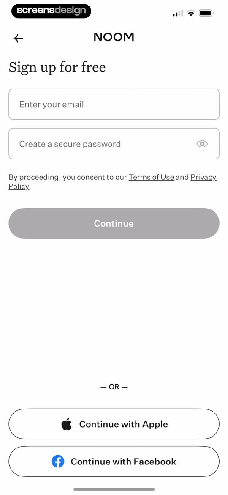
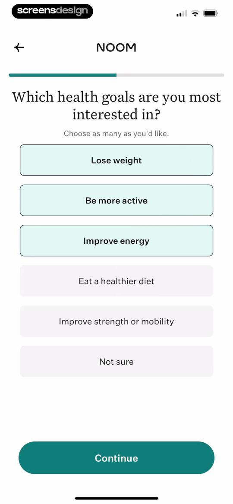
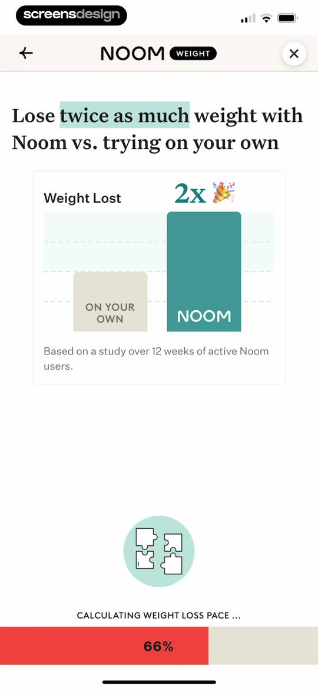
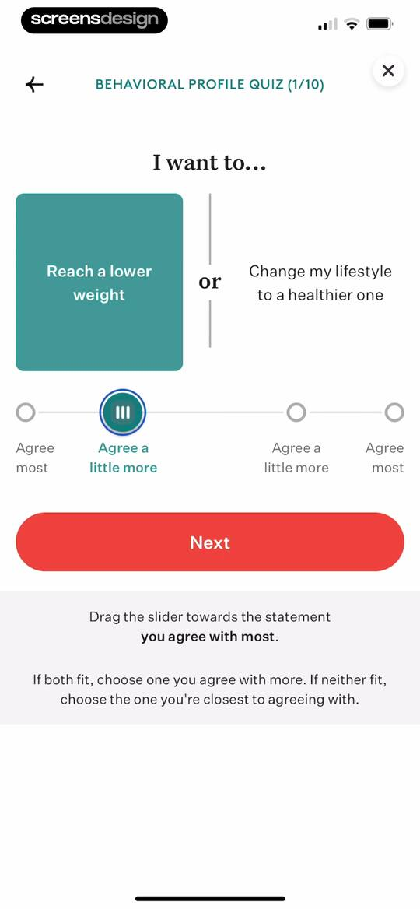
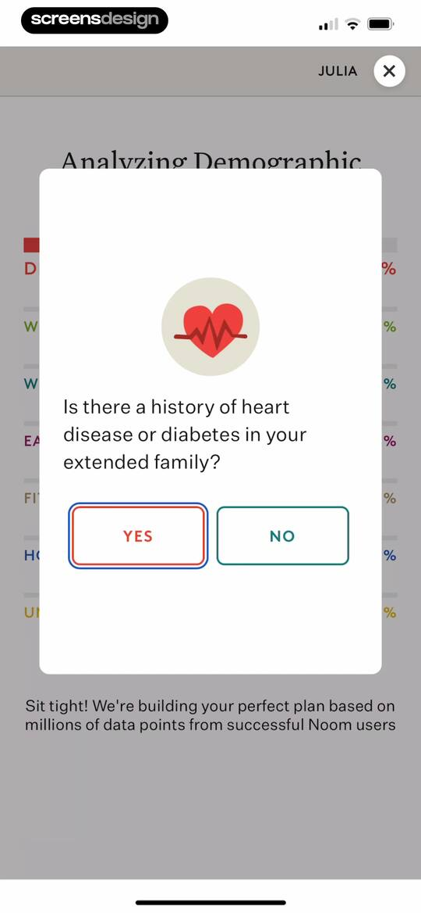
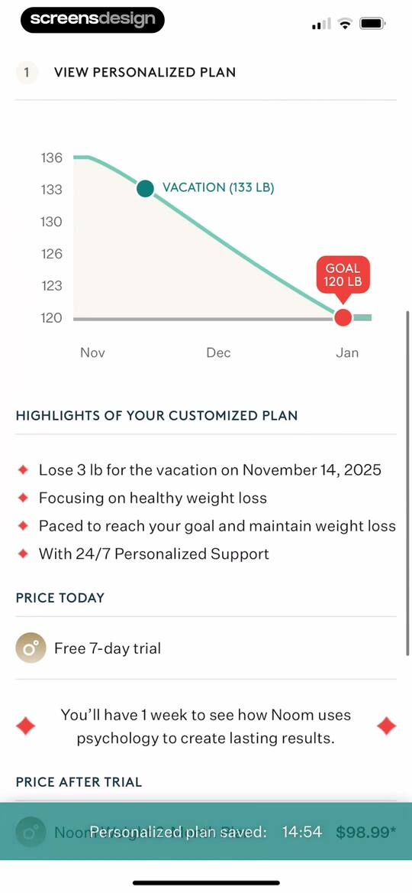
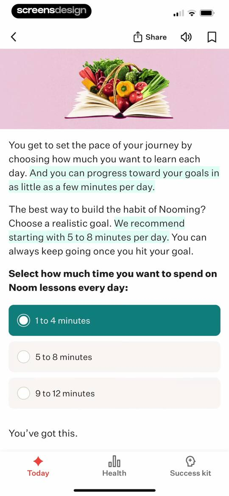
