# one sec | screen time + focus Onboarding, Paywall & UX Flow — 115 Screens, $80k/mo

Source: https://screensdesign.com/apps/one-sec-screen-time-focus/ (fetched 2026-10-05)

Stats: 

| # | Time | Image | What the screen shows |
|---|---|---|---|
| 1 | 00:24 | 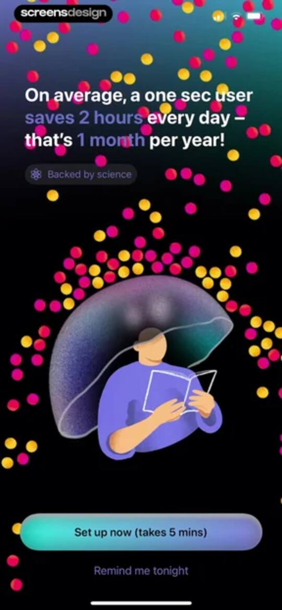 | Onboarding screen displaying a daily time-savings statistic, a central illustration of focus, a Backed by science badge, and a Set up now button. |
| 2 | 00:31 | 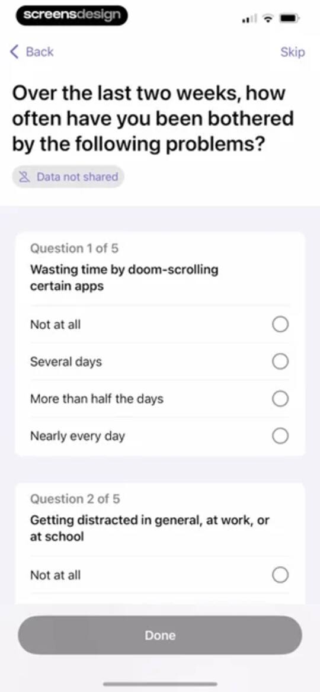 | Onboarding survey screen with digital wellbeing questions, a data privacy badge, and a disabled Done button at the bottom. |
| 3 | 00:39 | 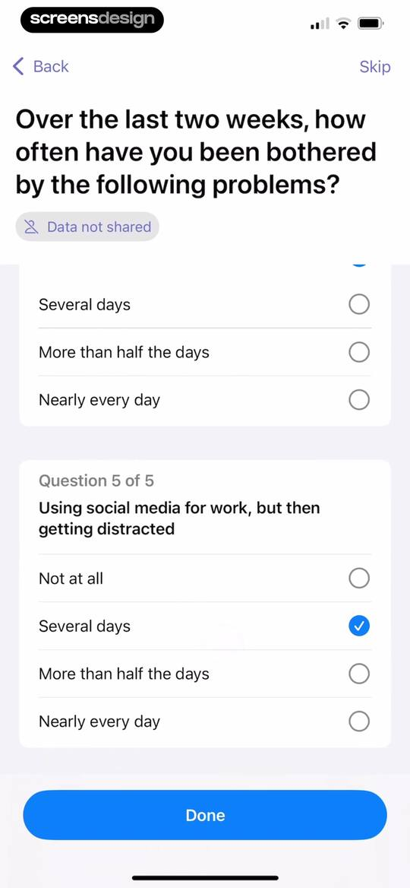 | Onboarding questionnaire asking about social media distractions, with Several days selected and a Done button. |
| 4 | 00:43 | 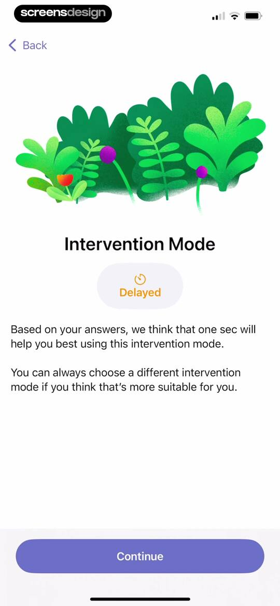 | Onboarding screen recommending the Delayed intervention mode with a central illustration and a Continue button. |
| 5 | 00:47 | 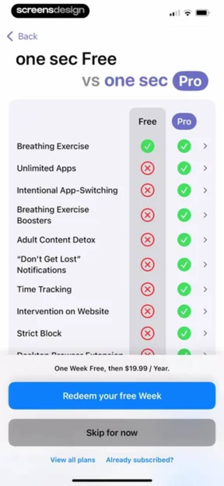 | Paywall comparing Free and Pro features with a feature checklist, pricing details, and a Redeem your free Week button. |
| 6 | 00:49 | 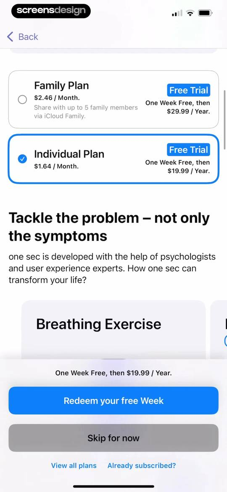 | Paywall screen offering family and individual subscription plans, with the individual plan selected and a Redeem your free Week button. |
| 7 | 00:50 | 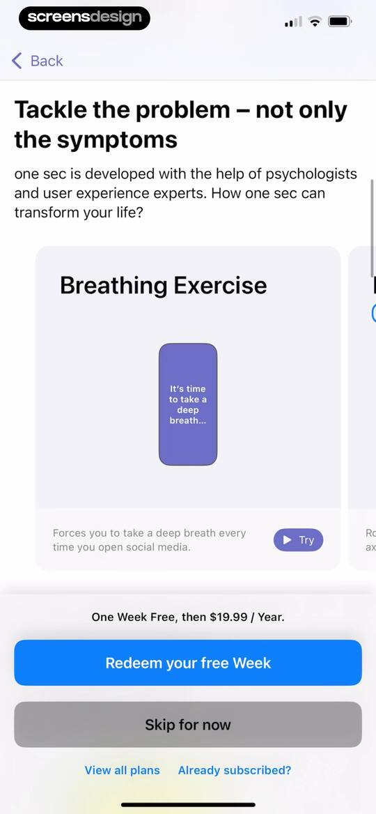 | Paywall offering a one-week free trial then $19.99 per year, featuring a breathing exercise card and a redeem button. |
| 8 | 00:52 | 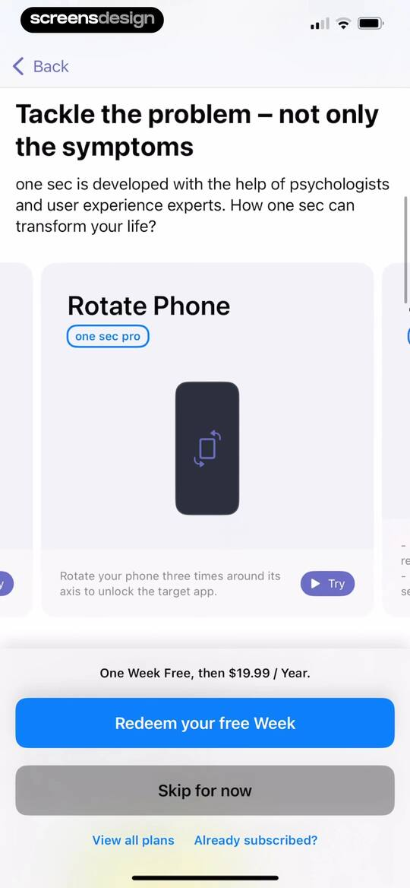 | Paywall screen showcasing the Rotate Phone pro feature with a feature card, annual pricing details, and a free week redemption button. |
| 9 | 00:53 | locked | Paywall screen offering a free week followed by an annual subscription, featuring a 4-7-8 breathing exercise card and a redeem button. |
| 10 | 01:04 | locked | Paywall screen offering a free week followed by an annual subscription, with a central phone mockup and a Redeem your free Week button. |
| 11 | 01:09 | locked | Paywall screen offering a free week trial then $19.99 per year, with a healthy alternatives feature demonstration and a Redeem your free Week button. |
| 12 | 01:11 | locked | Paywall screen offering a one-week free trial followed by an annual subscription, with a product mockup and a Redeem your free Week button. |
| 13 | 01:13 | locked | Paywall screen for the one sec app featuring scientific research and feature explanation cards, with a free trial offer and a redeem button. |
| 14 | 01:15 | locked | Paywall screen offering one week free then $19.99 per year for the pro subscription, with a redeem button and product mockup. |
| 15 | 01:18 | locked | Paywall screen featuring a social proof card, a one-week free trial offer for nineteen ninety-nine per year, and a Redeem your free Week button. |
| 16 | 01:22 | locked | Paywall offering a one-week free trial then $19.99 per year, featuring an indie developer manifesto, student discount option, and a redeem button. |
| 17 | 01:25 | locked | Loading screen displaying a store icon, spinner, and the text one sec, connecting to App Store ... |
| 18 | 01:27 | locked | App Store subscription confirmation modal for one sec pro showing a 1-week free trial and annual pricing. |
| 19 | 01:32 | locked | Purchase confirmation modal displaying a store icon, successful transaction message, and an OK button. |
| 20 | 01:35 | locked | Subscription success screen for the one sec app with a smiling flower illustration, a thank you message, and a Continue button. |
| 21 | 01:39 | locked | Dashboard screen showing an empty usage summary, an add app card, and an instructional banner to add your first target app. |
| 22 | 01:42 | locked | Dashboard with a usage summary card, an empty apps list, and an Add Intervention bottom modal sheet for selecting an app or website. |
| 23 | 01:44 | locked | Intervention timing configuration form with the Delayed option selected, a visual preview card, and a Continue button. |
| 24 | 01:47 | locked | Intervention timing form asking when the intervention should occur, with the Immediately option selected and a Continue button. |
| 25 | 01:50 | locked | Intervention configuration form asking when the intervention should occur, with the Always Ask option selected, a preview flow, and a Continue button. |
| 26 | 01:53 | locked | Permission request screen in the one sec app asking for push notification access with a bell icon and a Grant Push Permission button. |
| 27 | 01:54 | locked | Permissions onboarding screen with a system notification request modal and a Grant Push Permission button. |
| 28 | 01:57 | locked | Permission request screen for the one sec app asking for Screen Time access, featuring an illustration and a Grant Permission button. |
| 29 | 02:02 | locked | Permission request modal asking to access Screen Time, with Continue and Don't Allow buttons over a loading background. |
| 30 | 02:03 | locked | Permission request screen asking to allow access to Screen Time, featuring a top illustration, explanatory text, and buttons to allow with Face ID or decline. |
| 31 | 02:07 | locked | Permission confirmation screen for the one sec app stating Screen Time access has been approved, with a Done button. |
| 32 | 02:18 | locked | App selection screen displaying a search bar and a scrollable list of categories including Social, Games, and Entertainment. |
| 33 | 02:22 | locked | App selection form with a search bar and a scrollable list of apps and categories with checkboxes. |
| 34 | 02:25 | locked | App identification modal asking if Facebook is the TikTok app, featuring a Facebook logo, Change App button, and Yes button. |
| 35 | 02:28 | locked | Onboarding setup screen for the one sec app featuring an email sharing card, a video tutorial card, and step-by-step instructions. |
| 36 | 02:34 | locked | Onboarding video tutorial screen with playback controls, an Open Shortcuts App button, and a Close Video Tutorial link. |
| 37 | 02:36 | locked | Video tutorial screen for the one sec app, featuring setup instructions, playback controls, and an Open Shortcuts App button. |
| 38 | 02:37 | locked | Setup tutorial video for the one sec app with an open playback speed menu, an Open Shortcuts App button, and a Close Video Tutorial link. |
| 39 | 02:44 | locked | Video player tutorial screen for setup with playback controls, progress bar, and a dark theme. |
| 40 | 02:53 | locked | Onboarding tutorial with step-by-step instructions and an Open Shortcuts App button to set up an iOS automation. |
| 41 | 02:56 | locked | Onboarding setup screen for the one sec app, displaying step-by-step instructional cards, an automation configuration mockup, and a Done button. |
| 42 | 02:58 | locked | Dashboard screen displaying an overview summary card and an apps list with a TikTok tracking card and add button. |
| 43 | 03:03 | locked | Dashboard with a statistics summary and apps list, featuring an Add Intervention bottom sheet modal with App and Website options. |
| 44 | 03:05 | locked | Onboarding tutorial screen for setting up a Safari extension, featuring numbered instructional cards with iOS Settings mockups and an Open iOS Settings button. |
| 45 | 03:08 | locked | Safari Extension onboarding tutorial screen with step-by-step instructions, an extension UI mockup, and an Add website to one sec button. |
| 46 | 03:15 | locked | Intervention timing configuration form with the Delayed option selected, a visual preview card, a 1-minute time stepper, and a Continue button. |
| 47 | 03:20 | locked | App selection screen displaying a search bar and a scrollable list of apps to add an intervention, with TikTok marked as already added. |
| 48 | 03:29 | locked | App selection form with a search bar and a scrollable list of categories like Social, Games, and Entertainment. |
| 49 | 03:31 | locked | Error modal in the one sec app reporting an Apple screen crash while connecting Apple Music, with workaround instructions and a Reload button. |
| 50 | 03:36 | locked | App selection form with a search bar and a vertical list of categories and apps for digital wellbeing configuration. |
| 51 | 03:37 | locked | App confirmation dialog asking if Apple Music is the correct app, featuring the app icon, a Change App button, and a Yes button. |
| 52 | 03:42 | locked | App rating modal overlaid on a setup completion page, featuring star rating inputs, a submit button, and a Done button. |
| 53 | 03:43 | locked | Feedback modal overlay requesting a review with a five-star rating, Write a Review button, and OK button. |
| 54 | 03:45 | locked | App integration success screen confirming Apple Music setup with a descriptive usage limit and a Done button. |
| 55 | 03:51 | locked | Dashboard showing digital wellbeing summary statistics for the last 24 hours, with zero preventions and a bottom navigation bar. |
| 56 | 03:53 | locked | Dashboard summary card displaying 24-hour prevention statistics with an open system share sheet modal at the bottom. |
| 57 | 03:55 | locked | Permission request screen asking if one sec would like to add to your photos, with Allow and Don't Allow buttons. |
| 58 | 04:00 | locked | Dashboard with an overview summary, app cards for Apple Music and TikTok, and an Add Intervention bottom sheet with App and Website options. |
| 59 | 04:07 | locked | Help and tutorials support page for the one sec app, featuring a search input, a Getting Started card, and a cookie consent modal. |
| 60 | 04:11 | locked | Home screen featuring a central illustration of a person reading on grass, with an add button at the top and Block selected in the bottom navigation bar. |
| 61 | 04:15 | locked | Focus session configuration screen with duration options, a settings card, and a Start Block button. |
| 62 | 04:21 | locked | New block configuration modal with duration presets, a time picker, block settings, and a Start Block button. |
| 63 | 04:26 | locked | Settings screen for selecting blocked categories, apps, and websites, featuring a segmented control and a Done button. |
| 64 | 04:31 | locked | Settings screen for managing app and website blocking exemptions, featuring a segmented control, beta exemption buttons, and a Done button. |
| 65 | 04:40 | locked | Block management dashboard from the one sec app showing a Manual Block card and a persistent status bar with a pause button. |
| 66 | 04:48 | locked | New block schedule configuration form with a schedule name input, app selection, strict mode toggle, and a Save button. |
| 67 | 04:58 | locked | Settings screen for selecting blocked categories, apps, and websites, featuring a Block Selection tab and a Done button. |
| 68 | 05:12 | locked | New block schedule configuration form with working hours settings, strict block toggle, and a daily timeline visualization. |
| 69 | 05:23 | locked | App blocking screen featuring a circular timer with 17 seconds left, instructional text, a Close button, and a Pause Block button. |
| 70 | 05:39 | locked | Post-session summary screen in the one sec app featuring a 59-second timer, positive reinforcement message, and a Done button. |
| 71 | 05:46 | locked | Manual block configuration screen with a bottom sheet displaying a blocked apps selector and a Start Block button over a timeline background. |
| 72 | 05:55 | locked | Content feed displaying educational tips and articles about digital wellbeing, with horizontal filter tabs and content cards. |
| 73 | 05:57 | locked | Article view titled What teachers and schools should know about social media, featuring a bear illustration and research statistics about student screen time. |
| 74 | 06:03 | locked | Article view about digital wellbeing for teachers, featuring a data chart, bulleted points, and author metadata. |
| 75 | 06:07 | locked | Content feed displaying featured digital wellbeing articles and a categories list with the Tips section selected in the bottom navigation. |
| 76 | 06:20 | locked | Tips hub displaying a featured article card titled Block Apps After Waking Up with a 1 min read label and a top horizontal tab bar. |
| 77 | 06:26 | locked | Help and tutorials support page with a search bar, getting started card, and a cookie consent modal overlay at the bottom. |
| 78 | 06:31 | locked | Customize settings screen with a subscription promo card, app add button, recommended browser extension, and intervention boosters list. |
| 79 | 06:35 | locked | Subscription settings screen with a pro status card, account management options, and a list of included pro features. |
| 80 | 06:50 | locked | Registration modal sheet with a Register tab selected, email and password input fields, a terms agreement checkbox, and a Create Account button. |
| 81 | 06:54 | locked | Subscription management profile screen confirming one sec pro status with account settings, pro features, and a sign-out button. |
| 82 | 06:58 | locked | Settings screen with a logout confirmation modal displaying a warning about pro feature access, along with Cancel and Log out buttons. |
| 83 | 07:04 | locked | Intervention gallery displaying categorized breathing and physical exercise cards with horizontal scrolling carousels. |
| 84 | 07:07 | locked | Intervention gallery displaying a horizontal carousel of breathing exercise cards and a bottom sheet modal with details, a Try button, and an Add button. |
| 85 | 07:12 | locked | Browser extension promotion screen with a computer illustration, a Learn more button, and a Customize tab selected in the bottom navigation. |
| 86 | 07:17 | locked | Settings screen for configuring reminder notifications with a selection list and a bell illustration. |
| 87 | 07:22 | locked | Form for customizing notification messages in the one sec app, featuring a text input field and placeholder instructions above the system keyboard. |
| 88 | 07:29 | locked | Customize screen with an explanatory card for re-interventions, a maximum time interval setting, and a list of active apps. |
| 89 | 07:34 | locked | Intentional App Switching settings screen displaying a setup tutorial card and a list of time limit options with the first option selected. |
| 90 | 07:39 | locked | Settings screen for configuring healthy alternative activities, featuring a toggle for the feature and grouped list sections for real world activities, family and friends, and productivity. |
| 91 | 07:43 | locked | Sports activity configuration screen with a motivational card, running activity list, custom activity button, and sports suggestions. |
| 92 | 07:53 | locked | Settings screen for journaling with a hero illustration, history link, privacy note, and feature toggles, with the Customize tab selected. |
| 93 | 07:59 | locked | Intention Tracking settings screen with the Ask for Intention option selected and toggle switches for basic intentions, emojis, and shuffling. |
| 94 | 08:02 | locked | Settings screen for emotion tracking with explanatory text and a toggle to ask for emotion when closing a target app. |
| 95 | 08:05 | locked | Permissions modal for the one sec app requesting access to Apple Health data with a State of Mind toggle and Allow and Don't Allow buttons. |
| 96 | 08:08 | locked | Emotion tracking settings screen with a toggle switch, a frequency selection list with Always ask selected, and a bottom navigation bar. |
| 97 | 08:11 | locked | Integration promotion screen featuring an illustration, download button, informational links, and a promotional card offering 30% off Structured Pro with a Redeem Offer button. |
| 98 | 08:14 | locked | Informational collaboration screen detailing app integration between one sec and Structured, with descriptive text, a central product mockup, and bottom navigation. |
| 99 | 08:19 | locked | Settings screen for LENGO Integration with an illustration, a toggle to enable vocab intervention, and a tutorial link. |
| 100 | 08:23 | locked | Intervention schedule settings screen featuring a global schedule toggle, an add app-specific schedule button, and bottom navigation. |
| 101 | 08:31 | locked | Intervention schedule settings screen with a weekly day selector, hourly timeline grid, and an Add App-Specific Schedule button. |
| 102 | 08:36 | locked | Recurring Blocks settings screen listing a Working Hours card with an add button and bottom navigation. |
| 103 | 08:39 | locked | Settings screen for the Phone-Free Morning feature with an orange sun illustration, descriptive text, a toggle switch, and bottom navigation. |
| 104 | 08:41 | locked | one sec app settings screen for the Phone-Free Morning feature, featuring a duration slider, configuration options, and a bottom navigation bar. |
| 105 | 08:45 | locked | Settings screen featuring grouped lists for tutorials, general preferences, and security options like adult content detox with a bottom navigation bar. |
| 106 | 08:48 | locked | Focus Filters settings screen with a tutorial link, an app list showing Apple Music and TikTok, and the Customize tab selected. |
| 107 | 08:51 | locked | Setup screen for the one sec app featuring an email tutorial card, a video tutorial card, and a step-by-step guide with instructions. |
| 108 | 08:53 | locked | Setup guide showing step-by-step instructions and an embedded mockup to configure automation for the one sec app. |
| 109 | 08:58 | locked | App icon customization screen displaying a confirmation modal with an OK button and the Customize tab selected in the bottom navigation. |
| 110 | 09:01 | locked | Settings screen for customizing app icon themes, displaying a grid of icon previews with the Purple theme selected and a Select button. |
| 111 | 09:22 | locked | Lock Shortcuts settings screen explaining app-blocking restrictions with a central padlock icon, instructional card, and Select Shortcuts App button. |
| 112 | 09:26 | locked | Settings screen with a grouped list of configuration options, security locks, and a bottom navigation bar with the Customize tab selected. |
| 113 | 09:28 | locked | Advanced settings screen displaying custom app options, configuration lists, and debug tools with a bottom navigation bar. |
| 114 | 09:32 | locked | About screen for the one sec app featuring a founder profile, settings lists with icons, social media links, and a Done button. |
| 115 | 09:36 | locked | About page for the one sec app featuring a founder portrait and a bottom-anchored iOS share sheet overlay with sharing actions. |

## Free showcase screenshots (unordered)

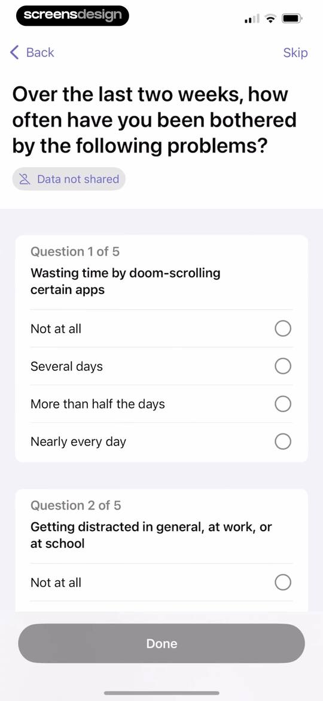
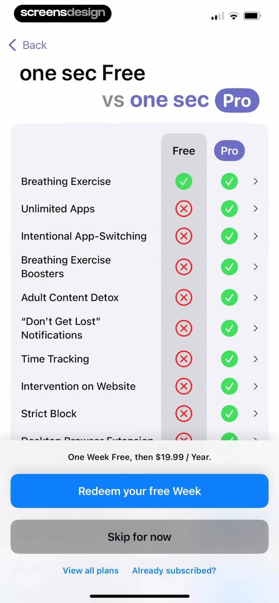
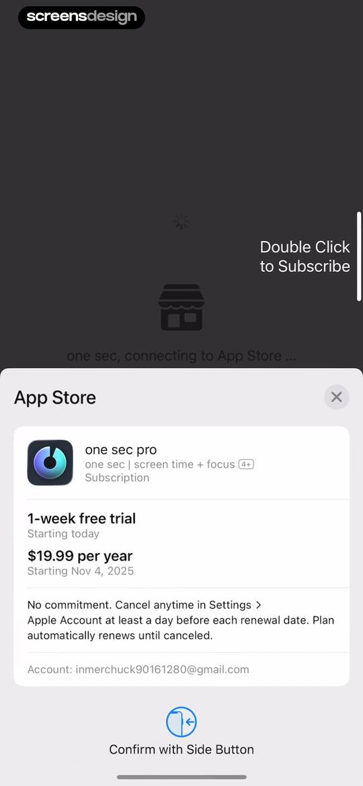
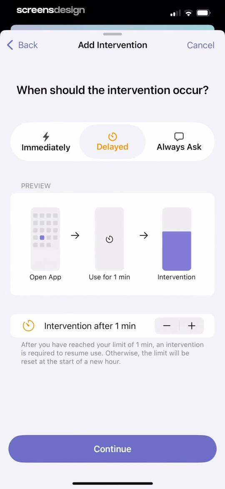
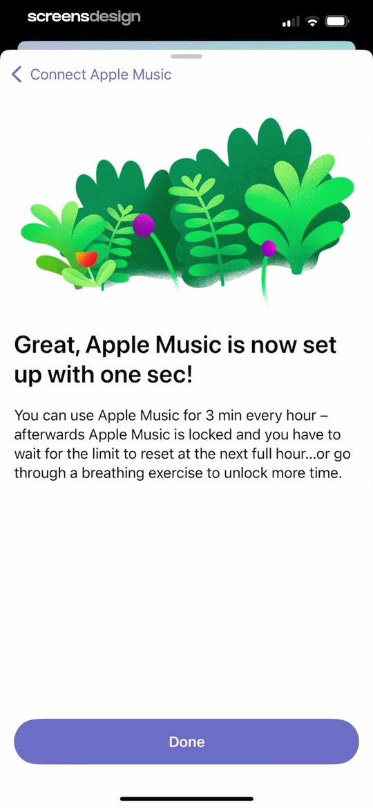
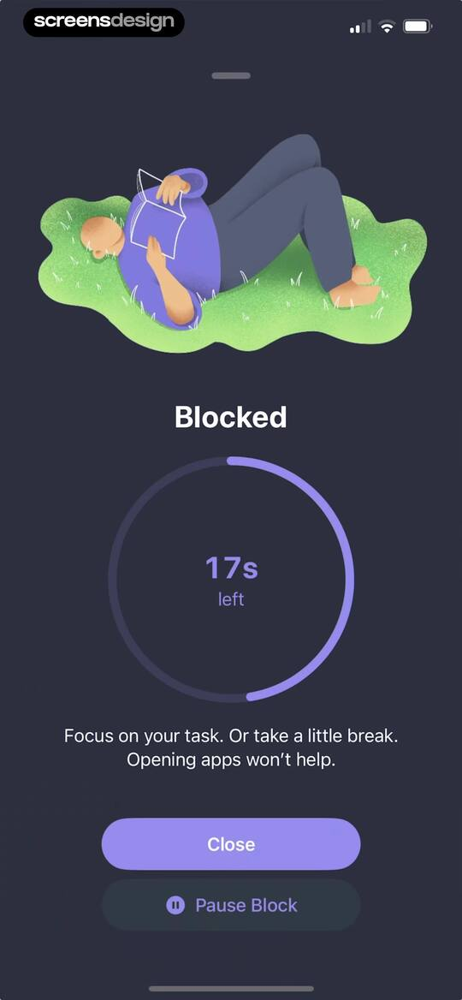
