# Opal: Screen Time Control Onboarding, Paywall & UX Flow — 164 Screens, $600k/mo

Source: https://screensdesign.com/apps/opal-screen-time-control/ (fetched 2026-10-05)

Stats: 

| # | Time | Image | What the screen shows |
|---|---|---|---|
| 1 | 00:00 |  | Loading screen with a centered spinner on a solid black background. |
| 2 | 00:03 | 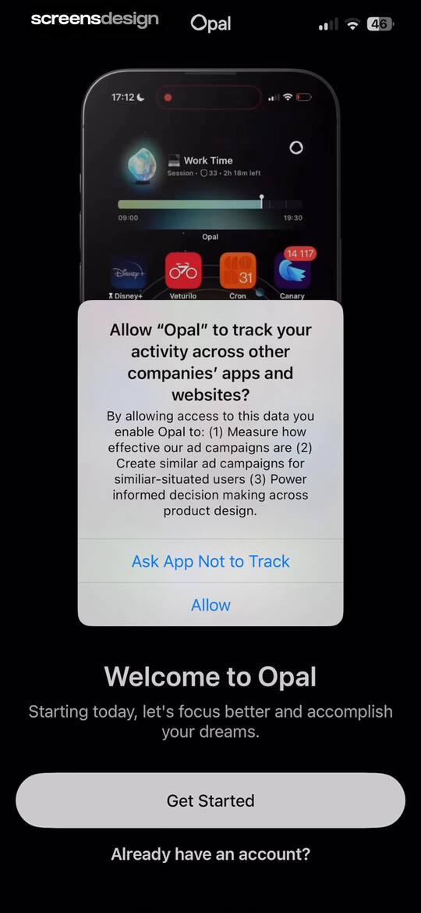 | System permission modal requesting tracking access overlaid on a dark-themed Opal onboarding screen with Get Started and Allow buttons. |
| 3 | 00:06 | 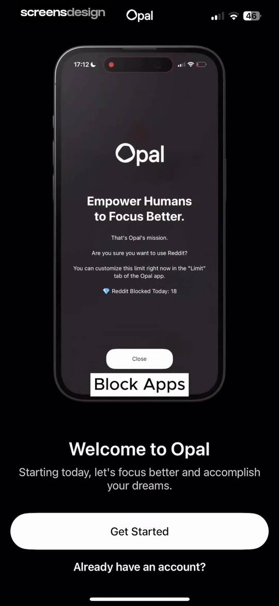 | Opal onboarding screen featuring a welcome message, product mockup showing an app-blocking notification, Get Started button, and sign-in link. |
| 4 | 00:10 | 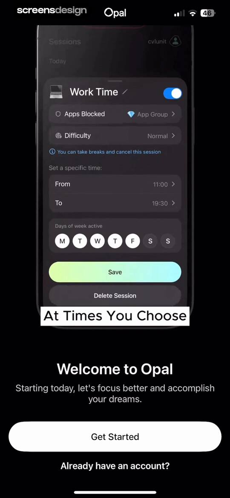 | Opal onboarding screen featuring a session configuration product mockup, a Get Started button, and an account login link in dark mode. |
| 5 | 00:16 | 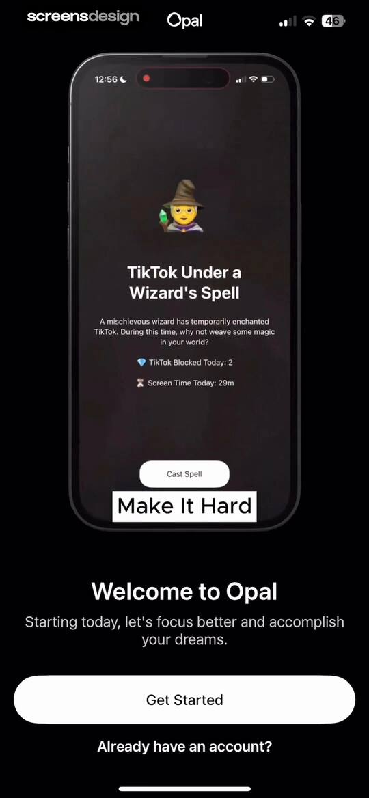 | Opal onboarding screen featuring a central product mockup of an app blocking feature, a welcome message, and a Get Started button. |
| 6 | 00:20 | 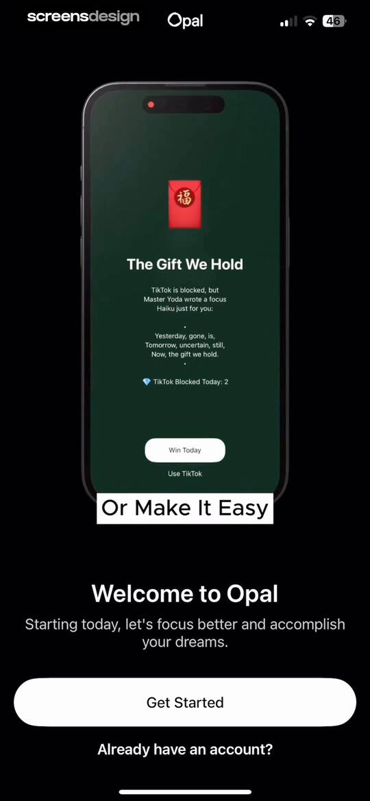 | Opal onboarding welcome screen with a product mockup, a Get Started button, and an account login link. |
| 7 | 00:25 | 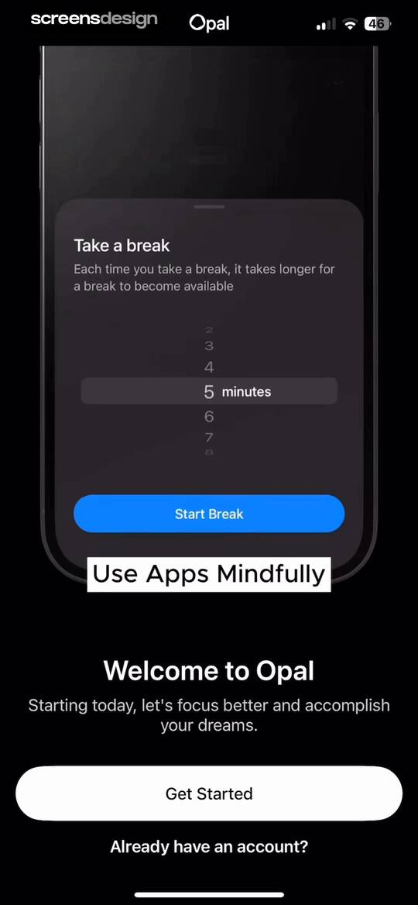 | Opal onboarding welcome screen with a product mockup, a Get Started button, and a sign-in link. |
| 8 | 00:33 | 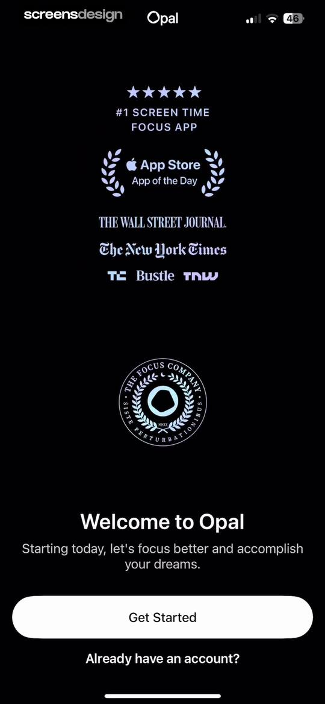 | Opal onboarding welcome screen displaying media press logos, a brand logo, and a Get Started button. |
| 9 | 00:41 | locked | Onboarding questionnaire asking for daily average screen time, with the 5-7 hours option selected and a Continue button. |
| 10 | 00:47 | locked | Onboarding screen asking what habit to change with a selectable list of digital habits and a Continue button. |
| 11 | 00:53 | locked | Opal app onboarding screen asking for age, with the 25 - 34 option selected and a Continue button. |
| 12 | 00:57 | locked | Onboarding screen asking for the user's occupation, with the Remote Worker option selected and a Continue button. |
| 13 | 01:01 | locked | Opal app loading screen displaying the text Calculating above a horizontal gradient progress bar on a black background. |
| 14 | 01:06 | locked | Loading screen for the Opal app with a progress bar and the text Preparing report on a black background. |
| 15 | 01:10 | locked | Opal onboarding screen with a top progress bar, centered text reading Some not-so-good news, and some great news., and a Continue button. |
| 16 | 01:14 | locked | Onboarding screen displaying screen time usage statistics with a progress bar at the top and a Continue button at the bottom. |
| 17 | 01:19 | locked | Opal app rating prompt modal featuring five star icons for rating, with Cancel and Submit buttons against a dark background. |
| 18 | 01:21 | locked | Feedback modal thanking the user with a five-star rating, a Write a Review button, and a Continue button. |
| 19 | 01:22 | locked | Opal app onboarding screen displaying a motivational statistic of 9 years+ reclaimed, with a progress bar and a Continue button. |
| 20 | 01:24 | locked | Opal app onboarding screen explaining the Screen Time connection, with a top progress bar and a Continue button. |
| 21 | 01:27 | locked | System permission modal requesting Screen Time access with a Continue button and privacy note. |
| 22 | 01:29 | locked | Loading screen from the Opal app with a black background, centering a spinner and the text Connecting to Screen Time. |
| 23 | 01:31 | locked | System permission request modal asking to allow Opal access to Screen Time, with Continue and Don't Allow buttons. |
| 24 | 01:33 | locked | Opal permissions screen requesting Screen Time access with an Allow with Face ID button and a Don't Allow link. |
| 25 | 01:38 | locked | Permission confirmation screen for the Opal app stating that Screen Time access has been approved, with a Done button. |
| 26 | 01:42 | locked | Opal onboarding screen showing personalized productivity goals with checkmarks, a fist-bump emoji, and a continue button. |
| 27 | 01:47 | locked | Opal splash screen featuring a central yellow fist icon surrounded by scattered decorative emojis against a dark background. |
| 28 | 01:49 | locked | Paywall screen featuring a before-and-after productivity comparison chart, progress timeline, and a free trial subscription offer with a Try for $0.00 button. |
| 29 | 02:00 | locked | iOS App Store subscription confirmation modal for the yearly plan with a one-week free trial and a prompt to confirm with the side button. |
| 30 | 02:05 | locked | Paywall screen with a purchase success confirmation modal stating You're all set, over a screen time comparison chart and a free trial button. |
| 31 | 02:12 | locked | Opal onboarding screen displaying a centered motivational message about unlocking gemstones along your focus journey on a black background. |
| 32 | 02:14 | locked | Opal app splash screen displaying a full-screen abstract background animation with purple and magenta tones. |
| 33 | 02:17 | locked | Achievement screen displaying a multicolored Driven Gem illustration with the text Focus for 10 hours against a black background. |
| 34 | 02:19 | locked | Achievement milestone screen displaying an iridescent orange gem and the text Commited Gem with Use Opal for 5 days. |
| 35 | 02:25 | locked | Gamification achievement screen featuring a First Gem milestone and a tap to reveal your gem button. |
| 36 | 02:30 | locked | Achievement screen in the Opal app with centered text reading Gem Unlocked and First Gem above a 3D iridescent gemstone graphic. |
| 37 | 02:33 | locked | Opal app onboarding completion screen featuring a glowing gemstone illustration and a Save button. |
| 38 | 02:38 | locked | Opal app onboarding screen displaying a centered motivational message about building focus habits on a black background. |
| 39 | 02:41 | locked | Opal app loading screen featuring a centered white indicator and bottom instruction to swipe up and continue. |
| 40 | 02:45 | locked | Opal app splash screen featuring a centered glowing flame icon and an etymology quote about the word focus on a dark background. |
| 41 | 02:53 | locked | Opal app streak dashboard displaying a one-day focus streak with a central flame graphic, weekly calendar row, and etymological definition. |
| 42 | 03:11 | locked | Opal account creation screen in dark mode with an email field, a Create account button, and alternative sign-up options. |
| 43 | 03:21 | locked | Opal onboarding screen asking for a unique gem name, featuring a pre-filled username input field and a Continue button. |
| 44 | 03:25 | locked | Opal app onboarding screen featuring a social screen time leaderboard, an avatar cluster, and an Add Friends button. |
| 45 | 03:28 | locked | Permission request modal asking to access contacts, overlaying a contact list with a Continue button. |
| 46 | 03:31 | locked | Permission request screen for the Opal app asking how to share three contacts, with buttons to select specific contacts or share all. |
| 47 | 03:34 | locked | Social onboarding screen prompting users to invite friends from a contact list with a search bar and a Next button. |
| 48 | 03:38 | locked | Message composition screen pre-filled with an Opal app referral invitation and a recipient field. |
| 49 | 03:41 | locked | Social onboarding screen prompting users to invite friends from their contacts, featuring a search bar, contact list with invite buttons, and a Next button. |
| 50 | 03:43 | locked | Opal app onboarding screen with a centered welcome message about focus and a Continue button at the bottom. |
| 51 | 03:46 | locked | Onboarding screen explaining how the app works with educational text, a pagination indicator, and a Next button. |
| 52 | 03:47 | locked | Opal onboarding screen explaining how focus schedules work, with a session list mock and a Next button. |
| 53 | 03:49 | locked | Opal app onboarding screen showcasing a screen time dashboard and real-time focus tracking with a Continue button. |
| 54 | 03:52 | locked | Opal onboarding screen prompting the user to select up to 3 distracting apps, featuring a central cluster of app icons and a Select Apps button. |
| 55 | 04:02 | locked | Activity selection form featuring a search bar, a list of app categories with three selected items, and Save and Cancel buttons. |
| 56 | 04:05 | locked | Opal app notification permission request screen with a system modal and a visual arrow pointing to the Allow button. |
| 57 | 04:07 | locked | Opal app notification permission request screen displaying a system modal with Don't Allow and Allow buttons over a dark onboarding background. |
| 58 | 04:12 | locked | Onboarding screen asking how the user heard about the app, with TikTok selected in the channel list and a Continue button. |
| 59 | 04:15 | locked | Splash screen for Opal: Screen Time Control featuring a minimalist white logo with a laurel wreath and text on a solid black background. |
| 60 | 04:16 | locked | Blocks dashboard for Opal showing active Work Time, upcoming Weekend Zen, and quick action buttons for scheduling sessions and setting app limits. |
| 61 | 04:18 | locked | Active focus session dashboard with a remaining time countdown, block list and difficulty details, and a Take a Break button. |
| 62 | 04:21 | locked | Focus session dashboard displaying a timeline from 9:00 AM to 5:00 PM, control cards for block list and normal difficulty, and Take a Break and Leave Early action buttons. |
| 63 | 04:22 | locked | Active work session dashboard with remaining time, configuration cards, and bottom action buttons to take a break or leave early. |
| 64 | 04:25 | locked | Focus session dashboard displaying a countdown timer, detail cards, and a modal explaining how to take a break, with Take a Break and Leave Early buttons. |
| 65 | 04:27 | locked | Opal app focus session dashboard showing a remaining work time countdown, settings cards, timeline slider, and a Take a Break button. |
| 66 | 04:30 | locked | Opal app focus session dashboard displaying a remaining time countdown, block list, normal difficulty setting, and a Take a Break button. |
| 67 | 04:35 | locked | Break duration selection screen featuring a vertical time picker set to 1 minute and a light-green Select button. |
| 68 | 04:42 | locked | Break timer screen with a mountain lake background, a progress slider, and an End Break button. |
| 69 | 04:46 | locked | Blocks dashboard showing active Work Time session with countdown, upcoming Weekend Zen schedule, and quick actions for new blocks. |
| 70 | 04:51 | locked | Focus session overlay from the Opal app with a countdown timer, motivational text, and a forced delay button. |
| 71 | 04:52 | locked | Focus session interruption screen in the Opal app with a countdown timer, central illustration, and a Wait for 3s button. |
| 72 | 04:54 | locked | Opal focus session screen displaying a remaining work time countdown, a central mute button, and a primary action button to wait. |
| 73 | 04:59 | locked | Focus session dashboard showing a remaining work time countdown, block list, normal difficulty setting, and action buttons to take a break or leave early. |
| 74 | 05:03 | locked | Block List settings screen with selected categories, an adult blocking toggle, and Save and Delete buttons. |
| 75 | 05:05 | locked | Form modal in Opal for naming a block list with a text input field, system keyboard, and category list background. |
| 76 | 05:14 | locked | Activity selection screen with a scrollable list of app categories, three categories selected, a summary indicator, and Save and Cancel buttons. |
| 77 | 05:21 | locked | Block List settings screen with categories, apps list, adult blocking toggle, and a saved confirmation modal. |
| 78 | 05:26 | locked | Category selection form showing three categories selected with a search bar and a Save button. |
| 79 | 05:30 | locked | Error modal stating a screen crash occurred while opening the Other category, with Reload and Dismiss buttons. |
| 80 | 05:41 | locked | Opal app selection form listing apps, websites, and categories to block, with a summary of selected items and Save and Cancel buttons. |
| 81 | 05:47 | locked | Settings screen displaying a block list of website URLs, an Adult Blocking toggle with a warning note, and Save and Delete buttons. |
| 82 | 05:56 | locked | App blocking management dashboard displaying a block list with categories, an app list showing eleven selected apps, and a Create New button. |
| 83 | 05:59 | locked | Opal app settings screen displaying block list configuration options, an adult blocking toggle with a warning note, and a centered Saved confirmation modal. |
| 84 | 06:05 | locked | Activity selection form with a list of app categories, showing two categories selected and a Save button. |
| 85 | 06:14 | locked | Block list configuration screen with category and app selection lists, an adult blocking toggle, and Save and Delete buttons. |
| 86 | 06:16 | locked | Confirmation modal asking to delete an app block list, with Yes and Nevermind buttons over a dark configuration screen. |
| 87 | 06:24 | locked | Session difficulty selection modal with Normal, Timeout, and Deep Focus options, featuring the Normal option selected with a checkmark. |
| 88 | 06:27 | locked | Active work session dashboard showing a remaining countdown timer of seven hours, side-by-side setting cards, and a Take a Break button. |
| 89 | 06:33 | locked | Support screen with frequently asked questions, browse topics lists, and a Contact us button. |
| 90 | 06:42 | locked | Help center article titled Blocking doesn't seem to be working, featuring an embedded troubleshooting video and instructional text. |
| 91 | 06:46 | locked | Opal app dashboard displaying a tutorial video, screen time metrics, an activity chart, and a Block Now action button. |
| 92 | 06:50 | locked | Dashboard screen showing an analytics overview with a focus score and screen time usage below a video player titled Case 1: Nothing Works. |
| 93 | 06:53 | locked | Video player overlay displaying a playback speed menu with options from 0.5x to 2.0x over a screen time dashboard. |
| 94 | 06:56 | locked | Video player overlay on a productivity dashboard with a centered subtitle selection menu and bottom navigation. |
| 95 | 07:02 | locked | Help center article in the Opal app titled Blocking doesn't seem to be working, featuring a video player and troubleshooting text. |
| 96 | 07:19 | locked | Opal app intervention modal prompting the user to take a 15-minute break from app blocking, with a Take 15m Break button and a Leave Early option. |
| 97 | 07:22 | locked | Opal blocks dashboard displaying upcoming focus sessions, quick action buttons for scheduling and limits, and a prominent Block Now button. |
| 98 | 07:27 | locked | Settings screen for block screens with categorized card lists and toggle switches for curated and AI personality options. |
| 99 | 07:34 | locked | Session configuration editor for Weekend Zen with time pickers, active day selectors, and a Save button. |
| 100 | 07:38 | locked | Focus session editor with a schedule overlap warning, configuration options for Weekend Zen, and Save and Delete Session buttons. |
| 101 | 07:47 | locked | Time picker modal overlay with a scrolling wheel and a Done button to set a start time for an event. |
| 102 | 07:52 | locked | Time picker modal overlaying a block settings screen, with a 12:00 PM time selection and a gradient Done button. |
| 103 | 07:54 | locked | Modal session configuration screen for Weekend Zen with settings for blocked apps, time range, and active days, featuring a Save button. |
| 104 | 08:00 | locked | Focus session configuration modal for Work Time with time pickers, active days, and a Save button. |
| 105 | 08:02 | locked | Vacation prompt modal in the Opal app asking whether to temporarily disable or permanently delete a focus session. |
| 106 | 08:08 | locked | Duration selection modal overlay on a dark background dashboard, featuring a 6 days duration picker and action buttons to disable the session. |
| 107 | 08:14 | locked | Opal focus session configuration editor with event settings, a session overlap warning, and a Save button. |
| 108 | 08:19 | locked | Active focus session dashboard in the Opal app showing remaining time, session settings, and a Take a Break button. |
| 109 | 08:28 | locked | App blocking rule configuration modal with settings for time limits, target apps, blocking duration, and a Save button. |
| 110 | 08:35 | locked | Form modal for setting a time limit and selecting days of the week, with a time picker and a Done button. |
| 111 | 08:40 | locked | Activity selection screen with a dark theme listing app categories, with one category selected and a Save button at the bottom. |
| 112 | 08:44 | locked | Opal app blocking duration modal featuring a time picker set to 15 minutes, a gradient Done button, and Until tomorrow option. |
| 113 | 08:47 | locked | Opal app onboarding modal providing instructions to disable Share Across Devices in screen time settings, with Done and Don't Show Again buttons. |
| 114 | 08:51 | locked | App Lock configuration form in Opal with settings for locked apps, unlock limits, duration, and a Save button. |
| 115 | 08:56 | locked | Error modal in the Opal app with an apology message, a Reload button, and a Dismiss button over a dark background. |
| 116 | 09:04 | locked | App selection screen titled Choose Activities with a search bar, a list showing Facebook selected, and Save and Cancel buttons in the footer. |
| 117 | 09:11 | locked | Opal app modal overlay for setting an unlock duration, with a vertical picker showing 5 minutes selected and a Done button. |
| 118 | 09:15 | locked | Difficulty selection modal for app lock settings with the Can Be Reset option selected. |
| 119 | 09:22 | locked | App lock configuration modal with daily limit settings, day-of-week selectors, and a Save button. |
| 120 | 09:25 | locked | Opal app lock screen over a mountain lake photo showing a locked status with five remaining unlocks and an Unlock for 5m button. |
| 121 | 09:30 | locked | App lock screen displaying an unlocked status with a countdown timer, a timeline slider, and a Relock Apps button. |
| 122 | 09:37 | locked | Blocks dashboard listing schedule templates like sleep and gym time, with an active session timer and bottom navigation. |
| 123 | 09:40 | locked | App limit configuration form with time limit and blocking behavior sections, featuring a Save button. |
| 124 | 09:42 | locked | App blocking configuration screen displaying a modal alert with an error message requiring app selection and an OK button. |
| 125 | 09:48 | locked | App selection form with a dark theme, showing one selected app in the Health and Fitness category, a status indicator, and Save and Cancel buttons. |
| 126 | 09:52 | locked | Opal app onboarding instructional modal with a Share Across Devices toggle, a Done button, and a Don't Show Again button. |
| 127 | 09:57 | locked | Opal dashboard showing focus score analysis with a loading progress bar, referral banner, and an Explore Milestones button. |
| 128 | 10:01 | locked | Referral screen displaying a 30-day guest pass offer, referral code, Add Friends and Share Referral Link buttons, and reward progress. |
| 129 | 10:04 | locked | Opal app share sheet displaying a 30-day guest pass promotion card, link preview, sharing contacts, and system actions. |
| 130 | 10:09 | locked | Opal referral dashboard displaying a 30-day guest pass, unique referral code EFP8D, add friends and share link buttons, and a progress tracker. |
| 131 | 10:17 | locked | Opal milestones dashboard displaying a one-day focus streak, milestone grid, total focus hours summary, and progress tracking buttons. |
| 132 | 10:24 | locked | Opal app achievement screen displaying the First Gem milestone with an iridescent gemstone illustration, unlock date, and a Current Gem button. |
| 133 | 10:28 | locked | Share sheet overlay on a dark background showing contact suggestions, app sharing options, and action buttons for a First Gem achievement. |
| 134 | 10:31 | locked | System permission modal requesting photo library access with Allow Full Access, Limit Access, and Don't Allow buttons over a milestone screen. |
| 135 | 10:47 | locked | Blocks dashboard listing scheduled focus sessions with an active session timer and bottom navigation. |
| 136 | 10:48 | locked | Leaderboard dashboard in the Opal app with a friend list, Find Friends button, and active focus session timer. |
| 137 | 10:54 | locked | Social invitation screen with a search bar, a list of contact cards featuring invite buttons, and a bottom Done button. |
| 138 | 10:59 | locked | Message composer containing a rich link preview card for the Opal app with a referral code and a system keyboard. |
| 139 | 11:07 | locked | User profile screen displaying focus statistics, streak and focus hour cards, achievement icons, and a weekly time-range selector with the Profile tab selected. |
| 140 | 11:11 | locked | Photo picker grid displaying the First Gem milestone card alongside user photo thumbnails and a search bar. |
| 141 | 11:19 | locked | Opal app milestones dashboard with a 1 day streak hero, progress bar, milestone achievement grid, and focus hours summary. |
| 142 | 11:23 | locked | Profile dashboard displaying productivity metrics, day streak and focus hours cards, time-range tabs, and a persistent active session sheet. |
| 143 | 11:34 | locked | Profile screen displaying screen time stats with a central referral card and a Share Referral Link button. |
| 144 | 11:44 | locked | Dashboard displaying a promotional keynote card, a friends screen time section with an add friends button, community statistics, and a session timer. |
| 145 | 11:47 | locked | Subscription status screen for Opal Pro showing membership details, renewal date, and a list of active premium features. |
| 146 | 11:51 | locked | User profile settings screen displaying a Pro status card at the top, followed by account and social settings lists with a dark theme. |
| 147 | 11:57 | locked | Dark-themed photo picker with a top navigation bar, search bar, and a grid of photo thumbnails including a First Gem milestone graphic. |
| 148 | 12:01 | locked | Opal app modal form for renaming a Gem, with an input field containing Bismutotantalite0174 and a Continue button. |
| 149 | 12:04 | locked | Email verification modal over the Opal app account settings page, with buttons to send a verification email or edit the address. |
| 150 | 12:10 | locked | Password confirmation form in the Opal app with an email field, password input, and Sign in button. |
| 151 | 12:13 | locked | Opal onboarding phone number entry screen with a country code selector, an empty input field, and a Next button. |
| 152 | 12:17 | locked | Onboarding screen asking for occupation with a list of options, Remote Worker selected, and a Continue button. |
| 153 | 12:23 | locked | Social empty state screen in the Opal app with Memoji avatars, a My Friends heading, and an Add Friends button. |
| 154 | 12:29 | locked | Referral code entry modal in the Opal app with a text input field and a disabled Continue button. |
| 155 | 12:34 | locked | Notification settings screen with a vertical list of toggle cards for reminders, service, app limits, and screentime reports in the Opal app. |
| 156 | 12:38 | locked | Notification settings modal in dark mode with a list of four enabled toggle cards and a bottom disable button. |
| 157 | 12:42 | locked | Permission request modal for Opal asking to access the camera to scan QR codes, with Don't Allow and Allow buttons. |
| 158 | 12:50 | locked | Opal settings menu with grouped sections for blocking preferences, help, and support, featuring options like App Uninstall Protection and Support Chat. |
| 159 | 13:01 | locked | Support chat screen in the Opal app displaying subscription details from Opal AI, quick-reply chips, and a text input field. |
| 160 | 13:05 | locked | Support options modal with options to report a bug, suggest an improvement, or ask a question, and a cancel button. |
| 161 | 13:12 | locked | Support screen for the Opal app featuring a list of FAQs, topic categories, and a Contact us button at the bottom. |
| 162 | 13:17 | locked | Opal guest pass referral screen displaying a unique code, Add Friends and Share Referral Link buttons, and a progress tracker showing 0 of 1 referrals. |
| 163 | 13:19 | locked | Opal app share sheet displaying a 30-day Guest Pass promotional card, link preview, contact suggestions, and sharing options. |
| 164 | 13:29 | locked | Privacy policy web page displaying the introduction to Opal data principles, featuring a Download App button and a Done control. |

## Free showcase screenshots (unordered)

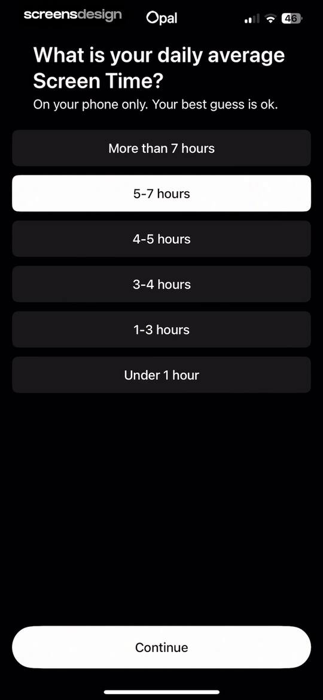
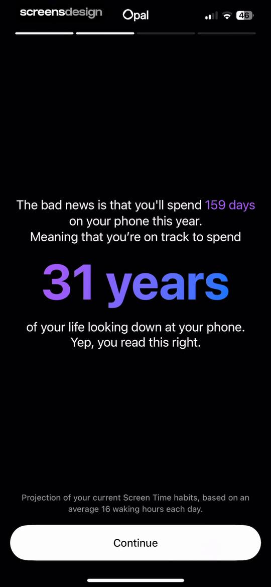
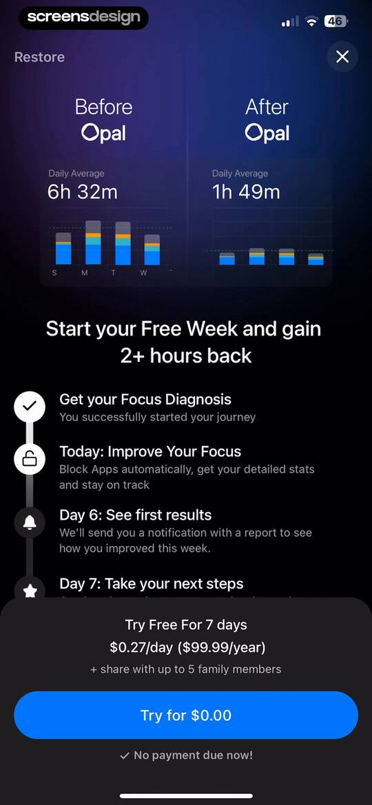
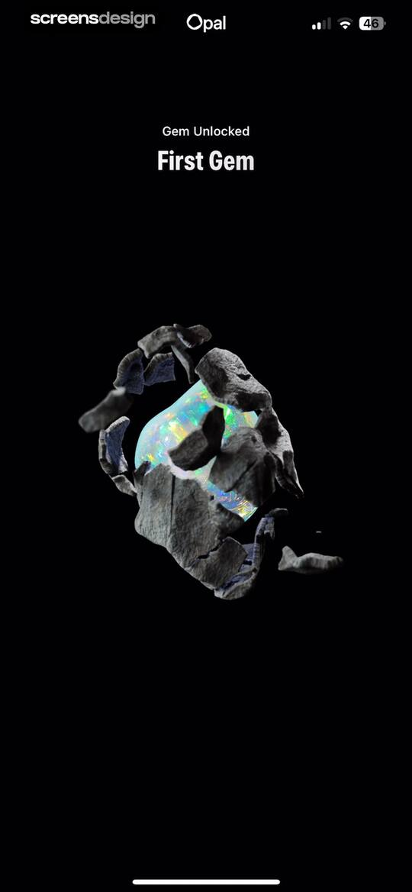
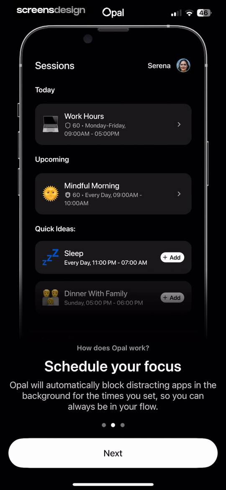
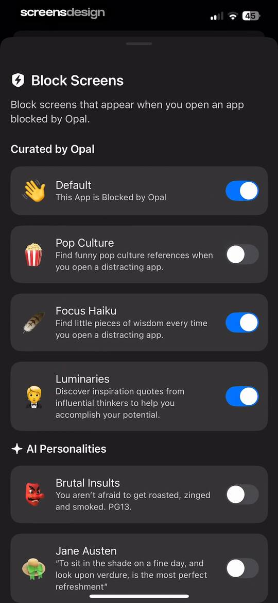
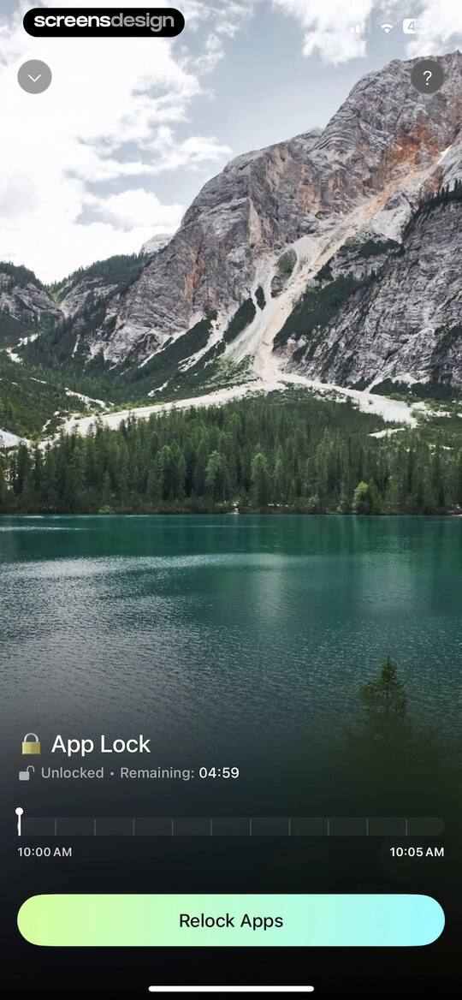
