# prayer lock: christian focus Onboarding, Paywall & UX Flow — 108 Screens, $75k/mo

Source: https://screensdesign.com/apps/prayer-lock-christian-focus/ (fetched 2026-10-05)

Stats: 

| # | Time | Image | What the screen shows |
|---|---|---|---|
| 1 | 00:00 |  | Permission request screen asking to allow tracking across other apps, featuring a religious padlock icon and an Allow button. |
| 2 | 00:01 | 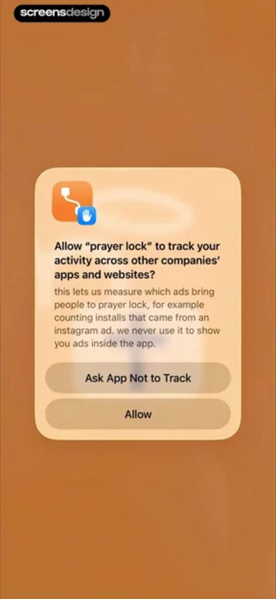 | App Tracking Transparency permission modal for prayer lock, asking to track activity across other apps with stacked Allow and Ask App Not to Track buttons. |
| 3 | 00:03 |  | Onboarding screen with a progress indicator, an illustration of Jesus and a sheep, and an orange continue button. |
| 4 | 00:06 | 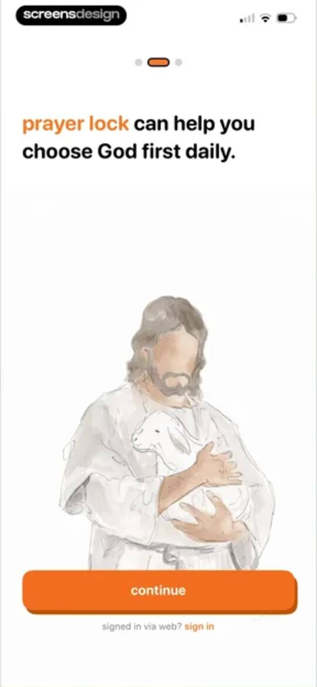 | Onboarding screen featuring an illustration of Jesus with a lamb, a progress indicator, an orange continue button, and a sign-in link. |
| 5 | 00:10 |  | Onboarding screen explaining the app-blocking feature with pagination dots, headline text, and four app icons featuring lock overlays. |
| 6 | 00:13 | 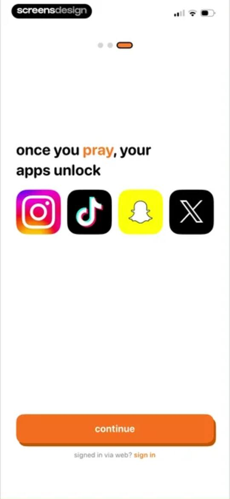 | Onboarding screen featuring the headline once you pray, your apps unlock with four app icons and a continue button. |
| 7 | 00:22 | 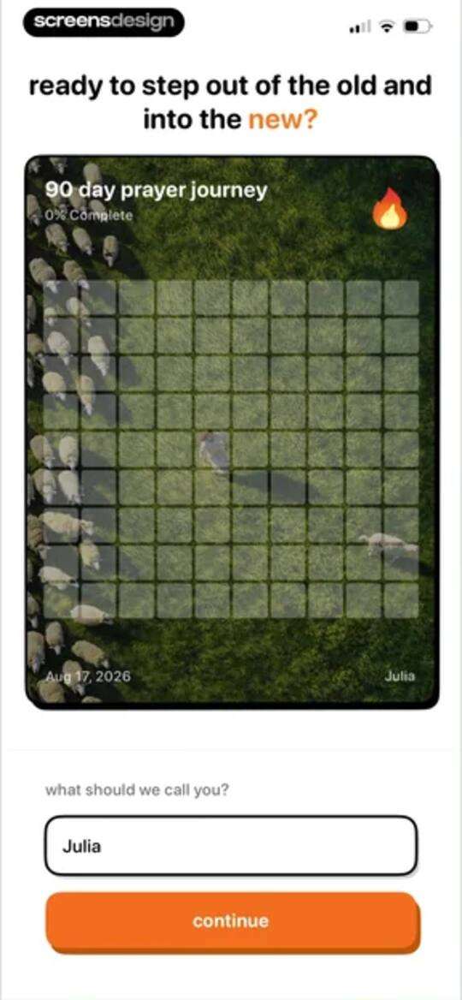 | Onboarding screen featuring a 90 day prayer journey progress card, a name input field pre-filled with Julia, and a continue button. |
| 8 | 00:25 | 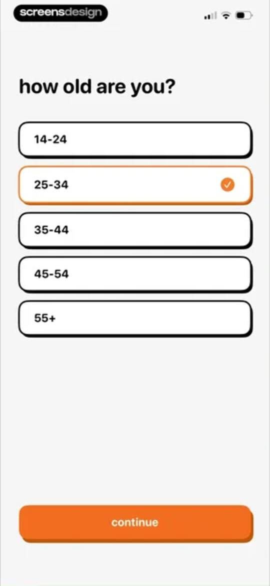 | Onboarding screen asking how old are you with a vertical list of age ranges, the 25-34 option selected, and a continue button. |
| 9 | 00:31 | locked | Onboarding screen asking for daily phone usage with an 8 hours per day slider input and a continue button. |
| 10 | 00:34 | locked | Onboarding screen displaying a personalized screen-time statistic about phone usage with an exploding head emoji and a continue button. |
| 11 | 00:37 | locked | Onboarding screen displaying a motivational Bible reading statistic with an open book illustration and a continue button. |
| 12 | 00:41 | locked | Onboarding screen featuring a dove illustration, encouraging text about giving years back to God, and a continue button. |
| 13 | 00:47 | locked | App rating prompt modal overlaying social proof elements, with a star rating selection, Submit and Cancel buttons, and a bottom continue button. |
| 14 | 00:48 | locked | Feedback modal overlay displaying a thank you message, rating stars, and a Write a Review button above a continue button. |
| 15 | 00:50 | locked | Onboarding social proof screen featuring user testimonials, a top-rated badge, and a continue button. |
| 16 | 00:55 | locked | Onboarding screen asking for Christian denomination, with catholic selected from a list of five options and a continue button. |
| 17 | 00:59 | locked | Permission request screen for the prayer lock app featuring a notification preview card and an Allow button at the bottom. |
| 18 | 01:01 | locked | Permission request screen for the prayer lock app featuring a system modal asking to send notifications, with Allow and Don't Allow buttons. |
| 19 | 01:06 | locked | Onboarding survey asking where the user heard about the app, with the Other option selected and a continue button. |
| 20 | 01:08 | locked | Prayer habit app onboarding screen featuring two content cards explaining the gamified kingdom and sheep mechanics, with a continue button. |
| 21 | 01:15 | locked | Prayer Lock onboarding screen displaying user testimonials in a video carousel, social proof metrics, and a join call-to-action button. |
| 22 | 01:17 | locked | Paywall screen featuring a testimonial video and a dark orange join prayer lock button at the bottom. |
| 23 | 01:38 | locked | Paywall screen outlining a 7-day spiritual guide, featuring an orange try for $0.00 button and pricing of $39.99 per year. |
| 24 | 01:39 | locked | Paywall screen outlining a seven-day spiritual journey with content cards, pricing details, and a try for zero dollars button. |
| 25 | 01:42 | locked | Paywall screen offering a free trial with no payment due now, featuring a reminder illustration and a continue for free button. |
| 26 | 01:45 | locked | Paywall screen comparing a free 3-day trial and a weekly subscription plan, with social proof and a Continue button. |
| 27 | 01:49 | locked | Subscription checkout modal for Prayer Lock showing a 3-day free trial at $39.99 per year and a confirm with side button prompt. |
| 28 | 01:54 | locked | Paywall screen with a successful purchase confirmation modal displaying You're all set and an OK button. |
| 29 | 02:00 | locked | Onboarding gender selection screen with woman selected and a continue button. |
| 30 | 02:03 | locked | Home screen displaying a kingdom modal overlay with instructions for growing a gamified prayer island and a Got It button. |
| 31 | 02:04 | locked | Dashboard with an informational modal explaining the 90-day prayer journey feature, featuring a zero-day streak and a got it button. |
| 32 | 02:06 | locked | Sign-in modal overlay on a community screen with social authentication buttons and a bottom navigation bar. |
| 33 | 02:09 | locked | Legal consent modal featuring terms of use and privacy policy cards, an I agree button, and an I disagree link. |
| 34 | 02:12 | locked | Prayer Lock app sign-in screen with a Google authentication modal, Apple and Google sign-in buttons, and a community post preview in the background. |
| 35 | 02:23 | locked | Profile customization screen featuring form fields for name, bio, favorite verse, gender, and denomination, with an onboarding modal overlay and customize profile button. |
| 36 | 02:26 | locked | Profile settings form with input fields for display name and bio, plus selection options for favorite verse, gender, and denomination. |
| 37 | 02:27 | locked | Profile settings screen with input fields for display name and bio, an avatar section, and selection buttons for favorite verse, gender, and denomination. |
| 38 | 02:30 | locked | Permissions screen for the prayer lock app displaying a photo grid and a private access notification. |
| 39 | 02:33 | locked | Photo selection screen displaying a central portrait preview with Cancel and Choose buttons in a dark theme. |
| 40 | 02:47 | locked | Bible book selection screen with a search bar and a vertical list of Old Testament books under the heading pick your verse. |
| 41 | 02:50 | locked | Chapter selection screen for the Book of Psalms displaying a search bar and a grid of numbered chapter buttons. |
| 42 | 02:54 | locked | Verse selection screen for Psalms 83 featuring a search bar and a grid of numbered verse buttons from 1 to 18. |
| 43 | 02:56 | locked | Bible verse selection screen displaying a verse preview card for Psalms 83:18 with a search input and a set as my favorite verse action button. |
| 44 | 03:01 | locked | Profile settings screen displaying a favorite verse card, gender and denomination options with catholic and woman selected, and a save changes button. |
| 45 | 03:03 | locked | Community feed with a centered modal overlay prompting the user to share their first encouragement, featuring a make your first post button and skip link. |
| 46 | 03:21 | locked | Post editor modal with filled title and body text fields, a visibility toggle, and a submit button. |
| 47 | 03:30 | locked | Community feed displaying a modal overlay that confirms user encouragement with a say hi next button. |
| 48 | 03:33 | locked | Live chat screen with an onboarding modal overlay introducing real-time messaging, featuring a chat feed and a Got It dismiss button. |
| 49 | 03:35 | locked | Bible reading interface displaying Genesis 1 with an overlay modal prompting daily reading and a Got It button. |
| 50 | 03:38 | locked | Lock settings screen with an empty locked apps card, a prayer locks section featuring daily time toggles, and a modal overlay. |
| 51 | 03:42 | locked | Permission request modal asking to access Screen Time, overlaid on lock settings with a Continue and Don't Allow button. |
| 52 | 03:44 | locked | Permission request screen asking to allow access to Screen Time, with an Allow with Face ID button and a Don't Allow option. |
| 53 | 03:47 | locked | Permission confirmation screen showing that prayer lock has been approved to access Screen Time, with a Done button. |
| 54 | 03:56 | locked | Activity selection form titled Choose Activities with a vertical list of apps and categories and a bottom search bar. |
| 55 | 04:02 | locked | Lock settings screen displaying a modal overlay with the current prayer lock schedule and a Got It button. |
| 56 | 04:05 | locked | Prayer Lock settings menu with a centered feedback modal overlay and an orange Got it button. |
| 57 | 04:09 | locked | Onboarding modal explaining how to unlock blocked apps with a numbered progress indicator, app icons, and a next step button. |
| 58 | 04:13 | locked | Onboarding instruction modal explaining how to unlock apps with a prayer button, featuring a next step button and emergency unlock option. |
| 59 | 04:15 | locked | Onboarding instruction modal explaining how to unlock blocked apps with a notification, featuring a Got it button. |
| 60 | 04:24 | locked | Game dashboard featuring a central floating island in an isometric 3D space with status counters and bottom-right navigation buttons. |
| 61 | 04:26 | locked | Wardrobe customization screen displaying a voxel sheep character with a vertical category sidebar and a bottom item selection grid. |
| 62 | 04:41 | locked | Game expansion modal prompting the user to expand their island for 30 coins over a floating island background. |
| 63 | 04:44 | locked | Referral modal overlaying a pixel-art game interface with a share the gospel button and status indicators in the top right. |
| 64 | 04:47 | locked | Share sheet modal displaying a URL header and a grid of action buttons including AirDrop, Mail, and Copy. |
| 65 | 04:50 | locked | Instructional modal explaining the island planting mechanic with a got it button and status bar. |
| 66 | 04:52 | locked | Onboarding modal explaining the church building mechanic with instructions, progress counters in the top right, and a Got It button. |
| 67 | 04:54 | locked | Streak explanation modal with a flame icon and a got it button, explaining consecutive days of prayer to grow a virtual kingdom. |
| 68 | 04:59 | locked | Reward explanation modal detailing coin earnings from prayers, featuring a central heading and a Got it button. |
| 69 | 05:07 | locked | Game home screen showing a central voxel environment with three characters, a top status HUD, and a bottom-right vertical navigation menu. |
| 70 | 05:10 | locked | Home screen of Prayer Lock featuring a central kingdom visualization, a quick prayer button with a lock icon, and bottom navigation. |
| 71 | 05:24 | locked | Home screen showing a prayer journey progress card with a zero day streak, quick prayer button, and bottom navigation. |
| 72 | 05:39 | locked | Chat support screen in the Prayer Lock app showing a conversation history with the cofounder and an active input field with the system keyboard. |
| 73 | 05:44 | locked | Live chat screen within a community section, showing prayer messages and a bottom text input field with a message sending button. |
| 74 | 06:05 | locked | Chat screen displaying a community conversation with prayer requests, the live chat tab selected, and a bottom input field with an open keyboard. |
| 75 | 06:08 | locked | Community feed screen displaying user posts in a card-based layout with the posts tab selected and a post button. |
| 76 | 06:10 | locked | Community post screen showing an anonymous user's post with no comments yet and a comment input field at the bottom. |
| 77 | 06:12 | locked | Community post detail view showing an anonymous post with a delete option, an empty comments section, and a comment input field at the bottom. |
| 78 | 06:14 | locked | Post detail screen with a centered delete confirmation modal asking to delete the post, featuring cancel and delete buttons. |
| 79 | 06:28 | locked | Community post screen displaying a user post about a fresh start, a comment section, and a bottom comment input field with the community tab selected. |
| 80 | 06:34 | locked | Community prayer wall feed displaying user prayer request cards with amen buttons and a floating post button. |
| 81 | 06:37 | locked | Community prayer post screen displaying a user request from Kay7, a prayer response card, and an empty notes section with a leave a note input field. |
| 82 | 06:58 | locked | Prayer request submission form with a filled text area, a post as you toggle, and an orange submit button. |
| 83 | 07:03 | locked | Prayer post detail screen featuring a scripture reference, written prayer, notes section, and a comment input bar. |
| 84 | 07:10 | locked | Bible reading screen displaying Genesis 1 verses from the NKJV with a bottom navigation bar. |
| 85 | 07:14 | locked | Bible reading screen displaying verses from Genesis with a top translation menu showing NKJV selected and a bottom navigation bar. |
| 86 | 07:20 | locked | Chapter selection screen for Genesis showing a grid of fifty numbered buttons with chapter one highlighted, followed by a list of other book titles. |
| 87 | 07:34 | locked | Bible reader screen displaying Psalms 83 in the KJV translation with a floating highlight toolbar and the Bible tab selected. |
| 88 | 07:44 | locked | Note editor modal over a Bible verse with a text input field containing notes, a reference card, and a save button. |
| 89 | 07:53 | locked | Share sheet overlay displaying a horizontal app sharing row, a grid of action buttons, and a vertical list of utility actions. |
| 90 | 07:56 | locked | System permission modal requesting photo library access to choose a profile picture, overlaid on a Bible reading interface with bottom navigation. |
| 91 | 08:04 | locked | Background selection screen with a 3-column grid of image cards and a close button, titled pick a background. |
| 92 | 08:07 | locked | Background selection screen displaying a Bible verse preview over a nature photo and a share button at the bottom. |
| 93 | 08:17 | locked | Bible reading interface displaying Psalms 83 with a bottom sheet overlay showing one highlight, a user note, and a Done button. |
| 94 | 08:25 | locked | Lock settings screen displaying cards for locked apps and scheduled prayer locks, with the lock list tab selected in the bottom navigation bar. |
| 95 | 08:26 | locked | Activity selection list with categories like Games and Entertainment checked, featuring a top confirmation button and a bottom search bar. |
| 96 | 08:31 | locked | Lock settings screen displaying locked apps and prayer schedule cards with time toggles, an update button, and a bottom navigation bar. |
| 97 | 08:36 | locked | Prayer time edit form with a central time picker set to 12:05 AM, repeat settings, and save, cancel, and delete buttons. |
| 98 | 08:39 | locked | Repeat settings screen with a vertical list of days of the week, showing most days selected with orange checkmarks. |
| 99 | 08:46 | locked | Settings screen with categorized preference options, user profile details, and a done button in the top corner. |
| 100 | 08:50 | locked | Edit profile form with input fields for display name and bio, a profile photo, favorite verse section, and gender and denomination options. |
| 101 | 08:52 | locked | Profile edit screen with gender and denomination selection options, with woman and catholic selected in orange and a save changes button. |
| 102 | 08:55 | locked | Settings screen with profile options and a centered modal overlay requesting confirmation to delete the user account with a Continue button. |
| 103 | 09:04 | locked | Prayer mode settings modal with three options, the let me choose each time option selected with an orange accent, and a save button. |
| 104 | 09:06 | locked | Settings screen with a gender selection modal overlay featuring man and woman options, with woman selected in orange. |
| 105 | 09:08 | locked | Settings screen with a denomination selection modal overlay featuring Catholic selected in orange and a confirmation button. |
| 106 | 09:11 | locked | Settings screen featuring grouped sections for prayer personalization, support, legal information, and app version, with a top done button. |
| 107 | 09:14 | locked | Support chat screen in Prayer Lock featuring a message from cofounder Mau Baron and an input bar with a send button. |
| 108 | 09:21 | locked | Share sheet overlay displaying a text snippet from Prayer Lock and two rows of sharing options including AirDrop, Mail, and Copy. |

## Free showcase screenshots (unordered)

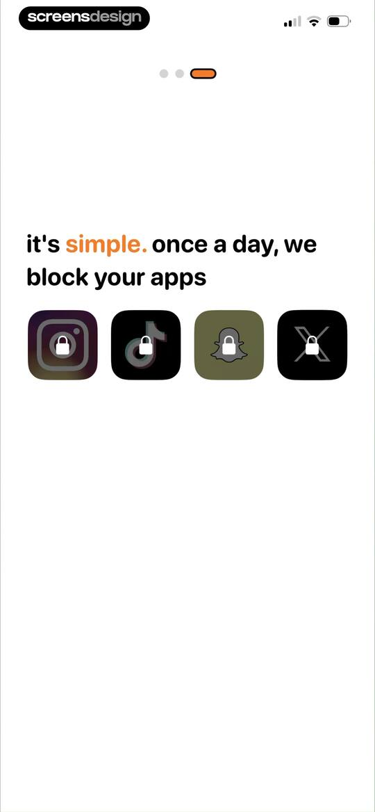
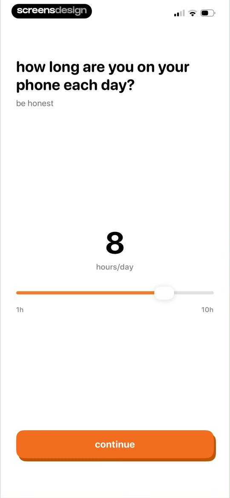
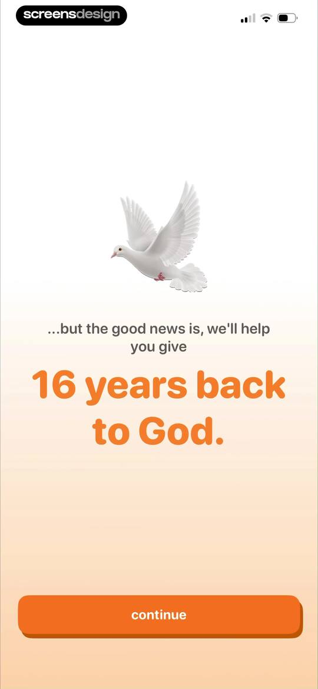
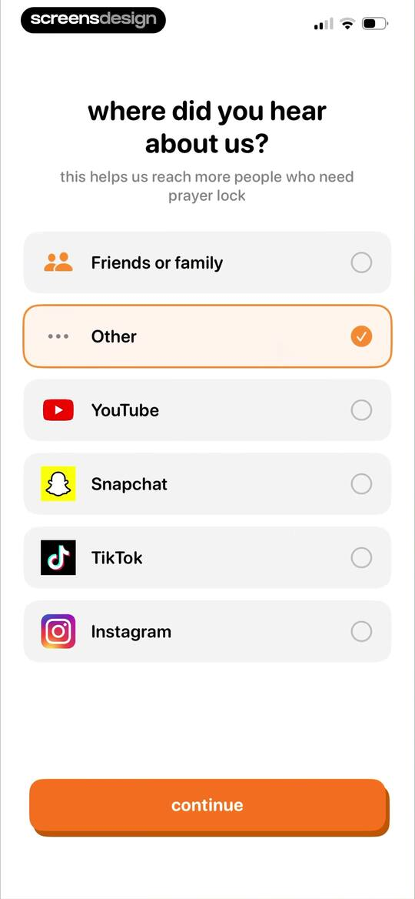

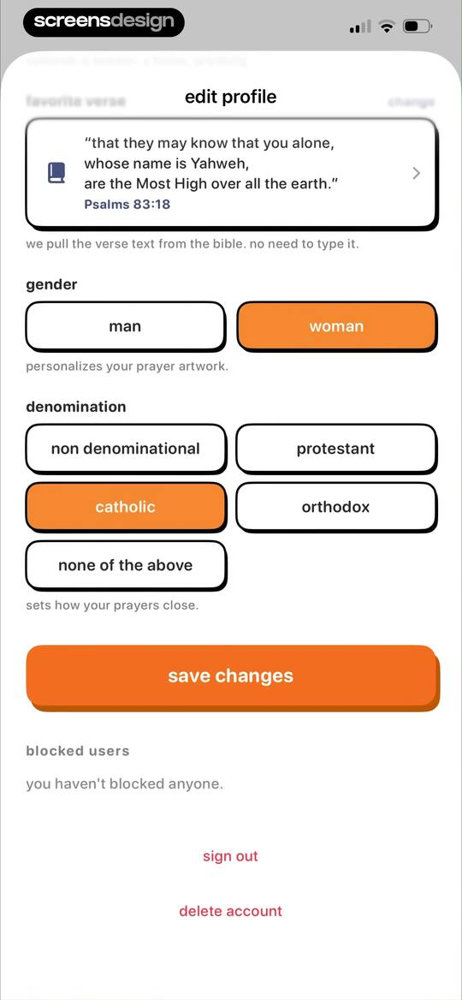
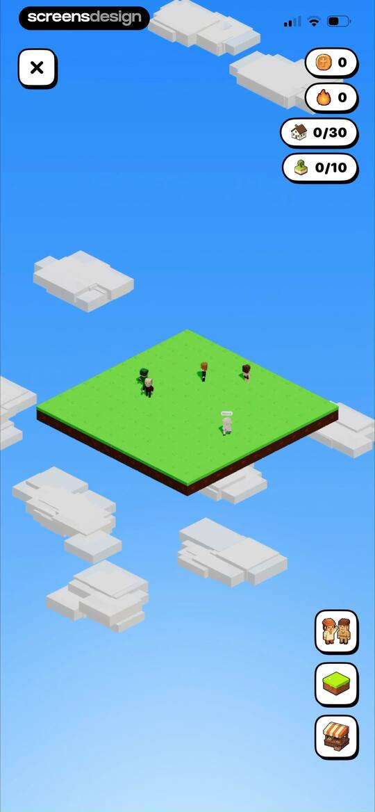
