# QUITTR - Break Free Now Onboarding, Paywall & UX Flow — 191 Screens, $25k/mo

Source: https://screensdesign.com/apps/quittr-quit-porn-now/ (fetched 2026-10-05)

Stats: 

| # | Time | Image | What the screen shows |
|---|---|---|---|
| 1 | 00:05 | 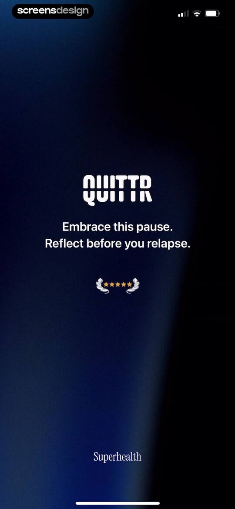 | QUITTR app mindfulness screen featuring a dark background, motivational text about reflection, a star rating icon, and Superhealth branding. |
| 2 | 00:07 | 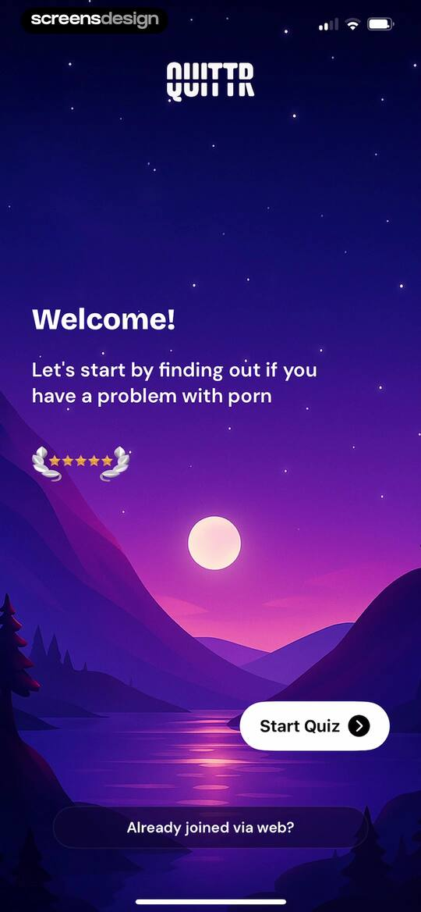 | QUITTR onboarding welcome screen with a five-star rating, a Start Quiz button, and a link for existing web users. |
| 3 | 00:09 | 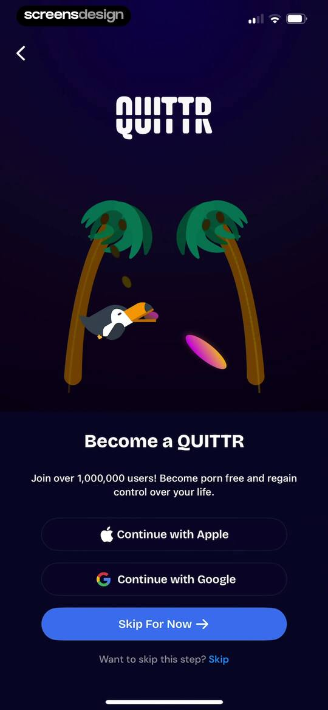 | QUITTR onboarding sign-up screen featuring a toucan illustration, social sign-in buttons, and a skip option on a dark background. |
| 4 | 00:12 | 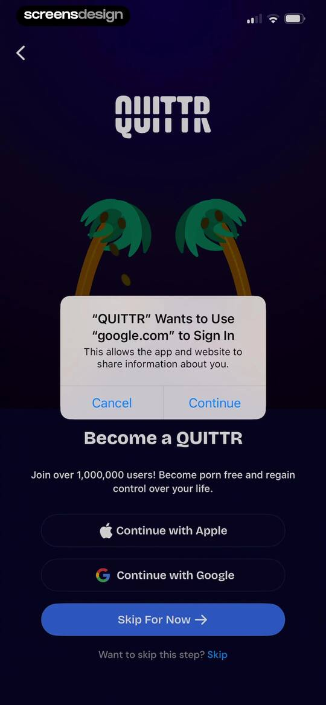 | QUITTR onboarding sign-up screen with social authentication buttons and a system modal requesting permission to sign in with Google. |
| 5 | 00:16 | 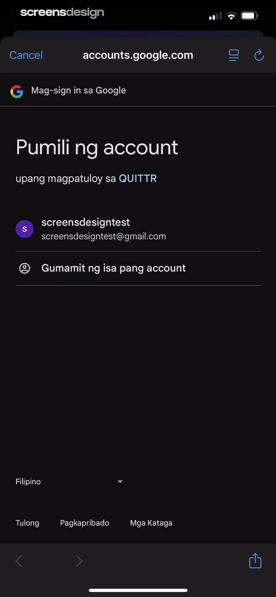 | Google account sign-in screen for QUITTR showing an account selection list and a Cancel button. |
| 6 | 00:19 | 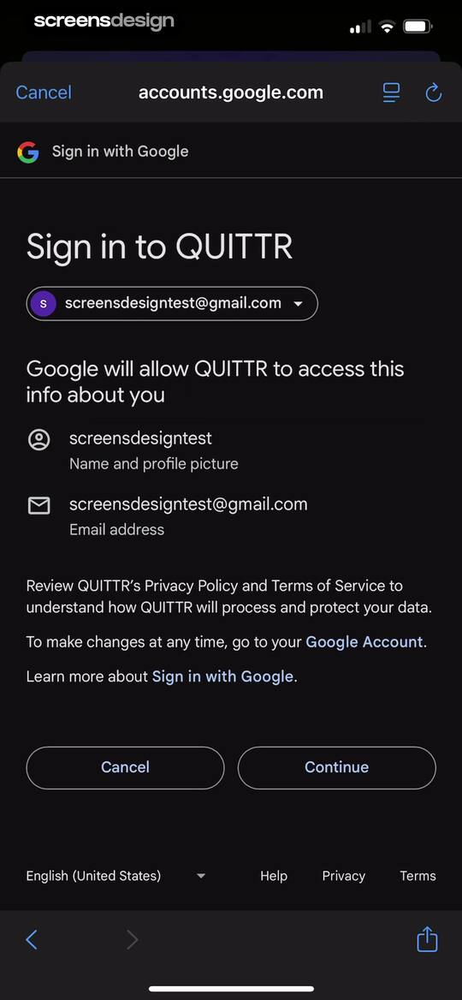 | Google sign-in permission screen for QUITTR showing account selection, requested profile access, and a Continue button. |
| 7 | 00:24 | 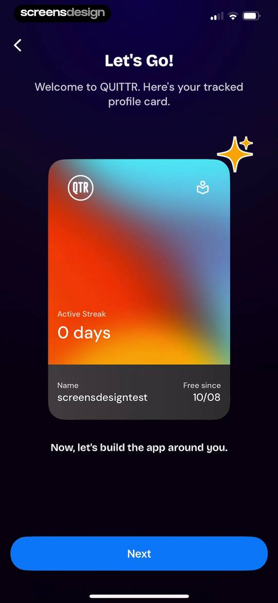 | QUITTR onboarding profile summary screen displaying a tracked user profile card and a Next button. |
| 8 | 00:29 |  | Onboarding questionnaire screen asking for gender, with the Female option selected and a Skip test button at the bottom. |
| 9 | 00:31 | locked | Onboarding assessment question about viewing frequency, with the Once a day option selected and a skip test link. |
| 10 | 00:35 | locked | Onboarding questionnaire asking where the user heard about the app, with the Google option selected and a Skip test link. |
| 11 | 00:37 | locked | Onboarding assessment question about material shifts, with Yes and No selection buttons and a skip link. |
| 12 | 00:39 | locked | Onboarding questionnaire screen asking about age of first exposure to explicit content, with the 13 to 16 option selected and a skip test link. |
| 13 | 00:41 | locked | Onboarding assessment question screen with three selectable option cards, displaying the selected option Occasionally and a skip link at the bottom. |
| 14 | 00:43 | locked | Onboarding assessment question screen with three selection cards, showing the Frequently option selected and a Skip test link at the bottom. |
| 15 | 00:45 | locked | Onboarding assessment question about stress and pornography use, with the rarely or never option selected and a skip test link at the bottom. |
| 16 | 00:47 | locked | Onboarding assessment question asking about pornography habits, with the frequently option selected and a skip test link at the bottom. |
| 17 | 00:49 | locked | Onboarding assessment question asking about spending money on explicit content, with Yes and No selection cards and a skip link. |
| 18 | 00:59 | locked | Onboarding profile setup screen with filled name and age inputs, a numeric keypad, and a Complete Quiz button. |
| 19 | 01:11 | locked | Loading screen showing a circular progress indicator at one hundred percent with the text calculating and finalizing. |
| 20 | 01:13 | locked | Assessment results screen displaying a dependence score comparison bar chart, a medical disclaimer, and a Check your symptoms button. |
| 21 | 01:20 | locked | Symptom selection onboarding form with categorized mental and physical cards, two selected options, and a Reboot my brain action button. |
| 22 | 01:29 | locked | Symptom selection form with categorized challenges and a Reboot my brain action button at the bottom. |
| 23 | 01:37 | locked | Onboarding screen for the QUITTR app with a brain illustration, explaining dopamine and featuring a progress indicator and Next button. |
| 24 | 01:40 | locked | QUITTR onboarding screen with an educational message about relationships and a Next button. |
| 25 | 01:43 | locked | QUITTR onboarding educational screen with a headline about porn shattering sex drive and a Next button. |
| 26 | 01:48 | locked | QUITTR onboarding educational screen explaining dopamine levels with a sad character illustration, pagination dots, and a Next button. |
| 27 | 01:57 | locked | QUITTR onboarding screen explaining the path to recovery with a plant illustration, pagination dots, and a Next button. |
| 28 | 01:59 | locked | QUITTR onboarding welcome screen featuring a flying person illustration, social proof press logos, and a Next button. |
| 29 | 02:04 | locked | QUITTR onboarding screen with a brain illustration, value proposition text, media logos, and a Next button. |
| 30 | 02:09 | locked | QUITTR onboarding screen with a central meditation illustration, social proof logos, and a Next button at the bottom. |
| 31 | 02:14 | locked | QUITTR onboarding screen featuring a security shield illustration, descriptive text about habit protection, press logos, pagination dots, and a Next button. |
| 32 | 02:19 | locked | QUITTR onboarding screen with a character illustration, progress description, media logos, pagination dots, and a Next button. |
| 33 | 02:24 | locked | Onboarding screen for the QUITTR app with a central success illustration, benefit description, press logos, and a Next button. |
| 34 | 02:29 | locked | Onboarding screen titled Rewiring Benefits displaying four expert and user testimonial cards about habit recovery, with a bottom Continue button. |
| 35 | 02:33 | locked | QUITTR onboarding screen comparing sobriety progress with conventional methods on a chart card, featuring a value proposition text and a Continue button. |
| 36 | 02:37 | locked | Onboarding goal selection screen listing selectable personal goals with two options selected and a Track these goals button at the bottom. |
| 37 | 02:39 | locked | Permissions onboarding screen for the QUITTR app displaying an activity tracking prompt with allow and deny options. |
| 38 | 02:41 | locked | QUITTR onboarding screen asking for a referral code, featuring an empty input field and a Next button. |
| 39 | 02:46 | locked | Testimonial screen in the QUITTR app featuring user reviews, a rating request, and a bottom Next button. |
| 40 | 02:48 | locked | Rating modal overlay asking if the user is enjoying the app, with star selectors and Cancel and Submit buttons over a dark-themed testimonials screen. |
| 41 | 02:50 | locked | Feedback modal overlaying a testimonial feed in the QUITTR app, featuring a rating prompt with an OK button. |
| 42 | 02:51 | locked | App rating screen with user testimonials, an avatar stack of over one million users, and a Next button. |
| 43 | 02:57 | locked | Onboarding commitment screen with a signature pad, a clear button, and a finish action button. |
| 44 | 02:59 | locked | Onboarding screen for the QUITTR app showing a personalized greeting and a loading indicator at the bottom. |
| 45 | 03:02 | locked | Onboarding welcome screen with centered text and a circular continue button at the bottom. |
| 46 | 03:06 | locked | Personalized recovery plan summary onboarding screen featuring a user data card with a zero-day active streak and a bottom navigation button. |
| 47 | 03:10 | locked | Dashboard displaying an active streak of zero days, user name julia, and a free since date of 10/08 on a central progress card. |
| 48 | 03:13 | locked | Dashboard displaying a personal progress card with an active streak of zero days and user profile details. |
| 49 | 03:14 | locked | Onboarding permissions screen for QUITTR displaying a custom recovery plan, a system notification request modal, and benefit tags with a bottom action button. |
| 50 | 03:17 | locked | QUITTR paywall screen presenting a personalized custom recovery plan, benefit tags, and a Become a QUITTR subscription button. |
| 51 | 03:22 | locked | Paywall screen for the QUITTR app with benefit tags, a value proposition list, a user testimonial, and a Become a QUITTR button. |
| 52 | 03:25 | locked | QUITTR paywall screen featuring a testimonial, benefit list, achievement illustration, and a Become a QUITTR button. |
| 53 | 03:26 | locked | QUITTR paywall screen on a dark gradient background detailing app features, a target date of Jan 6, 2026, and a Become a QUITTR button. |
| 54 | 03:28 | locked | Paywall subscription screen for the QUITTR app with benefit bullets, a user testimonial, and a Become a QUITTR button. |
| 55 | 03:31 | locked | QUITTR paywall screen offering an 80 percent discount on premium, with a benefit list, discount card, and a Become a QUITTR button. |
| 56 | 03:35 | locked | QUITTR paywall screen featuring an 80% discount offer with a countdown timer, yearly subscription plan, and a claim offer button. |
| 57 | 03:45 | locked | Paywall screen for the QUITTR app promoting an annual subscription with an 80% savings and a Claim Your Offer Now button. |
| 58 | 03:47 | locked | Paywall subscription screen featuring an annual plan for $2.50 per month, a feature list, and a claim offer button. |
| 59 | 03:49 | locked | Paywall screen offering an annual subscription with an eighty percent savings discount, value propositions, and a Claim Your Offer Now button. |
| 60 | 03:51 | locked | Subscription paywall displaying an annual plan with an 80% savings badge, product mockup carousel, benefits list, and a claim offer button. |
| 61 | 03:55 | locked | Paywall screen featuring a user testimonial, an annual subscription plan with an eighty percent savings badge, and a claim your offer button. |
| 62 | 04:02 | locked | Paywall screen comparing annual and monthly subscription plans, featuring user testimonials, a SAVE 80% badge on the annual plan, and a Claim Your Offer Now button. |
| 63 | 04:08 | locked | Subscription checkout screen for QUITTR showing the one-month plan for $14.99 per month and a prompt to confirm with the side button. |
| 64 | 04:14 | locked | QUITTR paywall screen offering an 80% discount and a three-day free trial for the yearly plan, with a start free trial button. |
| 65 | 04:18 | locked | Checkout screen for a yearly subscription with a 3-day free trial and a system confirmation prompt. |
| 66 | 04:24 | locked | Paywall screen with a purchase success modal stating You're all set, over a yearly subscription offer and start free trial button. |
| 67 | 04:29 | locked | QUITTR onboarding screen with a personalized greeting for julia, a central abstract illustration, and a tap to continue button. |
| 68 | 04:38 | locked | QUITTR app onboarding screen with an inspirational message, a progress illustration, and a tap to continue instruction. |
| 69 | 04:43 | locked | QUITTR onboarding screen with a motivational illustration of hands reaching for success and a tap to continue instruction at the bottom. |
| 70 | 04:48 | locked | QUITTR onboarding screen with a playful dog illustration, encouraging text about bumps along the way, and a continue button. |
| 71 | 04:53 | locked | QUITTR onboarding transition screen with a handshake illustration, motivational text, and a tap to continue prompt. |
| 72 | 04:58 | locked | QUITTR onboarding screen with an illustration of a person reading in a chair and a tap to continue prompt at the bottom. |
| 73 | 05:02 | locked | QUITTR onboarding screen with a smiling star illustration, congratulatory text, and a tap to continue action at the bottom. |
| 74 | 05:09 | locked | QUITTR onboarding welcome screen with a central abstract illustration and a Let's go button at the bottom. |
| 75 | 05:14 | locked | Paywall screen for the QUITTR app promoting a lifetime deal with an 80% off scarcity banner, lifetime plan selected, and a Continue button. |
| 76 | 05:20 | locked | Addiction recovery dashboard displaying progress metrics, a streak counter, action buttons, and a prominent red panic button. |
| 77 | 05:25 | locked | Dashboard with a dark theme and streak options modal overlay displaying edit start date, reset streak, and cancel buttons. |
| 78 | 05:31 | locked | Warning modal in QUITTR advising that editing a streak date will exclude the user from leaderboards, with Cancel and Continue buttons. |
| 79 | 05:37 | locked | Streak start date settings form with a date selection wheel and Cancel and Save actions in the dark mode interface. |
| 80 | 05:38 | locked | Date picker modal showing an October 2025 calendar with the 6th selected, featuring Cancel and Save actions. |
| 81 | 05:41 | locked | Addiction recovery app dashboard in dark mode, displaying progress statistics, action buttons, and a prominent red panic button. |
| 82 | 05:42 | locked | QUITTR habit-tracking dashboard with a centered Streak Options modal displaying Edit Start Date, Reset Streak, and Cancel buttons. |
| 83 | 05:47 | locked | Daily sobriety pledge modal explaining a 24-hour commitment with a central guidance card and a Pledge Now button. |
| 84 | 05:49 | locked | Sobriety pledge screen featuring a confirmation modal with Cancel and Pledge buttons over a list of commitment tips and a Pledge Now button. |
| 85 | 05:52 | locked | QUITTR habit tracking dashboard displaying a progress visualization, sobriety metrics, action buttons, and a prominent red panic button. |
| 86 | 05:56 | locked | QUITTR reflection screen featuring a mindfulness prompt for temptation and a Finish Reflecting button. |
| 87 | 06:02 | locked | QUITTR app relapse screen with supportive messaging, a Journal Feelings card, and a bottom Reset Counter button. |
| 88 | 06:05 | locked | Achievement modal displaying a Seed unlocked message with progress toward sobriety and a Continue button. |
| 89 | 06:10 | locked | Check-in modal asking if the user relapsed, with a community counter and two action buttons for reporting status. |
| 90 | 06:13 | locked | Habit tracking check-in modal asking how you are feeling, with three large mood-selection buttons. |
| 91 | 06:15 | locked | QUITTR motivational checkpoint screen with community stats, encouraging text, and Reflect and Finish buttons. |
| 92 | 06:19 | locked | Empty state screen for reasons to quit with an illustration, no entries message, and a New Entry button. |
| 93 | 06:28 | locked | Text input form for a new reason containing the text i love myslef with Cancel and Save buttons and an active keyboard. |
| 94 | 06:31 | locked | Reasons for change screen displaying a journal entry list with an i love myslef item and a New Entry button. |
| 95 | 06:34 | locked | Mindfulness reflection screen displaying the affirmation i love myslef with a Finish Reflecting button. |
| 96 | 06:42 | locked | Chat interface for an AI therapy assistant with a central illustration, a privacy notice, and an empty message input field. |
| 97 | 06:46 | locked | Subscription paywall for the QUITTR app featuring a 100% off discount badge, feature carousel, lifetime pricing plan, and a Continue button. |
| 98 | 06:50 | locked | QUITTR Therapy AI chat interface showing an initial message exchange, a message counter, and a bottom text input field. |
| 99 | 07:06 | locked | Home screen of the QUITTR app displaying a progress tracker at two percent, motivational quote, content blocker card, and a red panic button. |
| 100 | 07:09 | locked | QUITTR settings screen for the Internet filter featuring content restriction toggles, desktop blocking options, and a Block Apps button. |
| 101 | 07:12 | locked | QUITTR app settings screen displaying a Screen Time access permission modal with Continue and Don't Allow buttons over an internet filter menu. |
| 102 | 07:14 | locked | Permission request screen asking to allow QUITTR access to Screen Time, featuring an Allow with Face ID button and a Don't Allow button. |
| 103 | 07:18 | locked | Permission confirmation screen stating QUITTR has been approved to access Screen Time, with a Done button. |
| 104 | 07:27 | locked | Activity selection form in dark mode with a search bar and a scrollable list of categories and apps with checkboxes. |
| 105 | 07:44 | locked | Note input form with the text family day tody entered in the text field, a top navigation bar with Cancel and Save buttons, and the system keyboard. |
| 106 | 07:49 | locked | Dashboard with a progress bar at two percent, an inspirational quote, a content blocker card, a journal entry, and a panic button. |
| 107 | 07:51 | locked | Dashboard with a recovery-focused to-do list, a motivation card, and a prominent red Panic Button on a dark purple background. |
| 108 | 08:02 | locked | Addiction recovery dashboard featuring a 2% progress bar, journal entries, content blocker, and a prominent red panic button. |
| 109 | 08:06 | locked | Dashboard screen showing a brain rewiring progress tracker, motivational card, journal entry list, and an emergency panic button. |
| 110 | 08:08 | locked | Quitting reason form prompting for reflection on the habit journey, with a large text input field and a disabled save button. |
| 111 | 08:15 | locked | Quitting reason form in the QUITTR app with a text input field containing user motivation and a Save button. |
| 112 | 08:19 | locked | Dashboard with a habit progress tracker, motivational cards, journal entries, and a prominent panic button. |
| 113 | 08:22 | locked | Permission request screen in QUITTR displaying a camera access modal over a dark background with side effects information and action buttons. |
| 114 | 08:26 | locked | QUITTR panic button screen featuring a warning message, a list of relapse side effects, and options to log or address an urge. |
| 115 | 08:29 | locked | QuitTr panic button screen displaying relapse side effects on a central card with buttons to log a relapse or seek urge intervention. |
| 116 | 08:31 | locked | QUITTR panic button screen listing relapse side effects with options to log a relapse or request urge intervention. |
| 117 | 08:34 | locked | QUITTR panic button screen featuring an encouragement card, a list of relapse side effects, and two large action buttons at the bottom. |
| 118 | 08:38 | locked | QUITTR panic button screen featuring a motivational warning, side effects of relapsing, and buttons for logging or preventing a relapse. |
| 119 | 08:44 | locked | Relapse prevention screen with a red warning about excessive porn use, motivational text, and buttons to talk in chat or start a breathing exercise. |
| 120 | 08:49 | locked | Guided breathing exercise screen in the QUITTR app with instructional text, a central animation area, and a Finish Exercise button. |
| 121 | 08:52 | locked | Mindfulness exercise screen showing breathing instructions and a yellow indicator on a blue path, with a Finish Exercise button. |
| 122 | 08:55 | locked | QUITTR app breathing exercise screen with top instructions, a central yellow indicator on a blue graphic, and a Finish Exercise button. |
| 123 | 09:05 | locked | Analytics dashboard featuring a recovery progress ring, milestone projection card, level progress, and current streak statistics. |
| 124 | 09:14 | locked | Analytics screen featuring a vertical list of health and wellness benefit cards with progress bars on a dark purple background. |
| 125 | 09:18 | locked | Analytics dashboard featuring a radar chart, a projected recovery date of January 4, 2026, and an overall progress graph. |
| 126 | 09:21 | locked | Analytics screen showing a radar chart, a recovery goal timeline, an overall progress graph, and a grid of metric cards. |
| 127 | 09:24 | locked | Library content feed displaying a 30-day challenge, mindfulness grid, featured lesson, and feature cards with a dark theme and bottom navigation. |
| 128 | 09:27 | locked | Habit tracking dashboard for a 30-day challenge with a circular progress graphic, progress counter, and a vertical list of habit cards. |
| 129 | 09:31 | locked | Dashboard showing a 30-day challenge progress ring with a vertical list of habit cards for cold exposure, meditation, and discipline. |
| 130 | 09:41 | locked | Dashboard displaying a daily habit-tracking checklist with a progress bar and six completed habit cards in a dark theme. |
| 131 | 09:45 | locked | Habit-tracking challenge dashboard featuring a radar chart, a 30-day progress bar, and a vertical list of daily tasks with completion toggles. |
| 132 | 09:49 | locked | Mindfulness content library featuring a grid of audio track cards for relaxation and recovery with start buttons and a dark theme. |
| 133 | 09:52 | locked | Audio playback screen for Ocean Waves with a Stop Listening button, elapsed time counter, and full-screen seascape background. |
| 134 | 10:04 | locked | Articles library screen displaying four horizontal sections of educational cards on addiction recovery, with the Library tab selected in the bottom navigation bar. |
| 135 | 10:06 | locked | Educational article screen about the neuroscience of porn addiction, featuring a dark mode reading card, a Mark complete button, and a bottom tab bar. |
| 136 | 10:08 | locked | Article reading screen in dark mode with educational content about addiction recovery and a Mark as complete button at the bottom. |
| 137 | 10:10 | locked | Educational content screen about the role of conditioning and triggers in addiction recovery, with a completed status indicator and bottom navigation. |
| 138 | 10:23 | locked | QUITTR Therapy AI chat interface featuring a central character illustration, a privacy disclaimer, a message limit indicator, and a bottom input field. |
| 139 | 10:34 | locked | QUITTR Therapy AI chat interface showing a conversation with Melius, a privacy notice, a message counter, and a text input field with a drafted question. |
| 140 | 10:38 | locked | Chat screen for QUITTR Therapy displaying a conversation about habit consistency and a text input field with the system keyboard open. |
| 141 | 10:40 | locked | Chat screen displaying an AI therapy message about habit recovery, with daily message limits and an active text input field. |
| 142 | 10:45 | locked | Home screen showing a sobriety streak progress card indicating two days, a landscape illustration, and a Plant Tree button. |
| 143 | 10:49 | locked | Dashboard showing a 2-day sobriety streak and a life tree growth illustration with a bottom navigation bar. |
| 144 | 10:57 | locked | Community forum feed displaying user posts with upvote buttons, a search bar, a filter dropdown, and a floating action button for new posts. |
| 145 | 10:59 | locked | Community forum feed in dark mode displaying user posts with a search bar, filter dropdown, and a floating action button to create a new post. |
| 146 | 11:06 | locked | Chat screen showing a community post with no comments yet, featuring an empty state illustration and a comment input field at the bottom. |
| 147 | 11:12 | locked | Chat detail screen showing a community post by Jaime with a streak indicator, an illustration, comments, and an active comment input field. |
| 148 | 11:15 | locked | Chat screen displaying a community post with a comment section, user streak indicator, and a bottom text input field. |
| 149 | 11:17 | locked | Social post detail screen with user comments, an open options menu for reporting and blocking, and an active comment input field. |
| 150 | 11:19 | locked | Social post detail view in dark mode, showing a user post, comments section, and an active text input field with a keyboard. |
| 151 | 11:24 | locked | Social post detail screen with a block confirmation toast, post content, a comment from julia, and a bottom text input field. |
| 152 | 11:31 | locked | Modal overlay displaying a user comment card by julia saying good night alongside a red Delete Comment button. |
| 153 | 11:33 | locked | Social post screen in the QUITTR app showing a user post, comments section, and an active text input field. |
| 154 | 11:39 | locked | Community post screen displaying a user's recovery update, a supportive comment, and a comment input field at the bottom. |
| 155 | 11:41 | locked | User profile screen displaying Jonathan's streak statistics, an Add Friend button, and a feed of personal recovery posts. |
| 156 | 11:43 | locked | User profile screen showing stats, a pending friend request button, and a feed of recent community posts. |
| 157 | 11:50 | locked | User profile screen for Jonathan displaying streak statistics and a list of community posts, with a Block User button and a bottom navigation bar. |
| 158 | 12:08 | locked | iOS photo picker permission screen within QUITTR showing a photo grid, a privacy notice card, and a cancel button. |
| 159 | 12:24 | locked | Create post screen with a dog photo attachment, text input, and a Post button. |
| 160 | 12:26 | locked | Post creation success screen in dark mode with a confirmation modal stating your post has been successfully added and an OK button. |
| 161 | 12:39 | locked | Community forum search results for streak displaying user posts about streaks and challenges, with a search bar and bottom navigation. |
| 162 | 12:49 | locked | Community content feed showing a list of chat groups with descriptions and chat buttons in a dark theme. |
| 163 | 12:52 | locked | Chat screen displaying a community conversation about a 30-day streak challenge, with a message input field and a top banner to join a Telegram chat. |
| 164 | 12:56 | locked | Chat screen displaying community messages about accountability and a persistent banner to join a Telegram chat, with a text input field at the bottom. |
| 165 | 13:08 | locked | QUITTR Official Chat community interface with dark mode, showing a peer discussion on recovery challenges and a text input field. |
| 166 | 13:14 | locked | Community friends tab showing a friend requests button and an empty state message stating no friends found. |
| 167 | 13:16 | locked | Friend Requests empty state screen showing the message that you do not have any friend requests against a dark background. |
| 168 | 13:18 | locked | Notifications empty state screen displaying the message No Notifications Yet against a dark background with top and bottom navigation bars. |
| 169 | 13:23 | locked | Notification settings screen featuring toggles for featured and all new posts against a dark background. |
| 170 | 13:29 | locked | Chat screen displaying a community recovery group discussion with a dark theme, message feed, and text input field. |
| 171 | 13:32 | locked | Community rules screen listing ten guidelines with an Understand and Continue button at the bottom. |
| 172 | 13:36 | locked | Profile screen with user streak metrics, achievement badges, a leaderboard section, and a reward share card. |
| 173 | 13:39 | locked | System photo picker modal in QUITTR with a photo grid, search bar, and privacy notice card stating limited access. |
| 174 | 13:50 | locked | User profile screen displaying streak stats, achievement badges, a leaderboard, and a referral card with a 30-days Guest Pass button. |
| 175 | 13:51 | locked | Profile settings screen listing personal attribute rows and account management options, featuring a dark theme and red delete action. |
| 176 | 13:53 | locked | Profile settings screen with a delete confirmation modal open, displaying user account details and an Initiate Deletion button. |
| 177 | 13:57 | locked | Profile settings screen with a logout confirmation modal displayed over user details and account management options in QUITTR. |
| 178 | 14:03 | locked | Leaderboard screen for QUITTR displaying user rankings by streak duration, featuring a gold-highlighted top entry and bottom navigation. |
| 179 | 14:06 | locked | Habit tracking dashboard displaying progress metrics, a community leaderboard, and a referral card, with a dark theme. |
| 180 | 14:07 | locked | Referral screen featuring a personal promo code card, reward details, and a Share button to invite friends. |
| 181 | 14:11 | locked | Referral program screen displaying a personal promo code, a Share button, and a confirmation toast notification. |
| 182 | 14:14 | locked | Share sheet modal overlaying a QUITTR referral screen with sharing options including Messages, AirDrop, and Copy. |
| 183 | 14:22 | locked | QUITTR app settings screen with a dark theme and vertical list of options including Profile, Notifications, Support, and subscription management. |
| 184 | 14:24 | locked | Profile settings screen displaying editable personal information fields and account management actions in dark mode. |
| 185 | 14:27 | locked | Notification settings screen displaying toggle switches for enabling notifications, featured posts, and all new posts. |
| 186 | 14:30 | locked | Support settings screen featuring options to report a bug, view FAQs, and contact us in red. |
| 187 | 14:39 | locked | QUITTR app feedback form with an empty text input area, an incentive message about winning up to $100, and a disabled Submit Feedback button. |
| 188 | 14:50 | locked | Feedback form screen in the QUITTR app with a success message, promotional text about winning up to $100, a disabled Submit Feedback button, and a system keyboard. |
| 189 | 14:55 | locked | Earning opportunities menu on a dark theme, listing options such as Make content for us, Become an affiliate, and Refer Friends. |
| 190 | 14:59 | locked | QUITTR subscription settings screen showing current Yearly PYS plan and options to upgrade to lifetime or unsubscribe. |
| 191 | 15:02 | locked | QUITTR app settings screen with a vertical list of menu options including subscription details, terms of use, and feedback links. |

## Free showcase screenshots (unordered)

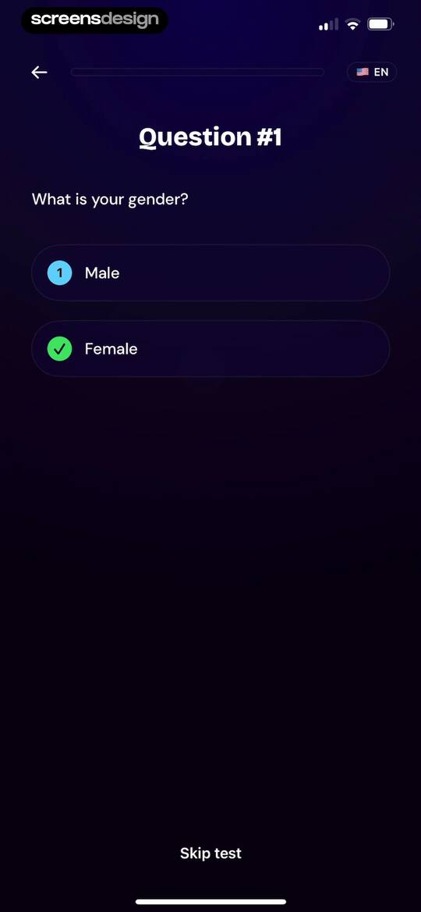
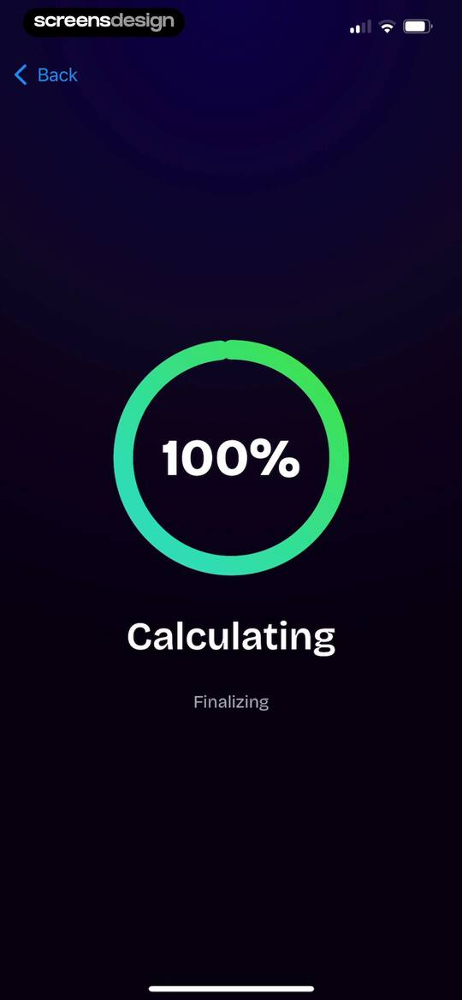
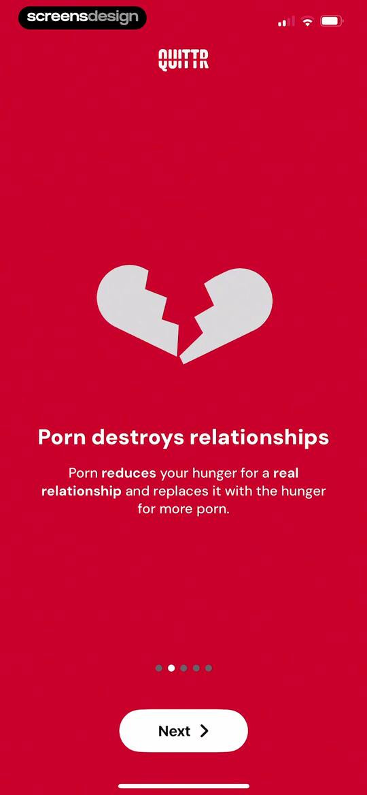
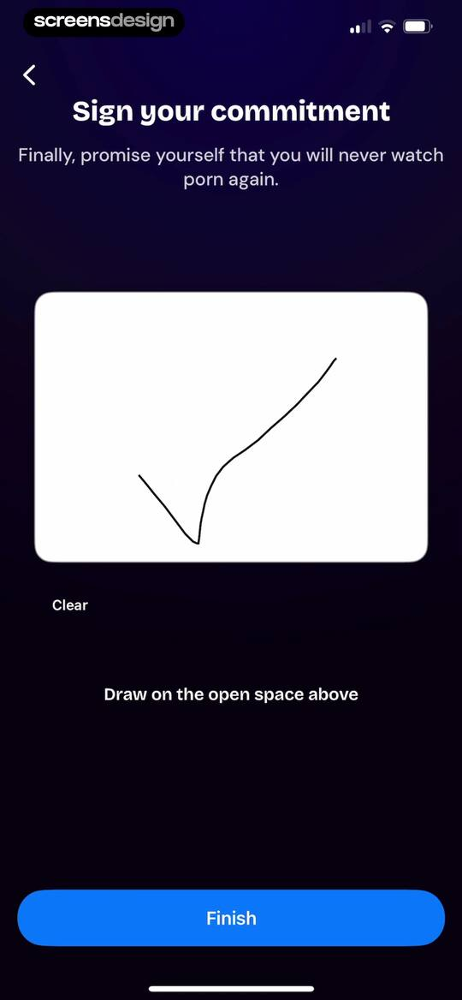

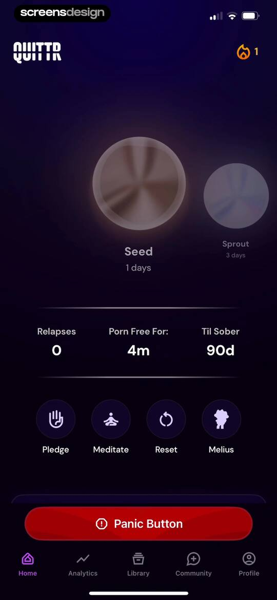
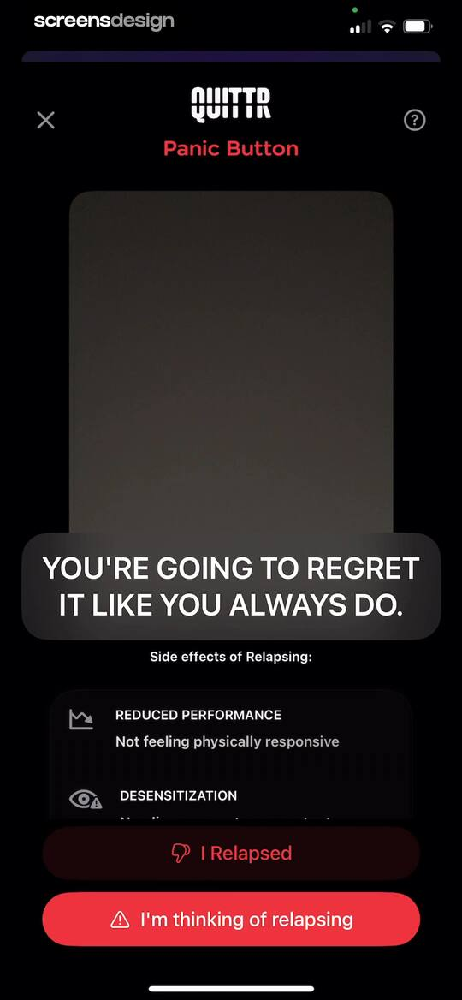
