# RISE: Sleep Tracker Onboarding, Paywall & UX Flow — 170 Screens, $400k/mo

Source: https://screensdesign.com/apps/rise-sleep-tracker/ (fetched 2026-10-05)

Stats: 

| # | Time | Image | What the screen shows |
|---|---|---|---|
| 1 | 00:00 | 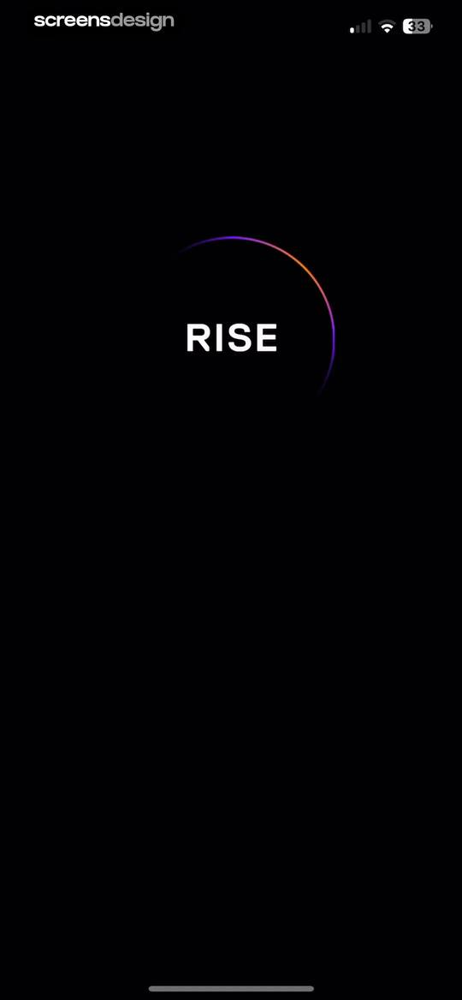 | Splash screen for the RISE app featuring a centered white logo on a dark background with a colorful partial circular progress arc. |
| 2 | 00:03 | 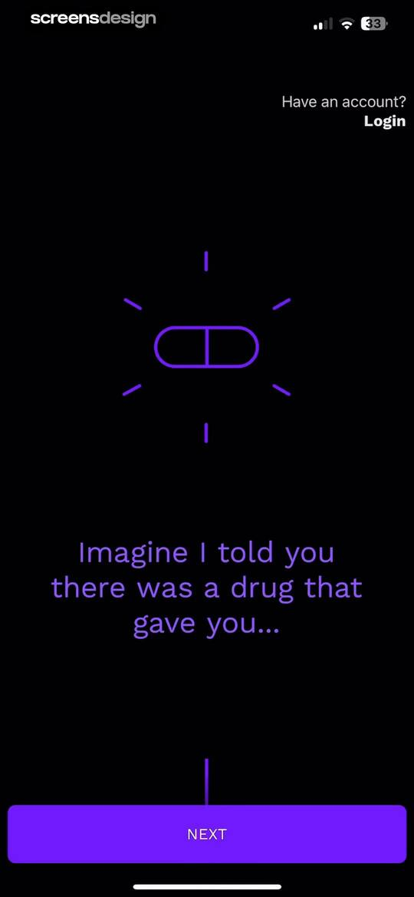 | Onboarding screen featuring a central pill illustration, introductory sleep text, a login link, and a Next button on a dark background. |
| 3 | 00:08 | 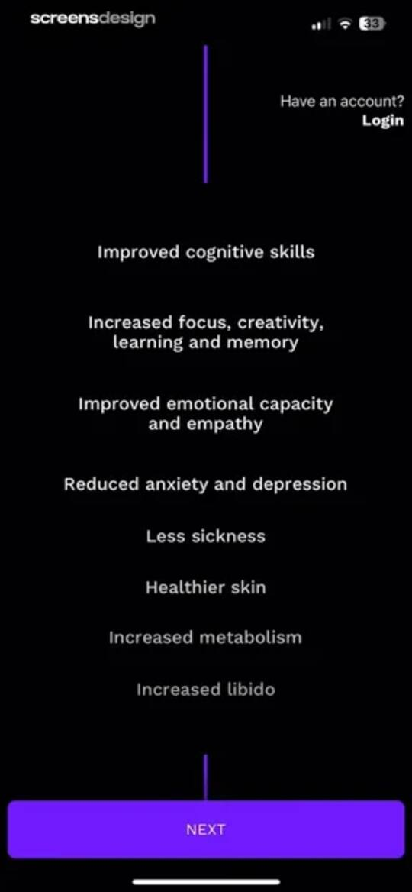 | Onboarding screen listing health benefits with a dark theme and a Next button at the bottom. |
| 4 | 00:12 | 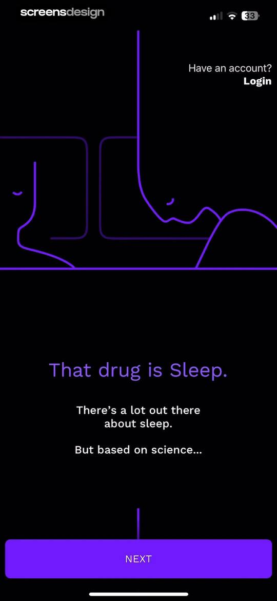 | Dark-themed onboarding screen featuring a sleep illustration, a science-based text block, a Login link, and a Next button. |
| 5 | 00:16 | 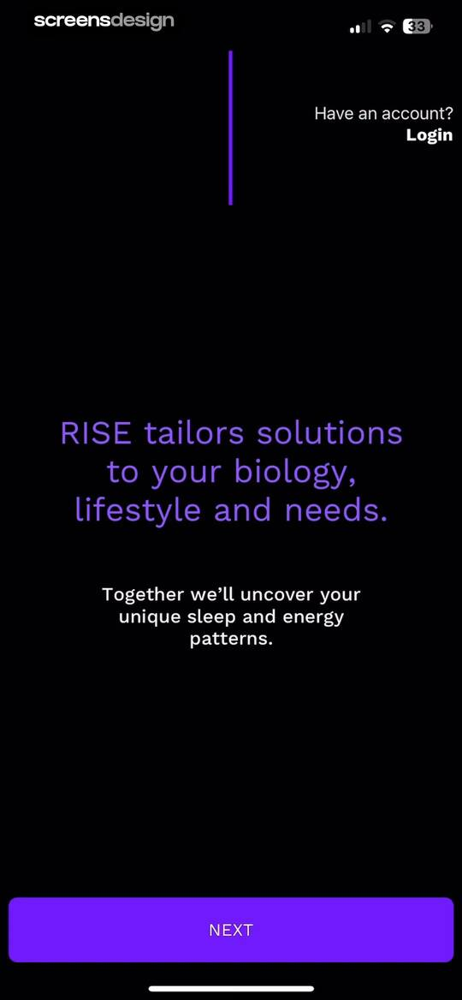 | Onboarding screen for the RISE app, displaying a value proposition about sleep and energy patterns with a bottom NEXT button. |
| 6 | 00:21 | 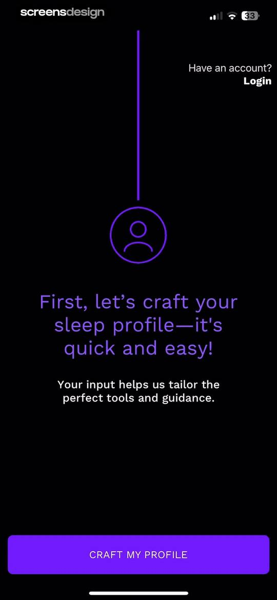 | RISE app onboarding screen with a dark theme, a sleep profile introduction, and a Craft My Profile button. |
| 7 | 00:24 | 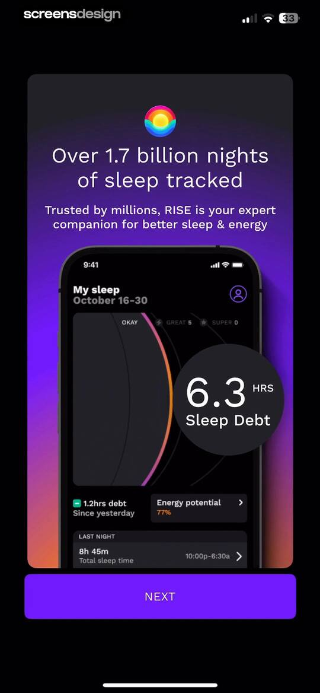 | Onboarding screen for the RISE sleep tracking app featuring a product mockup of the dashboard with sleep metrics and a Next button. |
| 8 | 00:30 | 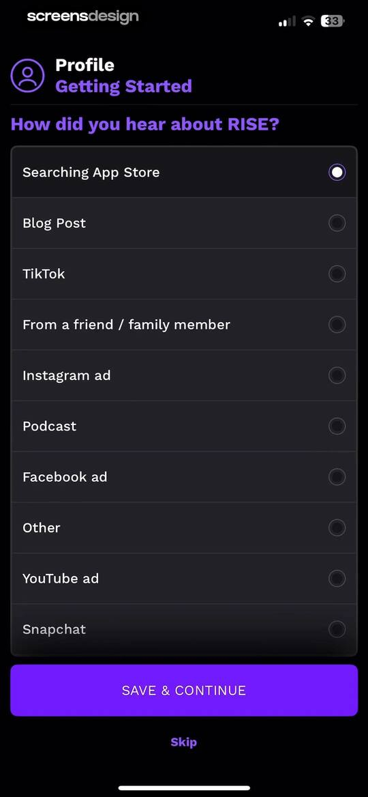 | Onboarding survey screen asking how the user heard about the app, with Searching App Store selected and a Save & Continue button. |
| 9 | 00:35 | locked | Gender selection onboarding screen with Female selected, an explanation about sleep patterns, and a Save & Continue button. |
| 10 | 00:39 | locked | Onboarding age selection screen with the age range 24-29 selected, an explanatory note, and a save and continue button. |
| 11 | 00:44 | locked | Onboarding profile screen asking if the user is a student, with the No option selected and a Save & Continue button. |
| 12 | 00:49 | locked | Onboarding goal selection screen with the Reduce anxiety option selected and a Save & Continue button. |
| 13 | 00:52 | locked | RISE onboarding screen displaying sleep data visualizations and a Continue Profile button. |
| 14 | 00:58 | locked | Onboarding screen asking users to select lifestyle challenges, with Difficulty falling asleep selected and a Save & Continue button. |
| 15 | 01:05 | locked | Onboarding screen for selecting go-to sleep practices, with the alcohol card selected and a Save & Continue button. |
| 16 | 01:13 | locked | Onboarding screen asking users to select energy-boosting strategies, with the Caffeine card selected and a Save & Continue button. |
| 17 | 01:17 | locked | Onboarding screen highlighting timed sleep and energy prompts with a central phone mockup and a Continue Profile button. |
| 18 | 01:20 | locked | Onboarding screen with a dark theme, a celebratory heading, a sleep pattern feature highlight, and a Discover My Patterns button. |
| 19 | 01:22 | locked | Permission request screen in the RISE app asking to enable phone motion data, featuring a green running person icon on the central button and a help link at the bottom. |
| 20 | 01:25 | locked | Permissions request screen explaining data requirements for phone motion, sleep, and step data with a privacy assurance and an OK, LET'S DO IT! button. |
| 21 | 01:28 | locked | Permission request screen with a system modal asking to access motion and fitness activity, featuring Allow and Don't Allow buttons. |
| 22 | 01:31 | locked | Permissions onboarding screen explaining Apple Health integration with a central app mockup and a View & Allow All button. |
| 23 | 01:34 | locked | Permissions onboarding screen explaining Apple Health integration for sleep and steps data, with a View and Allow All button. |
| 24 | 01:39 | locked | Permissions screen requesting Apple Health data access for Rise Sleep with toggles for health categories and Allow and Don't Allow buttons. |
| 25 | 01:42 | locked | Rise Sleep permission prompt asking to track activity across other apps, with options to allow tracking or ask the app not to track. |
| 26 | 01:45 | locked | Permission request screen in the RISE app with a dark theme, explaining the need for reminders and featuring an Enable Notifications button. |
| 27 | 01:47 | locked | Notification permission request screen for Rise Sleep featuring a system alert dialog with Allow and Don't Allow buttons over a dark background. |
| 28 | 01:49 | locked | RISE app onboarding notification permissions screen showing notifications enabled with a checkmark and a Next button. |
| 29 | 02:02 | locked | Data and insights profile screen displaying completed sleep metrics cards and a view my sleep need button. |
| 30 | 02:06 | locked | Onboarding screen displaying a personalized sleep need calculation of 8h 30m with a confirmation button and adjustment options. |
| 31 | 02:09 | locked | Educational modal explaining sleep need calculation in the RISE app, with a white modal overlay on a dark background showing a sleep duration scale. |
| 32 | 02:13 | locked | Settings screen to edit sleep need, featuring a sleep duration slider set to 8h 30m, instructional text, and a Save button. |
| 33 | 02:20 | locked | Sleep need settings screen with a duration slider set to eight hours and a save button. |
| 34 | 02:24 | locked | Onboarding screen explaining sleep debt with a sleep duration slider, educational text, an adjust sleep need link, and a main action button. |
| 35 | 02:29 | locked | Onboarding educational screen explaining sleep debt with a top circular graphic and an OKAY button at the bottom. |
| 36 | 02:34 | locked | RISE onboarding screen displaying zero hours of sleep debt and a purple View My Energy button. |
| 37 | 02:37 | locked | Onboarding screen explaining sleep debt with a top data card showing zero hours and a bottom continue button. |
| 38 | 02:40 | locked | Health dashboard featuring sleep debt and energy potential metrics on dark cards, with an energy potential card highlighting 100% and a navigation chevron. |
| 39 | 02:43 | locked | RISE dashboard featuring a vertical timeline with time markers and a purple gradient card indicating a sleep period. |
| 40 | 02:47 | locked | Onboarding screen for the RISE sleep tracker with a vertical timeline, energy prediction text, and a SEE THE FUTURE button. |
| 41 | 02:51 | locked | Circadian rhythm energy visualization screen displaying an energy peak insight, a Learn the science link, and an Optimize Your Day button. |
| 42 | 02:55 | locked | Dashboard displaying a personalized energy forecast with a circadian rhythm chart, an educational link, and a sleep optimization button. |
| 43 | 02:58 | locked | Educational onboarding screen explaining daily energy and circadian rhythms with a dark theme and a Sleep Easier Tonight button. |
| 44 | 03:06 | locked | Sleep app onboarding screen displaying a circadian rhythm curve, an educational message about energy levels, and a Next button. |
| 45 | 03:11 | locked | Onboarding screen from the RISE sleep tracker app displaying a personalized sleep recommendation, Learn the science link, and START TODAY button. |
| 46 | 03:14 | locked | Onboarding screen introducing science-based biology methods with a central icon grid and a Next button. |
| 47 | 03:16 | locked | Onboarding screen highlighting calendar and energy integration features, featuring a central product mockup and a Next button. |
| 48 | 03:18 | locked | Social proof onboarding screen displaying user testimonials and a five-star rating with a Try Rise button. |
| 49 | 03:23 | locked | Satisfaction guarantee modal overlay on a subscription screen, detailing a 30-day money-back guarantee with a primary try button. |
| 50 | 03:38 | locked | Paywall screen for the RISE sleep tracker app with social proof badges, trial options, and a redeem free trial button. |
| 51 | 03:42 | locked | Subscription paywall screen offering a 7-day free trial or 1-month plan, with a notification toggle and a Redeem 7 Days Free button. |
| 52 | 03:49 | locked | iOS App Store subscription confirmation modal for RISE: Sleep Tracker showing a one-week free trial and annual pricing with a side button confirmation prompt. |
| 53 | 03:54 | locked | Subscription success confirmation modal displayed over a dark paywall, featuring an OK button and purchase details in the background. |
| 54 | 04:11 | locked | Onboarding signup screen with a validated email input, a privacy policy link, and a large next button. |
| 55 | 04:14 | locked | Trial onboarding screen for the RISE app featuring a vertical timeline of billing milestones and a Continue button. |
| 56 | 04:17 | locked | Sleep recommendation onboarding screen displaying an ideal bedtime window over a circadian rhythm chart, with a Continue button. |
| 57 | 04:21 | locked | Melatonin window informational modal in the RISE app, displaying sleep timing details, calendar integration options, and a Remind Me button. |
| 58 | 04:25 | locked | System permission modal requesting full access to the calendar for improved sleep guidance, with Allow Full Access and Don't Allow buttons. |
| 59 | 04:30 | locked | Onboarding screen from the RISE app featuring a sleep insight card, a vertical timeline, and a Find Wake Window button. |
| 60 | 04:40 | locked | Onboarding screen from the RISE sleep tracker app with a wake window modal over a timeline, featuring an optimize alarm button and skip link. |
| 61 | 04:43 | locked | Onboarding preference screen asking which alarm is currently used, with iPhone alarm selected and a Continue button. |
| 62 | 04:45 | locked | Onboarding screen asking for the earliest weekday wake-up time, with a vertical time scale, an add alarm time button, and a skip option. |
| 63 | 04:49 | locked | Smart alarm setup screen with a vertical timeline background, an instruction modal, and an okay confirmation button. |
| 64 | 04:59 | locked | Smart alarm configuration screen with an educational bottom modal and a primary confirmation button set to 8:16a. |
| 65 | 05:03 | locked | Smart alarm onboarding screen featuring a bottom modal with time configuration, day selectors, and a customize and add button. |
| 66 | 05:11 | locked | Dashboard with an energy schedule and essential tools modal overlaying a list of health habit items. |
| 67 | 05:22 | locked | Sleep dashboard displaying a central zero hours sleep debt gauge, an energy potential card showing 100 percent, and last night sleep duration summary. |
| 68 | 05:28 | locked | Energy schedule dashboard displaying a daily timeline with morning peak and afternoon dip phases, with the Energy tab selected. |
| 69 | 05:36 | locked | Sleep tracker dashboard featuring a central timeline visualization, total sleep time of 11h 56m, and energy schedule details. |
| 70 | 05:39 | locked | Sleep tracker dashboard displaying sleep duration, energy potential, and circadian energy zones with the Sleep tab selected. |
| 71 | 05:44 | locked | Referral modal offering a thirty-day free trial gift for friends, with a purple gift box illustration and a Send Gift button. |
| 72 | 05:46 | locked | Share sheet modal for the RISE app featuring a promotional card with a 30-day extended trial offer and sharing options. |
| 73 | 05:49 | locked | Referral modal in the Rise app with a gift illustration, feedback prompt asking if you are enjoying the app, and a Send Gift button. |
| 74 | 05:55 | locked | Rating prompt modal in Rise Sleep asking the user to tap a star to rate the app on the App Store, with Cancel and Submit buttons. |
| 75 | 05:56 | locked | Feedback modal overlay on a dark background with rating stars, a Write a Review button, and an OK button. |
| 76 | 06:04 | locked | Tools dashboard displaying alarm settings and a list of sleep habit reminders including caffeine, alcohol, and melatonin windows. |
| 77 | 06:07 | locked | Caffeine Cutoff settings screen in the RISE app, featuring an active reminder toggle, a reminder time set to 10 hours before the melatonin window, and a close button. |
| 78 | 06:09 | locked | Form modal for setting a caffeine cutoff reminder, with the recommended 10 hours option selected from a list ranging from 8 to 12 hours. |
| 79 | 06:14 | locked | Educational modal explaining caffeine cutoff times and the science of how caffeine affects sleep quality, featuring tips and a close button. |
| 80 | 06:23 | locked | Melatonin Window modal in the RISE sleep tracking app, featuring a time range graphic, informational text, and settings and learn more links. |
| 81 | 06:25 | locked | Settings modal for Melatonin Window notifications in the RISE app, featuring an active toggle and a reminder time configuration set to 15m. |
| 82 | 06:36 | locked | Sleep app tools dashboard with cards for sleep detection, smart alarm, sleep aids, and guides, plus a bottom navigation bar. |
| 83 | 06:43 | locked | Onboarding screen explaining automatic nightstand sleep detection with an illustration, an explanatory text block, a tip section for wearables, and an Okay, Continue button. |
| 84 | 06:46 | locked | Sleep detection settings screen featuring a central timeline visualization, detection method tabs with Nightstand selected, and toggle controls for motion and sound. |
| 85 | 06:50 | locked | Permission request screen explaining microphone access for sleep detection, featuring a central illustration and a Continue & Allow button. |
| 86 | 06:54 | locked | Permission request screen asking for microphone access for sleep detection, featuring a system alert dialog, privacy explanations, and a Continue & Allow button. |
| 87 | 06:57 | locked | Sleep detection setup screen with Nightstand selected, a charger warning banner, motion and sound toggles, and a central Tap at Bedtime button. |
| 88 | 07:06 | locked | Microphone permission request screen explaining local sleep detection privacy features, with an illustration and an Okay, Continue button. |
| 89 | 07:11 | locked | Sleep detection onboarding screen instructing users to place their phone on the mattress, with an Okay, Continue button. |
| 90 | 07:14 | locked | Sleep detection modal with a Mattress method selected, a battery warning banner, and a central start tracking button. |
| 91 | 07:17 | locked | Sleep detection onboarding modal explaining wearable integration with Apple Health, featuring an OKAY, CONTINUE button and a helpful tip. |
| 92 | 07:20 | locked | Sleep detection settings screen with a segmented control for device selection, Apple Health integration, and wake window information. |
| 93 | 07:23 | locked | Data sources settings modal in the RISE sleep tracker app listing connected sources like Bevel and Apple Health with last sync times. |
| 94 | 07:36 | locked | Sleep tracking dashboard showing an active timer, battery warning banner, and wake window information with Mattress mode selected. |
| 95 | 07:40 | locked | Dashboard with an energy schedule timeline, nightstand detection details, and a morning summary modal showing zero sleep debt. |
| 96 | 07:45 | locked | Progress analytics screen displaying sleep debt charts with a missing data notification alert and a selected Sleep Debt tab. |
| 97 | 07:54 | locked | Energy dashboard displaying a vertical energy graph with a Morning Peak, Afternoon dip, and bottom navigation with the Energy tab selected. |
| 98 | 08:03 | locked | Energy schedule dashboard displaying an energy chart with a morning peak and a bottom sheet with an activity summary. |
| 99 | 08:08 | locked | Morning Peak modal overlay displaying circadian rhythm insights and energy schedule details over a dark dashboard with a bottom navigation bar. |
| 100 | 08:29 | locked | Energy schedule dashboard with a vertical timeline, a wake window event card, and a bottom floating action bar. |
| 101 | 08:32 | locked | Tools dashboard displaying a grid of sleep features, alarm settings, sleep aids, and guides with a bottom navigation bar. |
| 102 | 08:34 | locked | Sleep detection setup screen with Mattress selected in the top segmented control, a battery warning banner, and a central start button. |
| 103 | 08:39 | locked | Active sleep tracking screen with a nightstand mode selected, a battery drain warning banner, and a central stop button. |
| 104 | 08:48 | locked | Sleep detection screen featuring a Nightstand mode selector, instruction cards, motion and sound toggles, and a central tap-at-bedtime button. |
| 105 | 08:55 | locked | Smart alarm settings screen featuring a time slider, day selector, and options for gentle wake up, sounds, and brain engagement. |
| 106 | 09:01 | locked | Settings modal for configuring gentle wake up duration, with the 5 minutes option selected in a list. |
| 107 | 09:08 | locked | Settings modal for sounds and haptics in the RISE sleep tracker, featuring a volume slider, vibration toggle, and melody selection. |
| 108 | 09:11 | locked | Melody selection screen with a scrollable list of alarm sounds, featuring African Marimba selected and a close button. |
| 109 | 09:19 | locked | Smart Alarm feature explanation modal with a product mockup, a bulleted list of benefits, and a close button. |
| 110 | 09:33 | locked | Relaxation session playback modal with a 15-minute duration, central play button, and options to add the session to a schedule. |
| 111 | 09:39 | locked | Informational card about relaxing sounds in the RISE app, listing target users with buttons to acknowledge or browse more sessions. |
| 112 | 09:43 | locked | Modal containing a list of three guided relaxation session cards with duration details and informational links. |
| 113 | 09:45 | locked | Relaxation session modal with a central play button, stacked action buttons, and a bottom sleep sounds menu. |
| 114 | 10:02 | locked | Modal screen titled Relax with RISE featuring audio guides and soothing sounds, a central relaxation player illustration, and a Customize and Add button. |
| 115 | 10:04 | locked | Relaxation techniques modal featuring a carousel of science-based methods, an explanation section, and a Customize and Add button. |
| 116 | 10:06 | locked | Onboarding screen for the RISE app featuring a carousel of relaxation routine previews, pagination dots, and a Customize and Add button. |
| 117 | 10:10 | locked | Settings modal for relaxation session reminders with a toggle switch and a reminder time option. |
| 118 | 10:15 | locked | Brain Dump feature introduction screen explaining how to calm the mind before sleep, with a preview mockup and a GET STARTED button. |
| 119 | 10:18 | locked | Educational modal explaining the sleep benefits of a brain dump with a close button in the top right corner. |
| 120 | 10:22 | locked | Brain dump editor modal featuring an empty text input field for writing notes and a navigation list with Settings and FAQs. |
| 121 | 10:32 | locked | Dark-themed Brain Dump modal form displaying a task list, settings and FAQ links, and a system keyboard with a done button. |
| 122 | 10:36 | locked | Brain dump settings modal featuring morning summary and evening reminder configurations, with a Remind Me button and a close icon. |
| 123 | 10:38 | locked | Confirmation modal in the RISE app stating a habit reminder is set, featuring a VIEW ENERGY SCHEDULE button. |
| 124 | 10:41 | locked | Energy dashboard displaying a daily schedule graph with peak and dip zones, with the Energy tab selected in the bottom navigation. |
| 125 | 10:46 | locked | Tools dashboard displaying a dark theme with a grid of sleep tracking cards, guides, and a bottom sheet for alarm and timer settings. |
| 126 | 10:50 | locked | Brain dump editor modal with a text input area for tasks and a set a reminder option at the bottom. |
| 127 | 10:55 | locked | Environment check modal detailing sleep benefits and numbered tips for optimizing bedroom temperature and darkness, with a close button. |
| 128 | 11:03 | locked | Melatonin Window modal in the RISE sleep tracker app with a 12:20a to 1:20a time range graphic, explanatory text, and bottom settings links. |
| 129 | 11:10 | locked | Sleep progress dashboard featuring a line chart of sleep debt trends, a missing data alert banner, and a list of daily sleep entries. |
| 130 | 11:12 | locked | Sleep progress dashboard with a missing data alert banner, a weekly sleep times chart, and a list of sleep sessions. |
| 131 | 11:30 | locked | Sleep time entry form with time-picker sliders for falling asleep and waking up, instructions, and a save button. |
| 132 | 11:33 | locked | Sleep logging form with time pickers for fell asleep and woke up times, showing a saving changes indicator and a disabled save button. |
| 133 | 11:34 | locked | Sleep editor screen displaying a three-hour sleep timeline with a close button and a nap management section. |
| 134 | 11:46 | locked | Sleep editor modal with a nap duration counter, plus and minus adjustment buttons, and Save and Cancel options. |
| 135 | 12:00 | locked | Sleep tracking feedback form with the option "Didn't capture my nap" selected and an OK submission button. |
| 136 | 12:05 | locked | Feedback survey form asking what made sleep tracking inaccurate, with a list of selectable reasons and an OK button. |
| 137 | 12:08 | locked | Feedback form asking for optional sleep tracking comments with a text input area and a Submit button. |
| 138 | 12:11 | locked | Feedback confirmation modal in the RISE app with a thank you message and a close button in the top right corner. |
| 139 | 12:16 | locked | Sleep tracking editor interface displaying a total sleep time of 3 hours and 5 minutes with a central purple timeline block for manual adjustment. |
| 140 | 12:22 | locked | Sleep progress dashboard with a missing data notification, an empty chart area, a smart schedule card, and a bottom navigation bar. |
| 141 | 12:25 | locked | Feature introduction modal for sleep quality tracking in the RISE app, featuring benefits, an explanation, and a Get Started button. |
| 142 | 12:29 | locked | Educational modal explaining that low sleep debt equals more energy, featuring a coin growth illustration and a Done button. |
| 143 | 12:35 | locked | Sleep tracker settings screen displaying a sleep quality rating scale, a seven-day habit progress tracker, and morning reminder options. |
| 144 | 12:44 | locked | Modal explaining the Smart Schedule feature in the RISE sleep tracker app, featuring a weekly sleep chart and educational bedtime tips. |
| 145 | 12:51 | locked | Sleep quality settings screen with a rating scale, habit streak tracker, and morning reminder options. |
| 146 | 12:55 | locked | Progress dashboard with a sleep quality chart, a missing data warning, a smart schedule card, and a list of check-ins. |
| 147 | 12:58 | locked | Learn tab content feed featuring educational article cards on sleep science and energy management with a bottom navigation bar. |
| 148 | 13:02 | locked | Educational article screen about sleep wellbeing with an overarching cookie preferences modal displaying accept all and customize buttons. |
| 149 | 13:13 | locked | Share sheet overlaying a dark-themed informational text screen from the RISE app, featuring app icons and a list of action items. |
| 150 | 13:25 | locked | Referral modal promoting a gift of free days for friends, featuring a gift box illustration and a Send Gift button. |
| 151 | 13:28 | locked | Profile settings screen with a user avatar and grouped list sections for sleep preferences, data connections, and membership. |
| 152 | 13:30 | locked | Partner connection modal in the RISE sleep app with a Send an Invite Link button and a How it works feature preview. |
| 153 | 13:33 | locked | Partner invite modal in the RISE app featuring a send invite link button and an open iOS share sheet overlay. |
| 154 | 13:42 | locked | Sleep need settings screen in the RISE app displaying a recommended duration of eight hours and forty-five minutes, an interactive slider, an adjust button, and educational text about sleep requirements. |
| 155 | 13:46 | locked | Settings screen for configuring weekday and weekend wake time goals with time-selection sliders and a smart schedule navigation card. |
| 156 | 13:50 | locked | Smart alarm settings screen featuring a configured alarm set for 7:30 AM with day-of-the-week selectors and an add alarm button. |
| 157 | 13:53 | locked | Data sources settings screen listing connected health integrations and explaining how sleep trackers and phone motion detection work. |
| 158 | 13:58 | locked | Permissions guide for the RISE sleep app with step-by-step instructions to enable device notifications in iOS settings. |
| 159 | 14:03 | locked | RISE app calendar settings screen featuring account connections, a toggle for energy peaks and dips, and an educational explanation section. |
| 160 | 14:07 | locked | Connect my partner screen in the RISE app with a Send an Invite Link button and a how-it-works product mockup. |
| 161 | 14:11 | locked | Time Format settings screen in the RISE app listing 12-hour and 24-hour clock options with descriptive text below. |
| 162 | 14:14 | locked | Language selection settings screen listing multiple languages with English currently selected. |
| 163 | 14:20 | locked | Profile settings screen for the RISE app, displaying membership options, app preferences, logout, and account deletion buttons. |
| 164 | 14:22 | locked | Referral promotion screen featuring a card to send a free trial gift to friends and a Send Gift button. |
| 165 | 14:27 | locked | FAQ and support screen for the RISE app, featuring a search bar, four category buttons, and a floating help button. |
| 166 | 14:32 | locked | FAQ and support screen for subscriptions and billing with a search bar and categorized help articles. |
| 167 | 14:35 | locked | Support article with instructions on how to cancel a trial or subscription, including a numbered list and an app screenshot. |
| 168 | 14:41 | locked | Support request form in the RISE app with a pre-filled email field, subject line, and request type dropdowns. |
| 169 | 14:50 | locked | Legal document screen displaying the RISE Sleep Tracker terms of service and privacy policy on a dark background. |
| 170 | 14:58 | locked | Educational modal explaining iPhone widgets with a widget preview hero, descriptive text, and share and close buttons in the top bar. |

## Free showcase screenshots (unordered)

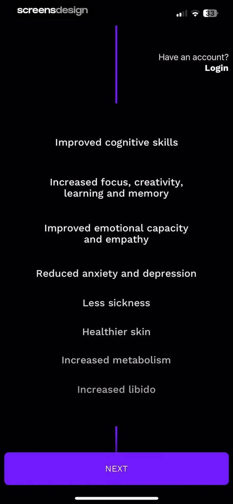
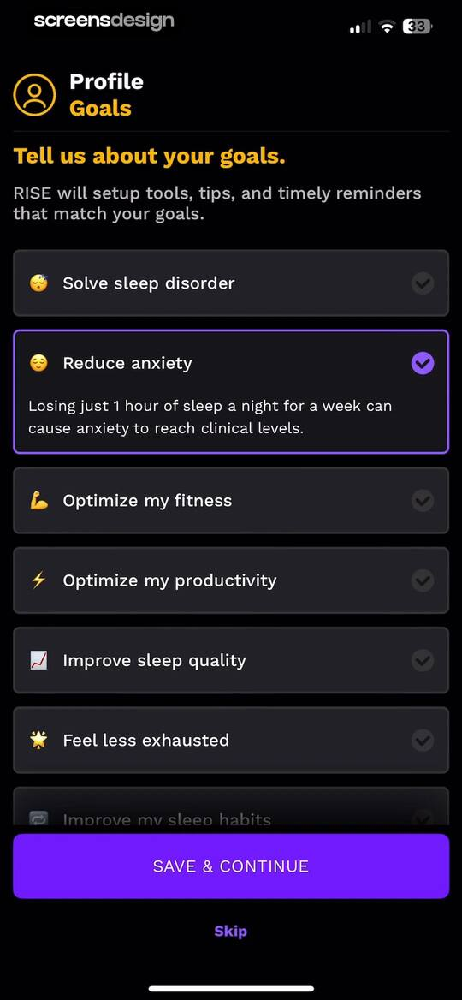
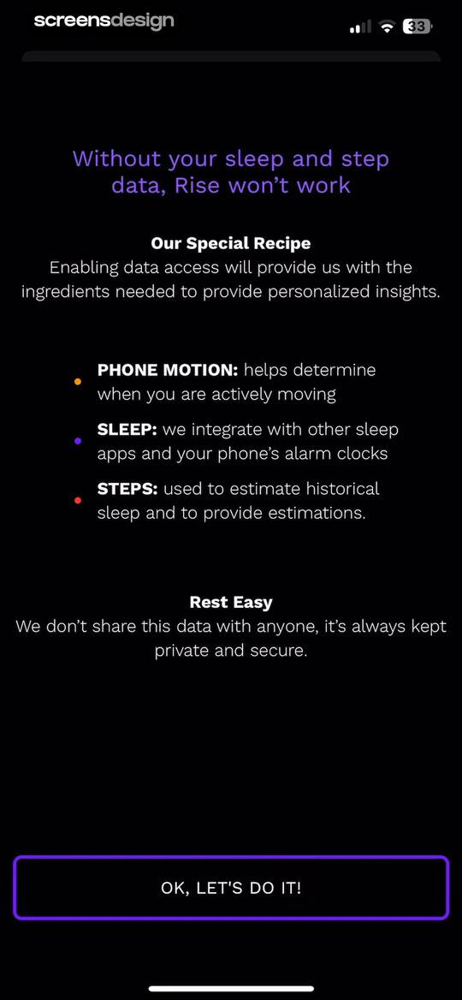
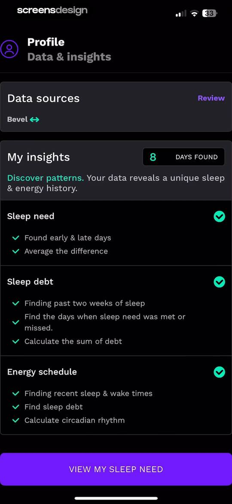
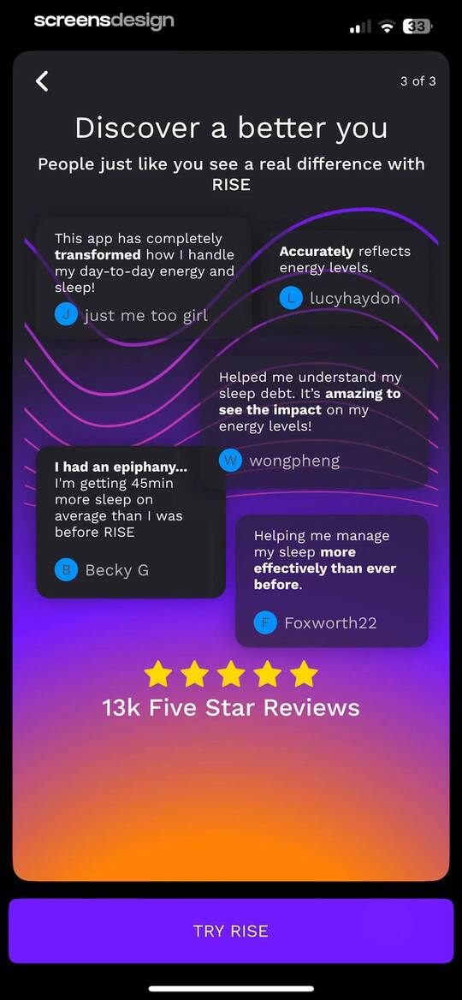
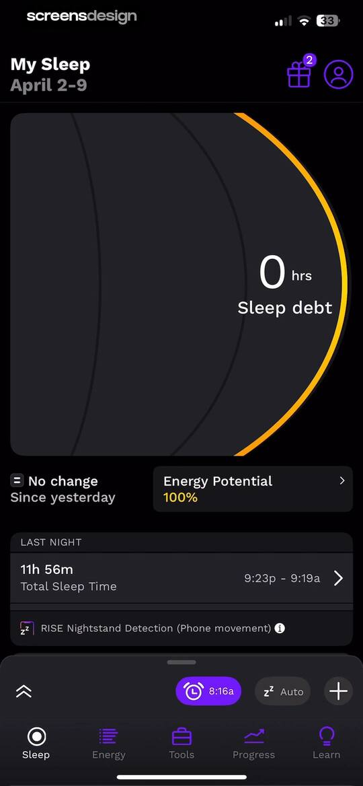
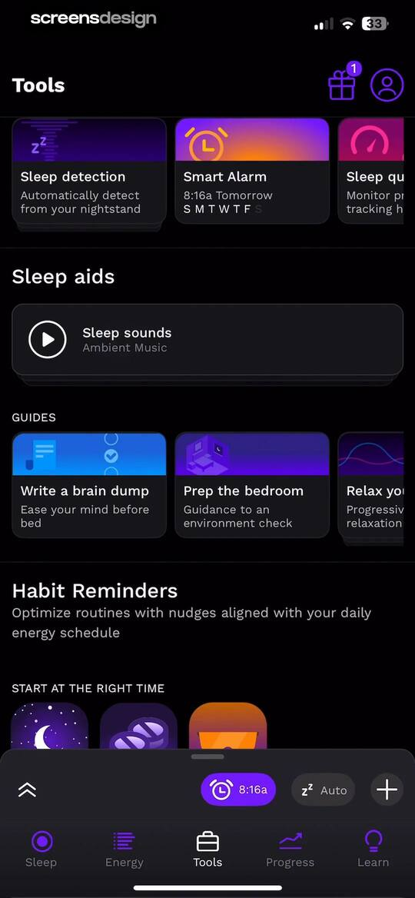
