# RIZZ Onboarding, Paywall & UX Flow — 63 Screens, $150k/mo

Source: https://screensdesign.com/apps/rizz/ (fetched 2026-10-05)

Stats: 

| # | Time | Image | What the screen shows |
|---|---|---|---|
| 1 | 00:01 | 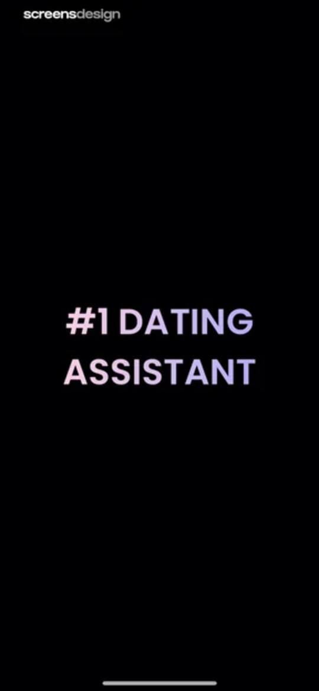 | Onboarding splash screen featuring centered gradient text reading #1 DATING ASSISTANT against a solid black background. |
| 2 | 00:03 | 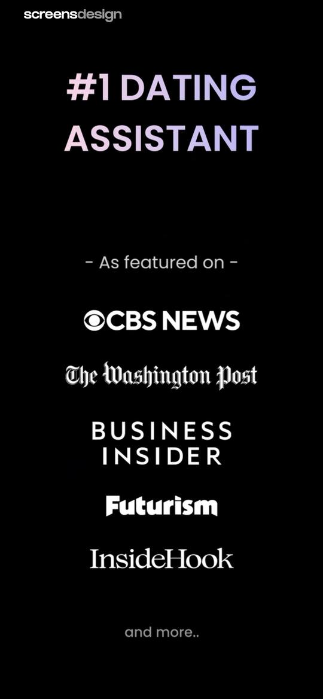 | Dating assistant onboarding screen displaying a media feature list and press logos on a black background. |
| 3 | 00:04 | 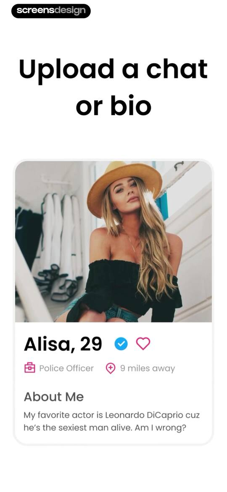 | Onboarding screen featuring an upload prompt and a central profile preview card for Alisa, 29, with a Police Officer occupation. |
| 4 | 00:07 | 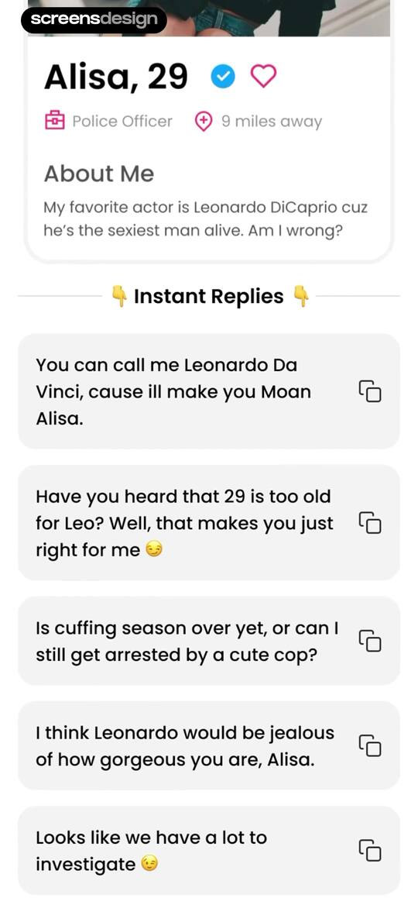 | Dating assistant feed showing a profile card for Alisa with a verified badge and a vertical list of AI-generated instant reply cards. |
| 5 | 00:09 |  | Splash screen for the RIZZ app displaying the word DATES in a gradient font centered on a black background. |
| 6 | 00:11 |  | Splash screen for the RIZZ app featuring the centered brand logo with a pink and purple gradient on a solid black background. |
| 7 | 00:14 | 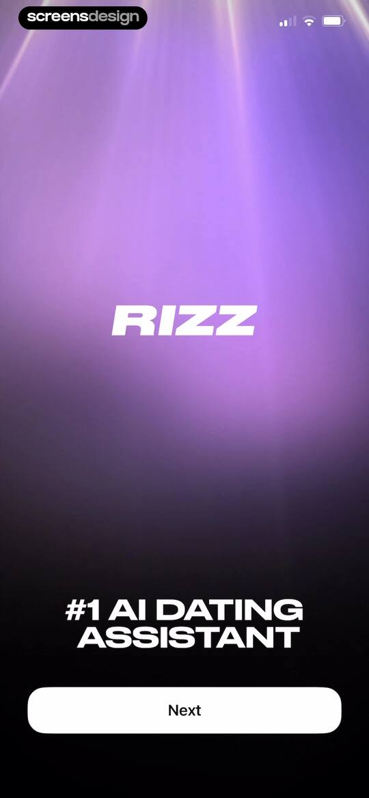 | Onboarding screen for the RIZZ app featuring the logo, tagline, and a Next button on a dark purple background. |
| 8 | 00:19 |  | Onboarding screen introducing profile screenshot uploads with a central mockup of dating cards, a progress indicator, and a Next button. |
| 9 | 00:22 | locked | Onboarding screen highlighting instant AI replies with a central product mockup showing stacked message bubbles and a Next button. |
| 10 | 00:27 | locked | Onboarding rating screen asking 'EXCITED FOR RIZZ?' with a star rating input, a Done button, and a Skip Step button. |
| 11 | 00:30 | locked | App store rating prompt modal for RIZZ featuring five star icons, Cancel and Submit buttons, and a blurred dark background. |
| 12 | 00:32 | locked | Feedback confirmation modal with a star rating, Write a Review and OK buttons, and Skip Step and Done options. |
| 13 | 00:34 | locked | Onboarding rating screen for the RIZZ app with five stars and Done and Skip Step buttons. |
| 14 | 00:36 | locked | Notification permission request screen in the RIZZ onboarding flow, featuring a system modal with Allow and Don't Allow buttons over a dark purple background. |
| 15 | 00:38 | locked | Notification permission screen in the RIZZ app with a central 3D bell graphic, a progress indicator, and a Done button. |
| 16 | 00:47 | locked | Onboarding screen for profile setup with selection groups for sex, age, and dating intention, featuring a Next button. |
| 17 | 00:49 | locked | Paywall screen for the RIZZ app offering a free trial, featuring a central carousel of mockups, a list of premium features, and a Get more dates button. |
| 18 | 00:54 | locked | Paywall screen for the RIZZ app offering a free trial, featuring a product mockup, a list of AI features, and a Get more dates button. |
| 19 | 00:55 | locked | Paywall screen for the RIZZ app offering a free trial, with a central product mockup, a list of AI features, and a Get more dates button. |
| 20 | 00:59 | locked | Paywall screen for the RIZZ app offering a free trial, featuring a chat mockup, a list of AI features, and a Get more dates button. |
| 21 | 01:02 | locked | RIZZ subscription paywall offering a three-day free trial and weekly plan with a Continue for free button. |
| 22 | 01:11 | locked | Subscription confirmation modal for the RIZZ app offering a three-day free trial followed by nine ninety-nine per week, requiring a side button double-click to purchase. |
| 23 | 01:17 | locked | Paywall screen with a purchase success modal displayed over a weekly subscription plan and free trial offer. |
| 24 | 01:21 | locked | Home screen of the RIZZ app with overlapping chat mockups, an Upload a Screenshot button, and a bottom navigation bar. |
| 25 | 01:27 | locked | Permission screen in RIZZ displaying a photo grid and a privacy notice card for selecting photos to share. |
| 26 | 01:30 | locked | Dating profile card in the RIZZ app displaying Lisa, 27, with a photo, bio, and swipe action buttons at the bottom. |
| 27 | 01:36 | locked | Chat screen from the RIZZ app displaying a dating profile card for Lisa, 27, with a Get Rizz Reply action button below. |
| 28 | 01:39 | locked | Chat screen for the RIZZ app displaying a dating profile card, a suggested AI-generated reply bubble, and a Get Rizz Reply action button. |
| 29 | 01:53 | locked | Chat screen displaying a dating profile for Lisa with suggested AI reply cards and a Get Rizz Reply button. |
| 30 | 02:00 | locked | Chat screen displaying a profile card for Lisa with three AI-generated reply suggestions and a bottom button to get NSFW replies. |
| 31 | 02:05 | locked | Content feed displaying a dating profile card and a list of suggested reply cards, with a Get Genuine Reply button at the bottom. |
| 32 | 02:07 | locked | Chat screen displaying a dating profile card and a list of AI-generated reply suggestions, with a bottom Get Genuine Reply button. |
| 33 | 02:09 | locked | Rating modal prompting users to rate the app with five empty star icons, overlaid on a blurred dating profile screen with text suggestions. |
| 34 | 02:11 | locked | Chat response generator screen displaying a dating profile for Lisa, 27, with three suggested AI chat replies and a Get Genuine Reply button. |
| 35 | 02:17 | locked | Home screen of the Rizz app displaying a profile card for Lisa, 27, with an Upload a Screenshot button and Get Pickup Lines option. |
| 36 | 02:20 | locked | Message input form with an instruction card and a Get Rizz Reply action button. |
| 37 | 02:41 | locked | Chat input screen for an AI dating assistant with fields for name and message context, alongside a Get Rizz Reply action button. |
| 38 | 02:49 | locked | Chat assistant editor screen with message bubbles, reply options, and a Get Rizz Reply button over a pastel gradient background. |
| 39 | 03:00 | locked | Chat screen from the RIZZ app displaying a generated response bubble with a copied notification and a Get Rizz Reply button at the bottom. |
| 40 | 03:04 | locked | AI response generator screen displaying a suggested dating reply, style selection grid, and a Get Similar Reply button. |
| 41 | 03:12 | locked | AI response generator editor displaying a generated chat reply, a tone selection grid, delete and copy options, and a Get Similar Reply button. |
| 42 | 03:25 | locked | Chat screen from the RIZZ app displaying a witty AI-generated dating response inside a speech bubble, with a Gimme Another button and a refresh icon at the bottom. |
| 43 | 03:29 | locked | Dating conversation starter in the RIZZ app featuring a playful suggestion inside a speech bubble and a Gimme Another button. |
| 44 | 03:36 | locked | RIZZ app response screen displaying a generated pickup line inside a speech bubble with a copied notification, refresh button, and Gimme Another button. |
| 45 | 03:44 | locked | Home dashboard for the RIZZ app displaying a dating profile card and action buttons to upload a screenshot or enter text. |
| 46 | 03:47 | locked | Home screen for RIZZ with a chat analysis dashboard mockup and buttons to upload a screenshot or entire chat. |
| 47 | 03:50 | locked | Photo library permission screen for RIZZ displaying a privacy permission card above a multi-column photo grid and a bottom toolbar. |
| 48 | 03:55 | locked | Chat screen in the RIZZ app displaying a simulated split-screen conversation thread with Lisa, 27. |
| 49 | 04:03 | locked | Chat analysis dashboard displaying message counts, interest levels, red and green flags, attachment styles, and a 92 percent compatibility score. |
| 50 | 04:07 | locked | Chat interface displaying a conversation history with Lisa, 27, inside a centered card on a gradient background. |
| 51 | 04:13 | locked | Share sheet displaying a file preview for a JPEG image, an app sharing carousel, and a vertical list of action items. |
| 52 | 04:17 | locked | Home screen of the RIZZ app with an uploaded screenshot preview and buttons to upload a screenshot or entire chat. |
| 53 | 04:21 | locked | Confirmation modal asking if you want to delete a screenshot, with Delete and Cancel buttons. |
| 54 | 04:25 | locked | Home screen for chat analysis with a central hero mockup, feature labels, and Upload a Screenshot and Upload entire chat buttons. |
| 55 | 04:27 | locked | Photo selection permission screen in the RIZZ app displaying a grid of thumbnails and a privacy notice card. |
| 56 | 04:30 | locked | Chat screen in the RIZZ app featuring a vertical split-view conversation card with Lisa, 27. |
| 57 | 04:41 | locked | Chat analytics dashboard summarizing conversation statistics, flags, attachment styles, and a 92% compatibility score. |
| 58 | 04:44 | locked | Home screen featuring a screenshot preview card and buttons to upload a screenshot or entire chat, with the Analyze tab selected. |
| 59 | 04:46 | locked | Settings menu modal in the RIZZ app displaying a list of options including Email Us, Share App, Earn Cash, Language, and Survey. |
| 60 | 04:50 | locked | iOS system share sheet modal overlaying the Rizz app interface with options for sharing and saving. |
| 61 | 04:52 | locked | Referral modal detailing rewards for downloads and cash, featuring a Share Link button and current earnings of zero. |
| 62 | 04:54 | locked | Share sheet modal in the RIZZ app displaying a screenshot preview, app sharing icons, and a list of action options. |
| 63 | 05:01 | locked | Reply Language modal overlay in the RIZZ app displaying a vertical list of languages with English selected by a checkmark. |

## Free showcase screenshots (unordered)

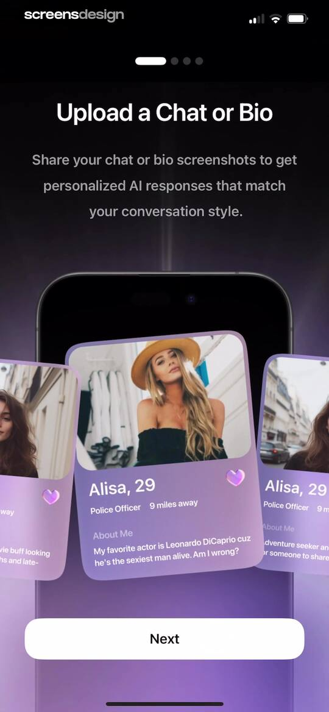
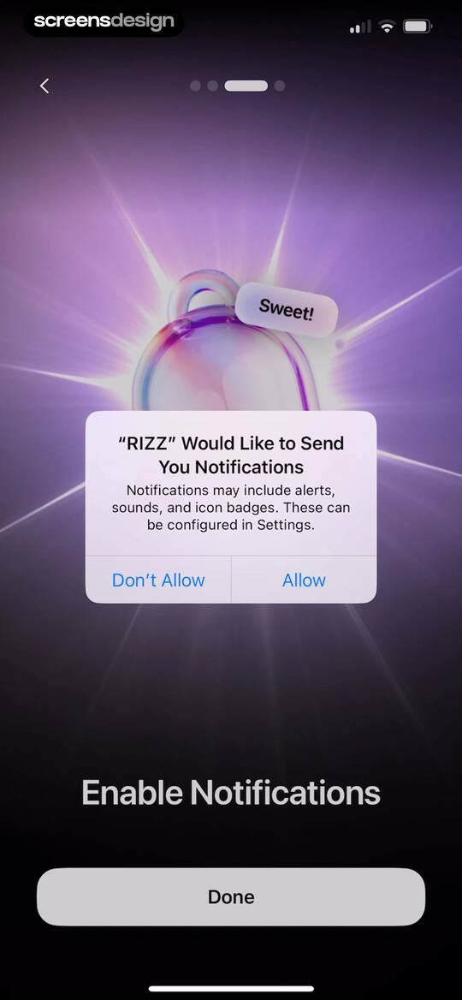
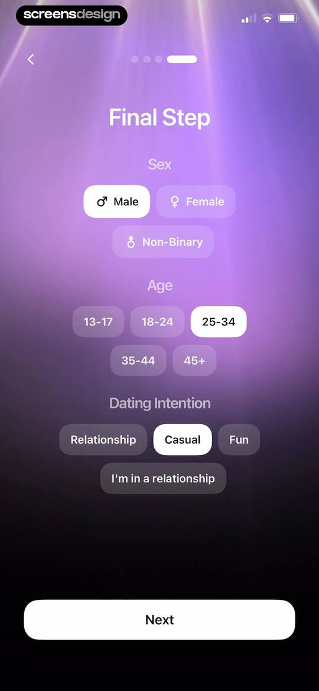
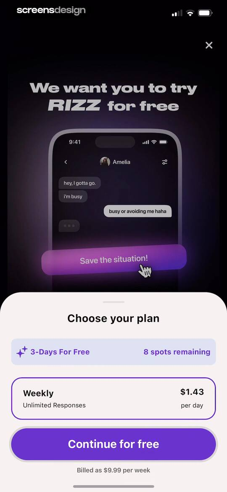
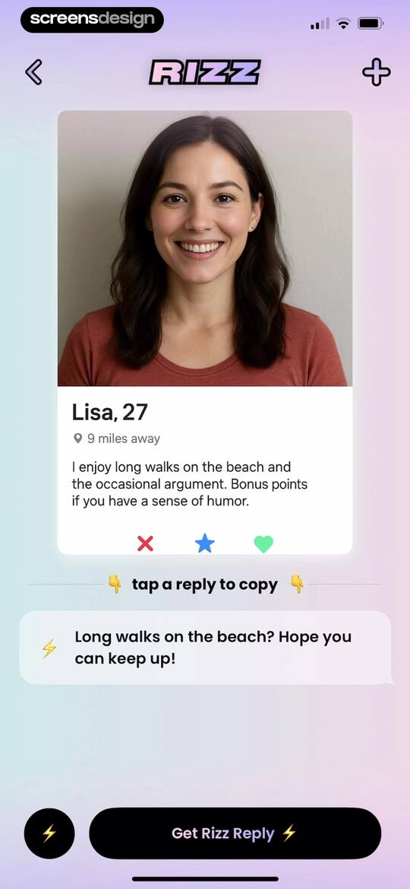
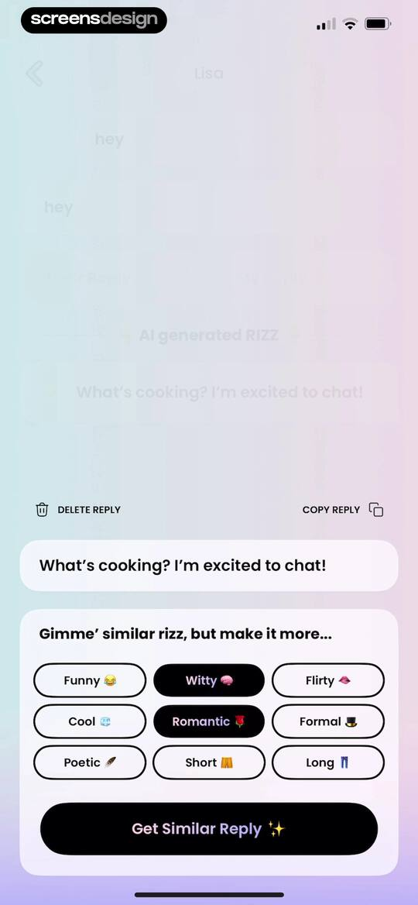
