# ShutEye®: Sleep Tracker, Sound Onboarding, Paywall & UX Flow — 145 Screens, $350k/mo

Source: https://screensdesign.com/apps/shuteye-sleep-tracker-sound/ (fetched 2026-10-05)

Stats: 

| # | Time | Image | What the screen shows |
|---|---|---|---|
| 1 | 00:00 | 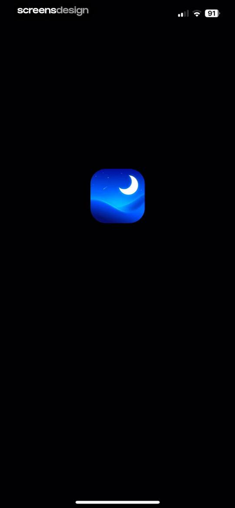 | Splash screen for the ShutEye app featuring a centered app icon with a moon and stars on a solid black background. |
| 2 | 00:01 | 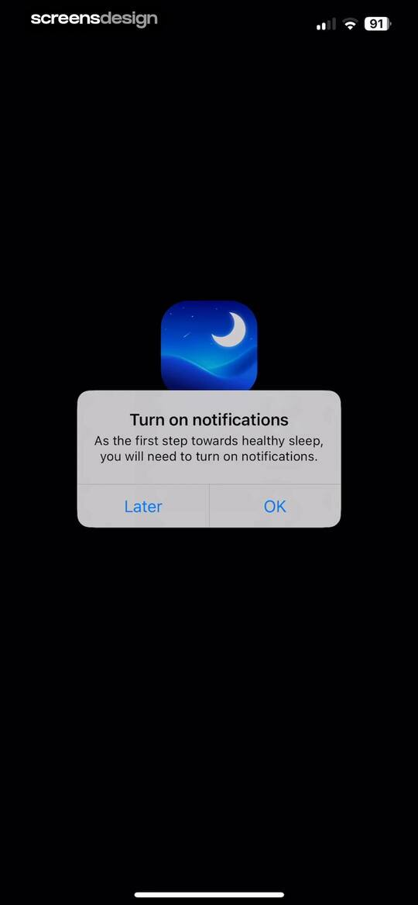 | Notification permission request modal for the ShutEye app, featuring an app icon, explanatory text, and Later and OK buttons. |
| 3 | 00:04 | 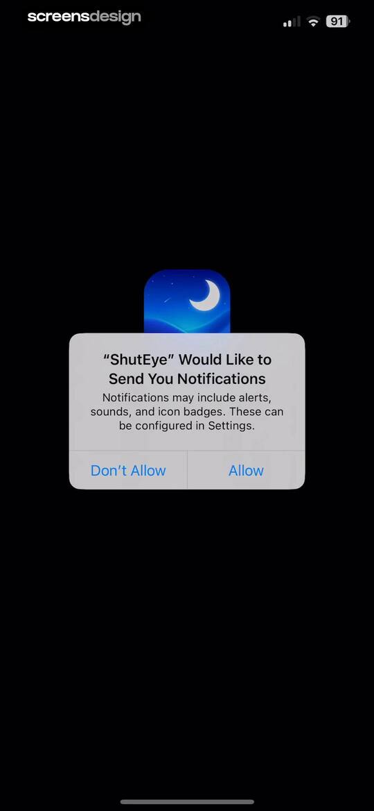 | System permission prompt asking if the ShutEye app would like to send notifications, with Don't Allow and Allow buttons. |
| 4 | 00:07 | 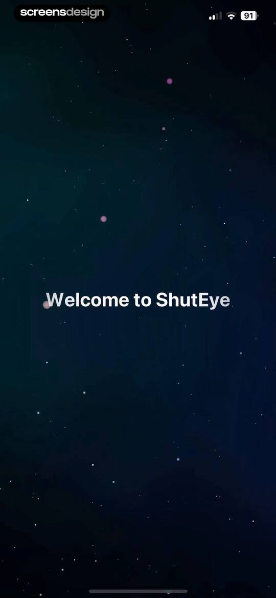 | Onboarding welcome screen displaying the text Welcome to ShutEye centered on a dark, starry background. |
| 5 | 00:08 | 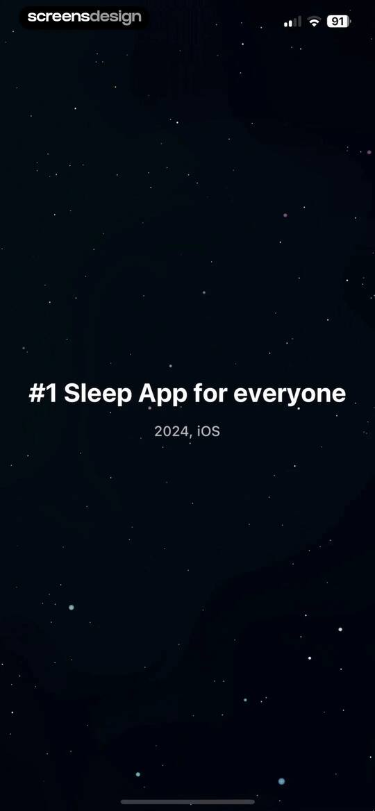 | Splash screen for the ShutEye sleep app on a dark starry background with centered text reading #1 Sleep App for everyone and 2024, iOS. |
| 6 | 00:10 | 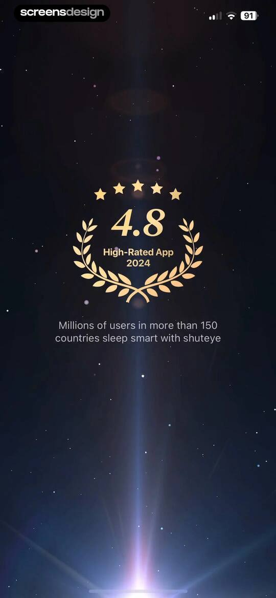 | Onboarding social proof screen for the ShutEye app displaying a 4.8 star rating emblem and global user statistics. |
| 7 | 00:15 | 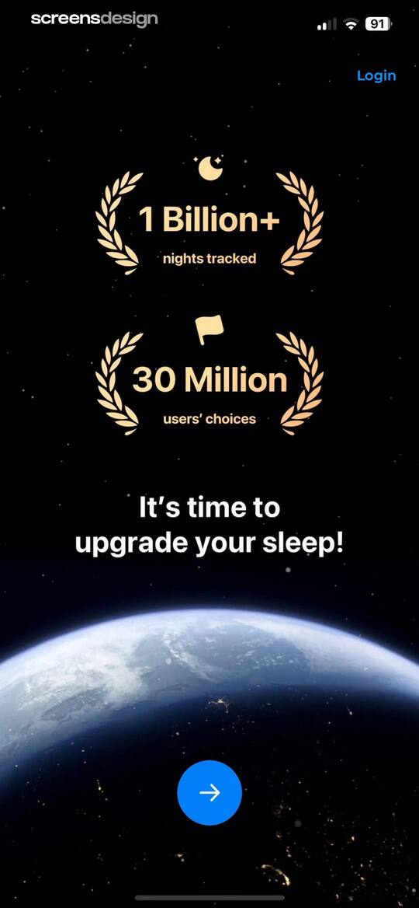 | Sleep app onboarding screen displaying social proof metrics, a headline about upgrading sleep, and a bottom forward arrow button over a space-themed background. |
| 8 | 00:19 | 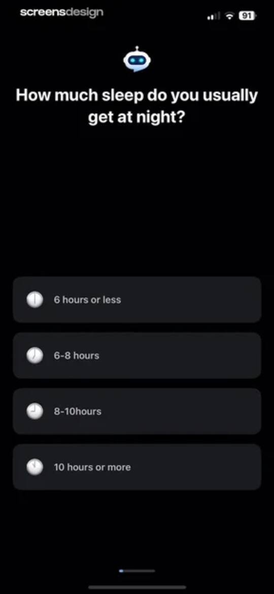 | ShutEye onboarding screen asking how much sleep the user usually gets at night, with four duration selection cards. |
| 9 | 00:23 | locked | Sleep satisfaction survey asking how satisfied you are with your sleep, with four vertical selection buttons ranging from very satisfied to very unsatisfied. |
| 10 | 00:29 | locked | ShutEye app onboarding screen explaining the CBT-I science program with a central brain illustration and a continue button. |
| 11 | 00:35 | locked | Onboarding question about sleep duration with a list of four selectable options and a bottom progress bar. |
| 12 | 00:40 | locked | Onboarding questionnaire screen asking about snoring and breathing interruption symptoms with four stacked answer cards. |
| 13 | 00:44 | locked | Onboarding screen asking about nighttime waking frequency, featuring a vertical list of four selection cards with icons. |
| 14 | 00:48 | locked | Onboarding questionnaire asking how often you wake up tired, with four frequency selection cards and a progress bar. |
| 15 | 00:54 | locked | ShutEye onboarding screen featuring a sleep quality line chart, social proof statistics, and a continue button. |
| 16 | 00:59 | locked | Onboarding questionnaire asking for sleep position with a vertical list of cards for back, side, fetal, and stomach positions. |
| 17 | 01:06 | locked | Onboarding screen asking about sleep habits, with the 'Stay up late' option selected and a continue button. |
| 18 | 01:10 | locked | Onboarding screen comparing good and bad sleep habits with a split-view layout, accompanying photos, and a forward navigation button. |
| 19 | 01:14 | locked | Onboarding survey asking about sleep impact, featuring a dark theme with an AI icon and four selectable response cards. |
| 20 | 01:19 | locked | Onboarding health assessment screen asking about prior diagnoses with a list of selectable sleep condition cards and a robot mascot icon. |
| 21 | 01:37 | locked | Onboarding screen highlighting sleep risk analysis with a product mockup and a next step button. |
| 22 | 01:42 | locked | ShutEye loading screen with a circular progress indicator at 14 percent, a robot icon, social proof text, and user avatars. |
| 23 | 01:47 | locked | Loading screen for a sleep report showing sixty-nine percent progress and social proof cards displaying download and rating metrics. |
| 24 | 01:52 | locked | Sleep event log listing nighttime behaviors like snoring and talking on cards with timestamps, set against a dark theme with a bottom navigation arrow. |
| 25 | 02:09 | locked | Onboarding screen highlighting patented sleep tracking features in a 2x2 grid with a patent badge and a bottom navigation button. |
| 26 | 02:26 | locked | Ambient sound selection screen with a grid of white noise icons, a mini player, and a continue button. |
| 27 | 02:34 | locked | Onboarding screen displaying a grid of bedtime story cards and a blue circular continue button at the bottom. |
| 28 | 02:38 | locked | Social proof onboarding screen with a 4.8 high-rated app badge, user testimonial card, and a blue navigation button at the bottom. |
| 29 | 02:50 | locked | Paywall screen with a solid black background and centered text offering a free seven-day trial. |
| 30 | 02:52 | locked | Paywall screen offering a 7-day free trial subscription, featuring plan options, feature highlights, and a Continue button. |
| 31 | 03:05 | locked | Subscription screen for the ShutEye app comparing annual and monthly plans, with the 7-day free trial annual plan selected and a Continue button. |
| 32 | 03:07 | locked | ShutEye paywall screen promoting premium features with a dark aesthetic, a central sleeping emoji, a Continue button, and a background photo of a sleeping woman. |
| 33 | 03:12 | locked | Paywall screen offering a discounted annual subscription plan with a countdown timer and a Continue button. |
| 34 | 03:15 | locked | ShutEye subscription paywall featuring an annual plan option and a Continue button on a dark background. |
| 35 | 03:23 | locked | Paywall screen for the ShutEye sleep app comparing annual and monthly subscription plans with a 50% discount enabled and a Continue button. |
| 36 | 03:35 | locked | Subscription paywall displaying an annual plan with a fifty percent discount selected, user testimonials, and a continue button. |
| 37 | 03:53 | locked | Status confirmation screen with an active toggle and the text 7 Days free-trial is enabled against a dark background. |
| 38 | 03:57 | locked | App Store subscription confirmation modal for the 1-Year ShutEye Premium Plan showing free trial details and a Confirm with Side Button action. |
| 39 | 04:03 | locked | Purchase confirmation modal in the ShutEye app with a sleeping emoji, a success message, and an OK button. |
| 40 | 04:11 | locked | Onboarding screen for the ShutEye sleep tracking app with a robot icon, Great Start headline, and a blue Continue button. |
| 41 | 04:15 | locked | Privacy onboarding screen featuring a top shield icon, health data security statement, and a blue Continue button. |
| 42 | 04:19 | locked | Microphone permission request screen for the ShutEye app with a Grant access button and Not now link. |
| 43 | 04:23 | locked | Microphone permission request screen for the ShutEye app, featuring a dark starry background, a system alert dialog, and a Grant access button. |
| 44 | 04:25 | locked | Onboarding screen displaying health data cards with metrics like heart rate and active energy, a sleep insights explanation, and a Continue button. |
| 45 | 04:28 | locked | Onboarding screen asking if the user has an Apple Health-compatible wearable device, featuring a watch illustration and Yes, I do and No, I don't buttons. |
| 46 | 04:30 | locked | ShutEye permission screen requesting access to connect with Apple Health, featuring a Continue button and a Not now link. |
| 47 | 04:33 | locked | Permissions onboarding modal for Apple Health integration, featuring a sleep data toggle and a Continue button. |
| 48 | 04:37 | locked | Permissions screen for the ShutEye app requesting health data access with individual toggles for write and read metrics, a Turn Off All button, and Allow and Don't Allow options. |
| 49 | 04:40 | locked | Onboarding completion screen featuring a robot icon, completion message about a personalized sleep report, and a Continue button. |
| 50 | 04:43 | locked | Onboarding screen featuring step one instructions for a sleep tracker, a product mockup with a tap-to-start tooltip, and a continue button. |
| 51 | 04:46 | locked | Onboarding screen showing a sleep report mockup with a score of 92, a sleep cycle chart, and a Continue button. |
| 52 | 04:49 | locked | Permission modal from the ShutEye app requesting activity tracking consent with Allow and Ask App Not to Track buttons. |
| 53 | 04:52 | locked | Welcome screen for ShutEye Premium Membership displaying centered white text on a dark background. |
| 54 | 04:57 | locked | Paywall screen for ShutEye family plan featuring a sleep data visualization card with a score of 88 and time asleep of 7 hr 45 min. |
| 55 | 05:01 | locked | ShutEye onboarding screen highlighting nocturnal sound tracking, featuring a central card showing a snore event surrounded by a background collage of sleep sound history. |
| 56 | 05:07 | locked | ShutEye splash screen featuring a centered blue-to-purple gradient card with the text PREMIUM MEMBERS against a dark, starry background. |
| 57 | 05:13 | locked | Paywall screen promoting the ShutEye family plan subscription at $59.99 per year, with a highlighted best choice card and a Continue button. |
| 58 | 05:21 | locked | ShutEye home screen with a horizontal feature icon row, a premium promotion banner with a Get Now button, and a white noise sound grid. |
| 59 | 05:34 | locked | Soundscape library screen in ShutEye featuring a grid of circular ambient sound icons, top category tabs, and a bottom playback control bar. |
| 60 | 05:47 | locked | Dashboard for mixing ambient sounds, featuring a list of active sound layers with volume sliders, a sleep timer, and a Save Mix button. |
| 61 | 05:57 | locked | Sleep timer modal overlay showing a countdown of 29:44, explanatory text about audio fading out, and a Reset Timer button. |
| 62 | 06:05 | locked | Timer modal overlay with a dark theme, showing a selected 45 minute duration and a Start button. |
| 63 | 06:19 | locked | Save custom mix modal with a text input field pre-filled with Mix 1 and a Done action button. |
| 64 | 06:21 | locked | Dark-themed account creation and login screen with an email signup button, a login link, and social login options at the bottom. |
| 65 | 06:42 | locked | ShutEye sign-up form with pre-filled name and email fields, a password field, a Sign up button, and social login options. |
| 66 | 06:53 | locked | Success confirmation modal stating Saved Successfully! with a checkmark button over a sound library interface. |
| 67 | 07:04 | locked | Content feed displaying a vertical list of sound mix cards with filter chips and a persistent bottom audio player. |
| 68 | 07:17 | locked | Save custom mix modal displaying three sound icons, a pre-filled name input field, and a Done button. |
| 69 | 07:31 | locked | Content feed displaying sleep music categories and track cards with a persistent bottom player on a dark theme. |
| 70 | 07:48 | locked | Audio player screen showing track info for Collect Oneself with playback controls, a progress bar, and a Track My Sleep button. |
| 71 | 07:55 | locked | Timer setting modal displaying thirty minutes selected on a horizontal slider, preset duration buttons, and a Start button. |
| 72 | 08:14 | locked | Healing Music list featuring a dark theme and vertical cards with track titles, artists, and durations for sleep. |
| 73 | 08:20 | locked | Onboarding screen introducing sleep tracking features with a Continue button and patent information at the bottom. |
| 74 | 08:24 | locked | Onboarding time picker screen for setting a wake-up time, displaying a selected time of 07:30 AM with a Continue button and a Not now link. |
| 75 | 08:31 | locked | ShutEye feature prompt explaining the Smart Alarm option with a sleep cycle chart and Yes or No action buttons. |
| 76 | 08:35 | locked | Sleep quality insight screen featuring a bar chart on alcohol impact and a prompt to try Sleep Note, with Yes! and Not now buttons. |
| 77 | 08:41 | locked | Sleep note form with emotional state and pre-sleep activity icon grids, featuring selected Stress and Alcohol options and a Done button. |
| 78 | 08:49 | locked | Sleep tracking onboarding instruction showing device placement next to the bed with a Continue button. |
| 79 | 08:54 | locked | Sleep tracker loading screen with a moon graphic and the text Good Night, Starting Sleep Tracker..., and Keep the charger connected. |
| 80 | 08:57 | locked | Sleep tracking dashboard displaying current time, alarm info, media player card for Peaceful Sleep, and a quit button. |
| 81 | 09:04 | locked | Alarm settings screen displaying a time-picker wheel set to 07:30 AM and configuration options for melodies, smart alarm, and snooze. |
| 82 | 09:07 | locked | Melody selection screen featuring a horizontal carousel of cards with the Happy Ukulele card selected and a Select button. |
| 83 | 09:21 | locked | Smart alarm settings screen listing wake-up phase intervals, with the 30 MIN option selected. |
| 84 | 09:26 | locked | Settings screen listing snooze duration options with the ten-minute option selected and a checkmark. |
| 85 | 09:34 | locked | Dark-themed sleep sound library grid with top navigation, category filters, and a bottom playback bar for Peaceful Sleep. |
| 86 | 09:41 | locked | Confirmation modal in a sleep tracking app asking whether to quit tracking, with Keep tracking and Quit now buttons. |
| 87 | 09:53 | locked | Sleep tracking dashboard showing a score of 87, sleep stage and snore timelines, summary metric cards, and a bottom navigation bar. |
| 88 | 10:24 | locked | ShutEye sleep tracking home screen with a premium promotion banner, white noise options, and the Sleep tab selected in the bottom navigation. |
| 89 | 10:27 | locked | Sleep music library feed featuring healing music sub-category filters, a featured Beat Insomnia track, and a grid of audio cards. |
| 90 | 10:30 | locked | VIP access confirmation screen with three stacked feature cards for sleep study, tracker, and solution, each featuring a Try Now button. |
| 91 | 10:33 | locked | Home screen for the ShutEye program with a centered logo, welcome message, and a bottom navigation bar. |
| 92 | 10:36 | locked | Program onboarding screen promoting a 14-day personalized sleep plan with a Start Now button and bottom navigation. |
| 93 | 10:42 | locked | ShutEye onboarding screen for a 14-day sleep program featuring a sleep analysis feature card, pagination dots, and a Start Now button. |
| 94 | 10:48 | locked | Onboarding screen introducing the ShutEye Program with a 14-day sleep improvement overview, central 3D body model card, and a Start Now button. |
| 95 | 10:50 | locked | ShutEye Elite subscription paywall offering a 50 percent discount for the annual plan at $59.99 per year, with a Continue button. |
| 96 | 11:05 | locked | Nap and relax timer with a duration picker, wake-up time, music player card, and a large circular start button. |
| 97 | 11:10 | locked | Active sleep session screen featuring a circular timer, a media player card for Peaceful Sleep, and a Quit button. |
| 98 | 11:12 | locked | Alarm settings screen with a melody selection row and a fade-in toggle switch on a dark background. |
| 99 | 11:15 | locked | Alarm sound settings screen featuring a vertical list of tones with the Hopeful default option selected. |
| 100 | 11:26 | locked | Empty state screen for My Dream with a centered prompt and a floating plus button in the bottom right corner. |
| 101 | 11:41 | locked | Dream journal editor screen in the ShutEye app with a text input area containing a dream entry and a gradient Analyze my dream button. |
| 102 | 12:11 | locked | Chat screen titled Dream Bot in the ShutEye app showing an ongoing conversation with an AI assistant about interpreting a dream, with a bottom text input field. |
| 103 | 12:20 | locked | Dream journal log screen displaying a single entry card for March 12, 2025, with a floating action button for adding new entries. |
| 104 | 12:25 | locked | Home screen displaying saved sleep aids and sound mixes in a vertical list, with the Sleep tab selected in the bottom navigation. |
| 105 | 12:36 | locked | Content feed displaying a vertical list of educational sleep health articles with a dark theme and bottom navigation. |
| 106 | 12:48 | locked | Blog article screen with a privacy consent modal overlaying the lower half, featuring an Accept All button and cookie policy options. |
| 107 | 13:01 | locked | ShutEye sound library screen displaying a grid of ambient sound buttons with the White Noise tab and Sleep navigation option selected. |
| 108 | 13:06 | locked | Home screen featuring sleep education articles, colored noise soundscapes, and healing music sections in a dark theme. |
| 109 | 13:09 | locked | Sleeppedia education screen listing sleep condition cards including Insomnia and Snoring under a dark theme. |
| 110 | 13:13 | locked | ShutEye educational article about insomnia, featuring a hero image of a person in bed and a bulleted list of overview facts. |
| 111 | 13:20 | locked | Educational article about insomnia with an overlay catalog modal displaying a table of contents and section links. |
| 112 | 13:30 | locked | Home screen featuring horizontal content carousels for sleep stories, videos, and meditations with a bottom navigation bar. |
| 113 | 13:41 | locked | Audio player screen for The Magic Shop by Christopher Fitton, with playback controls, media details, and a Track My Sleep button. |
| 114 | 13:49 | locked | Content feed displaying a vertical list of sleep and relaxation video cards with horizontal category tabs and a bottom navigation bar. |
| 115 | 14:01 | locked | Video player playing Intense LOFI Triggers for DEEP Sleep by April ASMR, with playback controls and a list of recommended videos below. |
| 116 | 14:05 | locked | ShutEye video player showing a dark theme playback interface with the title Intense LOFI Triggers for DEEP Sleep and a timestamp of 00:07/25:49. |
| 117 | 14:16 | locked | Dashboard featuring a weekly sleep score leaderboard, a top quote card, and social sharing options, with the Sleep tab selected in the bottom navigation. |
| 118 | 14:20 | locked | ShutEye program onboarding screen promoting a 14-day sleep improvement challenge, with a central body illustration and a Start Now button. |
| 119 | 14:22 | locked | Sleep note form featuring emotion and pre-sleep activity selection grids with a bottom Done button. |
| 120 | 14:27 | locked | Sleep tracker onboarding instruction screen illustrating device placement with a Continue button and Don't show again link. |
| 121 | 14:30 | locked | Sleep tracker loading screen on a dark background with a moon illustration, displaying Good Night and a charger reminder. |
| 122 | 14:35 | locked | ShutEye tracking dashboard displaying the current time, an alarm window, a media player card for The Magic Shop, and a Quit button. |
| 123 | 14:37 | locked | Sleep tracking dashboard with a noise interference warning modal, current time, alarm details, an OK button, and a Quit button. |
| 124 | 14:41 | locked | Confirmation modal asking to quit tracking due to insufficient sleep time, with Keep tracking and Quit now buttons. |
| 125 | 14:54 | locked | Sleep tracking dashboard showing a score of 87, a sleep stage graph, metric cards, and a demo mode banner. |
| 126 | 14:58 | locked | ShutEye sleep tracking home screen displaying a personalized greeting, initial zero-stat sleep summary, a premium membership promotional banner, and related app recommendations. |
| 127 | 15:08 | locked | Wake-up alarm settings screen with a central time-picker set to 07:30 AM, an active alarm toggle, and options for melodies, smart alarm, and snooze. |
| 128 | 15:11 | locked | Settings screen for Placement Reminders with the toggle set to off and a descriptive text block below. |
| 129 | 15:16 | locked | Settings screen for a Gear-Up Reminder with an off toggle and explanatory text for wearable sleep analysis. |
| 130 | 15:19 | locked | Battery Warning settings screen with an active toggle set to on and an explanatory text about charging reminders. |
| 131 | 15:22 | locked | Sleep Note settings screen with an active toggle and a descriptive text paragraph explaining the feature. |
| 132 | 15:26 | locked | Settings screen for Wake-up Mood with an active toggle switch and descriptive text about tracking wake-up moods. |
| 133 | 15:29 | locked | Redemption form for an activation code with an empty input field and a disabled Activate button. |
| 134 | 15:35 | locked | Sleep reminder settings screen with an active toggle, a central time picker set to 11:00 PM, and a tone selection option. |
| 135 | 15:38 | locked | Apple Health permissions settings with a list of health categories, showing the Sleep category selected with a checkmark and an About Permissions link. |
| 136 | 15:41 | locked | Dark-themed account settings screen with Profile and Account sections, displaying user details alongside options to reset the password, delete the account, and log out. |
| 137 | 15:44 | locked | Profile name editing screen displaying a pre-filled input field with the name Julia and a Save button. |
| 138 | 15:50 | locked | Password reset screen for the ShutEye app with an email input field and a Reset password button. |
| 139 | 15:53 | locked | Account deletion survey listing multiple selectable reasons with a disabled Continue button and a Skip option. |
| 140 | 15:59 | locked | Siri Shortcuts settings screen with a list of app actions and Add to Siri buttons on a dark background. |
| 141 | 16:02 | locked | Confirmation modal showing the added Siri shortcut for ShutEye, with a central Siri orb icon and a blue Done button. |
| 142 | 16:08 | locked | Live Activity settings screen with an enabled toggle and a descriptive text block about the sleep tracker. |
| 143 | 16:11 | locked | FAQ screen with a list of help topics about sleep tracking and alarm features, featuring a dark theme and a website link at the bottom. |
| 144 | 16:14 | locked | FAQ screen explaining how the sleep tracker works using microphone recordings and artificial intelligence algorithms. |
| 145 | 16:18 | locked | Profile settings screen displaying grouped menu items including sleep reminders and account options, with the profile tab selected in the bottom navigation bar. |

## Free showcase screenshots (unordered)

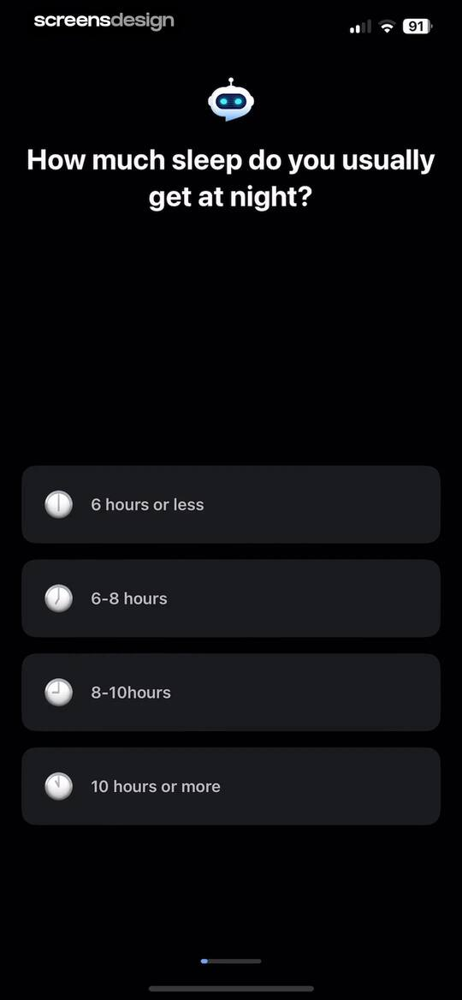
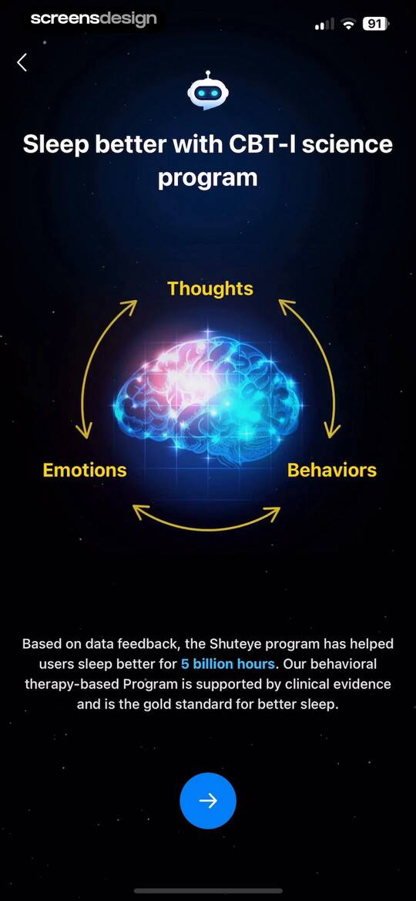
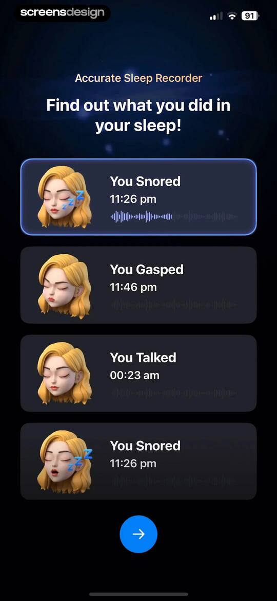
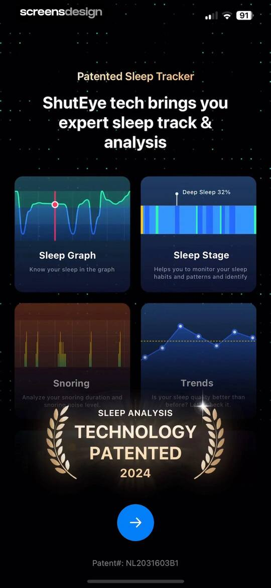
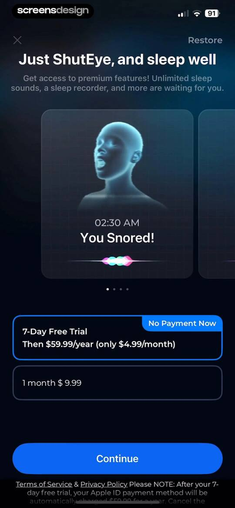
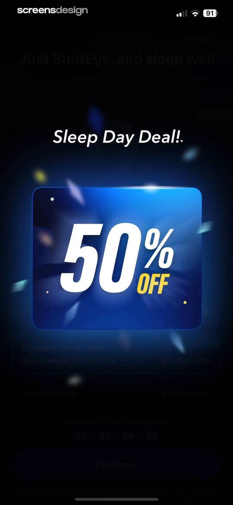
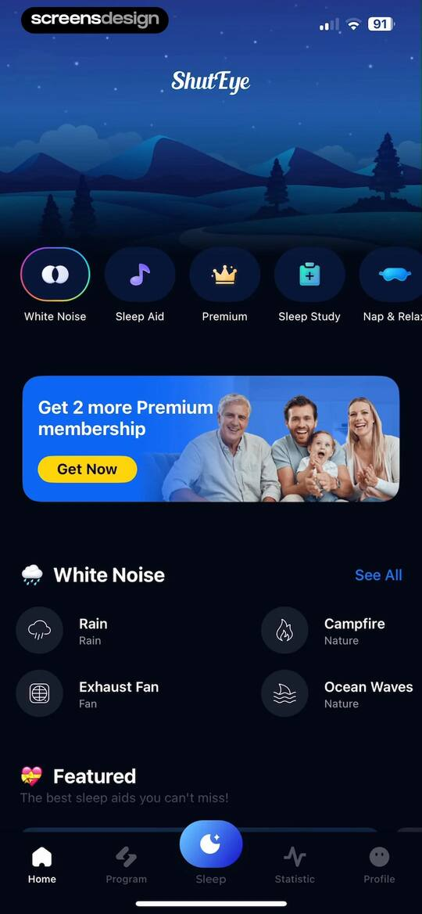
