# Sleep Cycle - Tracker & Sounds Onboarding, Paywall & UX Flow — 91 Screens, $650k/mo

Source: https://screensdesign.com/apps/sleep-cycle-tracker-sounds/ (fetched 2026-10-05)

Stats: 

| # | Time | Image | What the screen shows |
|---|---|---|---|
| 1 | 00:00 | 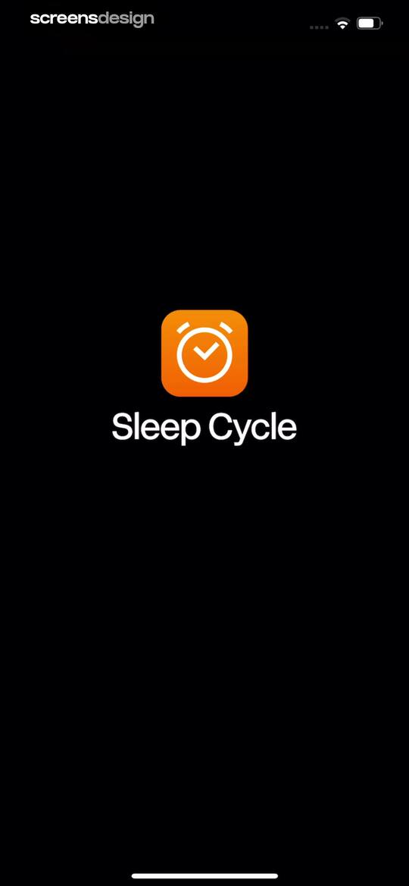 | Splash screen for the Sleep Cycle app featuring an orange alarm clock icon and white text centered on a solid black background. |
| 2 | 00:07 | 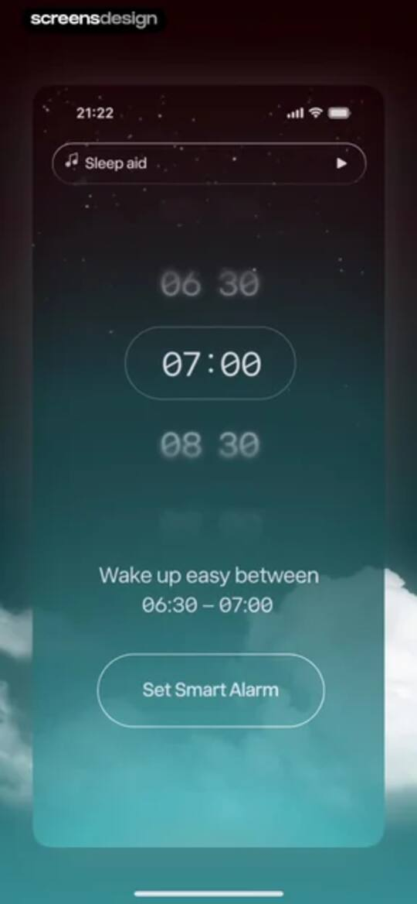 | Smart alarm setup screen with a central time picker wheel, wake-up window text, and a Set Smart Alarm button. |
| 3 | 00:12 | 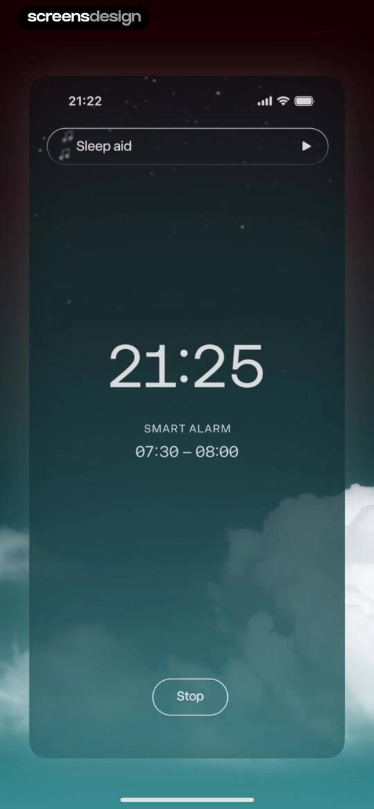 | Active sleep tracking dashboard with the current time, smart alarm status, and a bottom Stop button. |
| 4 | 00:16 | 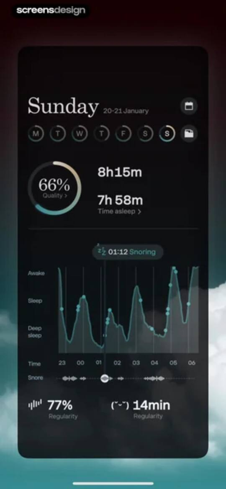 | Sleep tracking dashboard displaying a calendar strip, a 66% quality score, a central sleep stage graph, and regularity metrics. |
| 5 | 00:25 | 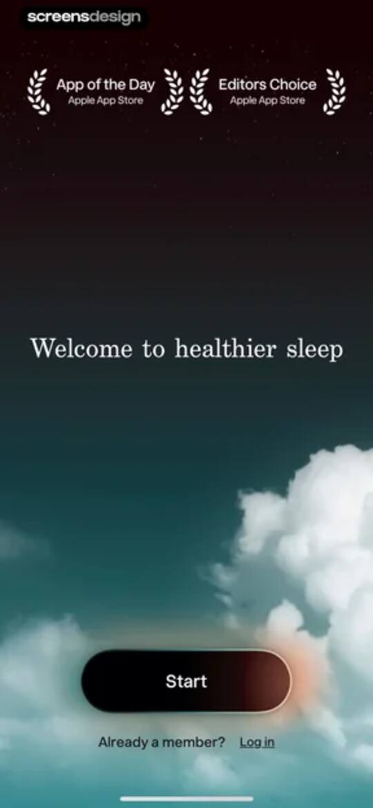 | Sleep app welcome screen featuring social proof badges, a central headline, a Start button, and a Log in link over a dark night sky background. |
| 6 | 00:30 | 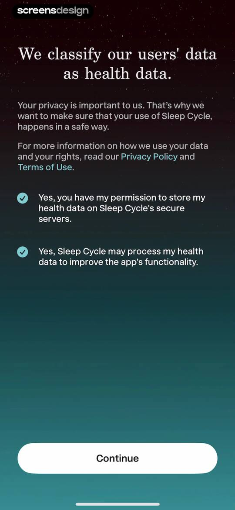 | Sleep Cycle privacy and data consent screen with two selected checkboxes for health data storage and processing, and a Continue button. |
| 7 | 00:36 | 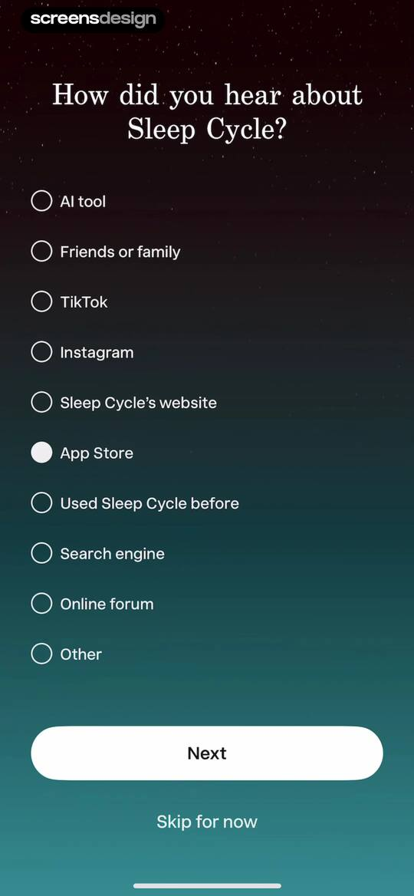 | Sleep Cycle onboarding survey screen asking how the user heard about the app, with App Store selected and a Next button. |
| 8 | 00:39 | 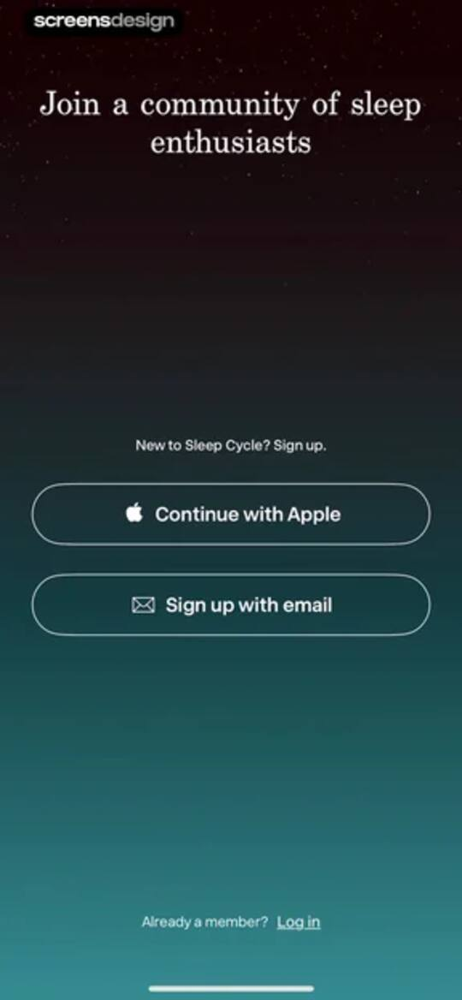 | Sleep Cycle sign-up screen featuring authentication buttons for Apple and email against a dark gradient background. |
| 9 | 01:07 | locked | Sign-up form with pre-filled email and first name, a password validation error, and a Create account button. |
| 10 | 01:12 | locked | Onboarding screen asking users to select their sleep goals from a list with a Next button at the bottom. |
| 11 | 01:14 | locked | Permission request screen explaining the benefits of enabling sleep notifications, featuring a Next button at the bottom. |
| 12 | 01:17 | locked | Sleep Cycle notification permission onboarding screen with a system modal and a Next button. |
| 13 | 01:19 | locked | Subscription paywall screen explaining free trial steps, with a Start free trial button and yearly pricing details below. |
| 14 | 01:25 | locked | App Store subscription confirmation modal for Sleep Cycle Premium offering a one-week free trial and annual plan with a confirm with side button action. |
| 15 | 01:30 | locked | Subscription paywall with a free trial timeline and a purchase success modal overlay displaying an OK button. |
| 16 | 01:36 | locked | Home screen with a central wake-up time picker, a wake-up window, a start button, and a bottom navigation bar. |
| 17 | 01:51 | locked | Sleep analysis setup onboarding screen explaining sound detection and data privacy, with a central graphic and a Next button. |
| 18 | 01:56 | locked | Sleep analysis setup screen with a central graphic, three feature points about sound detection and privacy, and a Next button. |
| 19 | 02:02 | locked | Permission request screen asking for microphone access with explanatory bullet points about sleep tracking and a Next button. |
| 20 | 02:04 | locked | Onboarding instruction screen with a central illustration on how to place and charge the device, featuring an OK button. |
| 21 | 02:08 | locked | Sleep Cycle onboarding instruction screen explaining how to snooze the alarm, featuring a central bedroom illustration and an OK button. |
| 22 | 02:17 | locked | Sleep tracking and alarm interface in dark mode displaying the current time, active alarm window, and a swipe-up Stop button. |
| 23 | 02:23 | locked | Alarm setting screen with a dark theme time picker, current time display, and Cancel and Done action buttons. |
| 24 | 02:40 | locked | Active sleep tracking screen with a time display, top sleep aid audio control, and a bottom swipe-to-stop gesture area. |
| 25 | 02:43 | locked | Sleep Cycle alarm dismissal screen featuring a dark night sky background, a centered stop alarm icon, and a Stop alarm button. |
| 26 | 02:47 | locked | Sleep app home screen with a time picker set to 11:35 AM, status text, large Start button, and bottom navigation. |
| 27 | 02:49 | locked | Sleep tracking home screen with a Start button, sleep status indicators, and a top audio control for sleep aids. |
| 28 | 02:54 | locked | Content feed featuring sleep aid audio with filter tabs, featured stories, recently released tracks, and a spatial audio section in a dark theme. |
| 29 | 03:10 | locked | Content feed displaying spatial audio and sleep coaching sections with a top mini-player bar and content cards. |
| 30 | 03:17 | locked | Sleep coaching feed with an active audio player bar, illustrated content cards by Tom Middleton, and a Show all button. |
| 31 | 03:24 | locked | Content feed displaying relaxation and meditation guides and music cards in a dark-themed interface with a pause control. |
| 32 | 03:30 | locked | Sleep and relaxation content library with a persistent player bar at the top and horizontal cards for music and bedtime rhymes. |
| 33 | 03:37 | locked | Ambience sound selection screen displaying a dark grid of audio cards and a top player bar playing Sunset Serenity. |
| 34 | 03:44 | locked | Audio content feed with a top player bar and categorized cards for stories and classical music in a dark theme. |
| 35 | 03:57 | locked | Programs feed displaying a vertical list of wellness cards including Sleep Coaching with Dr. Mike and Relax from Stress, with a bottom navigation bar. |
| 36 | 03:59 | locked | Sleep coaching program screen displaying a hero header, progress indicator, and a grid of video modules with the Programs tab selected. |
| 37 | 04:03 | locked | Video player for teen sleep education featuring an Unmute button and explanatory text over a dark background. |
| 38 | 04:07 | locked | Video player screen titled Fix teen sleep struggles with playback controls and a close button. |
| 39 | 04:30 | locked | Program content feed titled Sleep for parents displaying a completion progress of 0 out of 2 and two side-by-side program cards. |
| 40 | 04:36 | locked | Sleep tracking dashboard displaying a quality summary, sleep stage graph, and breakdown of awake, dream, light, and deep sleep stages. |
| 41 | 04:43 | locked | Health dashboard displaying a cough radar map for New York, coughing frequency, and breathing disruption metrics on a dark background. |
| 42 | 04:46 | locked | Sleep dashboard with a sound analysis graph, AI chat interface, and a bottom navigation bar. |
| 43 | 04:50 | locked | Analytics screen with demo sleep statistics charts requiring more data and time-range filter tabs at the top. |
| 44 | 04:56 | locked | Statistics dashboard displaying sleep and health charts in dark mode with a time range selector and bottom navigation bar. |
| 45 | 05:01 | locked | Permissions screen for the Sleep Cycle app requesting Apple Health data access, featuring allow and don't allow actions and a data category list. |
| 46 | 05:11 | locked | Profile screen with a dark theme displaying sleep statistics, a premium notification card, feature lists, and configurable settings options. |
| 47 | 05:15 | locked | Benefits screen displaying limited offers and other apps, featuring a redeemed Sleep Cycle Premium card and a Life Cycle download offer. |
| 48 | 05:24 | locked | Health monitoring dashboard displaying a map of the Philippines, a top-left risk level legend, and a bottom data card with a cough trend chart. |
| 49 | 05:27 | locked | Health data map view showing geographic cough frequency trends for the Philippines with a bottom data card and play button. |
| 50 | 05:31 | locked | Map data visualization screen with a top-left legend, right-side control icons, and a bottom timeline scrubber showing a date of May 29, 2025. |
| 51 | 05:39 | locked | Cough radar legend modal explaining color-coded cough frequency levels, data adequacy, and a medical disclaimer with a close button. |
| 52 | 05:42 | locked | Settings screen for cough radar configuration with toggle options for notifications and an informational about section. |
| 53 | 05:47 | locked | Sharing interface for the Sleep Cycle app cough radar with video and image preview cards, copyable text, and a bottom share button. |
| 54 | 05:55 | locked | Share sheet displaying options for the Cough radar map with a close button and a vertical list of actions. |
| 55 | 05:57 | locked | Permissions screen with a system modal requesting photo access to save shared cough radar content, featuring Allow and Don't Allow buttons. |
| 56 | 06:07 | locked | Sleep goal feature introduction screen with a target illustration, descriptive text, and a Create a Sleep Goal button. |
| 57 | 06:09 | locked | New Sleep Goal configuration form with a central circular dial showing an eight hour duration, day selection, and a Done button. |
| 58 | 06:13 | locked | New Sleep Goal configuration form with day toggles, a circular time dial showing bedtime and wake-up times, and a Done button. |
| 59 | 06:24 | locked | Sleep goal configuration form displaying bedtime reminder options and an active alarm type selection modal with Cancel and Done buttons. |
| 60 | 06:30 | locked | Sleep goal configuration form with bedtime reminder options, the 30 minutes before option selected, and Cancel and Done buttons. |
| 61 | 06:36 | locked | Informational About screen from the Sleep Cycle app explaining sleep rhythms and methodology in dark mode with a close button. |
| 62 | 06:43 | locked | Sound selection menu displaying a scrollable dark-themed list of audio options including standard and premium sounds. |
| 63 | 06:45 | locked | Permission request modal in the Sleep Cycle app asking for access to Apple Music for custom alarm melodies, with Allow and Don't Allow buttons. |
| 64 | 06:53 | locked | Wake up phase settings screen featuring a list of duration options with the 30 minutes recommended option selected. |
| 65 | 06:57 | locked | Apple Watch settings screen with options for automatic tracking, journal notifications, and snooze, followed by informational usage recommendations. |
| 66 | 06:59 | locked | Settings screen for automatic Apple Watch sleep tracking with On and Off radio buttons, a disclaimer, and an about section. |
| 67 | 07:02 | locked | Permissions screen for health data access featuring read and write toggle lists for metrics like sleep and heart rate, with allow and don't allow buttons. |
| 68 | 07:05 | locked | Automatic tracking settings screen for Apple Watch with an enabled toggle and a warning banner about Apple Health data access. |
| 69 | 07:11 | locked | Settings screen for journal notifications with On and Off toggles for Apple Watch and an informational about section. |
| 70 | 07:14 | locked | Apple Watch snooze settings screen with Intelligent option selected and an explanatory text block about intelligent snooze. |
| 71 | 07:22 | locked | Weekly report settings screen with toggle options for enabling reports and notifications, set against a dark theme. |
| 72 | 07:25 | locked | Settings screen with Personal and Alarm sections, displaying options for account, apple health, motion detection, and snooze configuration. |
| 73 | 07:27 | locked | Profile settings screen with account management links, data deletion options, and an about section in a dark theme. |
| 74 | 07:29 | locked | Account settings screen in dark mode with account management options and an active logout confirmation modal. |
| 75 | 07:34 | locked | Account settings screen displaying a confirmation modal to permanently delete your account and sleep data, with Delete account and Cancel buttons. |
| 76 | 07:38 | locked | Profile settings screen titled About you displaying personal information options, an anonymous survey participation section, and a bottom navigation bar. |
| 77 | 07:40 | locked | Unit of measure settings screen with Metric and Imperial options on a dark theme. |
| 78 | 07:47 | locked | Weight selection form with a central vertical scrolling picker showing 57 kg and a dark theme. |
| 79 | 07:52 | locked | Onboarding height selection screen with a vertical scrolling picker displaying centimeters and 151 cm selected. |
| 80 | 07:56 | locked | Gender selection form on a dark background with a list of options including Female, Male, and Other. |
| 81 | 08:04 | locked | Birthdate selection screen with a dark theme, displaying a central date picker wheel set to August 30 1999. |
| 82 | 08:11 | locked | Consent and privacy settings screen displaying three data sharing permissions with the first two options selected. |
| 83 | 08:14 | locked | Permissions settings screen to connect Apple Health, featuring an explanation of health metrics integration and a Connect to Apple Health button. |
| 84 | 08:17 | locked | Permissions screen for the Sleep Cycle app requesting access to Apple Health data with read and write toggles and an Allow button. |
| 85 | 08:23 | locked | Settings screen for sound detection and audio retention options, with 20 nights recommended selected and a storage erasure link. |
| 86 | 08:26 | locked | Motion detection settings screen with options for microphone and accelerometer, an informational text block, and an instructional illustration. |
| 87 | 08:29 | locked | Settings screen for snooze options with Intelligent selected and an explanatory text block below. |
| 88 | 08:58 | locked | Settings screen with a dark-themed list of health and integration toggles, featuring a Profile tab selected in the bottom navigation bar. |
| 89 | 09:04 | locked | Help screen in the Sleep Cycle app with a search bar and a vertical list of support categories including account settings and troubleshooting. |
| 90 | 09:06 | locked | Help and FAQ settings screen featuring a search bar and a vertical list of account management topics in dark mode. |
| 91 | 09:08 | locked | Account settings screen displaying password reset instructions and a link, with a dark theme and bottom navigation bar. |

## Free showcase screenshots (unordered)

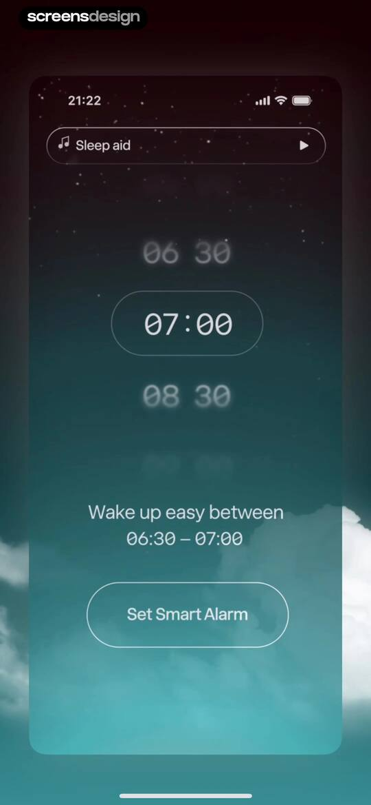
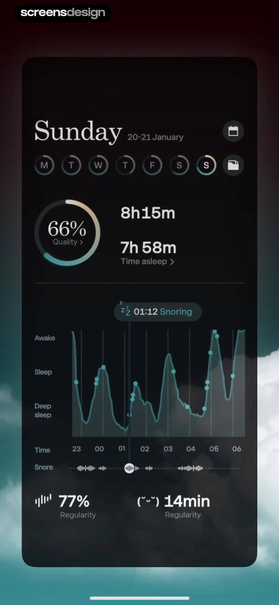

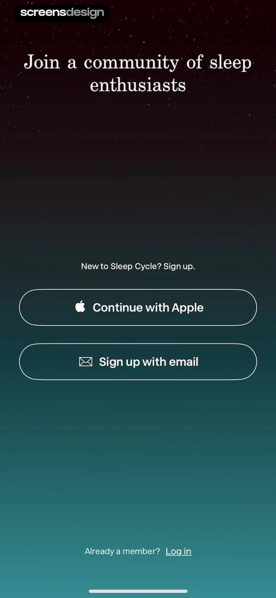
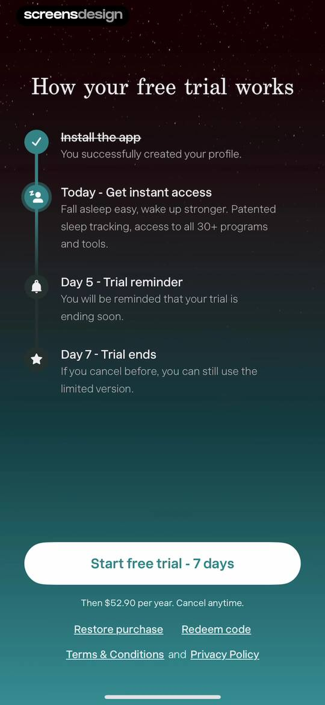
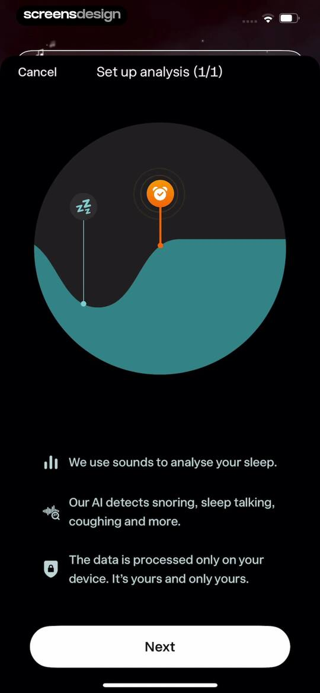
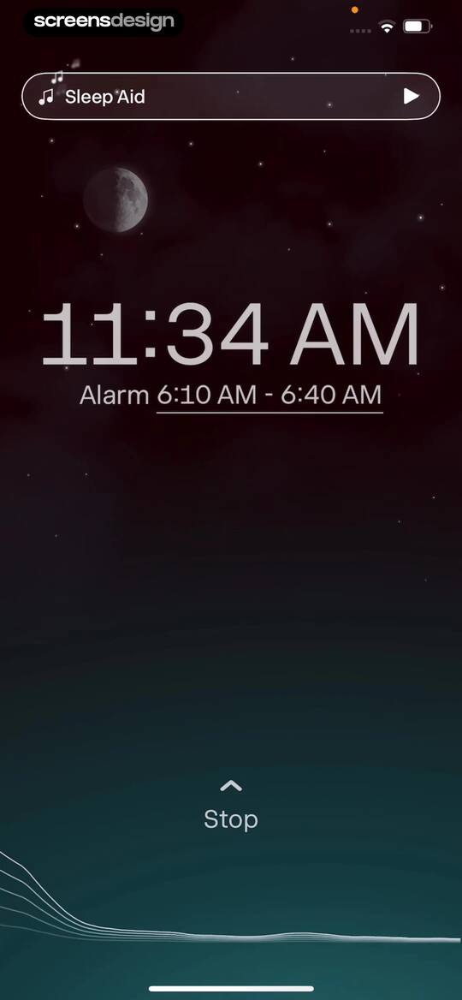
