# Structured: Daily Planner Todo Onboarding, Paywall & UX Flow — 104 Screens, $300k/mo

Source: https://screensdesign.com/apps/structured-daily-planner/ (fetched 2026-10-05)

Stats: 

| # | Time | Image | What the screen shows |
|---|---|---|---|
| 1 | 00:00 |  | Structured splash screen featuring a single centered checkmark icon on a plain white background. |
| 2 | 00:04 |  | Structured app onboarding screen with a central illustration of a notebook and coffee, a welcome message, and a next button. |
| 3 | 00:13 | 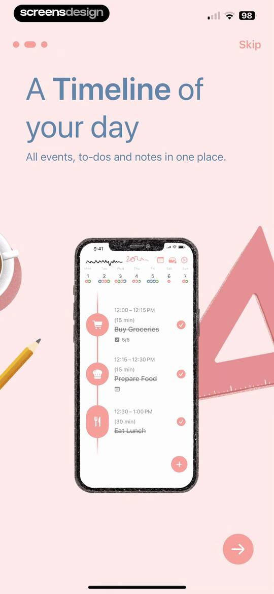 | Onboarding screen introducing a daily timeline feature with a product mockup, progress dots, Skip button, and Next arrow. |
| 4 | 00:17 | 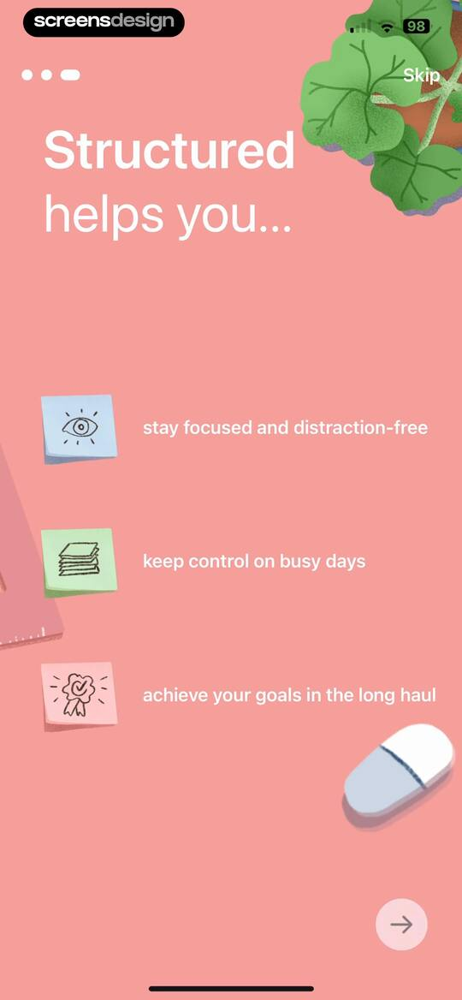 | Structured onboarding screen highlighting three value propositions with icons, a skip button, and a next arrow. |
| 5 | 00:21 | 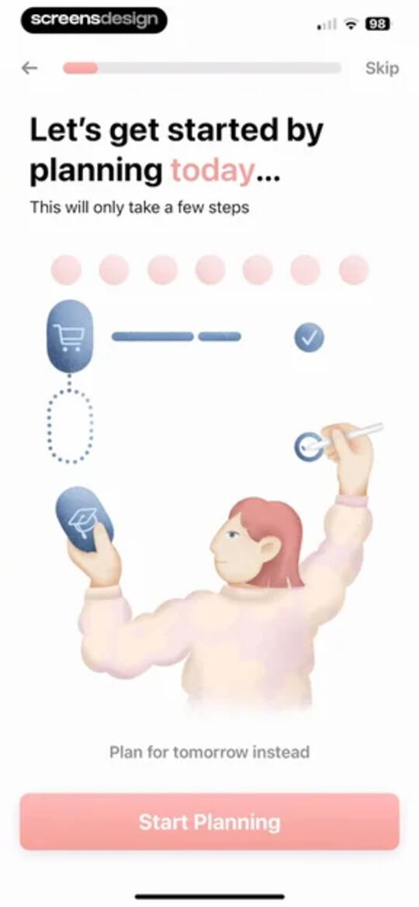 | Onboarding screen introducing daily planning with a central illustration, progress indicator, and Start Planning button. |
| 6 | 00:28 | 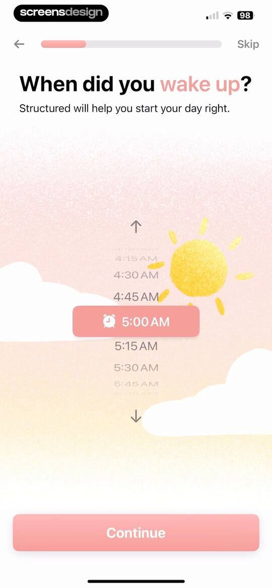 | Wake-up time onboarding screen with a central time picker set to 5:00 AM and a Continue button. |
| 7 | 00:35 | 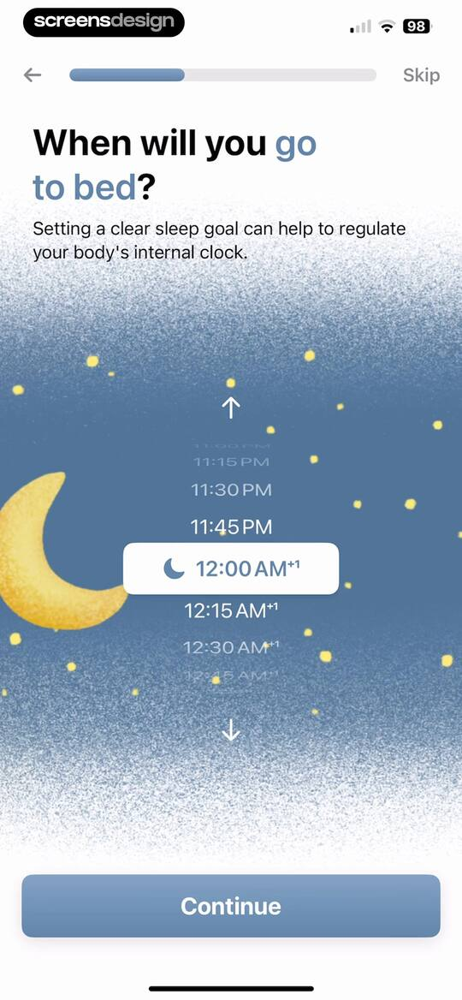 | Onboarding screen asking when you will go to bed, featuring a central time picker with a moon icon and a Continue button. |
| 8 | 00:39 | 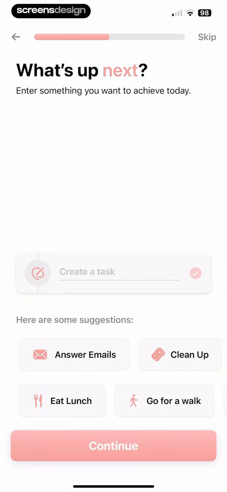 | Onboarding screen prompting the user to enter a task or choose from suggestions like Answer Emails, with a Continue button. |
| 9 | 00:52 | locked | Onboarding screen to choose a task start time, featuring a walking task card, vertical time picker set to 6:00 AM, and a Continue button. |
| 10 | 01:03 | locked | Task duration onboarding screen with a walking task summary, a selected one-hour duration option, and a Continue button. |
| 11 | 01:11 | locked | Onboarding color selection screen prompting users to pick a task color, featuring a task preview card and a Continue button. |
| 12 | 01:15 | locked | Onboarding color selection screen with a task preview card and a modal dialog asking whether to set the app's theme. |
| 13 | 01:18 | locked | Onboarding completion screen displaying a structured plan timeline with tasks and a Finish Setup button. |
| 14 | 01:22 | locked | Onboarding notification permission modal displaying an Allow Notifications button and a background summary of structured tasks. |
| 15 | 01:25 | locked | Permission onboarding screen for the Structured app requesting notification access with an Allow Notifications button and Skip option. |
| 16 | 01:28 | locked | Subscription paywall screen comparing Structured Free and Pro plans, featuring a trial offer of 3 days free then $14.99 per year and a Start your free trial button. |
| 17 | 01:40 | locked | Paywall screen presenting monthly, yearly, and lifetime plan options with social proof and a modal close button. |
| 18 | 01:47 | locked | iOS system subscription confirmation modal for Structured Pro showing yearly pricing, a free trial, and a side-button confirmation prompt. |
| 19 | 01:53 | locked | Purchase success modal with a confirmation message and OK button, displayed over a subscription paywall with social proof and testimonials. |
| 20 | 01:59 | locked | Structured Pro subscription screen detailing premium features and a trial reminder, with a Continue button at the bottom. |
| 21 | 02:01 | locked | Calendar permission request modal displayed over a trial reminder screen with Allow Full Access and Don't Allow buttons. |
| 22 | 02:07 | locked | Structured subscription benefits screen with an overlaid permission modal requesting access to Reminders, featuring Allow and Don't Allow buttons. |
| 23 | 02:16 | locked | Dashboard with a top calendar strip and a vertical timeline of scheduled tasks for April 21, including a bottom navigation bar and a floating action button. |
| 24 | 02:28 | locked | Task creation modal with a text input field, a list of suggested tasks, and a Continue button. |
| 25 | 02:48 | locked | Task creation form with input fields for title, time, duration, and color selection, featuring a Create Task button. |
| 26 | 02:51 | locked | Task creation modal with color selection, frequency toggles, alert lists, detail inputs, and a Create Task button. |
| 27 | 03:02 | locked | Task alert configuration form with a centered time picker modal and an Add Alert button. |
| 28 | 03:30 | locked | Task creation form with alert options, a subtask for cleaning the trash bin, and a Create Task button. |
| 29 | 03:34 | locked | Home screen showing a daily timeline of tasks with a top calendar strip, bottom navigation bar, and floating action button. |
| 30 | 03:37 | locked | Dashboard with a top calendar strip and a vertical timeline of tasks, featuring an active Timeline tab in the bottom navigation. |
| 31 | 03:43 | locked | Home screen showing a vertical task timeline and a calendar strip, overlaid with an onboarding modal explaining task management basics and a delete button. |
| 32 | 03:47 | locked | Daily timeline screen featuring a task deletion confirmation modal with Delete Task and Cancel buttons. |
| 33 | 03:57 | locked | Onboarding modal with instructions to add and customize tasks, displayed over a calendar timeline with a delete button at the bottom. |
| 34 | 04:08 | locked | New task form with a text input field, a list of suggested tasks with durations, and a Continue button. |
| 35 | 04:18 | locked | New task creation form pre-filled with the title Answer Emails, date, time range, duration, color options, and a Create Task button. |
| 36 | 04:25 | locked | App rating modal in Structured asking to tap a star to rate on the App Store, with star icons, Cancel, and Submit buttons. |
| 37 | 04:26 | locked | Feedback modal overlaying a daily planner interface with a write a review button and an OK button. |
| 38 | 04:32 | locked | Daily planner dashboard showing an April 2025 calendar strip, a vertical timeline with events, and a bottom navigation bar. |
| 39 | 04:40 | locked | Home daily planner screen with a timeline of tasks and a bottom monthly calendar sheet for May 2025. |
| 40 | 04:49 | locked | Daily planner dashboard with a weekly calendar strip, a timeline showing morning and evening routines, and a bottom sheet date picker. |
| 41 | 05:02 | locked | Home daily planner screen with a vertical timeline, April calendar strip, and a bottom sheet displaying task details for Rise and Shine. |
| 42 | 05:28 | locked | Dashboard with a daily timeline and calendar strip, featuring a bottom task detail modal with delete, duplicate, complete, and edit options. |
| 43 | 05:30 | locked | Task deletion confirmation modal displayed over a daily planner timeline, with Delete Task and Cancel buttons. |
| 44 | 05:35 | locked | Daily planner dashboard showing a vertical timeline schedule and an active task details modal overlay with action buttons. |
| 45 | 05:38 | locked | Task duplication modal with time, date, duration, and color settings, displaying a Duplicate Task button at the bottom. |
| 46 | 05:47 | locked | Home screen showing a daily timeline and an active task detail modal for Answer Emails with action buttons. |
| 47 | 05:54 | locked | Task editor modal with fields for task name, date, time, duration, and color swatches, ending with an Update Task button. |
| 48 | 06:01 | locked | Task inbox empty state screen featuring an illustration, a New Inbox Task button, and a bottom navigation bar. |
| 49 | 06:05 | locked | New Task form with a text input field, a vertical list of task suggestions with durations and icons, and a Continue button. |
| 50 | 06:07 | locked | Task creation form with fields for task name, duration, and a Create Task button. |
| 51 | 06:11 | locked | Task list home screen displaying an inbox view with a Watch a Movie card and bottom navigation. |
| 52 | 06:18 | locked | Task management dashboard with an open modal overlay displaying actions like Complete, Delete, and Edit Task for the selected item. |
| 53 | 06:25 | locked | Home screen showing a daily schedule timeline with a calendar strip for April 2025 and a bottom navigation bar. |
| 54 | 06:27 | locked | Privacy and data consent screen detailing data sent to AI servers, with a list of shared data types and an Accept Terms button. |
| 55 | 06:33 | locked | Privacy and data consent modal with data usage details, a data sharing dropdown set to Always Ask, an FAQ list, and an Accept Terms button. |
| 56 | 06:45 | locked | AI chat screen for a daily planner app featuring a feature spotlight card, suggestion chips, and a text input field. |
| 57 | 06:56 | locked | AI chat screen featuring a greeting, a prompt input card with a workout plan request, and a Generate button. |
| 58 | 06:59 | locked | AI chat screen displaying a prompt for a workout plan with a brainstorming loading state and a Stop button. |
| 59 | 07:01 | locked | Permission request screen asking whether to allow Structured AI to access tasks and inbox, featuring Allow and Don't Allow buttons. |
| 60 | 07:18 | locked | AI chat screen displaying a generated vacation workout plan with a list of task cards and action buttons to add, edit, or discard suggestions. |
| 61 | 07:22 | locked | AI chat screen displaying a two-week vacation workout plan with daily task cards and an expanded card showing action buttons. |
| 62 | 07:27 | locked | Task creation form with fields for task details, frequency options, and a prominent Create Task button. |
| 63 | 07:37 | locked | Fitness activity feed listing scheduled workouts with an Accept All button and a bottom navigation bar. |
| 64 | 07:46 | locked | Feedback modal overlay on a fitness workout list, with a text input field, improvement consent toggle, and a Submit Feedback button. |
| 65 | 07:53 | locked | AI workout plan dashboard displaying an AI-generated two-week vacation schedule with a vertical list of fitness tasks and edit buttons. |
| 66 | 07:57 | locked | AI workout plan dashboard displaying a summary, an AI disclaimer, and a vertical list of scheduled tasks with an expanded cardio option. |
| 67 | 08:00 | locked | Daily planner dashboard with a timeline schedule and an active task details modal displaying actions like Edit Task and Complete. |
| 68 | 08:12 | locked | AI chat screen displaying a generated vacation workout plan with a prompt card, disclaimer, and scheduled task list. |
| 69 | 08:15 | locked | Onboarding screen introducing the Structured AI feature with a smartphone mockup illustration, progress bar, skip button, and a Continue button. |
| 70 | 08:18 | locked | Structured onboarding screen introducing AI schedule generation, featuring sample task cards and a continue button. |
| 71 | 08:20 | locked | Onboarding screen introducing an AI planner digitization feature, featuring a product mockup and a Continue button. |
| 72 | 08:24 | locked | AI workout plan generation screen with a bottom confirmation modal asking if you want to discard your changes. |
| 73 | 08:29 | locked | Structured app AI chat screen with an assistant feature card, prompt suggestions, and text input field with the AI tab selected. |
| 74 | 08:32 | locked | Settings screen featuring a promotional trial banner and grouped lists for general app preferences and integrations. |
| 75 | 08:36 | locked | Structured Pro subscription management screen displaying a free trial status card with renewal date and a list of premium feature benefits. |
| 76 | 08:48 | locked | Settings screen showing iCloud sync status as fully synced alongside an experimental features card for Structured Cloud Beta with a Learn More button. |
| 77 | 08:52 | locked | Notifications settings screen for the Structured app featuring default alerts, all-day task reminders, sound options, and an add alert button. |
| 78 | 09:04 | locked | Settings screen for app customization with a preview card, color selection options, and layout choices. |
| 79 | 09:12 | locked | Customization settings screen featuring a timeline preview, an Edit Palette button, layout options with Simplified selected, and an In-App Sound toggle. |
| 80 | 09:15 | locked | Customization settings screen with theme color selection, layout options with Minimal selected, and an Edit Palette button. |
| 81 | 09:25 | locked | Customization settings screen with background color options and font settings, showing Dark theme and OpenDyslexic selected. |
| 82 | 09:28 | locked | Customization settings screen displaying an app icon selection grid with theme options and a progress indicator. |
| 83 | 09:30 | locked | App icon customization settings screen with a confirmation modal stating the icon has been changed and an OK button. |
| 84 | 09:34 | locked | Customization settings screen with a preview carousel and a grid of retro app icon options on a dark theme. |
| 85 | 09:36 | locked | Settings screen with a dark-themed confirmation modal stating that the app icon has been changed, with an OK button. |
| 86 | 09:45 | locked | Advanced settings screen in dark mode with options for language, iCloud backup, an experimental features toggle, and a red Reset App button. |
| 87 | 09:48 | locked | Dark-themed settings screen featuring advanced configuration cards, a dropdown menu for the first day of the week, and a bottom navigation bar. |
| 88 | 09:58 | locked | Settings screen for calendar synchronization featuring a list of iCloud and other calendars with the Home calendar selected. |
| 89 | 10:01 | locked | Settings screen for Apple Reminders integration with an informational card and a selectable reminders list item. |
| 90 | 10:06 | locked | App integration promotion screen detailing one sec for distraction blocking, featuring a Download one sec button and an App Store download overlay. |
| 91 | 10:13 | locked | Settings screen featuring an Energy Monitor card with a toggle to enable the feature and a Learn More link. |
| 92 | 10:15 | locked | Settings screen for the Energy Monitor feature with a toggle, a daily limit configuration card set to 20, and instructional text. |
| 93 | 10:27 | locked | Cycle Seasons settings screen with a feature description card, a disabled enable toggle, and a four-phase educational grid explaining menstrual cycle tracking. |
| 94 | 10:29 | locked | Structured app settings screen for Cycle Seasons with an Enable toggle and an Allow Access button to connect Apple Health. |
| 95 | 10:33 | locked | Health permission request screen for Structured with toggleable categories for Contraceptives, Lactation, Menstruation, and Pregnancy, featuring Allow and Don't Allow buttons. |
| 96 | 10:41 | locked | Cycle Seasons settings screen with frequently asked questions about data storage and a troubleshooting section for menstrual data. |
| 97 | 10:47 | locked | Help center article for the Structured app explaining how to add a widget, with a cookie consent modal at the bottom. |
| 98 | 10:55 | locked | Help and feedback settings screen displaying cards for the Help Center, diagnostic data, and user ID copy option. |
| 99 | 10:59 | locked | Help center web view for the Structured app featuring a search bar, Getting Started guide, and a cookie consent modal. |
| 100 | 11:03 | locked | Help and feedback settings screen featuring a diagnostic data consent modal with Add and Don't Add buttons. |
| 101 | 11:07 | locked | Share sheet displaying a diagnostic ZIP archive preview, a row of sharing apps, and a list of file actions. |
| 102 | 11:18 | locked | Structured Blog mobile web page introducing productivity tips with a featured article card and a Learn More button. |
| 103 | 11:23 | locked | Privacy settings screen detailing user data commitments with a central padlock illustration and three promise cards. |
| 104 | 11:28 | locked | Settings screen featuring grouped list sections for permissions, popups, and legal information with toggle controls. |

## Free showcase screenshots (unordered)

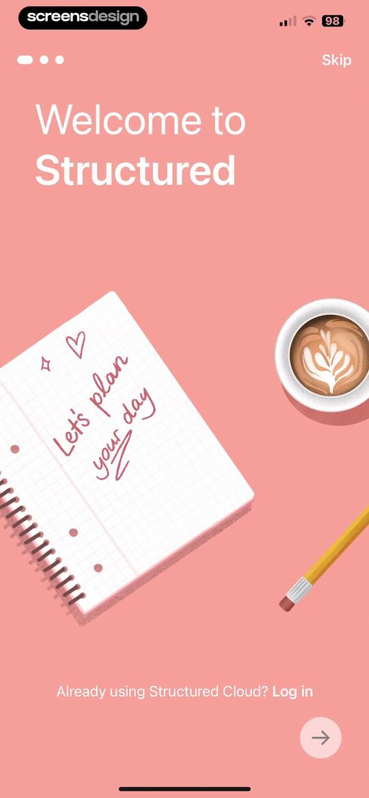

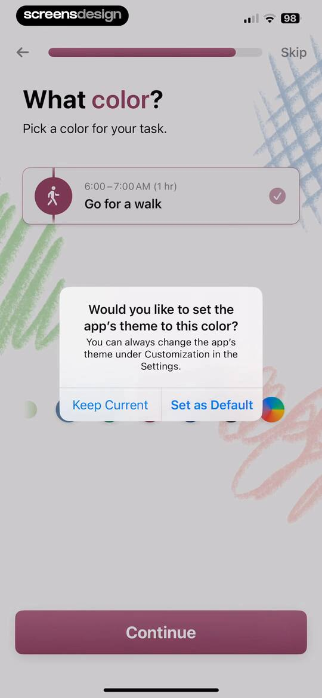
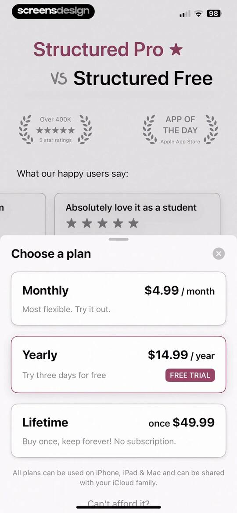
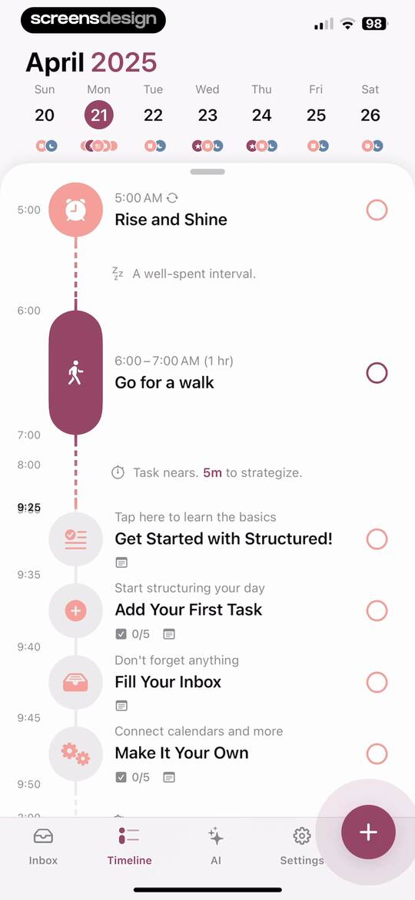
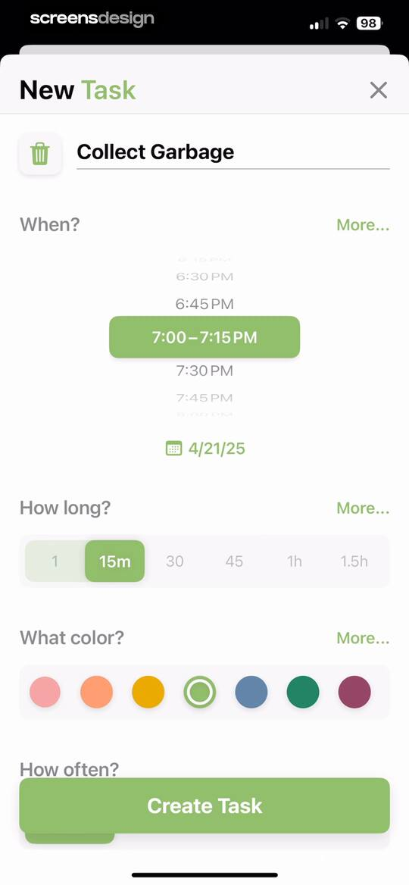
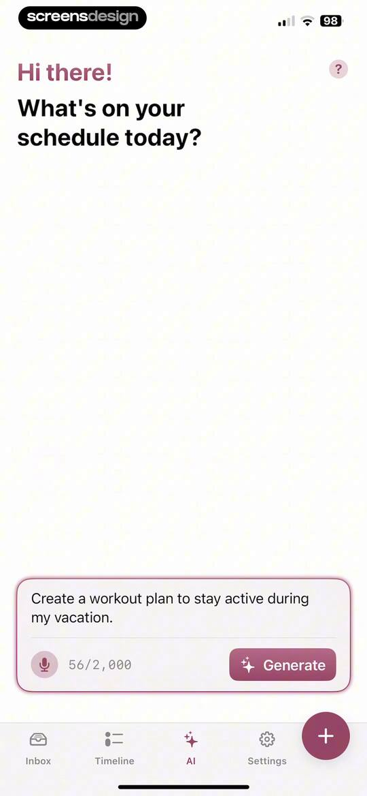
