# The Pattern Onboarding, Paywall & UX Flow — 119 Screens, $350k/mo

Source: https://screensdesign.com/apps/the-pattern/ (fetched 2026-10-05)

Stats: 

| # | Time | Image | What the screen shows |
|---|---|---|---|
| 1 | 00:00 |  | Splash screen for The Pattern app with a centered ink swirl logo and text on a plain white background. |
| 2 | 00:03 | 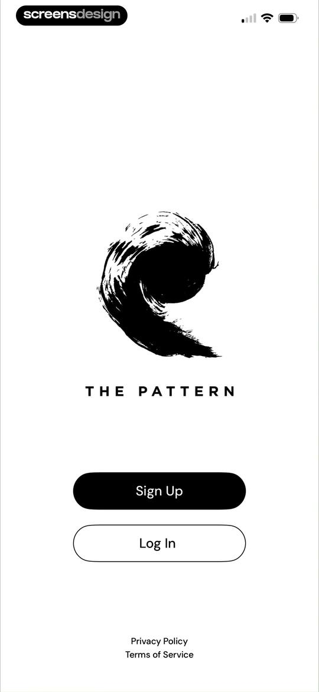 | Welcome screen for The Pattern app with a logo, Sign Up and Log In buttons, and legal links at the bottom. |
| 3 | 00:06 | 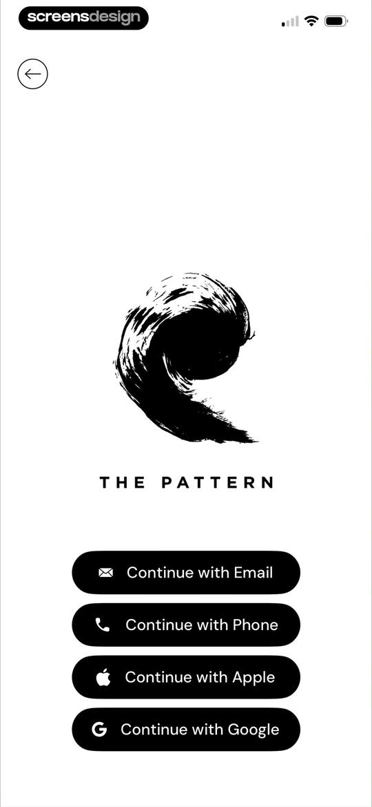 | Authentication screen for The Pattern app with a centered logo and a vertical stack of four sign-in buttons. |
| 4 | 00:17 | 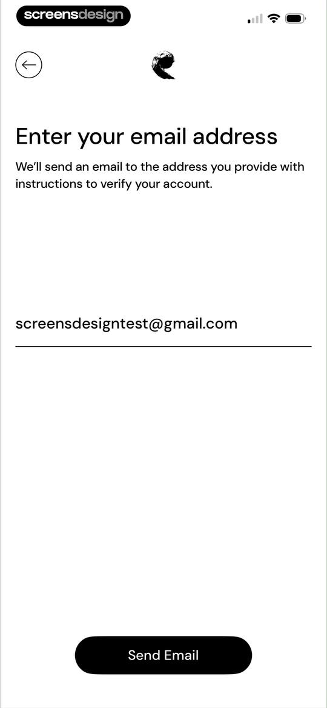 | Email entry form for account verification with a pre-filled address and a Send Email button. |
| 5 | 00:20 | 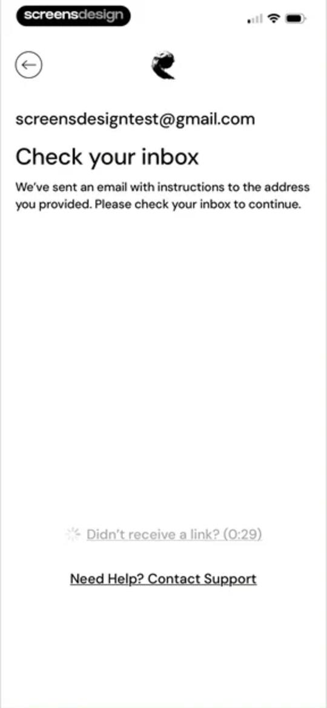 | Email verification screen in The Pattern app instructing the user to check their inbox, displaying the user's email address and a resend countdown timer. |
| 6 | 00:44 | 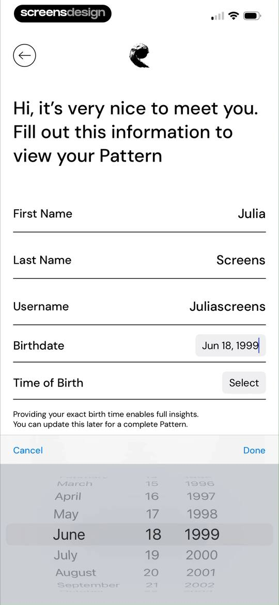 | Onboarding form with profile fields and an active date picker overlay set to June 18, 1999. |
| 7 | 00:49 | 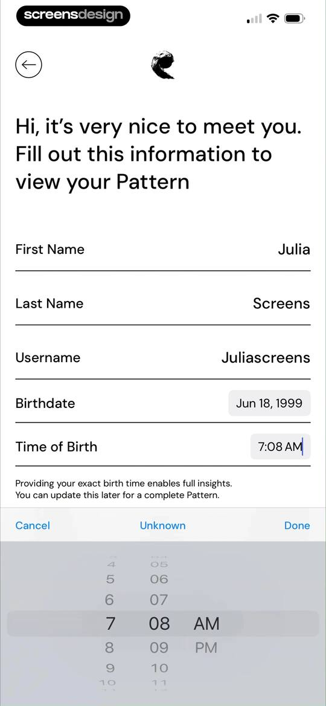 | User profile onboarding form for birth details with a bottom-anchored time picker set to 7:08 AM and a Done button. |
| 8 | 00:52 | 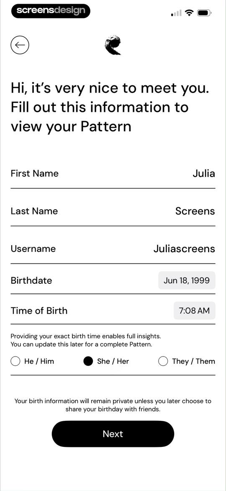 | Onboarding profile form filled with name, birthdate, and gender selection, with a Next button at the bottom. |
| 9 | 01:04 | locked | Onboarding birth location selection screen with a map view, a search bar filled with New York, NY, and a Review Details button. |
| 10 | 01:08 | locked | Onboarding review screen for The Pattern displaying user birth details, two checked consent options, and a View My Pattern button. |
| 11 | 01:14 | locked | Permission prompt screen displaying a system notification request overlaid on personal insight cards and a bottom navigation bar. |
| 12 | 01:17 | locked | Feature announcement modal displaying a horizontal carousel of personal insight cards and a button to explore personalized collections. |
| 13 | 01:20 | locked | Astrology app dashboard showing profile details, a featured Chiron in Scorpio reading card, transit cycles, and relationship insights. |
| 14 | 01:22 | locked | Astrology educational content screen featuring an insight about natal chart angles, with a Go Deeper button and bottom navigation. |
| 15 | 01:24 | locked | Content feed screen displaying an educational summary about astrological natal chart angles, featuring a Go Deeper button and bottom navigation tabs. |
| 16 | 01:28 | locked | Paywall subscription screen comparing yearly and monthly plans, with the yearly plan selected and an Access Go Deeper+ button. |
| 17 | 01:38 | locked | Astrology insight screen with an open iOS share sheet modal displaying options like AirDrop, Messages, and Copy. |
| 18 | 01:45 | locked | Home screen featuring a daily astrological moon message with a Go Deeper button and a dark forest green background. |
| 19 | 01:47 | locked | Astrological insight screen featuring a summary titled Embrace What Makes You Different, with a Go Deeper button and bottom navigation. |
| 20 | 01:52 | locked | Home screen displaying the Daily Vibe insight for May 8 with a sunset photo, reflective text, and the Lens tab selected. |
| 21 | 01:54 | locked | Astrological insight screen displaying details about Pluto Retrograde in Aquarius with a Go Deeper button and a selected Lens tab. |
| 22 | 01:57 | locked | Daily meditation content screen featuring the Earth Pulse Meditation title, a Go Deeper button, and the Lens tab selected in the bottom navigation. |
| 23 | 01:59 | locked | Onboarding screen in The Pattern app explaining friend features with an Add Friends button and bottom navigation. |
| 24 | 02:01 | locked | Empty friends screen displaying zero connections, a search bar, and a button to create a custom friend or partner. |
| 25 | 02:38 | locked | Onboarding screen prompting the user to choose their birth location, featuring a search input with New York entered, an interactive map, and a Next button. |
| 26 | 02:40 | locked | Profile creation form for a custom friend or partner with filled input fields and a Save button. |
| 27 | 02:44 | locked | Profile screen for John displaying astrological transits, relationship insights, and personality patterns with action buttons and horizontal cards. |
| 28 | 02:48 | locked | Profile screen for a custom friend named John displaying astrological transit cards and a bottom sheet with relationship status options. |
| 29 | 02:52 | locked | Astrology profile screen displaying John's transits, relationship insights, and life pattern cards with horizontal carousels and a View Bond button. |
| 30 | 02:56 | locked | Relationship compatibility dashboard for Julia and John featuring a romantic connection overview, snapshots carousel, and relationship dynamics card. |
| 31 | 03:00 | locked | Relationship clarity feature modal for You and John with a Start Exploring button over a chat background. |
| 32 | 03:03 | locked | Chat interface for relationship clarity featuring suggested prompt cards about you and John and a bottom text input area. |
| 33 | 03:16 | locked | Chat screen displaying a relationship clarity conversation about a past connection, featuring a user question, a long-form response, and a bottom input bar. |
| 34 | 03:36 | locked | Chat screen from The Pattern about relationship clarity between You and John, featuring a conversation history and a bottom input field. |
| 35 | 03:39 | locked | Chat interface about relationship clarity with a bottom modal showing options to view John's profile or delete the chat. |
| 36 | 03:42 | locked | Astrology profile dashboard displaying John's transits, relationship insights, and personality pattern with horizontal scrolling cards and a View Bond button. |
| 37 | 03:49 | locked | Astrological insight content screen titled Taking Stock with a date range, summary text, and a Go Deeper button. |
| 38 | 03:52 | locked | Shared Experiences community guidelines modal with a connection icon, respectful behavior notice, and a Got it button. |
| 39 | 03:54 | locked | Comment feed screen displaying user discussions on shared astrological experiences with a transit info card and a fixed bottom input field. |
| 40 | 03:59 | locked | Comment section displaying a list of user comments with avatars, timestamps, and a fixed bottom input field. |
| 41 | 04:06 | locked | Comment thread listing user comments with avatars and text, featuring a moderation menu overlay and a fixed reply input bar at the bottom. |
| 42 | 04:08 | locked | Comment section with a vertical list of user comments and a report comment modal overlay at the bottom showing spam and inappropriate options. |
| 43 | 04:18 | locked | Comment section with a centered block confirmation modal asking to block @JacM1, featuring Block and Cancel buttons. |
| 44 | 04:27 | locked | User profile screen for Sri showing avatar, handle, friend count, and View Bond and Add Friend buttons. |
| 45 | 04:43 | locked | Comment creation modal with context about an astrology post, a text input field containing drafted text, reply settings, and a send button above the keyboard. |
| 46 | 04:46 | locked | Create comment form with entered text and the reply settings menu set to allow replies. |
| 47 | 04:52 | locked | Shared experiences comment feed with an astrology insight card at the top, filter tabs, user comments, and a fixed bottom input field. |
| 48 | 04:54 | locked | Astrology app comment feed with a centered delete confirmation modal asking to delete an unundoable action, featuring Delete and Cancel buttons. |
| 49 | 05:01 | locked | Shared experiences comment screen with an astrological insight summary, the Friends tab selected, an empty comment state, and a bottom input field. |
| 50 | 05:03 | locked | Shared Experiences modal displaying a community guidelines notice and a Got it button over an astrology insight page. |
| 51 | 05:14 | locked | Relationship astrology dashboard displaying a vertical list of timing cycle cards like Window of Fate and Fated Romantic Encounters. |
| 52 | 05:17 | locked | Astrology insight screen displaying John's Love and Relationship Style for Venus in the Fifth House, with a Go Deeper button. |
| 53 | 05:25 | locked | Custom friend profile screen displaying John's astrological transit cards and a bottom sheet with edit and delete options. |
| 54 | 05:29 | locked | Astrology dashboard displaying a birth chart graphic, birth details, and lists of zodiac signs and planetary positions. |
| 55 | 05:32 | locked | Astrology dashboard displaying a vertical list of zodiac sign placements for John's Chart, with the Signs tab selected. |
| 56 | 05:35 | locked | Astrological personality summary for Moon in Capricorn, featuring descriptive traits and a Go Deeper button. |
| 57 | 05:39 | locked | Astrological aspects list for John's chart, with the Aspects tab selected and a vertical list of planetary aspects. |
| 58 | 05:41 | locked | Astrological insight screen displaying a summary about John's Natal Uranus Complex, with an audio player button and floating action buttons. |
| 59 | 05:44 | locked | Audio player interface with playback controls and a chapter list showing locked and active chapters for an astrology insight track. |
| 60 | 06:08 | locked | Relationship compatibility dashboard for Julia and John featuring a snapshot carousel, a powerful bond indicator, and relationship dynamics cards. |
| 61 | 06:10 | locked | Select Person modal with a search bar, a button to create a custom friend, and an empty friends list. |
| 62 | 06:14 | locked | Person selection modal listing public figures with a search bar, tab navigation, and an option to create a custom profile. |
| 63 | 06:19 | locked | Relationship bond creation screen with profile selectors for Taylor and John, a Romantic Connection option, a View Bond button, and a bottom sheet. |
| 64 | 06:25 | locked | Dashboard displaying friendship compatibility and dynamic astrological cards for two profiles, with the Bond tab selected. |
| 65 | 06:27 | locked | Compatibility analysis modal featuring profiles for Taylor and John, displaying relationship insights and a close button. |
| 66 | 06:35 | locked | Relationship astrology summary screen in The Pattern app detailing a Venus and Ascendant aspect between John and Taylor, with a Go Deeper+ button. |
| 67 | 06:40 | locked | Compatibility dashboard comparing astrological signs between two users with an EPIC bond level and a share button. |
| 68 | 06:42 | locked | Astrological summary screen displaying Moon in Cancer personality traits for Taylor, with a Go Deeper button and a bottom navigation bar. |
| 69 | 06:47 | locked | Astrology dashboard showing a compatibility chart for Taylor and John with profile selectors and an EPIC connection status. |
| 70 | 06:53 | locked | Bonds screen with a modal overlay prompting the user to create a custom friend profile, featuring a Create Custom Friend button and a Try Later link. |
| 71 | 06:57 | locked | Form in The Pattern app to create a custom friend or partner profile with input fields for birth details, gender options, and a Save button. |
| 72 | 07:03 | locked | Recent Bonds dashboard displaying remaining bond credits, a Get More Bonds button, and a list of friendship and romantic connection cards. |
| 73 | 07:14 | locked | Home screen featuring a Time Travel feature promotion with a centered action button and the Lens tab selected in the bottom navigation bar. |
| 74 | 07:16 | locked | Dashboard displaying a neutral transit card for May 08, 2026, with a date picker and a bottom navigation bar. |
| 75 | 07:23 | locked | Transit details screen with an active date picker modal overlay showing October 8, 2018, and a Done button. |
| 76 | 07:30 | locked | Astrology dashboard displaying a vertical list of personality trait cards with a floating share button and bottom navigation. |
| 77 | 07:39 | locked | Astrology discovery feed with trending articles, featured transit cards, and a selected Discover tab in the bottom navigation bar. |
| 78 | 07:45 | locked | Astrological insight screen displaying the title Embrace What Makes You Different with a summary text, Go Deeper+ button, and Discover tab selected. |
| 79 | 07:52 | locked | Content feed displaying a scrollable list of video cards for astrological events like retrogrades and sign changes, with the Discover tab selected. |
| 80 | 07:54 | locked | Astrological insight content screen titled Step Into Your Power with an audio player button and a summary text card about Pluto retrograde. |
| 81 | 07:57 | locked | Audio player interface with playback controls and a chapter list showing locked subsequent chapters. |
| 82 | 08:08 | locked | Moon phase calendar feed with a grid of lunar event cards, a past moon phases carousel, and a bottom navigation bar with Discover selected. |
| 83 | 08:24 | locked | Educational modal overlay in The Pattern app introducing the In-Depth relationship feature, with a Next button and bottom navigation bar. |
| 84 | 08:26 | locked | Paywall modal with privacy assurances and a Try for free button, displayed over a relationship insights screen. |
| 85 | 08:28 | locked | Relationship dashboard featuring top relationship selectors, a personal insights button, and a list of active conversations with a bottom navigation bar. |
| 86 | 08:30 | locked | Select Person modal in The Pattern app featuring an option to create a custom friend and a list of existing contacts. |
| 87 | 08:33 | locked | Relationship selection modal displaying a list of options including Romantic Connection, Friend, and Parent to categorize bonds with a person named John. |
| 88 | 08:38 | locked | Chat interface for a relationship insight conversation with prompt cards and a message input bar. |
| 89 | 08:52 | locked | Compatibility analysis chat screen detailing personality dynamics with a friend, including a prompt about clicking and clashing, detailed text body, and a bottom input field. |
| 90 | 08:56 | locked | Personality compatibility analysis between you and John, featuring a bottom action modal with options to view his profile or delete the chat. |
| 91 | 08:59 | locked | Chat screen with a confirmation modal asking if you are sure you want to delete this chat, featuring delete and keep options. |
| 92 | 09:16 | locked | Bonds screen featuring profile selections for Taylor and John, a Friendship bond type, and a View Bond button. |
| 93 | 09:18 | locked | Astrology profile screen displaying user handle @Juliascreens, action buttons for friends, a Chiron in Scorpio featured card, and current transits with the You tab selected. |
| 94 | 09:21 | locked | Friends list dashboard in The Pattern app with a search bar, a button to create a custom friend, and a single friend entry for John Screens. |
| 95 | 09:25 | locked | Public figures list in The Pattern app with a search bar, custom friend creation button, and the Public Figures tab selected. |
| 96 | 09:28 | locked | Requests screen displaying a custom friend creation button, incoming and outgoing request sections, and the selected Requests tab. |
| 97 | 09:35 | locked | Bond creation screen with profile selectors for Taylor and John, a Friendship bond type, and a View Bond button. |
| 98 | 09:38 | locked | Form in The Pattern app to create a custom friend or partner profile, featuring input fields for birth details, gender options, and a Save button. |
| 99 | 09:43 | locked | Astrology insight screen detailing Chiron in Scorpio with a summary, a Go Deeper button, and floating action buttons. |
| 100 | 09:45 | locked | Astrology dashboard displaying profile information, action buttons, personal transit details, and relationship insight cards with the You tab selected. |
| 101 | 09:48 | locked | Dashboard screen showing personal astrological insights, transit cycles, and relationship cards with action buttons and a bottom navigation bar. |
| 102 | 09:50 | locked | Dashboard displaying astrological transit information for May 8, 2026, with the Your Transits tab and You navigation option selected. |
| 103 | 09:57 | locked | Dashboard with a user profile header, natal chart insights, relationship cards, and a bottom navigation bar with You selected. |
| 104 | 10:00 | locked | Astrology dashboard displaying a personal birth chart wheel and a list of zodiac signs with a top segmented control and bottom navigation bar. |
| 105 | 10:04 | locked | Astrology dashboard displaying a vertical list of birth chart sign placements with the Signs tab and You navigation option selected. |
| 106 | 10:06 | locked | Astrology chart dashboard displaying a list of astrological aspects with the Aspects tab selected. |
| 107 | 10:08 | locked | Astrological insight summary screen titled Exceptional Visionary with a Read Insight button and a bottom navigation bar. |
| 108 | 10:12 | locked | Activity empty state screen in The Pattern app with a minimalist design, a back button, and a bottom navigation bar. |
| 109 | 10:14 | locked | Astrology app profile dashboard featuring natal chart insight cards, a relationship summary card for You and John, and a selected You tab in the bottom navigation. |
| 110 | 10:17 | locked | Bookmarks screen showing a grid of saved astrological insight cards and a recently bookmarked sort option. |
| 111 | 10:24 | locked | Filter modal displaying category and format options for bookmarks, with the Me category selected and Clear all and Apply buttons at the bottom. |
| 112 | 10:34 | locked | Settings screen featuring a vertical list of account and subscription options, a logout button, and a bottom navigation bar with the You tab selected. |
| 113 | 10:36 | locked | Edit profile form with filled input fields for personal details, pronoun selection options, and a Save button. |
| 114 | 10:41 | locked | Blocked users settings screen displaying a list with one blocked user and an Unblock button. |
| 115 | 10:47 | locked | Subscription paywall comparing yearly and monthly plans with features listed, the yearly plan selected, and an Access Go Deeper+ button. |
| 116 | 10:50 | locked | About Us screen for The Pattern app with a mission statement and a bottom navigation bar. |
| 117 | 10:54 | locked | Settings screen with grouped list items for account management, subscription options, and help center. |
| 118 | 10:57 | locked | Settings screen with an account deletion confirmation modal warning that all data will be permanently erased, including Delete Account and Cancel buttons. |
| 119 | 11:00 | locked | Settings screen with a list of account options and a centered confirmation modal for logging out, featuring Cancel and Log Out buttons. |

## Free showcase screenshots (unordered)

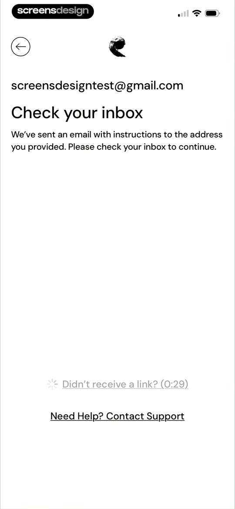
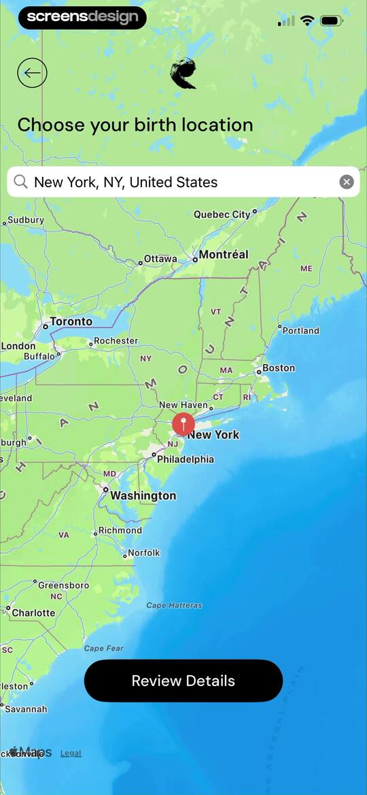
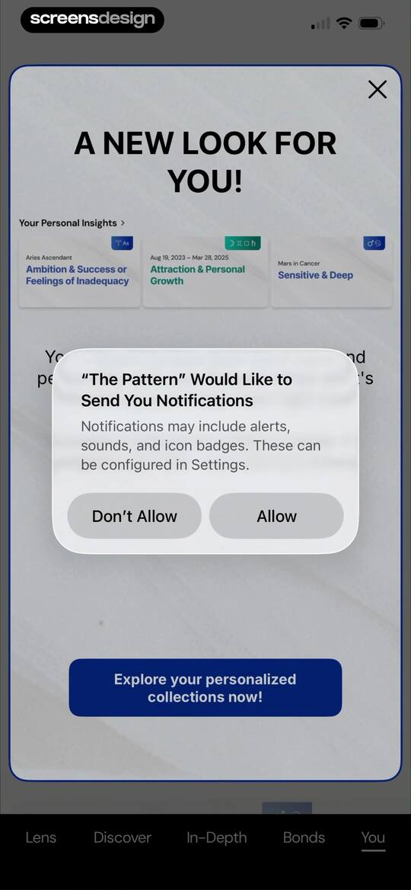
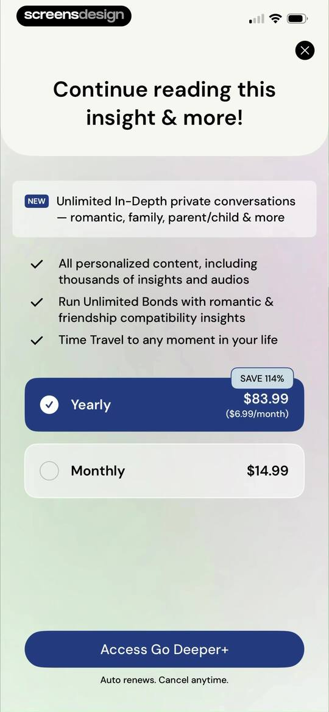
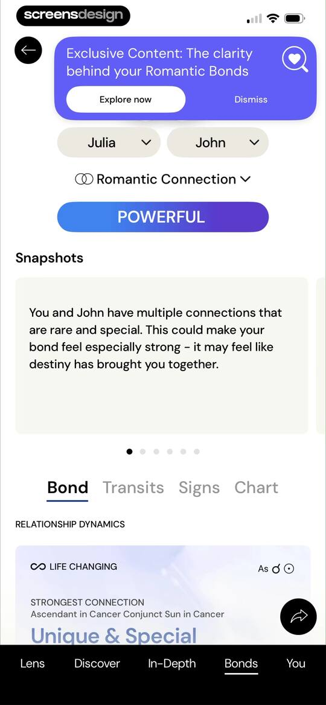
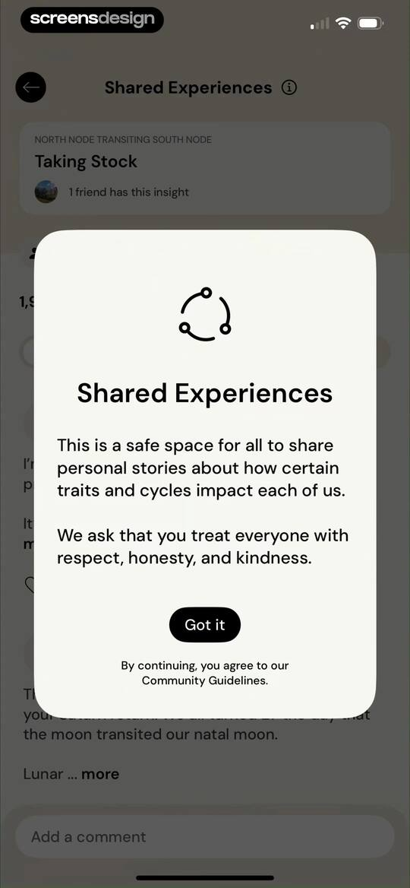
