# Tiimo: To-Do List Planner Onboarding, Paywall & UX Flow — 152 Screens, $250k/mo

Source: https://screensdesign.com/apps/tiimo-ai-plan-focus-to-do/ (fetched 2026-10-05)

Stats: 

| # | Time | Image | What the screen shows |
|---|---|---|---|
| 1 | 00:02 | 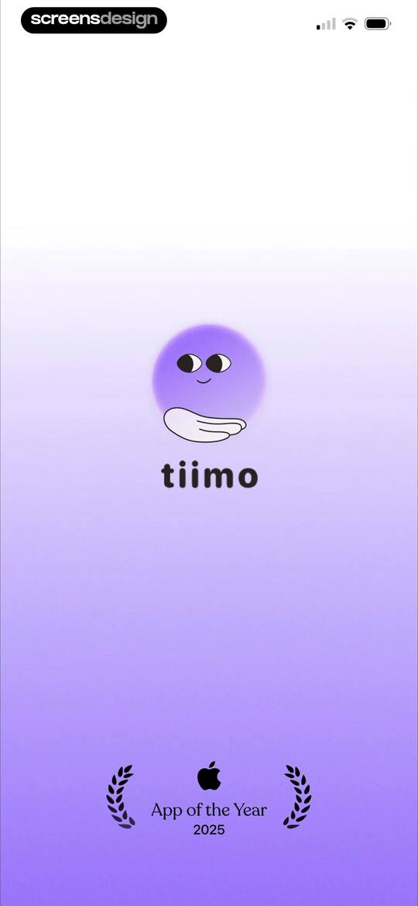 | Tiimo app splash screen featuring the brand logo, character illustration, and an App of the Year 2025 award badge. |
| 2 | 00:07 | 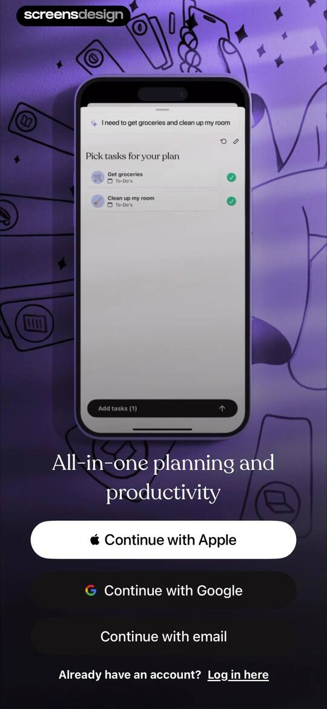 | Onboarding signup screen with a central task planner mockup, a value proposition headline, and three social sign-up buttons. |
| 3 | 00:10 | 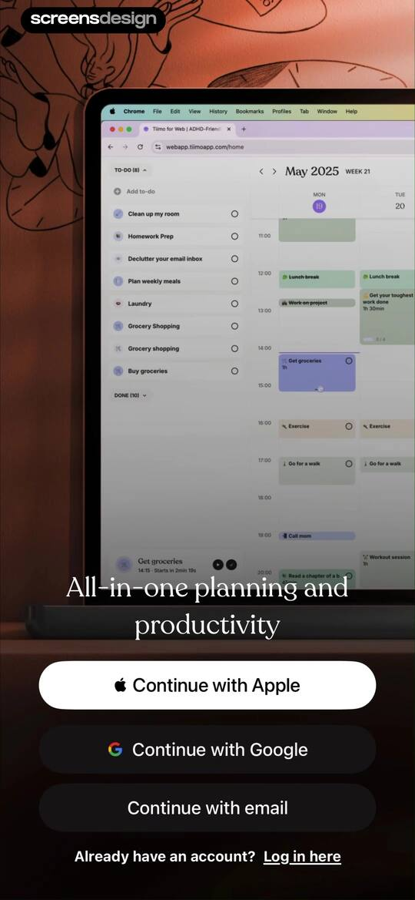 | Onboarding signup screen for Tiimo featuring a web planner mockup, value proposition text, and three sign-up buttons. |
| 4 | 00:27 | 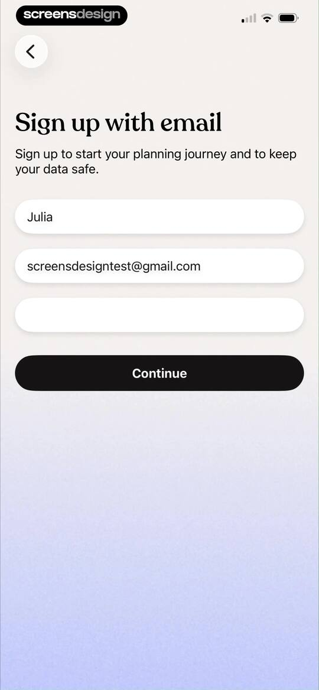 | Sign-up form with input fields for name, email, and password, pre-filled with user details and a Continue button. |
| 5 | 00:34 |  | Tiimo notification permission screen with two selection cards, the opt-in option selected, and a Continue button. |
| 6 | 00:42 | 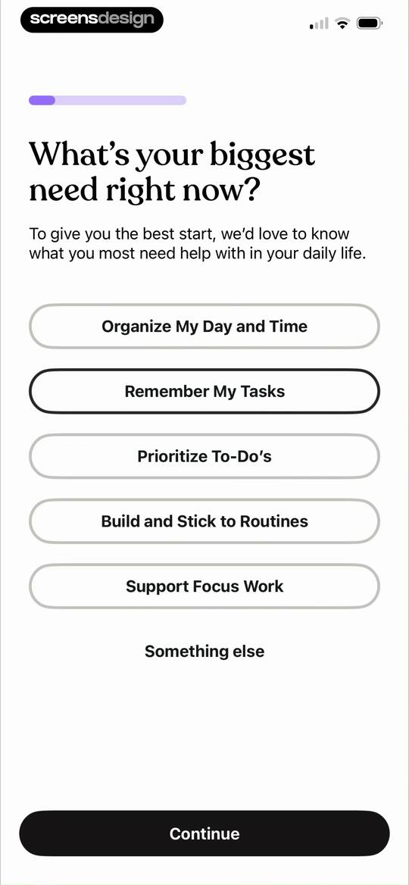 | Onboarding survey screen asking for the user's biggest need, with a list of productivity options and a Continue button. |
| 7 | 00:47 | 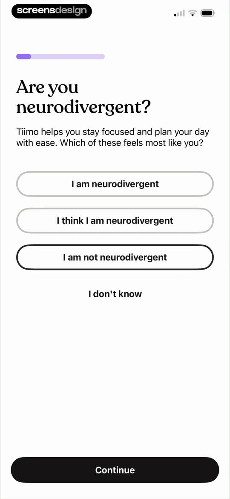 | Tiimo onboarding screen asking if the user is neurodivergent, featuring a list of selection options and a Continue button. |
| 8 | 00:51 | 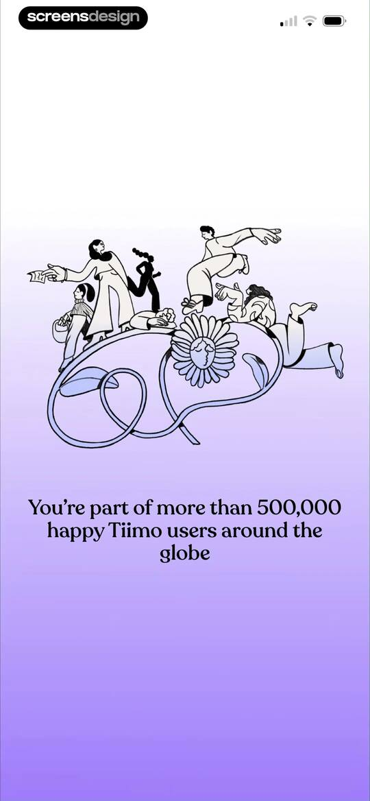 | Tiimo onboarding screen with an illustration of whimsical figures and text stating you are part of over 500,000 users. |
| 9 | 00:55 | locked | Subscription paywall comparing monthly and annual plans, featuring award badges, user reviews, and a start free trial button. |
| 10 | 00:59 | locked | Tiimo subscription paywall comparing free and pro features, with a 7-day free trial button and annual pricing details. |
| 11 | 01:01 | locked | Tiimo subscription paywall offering a seven-day free trial, annual pricing details, feature list, and a primary start trial button. |
| 12 | 01:05 | locked | Subscription checkout modal for the Tiimo Pro family plan showing pricing details, a one-week free trial, and a confirm with side button action. |
| 13 | 01:11 | locked | Tiimo subscription purchase confirmation modal with a success message and an OK button over a feature list background. |
| 14 | 01:15 | locked | Tiimo app onboarding screen prompting users to enable notifications, featuring a mockup lock screen preview and an Enable Notifications button. |
| 15 | 01:17 | locked | Notification permission onboarding screen for the Tiimo app, featuring an overlaid system prompt and an Enable Notifications button. |
| 16 | 01:21 | locked | Tiimo onboarding screen encouraging calendar import, featuring a daily schedule mockup and an Import calendar button. |
| 17 | 01:25 | locked | Permission request screen for the Tiimo app asking for full calendar access, with Allow Full Access and Don't Allow buttons. |
| 18 | 01:34 | locked | Onboarding screen for selecting calendars to import, featuring categorized options with icons and a Next button at the bottom. |
| 19 | 01:37 | locked | Tiimo onboarding screen featuring a minimalist illustration of a meditating person above the question, Are you ready to unlock your planning potential? |
| 20 | 01:45 | locked | Onboarding screen for adding morning routines, featuring a grid of habit selection chips and a continue button. |
| 21 | 01:55 | locked | Onboarding screen displaying a grid of selectable daytime routine chips with an afternoon label and a bottom continue button. |
| 22 | 02:07 | locked | Onboarding screen displaying a grid of selectable evening habit chips with icons and a continue button at the bottom. |
| 23 | 02:13 | locked | Tiimo onboarding screen with a rating prompt, user testimonial card, and Continue button. |
| 24 | 02:18 | locked | Rating prompt modal asking Enjoying Tiimo? with five interactive stars and a Continue button. |
| 25 | 02:20 | locked | Feedback prompt modal with a character illustration, rating stars, and a Continue button. |
| 26 | 02:28 | locked | Tiimo onboarding screen with an interactive task list, showing a completed morning shower and a prompt to tap brush teeth. |
| 27 | 02:30 | locked | Tiimo onboarding screen featuring a morning task list tutorial, confetti animation, and a Continue button. |
| 28 | 02:36 | locked | Tiimo onboarding screen with a progress bar, headline about starting a first streak, and a Start my streak button. |
| 29 | 02:40 | locked | Onboarding milestone screen celebrating momentum with an Ignition graphic, a top progress bar, and a Keep going button. |
| 30 | 02:51 | locked | Permissions onboarding screen for the Tiimo app explaining iOS tracking requirements, featuring a central illustration and Continue and No thanks buttons. |
| 31 | 02:53 | locked | System permission modal requesting activity tracking across other apps, overlaid on a task management dashboard with Allow and Ask App Not to Track buttons. |
| 32 | 02:59 | locked | Task management dashboard with a trophy notification for a planning streak, a horizontal date strip, and categorized daily tasks. |
| 33 | 03:00 | locked | Tiimo daily planner dashboard with feature promotion cards and a categorized task list including Morning and Afternoon sections. |
| 34 | 03:03 | locked | Task planning dashboard with collapsible time-of-day categories for Anytime, Morning, Afternoon, and Evening, plus a top date picker and bottom navigation bar. |
| 35 | 03:11 | locked | Daily task planner home screen with a centered calendar modal overlay and a time-blocked list of tasks including Morning routine and Deep work. |
| 36 | 03:12 | locked | Task planner home screen with an active date picker modal overlay over categorized task sections and a bottom navigation bar. |
| 37 | 03:15 | locked | Daily task planner home screen with a date header, an instructional card, and categorized task groups including morning and afternoon sections. |
| 38 | 03:22 | locked | Tiimo onboarding screen with instructions to add a home screen widget, featuring a central product mockup and a Done button. |
| 39 | 03:57 | locked | Modal promoting the Tiimo desktop app with a laptop mockup displaying the web interface and a Done button. |
| 40 | 04:22 | locked | Task dashboard with a date header, horizontal calendar strip, and a vertical list of task cards with time durations and icons. |
| 41 | 04:25 | locked | Daily task planner dashboard displaying collapsible time-of-day sections with task cards and duration estimates for Wednesday, May 2026. |
| 42 | 04:27 | locked | Home screen showing a daily task planner with time-of-day sections, a date header, a calendar strip, and a bottom navigation bar. |
| 43 | 04:35 | locked | Task creation editor in Tiimo with a modal overlay for adding a new task over the daily schedule and an active keyboard. |
| 44 | 04:38 | locked | Task creation form with a centered options modal displaying time and event categories, overlaid on a weekly calendar view. |
| 45 | 04:43 | locked | Task editor screen displaying a repeat frequency modal overlay with options for daily, weekly, and monthly recurrence over a daily schedule. |
| 46 | 04:47 | locked | Task creation form with configuration options for time, date, duration, and sub-tasks, featuring an AI suggest breakdown button and a save icon. |
| 47 | 04:52 | locked | Task creation form with configuration fields for time and date, featuring an active date picker overlay and a save button. |
| 48 | 04:54 | locked | Task creation form with fields for time, date, notes, and category selection, featuring a calendar overlay and save button. |
| 49 | 04:58 | locked | Task creation form with fields for duration, repeat settings, sub-tasks, and a self care category tag, featuring close and confirm buttons. |
| 50 | 05:02 | locked | Task creation form with fields for title, date, duration, and repeat options, featuring a save button and a category selector. |
| 51 | 05:06 | locked | Permission request modal overlaying a task creation form in the Tiimo app, with Allow and Don't Allow buttons. |
| 52 | 05:11 | locked | Task creation form with settings for time, date, alarm, and sub-tasks, displaying an active time picker and a save button. |
| 53 | 05:19 | locked | Task creation form in the Tiimo app displaying configuration fields like evening time, weekly repeat, and a sub-tasks list. |
| 54 | 05:42 | locked | Task tagging modal overlay displaying a grid of tag chips, an AI suggestion button, and a Done button. |
| 55 | 05:51 | locked | Daily task planner home screen showing a date header, a calendar strip, and collapsible time-of-day sections with an expanded evening section. |
| 56 | 05:57 | locked | Daily planner dashboard with a review card and collapsible time-based task sections for morning and afternoon. |
| 57 | 06:00 | locked | Task management screen listing remaining tasks with checkboxes, featuring a prompt to move 12 tasks to tomorrow and primary action buttons. |
| 58 | 06:12 | locked | Task rescheduling modal displaying a list of selected tasks, a May 2026 calendar with a selected date, and a confirmation button. |
| 59 | 06:20 | locked | Empty state screen in the Tiimo app displaying a crescent moon graphic and the heading Review done with a message that everything is handled. |
| 60 | 06:28 | locked | Daily task management home screen for Tiimo showing a calendar strip for May 13 and an expanded afternoon section with five tasks. |
| 61 | 06:36 | locked | Task management dashboard showing a daily schedule with an open action modal offering options to copy, reschedule, edit, or delete a task. |
| 62 | 06:39 | locked | Task dashboard with an expanded afternoon schedule and a bottom modal displaying Move to To-do options. |
| 63 | 06:44 | locked | Task management dashboard showing priority sections and a to-do list with a Drink water task card. |
| 64 | 06:50 | locked | Task rescheduling modal overlay on a daily planner dashboard, featuring options to update this only, update all future, and update all. |
| 65 | 06:58 | locked | Focus dashboard showing a circular timer set to 24:59 with an instructional tooltip and timer controls. |
| 66 | 07:02 | locked | Active workout timer dashboard showing a 24:55 countdown, a bicep icon, pause and extend controls, and a bottom navigation bar. |
| 67 | 07:07 | locked | Task editor screen displaying workout details, schedule settings, sub-task options, and a save button. |
| 68 | 07:19 | locked | Tiimo focus timer dashboard featuring an active workout session, a 25:41 timer display, and an open music selection menu with Lo-Fi selected. |
| 69 | 07:28 | locked | Focus timer dashboard showing a countdown of 04:55 with a pause button, plus 1 minute option, and bottom navigation. |
| 70 | 07:32 | locked | Focus dashboard showing an active 04:51 countdown timer with a central progress indicator, music controls, and a bottom navigation bar. |
| 71 | 07:41 | locked | Workout timer dashboard with a central progress circle displaying 25:18, an achievement notification at the top, and a bottom navigation bar. |
| 72 | 07:51 | locked | Dashboard with an active workout timer showing twenty-five minutes remaining, an extend button, and top navigation for focus and audio. |
| 73 | 07:54 | locked | Focus timer dashboard with a central circular dial set to 15 minutes, a Start button, and top navigation for audio and focus options. |
| 74 | 08:01 | locked | Task management dashboard showing a delete confirmation dialog for the task Lunch with options to delete all, future, or this only. |
| 75 | 08:15 | locked | Task dashboard with collapsible time-of-day sections displaying a daily schedule, duration indicators, and a persistent bottom navigation bar. |
| 76 | 08:20 | locked | Task planner home screen featuring a calendar strip, task categories, and an active task entry modal with a keyboard. |
| 77 | 08:23 | locked | AI assistant chat interface with a central character illustration, an Ask anything text field, and Speak and English buttons below. |
| 78 | 08:27 | locked | Permission modal for the Tiimo app requesting access to speech recognition, with Allow and Don't Allow buttons. |
| 79 | 08:29 | locked | Permission modal for the Tiimo app requesting microphone access, with Allow and Don't Allow buttons over a blurred chat interface. |
| 80 | 08:47 | locked | Chat screen with a central productivity illustration, a prompt to input thoughts, and a draft message in the bottom text field. |
| 81 | 09:02 | locked | Chat interface showing a task preview card for organizing a desk, with a Create tasks button and a voice input option. |
| 82 | 09:09 | locked | Chat screen displaying an AI task creation assistant with a task summary card and a Create tasks button. |
| 83 | 09:15 | locked | Task management dashboard for the Tiimo app displaying daily tasks organized by time-of-day categories with an open floating menu. |
| 84 | 09:19 | locked | Task management review screen listing remaining tasks with checkboxes, a prompt to move them to tomorrow, and bottom action buttons. |
| 85 | 09:24 | locked | Empty state screen for the Tiimo app displaying a crescent moon icon and the text Review done, Everything is handled for today. |
| 86 | 09:31 | locked | Task exploration screen with a search bar, recent tasks carousel, category selection grid, and a list of household tasks. |
| 87 | 09:34 | locked | Task list feed with a search bar, Private and Public view tabs, and a vertical list of task cards. |
| 88 | 09:36 | locked | Task creation form with schedule settings, sub-task options, and a save button. |
| 89 | 09:50 | locked | Explore screen with a search bar and a vertical list of task cards for discovering pre-made routines. |
| 90 | 10:06 | locked | Wellbeing onboarding modal in Tiimo featuring a mood illustration, Apple Health integration notice, and a How do you feel today button. |
| 91 | 10:10 | locked | Health access permission request screen for Tiimo with toggles for reading and writing State of Mind data, plus Allow and Don't Allow buttons. |
| 92 | 10:16 | locked | Mood tracking form in the Tiimo app asking how the user felt today, with a sad character illustration, mood slider, and Done button. |
| 93 | 10:18 | locked | Mood-tracking modal asking how the user felt overall today, featuring a central character illustration, a slider set to unpleasant, and a Done button. |
| 94 | 10:20 | locked | Tiimo daily mood tracking screen with a central mood character, a slider set to Slightly Unpleasant, and a Done button. |
| 95 | 10:21 | locked | Mood-tracking modal asking how the user felt overall today, with a neutral facial expression indicator, a slider ranging from very unpleasant to very pleasant, and a Done button. |
| 96 | 10:23 | locked | Mood-tracking form asking how the user felt today, featuring a central mood illustration, a slider set to Slightly Pleasant, and a Done button. |
| 97 | 10:25 | locked | Mood tracking modal featuring a central yellow star character, a mood slider set to pleasant, and a Done button. |
| 98 | 10:27 | locked | Daily mood check-in screen featuring an emotional intensity slider with the Very Pleasant option selected and a Done button. |
| 99 | 10:36 | locked | Task management home screen displaying a daily planner with task sections and an open modal menu offering reschedule, routine, mood, and grouping options. |
| 100 | 10:37 | locked | Daily planner dashboard displaying a calendar strip, task sections, and a focus task card for Wednesday, May 13. |
| 101 | 10:40 | locked | Daily planner home screen displaying a Wednesday date header, task sections for Anytime and Planned, and an active Focus task card. |
| 102 | 10:52 | locked | Dashboard screen showing a personalized greeting, progress cards, a mood tracker, and a premium features carousel above a bottom navigation bar. |
| 103 | 10:58 | locked | Task management dashboard with priority sections and a to-do list displaying Organize my desk and Drink water tasks. |
| 104 | 11:09 | locked | Task management editor screen for the Tiimo app showing a Groceries to-do list with priority sections and an active task entry modal. |
| 105 | 11:11 | locked | Task editor for the Groceries list with priority sections and an active bottom keyboard overlay. |
| 106 | 11:14 | locked | Task editor screen displaying a duration selection modal overlay with five minutes selected over a Groceries list and a bottom keyboard. |
| 107 | 11:18 | locked | Task creation form with input fields for title, duration, sub-tasks, notes, and a study tag, featuring close and save actions. |
| 108 | 11:25 | locked | Task list dashboard titled Groceries with collapsible TO-DO and DONE sections, an input field to add items, and a bottom navigation bar. |
| 109 | 11:28 | locked | Task editor modal with an input field containing Eggs, category and duration buttons, and an active keyboard. |
| 110 | 11:42 | locked | Task list dashboard titled Groceries with a collapsible to-do section containing a Milk task and a done section with a completed Eggs task. |
| 111 | 11:46 | locked | Task management home screen displaying a grocery list and a modal menu with options to create, edit, group, and sort lists. |
| 112 | 11:51 | locked | Form modal for naming a new list with Dairy entered in the title field, a description field, and Cancel and Save buttons. |
| 113 | 12:01 | locked | Task management dashboard with an open modal menu displaying grouping options, including No grouping, Priority, and Eisenhower matrix. |
| 114 | 12:05 | locked | Task management dashboard with an open modal menu displaying sorting options including manual order, alphabetical, and duration. |
| 115 | 12:10 | locked | Task management dashboard with an open modal menu displaying list management and view options over a categorized task list. |
| 116 | 12:15 | locked | Edit lists settings screen displaying reorderable categories including To-do, Groceries, and Dairy within a card container. |
| 117 | 12:17 | locked | Settings screen for editing task lists, displaying items with drag handles and a red Delete button. |
| 118 | 12:19 | locked | Settings screen with an Edit lists interface and a confirmation modal asking to delete a list with Cancel and Delete buttons. |
| 119 | 12:29 | locked | Daily planner dashboard showing a Wednesday schedule with collapsible task sections and a time-remaining indicator. |
| 120 | 12:30 | locked | Focus timer dashboard featuring a central circular timer set to fifteen minutes with a start button and top header options. |
| 121 | 12:32 | locked | Dashboard screen showing a day streak of one, completed tasks, mood reflections, and feature cards for planning tools. |
| 122 | 12:35 | locked | Dashboard displaying productivity metrics, day streak progress, a mood reflection section, and a feature carousel with a bottom navigation bar. |
| 123 | 12:42 | locked | Daily reflection screen asking if tasks contributed to a neutral mood on May 13th, with a list of completed task cards. |
| 124 | 12:45 | locked | Task creation form with fields for timing, sub-tasks, an AI breakdown button, and a save checkmark in the top corner. |
| 125 | 12:58 | locked | Mood-tracking form asking how you felt overall yesterday, featuring a mood character, slider, and a Done button. |
| 126 | 13:01 | locked | Confirmation screen in the Tiimo app showing a summary card for an unpleasant wellbeing log and a Done button. |
| 127 | 13:04 | locked | Daily reflection screen displaying an unpleasant mood icon for May 12th with an edit button and close icon. |
| 128 | 13:09 | locked | Tiimo app dashboard with a profile header, feature carousel, knowledge card, and a utility link list for settings and support. |
| 129 | 13:13 | locked | Tiimo app onboarding modal introducing the Plan with AI feature with a centered product mockup and a Done button. |
| 130 | 13:33 | locked | Content feed in Tiimo displaying educational articles on productivity and planning, with a featured card about prioritizing tasks for ADHD. |
| 131 | 13:48 | locked | Tiimo app settings screen displaying a knowledge card, support and feedback links, subscription details, and technical info. |
| 132 | 13:52 | locked | Chat interface with an AI task planning assistant displaying a conversation about organizing a desk and a task creation card. |
| 133 | 13:55 | locked | Chat history side drawer displaying a list of previous conversations and a new chat button over a minimalist planning interface. |
| 134 | 13:57 | locked | Chat screen with a central purple character illustration, a prompt to brain dump tasks, and a Speak button for voice input. |
| 135 | 14:09 | locked | Dashboard with progress cards, a mood tracker, and an onboarding modal asking what we should call you. |
| 136 | 14:13 | locked | Share sheet modal displaying app sharing options, action icons, and a list of system actions for the Tiimo app link. |
| 137 | 14:15 | locked | Permission request modal in the Tiimo app asking for photo access, with Allow and Don't Allow buttons over the dashboard. |
| 138 | 14:18 | locked | Settings screen with grouped list sections for app preferences, profile management, and account options, including a back button and bottom navigation bar. |
| 139 | 14:21 | locked | Settings screen for notification preferences with toggle switches and time options for tasks and daily reminders. |
| 140 | 14:30 | locked | Calendar selection settings screen with categorized lists and a confirm button to choose calendars. |
| 141 | 14:33 | locked | Onboarding screen prompting the user to import Apple Reminders, featuring a daily schedule mockup and an Import reminders button. |
| 142 | 14:38 | locked | Theme settings screen with a central color preview circle and a grid of color selection swatches. |
| 143 | 14:47 | locked | Settings screen featuring a theme selection modal with light, dark, and system options over a grouped list of preferences. |
| 144 | 14:51 | locked | Settings screen with a dark theme listing preferences for notifications, theme, profiles, and account options, along with a bottom navigation bar. |
| 145 | 15:04 | locked | Tiimo font settings screen displaying Default and OpenDyslexic cards with the Default option selected and a restart notice. |
| 146 | 15:08 | locked | Sound settings screen listing toggle switches for in-app audio preferences and focus mode music. |
| 147 | 15:11 | locked | App icon settings screen displaying a grid of selectable icon variations with a highlighted current selection. |
| 148 | 15:12 | locked | Tiimo app settings screen with a confirmation modal stating You have changed the icon for Tiimo and an OK button. |
| 149 | 15:20 | locked | Settings screen with a vertical list of configuration options, profile management, and account actions grouped under headers. |
| 150 | 15:24 | locked | Tiimo email settings screen featuring toggle switches for newsletters, app updates, and offers with a bottom navigation bar. |
| 151 | 15:28 | locked | Settings screen with a modal dialog asking to confirm account deletion and warning that the account will be permanently deleted after three days. |
| 152 | 15:32 | locked | Settings screen with grouped options and a bottom modal overlay displaying a pre-filled email address field for changing account details. |

## Free showcase screenshots (unordered)

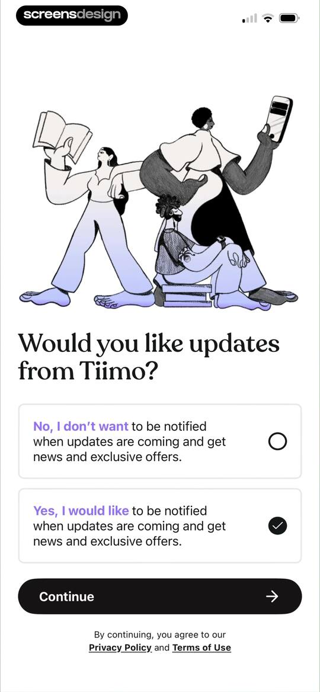

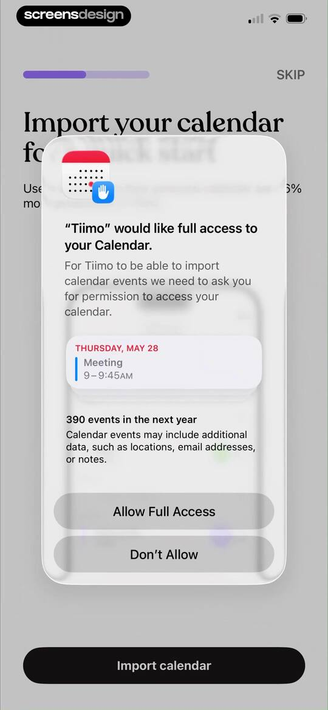
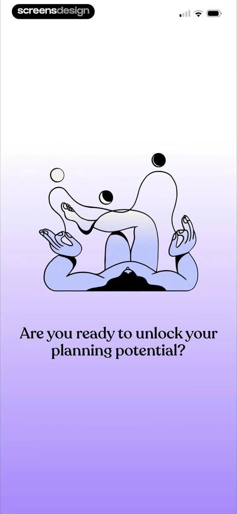
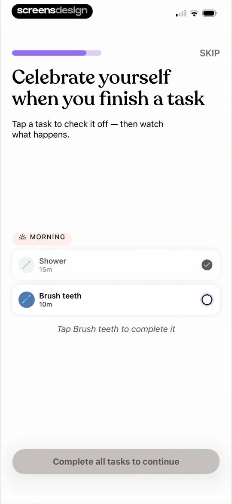
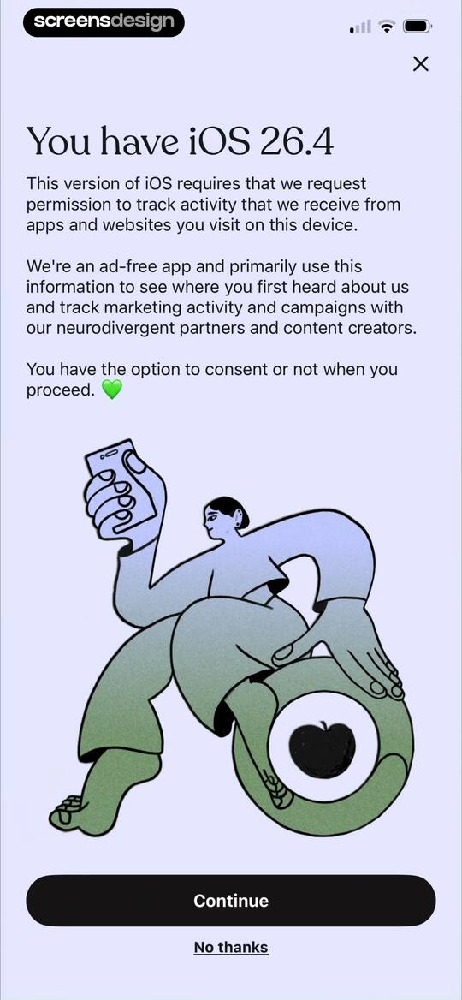
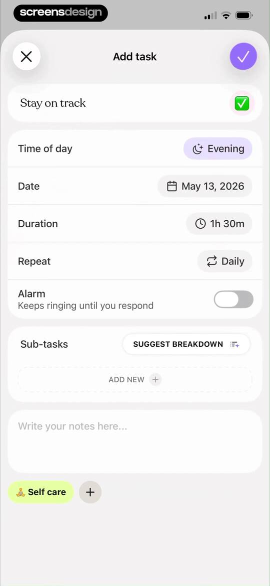
