# Unrot: Screen Time Battery Onboarding, Paywall & UX Flow — 51 Screens, $40k/mo

Source: https://screensdesign.com/apps/unrot-earn-your-screentime/ (fetched 2026-10-05)

Stats: 

| # | Time | Image | What the screen shows |
|---|---|---|---|
| 1 | 00:01 | 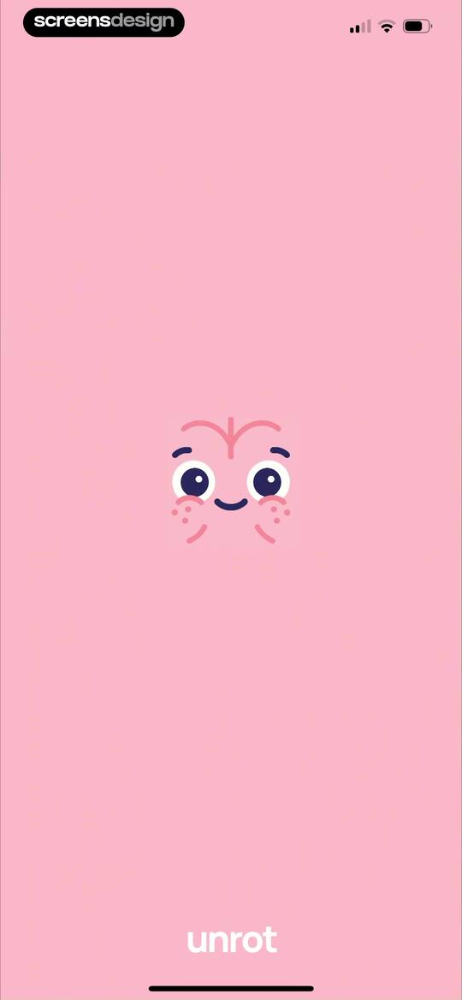 | Splash screen with a centered character illustration and the app name unrot displayed at the bottom against a pastel pink background. |
| 2 | 00:03 | 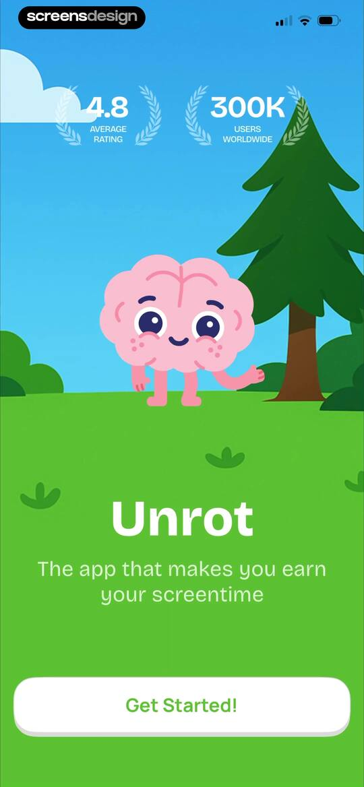 | Unrot onboarding screen featuring social proof metrics, a character mascot, and a Get Started button. |
| 3 | 00:12 | 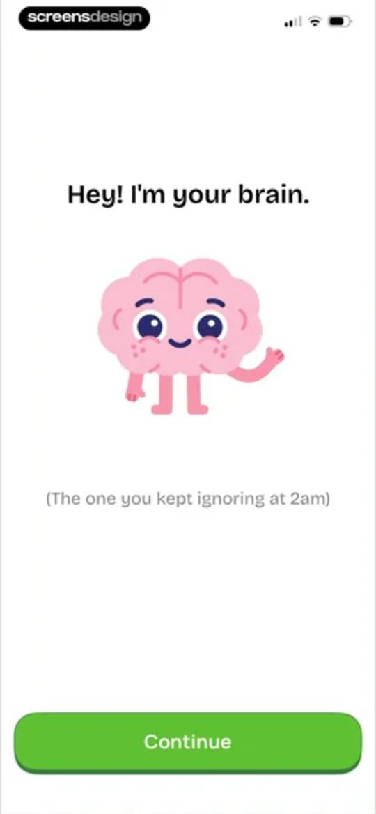 | Onboarding screen introducing a cartoon brain mascot with a playful greeting and a green Continue button. |
| 4 | 00:18 | 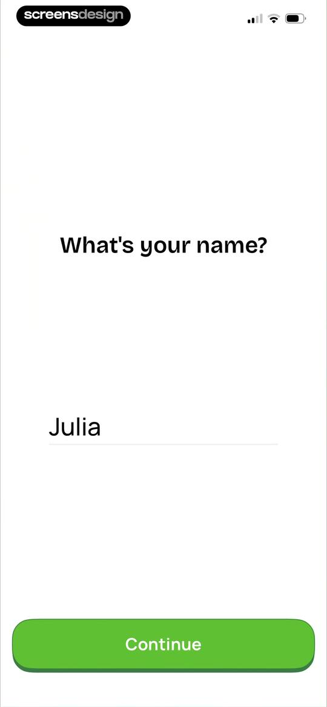 | Onboarding name input screen with the heading What's your name?, the name Julia entered in the field, and a green Continue button. |
| 5 | 00:22 | 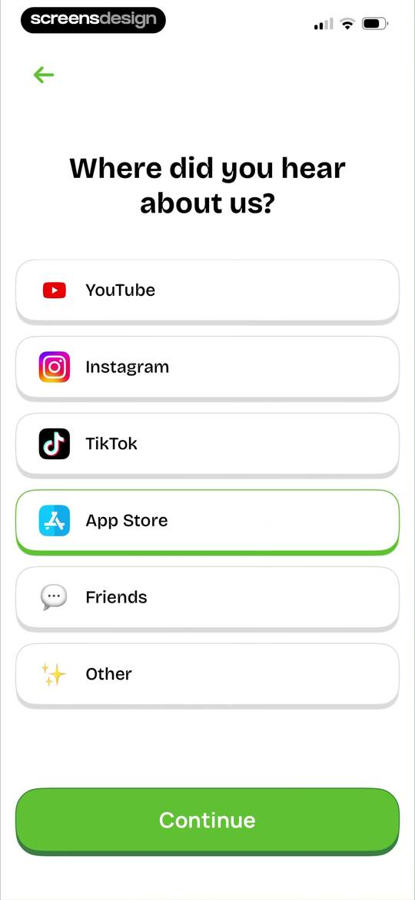 | Onboarding survey asking where the user heard about the app, with App Store selected from a list and a Continue button. |
| 6 | 00:28 | 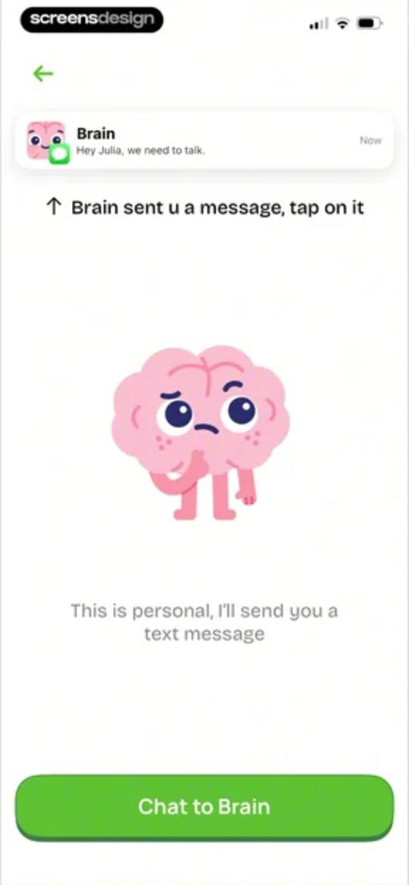 | Chat introduction screen featuring a central brain character illustration, a top notification card from Brain, and a Chat to Brain button at the bottom. |
| 7 | 00:37 | 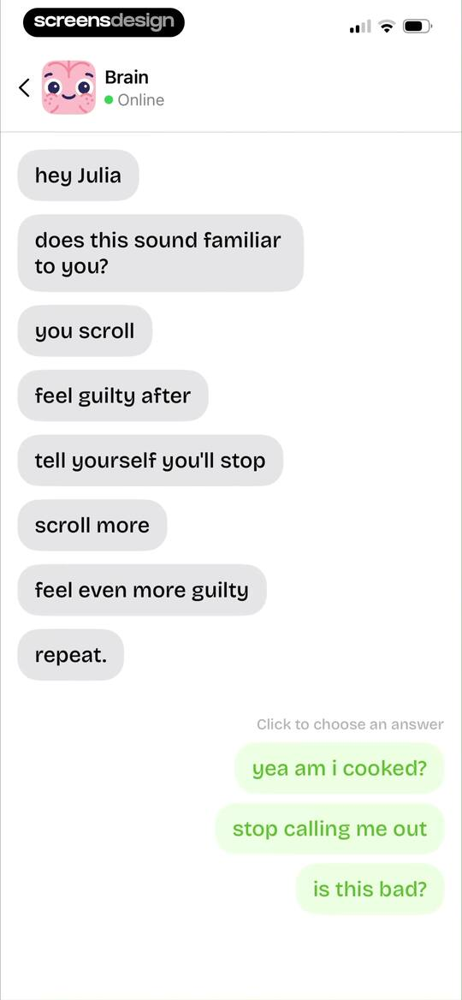 | Chat onboarding screen displaying a conversation with an AI persona about mindless scrolling, featuring selectable response buttons at the bottom. |
| 8 | 00:44 | 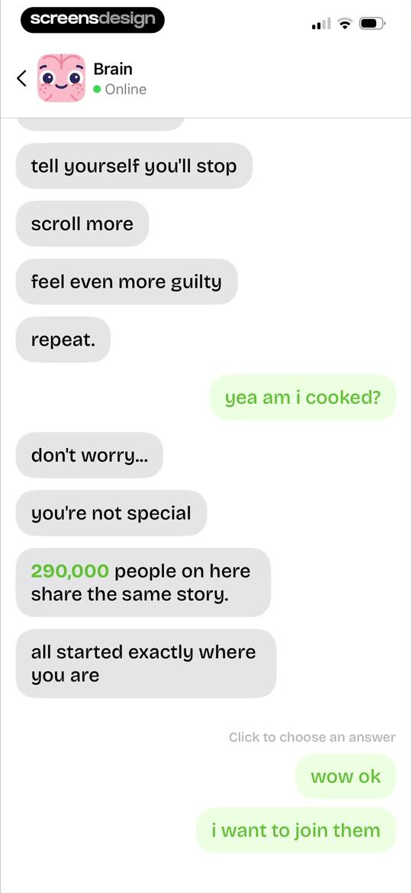 | Chat interface with an online bot named Brain, displaying a conversation history about digital habits and selectable response buttons at the bottom. |
| 9 | 00:55 | locked | Chat interface with an online bot named Brain, displaying a conversation about screen time habits and user response options. |
| 10 | 01:06 | locked | Chat interface onboarding screen showing a conversation with a Brain persona about screen time struggles, with three response buttons at the bottom. |
| 11 | 01:15 | locked | Chat screen with an AI persona discussing social media addiction, featuring a card of app icons and response selection buttons at the bottom. |
| 12 | 01:20 | locked | Chat interface with the Brain persona displaying user testimonial cards and a bottom action button labeled show me how! |
| 13 | 01:25 | locked | Chat onboarding screen displaying user testimonials and a bot demo conversation, with a Great button at the bottom. |
| 14 | 01:30 | locked | Onboarding screen explaining the app's blocking feature with an illustration of a phone in jail and a Continue button. |
| 15 | 01:42 | locked | Onboarding screen explaining how to earn Brain Coins by completing tasks, with a phone mockup, task buttons, and a Continue button. |
| 16 | 01:47 | locked | Onboarding screen explaining how to earn Brain Coins, featuring an illustration of a smartphone, a habit carousel, and a Continue button. |
| 17 | 01:59 | locked | Purchase confirmation screen to unblock apps for 10 minutes for 20 credits, featuring a central confirmation card and a green continue button. |
| 18 | 02:08 | locked | Onboarding screen explaining the app's gamification mechanic with a central character illustration, descriptive text, and a Continue button. |
| 19 | 02:14 | locked | Onboarding welcome screen for the Unrot app with a brain character illustration, introductory text, and a Continue button. |
| 20 | 02:22 | locked | Onboarding screen for selecting activities to earn rewards, with Running, Strength training, and Do sports selected and a Continue button. |
| 21 | 02:35 | locked | Onboarding habit selection screen asking how to earn brain coins, with a list of selectable habit cards and a Continue button. |
| 22 | 02:39 | locked | Onboarding screen asking how much daily time to spend on habits, featuring four duration cards with the 30 minutes option selected and a Continue button. |
| 23 | 02:42 | locked | Onboarding screen asking for daily screen time with five selectable range options, the 4 to 6 hours option selected, and a Continue button. |
| 24 | 02:51 | locked | Unrot onboarding screen displaying scrolling statistics with a central card and a Continue button. |
| 25 | 02:55 | locked | Onboarding screen titled This is a year in your life, displaying a large center grid of circles representing days. |
| 26 | 02:58 | locked | Onboarding screen explaining free time with a centered text block and a grid of circles representing time units. |
| 27 | 03:11 | locked | Onboarding screen displaying a screen time scrolling visualization, descriptive text, and a green Continue button at the bottom. |
| 28 | 03:15 | locked | Onboarding feeling selection screen with a vertical list of selectable emotional states and a Continue button. |
| 29 | 03:21 | locked | Onboarding screen featuring an encouraging message for Julia with a character illustration and a green Continue button. |
| 30 | 03:29 | locked | Onboarding screen for the Unrot app featuring a playful pink brain illustration and a Continue button. |
| 31 | 03:34 | locked | Onboarding screen for Unrot comparing living and scrolling habits over time with a line chart and a Got it! button. |
| 32 | 03:40 | locked | Rating prompt modal for Unrot asking users to tap a star to rate the app on the App Store, with Submit and Cancel buttons. |
| 33 | 03:41 | locked | Feedback modal thanking the user with five empty star rating icons and a Write a Review button. |
| 34 | 03:47 | locked | Social proof screen for Unrot featuring an average rating, user statistics, a testimonial carousel, and a Continue button. |
| 35 | 03:58 | locked | Permission onboarding screen for Unrot featuring a central brain illustration, a privacy assurance card, and a green Continue button. |
| 36 | 04:00 | locked | App tracking transparency permission screen featuring an Unrot prompt, privacy disclaimer card, and a bottom Continue button. |
| 37 | 04:03 | locked | Permission request screen asking the user to enable notifications, featuring a central bell illustration and an Allow Notifications button. |
| 38 | 04:06 | locked | Permission request screen for the app Unrot asking to send notifications, featuring a system modal and a bottom Allow Notifications button. |
| 39 | 04:08 | locked | Onboarding confirmation screen with a personalized greeting, central character illustration, and a large green button featuring a fingerprint icon. |
| 40 | 04:11 | locked | Unrot onboarding screen with a vibrant green background, a personalized greeting, and a fingerprint icon at the bottom for biometric authentication. |
| 41 | 04:21 | locked | Onboarding screen defining the term Unrot against a vibrant green background, with a Let's go button at the bottom. |
| 42 | 04:30 | locked | App setup loading screen displaying a brain illustration, a progress indicator, and a list of three completed steps with checkmarks. |
| 43 | 04:32 | locked | Unrot onboarding screen featuring a brain lifting weights illustration, social proof badges, and a Start My Unrot Journey button. |
| 44 | 04:44 | locked | Onboarding plan screen displaying a three-week progression with progress cards and a Start My Unrot Journey button. |
| 45 | 04:49 | locked | Onboarding screen comparing Brainrot and Unrot modes with a toggle switch, negative points list, and a Start My Unrot Journey button. |
| 46 | 04:52 | locked | Onboarding choice screen with a toggle between Brainrot and Unrot modes, a list of benefits, a grid of habits, and a Start My Unrot Journey button. |
| 47 | 04:58 | locked | Onboarding screen featuring user testimonials, social proof count, and a start journey button. |
| 48 | 05:02 | locked | Paywall screen for the Unrot app featuring three stacked FAQ cards addressing common user objections and a Start My Unrot Journey call-to-action button. |
| 49 | 05:05 | locked | Paywall screen for the Unrot app featuring a countdown timer for a special offer, a discount button, and a primary call-to-action. |
| 50 | 05:07 | locked | Paywall screen for Unrot Pro comparing annual and weekly subscription plans, featuring an app mockup carousel and a Continue button. |
| 51 | 05:13 | locked | Paywall screen offering a discounted annual subscription with benefits listed and a claim offer button. |

## Free showcase screenshots (unordered)

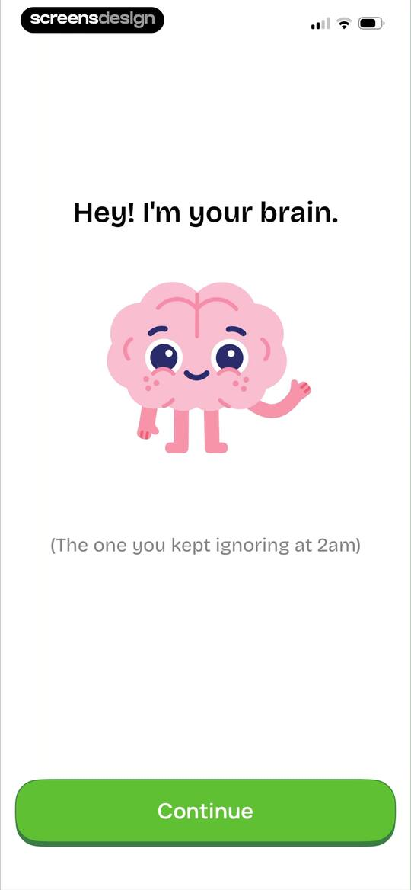
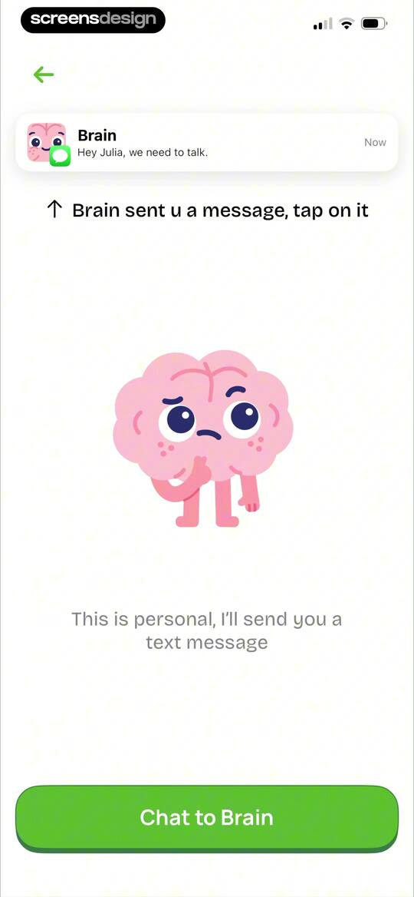
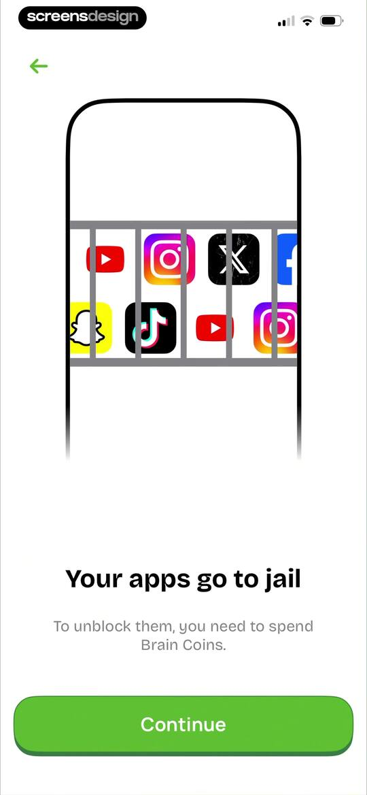
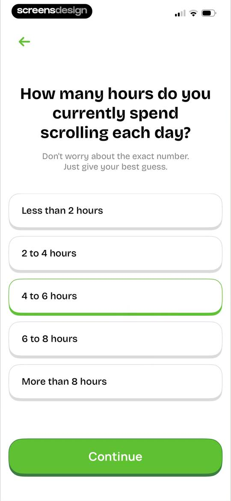
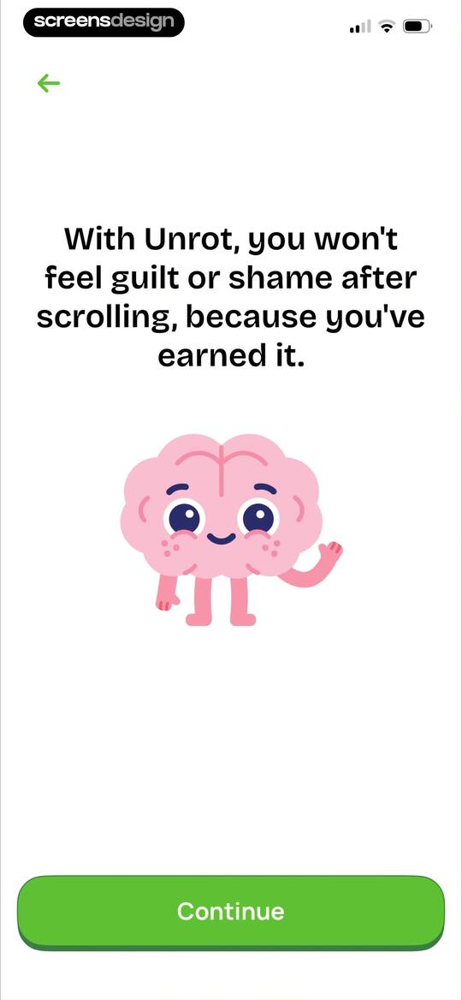
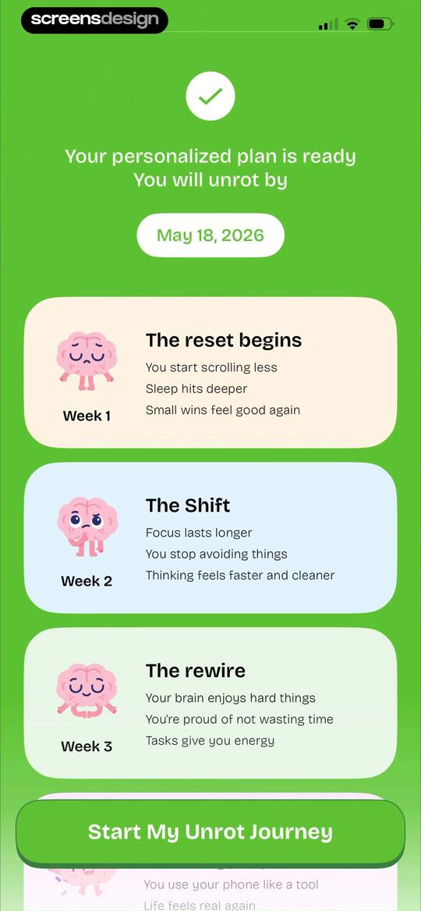
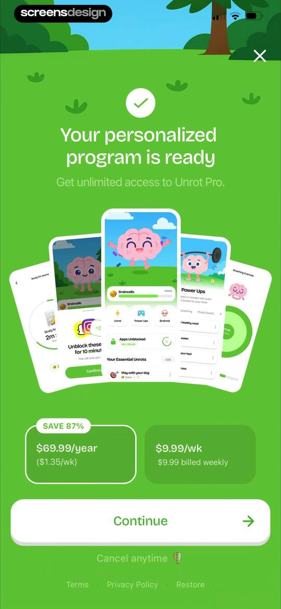
