# Wayk: Alarm Clock to Wake Up Onboarding, Paywall & UX Flow — 102 Screens, $75k/mo

Source: https://screensdesign.com/apps/wayk-alarm-clock-to-wake-up/ (fetched 2026-10-05)

Stats: 

| # | Time | Image | What the screen shows |
|---|---|---|---|
| 1 | 00:01 | 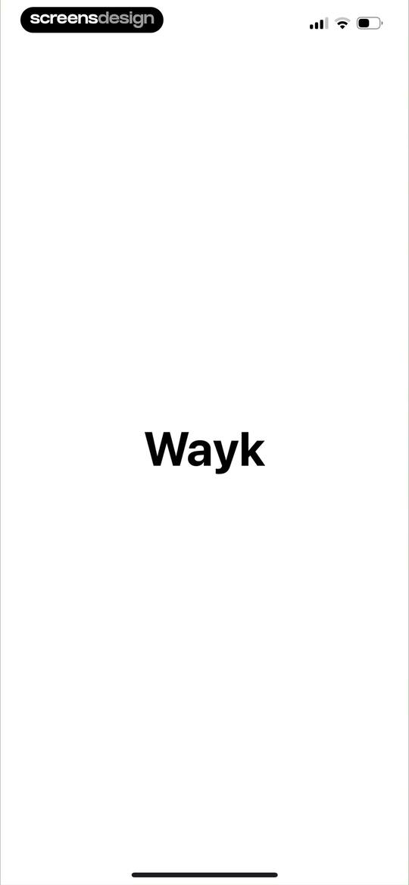 | Splash screen for the Wayk alarm clock app displaying the centered brand name on a plain white background. |
| 2 | 00:04 |  | Wayk app splash screen featuring a minimalist dark starry background and a single glowing orb in the lower center. |
| 3 | 00:09 |  | Onboarding screen featuring a yellow sun graphic and the text Become a morning person on a cream background. |
| 4 | 00:11 | 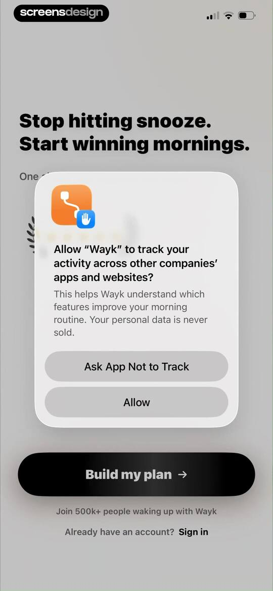 | Permission request modal for Wayk overlaid on an onboarding screen, asking to track activity across other apps with Allow and Ask App Not to Track buttons. |
| 5 | 00:14 | 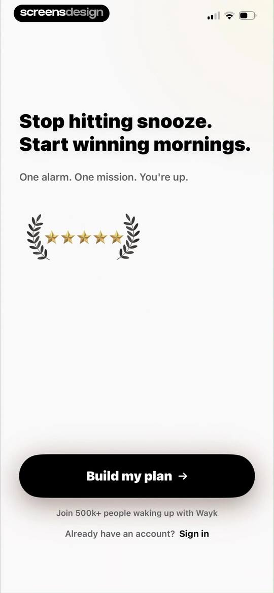 | Wayk alarm clock onboarding screen featuring a minimalist design, a star rating, social proof, and a Build my plan button. |
| 6 | 00:20 | 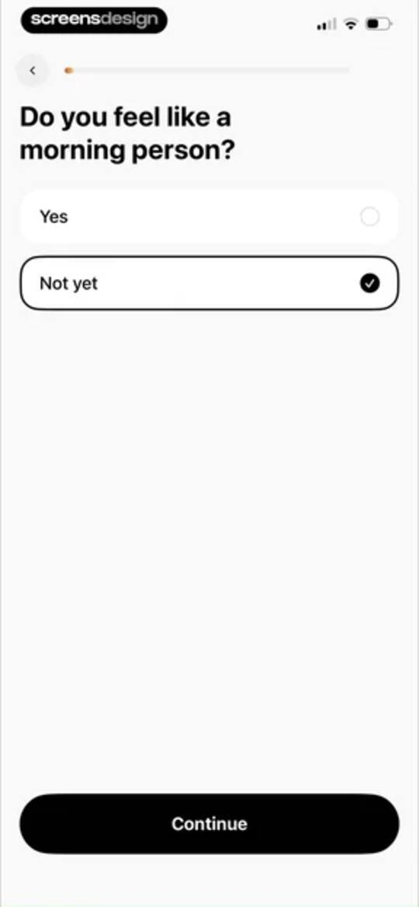 | Wayk onboarding survey screen asking if the user feels like a morning person, with the Not yet option selected and a Continue button. |
| 7 | 00:24 | 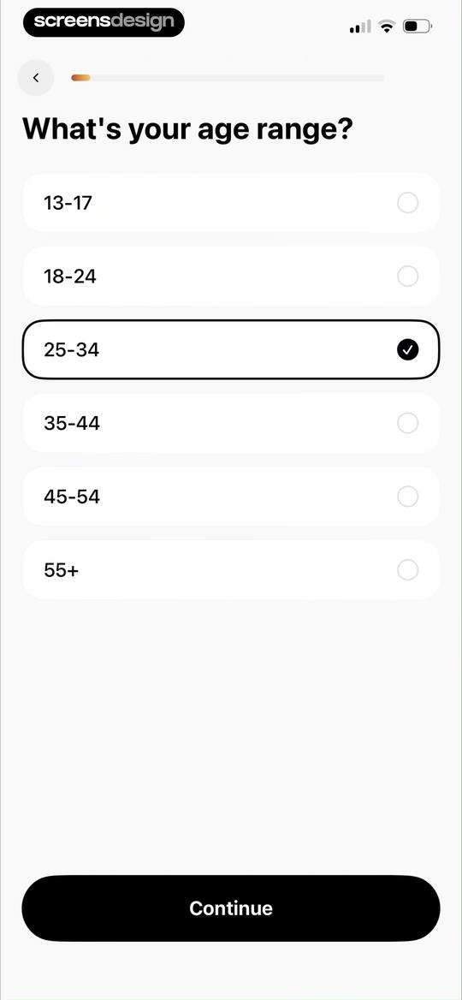 | Onboarding age selection screen asking "What's your age range?", with the 25-34 option selected and a Continue button. |
| 8 | 00:28 | 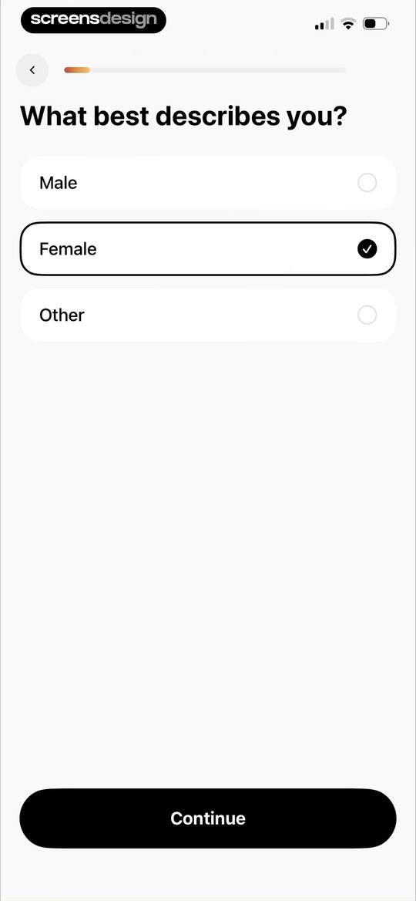 | Onboarding screen asking What best describes you with options for Male, Female, and Other, featuring Female selected and a Continue button. |
| 9 | 00:32 | locked | Onboarding question about morning habits with four selectable option cards, the Sleep through alarms option selected, and a Continue button. |
| 10 | 00:36 | locked | Onboarding survey asking about morning alarm habits, with 'Just 5 more minutes' selected and a Continue button. |
| 11 | 00:40 | locked | Onboarding screen explaining the Wayk alarm clock app value proposition with an energy levels graph and a Continue button. |
| 12 | 00:44 | locked | Onboarding screen asking how many alarms you set, with the 2-3 option selected and a Continue button. |
| 13 | 00:48 | locked | Wayk onboarding survey asking if you would wake up to one alarm, with the Sometimes option selected and a Continue button. |
| 14 | 00:52 | locked | Onboarding survey screen asking about morning habits with the Sometimes option selected and a Continue button. |
| 15 | 00:56 | locked | Wayk onboarding comparison screen contrasting a typical morning routine with a Wayk morning routine, featuring a Continue button. |
| 16 | 01:00 | locked | Onboarding survey screen asking about alarm feelings, with the option Anxious about sleep selected and a Continue button. |
| 17 | 01:04 | locked | Onboarding mood selection screen asking how the user feels after waking up, with the Anxious or stressed option selected and a Continue button. |
| 18 | 01:08 | locked | Onboarding question asking how long until you feel fully awake, with the 10-15 minutes card selected and a Continue button. |
| 19 | 01:11 | locked | Onboarding screen explaining sleep inertia with a DNA helix illustration, progress indicator, and a Continue button. |
| 20 | 01:20 | locked | Onboarding screen asking what time the user gets out of bed, with a time picker set to 8:00 AM and a Continue button. |
| 21 | 01:26 | locked | Onboarding screen asking for the ideal daily wake-up time, featuring a time picker set to 5:30 AM and a Continue button. |
| 22 | 01:28 | locked | Onboarding goal screen showing a target wake-up time of 5:30 AM with calculated time benefits and a Continue button. |
| 23 | 01:32 | locked | Wayk onboarding screen featuring a motivational quote by Tim Ferriss, a top progress bar, and a Continue button. |
| 24 | 01:36 | locked | Onboarding screen for selecting a wake-up mission with the Make Your Bed option selected and a Continue button. |
| 25 | 01:39 | locked | Onboarding screen explaining the benefit of making your bed, featuring a central illustration and a Continue button. |
| 26 | 01:45 | locked | Wayk onboarding alarm setup screen with a central time picker and a Set alarm for 5:20 AM button at the bottom. |
| 27 | 01:51 | locked | Day selection onboarding screen for Wayk with Tuesday, Wednesday, and Friday selected in the vertical list and a Continue button. |
| 28 | 01:56 | locked | Alarm sound selection onboarding screen with categorized audio options, the Sparkles sound selected, and a Continue button. |
| 29 | 02:05 | locked | Onboarding screen asking whether to play the alarm during a mission, with the first of two option cards selected and a Continue button. |
| 30 | 02:10 | locked | Onboarding survey screen asking where the user heard about the app, with App Store selected in the list and a Continue button. |
| 31 | 02:14 | locked | Onboarding screen featuring an optional referral code input field with a submit button, a progress bar, and a continue button. |
| 32 | 02:16 | locked | Wayk alarm clock onboarding value proposition screen featuring a speedometer gauge showing 5.0x speed improvement and a Continue button. |
| 33 | 02:22 | locked | Rating prompt modal asking if you are enjoying Wayk, featuring five selectable blue stars and a Submit button over a testimonial background. |
| 34 | 02:23 | locked | Feedback screen with a central rating modal displaying star icons, a review prompt, and an OK button over a testimonial list. |
| 35 | 02:28 | locked | Notification permission onboarding screen with a bell icon, reminder explanation text, and an Enable button. |
| 36 | 02:30 | locked | Notification permission onboarding screen with a system prompt to send alerts, featuring an Enable button and a Not now link. |
| 37 | 02:33 | locked | Onboarding commitment screen with a signature pad and an I Commit button to confirm waking up at 5:20 AM. |
| 38 | 02:42 | locked | Onboarding confirmation screen with a commitment locked card for a 5:20 AM wake-up time and a Continue button. |
| 39 | 02:44 | locked | Onboarding screen for selecting a wakeup receipt style, featuring a central preview card, pagination, and a Continue button. |
| 40 | 02:46 | locked | Onboarding screen for selecting a wakeup receipt style, featuring a modern preview card, carousel dots, and a continue button. |
| 41 | 02:47 | locked | Onboarding screen for selecting a wakeup receipt style, featuring a film-style preview card and a Continue button. |
| 42 | 02:48 | locked | Wayk onboarding screen for selecting a wakeup receipt style, displaying a Bold preview card and a Continue button. |
| 43 | 02:50 | locked | Wayk onboarding screen for selecting a wakeup receipt style, featuring a dark sample receipt card for a push-up task, pagination dots, and a Continue button. |
| 44 | 02:59 | locked | Onboarding completion screen with a 100% progress indicator and a checklist of completed setup steps. |
| 45 | 03:01 | locked | Morning plan summary displaying a tomorrow timeline, wake receipt card, and a Continue button. |
| 46 | 03:03 | locked | Morning plan dashboard displaying a countdown, a vertical timeline of tomorrow's alarm and routine tasks, a wake receipt card, and a Continue button. |
| 47 | 03:09 | locked | Wayk account creation screen with Sign in with Apple and Continue with Google buttons, and a skip link at the bottom. |
| 48 | 03:25 | locked | Permission request modal in the Wayk alarm clock app asking to allow scheduling alarms and timers, with Don't Allow and Allow buttons. |
| 49 | 03:28 | locked | Wayk onboarding permissions screen featuring a system modal requesting microphone access with Allow and Don't Allow buttons over a free trial paywall background. |
| 50 | 03:30 | locked | Wayk alarm app onboarding screen featuring a camera access permission modal overlaid on a free trial paywall with a Try For $0.00 button. |
| 51 | 03:32 | locked | Paywall screen for the Wayk alarm clock app offering a free trial with a central product mockup and a Try For $0.00 button. |
| 52 | 03:42 | locked | Wayk paywall screen offering a free trial with an alarm app mockup, an 8-day streak indicator, and a Try For $0.00 button. |
| 53 | 03:48 | locked | Paywall offering a free trial with a notification bell illustration, pricing details, and a Continue For Free button. |
| 54 | 03:52 | locked | Subscription screen for Wayk comparing yearly and monthly plans with a timeline of benefits, featuring the yearly plan and a Continue button. |
| 55 | 04:03 | locked | Subscription modal offering a yearly plan with a three-day free trial, displaying a confirm with side button instruction. |
| 56 | 04:09 | locked | Paywall screen displaying subscription plans with a centered modal overlay stating your purchase was successful and an OK button. |
| 57 | 04:13 | locked | Wayk alarm app home screen displaying no active alarms, a volume check notification, and a bottom modal promoting a referral program with a Go to Referrals button. |
| 58 | 04:18 | locked | Settings screen with grouped preference sections, an invite friends card, and the settings tab selected in the bottom navigation. |
| 59 | 04:30 | locked | Wayk home dashboard with a weekly calendar, a volume warning card, an empty alarm state, and an Add Alarm button. |
| 60 | 04:35 | locked | Wayk home screen with an alarm type selection modal displaying Normal Alarm and Mission Alarm options over a dark dashboard. |
| 61 | 04:38 | locked | Alarm configuration form with settings for time, repeat days, sound, and a Save Alarm button. |
| 62 | 04:44 | locked | Alarm configuration form featuring a time picker modal set to 4:00 AM with a Done button. |
| 63 | 04:51 | locked | Alarm sound settings screen with a promotional card for AI-generated jingles, an upload button, and a list of selectable options with the Default sound selected. |
| 64 | 04:59 | locked | Alarm configuration form with repeat day toggles, sleep settings, a warning banner, and a Save Alarm button. |
| 65 | 05:12 | locked | Mission selection screen with a two-column grid of task cards, category filter tabs, and a close button. |
| 66 | 05:16 | locked | Alarm sound settings screen featuring an AI sound generator card, upload option, and categorized sound lists with the default sound selected. |
| 67 | 05:21 | locked | Alarm configuration form with time input, repeat days, the Make Bed mission card, and a Save Alarm button. |
| 68 | 05:26 | locked | Alarm configuration form with repeat settings, a make-bed mission, sound selection, and a save alarm button. |
| 69 | 05:37 | locked | Alarm configuration screen with a dark theme, mission settings for Make Bed, and a time picker modal at the bottom. |
| 70 | 05:38 | locked | Alarm configuration editor displaying time, frequency, Make Bed mission settings, sound selection, and a Save Alarm button. |
| 71 | 06:02 | locked | Wayk alarm screen instructing the user to make their bed to turn off the alarm, featuring a Start Mission button. |
| 72 | 06:05 | locked | Wayk alarm mission screen with a camera viewfinder, instructions to take a photo of a made bed, and a shutter button. |
| 73 | 06:08 | locked | Wayk alarm mission camera screen displaying a viewfinder with the text Analyzing bed and a bottom circular action button. |
| 74 | 06:18 | locked | Wayk post-alarm success screen showing wakeup statistics, a sun illustration, and a Continue button. |
| 75 | 06:29 | locked | Inspirational quote screen displaying a Steve Jobs quote on a dark gradient background with a close button in the top left corner. |
| 76 | 06:35 | locked | Achievement screen in the Wayk app showing an unlocked Risen badge with motivational text and a Start My Day button. |
| 77 | 06:38 | locked | Wayk alarm app dashboard with a streak counter, weekly calendar, next wake up card showing a 3:13 pm alarm, and feature cards. |
| 78 | 06:45 | locked | Wayk home screen with a weekly calendar, streak tracker, a card to add the next wake-up alarm, and a history section showing a completed mission. |
| 79 | 06:51 | locked | Alarm history dashboard displaying a single card for a completed Make Bed mission on Monday, April 6, with a close button at the top. |
| 80 | 06:55 | locked | Wayk milestones dashboard showing a one-day streak, badge progress, streak rules, and a grid of locked and unlocked achievement badges. |
| 81 | 06:59 | locked | Achievement modal displaying a Risen badge unlock notification with a central graphic, unlock date, and a close button. |
| 82 | 07:10 | locked | Alarm management screen showing an active alarm card set for 3:13 PM with a Make Bed mission, a floating action button, and a bottom navigation bar. |
| 83 | 07:11 | locked | Alarm editor screen with settings for time, repeat schedule, wake-up missions, sound, and a Save Alarm button. |
| 84 | 07:18 | locked | Alarm management screen displaying a list with a Make Bed mission card set for 3 PM, with the Alarms tab selected. |
| 85 | 07:19 | locked | Alarm management screen with a delete confirmation modal overlaid on an alarm list and a bottom navigation bar. |
| 86 | 07:22 | locked | Empty state screen for the Alarms tab with a dark theme, displaying no alarms yet and a floating plus button. |
| 87 | 07:25 | locked | Insights dashboard displaying day streak, badges, wake statistics, consistency progress, and wake up photos on a dark theme. |
| 88 | 07:28 | locked | Wayk app milestones dashboard showing streak summary cards, rules for streaks, and a grid of progress badges with one earned. |
| 89 | 07:37 | locked | Analytics screen with an Insights dashboard and a bottom-sheet modal explaining wake time consistency, featuring streak and stats cards. |
| 90 | 07:41 | locked | Camera viewfinder interface capturing a bed with a pink pillow and striped blanket, featuring a close button in the top left corner. |
| 91 | 07:45 | locked | Settings screen with grouped cards for alarm preferences, referral program, and widget previews, with the settings tab selected. |
| 92 | 07:47 | locked | Refer a friend screen featuring a personal promo code card with code 206LJR, a Share button, and instructions to earn $10 per referral. |
| 93 | 07:52 | locked | Goal wake time setting screen with a time picker and a Save Goal Time button. |
| 94 | 08:01 | locked | Style selection screen for an alarm receipt featuring a central preview card and a grid of buttons with Night selected. |
| 95 | 08:05 | locked | Receipt style settings screen displaying a central preview card and a grid of style options with Dawn selected. |
| 96 | 08:09 | locked | Settings screen with widget preview cards and grouped list sections for preferences, support, and legal links. |
| 97 | 08:13 | locked | Settings screen with widget instructions, preference toggles, support links, and a bottom navigation bar with Settings selected. |
| 98 | 08:16 | locked | Notifications settings screen in Wayk with a status card confirming enabled notifications and three active toggle switches for daily nudges and alerts. |
| 99 | 08:21 | locked | Settings screen with widget instructions, grouped lists for preferences, support, and legal, and a bottom navigation bar. |
| 100 | 08:23 | locked | Settings screen with grouped support, legal, and account options, featuring a bottom navigation bar with Settings selected. |
| 101 | 08:24 | locked | Wayk settings screen with a log out confirmation modal overlay and a bottom navigation bar. |
| 102 | 08:28 | locked | Wayk app settings screen with a delete data confirmation modal displaying Cancel and red Delete buttons. |

## Free showcase screenshots (unordered)

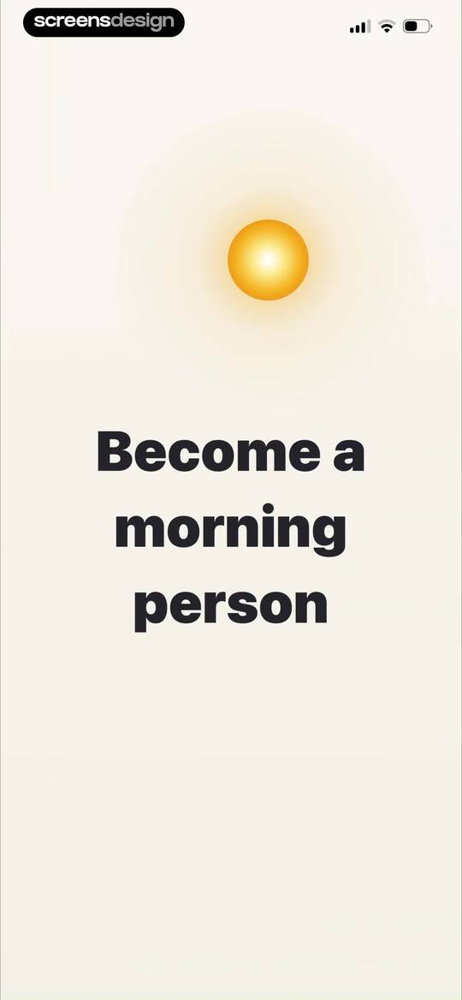
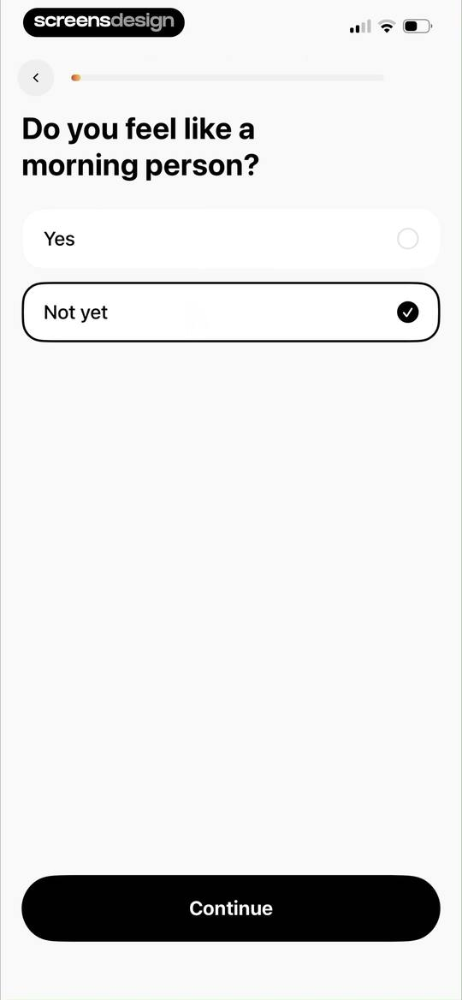
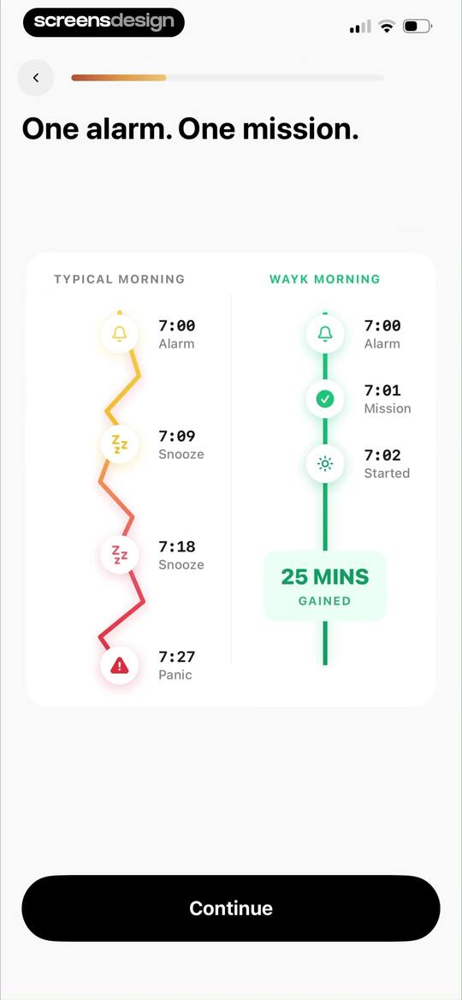
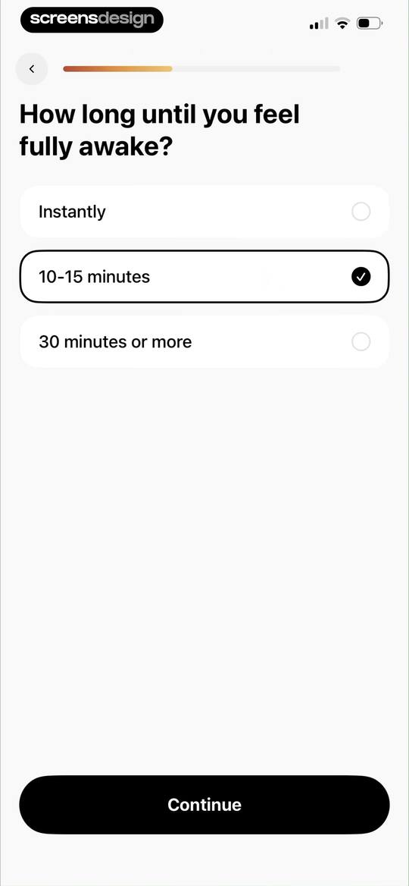
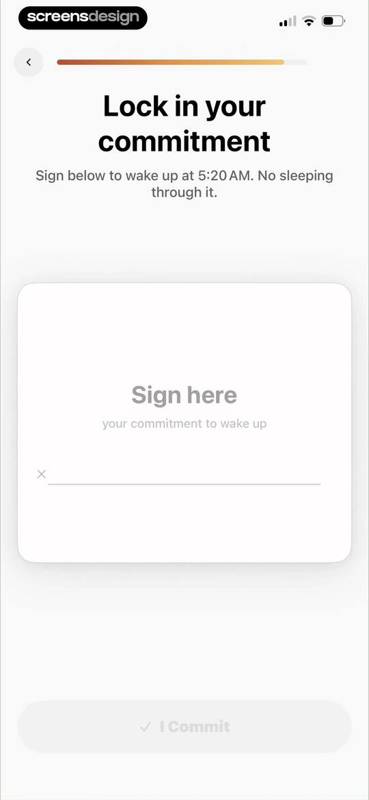
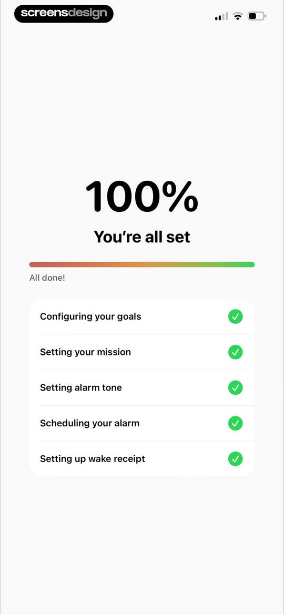
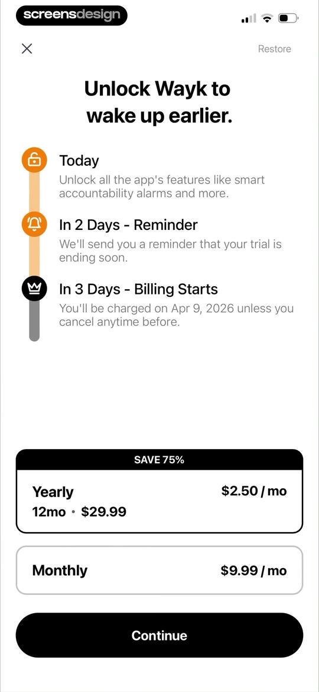
