# Onboarding consistency audit (2026-09-26)

All 28 onboarding screens were rendered at 393×852 (web build, reduced motion) and every text element was measured. Issues are ranked worst first. The interactive version is at https://claude.ai/artifact/MW7dSZNZGCNgjPz3ZPiK2G.

## Target tokens

- **Type:** Hero 46 serif italic · Headline 34 serif italic · Title 28/700 sans · Quiz title 24/700 · Aside 22 serif italic · Body 17/24 · Secondary 15/20 · Caption 13/18 · Label 12/600/+1.4 caps
- **Spacing:** 4 · 8 · 12 · 16 · 24 · 32 · 48. Gutter 24 (including the top bar). Headline at y 80. Headline → support 12. Support → block 24. Sections 32.
- **Shape:** pills 999 · cards 20 · small controls 12 · primary button 56 tall, with its bottom edge fixed on every screen

## 1. Headlines start at a different height on almost every screen (High)

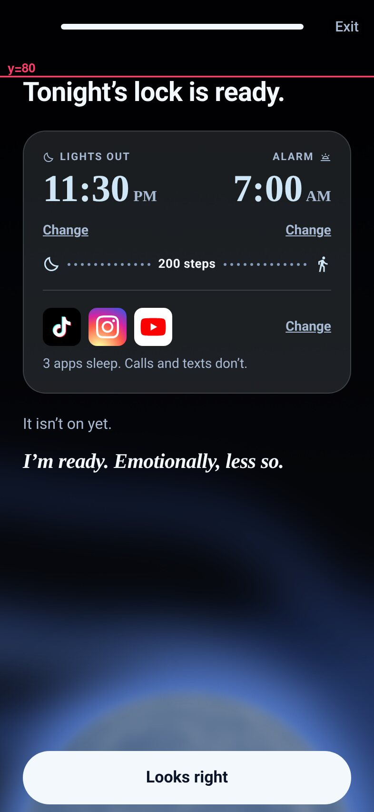 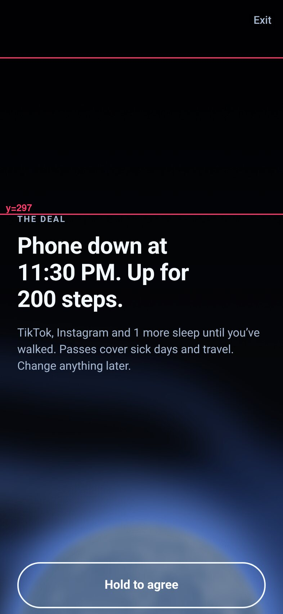 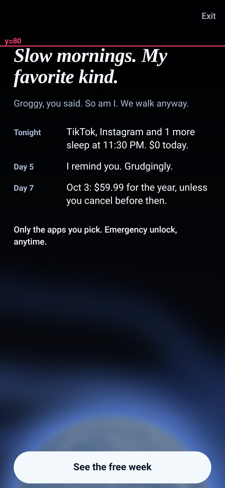 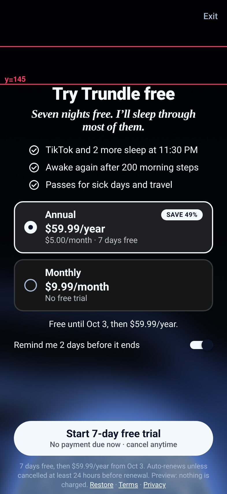 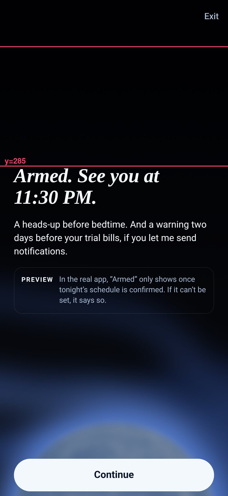 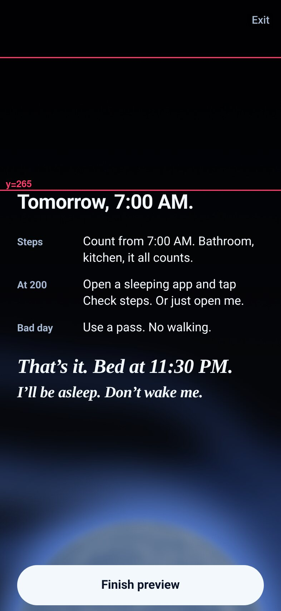

**What is wrong:** Top-anchored screens put the headline at **y 80**. Screens that use the `center` style float the headline to wherever the content height puts it: screen-time 195, first-morning 265, armed 285, commit 297, declined 349. The paywall sits at 145. Bedtime and wake use `fill` instead of `top`, so their titles sit 20pt higher at **y 60**. Going ready → commit → offer → plans → armed → first-morning, the headline jumps 80 → 297 → 80 → 145 → 285 → 265. That jump is the biggest reason the flow feels less than premium.

**Fix:** Pick one anchor. Every dark-sky screen starts its headline at y 80 (the `top` style, paddingTop 20). If some screens should feel quieter and lower, give them one fixed offset (for example 30% of screen height), not "centred by content height". Switch bedtime and wake from `fill` to `top`.

**Where:** `onboarding-flow.tsx:1300-1301 (top, center)`, `onboarding-flow.tsx:469, 506 (bedtime and wake use fill)`, `onboarding-flow.tsx:574, 646, 713, 772, 802, 995 (screens using center)`

## 2. Seven headline sizes where three would do (High)

 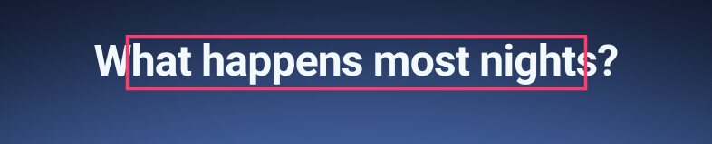 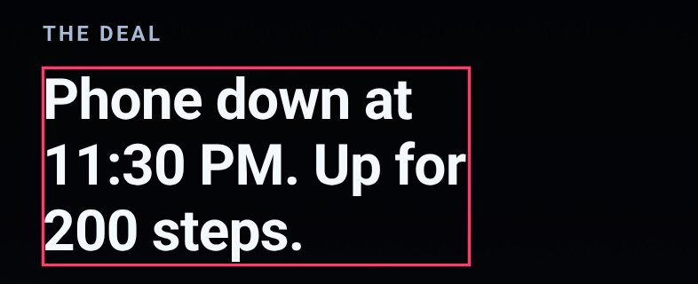  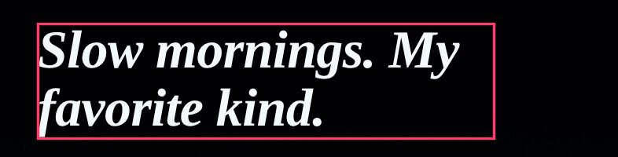 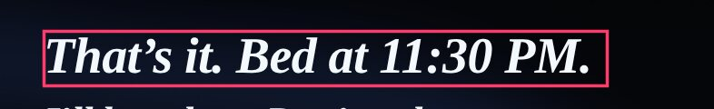

**What is wrong:** Sans titles come in **24** (quiz), **28** (Title), **30 / 800** (paywall) and **32** (commit pledge). Loc's italic serif headlines come in **46** (hello), **34** (most) and **28** (first-morning). Weight also drifts: the paywall is the only 800 sans title.

**Fix:** Name three headline tokens and use only those. **Hero** 46 serif (hello only). **Headline** 34 serif (Loc speaking). **Title** 28 / 700 sans (the user's side). Keep the quiz's 24 only if it's a deliberate "Quiz title" token. Pledge 32 → 28 (or make it a 34 serif headline). Paywall 30 / 800 → 28 / 700.

**Where:** `ui.tsx:473 (title)`, `onboarding-flow.tsx:1310 (moonTitle 24)`, `onboarding-flow.tsx:1346 (pledge 32)`, `onboarding-flow.tsx:1389-1399 (paywallTitle 30 / 800)`, `onboarding-flow.tsx:809 (Voice 28 as a header)`

## 3. The main button moves up and down between screens (High)

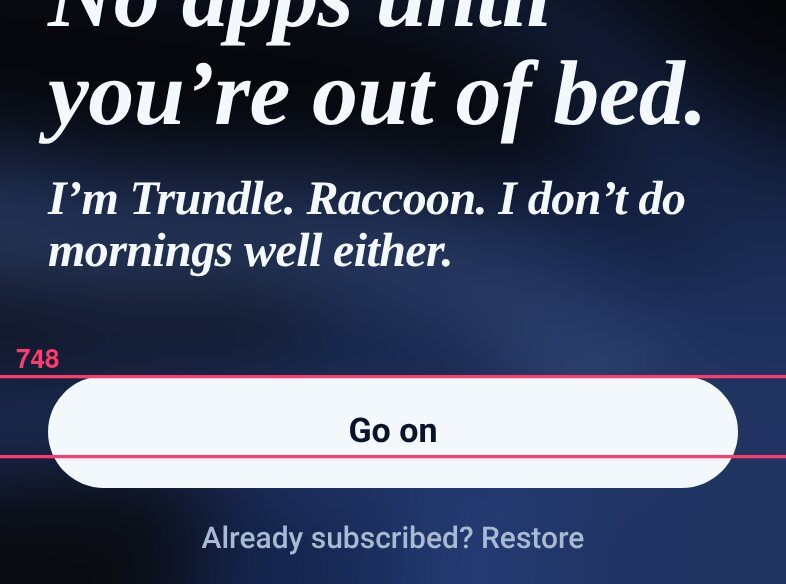 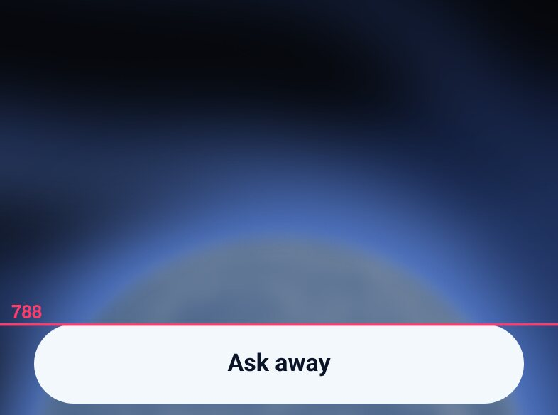 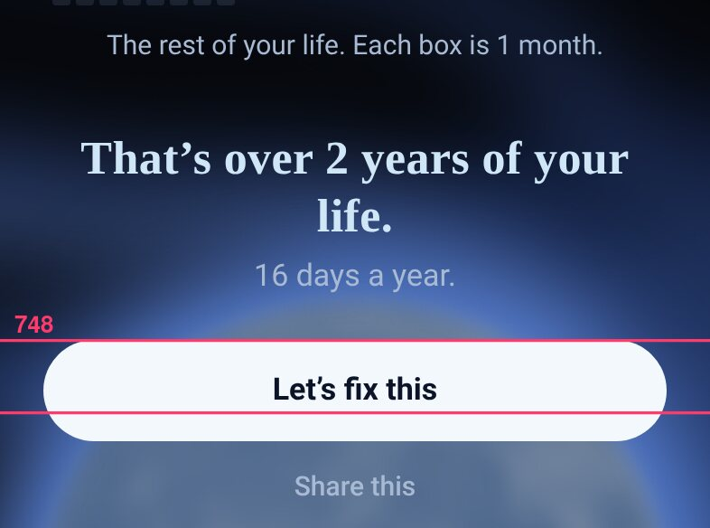 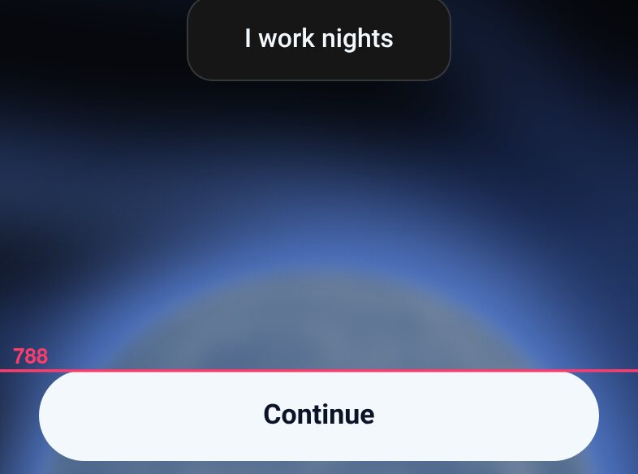 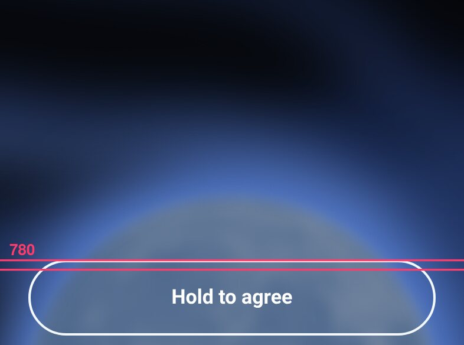 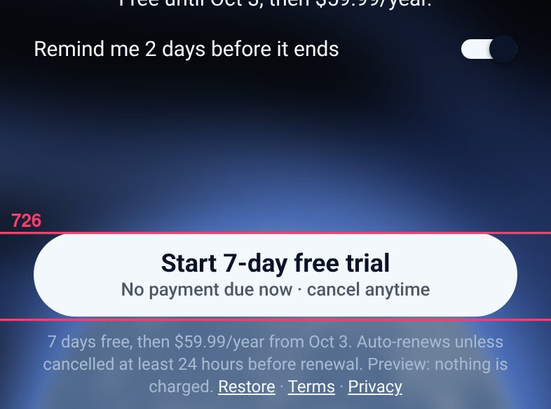 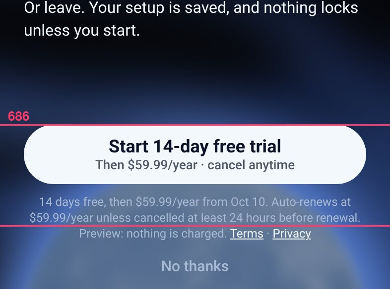

**What is wrong:** The primary button's top edge is at **788** on most screens and **748** on hello and reveal, where a text link sits under it. It's at **726** on plans and **686** on declined. The hold button is 64 tall rather than 56, so it starts at **780**. Going reveal → bedtime, the button your thumb just tapped slides 40pt down.

**Fix:** Anchor the primary button's bottom edge to the same spot on every screen. Put secondary links (Restore, Share this, No thanks) in a slot of fixed height under it that stays reserved, even empty, on every screen, or move them above the button. Make the hold button 56 tall like the other pills. The paywall's two-line button can stay 60, but anchor it on the same bottom line.

**Where:** `ui.tsx:464 (footer)`, `ui.tsx:479-487 (cta 56)`, `ui.tsx:537-546 (hold 64)`, `onboarding-flow.tsx:1404-1412 (twoLineCta 60)`

## 4. The top bar and the content use different side margins (Medium)

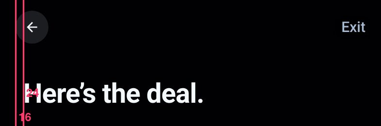 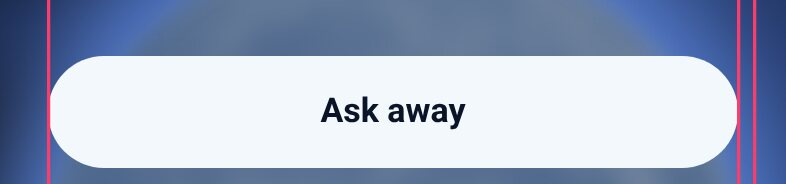 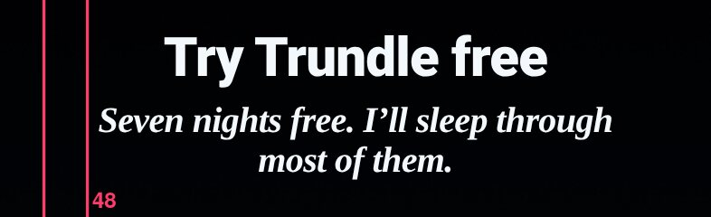

**What is wrong:** Content and buttons use a **24** gutter. The top bar uses **16**, so the back button's left edge and Exit's right edge (377) sit 8pt outside everything below them. The paywall adds a second 24 inset, so its title and voice line run on a **48** margin.

**Fix:** Give the top bar 24 horizontal padding and keep hit areas large with `hitSlop`. Remove `marginHorizontal: 24` from `paywallTitle` and `paywallVoice`. If a line needs a narrower measure, set `maxWidth` and centre it.

**Where:** `ui.tsx:441-447 (topBar paddingHorizontal 16)`, `onboarding-flow.tsx:1333 (paywallVoice)`, `onboarding-flow.tsx:1397 (paywallTitle)`

## 5. Spacing between a headline and what follows is different every time (Medium)

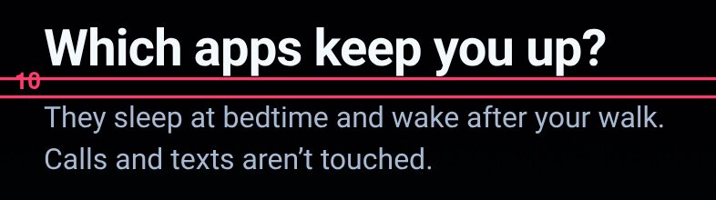 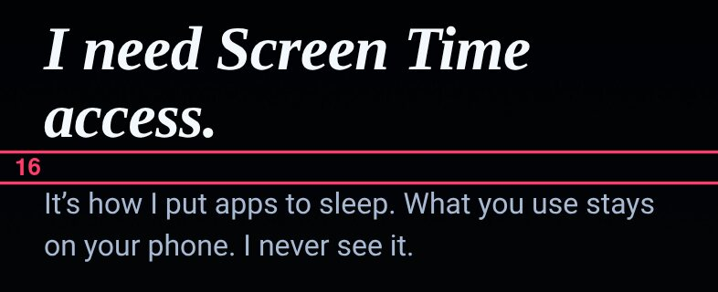 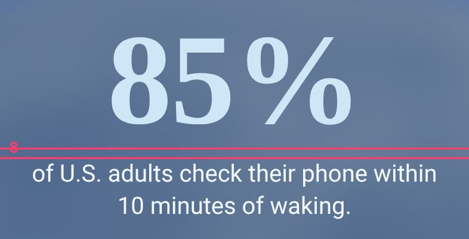 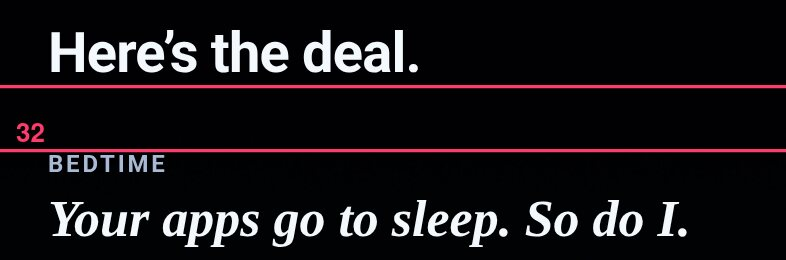 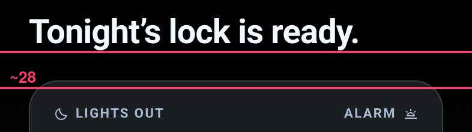

**What is wrong:** Headline → supporting line: **10** (Title + sub), **16** (Voice + Body), **8** (stat number), **4** (reveal lead). Headline → first block: **32** (deal), **28** (apps card), **16** (time wheel), **28** (plan list). The flow's stylesheet uses 2, 3, 4, 6, 8, 10, 12, 14, 16, 18, 20, 22, 24, 26, 28 and 32. That's nearly every even number, with no scale behind it.

**Fix:** Adopt a scale of **4 · 8 · 12 · 16 · 24 · 32 · 48** and name the common gaps. **Headline → supporting line: 12.** **Supporting line → main block: 24.** **Between sections: 32.** Replace `gap8`, `gap16`, `gap32` and the per-style margins with these names so a screen can't make up its own.

**Where:** `onboarding-flow.tsx:1305-1315 (gap8 / gap16 / gap32, sub, beats)`, `onboarding-flow.tsx:1313, 1337-1338 (timeWrap, appsCard, plan)`, `onboarding-flow.tsx:1323, 1331-1332 (stat, reveal lead)`

## 6. Body copy uses five sizes and switches colour at random (Medium)

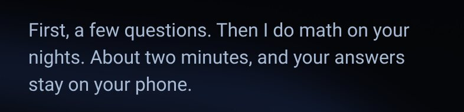 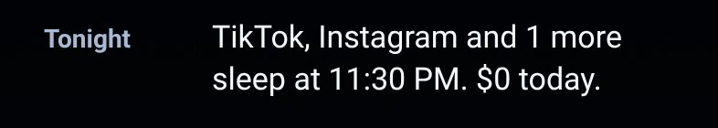  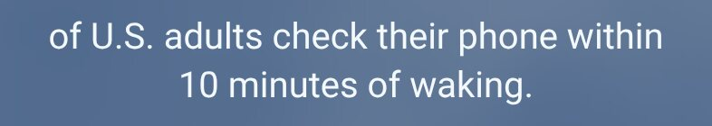 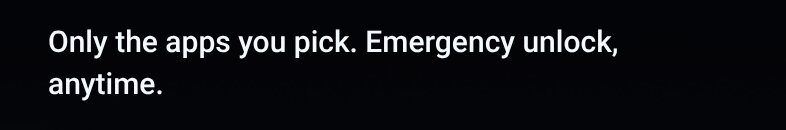 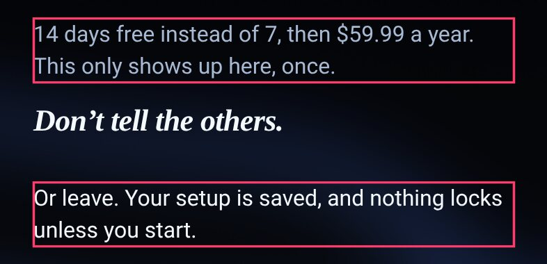

**What is wrong:** Running text appears at **15**, **16**, **17**, **18** and **20**, in weights 400 and 500, and in either grey (text2) or white. On declined, two paragraphs a few lines apart are grey and then white. Offer mixes 16 grey body, 17 white plan rows and 15 / 500 white reassurance in one column.

**Fix:** Four tokens. **Body** 17 / 24 grey. **Body strong**: same size, white, used for one line you want read first. **Secondary** 15 / 20 grey. **Caption** 13 / 18. Leave 12 / 16 for legal text only. Raising Body from 16 to 17 matches iOS's default body size and reads more native.

**Where:** `ui.tsx:474 (body2 16 / 23)`, `onboarding-flow.tsx:1323 (statText 20)`, `onboarding-flow.tsx:1331 (revealLead 18)`, `onboarding-flow.tsx:1341, 1343 (planWhat 17, reassure 15 / 500)`, `onboarding-flow.tsx:1350 (onImage, the white switch)`

## 7. Six different styles for small labels (Medium)

   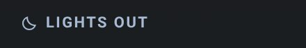  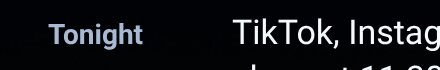

**What is wrong:** Labels doing the same job look different on every screen: **12 / 600 / +1.4** caps (deal), **12 / 600 / +1.6** caps (Eyebrow), **13 / 500 / +0.3** caps (3 APPS), **11 / 700 / +1.2** caps (LIGHTS OUT, APPLE ASKS NEXT, PREVIEW), **14 / 500** sentence case (Presets), **14 / 600** sentence case (Tonight, Day 5).

**Fix:** One **Label** token, 12 / 600 / +1.4 uppercase text2, and use it for every section label (Presets, 3 APPS, LIGHTS OUT, APPLE ASKS NEXT, PREVIEW, the deal beats). The plan-row keys (Tonight, Day 5, Steps) are a different job and can stay 14 / 600, as a named "row key" token.

**Where:** `ui.tsx:465-472 (eyebrow)`, `onboarding-flow.tsx:1317 (beatLabel)`, `app-picker.tsx:338 (listHeader)`, `schedule-card.tsx:156, apple-alert.tsx:96 (11 / 700)`, `time-wheel.tsx:342 (presetsLabel)`

## 8. Loc's asides come in four sizes (Medium)

 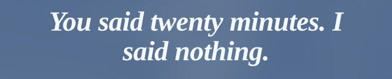   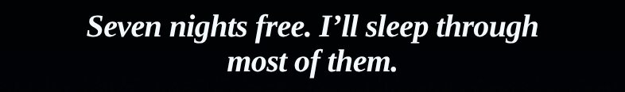

**What is wrong:** The small italic "sub" lines are **24** on hello, **28** on stat, **22** on ready, screen-time and declined, **22 with a 26 line height** in the tomorrow demo, and **20** on the paywall. Stat's aside is bigger than some headlines.

**Fix:** Every aside is **22**. Hello's 24 can stay as the hero pair. Stat: 28 → 22. Paywall: 20 → 22 if it fits, or cut the line on the paywall. Use the shared 1.08 line height in the tomorrow demo too.

**Where:** `onboarding-flow.tsx:399, 542, 903`, `tomorrow-demo.tsx (aside style)`, `ui.tsx Voice (lineHeight size × 1.08)`

## 9. No clear rule for centred and left-aligned text (Medium)

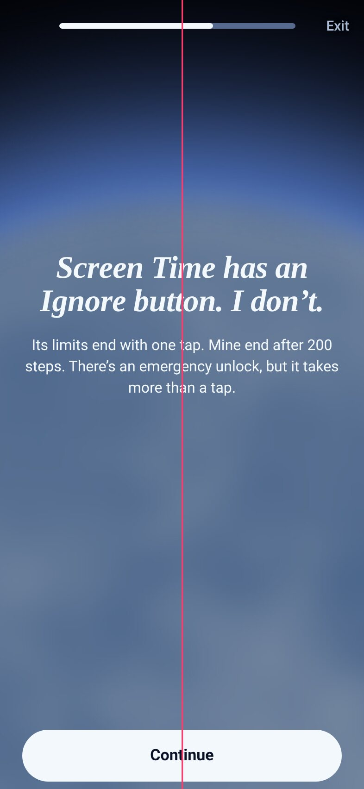 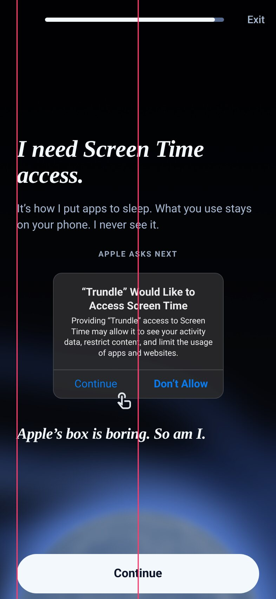 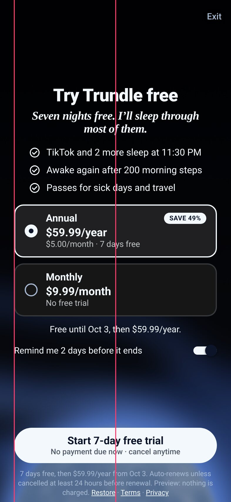 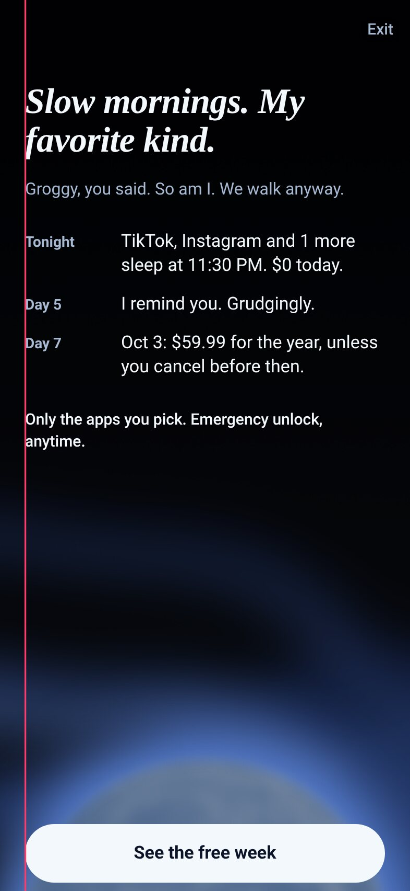

**What is wrong:** Quiz screens are centred, and so are stat, tried-echo and reveal. Everything else is left-aligned. Some screens mix both: screen-time has a left headline over a centred Apple alert and a centred label. Plans has a centred title and voice line over a checklist block centred as a group but left-aligned inside, then a left-aligned remind row.

**Fix:** Write the rule down. **On the moon (quiz) and the paywall: centred. On the dark sky: left.** Inside one screen, pick one axis. On screen-time, left-align the Apple alert and label. On plans, centre the remind row or left-align the whole paywall.

**Where:** `ui.tsx Title / Body (moon → centred)`, `onboarding-flow.tsx:1447 (checks alignSelf center)`, `onboarding-flow.tsx:1451 (remindRow)`, `apple-alert.tsx`

## 10. Ten different corner radii (Low)

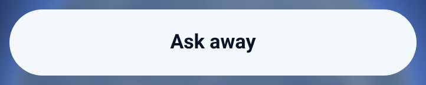 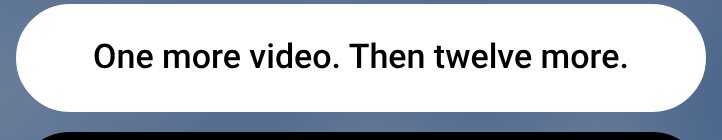 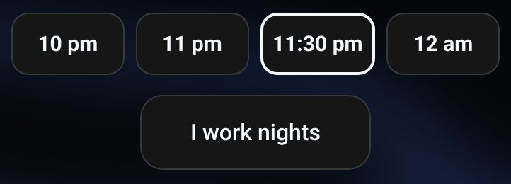 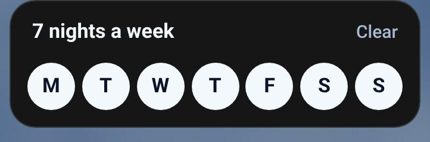 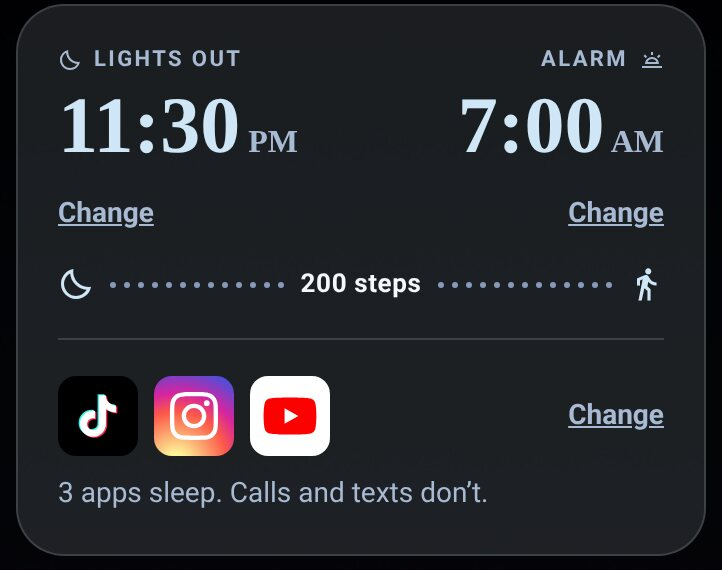 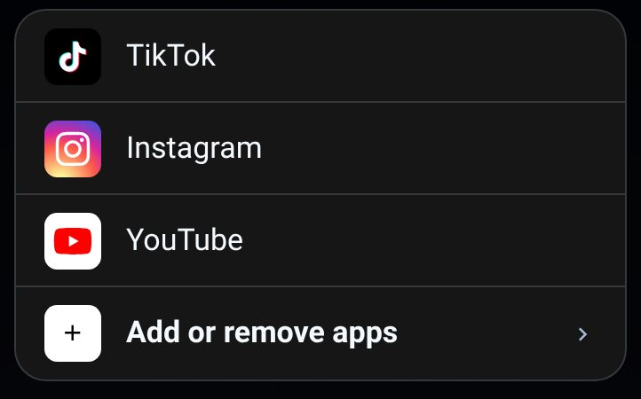 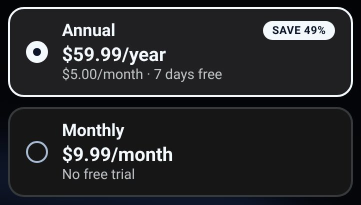 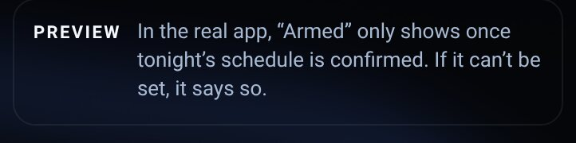

**What is wrong:** Presets **12**, preview note **14**, plan cards and work-nights chip **16**, apps list and sky option **18**, day card **22**, schedule card and modal **24**, and pills at **27**, **28**, **30** and **32**. Cards that sit in the same role (day card, apps list, schedule card, plan cards) all round differently.

**Fix:** Three values. **Pill**: fully round (999) for every button and answer. **Card**: 20 for day card, apps list, schedule card, plan cards and preview note. **Control**: 12 for presets and small chips. Leave the Apple alert at 14, since it copies iOS.

**Where:** `time-wheel.tsx:348 (12)`, `ui.tsx:525 (previewNote 14), 515 (chip 16)`, `onboarding-flow.tsx:1417 (planOption 16)`, `app-picker.tsx:339 (18), day-picker.tsx:80 (22), schedule-card.tsx (24)`

## 11. Two 28pt headlines stacked on the last screen (Low)

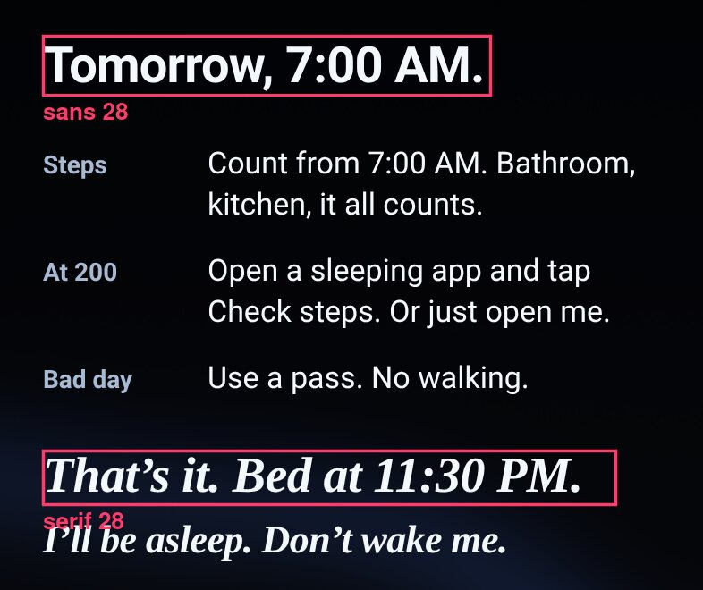

**What is wrong:** "Tomorrow, 7:00 AM." is a 28 sans title. Further down, "That's it. Bed at 11:30 PM." is a 28 serif italic, also marked as a header. They're the same size in different fonts, so neither leads.

**Fix:** Make "That's it…" a 22 aside, matching the line under it, or make it the only headline and drop the sans title into a Label.

**Where:** `onboarding-flow.tsx:803, 809`

## 12. The reveal screen starts too close to the top bar (Low)

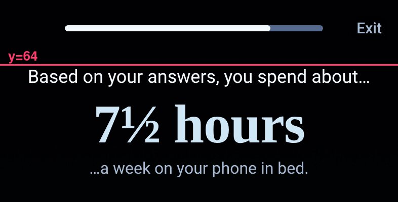 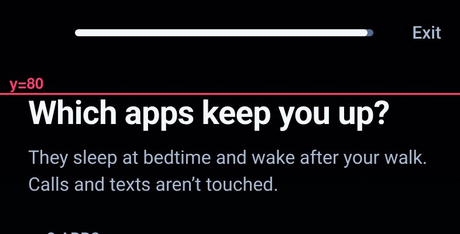

**What is wrong:** `revealWrap` uses paddingTop 4, so "Based on your answers…" starts at **y 64**. Every other top-anchored screen starts at 80.

**Fix:** Use the same 20 top padding as `top`. If the grid then feels short on compact phones, shrink the grid, not the margin.

**Where:** `onboarding-flow.tsx:1330`

## 13. One-word last lines (Low)

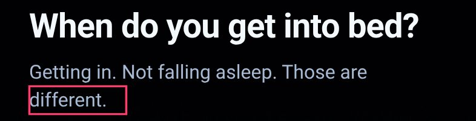 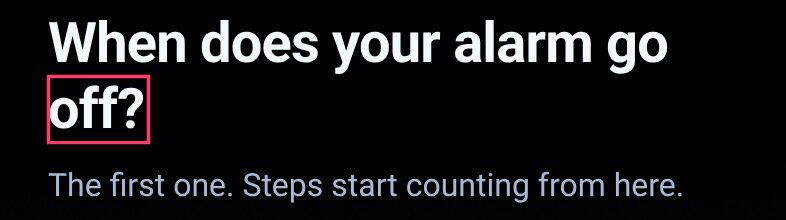  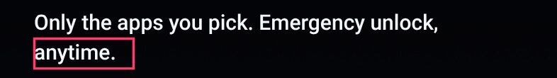 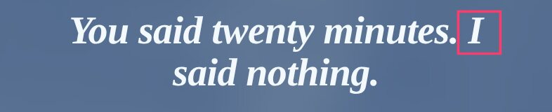

**What is wrong:** Single words stranded on their own line: "different." (bedtime), "off?" (wake), "up?" (morning-minutes), "anytime." (offer), and "I" left at the end of a line on stat. Measured at 393 wide. Smaller phones will break differently.

**Fix:** React Native has no `text-wrap: balance`. Join the last two words with a non-breaking space (`\u00A0`), as the commit pledge already does, or trim the copy. Check again at 375 wide.

**Where:** `onboarding-flow.tsx:471, 507, 527, 755`, `content.ts (MORNING_ECHO)`

## 14. Also spotted: the app picker and preview modal run off the right edge (Check)

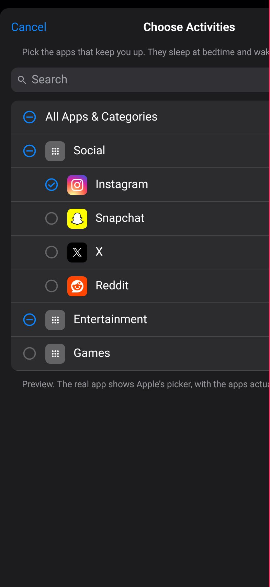 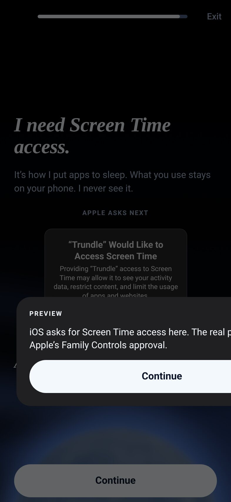

**What is wrong:** At 393 wide in the web preview, the app picker sheet and the PREVIEW modal are wider than the screen and clip on the right. This could be a web-only Modal quirk.

**Fix:** Check on a device. If it happens there too, give the sheet and modal `width: '100%'` / `maxWidth` inside the screen.

**Where:** `app-picker.tsx (sheet)`, `onboarding-flow.tsx:1453-1459 (modalScrim, modalCard)`

## Resolution (2026-09-26)

All 14 issues were fixed the same day. The tokens live in `src/features/onboarding/tokens.ts` (`Space`, `Gap`, `Radius`, `VoiceSize`, `Type`, `CTA_HEIGHT`, `noOrphan`), and the onboarding screens and sub-components read from it.

- Every dark-sky screen anchors at the top (`styles.top`), so headlines start at y 80. Quiz questions stay at 120 and moon statements at 272.
- Primary buttons sit at the bottom of every screen, with their bottom edge at 844 (393×852). A screen's one text link (Restore, Share this, No thanks) is passed as `secondary` and renders just above the button, never under it. The paywall terms and links sit above the buy button. The hold button is 56 tall. (A first pass reserved an empty slot under every button; the user found that put the buttons too high, so the links moved above the buttons instead.)
- Top bar gutter is 24. The paywall's extra side inset is gone.
- Headlines: Hero 46, Headline 34, Title 28/700, Quiz 24/700. The pledge (32) and the paywall title (30/800) now use Title. Every Loc aside is 22, except hello's 24.
- Body text is 17/24 (was 16/23). Secondary is 15/20, caption 13/18, legal 12/16. The white-paragraph switch (`onImage`) is removed.
- Every section label uses `Type.label` (12/600/+1.4 caps).
- Radii: pills 999, cards 20, small controls 12. The Apple alert keeps its iOS 14.
- The Apple alert on screen-time stays centred (the user preferred it). The paywall's remind row is centred.
- `Title`, `Body` and `Voice` run text through `noOrphan` (joins the last two words, and keeps "I"/"a" with the next word).
- The onboarding root clips its overflow. The sky's moon layers were widening the web page to 551px, which pushed the picker and preview modal off-screen.

Known leftover: at iPhone SE width, the "11:30 pm" preset chip truncates to "11:30 …". This predates the pass.
